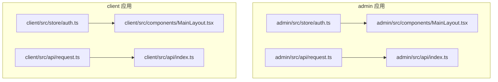
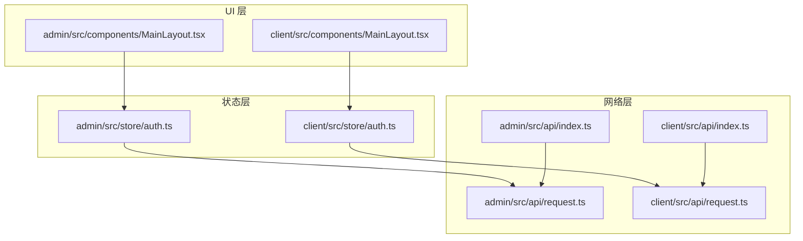
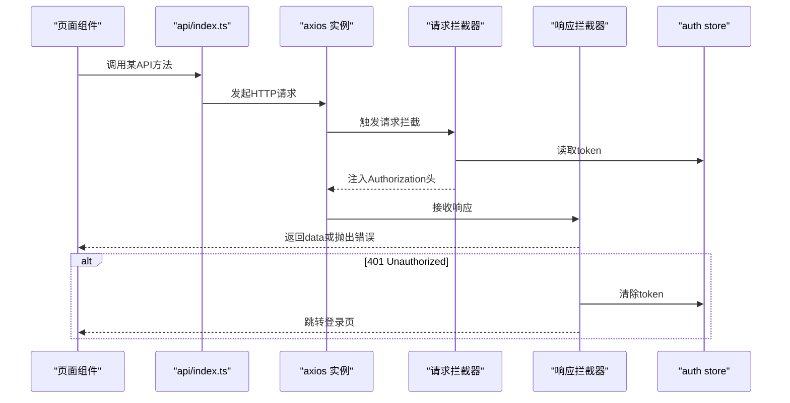
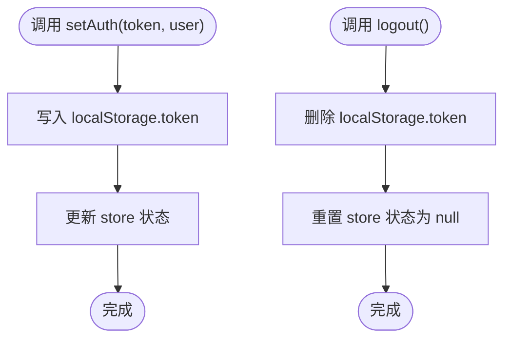
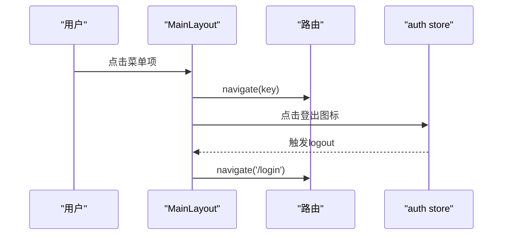
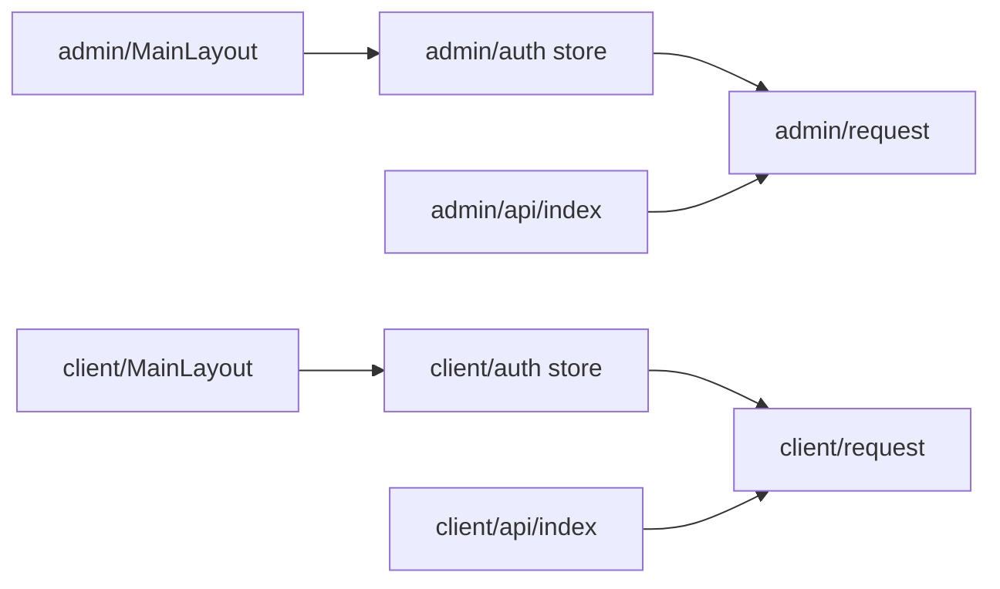

# 共享组件与工具

<cite>
**本文引用的文件**
- [frontend/admin/src/components/MainLayout.tsx](file://frontend/admin/src/components/MainLayout.tsx)
- [frontend/client/src/components/MainLayout.tsx](file://frontend/client/src/components/MainLayout.tsx)
- [frontend/admin/src/api/request.ts](file://frontend/admin/src/api/request.ts)
- [frontend/client/src/api/request.ts](file://frontend/client/src/api/request.ts)
- [frontend/admin/src/api/index.ts](file://frontend/admin/src/api/index.ts)
- [frontend/client/src/api/index.ts](file://frontend/client/src/api/index.ts)
- [frontend/admin/src/store/auth.ts](file://frontend/admin/src/store/auth.ts)
- [frontend/client/src/store/auth.ts](file://frontend/client/src/store/auth.ts)
</cite>

## 目录
1. [引言](#引言)
2. [项目结构](#项目结构)
3. [核心组件](#核心组件)
4. [架构总览](#架构总览)
5. [详细组件分析](#详细组件分析)
6. [依赖关系分析](#依赖关系分析)
7. [性能考量](#性能考量)
8. [故障排查指南](#故障排查指南)
9. [结论](#结论)
10. [附录](#附录)

## 引言
本文件聚焦ToolHub前端应用中两个应用（admin与client）共享的组件与工具，系统性梳理以下主题：  
- 主布局组件MainLayout的通用设计模式、响应式布局、导航结构与权限控制集成方式  
- API请求封装的设计，包括HTTP拦截器、错误处理、认证头管理  
- Zustand状态管理的设计模式，包括store结构、action设计、状态订阅与持久化  
- 工具函数库与类型定义的现状与建议  
- 组件复用策略、样式统一方案与主题配置管理  
- 代码组织规范、模块化设计与可维护性建议  

## 项目结构
前端采用双应用结构（admin与client），两者共享核心组件与工具层，分别位于各自src目录下。  
- 共享组件：MainLayout.tsx  
- 请求封装：api/request.ts、api/index.ts  
- 状态管理：store/auth.ts  
- 页面与路由：各应用独立页面与入口文件  

**图表来源**
- [frontend/admin/src/components/MainLayout.tsx:1-68](file://frontend/admin/src/components/MainLayout.tsx#L1-L68)
- [frontend/client/src/components/MainLayout.tsx:1-56](file://frontend/client/src/components/MainLayout.tsx#L1-L56)
- [frontend/admin/src/api/request.ts:1-28](file://frontend/admin/src/api/request.ts#L1-L28)
- [frontend/client/src/api/request.ts:1-28](file://frontend/client/src/api/request.ts#L1-L28)
- [frontend/admin/src/api/index.ts:1-60](file://frontend/admin/src/api/index.ts#L1-L60)
- [frontend/client/src/api/index.ts:1-36](file://frontend/client/src/api/index.ts#L1-L36)
- [frontend/admin/src/store/auth.ts:1-30](file://frontend/admin/src/store/auth.ts#L1-L30)
- [frontend/client/src/store/auth.ts:1-30](file://frontend/client/src/store/auth.ts#L1-L30)

**章节来源**
- [frontend/admin/src/components/MainLayout.tsx:1-68](file://frontend/admin/src/components/MainLayout.tsx#L1-L68)
- [frontend/client/src/components/MainLayout.tsx:1-56](file://frontend/client/src/components/MainLayout.tsx#L1-L56)
- [frontend/admin/src/api/request.ts:1-28](file://frontend/admin/src/api/request.ts#L1-L28)
- [frontend/client/src/api/request.ts:1-28](file://frontend/client/src/api/request.ts#L1-L28)
- [frontend/admin/src/api/index.ts:1-60](file://frontend/admin/src/api/index.ts#L1-L60)
- [frontend/client/src/api/index.ts:1-36](file://frontend/client/src/api/index.ts#L1-L36)
- [frontend/admin/src/store/auth.ts:1-30](file://frontend/admin/src/store/auth.ts#L1-L30)
- [frontend/client/src/store/auth.ts:1-30](file://frontend/client/src/store/auth.ts#L1-L30)

## 核心组件
本节聚焦MainLayout主布局组件在两个应用中的通用设计与差异点。

- 设计模式
  - 使用Ant Design Layout容器，拆分为Sider、Header、Content三段式结构，支持侧边菜单与顶部操作区
  - 通过useNavigate与useLocation实现基于路由的菜单选中与跳转
  - 通过useAuthStore集成权限控制与登出流程

- 响应式布局
  - 两应用均采用Sider宽度自定义与Content区域溢出滚动，适配不同屏幕尺寸
  - Header区域提供登出图标，点击后触发logout并跳转至登录页

- 导航结构
  - admin应用提供更丰富的管理类菜单项，涵盖Dashboard、用户、角色、技能、工具、审批、部门、审计日志等
  - client应用聚焦业务功能，包含首页、技能、工具、权限申请、我的申请等

- 权限控制
  - 登录态由Zustand store维护，登出时清除本地token并重置状态
  - API层通过拦截器自动附加Authorization头；401时清理token并跳转登录页

**章节来源**
- [frontend/admin/src/components/MainLayout.tsx:18-27](file://frontend/admin/src/components/MainLayout.tsx#L18-L27)
- [frontend/admin/src/components/MainLayout.tsx:33-41](file://frontend/admin/src/components/MainLayout.tsx#L33-L41)
- [frontend/admin/src/components/MainLayout.tsx:44-66](file://frontend/admin/src/components/MainLayout.tsx#L44-L66)
- [frontend/client/src/components/MainLayout.tsx:15-21](file://frontend/client/src/components/MainLayout.tsx#L15-L21)
- [frontend/client/src/components/MainLayout.tsx:27-35](file://frontend/client/src/components/MainLayout.tsx#L27-L35)
- [frontend/client/src/components/MainLayout.tsx:38-54](file://frontend/client/src/components/MainLayout.tsx#L38-L54)

## 架构总览
下图展示两个应用共享的组件与工具在运行时的交互关系。

**图表来源**
- [frontend/admin/src/components/MainLayout.tsx:1-68](file://frontend/admin/src/components/MainLayout.tsx#L1-L68)
- [frontend/client/src/components/MainLayout.tsx:1-56](file://frontend/client/src/components/MainLayout.tsx#L1-L56)
- [frontend/admin/src/store/auth.ts:1-30](file://frontend/admin/src/store/auth.ts#L1-L30)
- [frontend/client/src/store/auth.ts:1-30](file://frontend/client/src/store/auth.ts#L1-L30)
- [frontend/admin/src/api/request.ts:1-28](file://frontend/admin/src/api/request.ts#L1-L28)
- [frontend/client/src/api/request.ts:1-28](file://frontend/client/src/api/request.ts#L1-L28)
- [frontend/admin/src/api/index.ts:1-60](file://frontend/admin/src/api/index.ts#L1-L60)
- [frontend/client/src/api/index.ts:1-36](file://frontend/client/src/api/index.ts#L1-L36)

## 详细组件分析

### API请求封装与错误处理
- 基础配置
  - 通过axios创建实例，设置基础URL与超时时间
- 请求拦截器
  - 自动从localStorage读取token并在Authorization头中附加Bearer前缀
- 响应拦截器
  - 成功时返回data字段，失败时对401进行全局处理：移除token并跳转登录页，其余错误透传
- 模块化API导出
  - admin与client分别导出各自的API模块（如authApi、userApi、roleApi、skillApi、toolApi、approvalApi、departmentApi、auditApi等），统一管理端点与参数

**图表来源**
- [frontend/admin/src/api/request.ts:3-6](file://frontend/admin/src/api/request.ts#L3-L6)
- [frontend/admin/src/api/request.ts:8-14](file://frontend/admin/src/api/request.ts#L8-L14)
- [frontend/admin/src/api/request.ts:16-25](file://frontend/admin/src/api/request.ts#L16-L25)
- [frontend/admin/src/api/index.ts:3-9](file://frontend/admin/src/api/index.ts#L3-L9)
- [frontend/client/src/api/request.ts:3-6](file://frontend/client/src/api/request.ts#L3-L6)
- [frontend/client/src/api/request.ts:8-14](file://frontend/client/src/api/request.ts#L8-L14)
- [frontend/client/src/api/request.ts:16-25](file://frontend/client/src/api/request.ts#L16-L25)
- [frontend/client/src/api/index.ts:3-9](file://frontend/client/src/api/index.ts#L3-L9)

**章节来源**
- [frontend/admin/src/api/request.ts:1-28](file://frontend/admin/src/api/request.ts#L1-L28)
- [frontend/client/src/api/request.ts:1-28](file://frontend/client/src/api/request.ts#L1-L28)
- [frontend/admin/src/api/index.ts:1-60](file://frontend/admin/src/api/index.ts#L1-L60)
- [frontend/client/src/api/index.ts:1-36](file://frontend/client/src/api/index.ts#L1-L36)

### Zustand状态管理（认证）
- 数据模型
  - token：字符串或null，来源于localStorage初始化
  - user：用户信息对象（含id、name、email、avatar、is_admin）
- 行为方法
  - setAuth：写入localStorage并更新状态
  - logout：移除localStorage并清空状态
- 订阅与持久化
  - 通过useAuthStore在组件中订阅状态变化
  - 本地持久化依赖localStorage

**图表来源**
- [frontend/admin/src/store/auth.ts:18-29](file://frontend/admin/src/store/auth.ts#L18-L29)
- [frontend/client/src/store/auth.ts:18-29](file://frontend/client/src/store/auth.ts#L18-L29)

**章节来源**
- [frontend/admin/src/store/auth.ts:1-30](file://frontend/admin/src/store/auth.ts#L1-L30)
- [frontend/client/src/store/auth.ts:1-30](file://frontend/client/src/store/auth.ts#L1-L30)

### 主布局组件（MainLayout）
- 结构组成
  - Sider：标题栏与菜单项；admin应用使用深色主题，client应用使用浅色主题并带右侧边框
  - Header：右上角登出图标，点击后调用logout并跳转登录页
  - Content：承载子页面内容，统一内边距与圆角背景
- 菜单项
  - admin应用：Dashboard、用户管理、角色管理、Skills管理、Tools管理、审批管理、部门管理、审计日志
  - client应用：首页、Skills、Tools、权限申请、我的申请
- 交互逻辑
  - 通过selectedKeys绑定当前路径，点击菜单项触发navigate跳转

**图表来源**
- [frontend/admin/src/components/MainLayout.tsx:33-41](file://frontend/admin/src/components/MainLayout.tsx#L33-L41)
- [frontend/admin/src/components/MainLayout.tsx:44-66](file://frontend/admin/src/components/MainLayout.tsx#L44-L66)
- [frontend/client/src/components/MainLayout.tsx:27-35](file://frontend/client/src/components/MainLayout.tsx#L27-L35)
- [frontend/client/src/components/MainLayout.tsx:38-54](file://frontend/client/src/components/MainLayout.tsx#L38-L54)

**章节来源**
- [frontend/admin/src/components/MainLayout.tsx:1-68](file://frontend/admin/src/components/MainLayout.tsx#L1-L68)
- [frontend/client/src/components/MainLayout.tsx:1-56](file://frontend/client/src/components/MainLayout.tsx#L1-L56)

### 类型定义与工具函数现状
- 类型定义
  - 当前仓库未发现集中化的类型定义文件（如shared/types），auth store中的User接口为局部定义
- 工具函数
  - 当前仓库未发现独立的utils目录或工具函数库文件
- 建议
  - 在shared目录下建立types.ts与utils目录，统一导出接口与工具函数，提升跨应用一致性与可维护性

**章节来源**
- [frontend/admin/src/store/auth.ts:3-9](file://frontend/admin/src/store/auth.ts#L3-L9)
- [frontend/client/src/store/auth.ts:3-9](file://frontend/client/src/store/auth.ts#L3-L9)

## 依赖关系分析
- 组件依赖
  - MainLayout依赖useNavigate、useLocation与useAuthStore
- 网络依赖
  - 所有API方法通过api/index.ts导出，底层依赖api/request.ts提供的axios实例与拦截器
- 状态依赖
  - auth store依赖localStorage进行token持久化，供拦截器读取

**图表来源**
- [frontend/admin/src/components/MainLayout.tsx:13-14](file://frontend/admin/src/components/MainLayout.tsx#L13-L14)
- [frontend/client/src/components/MainLayout.tsx:10-11](file://frontend/client/src/components/MainLayout.tsx#L10-L11)
- [frontend/admin/src/store/auth.ts:1-30](file://frontend/admin/src/store/auth.ts#L1-L30)
- [frontend/client/src/store/auth.ts:1-30](file://frontend/client/src/store/auth.ts#L1-L30)
- [frontend/admin/src/api/request.ts:1-28](file://frontend/admin/src/api/request.ts#L1-L28)
- [frontend/client/src/api/request.ts:1-28](file://frontend/client/src/api/request.ts#L1-L28)
- [frontend/admin/src/api/index.ts:1-60](file://frontend/admin/src/api/index.ts#L1-L60)
- [frontend/client/src/api/index.ts:1-36](file://frontend/client/src/api/index.ts#L1-L36)

**章节来源**
- [frontend/admin/src/components/MainLayout.tsx:1-68](file://frontend/admin/src/components/MainLayout.tsx#L1-L68)
- [frontend/client/src/components/MainLayout.tsx:1-56](file://frontend/client/src/components/MainLayout.tsx#L1-L56)
- [frontend/admin/src/store/auth.ts:1-30](file://frontend/admin/src/store/auth.ts#L1-L30)
- [frontend/client/src/store/auth.ts:1-30](file://frontend/client/src/store/auth.ts#L1-L30)
- [frontend/admin/src/api/request.ts:1-28](file://frontend/admin/src/api/request.ts#L1-L28)
- [frontend/client/src/api/request.ts:1-28](file://frontend/client/src/api/request.ts#L1-L28)
- [frontend/admin/src/api/index.ts:1-60](file://frontend/admin/src/api/index.ts#L1-L60)
- [frontend/client/src/api/index.ts:1-36](file://frontend/client/src/api/index.ts#L1-L36)

## 性能考量
- 请求拦截器避免重复序列化与多余计算，保持轻量
- localStorage读写为O(1)，对性能影响极小
- API模块化导出便于按需加载与Tree Shaking优化
- 建议
  - 对高频接口增加缓存策略（如内存缓存或SWR）
  - 对分页列表增加防抖与去重逻辑，减少重复请求

## 故障排查指南
- 401未授权
  - 现象：收到401后自动清除token并跳转登录页
  - 处理：确认token是否过期或被撤销；检查拦截器是否正确注入Authorization头
- 登录后仍提示未登录
  - 现象：进入页面即被重定向到登录页
  - 处理：检查localStorage中token是否存在；确认setAuth调用是否成功写入
- 菜单不跳转
  - 现象：点击菜单无反应
  - 处理：确认selectedKeys绑定的location.pathname是否正确；检查navigate调用是否执行

**章节来源**
- [frontend/admin/src/api/request.ts:16-25](file://frontend/admin/src/api/request.ts#L16-L25)
- [frontend/client/src/api/request.ts:16-25](file://frontend/client/src/api/request.ts#L16-L25)
- [frontend/admin/src/store/auth.ts:18-29](file://frontend/admin/src/store/auth.ts#L18-L29)
- [frontend/client/src/store/auth.ts:18-29](file://frontend/client/src/store/auth.ts#L18-L29)
- [frontend/admin/src/components/MainLayout.tsx:33-41](file://frontend/admin/src/components/MainLayout.tsx#L33-L41)
- [frontend/client/src/components/MainLayout.tsx:27-35](file://frontend/client/src/components/MainLayout.tsx#L27-L35)

## 结论
- admin与client应用共享了统一的主布局、API封装与状态管理方案，具备良好的复用性与一致性
- 建议进一步完善类型定义与工具函数库，引入集中式types与utils，提升跨应用协作效率
- 可在现有基础上扩展缓存、防抖与主题配置管理，持续优化用户体验与可维护性

## 附录
- 代码组织规范与模块化建议
  - 将公共类型定义迁移至shared/types，统一导出
  - 将通用工具函数迁移至shared/utils，按功能拆分模块
  - 保持api/index.ts的模块化导出风格，确保按需导入与Tree Shaking
- 样式统一与主题配置
  - 建议引入CSS变量或主题切换机制，统一颜色、字体与间距
  - 在MainLayout中抽象主题配置，避免在组件内硬编码样式
- 可维护性考虑
  - 对API方法增加类型约束与参数校验
  - 对store action增加边界检查与错误日志
  - 对MainLayout菜单项进行配置化管理，便于动态扩展