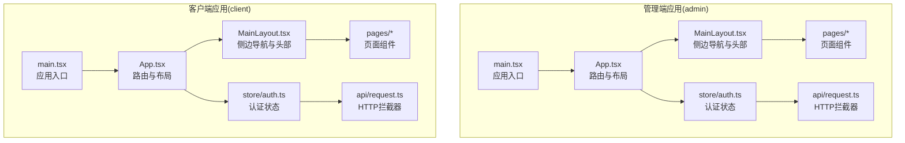
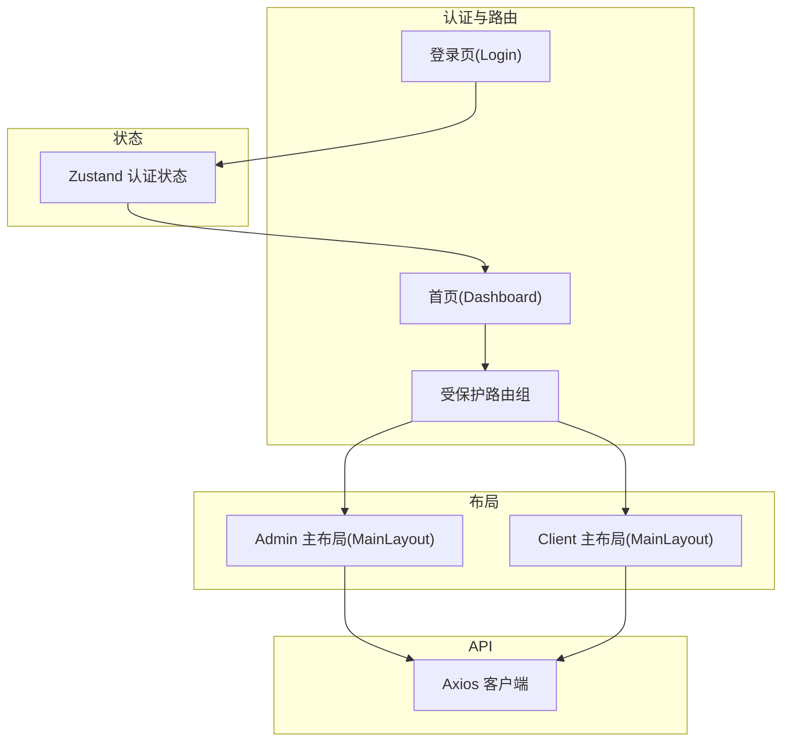
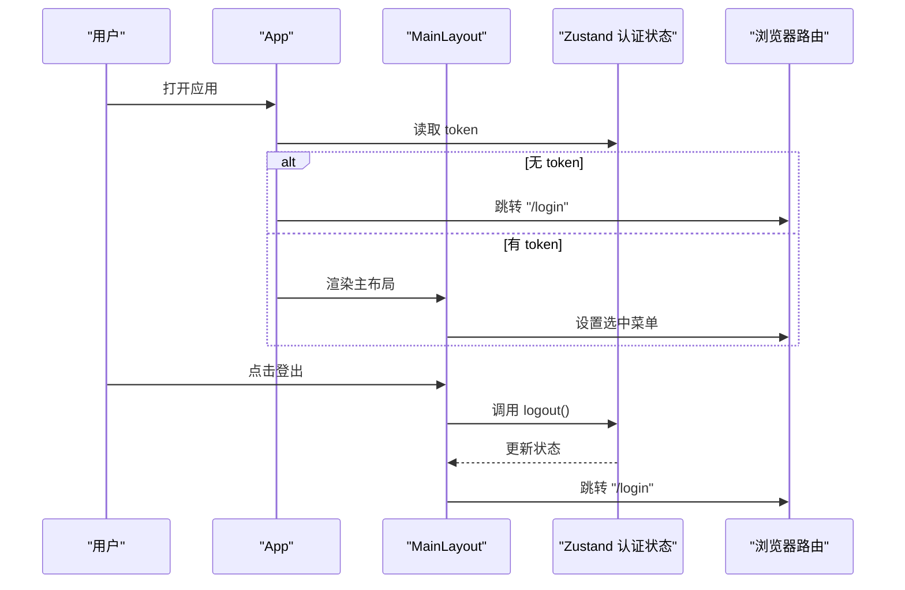
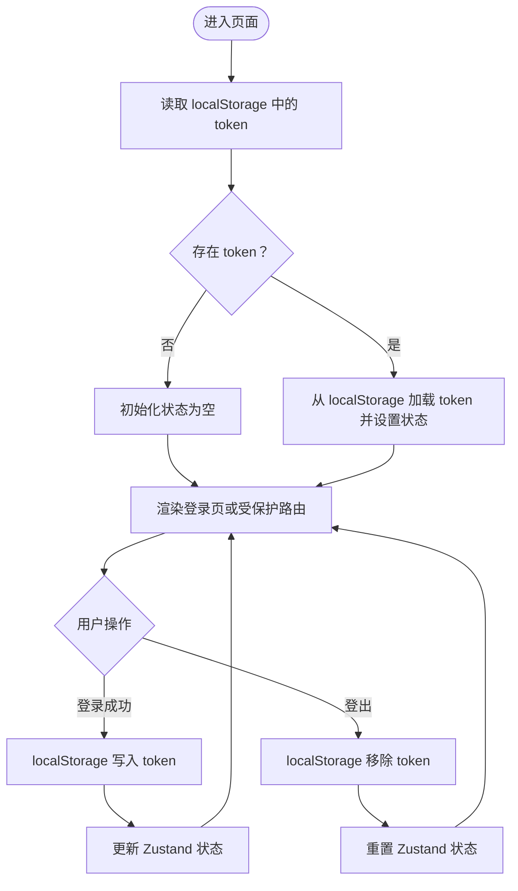
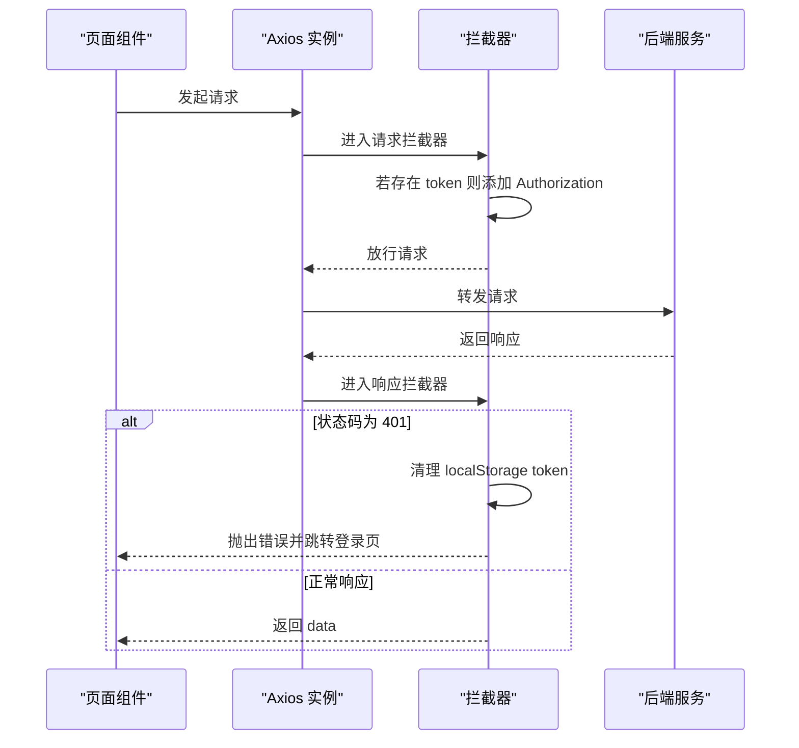
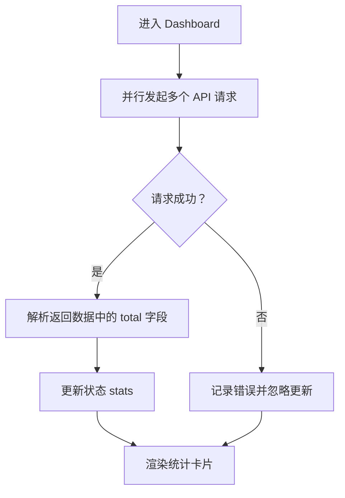
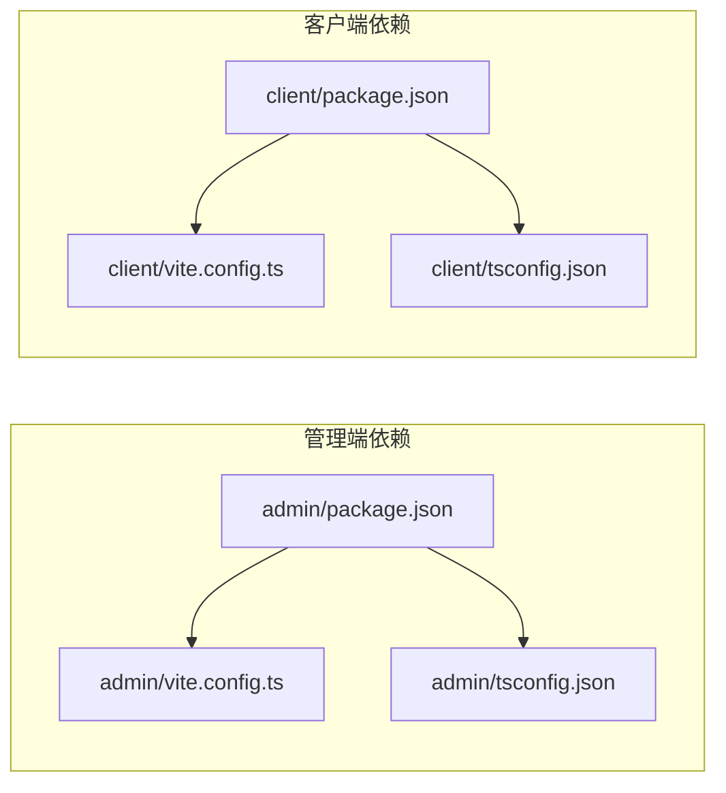

# 前端应用架构

<cite>
**本文档引用的文件**
- [frontend/admin/package.json](file://frontend/admin/package.json)
- [frontend/client/package.json](file://frontend/client/package.json)
- [frontend/admin/vite.config.ts](file://frontend/admin/vite.config.ts)
- [frontend/client/vite.config.ts](file://frontend/client/vite.config.ts)
- [frontend/admin/tsconfig.json](file://frontend/admin/tsconfig.json)
- [frontend/client/tsconfig.json](file://frontend/client/tsconfig.json)
- [frontend/admin/src/main.tsx](file://frontend/admin/src/main.tsx)
- [frontend/client/src/main.tsx](file://frontend/client/src/main.tsx)
- [frontend/admin/src/App.tsx](file://frontend/admin/src/App.tsx)
- [frontend/client/src/App.tsx](file://frontend/client/src/App.tsx)
- [frontend/admin/src/components/MainLayout.tsx](file://frontend/admin/src/components/MainLayout.tsx)
- [frontend/client/src/components/MainLayout.tsx](file://frontend/client/src/components/MainLayout.tsx)
- [frontend/admin/src/store/auth.ts](file://frontend/admin/src/store/auth.ts)
- [frontend/client/src/store/auth.ts](file://frontend/client/src/store/auth.ts)
- [frontend/admin/src/api/request.ts](file://frontend/admin/src/api/request.ts)
- [frontend/client/src/api/request.ts](file://frontend/client/src/api/request.ts)
- [frontend/admin/src/pages/Dashboard.tsx](file://frontend/admin/src/pages/Dashboard.tsx)
- [frontend/client/src/pages/Dashboard.tsx](file://frontend/client/src/pages/Dashboard.tsx)
</cite>

## 目录
1. [引言](#引言)
2. [项目结构](#项目结构)
3. [核心组件](#核心组件)
4. [架构总览](#架构总览)
5. [详细组件分析](#详细组件分析)
6. [依赖关系分析](#依赖关系分析)
7. [性能考虑](#性能考虑)
8. [故障排除指南](#故障排除指南)
9. [结论](#结论)
10. [附录](#附录)

## 引言
本文件面向ToolHub前端应用，系统性阐述两个独立前端应用（客户端与管理端）的设计思路、技术架构与实现细节。重点覆盖以下方面：
- 应用功能定位与用户群体：客户端面向普通员工，管理端面向管理员与HR团队
- React应用架构：组件结构、状态管理、路由设计、API集成
- Ant Design组件库使用策略与国际化配置
- Zustand状态管理的状态设计模式、数据流与组件通信
- 构建配置：Vite、TypeScript、开发服务器代理
- 组件开发规范、样式设计规范、代码组织结构
- 性能优化策略与用户体验设计原则

## 项目结构
ToolHub采用双前端应用结构，admin与client分别部署在不同端口，共享相似的技术栈与目录约定：
- admin：管理后台，提供用户、角色、技能、工具、审批、部门、审计日志等管理能力
- client：业务前台，提供技能浏览、工具浏览、权限申请、我的申请等功能
- 共同点：均使用React 19、React Router 7、Ant Design 5、Axios、Zustand、Day.js；通过Vite进行开发与构建；TypeScript严格模式；Ant Design本地化为简体中文

图表来源
- [frontend/admin/src/main.tsx:1-18](file://frontend/admin/src/main.tsx#L1-L18)
- [frontend/admin/src/App.tsx:1-44](file://frontend/admin/src/App.tsx#L1-L44)
- [frontend/admin/src/components/MainLayout.tsx:1-68](file://frontend/admin/src/components/MainLayout.tsx#L1-L68)
- [frontend/admin/src/store/auth.ts:1-30](file://frontend/admin/src/store/auth.ts#L1-L30)
- [frontend/admin/src/api/request.ts:1-28](file://frontend/admin/src/api/request.ts#L1-L28)
- [frontend/client/src/main.tsx:1-18](file://frontend/client/src/main.tsx#L1-L18)
- [frontend/client/src/App.tsx:1-42](file://frontend/client/src/App.tsx#L1-L42)
- [frontend/client/src/components/MainLayout.tsx:1-56](file://frontend/client/src/components/MainLayout.tsx#L1-L56)
- [frontend/client/src/store/auth.ts:1-30](file://frontend/client/src/store/auth.ts#L1-L30)
- [frontend/client/src/api/request.ts:1-28](file://frontend/client/src/api/request.ts#L1-L28)

章节来源
- [frontend/admin/package.json:1-29](file://frontend/admin/package.json#L1-L29)
- [frontend/client/package.json:1-29](file://frontend/client/package.json#L1-L29)
- [frontend/admin/vite.config.ts:1-15](file://frontend/admin/vite.config.ts#L1-L15)
- [frontend/client/vite.config.ts:1-15](file://frontend/client/vite.config.ts#L1-L15)
- [frontend/admin/tsconfig.json:1-25](file://frontend/admin/tsconfig.json#L1-L25)
- [frontend/client/tsconfig.json:1-20](file://frontend/client/tsconfig.json#L1-L20)

## 核心组件
- 应用入口(main.tsx)：统一引入Ant Design本地化、BrowserRouter与根组件App
- 路由与布局(App.tsx)：根据登录态决定渲染登录页或主布局；主布局(MainLayout.tsx)提供侧边菜单与头部登出
- 状态管理(auth.ts)：基于Zustand的认证状态，持久化到localStorage
- API层(request.ts)：Axios实例封装，统一设置基础路径与请求头，处理401自动登出
- 页面组件：Dashboard等页面通过并行请求聚合统计数据，提升首屏体验

章节来源
- [frontend/admin/src/main.tsx:1-18](file://frontend/admin/src/main.tsx#L1-L18)
- [frontend/client/src/main.tsx:1-18](file://frontend/client/src/main.tsx#L1-L18)
- [frontend/admin/src/App.tsx:1-44](file://frontend/admin/src/App.tsx#L1-L44)
- [frontend/client/src/App.tsx:1-42](file://frontend/client/src/App.tsx#L1-L42)
- [frontend/admin/src/components/MainLayout.tsx:1-68](file://frontend/admin/src/components/MainLayout.tsx#L1-L68)
- [frontend/client/src/components/MainLayout.tsx:1-56](file://frontend/client/src/components/MainLayout.tsx#L1-L56)
- [frontend/admin/src/store/auth.ts:1-30](file://frontend/admin/src/store/auth.ts#L1-L30)
- [frontend/client/src/store/auth.ts:1-30](file://frontend/client/src/store/auth.ts#L1-L30)
- [frontend/admin/src/api/request.ts:1-28](file://frontend/admin/src/api/request.ts#L1-L28)
- [frontend/client/src/api/request.ts:1-28](file://frontend/client/src/api/request.ts#L1-L28)

## 架构总览
双应用共享“入口-路由-布局-状态-API-页面”的通用架构，差异体现在：
- 功能范围：client聚焦权限与资源浏览，admin聚焦组织与治理
- 导航结构：admin包含用户、角色、技能、工具、审批、部门、审计日志；client包含首页、技能、工具、权限申请、我的申请
- 认证流程：登录成功后写入token并跳转至对应首页，未登录访问受保护路由重定向至登录页

图表来源
- [frontend/admin/src/App.tsx:1-44](file://frontend/admin/src/App.tsx#L1-L44)
- [frontend/client/src/App.tsx:1-42](file://frontend/client/src/App.tsx#L1-L42)
- [frontend/admin/src/components/MainLayout.tsx:1-68](file://frontend/admin/src/components/MainLayout.tsx#L1-L68)
- [frontend/client/src/components/MainLayout.tsx:1-56](file://frontend/client/src/components/MainLayout.tsx#L1-L56)
- [frontend/admin/src/store/auth.ts:1-30](file://frontend/admin/src/store/auth.ts#L1-L30)
- [frontend/client/src/store/auth.ts:1-30](file://frontend/client/src/store/auth.ts#L1-L30)
- [frontend/admin/src/api/request.ts:1-28](file://frontend/admin/src/api/request.ts#L1-L28)
- [frontend/client/src/api/request.ts:1-28](file://frontend/client/src/api/request.ts#L1-L28)

## 详细组件分析

### 路由与布局（App与MainLayout）
- 登录态判断：App根据token是否存在决定渲染登录页或主布局
- 主布局：Admin与Client共用Layout结构，但菜单项与主题风格略有差异
- 头部登出：统一触发logout并跳转登录页

图表来源
- [frontend/admin/src/App.tsx:14-41](file://frontend/admin/src/App.tsx#L14-L41)
- [frontend/client/src/App.tsx:13-39](file://frontend/client/src/App.tsx#L13-L39)
- [frontend/admin/src/components/MainLayout.tsx:33-67](file://frontend/admin/src/components/MainLayout.tsx#L33-L67)
- [frontend/client/src/components/MainLayout.tsx:27-55](file://frontend/client/src/components/MainLayout.tsx#L27-L55)
- [frontend/admin/src/store/auth.ts:18-29](file://frontend/admin/src/store/auth.ts#L18-L29)
- [frontend/client/src/store/auth.ts:18-29](file://frontend/client/src/store/auth.ts#L18-L29)

章节来源
- [frontend/admin/src/App.tsx:1-44](file://frontend/admin/src/App.tsx#L1-L44)
- [frontend/client/src/App.tsx:1-42](file://frontend/client/src/App.tsx#L1-L42)
- [frontend/admin/src/components/MainLayout.tsx:1-68](file://frontend/admin/src/components/MainLayout.tsx#L1-L68)
- [frontend/client/src/components/MainLayout.tsx:1-56](file://frontend/client/src/components/MainLayout.tsx#L1-L56)

### 状态管理（Zustand）
- 数据模型：token、用户信息
- 行为接口：setAuth(token,user)、logout()
- 持久化：localStorage存储token，刷新后恢复登录态
- 使用方式：各页面通过useAuthStore选择器订阅token，控制路由与UI

图表来源
- [frontend/admin/src/store/auth.ts:18-29](file://frontend/admin/src/store/auth.ts#L18-L29)
- [frontend/client/src/store/auth.ts:18-29](file://frontend/client/src/store/auth.ts#L18-L29)

章节来源
- [frontend/admin/src/store/auth.ts:1-30](file://frontend/admin/src/store/auth.ts#L1-L30)
- [frontend/client/src/store/auth.ts:1-30](file://frontend/client/src/store/auth.ts#L1-L30)

### API集成（Axios拦截器）
- 基础配置：baseURL指向“/api”，统一超时时间
- 请求拦截：自动附加Authorization: Bearer token
- 响应拦截：401时清理token并跳转登录页；其他错误透传
- 适用范围：admin与client共享同一拦截器逻辑

图表来源
- [frontend/admin/src/api/request.ts:3-25](file://frontend/admin/src/api/request.ts#L3-L25)
- [frontend/client/src/api/request.ts:3-25](file://frontend/client/src/api/request.ts#L3-L25)

章节来源
- [frontend/admin/src/api/request.ts:1-28](file://frontend/admin/src/api/request.ts#L1-L28)
- [frontend/client/src/api/request.ts:1-28](file://frontend/client/src/api/request.ts#L1-L28)

### 页面组件（Dashboard）
- 管理端Dashboard：并行请求用户、技能、工具、待审批数量，展示统计卡片
- 客户端Dashboard：并行请求权限、技能、工具总量，展示个人可用资源与全局资源

图表来源
- [frontend/admin/src/pages/Dashboard.tsx:9-29](file://frontend/admin/src/pages/Dashboard.tsx#L9-L29)
- [frontend/client/src/pages/Dashboard.tsx:9-28](file://frontend/client/src/pages/Dashboard.tsx#L9-L28)

章节来源
- [frontend/admin/src/pages/Dashboard.tsx:1-51](file://frontend/admin/src/pages/Dashboard.tsx#L1-L51)
- [frontend/client/src/pages/Dashboard.tsx:1-50](file://frontend/client/src/pages/Dashboard.tsx#L1-L50)

### Ant Design使用策略与主题配置
- 国际化：ConfigProvider包裹应用，locale设为zhCN
- 组件使用：Layout、Menu、Card、Statistic等组件按需组合
- 主题风格：Admin采用深色侧边栏，Client采用浅色侧边栏与简洁边框
- 图标：Ant Design Icons提供统一图标集，菜单项与统计卡片前缀一致

章节来源
- [frontend/admin/src/main.tsx:9-16](file://frontend/admin/src/main.tsx#L9-L16)
- [frontend/client/src/main.tsx:9-16](file://frontend/client/src/main.tsx#L9-L16)
- [frontend/admin/src/components/MainLayout.tsx:44-66](file://frontend/admin/src/components/MainLayout.tsx#L44-L66)
- [frontend/client/src/components/MainLayout.tsx:38-54](file://frontend/client/src/components/MainLayout.tsx#L38-L54)

## 依赖关系分析
- 依赖一致性：admin与client在React、React Router、Ant Design、Axios、Zustand版本上保持一致
- 开发工具：Vite、@vitejs/plugin-react、TypeScript
- 代理配置：均将/api代理至后端服务localhost:8000，便于前后端联调
- TypeScript路径映射：admin启用@/*路径别名，client默认包含src

图表来源
- [frontend/admin/package.json:1-29](file://frontend/admin/package.json#L1-L29)
- [frontend/client/package.json:1-29](file://frontend/client/package.json#L1-L29)
- [frontend/admin/vite.config.ts:1-15](file://frontend/admin/vite.config.ts#L1-L15)
- [frontend/client/vite.config.ts:1-15](file://frontend/client/vite.config.ts#L1-L15)
- [frontend/admin/tsconfig.json:19-21](file://frontend/admin/tsconfig.json#L19-L21)
- [frontend/client/tsconfig.json:1-20](file://frontend/client/tsconfig.json#L1-L20)

章节来源
- [frontend/admin/package.json:1-29](file://frontend/admin/package.json#L1-L29)
- [frontend/client/package.json:1-29](file://frontend/client/package.json#L1-L29)
- [frontend/admin/vite.config.ts:1-15](file://frontend/admin/vite.config.ts#L1-L15)
- [frontend/client/vite.config.ts:1-15](file://frontend/client/vite.config.ts#L1-L15)
- [frontend/admin/tsconfig.json:1-25](file://frontend/admin/tsconfig.json#L1-L25)
- [frontend/client/tsconfig.json:1-20](file://frontend/client/tsconfig.json#L1-L20)

## 性能考虑
- 首屏加载
  - Dashboard并行请求：减少串行等待，缩短首屏渲染时间
  - 仅加载必要字段：通过分页参数page/page_size降低初始数据量
- 状态管理
  - Zustand选择器订阅：避免无关状态变更导致的重渲染
  - localStorage持久化：减少重复登录成本
- 构建与开发
  - Vite快速冷启动与热更新
  - TypeScript隔离模块与bundler解析，提升类型安全与打包效率
- UI交互
  - Ant Design组件内置动画与过渡，保证流畅体验
  - 统一图标与间距，降低视觉负担

## 故障排除指南
- 登录后仍跳回登录页
  - 检查localStorage中token是否正确写入
  - 确认后端返回的token有效且未过期
  - 参考：[frontend/admin/src/store/auth.ts:21-23](file://frontend/admin/src/store/auth.ts#L21-L23)，[frontend/client/src/store/auth.ts:21-23](file://frontend/client/src/store/auth.ts#L21-L23)
- 401未授权
  - Axios拦截器会自动清除token并跳转登录页
  - 检查请求头Authorization是否携带token
  - 参考：[frontend/admin/src/api/request.ts:8-14](file://frontend/admin/src/api/request.ts#L8-L14)，[frontend/client/src/api/request.ts:8-14](file://frontend/client/src/api/request.ts#L8-L14)
- 代理失败无法访问后端
  - 确认Vite代理配置指向正确的后端地址
  - 参考：[frontend/admin/vite.config.ts:7-12](file://frontend/admin/vite.config.ts#L7-L12)，[frontend/client/vite.config.ts:7-12](file://frontend/client/vite.config.ts#L7-L12)
- TypeScript路径别名无效
  - 管理端启用@/*路径别名，确保导入路径正确
  - 参考：[frontend/admin/tsconfig.json:19-21](file://frontend/admin/tsconfig.json#L19-L21)

章节来源
- [frontend/admin/src/store/auth.ts:18-29](file://frontend/admin/src/store/auth.ts#L18-L29)
- [frontend/client/src/store/auth.ts:18-29](file://frontend/client/src/store/auth.ts#L18-L29)
- [frontend/admin/src/api/request.ts:8-25](file://frontend/admin/src/api/request.ts#L8-L25)
- [frontend/client/src/api/request.ts:8-25](file://frontend/client/src/api/request.ts#L8-L25)
- [frontend/admin/vite.config.ts:6-13](file://frontend/admin/vite.config.ts#L6-L13)
- [frontend/client/vite.config.ts:6-13](file://frontend/client/vite.config.ts#L6-L13)
- [frontend/admin/tsconfig.json:19-21](file://frontend/admin/tsconfig.json#L19-L21)

## 结论
ToolHub前端采用清晰的双应用架构：admin负责组织与治理，client专注权限与资源使用。通过React+Ant Design+Zustand+Axios+Vite的组合，实现了高内聚低耦合的模块化设计。Dashboard并行请求与Zustand轻量状态管理提升了性能与可维护性。建议后续在组件层面进一步细化类型约束与错误边界，并完善单元测试与端到端测试以保障质量。

## 附录
- 组件开发规范
  - 统一使用Ant Design组件，保持视觉与交互一致性
  - 页面组件尽量无副作用，将异步逻辑集中在effect中
  - 使用useNavigate/useLocation进行路由跳转，避免硬编码路径
- 样式设计规范
  - 采用Ant Design默认主题变量，避免过度定制
  - 侧边栏宽度与边框在admin/client间保持差异化以区分功能域
- 代码组织结构
  - src下按api、components、pages、store、hooks、utils分类
  - 路由与布局分离，页面组件专注于业务逻辑
- 构建与发布
  - 开发：npm run dev（admin:5174，client:5173）
  - 构建：npm run build（先TypeScript编译再Vite打包）
  - 预览：npm run preview