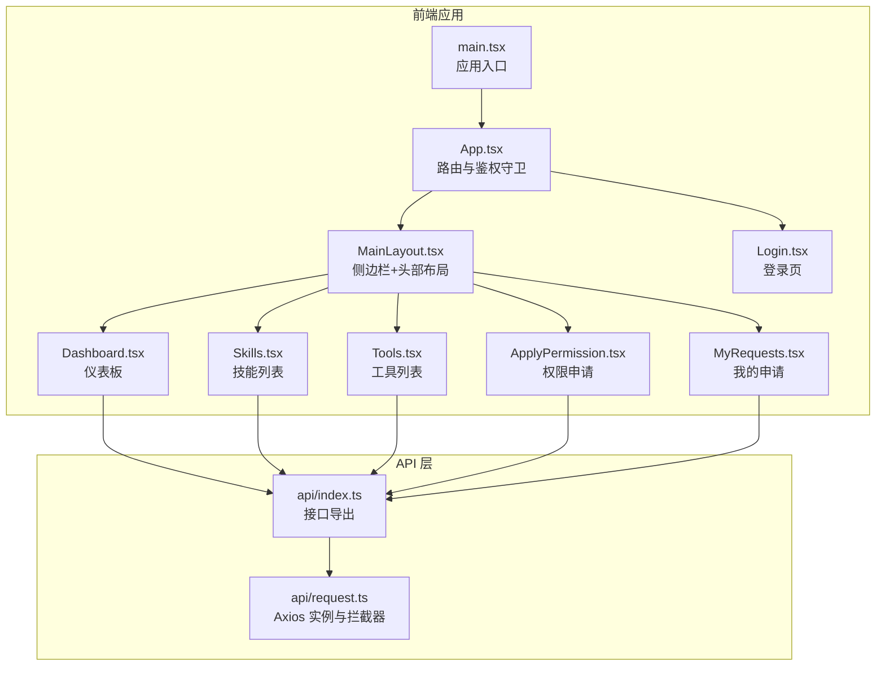
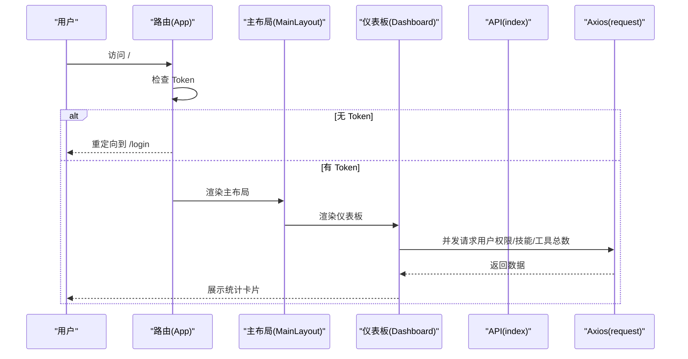
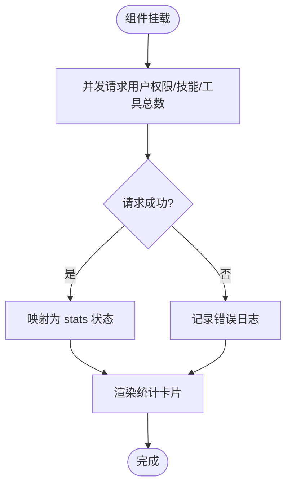
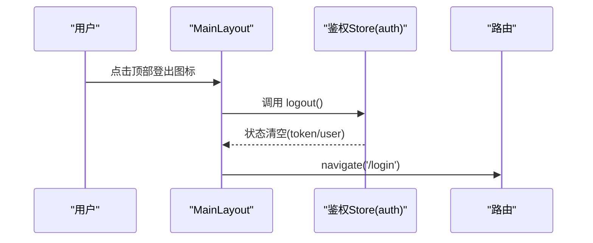
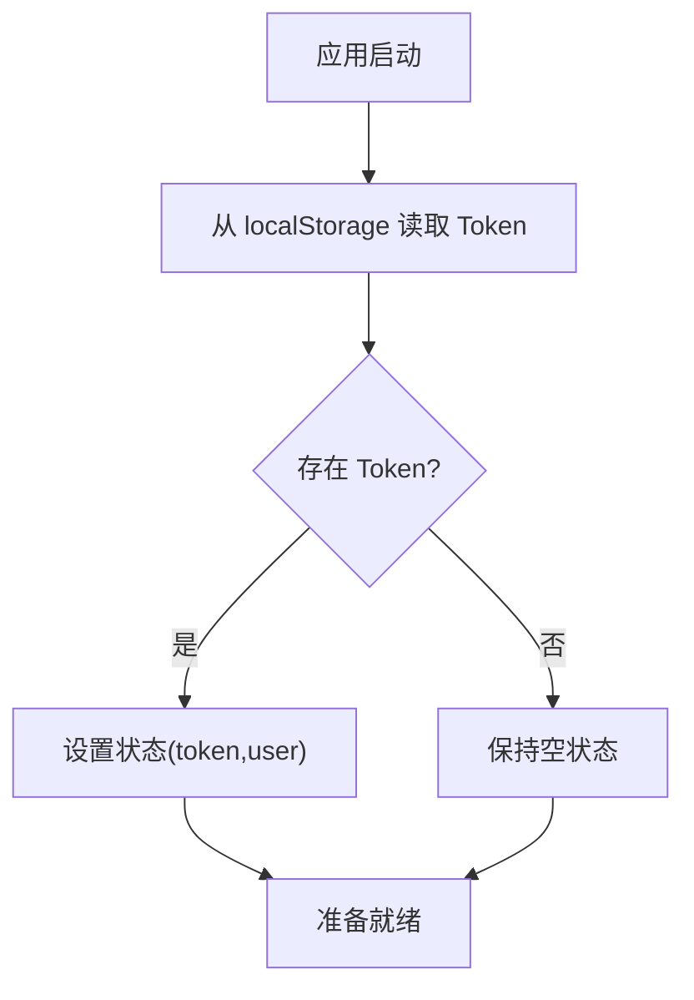
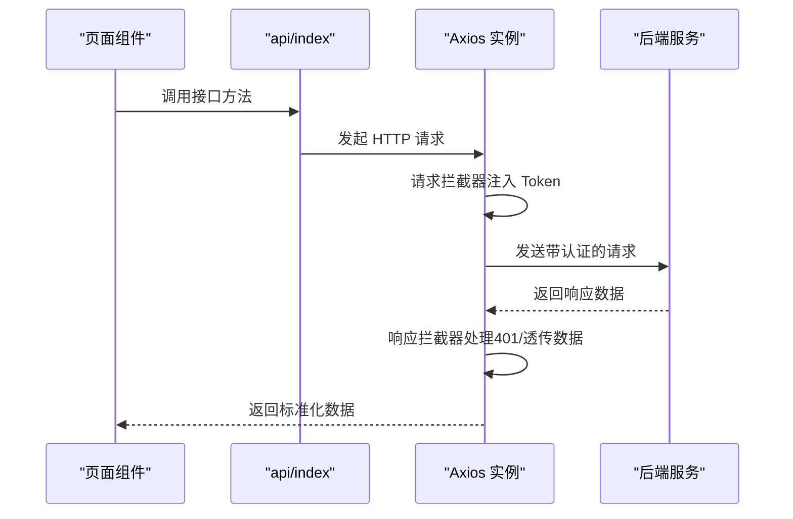
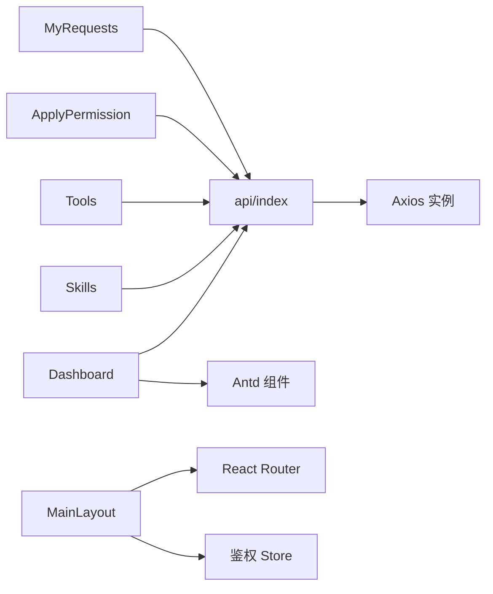

# 仪表板页面

<cite>
**本文引用的文件**
- [Dashboard.tsx](file://frontend/client/src/pages/Dashboard.tsx)
- [MainLayout.tsx](file://frontend/client/src/components/MainLayout.tsx)
- [auth.ts](file://frontend/client/src/store/auth.ts)
- [index.ts](file://frontend/client/src/api/index.ts)
- [request.ts](file://frontend/client/src/api/request.ts)
- [App.tsx](file://frontend/client/src/App.tsx)
- [main.tsx](file://frontend/client/src/main.tsx)
- [Skills.tsx](file://frontend/client/src/pages/Skills.tsx)
- [Tools.tsx](file://frontend/client/src/pages/Tools.tsx)
- [ApplyPermission.tsx](file://frontend/client/src/pages/ApplyPermission.tsx)
- [MyRequests.tsx](file://frontend/client/src/pages/MyRequests.tsx)
- [Login.tsx](file://frontend/client/src/pages/Login.tsx)
- [index.css](file://frontend/client/src/index.css)
</cite>

## 目录
1. [简介](#简介)
2. [项目结构](#项目结构)
3. [核心组件](#核心组件)
4. [架构总览](#架构总览)
5. [详细组件分析](#详细组件分析)
6. [依赖关系分析](#依赖关系分析)
7. [性能考量](#性能考量)
8. [故障排查指南](#故障排查指南)
9. [结论](#结论)
10. [附录](#附录)

## 简介
本文件为 ToolHub 客户端仪表板页面的功能文档，聚焦于 Dashboard 页面的整体布局、数据展示区域与快捷操作入口。文档详细说明了用户权限概览统计、已授权技能/工具数量、系统内技能/工具总量等核心指标，并解释页面数据获取流程、状态管理与前端路由集成方式。同时给出响应式布局适配建议、组件渲染优化策略、性能考虑以及与后端 API 的交互示例与最佳实践。

## 项目结构
- 前端采用 React + Ant Design + Zustand 架构，使用 React Router 进行页面路由管理。
- 仪表板页面位于客户端目录下，通过主布局组件包裹，统一导航与登出入口。
- API 层以 Axios 封装，提供认证、技能、工具、权限申请等接口；全局拦截器自动注入 Token 并处理 401 重定向。

图表来源
- [main.tsx:1-18](file://frontend/client/src/main.tsx#L1-L18)
- [App.tsx:1-42](file://frontend/client/src/App.tsx#L1-L42)
- [MainLayout.tsx:1-56](file://frontend/client/src/components/MainLayout.tsx#L1-L56)
- [Dashboard.tsx:1-50](file://frontend/client/src/pages/Dashboard.tsx#L1-L50)
- [Skills.tsx:1-59](file://frontend/client/src/pages/Skills.tsx#L1-L59)
- [Tools.tsx:1-70](file://frontend/client/src/pages/Tools.tsx#L1-L70)
- [ApplyPermission.tsx:1-71](file://frontend/client/src/pages/ApplyPermission.tsx#L1-L71)
- [MyRequests.tsx:1-56](file://frontend/client/src/pages/MyRequests.tsx#L1-L56)
- [Login.tsx:1-85](file://frontend/client/src/pages/Login.tsx#L1-L85)
- [index.ts:1-36](file://frontend/client/src/api/index.ts#L1-L36)
- [request.ts:1-28](file://frontend/client/src/api/request.ts#L1-L28)

章节来源
- [main.tsx:1-18](file://frontend/client/src/main.tsx#L1-L18)
- [App.tsx:1-42](file://frontend/client/src/App.tsx#L1-L42)
- [MainLayout.tsx:1-56](file://frontend/client/src/components/MainLayout.tsx#L1-L56)
- [Dashboard.tsx:1-50](file://frontend/client/src/pages/Dashboard.tsx#L1-L50)
- [index.ts:1-36](file://frontend/client/src/api/index.ts#L1-L36)
- [request.ts:1-28](file://frontend/client/src/api/request.ts#L1-L28)

## 核心组件
- 仪表板组件：负责加载并展示“可用技能/工具”、“全部技能/工具”的统计卡片，使用并发请求提升首屏性能。
- 主布局组件：提供侧边菜单导航、顶部登出入口，承载所有受保护页面。
- 鉴权状态：基于本地存储 Token 的轻量状态管理，支持登录与登出。
- API 接口：封装认证、技能、工具、权限申请等接口，统一拦截器处理认证头与 401 跳转。

章节来源
- [Dashboard.tsx:1-50](file://frontend/client/src/pages/Dashboard.tsx#L1-L50)
- [MainLayout.tsx:1-56](file://frontend/client/src/components/MainLayout.tsx#L1-L56)
- [auth.ts:1-30](file://frontend/client/src/store/auth.ts#L1-L30)
- [index.ts:1-36](file://frontend/client/src/api/index.ts#L1-L36)
- [request.ts:1-28](file://frontend/client/src/api/request.ts#L1-L28)

## 架构总览
仪表板页面在路由层由 App 组件进行鉴权守卫，无 Token 则跳转登录；有 Token 则渲染主布局并进入受保护页面。Dashboard 作为首页，通过并发请求获取用户权限与系统资源总量，使用 Ant Design 卡片与统计组件进行可视化展示。

图表来源
- [App.tsx:13-39](file://frontend/client/src/App.tsx#L13-L39)
- [MainLayout.tsx:27-55](file://frontend/client/src/components/MainLayout.tsx#L27-L55)
- [Dashboard.tsx:9-28](file://frontend/client/src/pages/Dashboard.tsx#L9-L28)
- [index.ts:11-35](file://frontend/client/src/api/index.ts#L11-L35)
- [request.ts:8-25](file://frontend/client/src/api/request.ts#L8-L25)

## 详细组件分析

### 仪表板页面（Dashboard）
- 功能概述
  - 首屏并发加载用户可使用的技能/工具数量与系统内技能/工具总量。
  - 使用统计卡片展示四个核心指标，便于快速掌握权限与资源概况。
- 数据流
  - 在组件挂载时执行一次异步加载，使用 Promise.all 并发三个请求，减少总等待时间。
  - 请求结果映射到 stats 状态对象，驱动 UI 更新。
- 错误处理
  - try/catch 包裹加载逻辑，异常仅记录日志，避免阻断整体渲染。
- 可扩展点
  - 当前未包含“待处理申请”状态展示，可在后续迭代中增加对应指标与入口。

图表来源
- [Dashboard.tsx:9-28](file://frontend/client/src/pages/Dashboard.tsx#L9-L28)

章节来源
- [Dashboard.tsx:1-50](file://frontend/client/src/pages/Dashboard.tsx#L1-L50)

### 主布局组件（MainLayout）
- 功能概述
  - 提供左侧固定宽度侧边栏，包含品牌标识与导航菜单项。
  - 顶部区域提供登出入口，点击后清除本地 Token 并跳转登录页。
  - 内容区承载子页面内容，统一圆角与背景色。
- 导航行为
  - 通过路由钩子控制菜单选中态与页面跳转。
- 登出流程
  - 触发鉴权 Store 的 logout，移除本地 Token，导航至登录页。

图表来源
- [MainLayout.tsx:32-35](file://frontend/client/src/components/MainLayout.tsx#L32-L35)
- [auth.ts:25-28](file://frontend/client/src/store/auth.ts#L25-L28)
- [App.tsx:16-23](file://frontend/client/src/App.tsx#L16-L23)

章节来源
- [MainLayout.tsx:1-56](file://frontend/client/src/components/MainLayout.tsx#L1-L56)
- [auth.ts:1-30](file://frontend/client/src/store/auth.ts#L1-L30)
- [App.tsx:1-42](file://frontend/client/src/App.tsx#L1-L42)

### 鉴权状态管理（Zustand）
- 功能概述
  - 轻量级状态管理，持久化保存 Token 与用户信息。
  - 提供 setAuth 与 logout 方法，配合 API 拦截器实现自动鉴权。
- 存储策略
  - 使用 localStorage 存储 Token，刷新后仍保持登录态。
- 与路由集成
  - App 组件读取 token 决定是否渲染登录页或受保护页面。

图表来源
- [auth.ts:18-29](file://frontend/client/src/store/auth.ts#L18-L29)
- [App.tsx:14](file://frontend/client/src/App.tsx#L14)

章节来源
- [auth.ts:1-30](file://frontend/client/src/store/auth.ts#L1-L30)
- [App.tsx:1-42](file://frontend/client/src/App.tsx#L1-L42)

### API 层与拦截器
- 接口定义
  - 提供认证、技能、工具、权限申请、用户信息等接口方法。
  - 所有接口通过统一 Axios 实例调用，自动附加 Authorization 头。
- 拦截器
  - 请求拦截：自动注入 Bearer Token。
  - 响应拦截：对 401 统一清理 Token 并跳转登录页；透传业务错误数据。
- 与页面协作
  - Dashboard 并发调用用户权限与资源总量接口；其他页面调用相应接口实现分页与筛选。

图表来源
- [index.ts:1-36](file://frontend/client/src/api/index.ts#L1-L36)
- [request.ts:8-25](file://frontend/client/src/api/request.ts#L8-L25)

章节来源
- [index.ts:1-36](file://frontend/client/src/api/index.ts#L1-L36)
- [request.ts:1-28](file://frontend/client/src/api/request.ts#L1-L28)

### 页面间导航与权限申请
- 技能与工具页面
  - 支持分页、关键词搜索、按技能筛选工具；在表格中展示“已授权/未授权”状态，并提供“申请权限”按钮。
- 权限申请页面
  - 支持选择“技能/工具”类型与目标，填写申请理由并提交；提交后提示成功并清空表单。
- 我的申请页面
  - 展示历史申请记录，支持撤销“待审批”状态的申请。

章节来源
- [Skills.tsx:1-59](file://frontend/client/src/pages/Skills.tsx#L1-L59)
- [Tools.tsx:1-70](file://frontend/client/src/pages/Tools.tsx#L1-L70)
- [ApplyPermission.tsx:1-71](file://frontend/client/src/pages/ApplyPermission.tsx#L1-L71)
- [MyRequests.tsx:1-56](file://frontend/client/src/pages/MyRequests.tsx#L1-L56)

## 依赖关系分析
- 组件耦合
  - Dashboard 依赖 API 层与 Ant Design 组件；MainLayout 依赖路由与鉴权 Store。
  - 各页面通过 API 层解耦，避免直接依赖具体后端地址。
- 外部依赖
  - Ant Design 提供 UI 组件与国际化配置；Axios 提供网络请求能力。
- 潜在风险
  - Dashboard 当前未包含“待处理申请”状态展示，若需扩展，应在 API 层新增对应接口并在页面中消费。

图表来源
- [Dashboard.tsx:1-50](file://frontend/client/src/pages/Dashboard.tsx#L1-L50)
- [MainLayout.tsx:1-56](file://frontend/client/src/components/MainLayout.tsx#L1-L56)
- [Skills.tsx:1-59](file://frontend/client/src/pages/Skills.tsx#L1-L59)
- [Tools.tsx:1-70](file://frontend/client/src/pages/Tools.tsx#L1-L70)
- [ApplyPermission.tsx:1-71](file://frontend/client/src/pages/ApplyPermission.tsx#L1-L71)
- [MyRequests.tsx:1-56](file://frontend/client/src/pages/MyRequests.tsx#L1-L56)
- [index.ts:1-36](file://frontend/client/src/api/index.ts#L1-L36)
- [request.ts:1-28](file://frontend/client/src/api/request.ts#L1-L28)

章节来源
- [Dashboard.tsx:1-50](file://frontend/client/src/pages/Dashboard.tsx#L1-L50)
- [MainLayout.tsx:1-56](file://frontend/client/src/components/MainLayout.tsx#L1-L56)
- [index.ts:1-36](file://frontend/client/src/api/index.ts#L1-L36)
- [request.ts:1-28](file://frontend/client/src/api/request.ts#L1-L28)

## 性能考量
- 并发请求
  - Dashboard 使用 Promise.all 并发获取用户权限与系统资源总量，缩短首屏等待时间。
- 分页与懒加载
  - 技能/工具/我的申请页面均采用分页，建议结合虚拟列表优化大数据集渲染。
- 缓存策略
  - 可在 API 层引入缓存与去重策略，避免重复请求相同参数的数据。
- 图标与样式
  - 使用 Ant Design 图标与内置样式，减少自定义样式的开销；全局样式简洁，利于维护。

章节来源
- [Dashboard.tsx:12-16](file://frontend/client/src/pages/Dashboard.tsx#L12-L16)
- [Skills.tsx:14-18](file://frontend/client/src/pages/Skills.tsx#L14-L18)
- [Tools.tsx:16-20](file://frontend/client/src/pages/Tools.tsx#L16-L20)
- [MyRequests.tsx:13-17](file://frontend/client/src/pages/MyRequests.tsx#L13-L17)
- [index.css:1-10](file://frontend/client/src/index.css#L1-L10)

## 故障排查指南
- 登录态丢失
  - 现象：访问受保护页面被重定向到登录页。
  - 原因：响应拦截器检测到 401，自动清理本地 Token 并跳转。
  - 处理：重新登录获取新 Token；检查网络代理与后端认证服务。
- 请求失败
  - 现象：页面无数据或报错。
  - 原因：网络异常、后端接口不可用、参数错误。
  - 处理：查看浏览器开发者工具 Network 面板；确认 baseURL 与接口路径正确。
- 首屏空白
  - 现象：仪表板长时间无数据。
  - 原因：并发请求中某接口超时或失败。
  - 处理：为每个请求设置超时与重试；在 Dashboard 中增加错误兜底与重试按钮。

章节来源
- [request.ts:16-25](file://frontend/client/src/api/request.ts#L16-L25)
- [App.tsx:16-23](file://frontend/client/src/App.tsx#L16-L23)
- [Dashboard.tsx:23-25](file://frontend/client/src/pages/Dashboard.tsx#L23-L25)

## 结论
仪表板页面以简洁直观的方式呈现用户权限与系统资源的核心指标，通过并发请求与统一 API 层实现高效的数据获取与一致的错误处理。主布局组件提供清晰的导航与登出流程，配合鉴权 Store 实现稳定的登录态管理。未来可扩展“待处理申请”状态展示与实时更新机制，进一步提升用户体验与管理效率。

## 附录
- 与后端 API 的交互示例（路径参考）
  - 获取用户权限：[api/index.ts:32-35](file://frontend/client/src/api/index.ts#L32-L35)
  - 获取技能列表（分页）：[api/index.ts:11-16](file://frontend/client/src/api/index.ts#L11-L16)
  - 获取工具列表（分页）：[api/index.ts:18-22](file://frontend/client/src/api/index.ts#L18-L22)
  - 创建权限申请：[api/index.ts:24-30](file://frontend/client/src/api/index.ts#L24-L30)
  - 获取我的申请：[api/index.ts:27-29](file://frontend/client/src/api/index.ts#L27-L29)
- 最佳实践
  - 使用 Promise.all 并发请求多个独立数据源，缩短首屏等待。
  - 在响应拦截器中统一处理 401，确保前端状态与后端一致。
  - 对高频接口引入缓存与去重，降低网络压力。
  - 表格类页面采用分页与虚拟滚动，提升大数据渲染性能。
  - 为关键操作（如权限申请）提供明确的成功/失败反馈与重试机制。