# 客户端应用

<cite>
**本文引用的文件**
- [App.tsx](file://frontend/client/src/App.tsx)
- [main.tsx](file://frontend/client/src/main.tsx)
- [MainLayout.tsx](file://frontend/client/src/components/MainLayout.tsx)
- [auth.ts](file://frontend/client/src/store/auth.ts)
- [index.ts](file://frontend/client/src/api/index.ts)
- [request.ts](file://frontend/client/src/api/request.ts)
- [Dashboard.tsx](file://frontend/client/src/pages/Dashboard.tsx)
- [Skills.tsx](file://frontend/client/src/pages/Skills.tsx)
- [Tools.tsx](file://frontend/client/src/pages/Tools.tsx)
- [ApplyPermission.tsx](file://frontend/client/src/pages/ApplyPermission.tsx)
- [MyRequests.tsx](file://frontend/client/src/pages/MyRequests.tsx)
- [Login.tsx](file://frontend/client/src/pages/Login.tsx)
- [SkillDetail.tsx](file://frontend/client/src/pages/SkillDetail.tsx)
- [ToolDetail.tsx](file://frontend/client/src/pages/ToolDetail.tsx)
- [index.css](file://frontend/client/src/index.css)
- [package.json](file://frontend/client/package.json)
- [vite.config.ts](file://frontend/client/vite.config.ts)
</cite>

## 目录
1. [简介](#简介)
2. [项目结构](#项目结构)
3. [核心组件](#核心组件)
4. [架构总览](#架构总览)
5. [详细组件分析](#详细组件分析)
6. [依赖关系分析](#依赖关系分析)
7. [性能考虑](#性能考虑)
8. [故障排查指南](#故障排查指南)
9. [结论](#结论)
10. [附录](#附录)

## 简介
本文件面向ToolHub客户端应用的普通用户前端，系统性阐述界面布局、功能模块与交互流程，重点覆盖以下页面与能力：
- 主布局与导航：MainLayout主布局组件、侧边菜单、头部登出按钮
- 仪表板：Dashboard权限概览卡片
- 技能与工具：Skills技能浏览、SkillDetail技能详情、Tools工具浏览、ToolDetail工具详情
- 权限申请：ApplyPermission权限申请表单、MyRequests我的申请与撤销
- 认证与会话：登录（飞书）、JWT令牌存储与携带、401自动跳转登录
- 开发规范与最佳实践：组件拆分、状态管理、API封装、错误与加载处理

## 项目结构
客户端采用Vite + React 19 + Ant Design 5 + Axios + Zustand，路由基于react-router-dom，使用本地存储持久化JWT令牌。

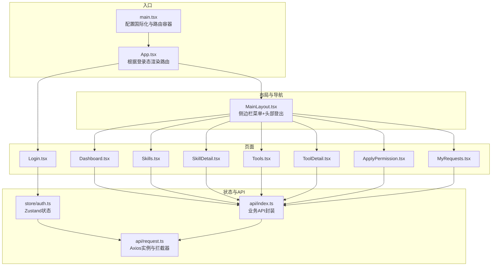

图表来源
- [main.tsx:1-18](file://frontend/client/src/main.tsx#L1-L18)
- [App.tsx:1-42](file://frontend/client/src/App.tsx#L1-L42)
- [MainLayout.tsx:1-56](file://frontend/client/src/components/MainLayout.tsx#L1-L56)
- [auth.ts:1-30](file://frontend/client/src/store/auth.ts#L1-L30)
- [index.ts:1-35](file://frontend/client/src/api/index.ts#L1-L35)
- [request.ts:1-28](file://frontend/client/src/api/request.ts#L1-L28)

章节来源
- [main.tsx:1-18](file://frontend/client/src/main.tsx#L1-L18)
- [App.tsx:1-42](file://frontend/client/src/App.tsx#L1-L42)
- [package.json:1-29](file://frontend/client/package.json#L1-L29)

## 核心组件
- 路由与入口
  - 入口在main.tsx中配置Ant Design国际化、BrowserRouter与StrictMode；App.tsx根据是否存在token决定渲染登录页或带MainLayout的受保护路由。
- 主布局MainLayout
  - 提供左侧固定宽度侧边栏与右侧内容区，顶部显示登出图标；菜单项与当前路径联动，点击切换路由；登出时清理本地token并跳转登录。
- 认证状态管理
  - 使用Zustand在内存中维护token与用户信息，初始化从localStorage读取；提供setAuth与logout方法；所有HTTP请求通过Axios拦截器自动附加Authorization头。
- API封装
  - 统一导出authApi、skillApi、toolApi、permissionApi、userApi等模块，内部基于Axios实例request.ts；request.ts设置基础URL、超时、统一拦截器（401自动跳转登录）。

章节来源
- [App.tsx:13-39](file://frontend/client/src/App.tsx#L13-L39)
- [MainLayout.tsx:27-55](file://frontend/client/src/components/MainLayout.tsx#L27-L55)
- [auth.ts:18-29](file://frontend/client/src/store/auth.ts#L18-L29)
- [index.ts:3-34](file://frontend/client/src/api/index.ts#L3-L34)
- [request.ts:3-25](file://frontend/client/src/api/request.ts#L3-L25)

## 架构总览
下图展示从用户交互到后端API的关键调用链，以及认证状态如何贯穿全局。

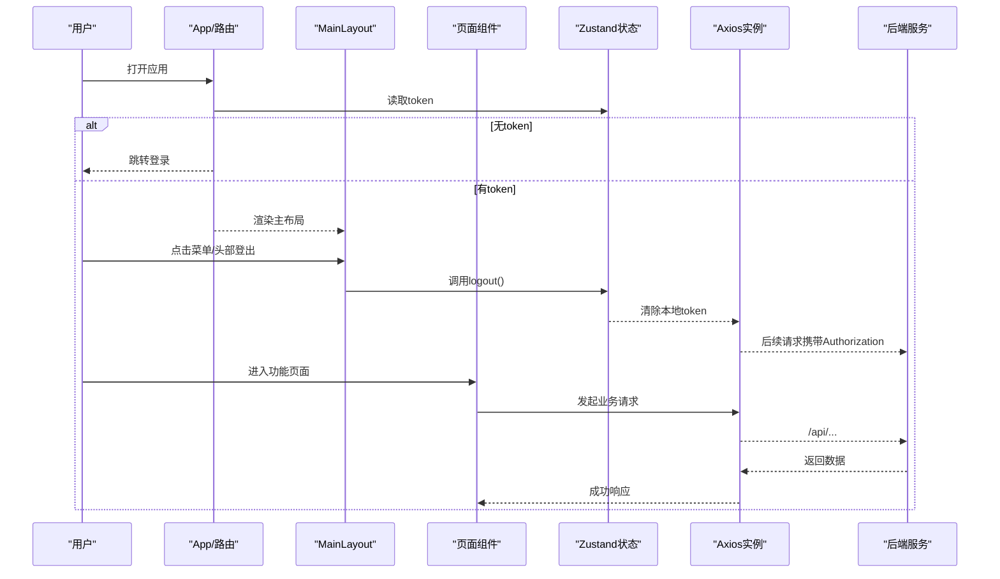

图表来源
- [App.tsx:16-23](file://frontend/client/src/App.tsx#L16-L23)
- [MainLayout.tsx:32-35](file://frontend/client/src/components/MainLayout.tsx#L32-L35)
- [auth.ts:25-28](file://frontend/client/src/store/auth.ts#L25-L28)
- [request.ts:8-14](file://frontend/client/src/api/request.ts#L8-L14)
- [index.ts:3-34](file://frontend/client/src/api/index.ts#L3-L34)

## 详细组件分析

### 主布局与导航（MainLayout）
- 设计模式
  - 布局采用Ant Design Layout容器，左侧Sider固定宽度，右侧Content区域承载子页面；菜单使用Ant Design Menu，支持图标与选中态同步。
- 导航结构
  - 菜单项包含首页、Skills、Tools、权限申请、我的申请；点击菜单触发useNavigate跳转对应路径。
- 响应式与样式
  - 通过Ant Design内置栅格与卡片组件实现自适应；根元素#root最小高度保证页面占满视窗。
- 登出流程
  - 头部登出图标绑定logout动作，清除本地token并重定向至登录页。

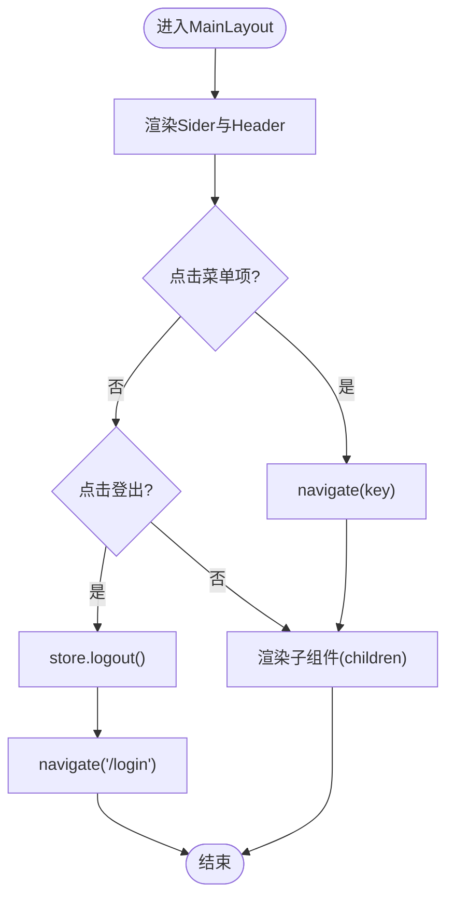

图表来源
- [MainLayout.tsx:37-54](file://frontend/client/src/components/MainLayout.tsx#L37-L54)
- [MainLayout.tsx:32-35](file://frontend/client/src/components/MainLayout.tsx#L32-L35)

章节来源
- [MainLayout.tsx:15-21](file://frontend/client/src/components/MainLayout.tsx#L15-L21)
- [MainLayout.tsx:46-47](file://frontend/client/src/components/MainLayout.tsx#L46-L47)
- [index.css:7-9](file://frontend/client/src/index.css#L7-L9)

### 仪表板（Dashboard）
- 功能概述
  - 并行加载用户权限与系统资源总量，展示“可用Skills/Tools”、“全部Skills/Tools”四个统计卡片。
- 数据流
  - 使用Promise.all并发请求用户权限与资源总数；将后端返回的total与数组长度映射到状态对象。
- 交互与提示
  - 加载期间由Ant Design组件负责；异常通过控制台输出。

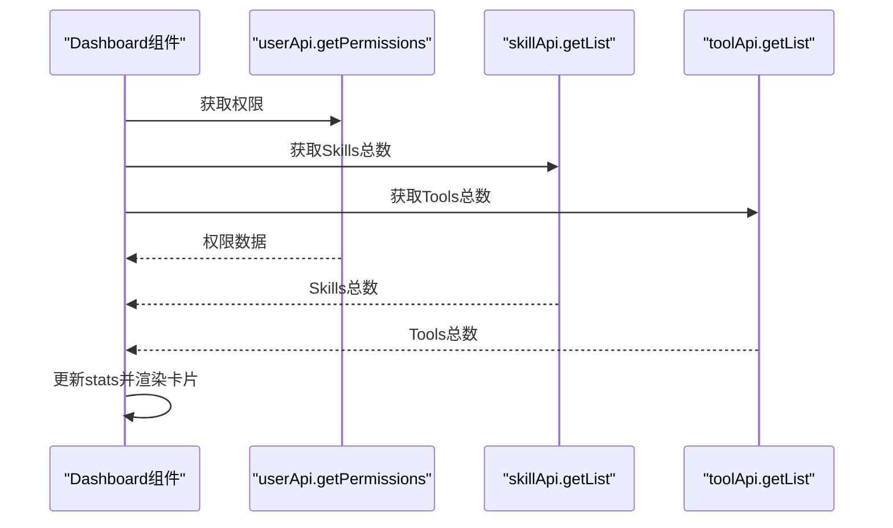

图表来源
- [Dashboard.tsx:9-28](file://frontend/client/src/pages/Dashboard.tsx#L9-L28)
- [index.ts:31-34](file://frontend/client/src/api/index.ts#L31-L34)
- [index.ts:10-21](file://frontend/client/src/api/index.ts#L10-L21)

章节来源
- [Dashboard.tsx:6-28](file://frontend/client/src/pages/Dashboard.tsx#L6-L28)

### Skills技能浏览与详情
- Skills页面
  - 支持关键词搜索、分页、按技能筛选工具；每行显示“是否已授权”标签与“申请权限”按钮；点击名称跳转详情。
- SkillDetail页面
  - 展示技能基本信息与包含的工具表格；工具列同样提供“申请权限”能力。
- 权限申请
  - 已授权显示“-”，未授权显示“申请权限”按钮；点击后调用权限申请API并提示成功/失败。

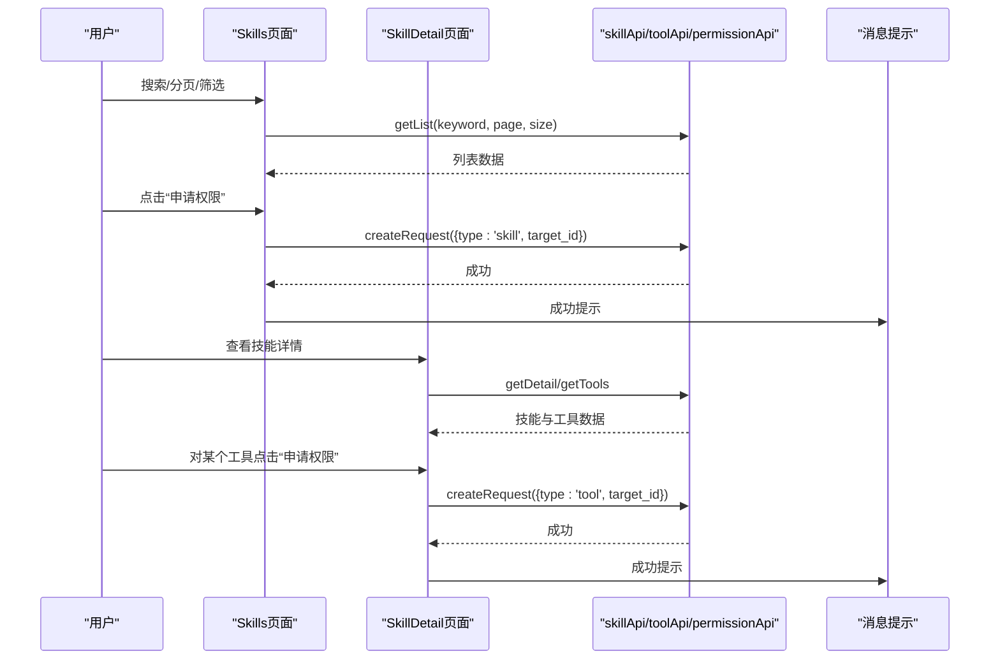

图表来源
- [Skills.tsx:14-30](file://frontend/client/src/pages/Skills.tsx#L14-L30)
- [Skills.tsx:32-47](file://frontend/client/src/pages/Skills.tsx#L32-L47)
- [SkillDetail.tsx:12-22](file://frontend/client/src/pages/SkillDetail.tsx#L12-L22)
- [SkillDetail.tsx:26-33](file://frontend/client/src/pages/SkillDetail.tsx#L26-L33)
- [index.ts:10-21](file://frontend/client/src/api/index.ts#L10-L21)
- [index.ts:23-29](file://frontend/client/src/api/index.ts#L23-L29)

章节来源
- [Skills.tsx:7-58](file://frontend/client/src/pages/Skills.tsx#L7-L58)
- [SkillDetail.tsx:6-65](file://frontend/client/src/pages/SkillDetail.tsx#L6-L65)

### Tools工具浏览与详情
- Tools页面
  - 支持关键词搜索、按技能筛选、分页；每行显示“是否已授权”与“申请权限”按钮；点击名称跳转详情。
- ToolDetail页面
  - 展示工具基本信息、所属技能、端点与方法、参数定义（以JSON格式预览）；同样提供“申请权限”能力。
- 权限申请
  - 逻辑与Skills一致，调用权限申请API并提示结果。

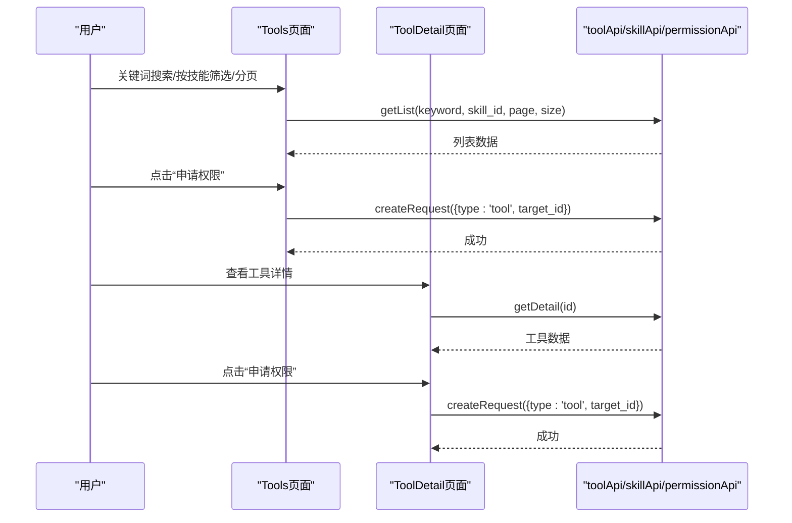

图表来源
- [Tools.tsx:16-37](file://frontend/client/src/pages/Tools.tsx#L16-L37)
- [ToolDetail.tsx:11-13](file://frontend/client/src/pages/ToolDetail.tsx#L11-L13)
- [ToolDetail.tsx:26-35](file://frontend/client/src/pages/ToolDetail.tsx#L26-L35)
- [index.ts:17-21](file://frontend/client/src/api/index.ts#L17-L21)
- [index.ts:23-29](file://frontend/client/src/api/index.ts#L23-L29)

章节来源
- [Tools.tsx:7-69](file://frontend/client/src/pages/Tools.tsx#L7-L69)
- [ToolDetail.tsx:6-38](file://frontend/client/src/pages/ToolDetail.tsx#L6-L38)

### 权限申请（ApplyPermission）
- 表单设计
  - 三段式表单：申请类型（Skill/Tool）、目标选择（动态选项随类型变化）、申请理由。
- 状态管理
  - 使用Ant Design Form与useEffect预加载技能与工具列表；提交时设置loading状态；成功清空表单并提示，失败弹出错误提示。
- API调用
  - 调用permissionApi.createRequest，传入type、target_id、reason。

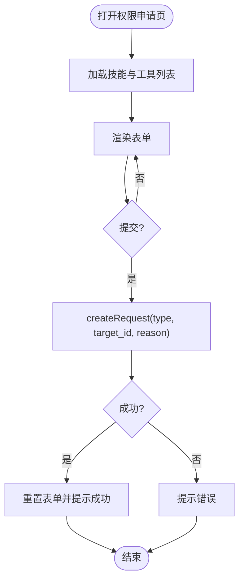

图表来源
- [ApplyPermission.tsx:11-19](file://frontend/client/src/pages/ApplyPermission.tsx#L11-L19)
- [ApplyPermission.tsx:21-36](file://frontend/client/src/pages/ApplyPermission.tsx#L21-L36)
- [index.ts:23-29](file://frontend/client/src/api/index.ts#L23-L29)

章节来源
- [ApplyPermission.tsx:5-70](file://frontend/client/src/pages/ApplyPermission.tsx#L5-L70)

### 我的申请（MyRequests）
- 功能概述
  - 分页展示个人权限申请记录，包含类型、目标、理由、状态、审批备注；仅当状态为“待审批”时允许撤销。
- 状态映射
  - 使用颜色与中文标签映射状态枚举，提升可读性。
- 撤销操作
  - 调用permissionApi.cancelRequest，成功后刷新列表并提示。

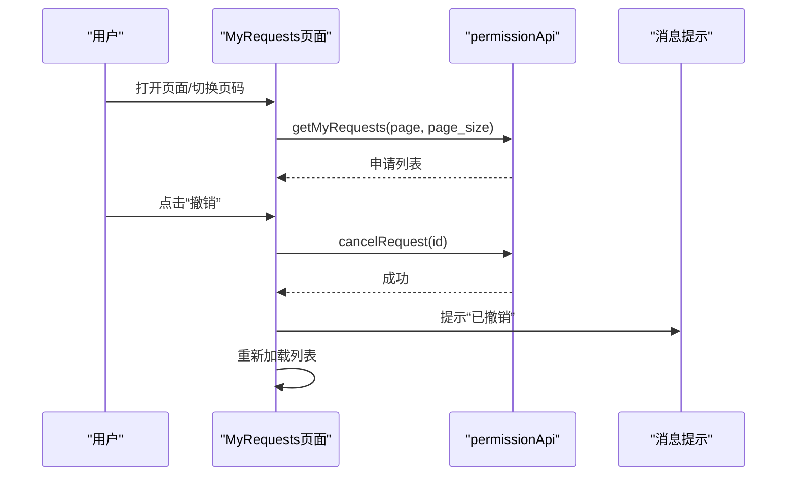

图表来源
- [MyRequests.tsx:13-19](file://frontend/client/src/pages/MyRequests.tsx#L13-L19)
- [MyRequests.tsx:21-29](file://frontend/client/src/pages/MyRequests.tsx#L21-L29)
- [index.ts:26-28](file://frontend/client/src/api/index.ts#L26-L28)

章节来源
- [MyRequests.tsx:8-55](file://frontend/client/src/pages/MyRequests.tsx#L8-L55)

### 登录（Login）
- 飞书登录
  - 点击“飞书登录”按钮获取登录URL并跳转；回调页解析URL参数code，调用回调接口换取access_token与用户信息，写入Zustand与localStorage，随后跳转首页。
- 无token时的路由
  - App.tsx检测token不存在时仅渲染登录路由，其他路径重定向至登录。

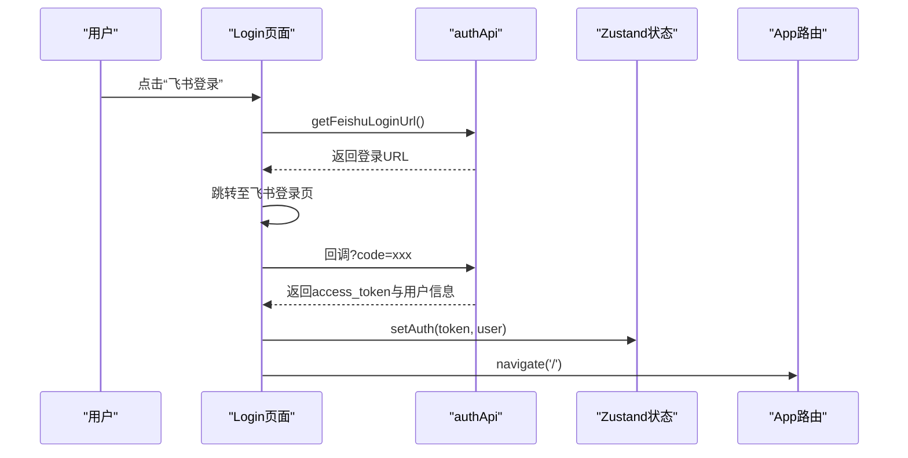

图表来源
- [Login.tsx:12-36](file://frontend/client/src/pages/Login.tsx#L12-L36)
- [index.ts:3-8](file://frontend/client/src/api/index.ts#L3-L8)
- [auth.ts:21-23](file://frontend/client/src/store/auth.ts#L21-L23)
- [App.tsx:16-23](file://frontend/client/src/App.tsx#L16-L23)

章节来源
- [Login.tsx:8-51](file://frontend/client/src/pages/Login.tsx#L8-L51)

### 认证状态管理与会话保持
- JWT令牌处理
  - 初始化从localStorage读取token；setAuth写入localStorage；logout移除localStorage中的token。
- 请求拦截
  - request.ts在请求前自动读取localStorage中的token并附加到Authorization头；响应拦截器对401进行统一处理（清除token并跳转登录）。
- 会话保持
  - 应用启动即恢复登录态；页面刷新后仍可保持登录状态；后端若返回401则自动回到登录页。

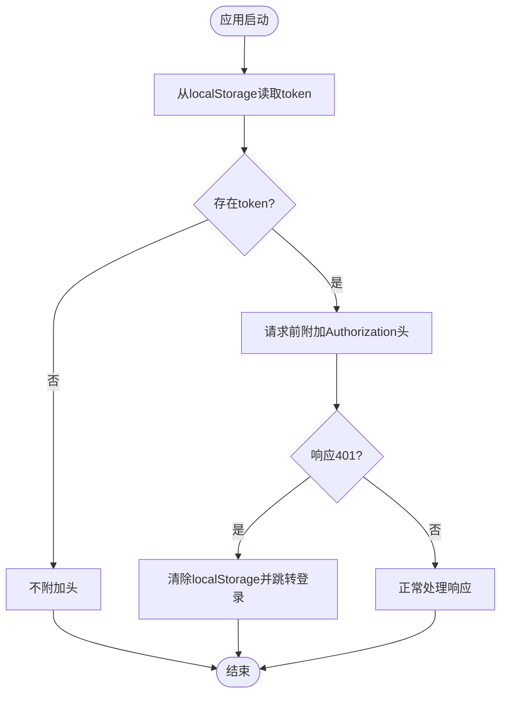

图表来源
- [auth.ts:19-27](file://frontend/client/src/store/auth.ts#L19-L27)
- [request.ts:8-14](file://frontend/client/src/api/request.ts#L8-L14)
- [request.ts:16-25](file://frontend/client/src/api/request.ts#L16-L25)

章节来源
- [auth.ts:18-29](file://frontend/client/src/store/auth.ts#L18-L29)
- [request.ts:3-25](file://frontend/client/src/api/request.ts#L3-L25)

## 依赖关系分析
- 组件耦合
  - 页面组件仅依赖API封装与状态存储，低耦合高内聚；MainLayout作为通用布局，被所有受保护路由包裹。
- 外部依赖
  - React生态（react、react-router-dom）、UI库（antd、@ant-design/icons）、网络（axios）、状态（zustand）、时间（dayjs）。
- 代理与跨域
  - Vite开发服务器通过proxy将/api前缀转发至后端地址，避免浏览器同源限制。

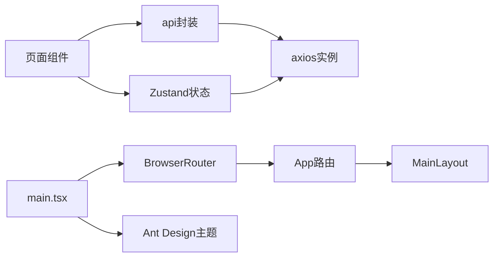

图表来源
- [package.json:11-20](file://frontend/client/package.json#L11-L20)
- [vite.config.ts:7-12](file://frontend/client/vite.config.ts#L7-L12)
- [main.tsx:9-17](file://frontend/client/src/main.tsx#L9-L17)
- [App.tsx:26-38](file://frontend/client/src/App.tsx#L26-L38)

章节来源
- [package.json:1-29](file://frontend/client/package.json#L1-L29)
- [vite.config.ts:1-15](file://frontend/client/vite.config.ts#L1-L15)

## 性能考虑
- 并发请求
  - Dashboard使用Promise.all并行加载多个接口，减少首屏等待时间。
- 分页与筛选
  - Skills/Tools均采用分页与关键词/技能筛选，避免一次性加载大量数据。
- 本地缓存
  - 令牌持久化于localStorage，减少重复登录成本；但注意避免在多标签页场景下的状态不同步。
- 图标与样式
  - 使用Ant Design内置图标与组件，减少自定义样式的开销与体积。

## 故障排查指南
- 登录后无法进入受保护页面
  - 检查localStorage中是否存在token；确认App.tsx路由判断逻辑；查看浏览器Network面板是否正确携带Authorization头。
- 401未生效自动跳转
  - 检查request.ts响应拦截器是否执行；确认后端返回状态码与错误体结构。
- 权限申请提交失败
  - 查看表单必填字段是否完整；检查API返回的错误信息；确认后端接口是否可达。
- 列表不更新
  - 确认提交成功后是否调用了重新加载函数；检查分页参数是否重置。

章节来源
- [request.ts:16-25](file://frontend/client/src/api/request.ts#L16-L25)
- [App.tsx:16-23](file://frontend/client/src/App.tsx#L16-L23)
- [ApplyPermission.tsx:21-36](file://frontend/client/src/pages/ApplyPermission.tsx#L21-L36)

## 结论
该客户端应用以清晰的页面职责、稳定的主布局与完善的认证体系为基础，结合Ant Design提供的丰富UI组件与Zustand的状态管理，实现了从仪表板到技能/工具浏览再到权限申请的完整闭环。通过Axios拦截器统一处理认证与错误，配合Vite代理与本地存储，提供了良好的开发体验与运行稳定性。建议后续在大型列表场景引入虚拟滚动、图片懒加载等进一步优化用户体验。

## 附录
- 开发规范与最佳实践
  - 组件拆分：每个页面独立文件，公共布局抽离为MainLayout；避免在页面内直接拼接HTML。
  - 样式设计：统一使用Ant Design组件与主题变量；根样式保证页面占满视窗。
  - 组件复用：将通用交互（如消息提示、加载状态）抽象为Hook或封装组件。
  - 错误处理：统一在API层与拦截器层处理错误；对401进行自动登出。
  - 加载状态：使用Ant Design组件自带的加载指示器；在关键请求上显式loading状态。
- 项目脚手架
  - 使用Vite + TypeScript + React + Ant Design；开发服务器通过proxy转发/api请求。