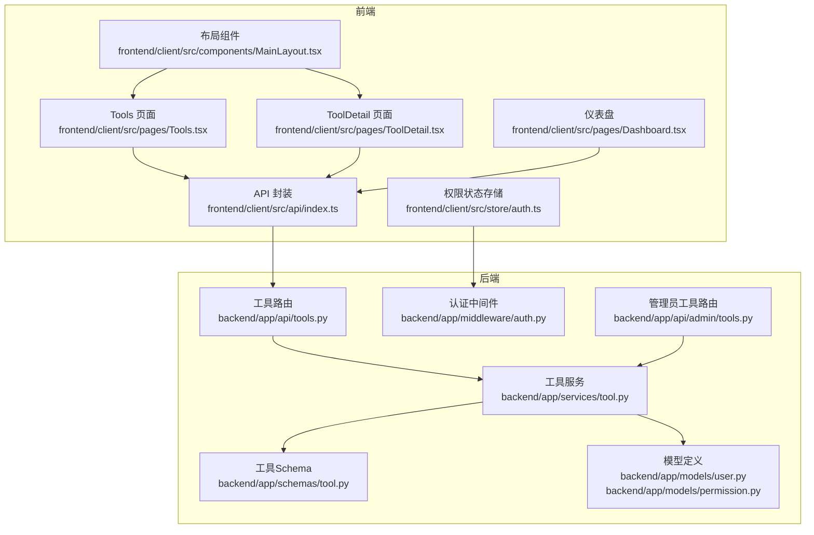
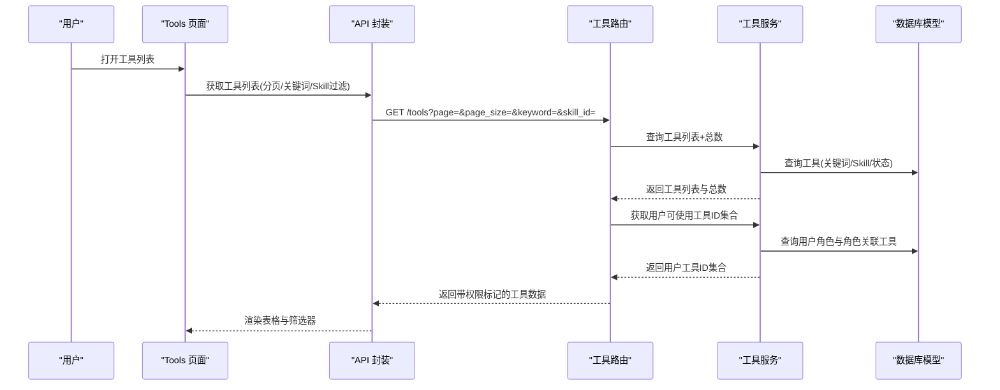
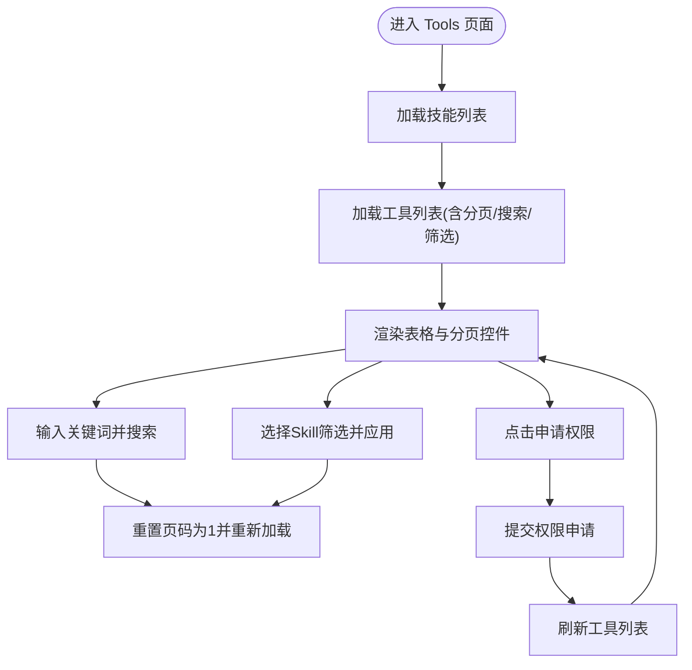
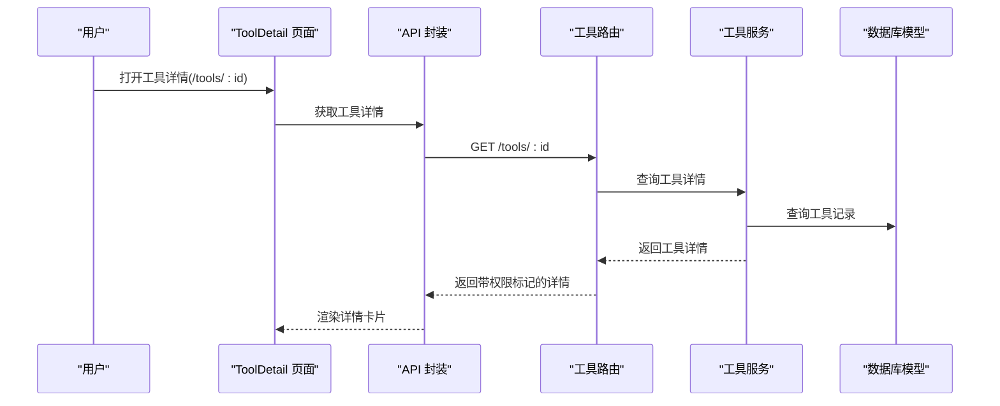
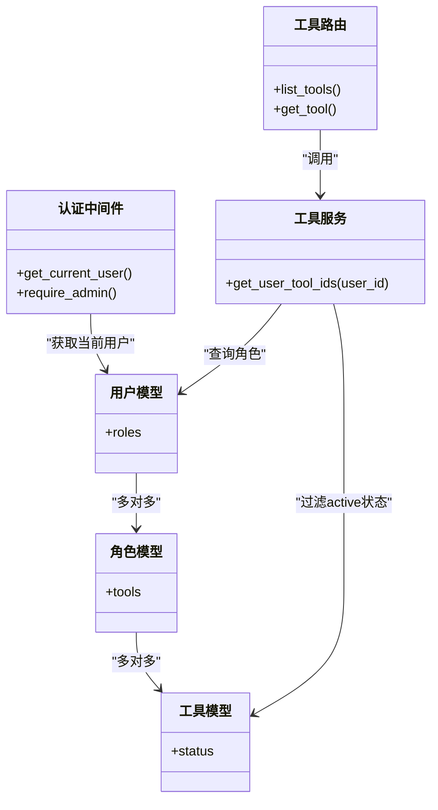
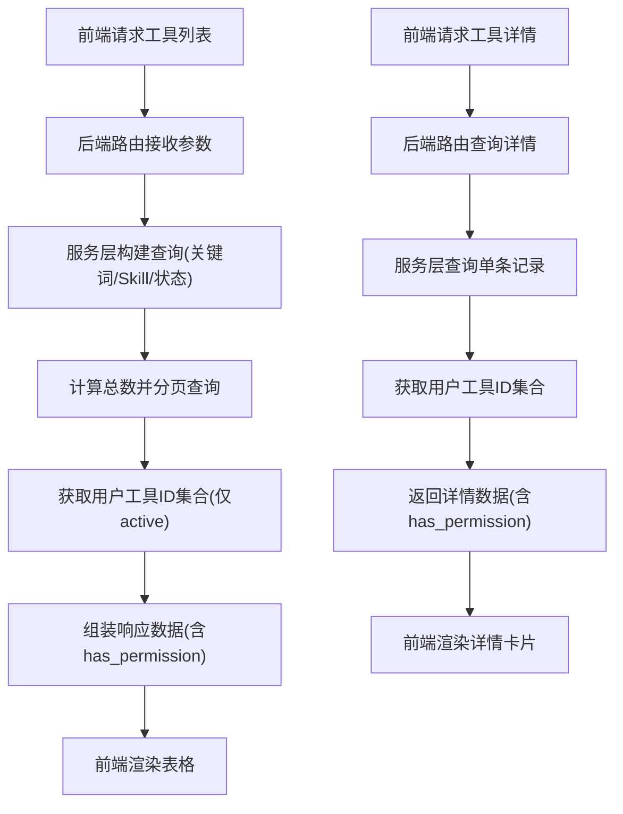
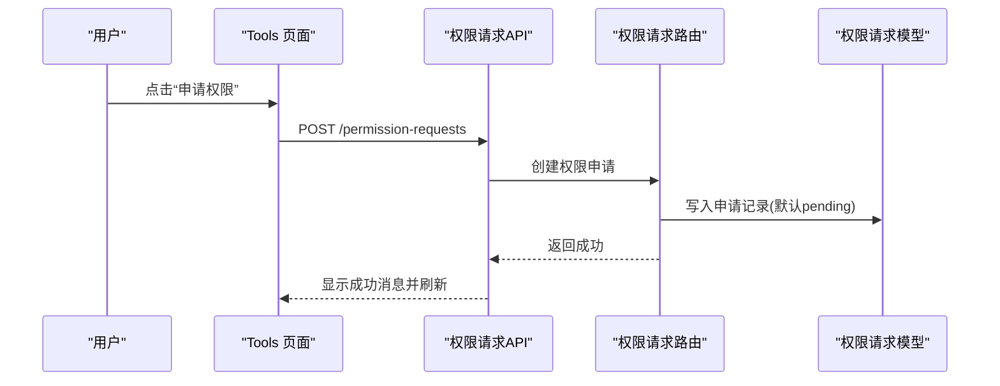
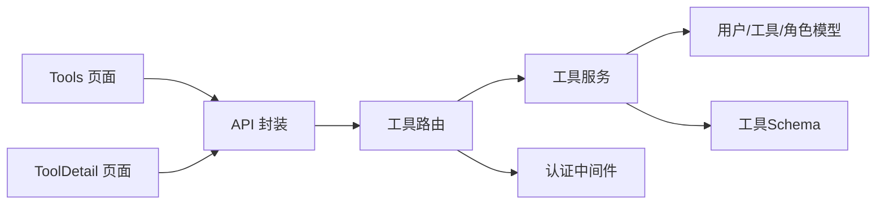

# 工具管理页面

<cite>
**本文档引用的文件**
- [frontend/client/src/pages/Tools.tsx](file://frontend/client/src/pages/Tools.tsx)
- [frontend/client/src/pages/ToolDetail.tsx](file://frontend/client/src/pages/ToolDetail.tsx)
- [frontend/client/src/api/index.ts](file://frontend/client/src/api/index.ts)
- [backend/app/api/tools.py](file://backend/app/api/tools.py)
- [backend/app/services/tool.py](file://backend/app/services/tool.py)
- [backend/app/schemas/tool.py](file://backend/app/schemas/tool.py)
- [backend/app/models/user.py](file://backend/app/models/user.py)
- [backend/app/models/permission.py](file://backend/app/models/permission.py)
- [backend/app/middleware/auth.py](file://backend/app/middleware/auth.py)
- [frontend/client/src/store/auth.ts](file://frontend/client/src/store/auth.ts)
- [frontend/client/src/components/MainLayout.tsx](file://frontend/client/src/components/MainLayout.tsx)
- [frontend/client/src/pages/Dashboard.tsx](file://frontend/client/src/pages/Dashboard.tsx)
- [backend/app/api/admin/tools.py](file://backend/app/api/admin/tools.py)
</cite>

## 目录
1. [简介](#简介)
2. [项目结构](#项目结构)
3. [核心组件](#核心组件)
4. [架构总览](#架构总览)
5. [详细组件分析](#详细组件分析)
6. [依赖关系分析](#依赖关系分析)
7. [性能考虑](#性能考虑)
8. [故障排除指南](#故障排除指南)
9. [结论](#结论)
10. [附录](#附录)

## 简介
本文件面向ToolHub客户端工具管理页面，提供从工具列表展示、分类筛选、搜索功能到工具详情页的完整实现说明。文档涵盖工具数据获取流程、状态管理、权限验证机制，并解释工具状态标识、可用性检查与使用限制展示。同时给出工具分类逻辑、排序规则、搜索算法的实现细节，并提出工具使用统计、最近使用记录、个性化推荐等扩展实现方案。

## 项目结构
前端采用React + Ant Design，后端基于FastAPI + SQLAlchemy。页面主要由工具列表页、工具详情页、权限申请流程与仪表盘组成；API层负责数据查询与权限校验；服务层封装业务逻辑；模型层定义数据结构与关系。

**图示来源**
- [frontend/client/src/pages/Tools.tsx:1-70](file://frontend/client/src/pages/Tools.tsx#L1-L70)
- [frontend/client/src/pages/ToolDetail.tsx:1-39](file://frontend/client/src/pages/ToolDetail.tsx#L1-L39)
- [frontend/client/src/api/index.ts:1-36](file://frontend/client/src/api/index.ts#L1-L36)
- [backend/app/api/tools.py:1-69](file://backend/app/api/tools.py#L1-L69)
- [backend/app/services/tool.py:1-104](file://backend/app/services/tool.py#L1-L104)
- [backend/app/schemas/tool.py:1-51](file://backend/app/schemas/tool.py#L1-L51)
- [backend/app/models/user.py:1-116](file://backend/app/models/user.py#L1-L116)
- [backend/app/models/permission.py:1-28](file://backend/app/models/permission.py#L1-L28)
- [backend/app/middleware/auth.py:1-45](file://backend/app/middleware/auth.py#L1-L45)
- [frontend/client/src/store/auth.ts:1-30](file://frontend/client/src/store/auth.ts#L1-L30)
- [frontend/client/src/components/MainLayout.tsx:1-56](file://frontend/client/src/components/MainLayout.tsx#L1-L56)
- [frontend/client/src/pages/Dashboard.tsx:1-50](file://frontend/client/src/pages/Dashboard.tsx#L1-L50)
- [backend/app/api/admin/tools.py:1-89](file://backend/app/api/admin/tools.py#L1-L89)

**章节来源**
- [frontend/client/src/pages/Tools.tsx:1-70](file://frontend/client/src/pages/Tools.tsx#L1-L70)
- [frontend/client/src/pages/ToolDetail.tsx:1-39](file://frontend/client/src/pages/ToolDetail.tsx#L1-L39)
- [frontend/client/src/api/index.ts:1-36](file://frontend/client/src/api/index.ts#L1-L36)
- [backend/app/api/tools.py:1-69](file://backend/app/api/tools.py#L1-L69)
- [backend/app/services/tool.py:1-104](file://backend/app/services/tool.py#L1-L104)
- [backend/app/schemas/tool.py:1-51](file://backend/app/schemas/tool.py#L1-L51)
- [backend/app/models/user.py:1-116](file://backend/app/models/user.py#L1-L116)
- [backend/app/models/permission.py:1-28](file://backend/app/models/permission.py#L1-L28)
- [backend/app/middleware/auth.py:1-45](file://backend/app/middleware/auth.py#L1-L45)
- [frontend/client/src/store/auth.ts:1-30](file://frontend/client/src/store/auth.ts#L1-L30)
- [frontend/client/src/components/MainLayout.tsx:1-56](file://frontend/client/src/components/MainLayout.tsx#L1-L56)
- [frontend/client/src/pages/Dashboard.tsx:1-50](file://frontend/client/src/pages/Dashboard.tsx#L1-L50)
- [backend/app/api/admin/tools.py:1-89](file://backend/app/api/admin/tools.py#L1-L89)

## 核心组件
- 工具列表页（Tools）：支持分页、关键词搜索、按Skill分类筛选，展示工具基本信息与权限状态，并提供“申请权限”入口。
- 工具详情页（ToolDetail）：展示工具的描述、所属Skill、端点、方法、状态、权限以及参数定义。
- API封装（api/index.ts）：统一暴露工具、技能、权限相关的HTTP接口。
- 认证与权限：通过认证中间件获取当前用户，服务层计算用户可使用的工具集合，API层在返回数据时标注has_permission字段。
- 权限申请：通过权限请求接口提交申请，等待审批。

**章节来源**
- [frontend/client/src/pages/Tools.tsx:7-69](file://frontend/client/src/pages/Tools.tsx#L7-L69)
- [frontend/client/src/pages/ToolDetail.tsx:6-38](file://frontend/client/src/pages/ToolDetail.tsx#L6-L38)
- [frontend/client/src/api/index.ts:11-30](file://frontend/client/src/api/index.ts#L11-L30)
- [backend/app/api/tools.py:12-42](file://backend/app/api/tools.py#L12-L42)
- [backend/app/services/tool.py:88-100](file://backend/app/services/tool.py#L88-L100)

## 架构总览
前端页面通过API封装调用后端路由，后端路由经认证中间件获取当前用户，服务层执行数据库查询与权限计算，最终返回包含权限标记的数据给前端渲染。

**图示来源**
- [frontend/client/src/pages/Tools.tsx:16-27](file://frontend/client/src/pages/Tools.tsx#L16-L27)
- [frontend/client/src/api/index.ts:18-22](file://frontend/client/src/api/index.ts#L18-L22)
- [backend/app/api/tools.py:12-42](file://backend/app/api/tools.py#L12-L42)
- [backend/app/services/tool.py:11-34](file://backend/app/services/tool.py#L11-L34)
- [backend/app/services/tool.py:88-100](file://backend/app/services/tool.py#L88-L100)

## 详细组件分析

### 工具列表页（Tools）
- 功能要点
  - 分页：每页20条，支持页码变更。
  - 搜索：关键词匹配工具名称与描述。
  - 分类：按Skill筛选，联动清空页码回到第1页。
  - 权限展示：根据has_permission字段显示“已授权/未授权”标签。
  - 权限申请：未授权时显示“申请权限”按钮，提交后刷新列表。
- 数据流
  - 列表加载：调用工具列表API，传入page、page_size、keyword、skill_id。
  - 技能列表：用于筛选下拉框，一次性加载前100项。
  - 申请流程：调用权限请求API，提交type为tool、target_id为工具ID。
- 状态管理
  - 使用useState维护tools、total、page、keyword、skillFilter、skills。
  - 通过useEffect在依赖变化时触发重新加载。

**图示来源**
- [frontend/client/src/pages/Tools.tsx:16-27](file://frontend/client/src/pages/Tools.tsx#L16-L27)
- [frontend/client/src/pages/Tools.tsx:29-37](file://frontend/client/src/pages/Tools.tsx#L29-L37)
- [frontend/client/src/api/index.ts:18-22](file://frontend/client/src/api/index.ts#L18-L22)
- [frontend/client/src/api/index.ts:24-30](file://frontend/client/src/api/index.ts#L24-L30)

**章节来源**
- [frontend/client/src/pages/Tools.tsx:7-69](file://frontend/client/src/pages/Tools.tsx#L7-L69)
- [frontend/client/src/api/index.ts:18-30](file://frontend/client/src/api/index.ts#L18-L30)

### 工具详情页（ToolDetail）
- 功能要点
  - 展示工具基础信息：名称、描述、所属Skill、端点、方法。
  - 状态与权限：根据status与has_permission显示对应标签。
  - 参数定义：以JSON格式展示parameters（若存在）。
  - 导航：提供返回列表的按钮。
- 数据流
  - 通过路由参数获取工具ID，调用工具详情API获取完整数据。
  - 首次渲染时若数据为空显示加载中。

**图示来源**
- [frontend/client/src/pages/ToolDetail.tsx:11-13](file://frontend/client/src/pages/ToolDetail.tsx#L11-L13)
- [frontend/client/src/api/index.ts:18-22](file://frontend/client/src/api/index.ts#L18-L22)
- [backend/app/api/tools.py:45-69](file://backend/app/api/tools.py#L45-L69)
- [backend/app/services/tool.py:37-38](file://backend/app/services/tool.py#L37-L38)

**章节来源**
- [frontend/client/src/pages/ToolDetail.tsx:6-38](file://frontend/client/src/pages/ToolDetail.tsx#L6-L38)
- [frontend/client/src/api/index.ts:18-22](file://frontend/client/src/api/index.ts#L18-L22)
- [backend/app/api/tools.py:45-69](file://backend/app/api/tools.py#L45-L69)

### 权限验证与状态管理
- 认证中间件
  - 通过HTTP Bearer Token解析当前用户，校验用户状态为active。
- 用户工具权限
  - 服务层根据用户的角色关联工具，仅统计状态为active的工具ID集合。
  - API层在返回列表与详情时，将has_permission字段写入结果。
- 前端权限状态
  - 使用本地状态存储token与用户信息，配合布局组件提供导航与登出。

**图示来源**
- [backend/app/middleware/auth.py:12-33](file://backend/app/middleware/auth.py#L12-L33)
- [backend/app/services/tool.py:88-100](file://backend/app/services/tool.py#L88-L100)
- [backend/app/api/tools.py:12-42](file://backend/app/api/tools.py#L12-L42)
- [backend/app/models/user.py:23-39](file://backend/app/models/user.py#L23-L39)
- [backend/app/models/user.py:42-53](file://backend/app/models/user.py#L42-L53)
- [backend/app/models/user.py:81-97](file://backend/app/models/user.py#L81-L97)

**章节来源**
- [backend/app/middleware/auth.py:12-33](file://backend/app/middleware/auth.py#L12-L33)
- [backend/app/services/tool.py:88-100](file://backend/app/services/tool.py#L88-L100)
- [backend/app/api/tools.py:12-42](file://backend/app/api/tools.py#L12-L42)
- [frontend/client/src/store/auth.ts:18-29](file://frontend/client/src/store/auth.ts#L18-L29)

### 工具数据获取流程与状态管理
- 工具列表获取
  - 前端调用工具列表API，传入分页参数、关键词与Skill ID。
  - 后端服务层构建查询条件（关键词匹配name/description，Skill过滤，状态过滤），计算总数并分页返回。
  - API层合并用户工具ID集合，为每个工具附加has_permission标记。
- 工具详情获取
  - 前端调用工具详情API，后端返回相同权限标记。
- 状态管理
  - 前端使用useState与useEffect管理列表、分页、筛选与技能列表。
  - 后端使用SQLAlchemy ORM进行查询与聚合。

**图示来源**
- [frontend/client/src/pages/Tools.tsx:16-20](file://frontend/client/src/pages/Tools.tsx#L16-L20)
- [backend/app/services/tool.py:11-34](file://backend/app/services/tool.py#L11-L34)
- [backend/app/services/tool.py:88-100](file://backend/app/services/tool.py#L88-L100)
- [backend/app/api/tools.py:22-42](file://backend/app/api/tools.py#L22-L42)
- [frontend/client/src/pages/ToolDetail.tsx:11-13](file://frontend/client/src/pages/ToolDetail.tsx#L11-L13)
- [backend/app/api/tools.py:52-69](file://backend/app/api/tools.py#L52-L69)

**章节来源**
- [frontend/client/src/pages/Tools.tsx:16-27](file://frontend/client/src/pages/Tools.tsx#L16-L27)
- [backend/app/services/tool.py:11-34](file://backend/app/services/tool.py#L11-L34)
- [backend/app/api/tools.py:22-42](file://backend/app/api/tools.py#L22-L42)
- [frontend/client/src/pages/ToolDetail.tsx:11-13](file://frontend/client/src/pages/ToolDetail.tsx#L11-L13)
- [backend/app/api/tools.py:52-69](file://backend/app/api/tools.py#L52-L69)

### 工具状态标识、可用性检查与使用限制
- 状态标识
  - 工具状态字段包含active/inactive，API在列表与详情中返回该值，并在前端以绿色/红色标签展示。
- 可用性检查
  - 仅当工具状态为active且用户拥有相应角色授权时，has_permission为true。
- 使用限制
  - 当用户未授权时，不展示具体使用方式，仅提供申请入口；详情页同样不展示敏感参数，避免误用。

**章节来源**
- [backend/app/schemas/tool.py:29-51](file://backend/app/schemas/tool.py#L29-L51)
- [backend/app/services/tool.py:88-100](file://backend/app/services/tool.py#L88-L100)
- [frontend/client/src/pages/Tools.tsx:44-53](file://frontend/client/src/pages/Tools.tsx#L44-L53)
- [frontend/client/src/pages/ToolDetail.tsx:26-27](file://frontend/client/src/pages/ToolDetail.tsx#L26-L27)

### 工具分类逻辑、排序规则与搜索算法
- 分类逻辑
  - 工具属于某个Skill，Skill与Tool通过外键关联；前端通过Skill ID筛选工具。
- 排序规则
  - 当前实现未显式指定排序字段，默认按数据库主键顺序返回；可在服务层增加order_by以满足业务需求。
- 搜索算法
  - 关键词同时匹配工具名称与描述，使用SQL LIKE进行模糊匹配；建议在生产环境对常用搜索词建立索引以提升性能。

**章节来源**
- [backend/app/services/tool.py:20-34](file://backend/app/services/tool.py#L20-L34)
- [backend/app/models/user.py:65-78](file://backend/app/models/user.py#L65-L78)
- [backend/app/models/user.py:81-97](file://backend/app/models/user.py#L81-L97)

### 权限申请与审批流程
- 提交申请
  - 前端调用权限请求API，type为tool，target_id为工具ID。
- 审批状态
  - 后端模型包含权限申请状态枚举（pending/approved/rejected/cancelled），前端可在“我的申请”页面查看进度。
- 管理员视角
  - 管理员工具路由支持按状态过滤与全量管理操作。

**图示来源**
- [frontend/client/src/pages/Tools.tsx:29-37](file://frontend/client/src/pages/Tools.tsx#L29-L37)
- [frontend/client/src/api/index.ts:24-30](file://frontend/client/src/api/index.ts#L24-L30)
- [backend/app/models/permission.py:7-27](file://backend/app/models/permission.py#L7-L27)
- [backend/app/api/admin/tools.py:14-42](file://backend/app/api/admin/tools.py#L14-L42)

**章节来源**
- [frontend/client/src/pages/Tools.tsx:29-37](file://frontend/client/src/pages/Tools.tsx#L29-L37)
- [frontend/client/src/api/index.ts:24-30](file://frontend/client/src/api/index.ts#L24-L30)
- [backend/app/models/permission.py:7-27](file://backend/app/models/permission.py#L7-L27)

### 工具使用统计、最近使用记录与个性化推荐（扩展方案）
- 工具使用统计
  - 建议在后端新增使用日志表，记录每次工具调用的时间、用户、工具ID与结果；前端仪表盘展示热门工具排行。
- 最近使用记录
  - 在用户模型或独立表中维护最近访问列表，前端Tools页面顶部展示快捷入口。
- 个性化推荐
  - 基于用户角色、技能与历史使用行为，结合协同过滤或内容相似度算法，推荐相关工具。

[本节为概念性扩展方案，无需源码引用]

## 依赖关系分析
- 前端依赖
  - 页面依赖API封装与Ant Design组件；权限状态依赖本地存储。
- 后端依赖
  - 路由依赖认证中间件与服务层；服务层依赖模型与Schema；模型间通过关系映射建立Skill-Tool-Role-User的多对多关系。

**图示来源**
- [frontend/client/src/pages/Tools.tsx:1-5](file://frontend/client/src/pages/Tools.tsx#L1-L5)
- [frontend/client/src/pages/ToolDetail.tsx:1-4](file://frontend/client/src/pages/ToolDetail.tsx#L1-L4)
- [frontend/client/src/api/index.ts:1-36](file://frontend/client/src/api/index.ts#L1-L36)
- [backend/app/api/tools.py:1-9](file://backend/app/api/tools.py#L1-L9)
- [backend/app/services/tool.py:1-6](file://backend/app/services/tool.py#L1-L6)
- [backend/app/models/user.py:23-97](file://backend/app/models/user.py#L23-L97)
- [backend/app/schemas/tool.py:1-51](file://backend/app/schemas/tool.py#L1-L51)
- [backend/app/middleware/auth.py:1-8](file://backend/app/middleware/auth.py#L1-L8)

**章节来源**
- [frontend/client/src/pages/Tools.tsx:1-5](file://frontend/client/src/pages/Tools.tsx#L1-L5)
- [frontend/client/src/pages/ToolDetail.tsx:1-4](file://frontend/client/src/pages/ToolDetail.tsx#L1-L4)
- [frontend/client/src/api/index.ts:1-36](file://frontend/client/src/api/index.ts#L1-L36)
- [backend/app/api/tools.py:1-9](file://backend/app/api/tools.py#L1-L9)
- [backend/app/services/tool.py:1-6](file://backend/app/services/tool.py#L1-L6)
- [backend/app/models/user.py:23-97](file://backend/app/models/user.py#L23-L97)
- [backend/app/schemas/tool.py:1-51](file://backend/app/schemas/tool.py#L1-L51)
- [backend/app/middleware/auth.py:1-8](file://backend/app/middleware/auth.py#L1-L8)

## 性能考虑
- 分页与查询
  - 后端固定page_size上限与最小值，避免过大请求；前端分页控件与后端一致。
- 搜索性能
  - 关键词匹配使用LIKE，建议在name与description列建立索引；对高频关键词可引入全文检索。
- 并发与缓存
  - 技能列表一次性加载并缓存，减少重复请求；工具列表可按关键词/Skill组合设置短期缓存。
- 渲染优化
  - 表格列宽与ellipsis控制文本截断，避免长描述影响渲染性能。

[本节提供通用指导，无需源码引用]

## 故障排除指南
- 无法加载工具列表
  - 检查网络请求是否正确传递page/page_size/keyword/skill_id参数；确认后端路由与服务层查询条件。
- 权限始终显示未授权
  - 确认用户角色是否绑定工具且工具状态为active；检查服务层用户工具ID集合逻辑。
- 申请权限无响应
  - 查看权限请求API返回状态与错误信息；确认前端消息提示与异常捕获。
- 登录失效或被拒绝
  - 检查认证中间件token解析与用户状态；确保前端本地token有效。

**章节来源**
- [frontend/client/src/pages/Tools.tsx:16-20](file://frontend/client/src/pages/Tools.tsx#L16-L20)
- [backend/app/services/tool.py:88-100](file://backend/app/services/tool.py#L88-L100)
- [frontend/client/src/pages/Tools.tsx:29-37](file://frontend/client/src/pages/Tools.tsx#L29-L37)
- [backend/app/middleware/auth.py:12-33](file://backend/app/middleware/auth.py#L12-L33)

## 结论
工具管理页面通过清晰的前后端职责划分实现了完整的工具浏览、筛选、搜索与权限申请能力。后端以认证中间件与服务层为核心，保证了权限与数据一致性；前端以组件化方式提供良好的用户体验。后续可在统计、记录与推荐方面进一步增强个性化体验。

## 附录
- 快速导航
  - 列表页：/tools
  - 详情页：/tools/:id
  - 仪表盘：/dashboard
- 关键接口
  - 获取工具列表：GET /tools
  - 获取工具详情：GET /tools/:id
  - 提交权限申请：POST /permission-requests

**章节来源**
- [frontend/client/src/components/MainLayout.tsx:15-21](file://frontend/client/src/components/MainLayout.tsx#L15-L21)
- [frontend/client/src/pages/Dashboard.tsx:1-50](file://frontend/client/src/pages/Dashboard.tsx#L1-L50)
- [frontend/client/src/api/index.ts:18-22](file://frontend/client/src/api/index.ts#L18-L22)
- [frontend/client/src/api/index.ts:24-30](file://frontend/client/src/api/index.ts#L24-L30)