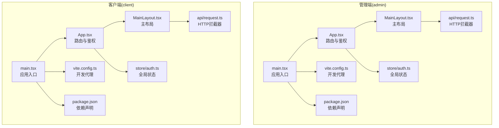
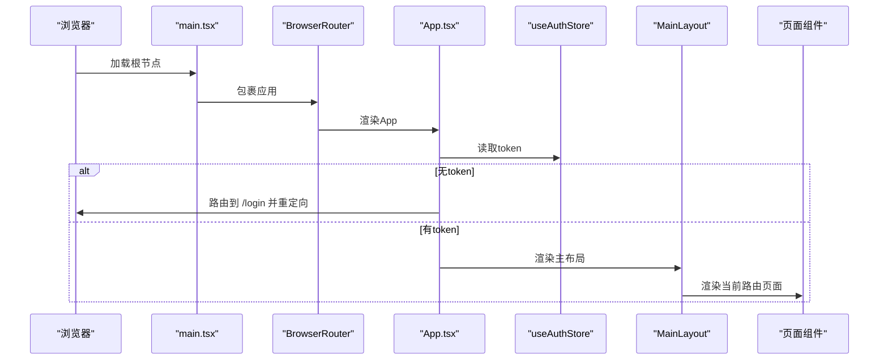
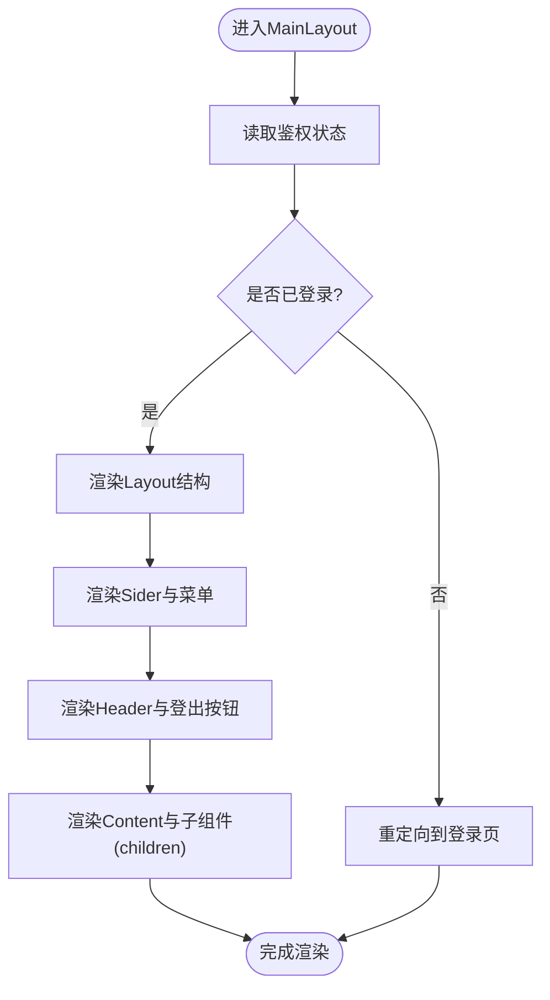
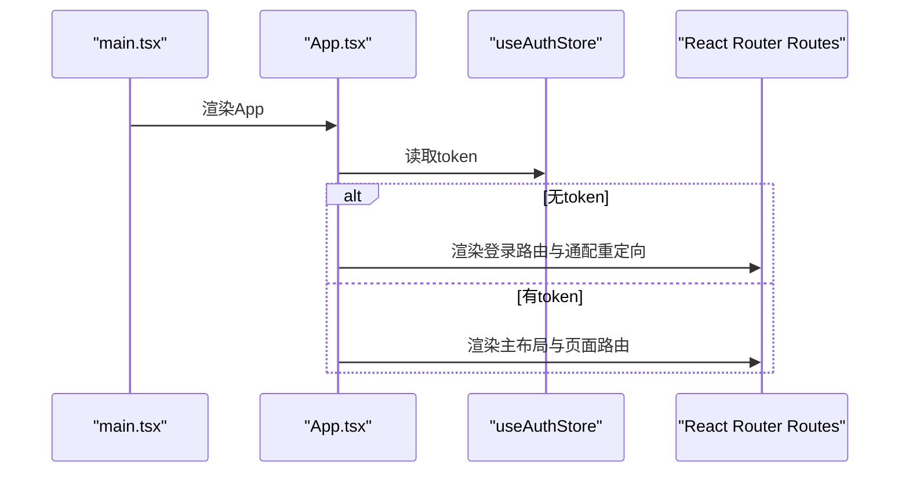
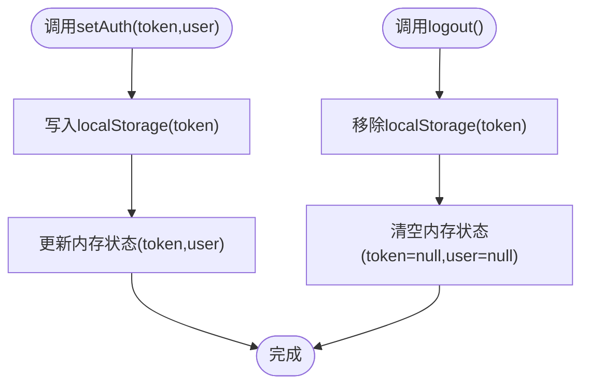
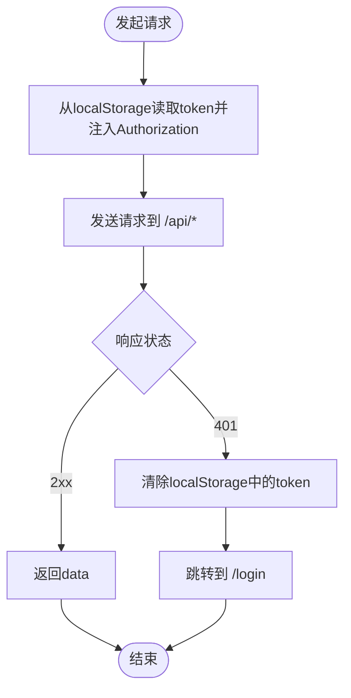
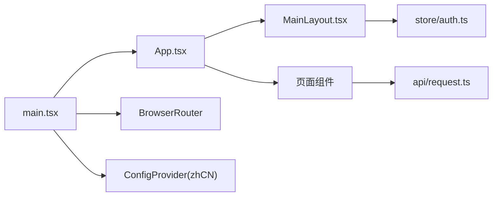

# 布局与组件

<cite>
**本文引用的文件**
- [frontend/admin/src/components/MainLayout.tsx](file://frontend/admin/src/components/MainLayout.tsx)
- [frontend/client/src/components/MainLayout.tsx](file://frontend/client/src/components/MainLayout.tsx)
- [frontend/admin/src/App.tsx](file://frontend/admin/src/App.tsx)
- [frontend/client/src/App.tsx](file://frontend/client/src/App.tsx)
- [frontend/admin/src/store/auth.ts](file://frontend/admin/src/store/auth.ts)
- [frontend/client/src/store/auth.ts](file://frontend/client/src/store/auth.ts)
- [frontend/admin/src/main.tsx](file://frontend/admin/src/main.tsx)
- [frontend/client/src/main.tsx](file://frontend/client/src/main.tsx)
- [frontend/admin/vite.config.ts](file://frontend/admin/vite.config.ts)
- [frontend/client/vite.config.ts](file://frontend/client/vite.config.ts)
- [frontend/admin/package.json](file://frontend/admin/package.json)
- [frontend/client/package.json](file://frontend/client/package.json)
- [frontend/admin/src/pages/Dashboard.tsx](file://frontend/admin/src/pages/Dashboard.tsx)
- [frontend/client/src/pages/Dashboard.tsx](file://frontend/client/src/pages/Dashboard.tsx)
- [frontend/admin/src/api/request.ts](file://frontend/admin/src/api/request.ts)
- [frontend/client/src/api/request.ts](file://frontend/client/src/api/request.ts)
</cite>

## 目录
1. [简介](#简介)
2. [项目结构](#项目结构)
3. [核心组件](#核心组件)
4. [架构总览](#架构总览)
5. [组件详解](#组件详解)
6. [依赖关系分析](#依赖关系分析)
7. [性能考量](#性能考量)
8. [故障排查指南](#故障排查指南)
9. [结论](#结论)
10. [附录](#附录)

## 简介
本文件聚焦ToolHub客户端的布局与组件系统，围绕以下目标展开：  
- 主布局组件MainLayout的设计模式、导航结构与响应式适配  
- 应用入口App的初始化流程、路由配置与全局状态管理  
- 组件复用策略、样式系统与主题切换机制  
- 导航菜单的动态生成、权限控制与面包屑导航  
- 组件通信模式、事件处理与生命周期管理最佳实践  
- 性能优化、代码分割与懒加载实现方案  

## 项目结构
前端采用双包结构（admin/client），分别服务于管理端与普通客户端，共享Ant Design UI与React Router路由体系，使用Vite构建与Axios进行API请求封装。

图表来源
- [frontend/admin/src/main.tsx:1-18](file://frontend/admin/src/main.tsx#L1-L18)
- [frontend/admin/src/App.tsx:1-44](file://frontend/admin/src/App.tsx#L1-L44)
- [frontend/admin/src/components/MainLayout.tsx:1-68](file://frontend/admin/src/components/MainLayout.tsx#L1-L68)
- [frontend/admin/src/store/auth.ts:1-30](file://frontend/admin/src/store/auth.ts#L1-L30)
- [frontend/admin/src/api/request.ts:1-28](file://frontend/admin/src/api/request.ts#L1-L28)
- [frontend/admin/vite.config.ts:1-15](file://frontend/admin/vite.config.ts#L1-L15)
- [frontend/admin/package.json:1-29](file://frontend/admin/package.json#L1-L29)

章节来源
- [frontend/admin/src/main.tsx:1-18](file://frontend/admin/src/main.tsx#L1-L18)
- [frontend/client/src/main.tsx:1-18](file://frontend/client/src/main.tsx#L1-L18)
- [frontend/admin/vite.config.ts:1-15](file://frontend/admin/vite.config.ts#L1-L15)
- [frontend/client/vite.config.ts:1-15](file://frontend/client/vite.config.ts#L1-L15)
- [frontend/admin/package.json:1-29](file://frontend/admin/package.json#L1-L29)
- [frontend/client/package.json:1-29](file://frontend/client/package.json#L1-L29)

## 核心组件
- 主布局组件MainLayout：统一侧边导航、顶部操作区与内容区域，支持不同主题风格与菜单项差异。  
- 应用入口App：基于路由与鉴权状态决定渲染登录页或带侧边栏的主布局，并在未登录时重定向到登录页。  
- 全局状态管理：基于Zustand的认证状态存储，持久化Token于localStorage，提供登录/登出能力。  
- API请求封装：基于Axios创建实例，统一设置基础URL与超时，注入Authorization头；统一处理401未授权并跳转登录。  

章节来源
- [frontend/admin/src/components/MainLayout.tsx:1-68](file://frontend/admin/src/components/MainLayout.tsx#L1-L68)
- [frontend/client/src/components/MainLayout.tsx:1-56](file://frontend/client/src/components/MainLayout.tsx#L1-L56)
- [frontend/admin/src/App.tsx:1-44](file://frontend/admin/src/App.tsx#L1-L44)
- [frontend/client/src/App.tsx:1-42](file://frontend/client/src/App.tsx#L1-L42)
- [frontend/admin/src/store/auth.ts:1-30](file://frontend/admin/src/store/auth.ts#L1-L30)
- [frontend/client/src/store/auth.ts:1-30](file://frontend/client/src/store/auth.ts#L1-L30)
- [frontend/admin/src/api/request.ts:1-28](file://frontend/admin/src/api/request.ts#L1-L28)
- [frontend/client/src/api/request.ts:1-28](file://frontend/client/src/api/request.ts#L1-L28)

## 架构总览
应用启动流程与路由守卫如下：

图表来源
- [frontend/admin/src/main.tsx:1-18](file://frontend/admin/src/main.tsx#L1-L18)
- [frontend/admin/src/App.tsx:1-44](file://frontend/admin/src/App.tsx#L1-L44)
- [frontend/admin/src/store/auth.ts:1-30](file://frontend/admin/src/store/auth.ts#L1-L30)
- [frontend/admin/src/components/MainLayout.tsx:1-68](file://frontend/admin/src/components/MainLayout.tsx#L1-L68)

## 组件详解

### 主布局组件MainLayout
- 设计模式：高内聚低耦合的布局容器，通过children接收页面内容，内部仅负责布局与导航交互。  
- 导航结构：  
  - 管理端：侧边菜单包含Dashboard、用户管理、角色管理、Skills管理、Tools管理、审批管理、部门管理、审计日志等。  
  - 客户端：侧边菜单包含首页、Skills、Tools、权限申请、我的申请等。  
- 响应式适配：  
  - 使用Ant Design Layout组件，Sider宽度在管理端为200px、客户端为180px，Header与Content区域具备基础边框与圆角样式，满足移动端基础体验。  
- 交互逻辑：  
  - 顶部右侧提供登出图标，点击后调用全局状态logout并跳转至登录页。  
  - 菜单点击触发路由跳转，选中态根据当前路径自动同步。  

图表来源
- [frontend/admin/src/components/MainLayout.tsx:1-68](file://frontend/admin/src/components/MainLayout.tsx#L1-L68)
- [frontend/client/src/components/MainLayout.tsx:1-56](file://frontend/client/src/components/MainLayout.tsx#L1-L56)
- [frontend/admin/src/store/auth.ts:1-30](file://frontend/admin/src/store/auth.ts#L1-L30)
- [frontend/client/src/store/auth.ts:1-30](file://frontend/client/src/store/auth.ts#L1-L30)

章节来源
- [frontend/admin/src/components/MainLayout.tsx:1-68](file://frontend/admin/src/components/MainLayout.tsx#L1-L68)
- [frontend/client/src/components/MainLayout.tsx:1-56](file://frontend/client/src/components/MainLayout.tsx#L1-L56)

### 应用入口App与路由配置
- 初始化流程：  
  - main.tsx中以ConfigProvider包裹应用，设置Ant Design本地化为简体中文；以BrowserRouter作为路由根组件。  
  - App.tsx中读取全局状态中的token，若为空则仅渲染登录路由与通配重定向；否则渲染MainLayout并在其内部嵌套页面路由。  
- 路由配置：  
  - 管理端：包含Dashboard、Users、Roles、Skills、Tools、Approvals、Departments、AuditLogs等路由。  
  - 客户端：包含Dashboard、Skills、Tools、SkillDetail、ToolDetail、ApplyPermission、MyRequests等路由，支持参数化路由如/tools/:id。  
- 鉴权守卫：  
  - 未登录时所有路由均被重定向至/login；登录后才允许访问受保护的页面。  

图表来源
- [frontend/admin/src/main.tsx:1-18](file://frontend/admin/src/main.tsx#L1-L18)
- [frontend/client/src/main.tsx:1-18](file://frontend/client/src/main.tsx#L1-L18)
- [frontend/admin/src/App.tsx:1-44](file://frontend/admin/src/App.tsx#L1-L44)
- [frontend/client/src/App.tsx:1-42](file://frontend/client/src/App.tsx#L1-L42)
- [frontend/admin/src/store/auth.ts:1-30](file://frontend/admin/src/store/auth.ts#L1-L30)
- [frontend/client/src/store/auth.ts:1-30](file://frontend/client/src/store/auth.ts#L1-L30)

章节来源
- [frontend/admin/src/main.tsx:1-18](file://frontend/admin/src/main.tsx#L1-L18)
- [frontend/client/src/main.tsx:1-18](file://frontend/client/src/main.tsx#L1-L18)
- [frontend/admin/src/App.tsx:1-44](file://frontend/admin/src/App.tsx#L1-L44)
- [frontend/client/src/App.tsx:1-42](file://frontend/client/src/App.tsx#L1-L42)

### 全局状态管理（Zustand）
- 数据模型：  
  - token: 字符串或空，用于鉴权；  
  - user: 用户信息对象或空；  
  - setAuth: 设置token与用户信息，并持久化到localStorage；  
  - logout: 移除localStorage中的token并清空状态。  
- 复用策略：  
  - 管理端与客户端各自维护独立的useAuthStore，避免跨域状态污染；  
  - 登出后统一跳转至登录页，确保路由守卫生效。  

图表来源
- [frontend/admin/src/store/auth.ts:1-30](file://frontend/admin/src/store/auth.ts#L1-L30)
- [frontend/client/src/store/auth.ts:1-30](file://frontend/client/src/store/auth.ts#L1-L30)

章节来源
- [frontend/admin/src/store/auth.ts:1-30](file://frontend/admin/src/store/auth.ts#L1-L30)
- [frontend/client/src/store/auth.ts:1-30](file://frontend/client/src/store/auth.ts#L1-L30)

### API请求封装与鉴权拦截
- Axios实例：  
  - 基础URL为/api，超时10秒；  
  - 请求拦截器：从localStorage读取token并注入Authorization头；  
  - 响应拦截器：统一返回data；当401时清除token并跳转登录页。  
- 与路由守卫协同：  
  - 401时自动触发登出与重定向，保证UI与状态一致。  

图表来源
- [frontend/admin/src/api/request.ts:1-28](file://frontend/admin/src/api/request.ts#L1-L28)
- [frontend/client/src/api/request.ts:1-28](file://frontend/client/src/api/request.ts#L1-L28)

章节来源
- [frontend/admin/src/api/request.ts:1-28](file://frontend/admin/src/api/request.ts#L1-L28)
- [frontend/client/src/api/request.ts:1-28](file://frontend/client/src/api/request.ts#L1-L28)

### 页面组件与数据加载
- 管理端Dashboard：  
  - 并发请求用户、Skills、Tools与待审批数量，聚合统计并展示卡片统计。  
- 客户端Dashboard：  
  - 并发请求权限列表与总量，展示“我的Skills/Tools”与“全部Skills/Tools”。  
- 最佳实践：  
  - 使用Promise.all并发请求提升首屏性能；  
  - 在副作用中捕获错误并记录日志，避免阻塞UI渲染。  

章节来源
- [frontend/admin/src/pages/Dashboard.tsx:1-51](file://frontend/admin/src/pages/Dashboard.tsx#L1-L51)
- [frontend/client/src/pages/Dashboard.tsx:1-50](file://frontend/client/src/pages/Dashboard.tsx#L1-L50)

### 样式系统与主题切换机制
- Ant Design主题：  
  - 通过ConfigProvider设置locale为zhCN，默认使用Ant Design内置主题；  
  - Sider在管理端使用dark主题，客户端使用light主题，体现视觉区分。  
- 自定义样式：  
  - 通过内联样式控制Sider标题颜色、Header边框与Content圆角，保持一致性与可读性。  
- 主题切换建议：  
  - 可引入CSS变量或第三方主题库，在ConfigProvider中切换主题变量；  
  - 将主题状态存入全局状态store，实现持久化的主题偏好。  

章节来源
- [frontend/admin/src/main.tsx:1-18](file://frontend/admin/src/main.tsx#L1-L18)
- [frontend/client/src/main.tsx:1-18](file://frontend/client/src/main.tsx#L1-L18)
- [frontend/admin/src/components/MainLayout.tsx:45-48](file://frontend/admin/src/components/MainLayout.tsx#L45-L48)
- [frontend/client/src/components/MainLayout.tsx:39-42](file://frontend/client/src/components/MainLayout.tsx#L39-L42)

### 导航菜单的动态生成、权限控制与面包屑导航
- 动态生成：  
  - 菜单项数组集中定义，便于统一维护；  
  - 选中态通过selectedKeys绑定当前路径，自动高亮。  
- 权限控制：  
  - 当前实现通过路由守卫与全局状态token控制访问；  
  - 建议扩展：在菜单项上增加权限标识，结合用户角色动态过滤显示。  
- 面包屑导航：  
  - 当前未实现；建议在路由层级较深时引入面包屑组件，结合路由路径动态生成。  

章节来源
- [frontend/admin/src/components/MainLayout.tsx:18-27](file://frontend/admin/src/components/MainLayout.tsx#L18-L27)
- [frontend/client/src/components/MainLayout.tsx:15-21](file://frontend/client/src/components/MainLayout.tsx#L15-L21)
- [frontend/admin/src/App.tsx:1-44](file://frontend/admin/src/App.tsx#L1-L44)
- [frontend/client/src/App.tsx:1-42](file://frontend/client/src/App.tsx#L1-L42)

### 组件通信模式、事件处理与生命周期管理
- 通信模式：  
  - 父子通信：MainLayout通过children向子页面传递内容；  
  - 全局状态：useAuthStore在多处组件间共享登录状态；  
  - 路由通信：useNavigate/useLocation在布局与页面间传递路径信息。  
- 事件处理：  
  - 菜单点击与登出点击均通过onClick回调处理，避免直接在JSX中内联函数导致重复渲染。  
- 生命周期管理：  
  - 使用useEffect进行数据加载与副作用清理；  
  - 在组件卸载前确保取消未完成的请求（如需）。  

章节来源
- [frontend/admin/src/components/MainLayout.tsx:33-41](file://frontend/admin/src/components/MainLayout.tsx#L33-L41)
- [frontend/client/src/components/MainLayout.tsx:27-35](file://frontend/client/src/components/MainLayout.tsx#L27-L35)
- [frontend/admin/src/store/auth.ts:1-30](file://frontend/admin/src/store/auth.ts#L1-L30)
- [frontend/client/src/store/auth.ts:1-30](file://frontend/client/src/store/auth.ts#L1-L30)

### 性能优化、代码分割与懒加载
- 代码分割：  
  - Vite默认支持按需打包；建议将大型页面组件按路由拆分，配合React.lazy与Suspense实现懒加载。  
- 懒加载示例思路：  
  - 对Dashboard、Skills、Tools等页面使用动态导入；  
  - 在路由层包装Suspense，避免首屏阻塞。  
- 其他优化：  
  - 合理使用并发请求（如Dashboard中Promise.all）；  
  - 缓存API响应与用户偏好；  
  - 减少不必要的重渲染，使用memo或浅比较优化props。  

章节来源
- [frontend/admin/vite.config.ts:1-15](file://frontend/admin/vite.config.ts#L1-L15)
- [frontend/client/vite.config.ts:1-15](file://frontend/client/vite.config.ts#L1-L15)
- [frontend/admin/src/pages/Dashboard.tsx:12-29](file://frontend/admin/src/pages/Dashboard.tsx#L12-L29)
- [frontend/client/src/pages/Dashboard.tsx:12-28](file://frontend/client/src/pages/Dashboard.tsx#L12-L28)

## 依赖关系分析
- 组件依赖：  
  - MainLayout依赖Ant Design Layout/Menu与路由钩子；  
  - App依赖MainLayout与各页面组件；  
  - 页面组件依赖API模块与Ant Design UI。  
- 状态依赖：  
  - App与MainLayout均依赖useAuthStore；  
  - API拦截器依赖localStorage与全局状态。  
- 外部依赖：  
  - React、React Router DOM、Ant Design、Axios、Zustand、Day.js、Vite。  

图表来源
- [frontend/admin/src/App.tsx:1-44](file://frontend/admin/src/App.tsx#L1-L44)
- [frontend/admin/src/components/MainLayout.tsx:1-68](file://frontend/admin/src/components/MainLayout.tsx#L1-L68)
- [frontend/admin/src/store/auth.ts:1-30](file://frontend/admin/src/store/auth.ts#L1-L30)
- [frontend/admin/src/api/request.ts:1-28](file://frontend/admin/src/api/request.ts#L1-L28)
- [frontend/admin/src/main.tsx:1-18](file://frontend/admin/src/main.tsx#L1-L18)

章节来源
- [frontend/admin/src/App.tsx:1-44](file://frontend/admin/src/App.tsx#L1-L44)
- [frontend/admin/src/components/MainLayout.tsx:1-68](file://frontend/admin/src/components/MainLayout.tsx#L1-L68)
- [frontend/admin/src/store/auth.ts:1-30](file://frontend/admin/src/store/auth.ts#L1-L30)
- [frontend/admin/src/api/request.ts:1-28](file://frontend/admin/src/api/request.ts#L1-L28)
- [frontend/admin/src/main.tsx:1-18](file://frontend/admin/src/main.tsx#L1-L18)

## 性能考量
- 首屏优化：  
  - 使用并发请求减少等待时间；  
  - 将非关键页面组件懒加载，降低初始包体积。  
- 状态与缓存：  
  - 将常用统计数据与用户偏好缓存在store或localStorage；  
  - 避免在渲染阶段执行昂贵计算。  
- 资源与网络：  
  - 合理设置Axios超时与重试策略；  
  - 通过代理配置开发环境下的跨域请求。  

## 故障排查指南
- 登录后仍跳回登录页  
  - 检查localStorage中token是否存在；  
  - 确认API拦截器是否正确注入Authorization头；  
  - 查看401响应是否触发了登出逻辑。  
- 菜单不选中或点击无效  
  - 确认selectedKeys绑定的路径与当前路由一致；  
  - 检查onClick回调是否正确调用navigate。  
- 页面空白或白屏  
  - 检查main.tsx中ConfigProvider与BrowserRouter包裹是否正确；  
  - 确认Vite代理配置指向正确的后端地址。  

章节来源
- [frontend/admin/src/api/request.ts:16-25](file://frontend/admin/src/api/request.ts#L16-L25)
- [frontend/client/src/api/request.ts:16-25](file://frontend/client/src/api/request.ts#L16-L25)
- [frontend/admin/src/components/MainLayout.tsx:49-55](file://frontend/admin/src/components/MainLayout.tsx#L49-L55)
- [frontend/client/src/components/MainLayout.tsx](file://frontend/client/src/components/MainLayout.tsx#L43)
- [frontend/admin/src/main.tsx:9-17](file://frontend/admin/src/main.tsx#L9-L17)
- [frontend/client/src/main.tsx:9-17](file://frontend/client/src/main.tsx#L9-L17)
- [frontend/admin/vite.config.ts:6-13](file://frontend/admin/vite.config.ts#L6-L13)
- [frontend/client/vite.config.ts:6-13](file://frontend/client/vite.config.ts#L6-L13)

## 结论
ToolHub客户端采用清晰的双包架构与统一的布局组件，结合Zustand实现轻量级全局状态管理，配合Axios拦截器与路由守卫形成完整的鉴权闭环。通过并发请求与可扩展的主题系统，系统在功能完整性与可维护性方面表现良好。后续可在权限细化、面包屑导航、主题持久化与懒加载等方面进一步增强用户体验与性能表现。

## 附录
- 开发与构建  
  - 管理端：开发端口5174，构建产物输出至dist；  
  - 客户端：开发端口5173，构建产物输出至dist；  
  - 两者均通过Vite代理将/api转发至后端服务。  

章节来源
- [frontend/admin/package.json:6-10](file://frontend/admin/package.json#L6-L10)
- [frontend/client/package.json:6-10](file://frontend/client/package.json#L6-L10)
- [frontend/admin/vite.config.ts:6-13](file://frontend/admin/vite.config.ts#L6-L13)
- [frontend/client/vite.config.ts:6-13](file://frontend/client/vite.config.ts#L6-L13)