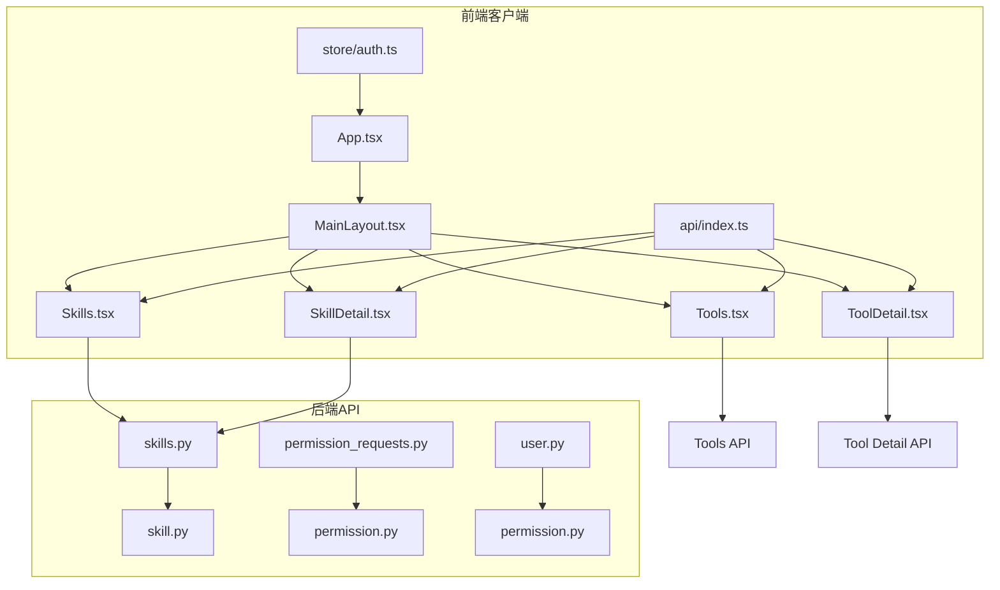
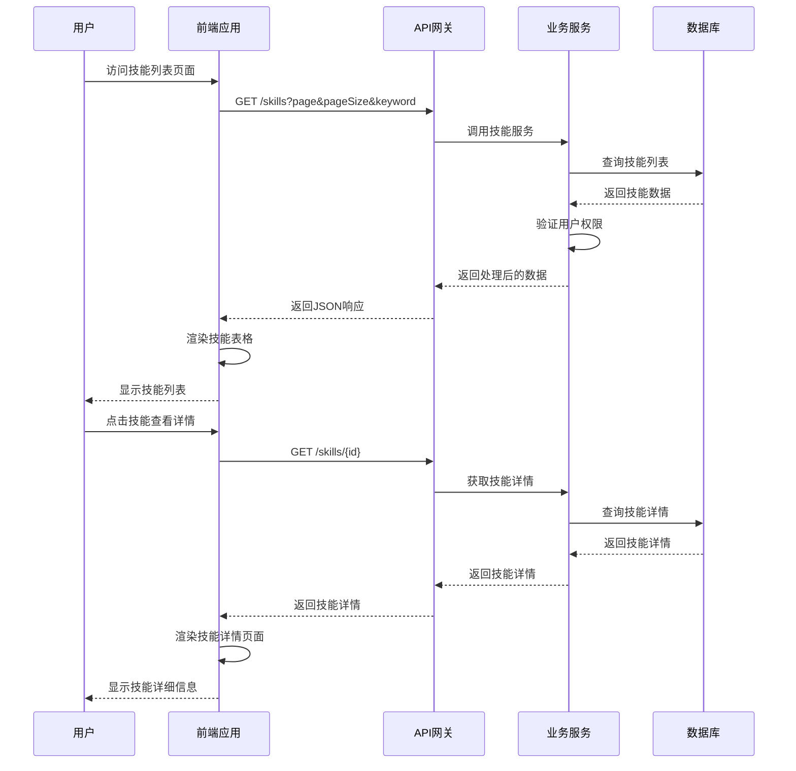
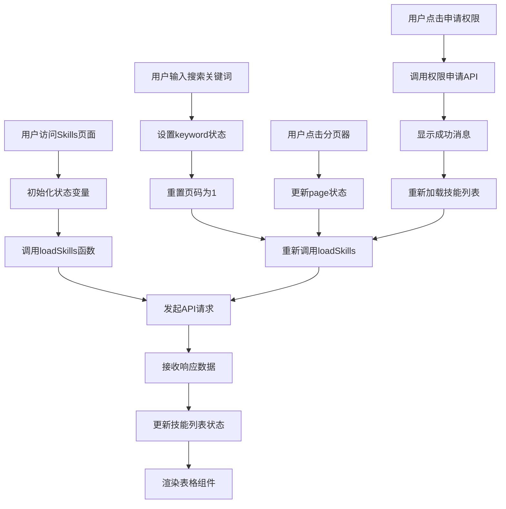
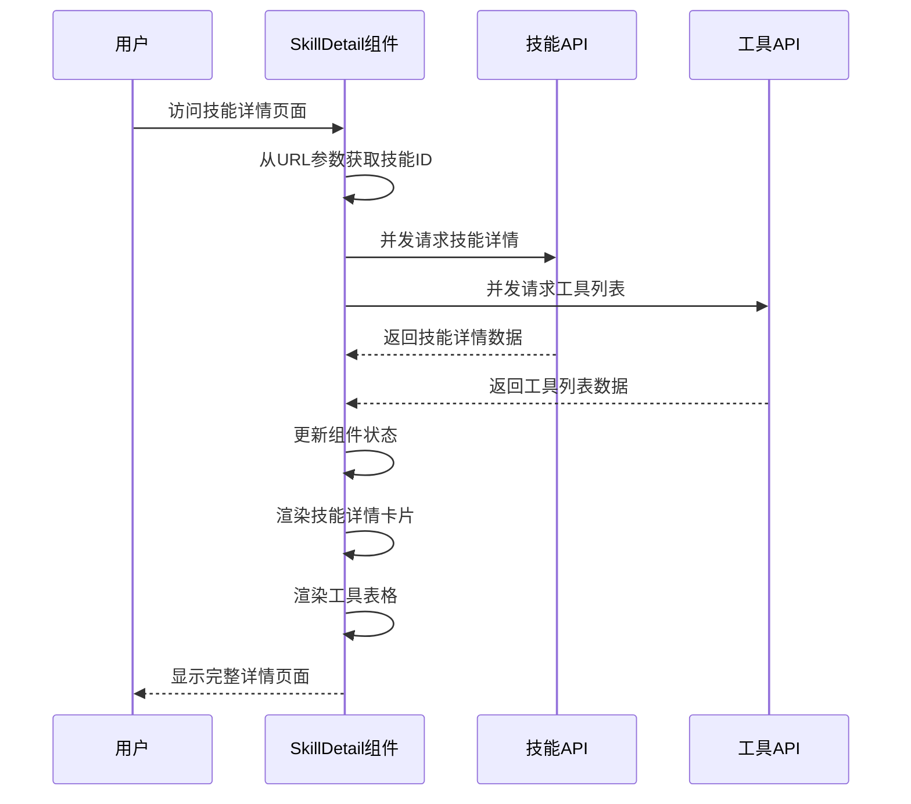
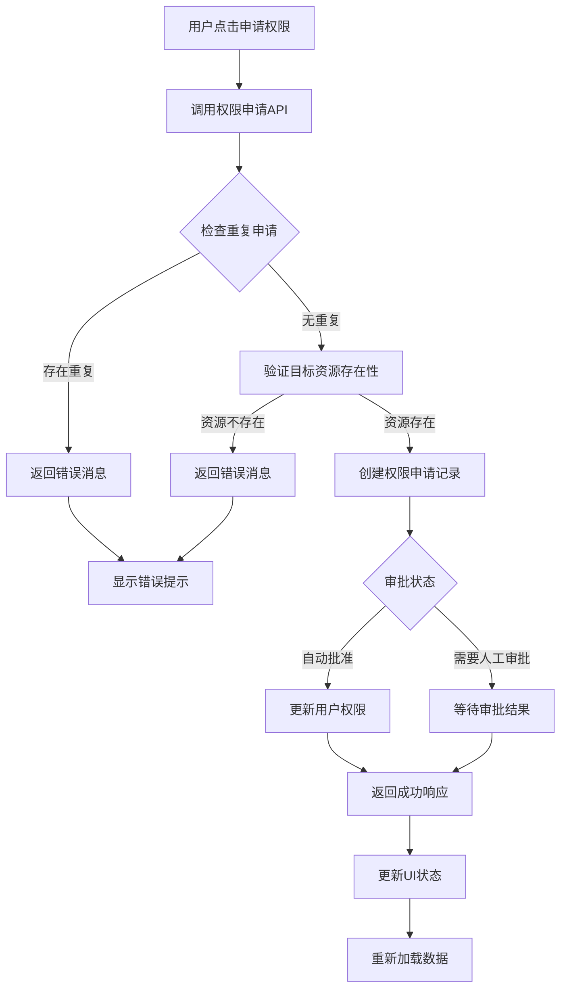
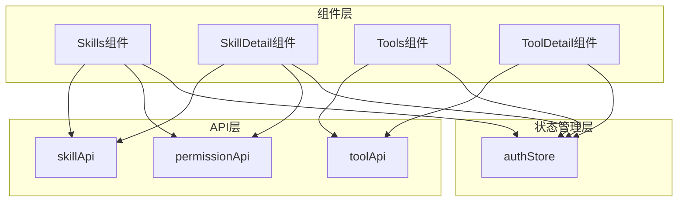
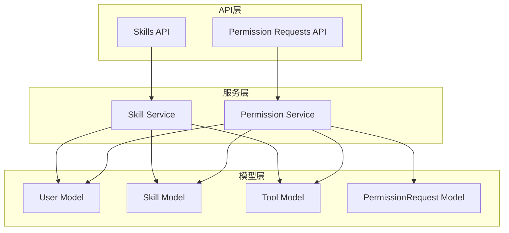

# 技能管理页面

<cite>
**本文档引用的文件**
- [Skills.tsx](file://frontend/client/src/pages/Skills.tsx)
- [SkillDetail.tsx](file://frontend/client/src/pages/SkillDetail.tsx)
- [Tools.tsx](file://frontend/client/src/pages/Tools.tsx)
- [ToolDetail.tsx](file://frontend/client/src/pages/ToolDetail.tsx)
- [auth.ts](file://frontend/client/src/store/auth.ts)
- [index.ts](file://frontend/client/src/api/index.ts)
- [App.tsx](file://frontend/client/src/App.tsx)
- [MainLayout.tsx](file://frontend/client/src/components/MainLayout.tsx)
- [skills.py](file://backend/app/api/skills.py)
- [skill.py](file://backend/app/services/skill.py)
- [permission.py](file://backend/app/services/permission.py)
- [permission_requests.py](file://backend/app/api/permission_requests.py)
- [user.py](file://backend/app/models/user.py)
- [permission.py](file://backend/app/models/permission.py)
</cite>

## 目录
1. [简介](#简介)
2. [项目结构](#项目结构)
3. [核心组件](#核心组件)
4. [架构概览](#架构概览)
5. [详细组件分析](#详细组件分析)
6. [依赖分析](#依赖分析)
7. [性能考虑](#性能考虑)
8. [故障排除指南](#故障排除指南)
9. [结论](#结论)

## 简介

ToolHub客户端技能管理页面是一个完整的技能资源管理系统，提供了技能浏览、搜索、权限申请等功能。该系统采用前后端分离架构，前端使用React + Ant Design构建用户界面，后端基于FastAPI提供RESTful API服务。

系统的核心功能包括：
- 技能列表展示与分页加载
- 搜索功能（支持技能名称和描述）
- 技能详情查看与工具关联展示
- 权限申请与状态管理
- 用户权限验证与动态内容展示

## 项目结构

ToolHub客户端采用模块化组织方式，主要分为前端客户端和后端API两个部分：



**图表来源**
- [App.tsx:13-39](file://frontend/client/src/App.tsx#L13-L39)
- [MainLayout.tsx:27-54](file://frontend/client/src/components/MainLayout.tsx#L27-L54)
- [skills.py:10-86](file://backend/app/api/skills.py#L10-L86)

**章节来源**
- [App.tsx:1-42](file://frontend/client/src/App.tsx#L1-L42)
- [MainLayout.tsx:1-56](file://frontend/client/src/components/MainLayout.tsx#L1-L56)

## 核心组件

### 前端组件架构

前端技能管理页面由多个React组件构成，每个组件负责特定的功能领域：

1. **Skills组件** - 技能列表展示与搜索
2. **SkillDetail组件** - 技能详情与工具关联
3. **Tools组件** - 工具列表与技能筛选
4. **ToolDetail组件** - 工具详情展示

### 后端API架构

后端提供RESTful API接口，采用分层架构设计：

1. **API路由层** - 处理HTTP请求和响应
2. **服务层** - 实现业务逻辑
3. **模型层** - 数据库ORM映射

**章节来源**
- [Skills.tsx:7-58](file://frontend/client/src/pages/Skills.tsx#L7-L58)
- [SkillDetail.tsx:6-65](file://frontend/client/src/pages/SkillDetail.tsx#L6-L65)

## 架构概览

ToolHub技能管理页面采用经典的MVC架构模式，结合现代前端框架的最佳实践：



**图表来源**
- [skills.py:13-41](file://backend/app/api/skills.py#L13-L41)
- [skill.py:12-31](file://backend/app/services/skill.py#L12-L31)

## 详细组件分析

### Skills组件分析

Skills组件是技能管理页面的核心，实现了完整的技能浏览功能：

#### 组件功能特性

1. **分页加载机制**
   - 支持每页20条记录
   - 自动计算总页数
   - 无缝切换页面

2. **搜索功能实现**
   - 支持关键词实时搜索
   - 同时搜索技能名称和描述
   - 搜索结果自动刷新

3. **权限状态显示**
   - 使用标签颜色区分权限状态
   - 已授权：绿色标签
   - 未授权：橙色标签

#### 数据流分析



**图表来源**
- [Skills.tsx:14-20](file://frontend/client/src/pages/Skills.tsx#L14-L20)
- [Skills.tsx:53-55](file://frontend/client/src/pages/Skills.tsx#L53-L55)

#### 关键实现细节

1. **状态管理**
   - `skills`: 存储当前页面的技能数据
   - `total`: 总记录数，用于分页计算
   - `page`: 当前页码，默认1
   - `keyword`: 搜索关键词

2. **API集成**
   - 使用`skillApi.getList()`获取技能列表
   - 参数包含分页信息和搜索条件
   - 支持可选的keyword参数

3. **权限处理**
   - 通过`has_permission`字段判断用户权限
   - 未授权用户显示申请按钮
   - 已授权用户显示占位符

**章节来源**
- [Skills.tsx:1-59](file://frontend/client/src/pages/Skills.tsx#L1-L59)

### SkillDetail组件分析

SkillDetail组件提供技能的详细信息展示，包含技能基本信息和关联工具列表：

#### 组件功能特性

1. **并发数据加载**
   - 使用Promise.all同时获取技能详情和工具列表
   - 提升页面加载性能
   - 错误处理机制

2. **权限状态展示**
   - 技能级别的权限状态
   - 工具级别的权限状态
   - 动态权限状态更新

3. **工具关联展示**
   - 展示技能下所有关联的工具
   - 支持工具权限申请
   - 工具状态可视化

#### 数据获取流程



**图表来源**
- [SkillDetail.tsx:12-22](file://frontend/client/src/pages/SkillDetail.tsx#L12-L22)

#### 关键实现细节

1. **并发请求优化**
   ```typescript
   const [skillRes, toolsRes]: any[] = await Promise.all([
     skillApi.getDetail(Number(id)),
     skillApi.getTools(Number(id)),
   ]);
   ```

2. **权限申请流程**
   - 每个工具行提供申请按钮
   - 申请类型固定为"tool"
   - 申请成功后显示成功消息

3. **状态管理**
   - `skill`: 技能详情对象
   - `tools`: 关联工具数组
   - 加载状态检查确保数据完整性

**章节来源**
- [SkillDetail.tsx:1-66](file://frontend/client/src/pages/SkillDetail.tsx#L1-L66)

### 权限管理系统

权限管理系统是技能管理页面的重要组成部分，实现了细粒度的权限控制：

#### 权限申请流程



**图表来源**
- [permission.py:12-32](file://backend/app/services/permission.py#L12-L32)

#### 权限验证机制

1. **用户权限查询**
   - 通过用户角色获取技能权限
   - 支持多角色权限合并
   - 状态过滤确保只返回激活的技能

2. **权限状态计算**
   - 基于用户角色技能集合
   - 过滤非激活状态的技能
   - 提供布尔值权限标识

**章节来源**
- [permission.py:76-88](file://backend/app/services/skill.py#L76-L88)
- [permission_requests.py:13-24](file://backend/app/api/permission_requests.py#L13-L24)

## 依赖分析

### 前端依赖关系



**图表来源**
- [index.ts:11-30](file://frontend/client/src/api/index.ts#L11-L30)
- [auth.ts:18-29](file://frontend/client/src/store/auth.ts#L18-L29)

### 后端依赖关系



**图表来源**
- [skills.py:6-8](file://backend/app/api/skills.py#L6-L8)
- [permission_requests.py:7-8](file://backend/app/api/permission_requests.py#L7-L8)

**章节来源**
- [index.ts:1-36](file://frontend/client/src/api/index.ts#L1-L36)
- [user.py:23-97](file://backend/app/models/user.py#L23-L97)

## 性能考虑

### 前端性能优化

1. **懒加载策略**
   - 使用React.lazy和Suspense实现组件懒加载
   - 减少初始包体积
   - 提升首屏加载速度

2. **虚拟滚动**
   - 对大量数据使用虚拟滚动
   - 限制DOM节点数量
   - 提升大数据集渲染性能

3. **缓存机制**
   - API响应缓存策略
   - 组件状态缓存
   - 避免重复请求

### 后端性能优化

1. **数据库查询优化**
   - 使用索引优化搜索查询
   - 分页查询避免全表扫描
   - 连接池管理

2. **权限验证优化**
   - 批量权限查询
   - 缓存用户权限信息
   - 减少数据库往返

### 用户体验提升

1. **加载状态管理**
   - 显示加载指示器
   - 错误状态友好提示
   - 空状态优雅展示

2. **交互反馈**
   - 即时的操作反馈
   - 成功/失败消息提示
   - 加载状态同步更新

## 故障排除指南

### 常见问题及解决方案

1. **技能列表加载失败**
   - 检查网络连接状态
   - 验证API端点可用性
   - 查看浏览器开发者工具中的错误信息

2. **权限申请提交失败**
   - 确认用户已登录
   - 检查目标资源是否存在
   - 验证重复申请检测逻辑

3. **搜索功能异常**
   - 检查关键词格式
   - 验证搜索参数传递
   - 确认后端搜索逻辑

### 调试技巧

1. **前端调试**
   - 使用React DevTools检查组件状态
   - 监控API请求响应
   - 检查状态更新日志

2. **后端调试**
   - 查看数据库查询日志
   - 监控API响应时间
   - 验证权限验证逻辑

**章节来源**
- [Skills.tsx:22-30](file://frontend/client/src/pages/Skills.tsx#L22-L30)
- [SkillDetail.tsx:26-33](file://frontend/client/src/pages/SkillDetail.tsx#L26-L33)

## 结论

ToolHub技能管理页面是一个功能完整、架构清晰的技能资源管理系统。通过合理的前后端分离设计、完善的权限控制机制和优秀的用户体验设计，为用户提供了高效的技能管理和工具使用体验。

### 主要优势

1. **功能完整性** - 覆盖了技能管理的所有核心需求
2. **架构合理性** - 前后端职责明确，耦合度低
3. **用户体验优秀** - 响应式设计，操作流畅
4. **扩展性强** - 模块化设计便于功能扩展

### 改进建议

1. **性能优化** - 可以考虑添加数据缓存机制
2. **监控增强** - 添加详细的错误监控和日志记录
3. **测试覆盖** - 增加单元测试和集成测试覆盖率
4. **文档完善** - 补充API文档和开发指南

该系统为类似的企业级技能管理平台提供了良好的参考模板，具有较强的实用价值和推广意义。