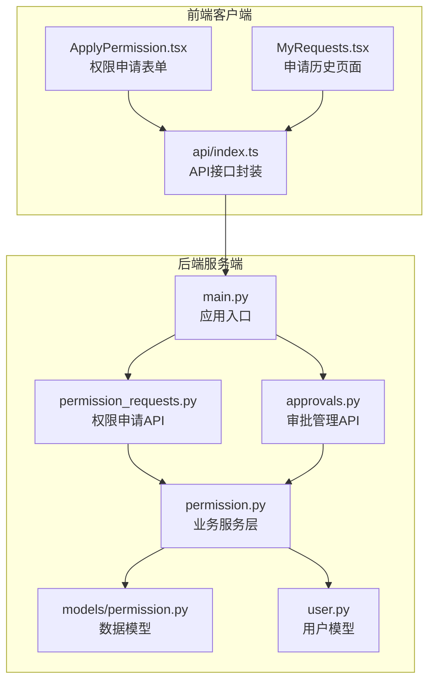
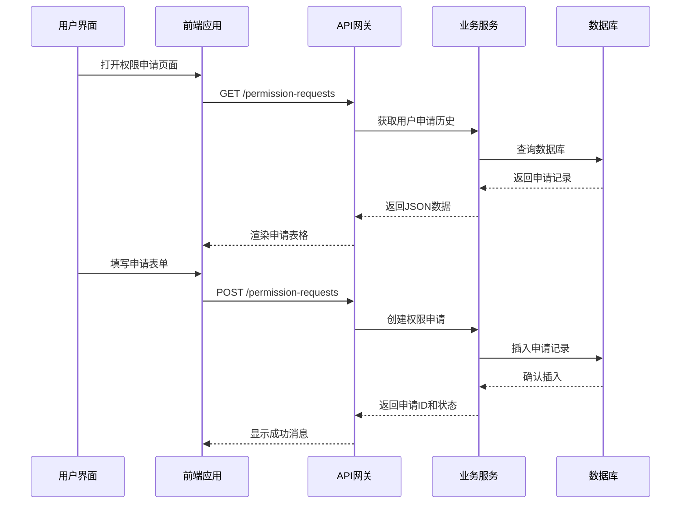
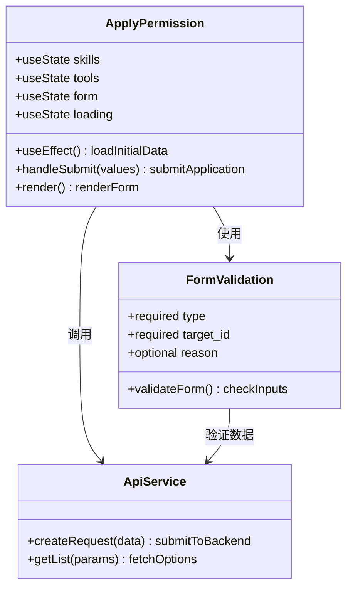
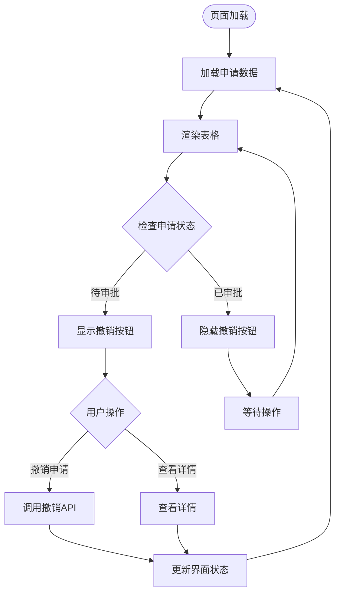
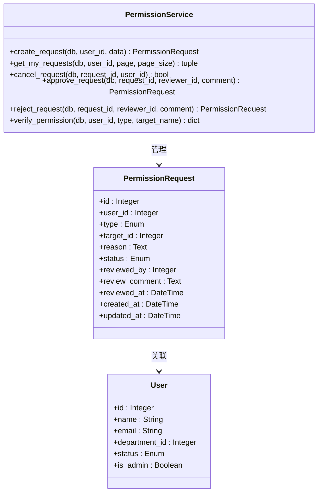
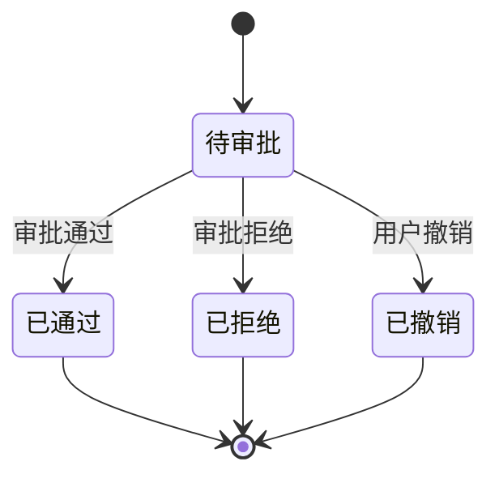
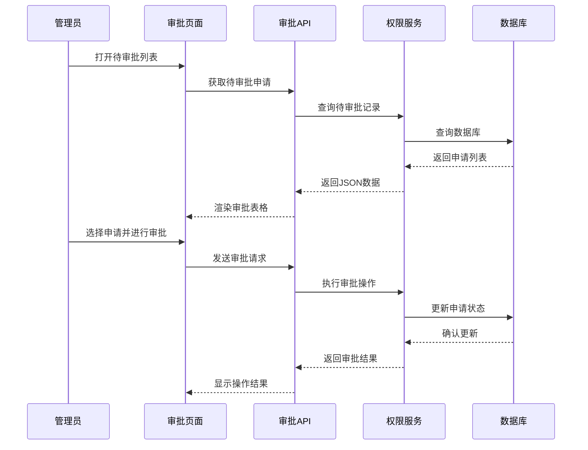
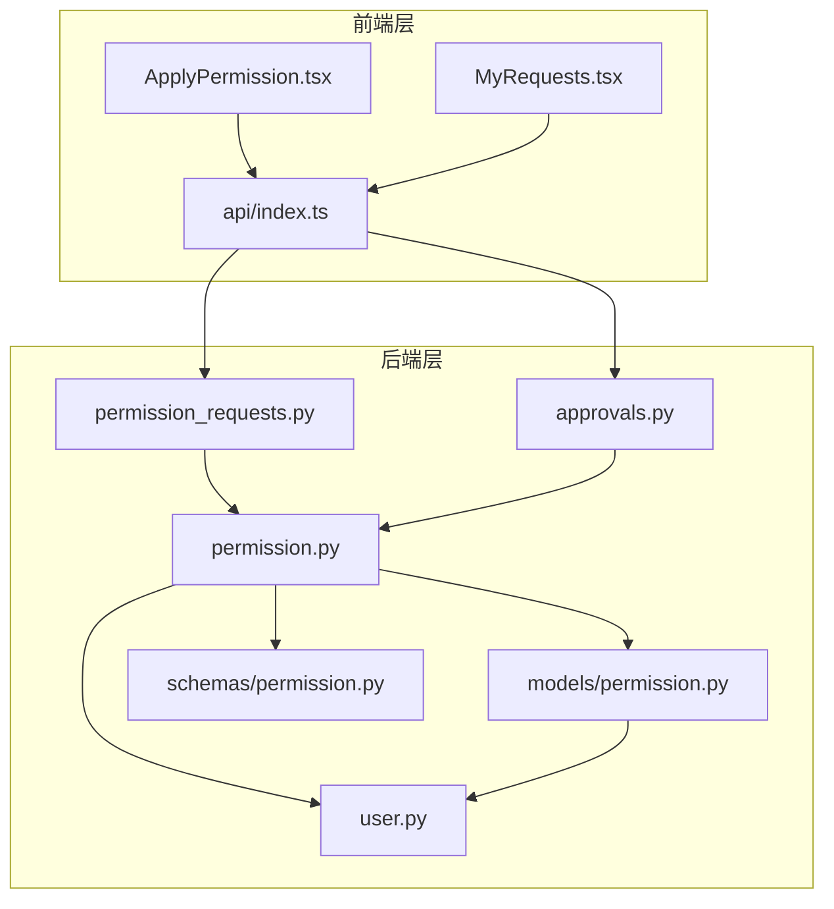
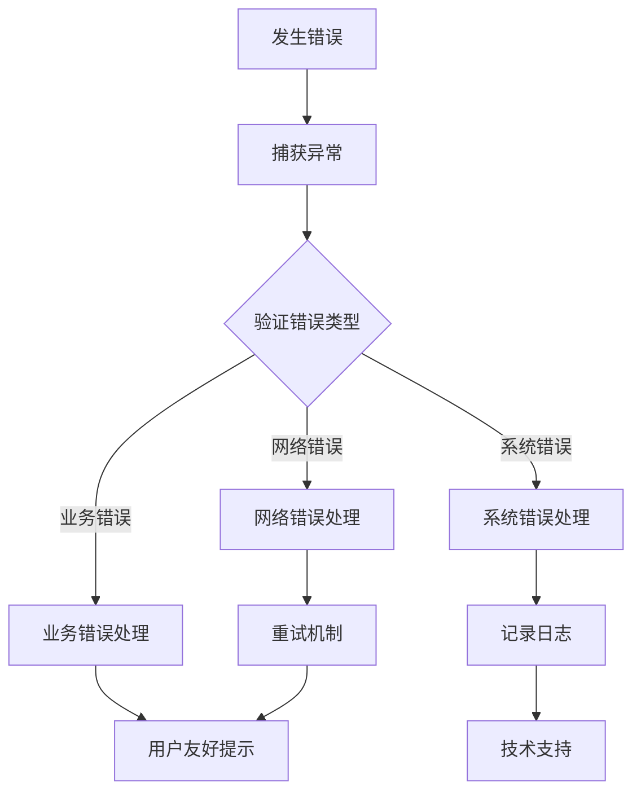

# 权限申请页面

<cite>
**本文档引用的文件**
- [ApplyPermission.tsx](file://frontend/client/src/pages/ApplyPermission.tsx)
- [MyRequests.tsx](file://frontend/client/src/pages/MyRequests.tsx)
- [index.ts](file://frontend/client/src/api/index.ts)
- [permission_requests.py](file://backend/app/api/permission_requests.py)
- [approvals.py](file://backend/app/api/admin/approvals.py)
- [permission.py](file://backend/app/services/permission.py)
- [permission.py](file://backend/app/models/permission.py)
- [user.py](file://backend/app/models/user.py)
- [permission.py](file://backend/app/schemas/permission.py)
- [main.py](file://backend/app/main.py)
</cite>

## 目录
1. [简介](#简介)
2. [项目结构](#项目结构)
3. [核心组件](#核心组件)
4. [架构概览](#架构概览)
5. [详细组件分析](#详细组件分析)
6. [依赖关系分析](#依赖关系分析)
7. [性能考虑](#性能考虑)
8. [故障排除指南](#故障排除指南)
9. [结论](#结论)

## 简介

ToolHub客户端权限申请页面是一个完整的权限管理系统，包含两个主要功能模块：权限申请表单和申请历史管理。该系统采用前后端分离架构，前端使用React + Ant Design构建用户界面，后端基于FastAPI提供RESTful API服务。

系统的核心功能包括：
- 用户权限申请表单设计与验证
- 申请历史查询与状态跟踪
- 审批流程管理
- 权限验证与分配
- 数据持久化与状态管理

## 项目结构

ToolHub项目采用清晰的分层架构，主要分为前端客户端和后端服务端两大部分：

**图表来源**
- [main.py:31-43](file://backend/app/main.py#L31-L43)
- [ApplyPermission.tsx:1-71](file://frontend/client/src/pages/ApplyPermission.tsx#L1-L71)
- [MyRequests.tsx:1-56](file://frontend/client/src/pages/MyRequests.tsx#L1-L56)

**章节来源**
- [main.py:31-43](file://backend/app/main.py#L31-L43)
- [ApplyPermission.tsx:1-71](file://frontend/client/src/pages/ApplyPermission.tsx#L1-L71)
- [MyRequests.tsx:1-56](file://frontend/client/src/pages/MyRequests.tsx#L1-L56)

## 核心组件

### 前端组件

**ApplyPermission 页面**
- 提供权限申请表单，支持技能和工具两种类型的权限申请
- 实时加载技能和工具列表，动态更新目标选项
- 包含完整的表单验证和错误处理机制
- 支持申请提交后的成功反馈和表单重置

**MyRequests 页面**
- 展示用户的完整申请历史记录
- 支持分页查询和状态筛选
- 提供申请撤销功能（仅限待审批状态）
- 实时状态显示和颜色标识

### 后端服务

**权限申请服务**
- 处理权限申请的创建、查询、撤销等核心业务逻辑
- 实现完整的状态管理和并发控制
- 提供权限验证和自动分配功能

**审批管理服务**
- 管理管理员的审批操作
- 支持批准和拒绝两种审批结果
- 记录详细的审计日志

**数据模型层**
- 定义权限申请的完整数据结构
- 支持多种状态转换和关联关系
- 提供权限验证和角色映射功能

**章节来源**
- [ApplyPermission.tsx:5-71](file://frontend/client/src/pages/ApplyPermission.tsx#L5-L71)
- [MyRequests.tsx:8-56](file://frontend/client/src/pages/MyRequests.tsx#L8-L56)
- [permission.py:9-182](file://backend/app/services/permission.py#L9-L182)

## 架构概览

ToolHub权限申请系统采用现代化的全栈架构，实现了前后端的完全分离：

**图表来源**
- [ApplyPermission.tsx:21-36](file://frontend/client/src/pages/ApplyPermission.tsx#L21-L36)
- [permission_requests.py:13-25](file://backend/app/api/permission_requests.py#L13-L25)
- [permission.py:12-43](file://backend/app/services/permission.py#L12-L43)

系统架构特点：
- **响应式设计**：Ant Design组件提供良好的用户体验
- **状态管理**：React Hooks实现组件状态管理
- **错误处理**：统一的错误捕获和用户反馈机制
- **数据绑定**：实时数据同步和状态更新

## 详细组件分析

### 权限申请表单组件

ApplyPermission组件是权限申请的核心界面，实现了完整的表单设计和交互逻辑：

**图表来源**
- [ApplyPermission.tsx:5-71](file://frontend/client/src/pages/ApplyPermission.tsx#L5-L71)
- [index.ts:24-30](file://frontend/client/src/api/index.ts#L24-L30)

**表单字段设计**：
- **申请类型**：下拉选择，支持"Skill"和"Tool"两种类型
- **目标选择**：根据类型动态加载对应的技能或工具列表
- **申请理由**：文本域输入，支持多行文本
- **提交按钮**：带加载状态的确认按钮

**验证规则**：
- 申请类型必填验证
- 目标选择必填验证
- 动态验证：根据类型切换可用选项
- 表单提交前的完整性检查

**数据流转**：
1. 组件初始化时并行加载技能和工具数据
2. 用户选择申请类型后，目标选项动态更新
3. 表单提交时验证数据完整性
4. 调用后端API创建权限申请
5. 成功后清空表单并显示反馈消息

**章节来源**
- [ApplyPermission.tsx:11-19](file://frontend/client/src/pages/ApplyPermission.tsx#L11-L19)
- [ApplyPermission.tsx:21-36](file://frontend/client/src/pages/ApplyPermission.tsx#L21-L36)
- [ApplyPermission.tsx:44-66](file://frontend/client/src/pages/ApplyPermission.tsx#L44-L66)

### 申请历史管理组件

MyRequests组件提供了完整的申请历史查询和管理功能：

**图表来源**
- [MyRequests.tsx:13-29](file://frontend/client/src/pages/MyRequests.tsx#L13-L29)
- [MyRequests.tsx:31-47](file://frontend/client/src/pages/MyRequests.tsx#L31-L47)

**状态管理**：
- **状态颜色映射**：pending(橙色)、approved(绿色)、rejected(红色)、cancelled(灰色)
- **状态标签本地化**：中文状态显示便于用户理解
- **实时状态更新**：撤销操作后立即刷新数据

**分页机制**：
- 每页固定显示20条记录
- 支持页码切换和总数统计
- 无感加载，用户体验流畅

**章节来源**
- [MyRequests.tsx:8-56](file://frontend/client/src/pages/MyRequests.tsx#L8-L56)

### 后端API服务

权限申请的后端服务实现了完整的业务逻辑和数据管理：

**图表来源**
- [permission.py:9-182](file://backend/app/services/permission.py#L9-L182)
- [permission.py:7-28](file://backend/app/models/permission.py#L7-L28)
- [user.py:23-39](file://backend/app/models/user.py#L23-L39)

**状态机设计**：
系统实现了完整的权限申请状态机，包含四种状态和转换规则：

**并发控制**：
- **重复申请防护**：同一用户对同一资源的重复申请会被阻止
- **状态锁定**：非待审批状态的申请无法被撤销或修改
- **事务管理**：数据库操作使用事务确保数据一致性

**权限验证**：
- **用户状态检查**：仅活跃用户可进行权限申请
- **目标存在性验证**：申请的目标必须存在于系统中
- **权限继承**：通过角色继承实现权限传递

**章节来源**
- [permission.py:12-43](file://backend/app/services/permission.py#L12-L43)
- [permission.py:58-69](file://backend/app/services/permission.py#L58-L69)
- [permission.py:86-144](file://backend/app/services/permission.py#L86-L144)

### 审批管理功能

管理员审批功能提供了完整的权限审批工作流：

**图表来源**
- [approvals.py:14-55](file://backend/app/api/admin/approvals.py#L14-L55)
- [approvals.py:58-87](file://backend/app/api/admin/approvals.py#L58-L87)

**审批流程**：
- **待审批列表**：管理员可查看所有待处理的权限申请
- **审批操作**：支持批准和拒绝两种操作
- **评论功能**：审批时可添加备注信息
- **审计日志**：所有审批操作都会记录详细日志

**章节来源**
- [approvals.py:14-55](file://backend/app/api/admin/approvals.py#L14-L55)
- [approvals.py:58-87](file://backend/app/api/admin/approvals.py#L58-L87)

## 依赖关系分析

系统各组件之间的依赖关系清晰明确，遵循了分层架构的最佳实践：

**图表来源**
- [main.py:31-43](file://backend/app/main.py#L31-L43)
- [index.ts:24-30](file://frontend/client/src/api/index.ts#L24-L30)

**依赖特点**：
- **单向依赖**：前端依赖后端API，后端内部组件间有清晰的依赖层次
- **接口隔离**：前端通过统一的API接口访问后端服务
- **模型复用**：数据模型在服务层和API层之间共享
- **职责分离**：各层职责明确，便于维护和扩展

**章节来源**
- [main.py:31-43](file://backend/app/main.py#L31-L43)
- [index.ts:24-30](file://frontend/client/src/api/index.ts#L24-L30)

## 性能考虑

系统在设计时充分考虑了性能优化和用户体验：

### 前端性能优化
- **并行数据加载**：技能和工具列表采用Promise.all并行加载
- **状态缓存**：使用React状态管理减少不必要的重新渲染
- **懒加载**：表格分页实现按需加载，避免一次性加载大量数据
- **防抖处理**：输入验证采用防抖机制，提升用户体验

### 后端性能优化
- **数据库索引**：关键查询字段建立适当索引
- **查询优化**：使用JOIN查询减少数据库往返次数
- **连接池**：数据库连接使用连接池管理
- **缓存策略**：热门数据采用适当的缓存机制

### 并发控制策略
- **乐观锁**：使用版本号或时间戳防止并发更新冲突
- **事务隔离**：关键操作使用数据库事务保证原子性
- **队列处理**：高并发场景下使用消息队列异步处理
- **限流保护**：对敏感接口实施访问频率限制

## 故障排除指南

### 常见问题及解决方案

**权限申请失败**
- 检查网络连接和API可达性
- 验证用户登录状态
- 确认目标资源是否存在且有效
- 查看浏览器控制台错误信息

**申请历史无法加载**
- 检查分页参数是否正确
- 验证用户权限是否足够
- 确认数据库连接状态
- 查看后端服务日志

**审批功能异常**
- 确认管理员权限
- 检查待审批状态的申请
- 验证审批操作的合法性
- 查看审计日志确认操作记录

### 错误处理机制

系统实现了多层次的错误处理：

**章节来源**
- [ApplyPermission.tsx:31-35](file://frontend/client/src/pages/ApplyPermission.tsx#L31-L35)
- [MyRequests.tsx:26-28](file://frontend/client/src/pages/MyRequests.tsx#L26-L28)

## 结论

ToolHub权限申请页面是一个设计完善的权限管理系统，具有以下显著特点：

**技术优势**：
- 采用现代化的前后端分离架构
- 实现了完整的权限申请和审批流程
- 提供了良好的用户体验和错误处理机制
- 具备良好的扩展性和维护性

**功能完整性**：
- 覆盖了权限申请的全流程管理
- 支持多种权限类型和复杂的权限关系
- 提供了完善的审计和监控功能
- 实现了数据的一致性和安全性

**用户体验**：
- 界面简洁直观，操作流程清晰
- 实时反馈和状态更新
- 响应式设计适配多种设备
- 提供了丰富的用户指导和帮助信息

该系统为ToolHub平台的权限管理提供了坚实的技术基础，能够满足企业级应用对权限控制的严格要求。