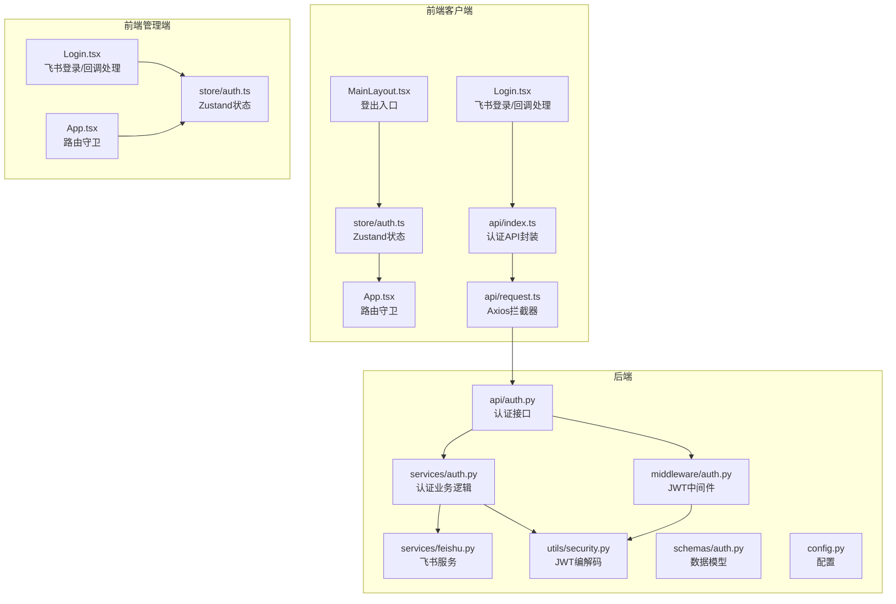
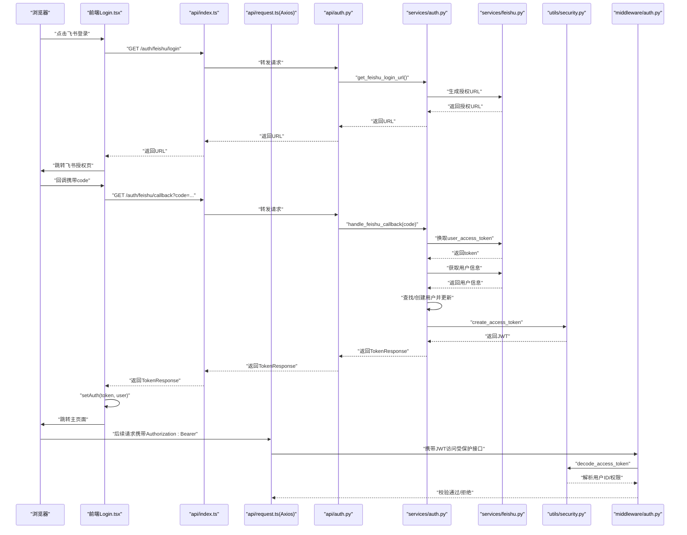
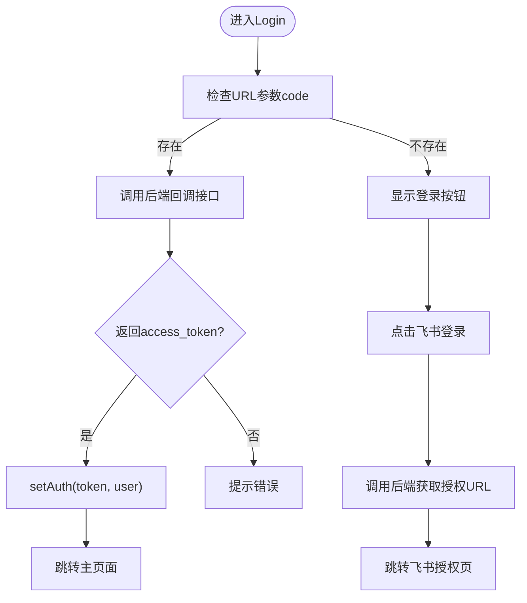
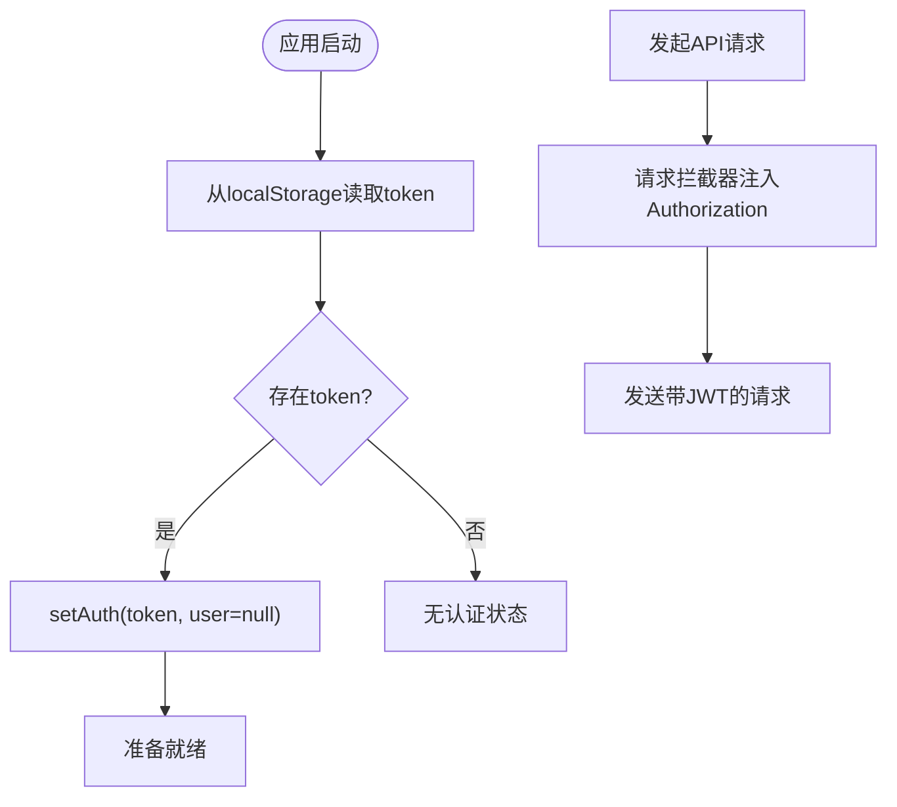
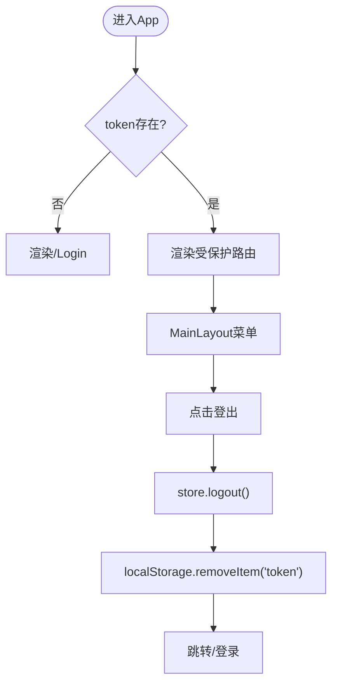
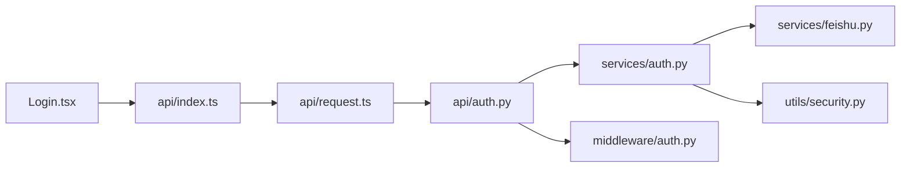

# 用户认证模块

<cite>
**本文档引用的文件**
- [frontend/client/src/pages/Login.tsx](file://frontend/client/src/pages/Login.tsx)
- [frontend/admin/src/pages/Login.tsx](file://frontend/admin/src/pages/Login.tsx)
- [frontend/client/src/store/auth.ts](file://frontend/client/src/store/auth.ts)
- [frontend/admin/src/store/auth.ts](file://frontend/admin/src/store/auth.ts)
- [frontend/client/src/App.tsx](file://frontend/client/src/App.tsx)
- [frontend/admin/src/App.tsx](file://frontend/admin/src/App.tsx)
- [frontend/client/src/components/MainLayout.tsx](file://frontend/client/src/components/MainLayout.tsx)
- [frontend/client/src/api/index.ts](file://frontend/client/src/api/index.ts)
- [frontend/client/src/api/request.ts](file://frontend/client/src/api/request.ts)
- [backend/app/api/auth.py](file://backend/app/api/auth.py)
- [backend/app/services/auth.py](file://backend/app/services/auth.py)
- [backend/app/services/feishu.py](file://backend/app/services/feishu.py)
- [backend/app/middleware/auth.py](file://backend/app/middleware/auth.py)
- [backend/app/utils/security.py](file://backend/app/utils/security.py)
- [backend/app/schemas/auth.py](file://backend/app/schemas/auth.py)
- [backend/app/config.py](file://backend/app/config.py)
</cite>

## 目录
1. [简介](#简介)
2. [项目结构](#项目结构)
3. [核心组件](#核心组件)
4. [架构总览](#架构总览)
5. [详细组件分析](#详细组件分析)
6. [依赖分析](#依赖分析)
7. [性能考虑](#性能考虑)
8. [故障排查指南](#故障排查指南)
9. [结论](#结论)
10. [附录](#附录)

## 简介
本文件面向ToolHub客户端的用户认证模块，聚焦以下目标：
- Login登录页面的飞书OAuth2集成与回调处理
- 用户身份验证、登录状态管理与路由守卫
- JWT令牌的存储策略、自动刷新机制与会话保持方案
- 认证状态的全局管理、权限控制实现
- 用户信息获取流程、缓存策略与状态同步机制
- 安全策略、令牌加密与防重放攻击实现细节
- 多设备登录处理、强制登出与异常状态恢复方案

## 项目结构
认证模块由前端客户端与管理端两套UI、统一的后端认证服务与中间件构成，采用“前端Zustand状态 + Axios拦截器 + 后端FastAPI接口 + JWT中间件”的分层设计。

图表来源
- [frontend/client/src/pages/Login.tsx:1-85](file://frontend/client/src/pages/Login.tsx#L1-L85)
- [frontend/client/src/store/auth.ts:1-30](file://frontend/client/src/store/auth.ts#L1-L30)
- [frontend/client/src/App.tsx:1-42](file://frontend/client/src/App.tsx#L1-L42)
- [frontend/client/src/components/MainLayout.tsx:1-56](file://frontend/client/src/components/MainLayout.tsx#L1-L56)
- [frontend/client/src/api/index.ts:1-36](file://frontend/client/src/api/index.ts#L1-L36)
- [frontend/client/src/api/request.ts:1-28](file://frontend/client/src/api/request.ts#L1-L28)
- [backend/app/api/auth.py:1-58](file://backend/app/api/auth.py#L1-L58)
- [backend/app/services/auth.py:1-122](file://backend/app/services/auth.py#L1-L122)
- [backend/app/services/feishu.py:1-120](file://backend/app/services/feishu.py#L1-L120)
- [backend/app/middleware/auth.py:1-45](file://backend/app/middleware/auth.py#L1-L45)
- [backend/app/utils/security.py:1-32](file://backend/app/utils/security.py#L1-L32)
- [backend/app/schemas/auth.py:1-26](file://backend/app/schemas/auth.py#L1-L26)
- [backend/app/config.py:1-42](file://backend/app/config.py#L1-L42)

章节来源
- [frontend/client/src/pages/Login.tsx:1-85](file://frontend/client/src/pages/Login.tsx#L1-L85)
- [frontend/admin/src/pages/Login.tsx:1-86](file://frontend/admin/src/pages/Login.tsx#L1-L86)
- [frontend/client/src/store/auth.ts:1-30](file://frontend/client/src/store/auth.ts#L1-L30)
- [frontend/admin/src/store/auth.ts:1-30](file://frontend/admin/src/store/auth.ts#L1-L30)
- [frontend/client/src/App.tsx:1-42](file://frontend/client/src/App.tsx#L1-L42)
- [frontend/admin/src/App.tsx:1-44](file://frontend/admin/src/App.tsx#L1-L44)
- [frontend/client/src/components/MainLayout.tsx:1-56](file://frontend/client/src/components/MainLayout.tsx#L1-L56)
- [frontend/client/src/api/index.ts:1-36](file://frontend/client/src/api/index.ts#L1-L36)
- [frontend/client/src/api/request.ts:1-28](file://frontend/client/src/api/request.ts#L1-L28)
- [backend/app/api/auth.py:1-58](file://backend/app/api/auth.py#L1-L58)
- [backend/app/services/auth.py:1-122](file://backend/app/services/auth.py#L1-L122)
- [backend/app/services/feishu.py:1-120](file://backend/app/services/feishu.py#L1-L120)
- [backend/app/middleware/auth.py:1-45](file://backend/app/middleware/auth.py#L1-L45)
- [backend/app/utils/security.py:1-32](file://backend/app/utils/security.py#L1-L32)
- [backend/app/schemas/auth.py:1-26](file://backend/app/schemas/auth.py#L1-L26)
- [backend/app/config.py:1-42](file://backend/app/config.py#L1-L42)

## 核心组件
- 前端登录页与回调处理：负责触发飞书OAuth2授权、接收回调code并完成本地状态设置与跳转。
- 全局认证状态：使用Zustand在内存中维护token与用户信息，并持久化到localStorage。
- 路由守卫：根据是否存在token决定渲染登录页或受保护内容。
- Axios拦截器：自动注入Authorization头；处理401未授权并重定向至登录页。
- 后端认证接口：提供飞书登录URL、回调处理、开发模式登录、登出、当前用户信息查询。
- 认证服务：整合飞书OpenAPI获取用户信息、创建/更新用户、签发JWT。
- 中间件：校验JWT有效性、用户状态与管理员权限。
- 安全工具：JWT编码/解码、密钥与算法配置。

章节来源
- [frontend/client/src/pages/Login.tsx:12-53](file://frontend/client/src/pages/Login.tsx#L12-L53)
- [frontend/client/src/store/auth.ts:18-29](file://frontend/client/src/store/auth.ts#L18-L29)
- [frontend/client/src/App.tsx:13-39](file://frontend/client/src/App.tsx#L13-L39)
- [frontend/client/src/api/request.ts:8-25](file://frontend/client/src/api/request.ts#L8-L25)
- [backend/app/api/auth.py:13-57](file://backend/app/api/auth.py#L13-L57)
- [backend/app/services/auth.py:14-77](file://backend/app/services/auth.py#L14-L77)
- [backend/app/middleware/auth.py:12-33](file://backend/app/middleware/auth.py#L12-L33)
- [backend/app/utils/security.py:8-31](file://backend/app/utils/security.py#L8-L31)

## 架构总览
下图展示从浏览器到后端的完整认证流程，包括飞书OAuth2授权、回调处理、JWT签发与中间件校验。

图表来源
- [frontend/client/src/pages/Login.tsx:12-53](file://frontend/client/src/pages/Login.tsx#L12-L53)
- [frontend/client/src/api/index.ts:3-8](file://frontend/client/src/api/index.ts#L3-L8)
- [frontend/client/src/api/request.ts:8-14](file://frontend/client/src/api/request.ts#L8-L14)
- [backend/app/api/auth.py:13-27](file://backend/app/api/auth.py#L13-L27)
- [backend/app/services/auth.py:14-77](file://backend/app/services/auth.py#L14-L77)
- [backend/app/services/feishu.py:15-69](file://backend/app/services/feishu.py#L15-L69)
- [backend/app/utils/security.py:8-17](file://backend/app/utils/security.py#L8-L17)
- [backend/app/middleware/auth.py:12-33](file://backend/app/middleware/auth.py#L12-L33)

## 详细组件分析

### 登录页面与飞书OAuth2集成
- 客户端登录页提供“飞书登录”按钮，调用后端接口获取飞书授权URL并进行页面跳转。
- 回调处理：当URL包含code参数时，调用后端回调接口，成功后写入token与用户信息，跳转主页。
- 管理端登录页类似，但开发模式默认以管理员身份登录。

图表来源
- [frontend/client/src/pages/Login.tsx:40-53](file://frontend/client/src/pages/Login.tsx#L40-L53)
- [frontend/client/src/pages/Login.tsx:12-21](file://frontend/client/src/pages/Login.tsx#L12-L21)
- [frontend/admin/src/pages/Login.tsx:40-54](file://frontend/admin/src/pages/Login.tsx#L40-L54)
- [frontend/admin/src/pages/Login.tsx:12-21](file://frontend/admin/src/pages/Login.tsx#L12-L21)

章节来源
- [frontend/client/src/pages/Login.tsx:12-53](file://frontend/client/src/pages/Login.tsx#L12-L53)
- [frontend/admin/src/pages/Login.tsx:12-54](file://frontend/admin/src/pages/Login.tsx#L12-L54)

### JWT令牌存储策略与会话保持
- 存储位置：前端使用localStorage保存token，Zustand在内存中维护当前用户状态。
- 注入方式：Axios请求拦截器自动读取localStorage中的token并附加到Authorization头。
- 会话保持：页面刷新后，Zustand从localStorage初始化token，维持登录态。

图表来源
- [frontend/client/src/store/auth.ts:18-29](file://frontend/client/src/store/auth.ts#L18-L29)
- [frontend/client/src/api/request.ts:8-14](file://frontend/client/src/api/request.ts#L8-L14)

章节来源
- [frontend/client/src/store/auth.ts:18-29](file://frontend/client/src/store/auth.ts#L18-L29)
- [frontend/client/src/api/request.ts:8-14](file://frontend/client/src/api/request.ts#L8-L14)

### 自动刷新机制与会话保持方案
- 当前实现未内置JWT自动刷新逻辑。建议方案：
  - 在请求拦截器中检测响应状态，若出现401且判定为过期，尝试静默刷新（如后端提供refresh endpoint），否则清除token并跳转登录。
  - 或在应用启动时预取用户信息并结合定时任务刷新token。
- 会话保持：通过localStorage持久化token，确保单标签页内跨页面刷新不丢失登录态。

章节来源
- [frontend/client/src/api/request.ts:16-25](file://frontend/client/src/api/request.ts#L16-L25)

### 路由守卫与权限控制
- 路由守卫：App组件根据是否存在token决定渲染登录页或受保护路由。
- 权限控制：后端中间件在获取当前用户时校验token有效性与用户状态；提供管理员权限装饰器。
- 登出：侧边栏登出按钮调用store.logout，移除localStorage中的token并清空状态，跳转登录页。

图表来源
- [frontend/client/src/App.tsx:13-39](file://frontend/client/src/App.tsx#L13-L39)
- [frontend/client/src/components/MainLayout.tsx:32-35](file://frontend/client/src/components/MainLayout.tsx#L32-L35)
- [frontend/client/src/store/auth.ts:25-28](file://frontend/client/src/store/auth.ts#L25-L28)

章节来源
- [frontend/client/src/App.tsx:13-39](file://frontend/client/src/App.tsx#L13-L39)
- [frontend/admin/src/App.tsx:14-41](file://frontend/admin/src/App.tsx#L14-L41)
- [frontend/client/src/components/MainLayout.tsx:32-35](file://frontend/client/src/components/MainLayout.tsx#L32-L35)
- [backend/app/middleware/auth.py:36-44](file://backend/app/middleware/auth.py#L36-L44)

### 用户信息获取流程、缓存策略与状态同步
- 用户信息获取：后端提供“/auth/me”接口，中间件解析JWT并返回用户基础信息。
- 前端缓存策略：当前实现未对用户信息做专门缓存；建议在store中增加用户信息字段并在登录后拉取一次，后续通过接口或事件驱动更新。
- 状态同步：store.setAuth用于同步用户信息；可扩展为监听用户信息变更并触发UI更新。

章节来源
- [backend/app/api/auth.py:46-57](file://backend/app/api/auth.py#L46-L57)
- [backend/app/middleware/auth.py:12-33](file://backend/app/middleware/auth.py#L12-L33)
- [frontend/client/src/store/auth.ts:21-23](file://frontend/client/src/store/auth.ts#L21-L23)

### 安全策略、令牌加密与防重放攻击
- 令牌加密：后端使用对称算法（配置项）与密钥生成/解析JWT，避免明文传输。
- 防重放：飞书OAuth2使用一次性code换取token，回调地址需与配置一致；建议在后端为state参数加入随机值并校验。
- 传输安全：建议生产环境启用HTTPS与安全Cookie（如需后端直接下发token）。
- 密钥管理：JWT_SECRET_KEY应在部署环境配置，避免硬编码。

章节来源
- [backend/app/utils/security.py:8-17](file://backend/app/utils/security.py#L8-L17)
- [backend/app/utils/security.py:20-31](file://backend/app/utils/security.py#L20-L31)
- [backend/app/config.py:20-23](file://backend/app/config.py#L20-L23)
- [backend/app/services/feishu.py:15-24](file://backend/app/services/feishu.py#L15-L24)

### 多设备登录处理、强制登出与异常状态恢复
- 多设备登录：当前实现未限制同一账户同时在线数量；可在后端引入token黑名单或并发会话上限策略。
- 强制登出：后端提供登出接口；前端通过store.logout清理本地状态并跳转登录。
- 异常状态恢复：Axios拦截器在401时清除token并跳转登录；建议补充错误提示与重试机制。

章节来源
- [backend/app/api/auth.py:40-43](file://backend/app/api/auth.py#L40-L43)
- [frontend/client/src/store/auth.ts:25-28](file://frontend/client/src/store/auth.ts#L25-L28)
- [frontend/client/src/api/request.ts:16-25](file://frontend/client/src/api/request.ts#L16-L25)

## 依赖分析
- 前端依赖链：Login → api → request(Axios) → 后端接口 → 认证服务 → 飞书服务 → 安全工具 → 中间件。
- 后端依赖链：API路由 → 认证服务 → 飞书服务 + 数据库 → 安全工具 → 中间件。

图表来源
- [frontend/client/src/pages/Login.tsx:1-10](file://frontend/client/src/pages/Login.tsx#L1-L10)
- [frontend/client/src/api/index.ts:1-9](file://frontend/client/src/api/index.ts#L1-L9)
- [frontend/client/src/api/request.ts:1-28](file://frontend/client/src/api/request.ts#L1-L28)
- [backend/app/api/auth.py:1-58](file://backend/app/api/auth.py#L1-L58)
- [backend/app/services/auth.py:1-122](file://backend/app/services/auth.py#L1-L122)
- [backend/app/services/feishu.py:1-120](file://backend/app/services/feishu.py#L1-L120)
- [backend/app/utils/security.py:1-32](file://backend/app/utils/security.py#L1-L32)
- [backend/app/middleware/auth.py:1-45](file://backend/app/middleware/auth.py#L1-L45)

章节来源
- [frontend/client/src/pages/Login.tsx:1-10](file://frontend/client/src/pages/Login.tsx#L1-L10)
- [frontend/client/src/api/index.ts:1-9](file://frontend/client/src/api/index.ts#L1-L9)
- [frontend/client/src/api/request.ts:1-28](file://frontend/client/src/api/request.ts#L1-L28)
- [backend/app/api/auth.py:1-58](file://backend/app/api/auth.py#L1-L58)
- [backend/app/services/auth.py:1-122](file://backend/app/services/auth.py#L1-L122)
- [backend/app/services/feishu.py:1-120](file://backend/app/services/feishu.py#L1-L120)
- [backend/app/utils/security.py:1-32](file://backend/app/utils/security.py#L1-L32)
- [backend/app/middleware/auth.py:1-45](file://backend/app/middleware/auth.py#L1-L45)

## 性能考虑
- 减少不必要的数据库查询：飞书回调中对用户信息的更新应尽量批量或去重。
- 缓存策略：对飞书用户信息与部门信息进行短期缓存，降低外部API调用频率。
- 请求合并：将多个小请求合并为批量请求，减少网络开销。
- 前端渲染优化：路由守卫与状态读取应避免频繁重渲染。

## 故障排查指南
- 无法跳转飞书授权页
  - 检查后端“获取授权URL”接口是否正常返回URL。
  - 核对FEISHU_REDIRECT_URI与前端回调地址一致。
- 回调后无token
  - 检查后端回调接口是否正确调用AuthService并返回TokenResponse。
  - 确认前端setAuth是否被调用且token写入localStorage。
- 401未授权
  - 检查Axios拦截器是否正确注入Authorization头。
  - 确认JWT密钥与算法配置一致。
- 登录后仍被重定向到登录页
  - 检查路由守卫逻辑与store初始化。
  - 确认localStorage中token存在且未被其他脚本清除。

章节来源
- [backend/app/api/auth.py:13-27](file://backend/app/api/auth.py#L13-L27)
- [backend/app/services/auth.py:18-77](file://backend/app/services/auth.py#L18-L77)
- [frontend/client/src/api/request.ts:8-14](file://frontend/client/src/api/request.ts#L8-L14)
- [frontend/client/src/App.tsx:13-23](file://frontend/client/src/App.tsx#L13-L23)
- [backend/app/config.py:25-29](file://backend/app/config.py#L25-L29)

## 结论
本认证模块以飞书OAuth2为基础，结合JWT与Zustand状态管理，实现了从登录到会话保持的完整闭环。当前实现简洁可靠，建议后续增强自动刷新、用户信息缓存与多设备登录控制等能力，以提升用户体验与安全性。

## 附录
- 配置项参考
  - JWT密钥与算法：JWT_SECRET_KEY、JWT_ALGORITHM
  - JWT过期时间：JWT_ACCESS_TOKEN_EXPIRE_MINUTES
  - 飞书应用配置：FEISHU_APP_ID、FEISHU_APP_SECRET、FEISHU_BASE_URL、FEISHU_REDIRECT_URI
- 接口一览
  - GET /auth/feishu/login：获取飞书授权URL
  - GET /auth/feishu/callback：飞书回调处理
  - POST /auth/dev-login：开发模式登录
  - POST /auth/logout：登出
  - GET /auth/me：获取当前用户信息

章节来源
- [backend/app/config.py:20-36](file://backend/app/config.py#L20-L36)
- [backend/app/api/auth.py:13-57](file://backend/app/api/auth.py#L13-L57)