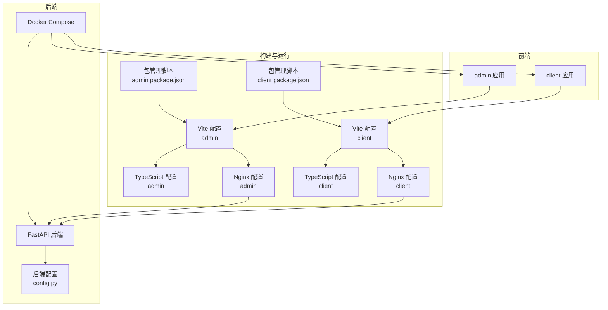
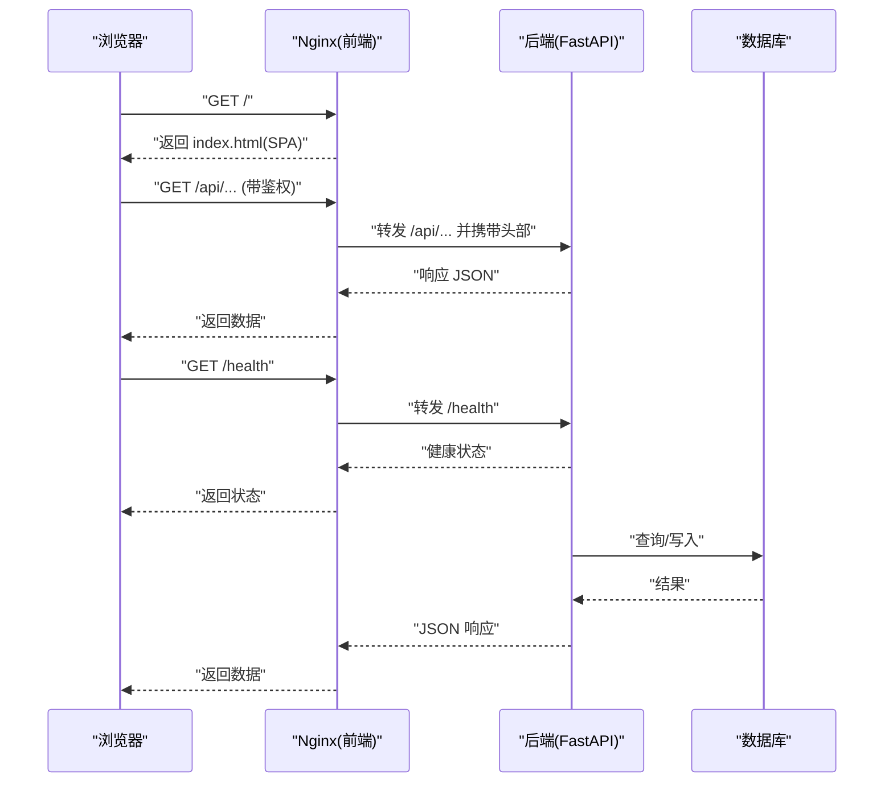
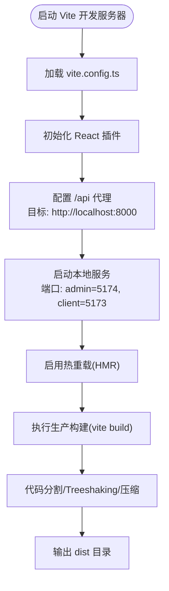
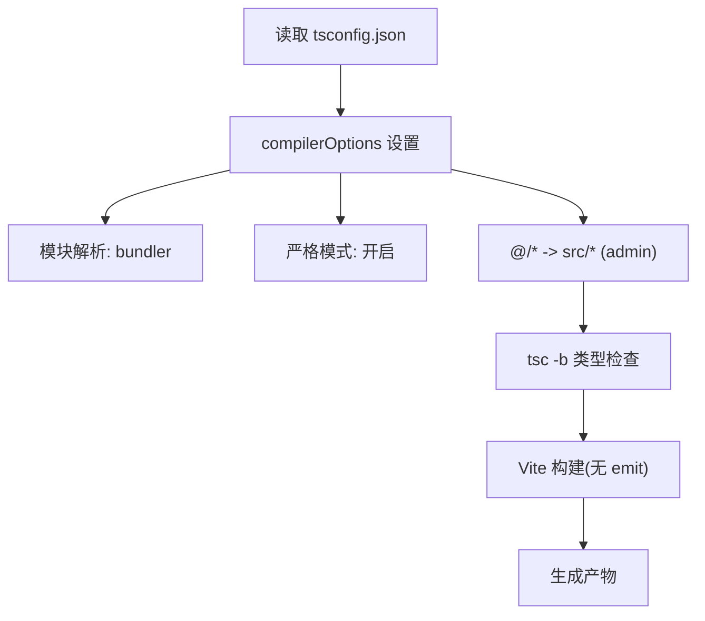
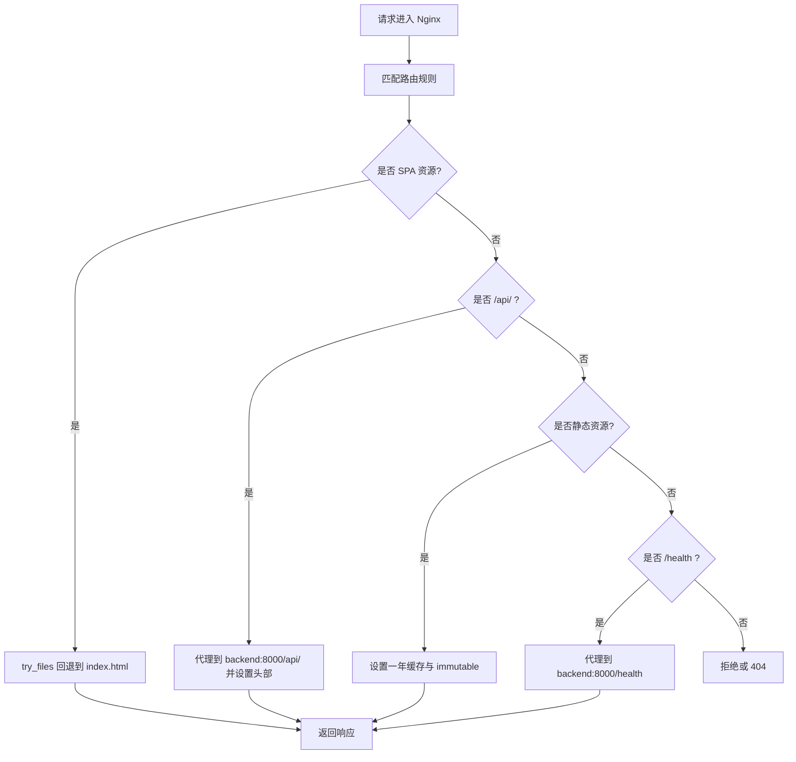
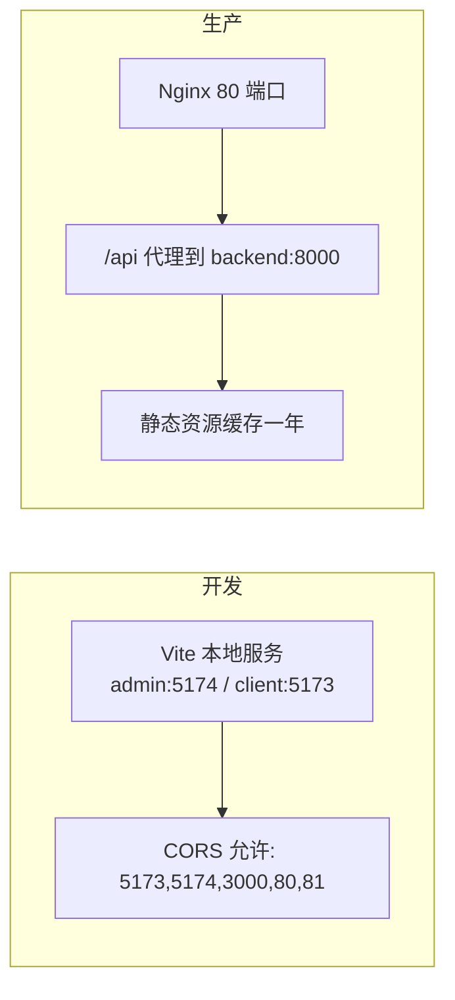
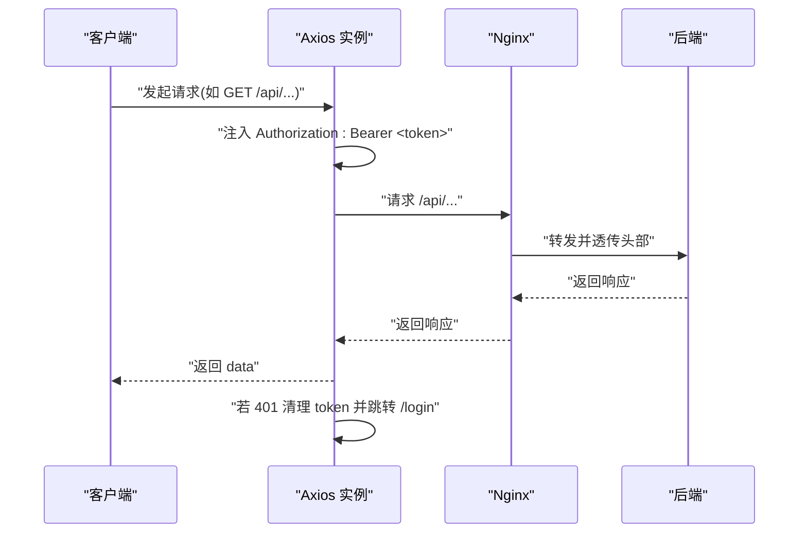
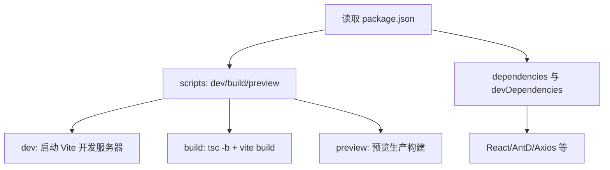
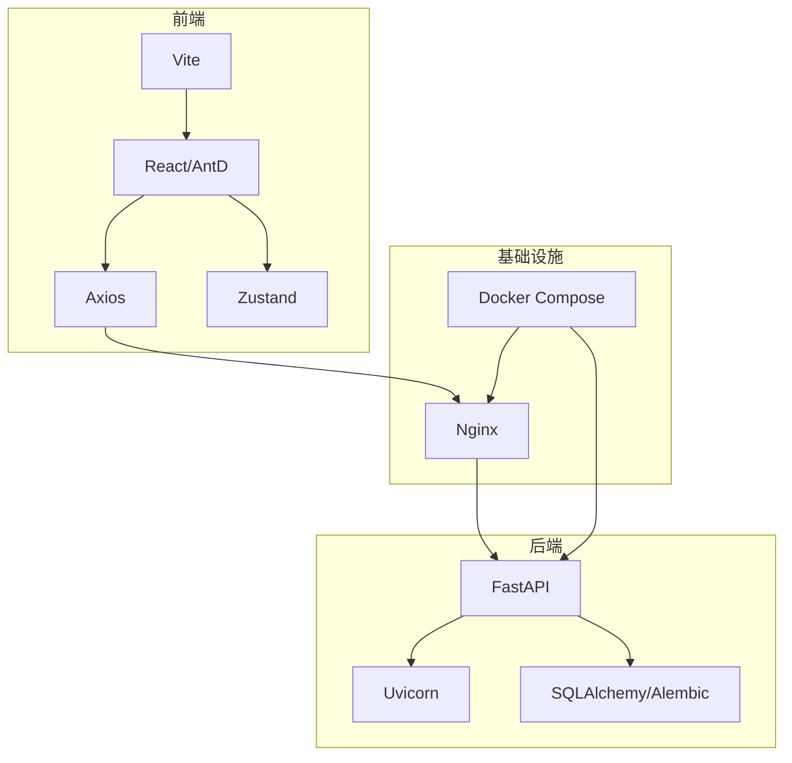

# 构建配置与开发环境

<cite>
**本文引用的文件**
- [frontend/admin/vite.config.ts](file://frontend/admin/vite.config.ts)
- [frontend/client/vite.config.ts](file://frontend/client/vite.config.ts)
- [frontend/admin/tsconfig.json](file://frontend/admin/tsconfig.json)
- [frontend/client/tsconfig.json](file://frontend/client/tsconfig.json)
- [frontend/admin/package.json](file://frontend/admin/package.json)
- [frontend/client/package.json](file://frontend/client/package.json)
- [frontend/admin/nginx.conf](file://frontend/admin/nginx.conf)
- [frontend/client/nginx.conf](file://frontend/client/nginx.conf)
- [frontend/admin/src/api/request.ts](file://frontend/admin/src/api/request.ts)
- [frontend/client/src/api/request.ts](file://frontend/client/src/api/request.ts)
- [docker-compose.yml](file://docker-compose.yml)
- [backend/app/config.py](file://backend/app/config.py)
- [backend/pyproject.toml](file://backend/pyproject.toml)
</cite>

## 目录
1. [简介](#简介)
2. [项目结构](#项目结构)
3. [核心组件](#核心组件)
4. [架构总览](#架构总览)
5. [详细组件分析](#详细组件分析)
6. [依赖分析](#依赖分析)
7. [性能考虑](#性能考虑)
8. [故障排查指南](#故障排查指南)
9. [结论](#结论)
10. [附录](#附录)

## 简介
本文件面向ToolHub前端应用的构建配置与开发环境，系统性梳理Vite构建工具配置（开发服务器、代理、热重载）、TypeScript编译与路径映射、Nginx反向代理与缓存策略，并对比开发与生产差异、环境变量管理、API地址切换、调试工具启用、包管理与脚本命令、构建优化策略（代码分割、Tree Shaking、压缩）以及开发工作流与性能监控建议。

## 项目结构
前端采用双入口架构：admin（管理端）与 client（用户端），两者共享相似的构建与运行时配置，分别通过独立的Vite配置、TypeScript配置、Nginx配置与Docker镜像进行部署。

图表来源
- [frontend/admin/vite.config.ts:1-15](file://frontend/admin/vite.config.ts#L1-L15)
- [frontend/client/vite.config.ts:1-15](file://frontend/client/vite.config.ts#L1-L15)
- [frontend/admin/tsconfig.json:1-25](file://frontend/admin/tsconfig.json#L1-L25)
- [frontend/client/tsconfig.json:1-20](file://frontend/client/tsconfig.json#L1-L20)
- [frontend/admin/nginx.conf:1-38](file://frontend/admin/nginx.conf#L1-L38)
- [frontend/client/nginx.conf:1-38](file://frontend/client/nginx.conf#L1-L38)
- [frontend/admin/package.json:1-29](file://frontend/admin/package.json#L1-L29)
- [frontend/client/package.json:1-29](file://frontend/client/package.json#L1-L29)
- [docker-compose.yml:1-84](file://docker-compose.yml#L1-L84)
- [backend/app/config.py:1-42](file://backend/app/config.py#L1-L42)

章节来源
- [frontend/admin/vite.config.ts:1-15](file://frontend/admin/vite.config.ts#L1-L15)
- [frontend/client/vite.config.ts:1-15](file://frontend/client/vite.config.ts#L1-L15)
- [frontend/admin/tsconfig.json:1-25](file://frontend/admin/tsconfig.json#L1-L25)
- [frontend/client/tsconfig.json:1-20](file://frontend/client/tsconfig.json#L1-L20)
- [frontend/admin/nginx.conf:1-38](file://frontend/admin/nginx.conf#L1-L38)
- [frontend/client/nginx.conf:1-38](file://frontend/client/nginx.conf#L1-L38)
- [frontend/admin/package.json:1-29](file://frontend/admin/package.json#L1-L29)
- [frontend/client/package.json:1-29](file://frontend/client/package.json#L1-L29)
- [docker-compose.yml:1-84](file://docker-compose.yml#L1-L84)
- [backend/app/config.py:1-42](file://backend/app/config.py#L1-L42)

## 核心组件
- Vite 开发服务器与代理
  - admin 与 client 均使用 Vite 插件化配置，统一开启 React 插件与本地开发代理，将 /api 前缀转发至后端服务。
- TypeScript 编译与路径映射
  - 使用 ESNext 模块与 bundler 解析器，严格模式，支持 TS 扩展导入与隔离模块，启用 JSX 转换；admin 额外配置了基于 baseUrl 的路径别名。
- Nginx 反向代理与缓存
  - 统一开启 gzip、SPA 回退到 index.html、/api/ 代理至后端、/health 健康检查代理、静态资源一年缓存。
- 包管理与脚本
  - dev/build/preview 三类脚本，依赖 React、Ant Design、Axios、Zustand 等生态库。
- 后端集成
  - Docker Compose 将前端容器暴露在 80 端口，后端在 8000 端口，Nginx 作为统一入口，CORS 允许开发端口。

章节来源
- [frontend/admin/vite.config.ts:1-15](file://frontend/admin/vite.config.ts#L1-L15)
- [frontend/client/vite.config.ts:1-15](file://frontend/client/vite.config.ts#L1-L15)
- [frontend/admin/tsconfig.json:1-25](file://frontend/admin/tsconfig.json#L1-L25)
- [frontend/client/tsconfig.json:1-20](file://frontend/client/tsconfig.json#L1-L20)
- [frontend/admin/nginx.conf:1-38](file://frontend/admin/nginx.conf#L1-L38)
- [frontend/client/nginx.conf:1-38](file://frontend/client/nginx.conf#L1-L38)
- [frontend/admin/package.json:1-29](file://frontend/admin/package.json#L1-L29)
- [frontend/client/package.json:1-29](file://frontend/client/package.json#L1-L29)
- [docker-compose.yml:1-84](file://docker-compose.yml#L1-L84)
- [backend/app/config.py:1-42](file://backend/app/config.py#L1-L42)

## 架构总览
下图展示从浏览器到后端的整体请求链路，包括开发与生产两种场景下的代理与缓存行为。

图表来源
- [frontend/admin/nginx.conf:1-38](file://frontend/admin/nginx.conf#L1-L38)
- [frontend/client/nginx.conf:1-38](file://frontend/client/nginx.conf#L1-L38)
- [backend/app/config.py:31-36](file://backend/app/config.py#L31-L36)

章节来源
- [frontend/admin/nginx.conf:1-38](file://frontend/admin/nginx.conf#L1-L38)
- [frontend/client/nginx.conf:1-38](file://frontend/client/nginx.conf#L1-L38)
- [backend/app/config.py:31-36](file://backend/app/config.py#L31-L36)

## 详细组件分析

### Vite 构建与开发服务器配置
- 插件与模式
  - React 插件用于 JSX 转换与开发体验增强。
- 开发服务器
  - 本地代理将 /api 前缀转发至后端地址，changeOrigin 保证主机头正确。
- 热重载机制
  - Vite 默认内置 HMR，无需额外配置；生产构建由 Vite 进行打包与优化。
- 构建优化
  - 生产构建默认启用代码分割、Tree Shaking 与压缩；可通过插件扩展进一步优化。

图表来源
- [frontend/admin/vite.config.ts:1-15](file://frontend/admin/vite.config.ts#L1-L15)
- [frontend/client/vite.config.ts:1-15](file://frontend/client/vite.config.ts#L1-L15)
- [frontend/admin/package.json:6-9](file://frontend/admin/package.json#L6-L9)
- [frontend/client/package.json:6-9](file://frontend/client/package.json#L6-L9)

章节来源
- [frontend/admin/vite.config.ts:1-15](file://frontend/admin/vite.config.ts#L1-L15)
- [frontend/client/vite.config.ts:1-15](file://frontend/client/vite.config.ts#L1-L15)
- [frontend/admin/package.json:6-9](file://frontend/admin/package.json#L6-L9)
- [frontend/client/package.json:6-9](file://frontend/client/package.json#L6-L9)

### TypeScript 配置与模块解析
- 编译选项
  - 目标语言与库：ES2020 + DOM；模块系统：ESNext；严格模式开启；禁用 emit（仅编译不输出 JS）。
  - 模块解析：bundler；允许 TS 扩展导入；隔离模块；强制模块检测。
- 路径映射
  - admin 配置了 baseUrl 与 @/* 到 src/* 的路径别名，便于相对路径引用。
- 类型检查
  - 通过 tsc -b 触发类型检查；结合 Vite 构建流程，确保类型安全。

图表来源
- [frontend/admin/tsconfig.json:1-25](file://frontend/admin/tsconfig.json#L1-L25)
- [frontend/client/tsconfig.json:1-20](file://frontend/client/tsconfig.json#L1-L20)
- [frontend/admin/package.json](file://frontend/admin/package.json#L8)
- [frontend/client/package.json](file://frontend/client/package.json#L8)

章节来源
- [frontend/admin/tsconfig.json:1-25](file://frontend/admin/tsconfig.json#L1-L25)
- [frontend/client/tsconfig.json:1-20](file://frontend/client/tsconfig.json#L1-L20)
- [frontend/admin/package.json](file://frontend/admin/package.json#L8)
- [frontend/client/package.json](file://frontend/client/package.json#L8)

### Nginx 反向代理与缓存策略
- 静态资源服务
  - root 指向 HTML 根目录，index 指定入口页。
- SPA 路由回退
  - try_files 将未命中路径回退到 index.html，保障前端路由正常工作。
- API 代理
  - /api/ 前缀转发至后端 API 地址，并透传 Host、X-Real-IP、X-Forwarded-*、X-Forwarded-Proto 等头部。
- 健康检查
  - /health 直接转发至后端 /health。
- 缓存策略
  - 对 JS/CSS/字体/图片等静态资源设置一年缓存与 immutable 标记，提升二次加载性能。
- Gzip 压缩
  - 对常见文本与 JSON 类型启用压缩，阈值 256 字节。

图表来源
- [frontend/admin/nginx.conf:1-38](file://frontend/admin/nginx.conf#L1-L38)
- [frontend/client/nginx.conf:1-38](file://frontend/client/nginx.conf#L1-L38)

章节来源
- [frontend/admin/nginx.conf:1-38](file://frontend/admin/nginx.conf#L1-L38)
- [frontend/client/nginx.conf:1-38](file://frontend/client/nginx.conf#L1-L38)

### 开发环境与生产环境差异
- 开发环境
  - Vite 本地开发服务器，端口分别为 admin=5174、client=5173；代理 /api 至后端 8000 端口。
  - 后端 CORS 允许开发端口列表包含 localhost:5173、5174、3000、80、81。
- 生产环境
  - 前端通过 Nginx 暴露在 80 端口，静态资源缓存一年；API 代理至后端 8000 端口。
  - 环境变量通过 Docker Compose 注入，如 JWT、数据库连接、CORS 允许列表等。

图表来源
- [docker-compose.yml:31-41](file://docker-compose.yml#L31-L41)
- [frontend/admin/vite.config.ts:6-13](file://frontend/admin/vite.config.ts#L6-L13)
- [frontend/client/vite.config.ts:6-13](file://frontend/client/vite.config.ts#L6-L13)
- [frontend/admin/nginx.conf:18-25](file://frontend/admin/nginx.conf#L18-L25)
- [frontend/client/nginx.conf:18-25](file://frontend/client/nginx.conf#L18-L25)

章节来源
- [docker-compose.yml:31-41](file://docker-compose.yml#L31-L41)
- [frontend/admin/vite.config.ts:6-13](file://frontend/admin/vite.config.ts#L6-L13)
- [frontend/client/vite.config.ts:6-13](file://frontend/client/vite.config.ts#L6-L13)
- [frontend/admin/nginx.conf:18-25](file://frontend/admin/nginx.conf#L18-L25)
- [frontend/client/nginx.conf:18-25](file://frontend/client/nginx.conf#L18-L25)

### API 地址与认证拦截
- 前端 Axios 实例以 /api 作为基础路径，统一走 Nginx 代理。
- 请求拦截器自动附加本地存储中的 Bearer Token。
- 响应拦截器处理 401 未授权，清理本地令牌并跳转登录页。

图表来源
- [frontend/admin/src/api/request.ts:1-28](file://frontend/admin/src/api/request.ts#L1-L28)
- [frontend/client/src/api/request.ts:1-28](file://frontend/client/src/api/request.ts#L1-L28)
- [frontend/admin/nginx.conf:18-25](file://frontend/admin/nginx.conf#L18-L25)
- [frontend/client/nginx.conf:18-25](file://frontend/client/nginx.conf#L18-L25)

章节来源
- [frontend/admin/src/api/request.ts:1-28](file://frontend/admin/src/api/request.ts#L1-L28)
- [frontend/client/src/api/request.ts:1-28](file://frontend/client/src/api/request.ts#L1-L28)
- [frontend/admin/nginx.conf:18-25](file://frontend/admin/nginx.conf#L18-L25)
- [frontend/client/nginx.conf:18-25](file://frontend/client/nginx.conf#L18-L25)

### 包管理与脚本命令
- admin 与 client 均定义了 dev/build/preview 三个脚本，依赖 Vite 与 TypeScript。
- 依赖生态包括 React、React Router、Ant Design、Axios、Zustand、Day.js 等。

图表来源
- [frontend/admin/package.json:6-27](file://frontend/admin/package.json#L6-L27)
- [frontend/client/package.json:6-27](file://frontend/client/package.json#L6-L27)

章节来源
- [frontend/admin/package.json:1-29](file://frontend/admin/package.json#L1-L29)
- [frontend/client/package.json:1-29](file://frontend/client/package.json#L1-L29)

## 依赖分析
- 前端耦合
  - admin 与 client 在 Vite、TypeScript、Nginx 配置上高度一致，便于维护与复用。
- 外部依赖
  - Vite、React、Ant Design、Axios、Zustand、Day.js。
- 后端集成
  - Docker Compose 提供统一网络与端口映射，Nginx 作为反向代理统一入口。

图表来源
- [frontend/admin/package.json:11-27](file://frontend/admin/package.json#L11-L27)
- [frontend/client/package.json:11-27](file://frontend/client/package.json#L11-L27)
- [backend/pyproject.toml:1-31](file://backend/pyproject.toml#L1-L31)
- [docker-compose.yml:1-84](file://docker-compose.yml#L1-L84)

章节来源
- [frontend/admin/package.json:1-29](file://frontend/admin/package.json#L1-L29)
- [frontend/client/package.json:1-29](file://frontend/client/package.json#L1-L29)
- [backend/pyproject.toml:1-31](file://backend/pyproject.toml#L1-L31)
- [docker-compose.yml:1-84](file://docker-compose.yml#L1-L84)

## 性能考虑
- 代码分割与 Tree Shaking
  - Vite 默认启用，按需加载路由与页面组件，减少首屏体积。
- 压缩与缓存
  - 生产构建自动压缩 JS/CSS；Nginx 对静态资源设置一年缓存与 immutable。
- Gzip 压缩
  - 对文本与 JSON 类型启用压缩，降低传输体积。
- 模块解析优化
  - 使用 bundler 解析器与 ESNext 模块，配合严格模式与隔离模块，提升构建效率与类型安全性。

## 故障排查指南
- 代理 404 或跨域问题
  - 确认 /api 代理已正确转发至后端；检查后端 CORS 允许列表是否包含当前前端端口。
- 401 未授权循环跳转
  - 检查本地存储中 token 是否存在；确认响应拦截器逻辑是否触发清理并跳转登录页。
- 静态资源无法加载或缓存异常
  - 检查 Nginx 静态资源缓存配置与路径；确认构建产物已更新。
- 开发端口冲突
  - 修改 vite.config.ts 中的 server.port 或 package.json 中的 dev 脚本端口。

章节来源
- [frontend/admin/vite.config.ts:6-13](file://frontend/admin/vite.config.ts#L6-L13)
- [frontend/client/vite.config.ts:6-13](file://frontend/client/vite.config.ts#L6-L13)
- [frontend/admin/src/api/request.ts:16-25](file://frontend/admin/src/api/request.ts#L16-L25)
- [frontend/client/src/api/request.ts:16-25](file://frontend/client/src/api/request.ts#L16-L25)
- [frontend/admin/nginx.conf:32-36](file://frontend/admin/nginx.conf#L32-L36)
- [frontend/client/nginx.conf:32-36](file://frontend/client/nginx.conf#L32-L36)
- [docker-compose.yml:31-41](file://docker-compose.yml#L31-L41)

## 结论
本项目采用 Vite + React + Ant Design 的现代化前端技术栈，结合 Nginx 反向代理与 Docker Compose 实现开发与生产的高效协同。通过统一的代理、严格的 TypeScript 配置与合理的缓存策略，既保证了开发体验，也兼顾了生产性能与可维护性。后续可在构建阶段引入更细粒度的分包策略与可视化分析工具，持续优化首屏加载与交互性能。

## 附录
- 环境变量与后端配置
  - 后端通过 Pydantic Settings 加载 .env，CORS 允许列表集中管理；Docker Compose 注入数据库、JWT、飞书 OAuth 等参数。
- 版本与依赖
  - 后端使用 FastAPI、SQLAlchemy、Alembic 等；前端使用 Vite 6、TypeScript 5、React 19、Ant Design 5。

章节来源
- [backend/app/config.py:1-42](file://backend/app/config.py#L1-L42)
- [backend/pyproject.toml:1-31](file://backend/pyproject.toml#L1-L31)
- [docker-compose.yml:31-41](file://docker-compose.yml#L31-L41)