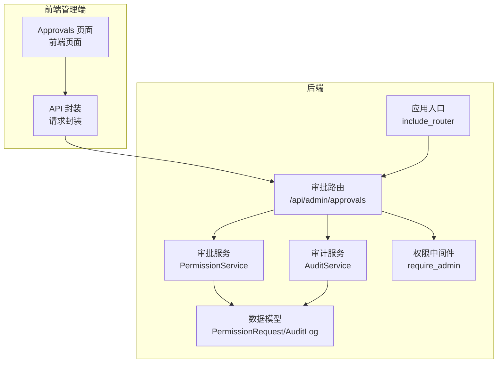
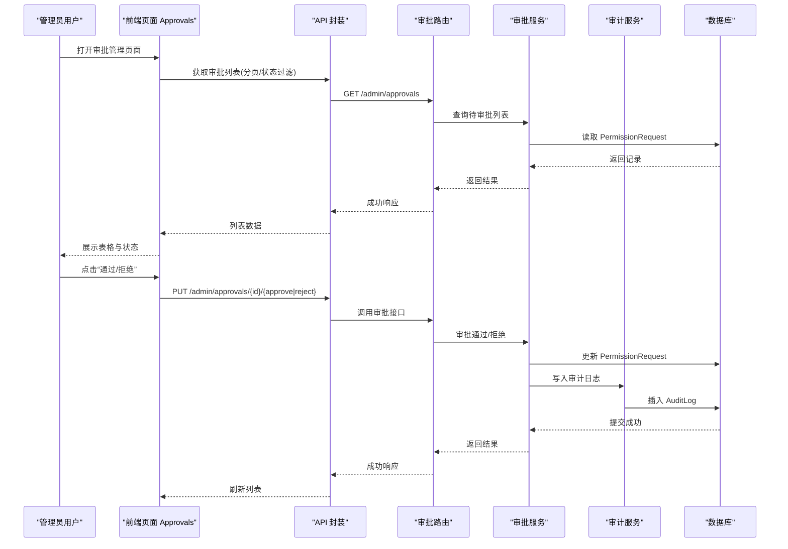
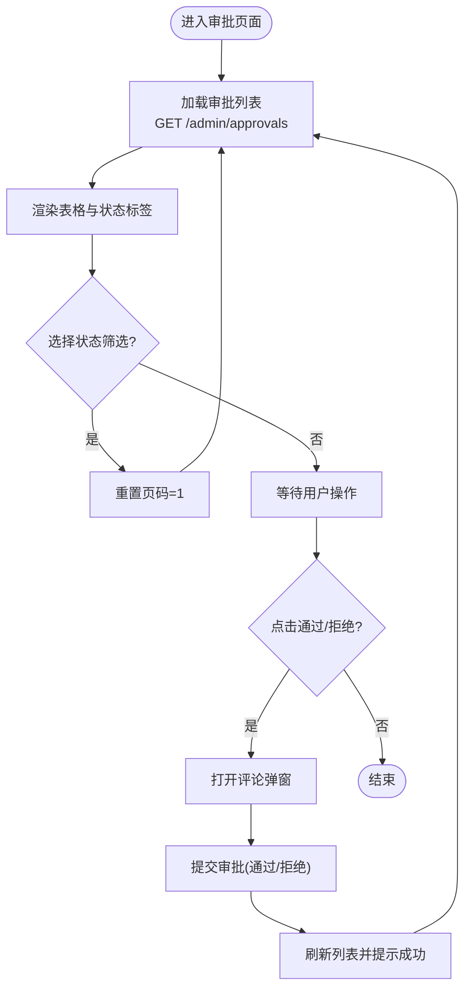
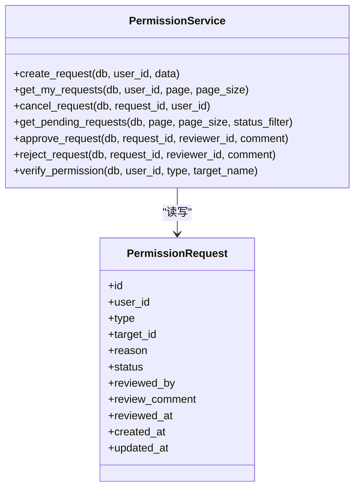
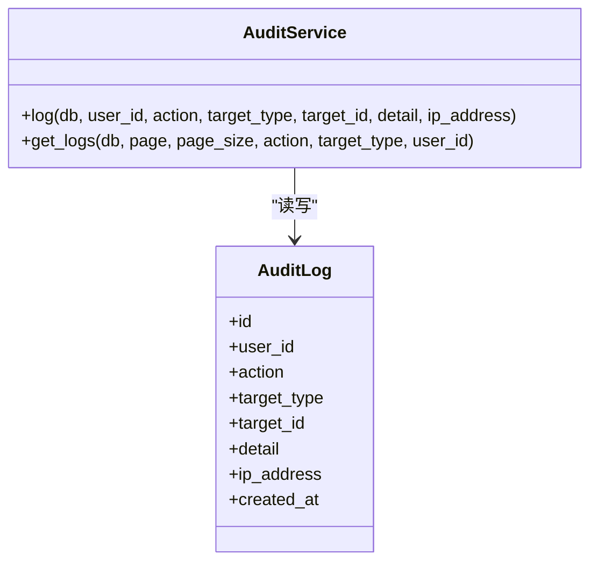
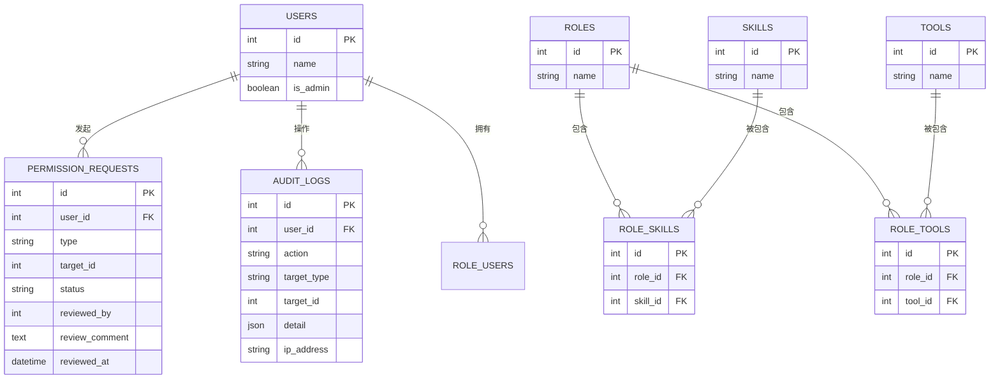
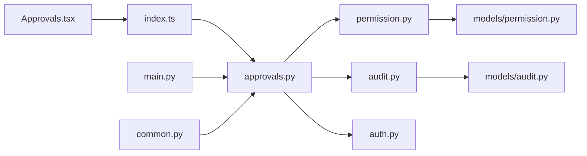

# 审批系统

<cite>
**本文引用的文件**
- [Approvals.tsx](file://frontend/admin/src/pages/Approvals.tsx)
- [index.ts](file://frontend/admin/src/api/index.ts)
- [approvals.py](file://backend/app/api/admin/approvals.py)
- [permission.py](file://backend/app/services/permission.py)
- [permission.py](file://backend/app/models/permission.py)
- [audit.py](file://backend/app/services/audit.py)
- [audit.py](file://backend/app/models/audit.py)
- [audit.py](file://backend/app/api/admin/audit.py)
- [auth.py](file://backend/app/middleware/auth.py)
- [main.py](file://backend/app/main.py)
- [common.py](file://backend/app/schemas/common.py)
- [permission.py](file://backend/app/schemas/permission.py)
- [user.py](file://backend/app/models/user.py)
</cite>

## 目录
1. [简介](#简介)
2. [项目结构](#项目结构)
3. [核心组件](#核心组件)
4. [架构总览](#架构总览)
5. [详细组件分析](#详细组件分析)
6. [依赖分析](#依赖分析)
7. [性能考虑](#性能考虑)
8. [故障排查指南](#故障排查指南)
9. [结论](#结论)
10. [附录](#附录)

## 简介
本文件为 ToolHub 管理端“审批管理”页面的系统化技术文档，覆盖前端页面实现、后端接口与业务逻辑、数据模型、审计与权限控制、以及扩展性设计建议。重点说明：
- 待审批列表展示、审批详情查看、审批操作处理
- 审批流程前端实现：状态跟踪、历史记录、审批意见管理
- 批量审批、快速审批、条件审批的实现机制
- 审批通知系统、消息推送、状态提醒的集成思路
- 审批权限控制、审批时效管理、审批统计分析
- 审批流程自定义、审批规则配置、审批模板管理的实现方案
- 用户体验设计、操作效率优化、审批透明度提升的设计原则

## 项目结构
审批系统由前端管理端与后端 API 两部分组成，采用 React + Ant Design 前端框架与 FastAPI 后端框架，数据库使用 SQLAlchemy ORM。

图表来源
- [Approvals.tsx:1-77](file://frontend/admin/src/pages/Approvals.tsx#L1-L77)
- [index.ts:44-49](file://frontend/admin/src/api/index.ts#L44-L49)
- [approvals.py:1-88](file://backend/app/api/admin/approvals.py#L1-L88)
- [permission.py:9-182](file://backend/app/services/permission.py#L9-L182)
- [audit.py:6-54](file://backend/app/services/audit.py#L6-L54)
- [permission.py:7-28](file://backend/app/models/permission.py#L7-L28)
- [audit.py:6-17](file://backend/app/models/audit.py#L6-L17)
- [auth.py:36-44](file://backend/app/middleware/auth.py#L36-L44)
- [main.py:33-40](file://backend/app/main.py#L33-L40)

章节来源
- [Approvals.tsx:1-77](file://frontend/admin/src/pages/Approvals.tsx#L1-L77)
- [index.ts:44-49](file://frontend/admin/src/api/index.ts#L44-L49)
- [approvals.py:1-88](file://backend/app/api/admin/approvals.py#L1-L88)
- [main.py:33-40](file://backend/app/main.py#L33-L40)

## 核心组件
- 前端审批页面：负责渲染待审批列表、状态标签、操作按钮、筛选器与评论输入弹窗。
- API 封装：统一管理审批相关的 GET/PUT 请求，便于复用与测试。
- 审批路由：提供审批列表查询、审批通过/拒绝接口，并进行管理员鉴权。
- 审批服务：封装创建、取消、查询待审批、审批通过/拒绝等业务逻辑；在通过时自动为用户授予相应权限。
- 审计服务：记录审批动作（approve/reject）及详情，支持分页查询。
- 数据模型：PermissionRequest 表示权限申请记录；AuditLog 记录审计日志。
- 权限中间件：确保仅管理员可访问审批相关接口。
- 应用入口：注册审批与审计路由，暴露健康检查。

章节来源
- [Approvals.tsx:1-77](file://frontend/admin/src/pages/Approvals.tsx#L1-L77)
- [index.ts:44-49](file://frontend/admin/src/api/index.ts#L44-L49)
- [approvals.py:14-88](file://backend/app/api/admin/approvals.py#L14-L88)
- [permission.py:9-182](file://backend/app/services/permission.py#L9-L182)
- [audit.py:6-54](file://backend/app/services/audit.py#L6-L54)
- [permission.py:7-28](file://backend/app/models/permission.py#L7-L28)
- [audit.py:6-17](file://backend/app/models/audit.py#L6-L17)
- [auth.py:36-44](file://backend/app/middleware/auth.py#L36-L44)
- [main.py:33-40](file://backend/app/main.py#L33-L40)

## 架构总览
审批系统遵循前后端分离架构，前端通过 API 封装调用后端路由，后端路由经权限中间件校验后交由服务层处理，服务层读写数据库模型并触发审计日志。

图表来源
- [Approvals.tsx:14-35](file://frontend/admin/src/pages/Approvals.tsx#L14-L35)
- [index.ts:44-49](file://frontend/admin/src/api/index.ts#L44-L49)
- [approvals.py:14-88](file://backend/app/api/admin/approvals.py#L14-L88)
- [permission.py:85-144](file://backend/app/services/permission.py#L85-L144)
- [audit.py:9-30](file://backend/app/services/audit.py#L9-L30)

## 详细组件分析

### 前端审批页面（Approvals.tsx）
- 列表加载：通过 API 封装的列表接口按页码与状态过滤拉取数据，设置总数与当前页。
- 状态展示：根据状态映射颜色与标签，区分“待审批/已通过/已拒绝/已撤销”。
- 审批操作：点击“通过/拒绝”打开评论弹窗，提交后刷新列表并提示成功。
- 筛选器：支持按状态筛选，重置页码以保证从第一页开始。
- 表格列：包含申请人、类型、目标、理由、状态、审批人、审批备注等字段。

图表来源
- [Approvals.tsx:14-35](file://frontend/admin/src/pages/Approvals.tsx#L14-L35)
- [index.ts:44-49](file://frontend/admin/src/api/index.ts#L44-L49)

章节来源
- [Approvals.tsx:1-77](file://frontend/admin/src/pages/Approvals.tsx#L1-L77)
- [index.ts:44-49](file://frontend/admin/src/api/index.ts#L44-L49)

### API 封装（index.ts）
- 列表：GET /admin/approvals
- 审批通过：PUT /admin/approvals/{id}/approve
- 审批拒绝：PUT /admin/approvals/{id}/reject
- 审计日志：GET /admin/audit-logs

章节来源
- [index.ts:44-59](file://frontend/admin/src/api/index.ts#L44-L59)

### 审批路由与控制器（approvals.py）
- GET /admin/approvals：分页查询审批列表，支持 status 过滤；返回用户姓名、目标名称、审批人、评论、时间戳等。
- PUT /admin/approvals/{id}/approve：审批通过，记录审计日志。
- PUT /admin/approvals/{id}/reject：审批拒绝，记录审计日志。
- 鉴权：依赖管理员中间件，非管理员不可访问。

章节来源
- [approvals.py:14-88](file://backend/app/api/admin/approvals.py#L14-L88)
- [auth.py:36-44](file://backend/app/middleware/auth.py#L36-L44)

### 审批服务（permission.py）
- 创建申请：校验重复与目标存在性，状态初始化为“待审批”。
- 查询我的申请：按用户 ID 分页查询。
- 取消申请：仅“待审批”可撤销。
- 查询待审批：支持按状态过滤，分页排序。
- 审批通过：更新状态为“已通过”，写入审批人、评论、时间；为用户授予对应权限（技能/工具），若用户无角色则创建默认角色并绑定。
- 审批拒绝：更新状态为“已拒绝”，写入审批人、评论、时间。
- 权限验证：按用户角色集合判断是否拥有某技能/工具权限。

图表来源
- [permission.py:9-182](file://backend/app/services/permission.py#L9-L182)
- [permission.py:7-28](file://backend/app/models/permission.py#L7-L28)

章节来源
- [permission.py:9-182](file://backend/app/services/permission.py#L9-L182)
- [permission.py:7-28](file://backend/app/models/permission.py#L7-L28)

### 审计服务与模型（audit.py）
- 写入审计日志：记录操作人、动作类型、目标类型、目标 ID、详情、IP 等。
- 查询审计日志：支持按动作、目标类型、用户 ID 过滤，分页排序。
- 审计模型：包含主键、用户 ID、动作、目标类型、目标 ID、详情、IP、时间戳等字段。

图表来源
- [audit.py:6-54](file://backend/app/services/audit.py#L6-L54)
- [audit.py:6-17](file://backend/app/models/audit.py#L6-L17)

章节来源
- [audit.py:6-54](file://backend/app/services/audit.py#L6-L54)
- [audit.py:6-17](file://backend/app/models/audit.py#L6-L17)
- [audit.py:12-36](file://backend/app/api/admin/audit.py#L12-L36)

### 权限中间件与应用入口
- require_admin：校验管理员身份，非管理员禁止访问。
- include_router：注册审批与审计路由，统一前缀与标签。

章节来源
- [auth.py:36-44](file://backend/app/middleware/auth.py#L36-L44)
- [main.py:33-40](file://backend/app/main.py#L33-L40)

### 数据模型与权限关系
- 用户/角色/技能/工具：用户通过角色间接获得技能/工具权限；默认角色用于首次授权。
- 权限申请：记录申请类型（技能/工具）、目标 ID、状态、审批信息等。

图表来源
- [user.py:23-116](file://backend/app/models/user.py#L23-L116)
- [permission.py:7-28](file://backend/app/models/permission.py#L7-L28)
- [audit.py:6-17](file://backend/app/models/audit.py#L6-L17)

章节来源
- [user.py:23-116](file://backend/app/models/user.py#L23-L116)
- [permission.py:7-28](file://backend/app/models/permission.py#L7-L28)
- [audit.py:6-17](file://backend/app/models/audit.py#L6-L17)

## 依赖分析
- 前端对后端 API 的依赖：Approvals 页面依赖 API 封装；API 封装依赖后端路由。
- 后端路由对服务层与模型的依赖：审批路由依赖审批服务与审计服务；服务层依赖模型与数据库。
- 权限控制：审批路由依赖管理员中间件，确保只有管理员可操作。
- 统一响应：后端使用通用响应封装，前端统一处理。

图表来源
- [Approvals.tsx:1-77](file://frontend/admin/src/pages/Approvals.tsx#L1-L77)
- [index.ts:44-49](file://frontend/admin/src/api/index.ts#L44-L49)
- [approvals.py:1-88](file://backend/app/api/admin/approvals.py#L1-L88)
- [permission.py:9-182](file://backend/app/services/permission.py#L9-L182)
- [audit.py:6-54](file://backend/app/services/audit.py#L6-L54)
- [permission.py:7-28](file://backend/app/models/permission.py#L7-L28)
- [audit.py:6-17](file://backend/app/models/audit.py#L6-L17)
- [auth.py:36-44](file://backend/app/middleware/auth.py#L36-L44)
- [main.py:33-40](file://backend/app/main.py#L33-L40)
- [common.py:23-28](file://backend/app/schemas/common.py#L23-L28)

章节来源
- [Approvals.tsx:1-77](file://frontend/admin/src/pages/Approvals.tsx#L1-L77)
- [index.ts:44-49](file://frontend/admin/src/api/index.ts#L44-L49)
- [approvals.py:1-88](file://backend/app/api/admin/approvals.py#L1-L88)
- [permission.py:9-182](file://backend/app/services/permission.py#L9-L182)
- [audit.py:6-54](file://backend/app/services/audit.py#L6-L54)
- [permission.py:7-28](file://backend/app/models/permission.py#L7-L28)
- [audit.py:6-17](file://backend/app/models/audit.py#L6-L17)
- [auth.py:36-44](file://backend/app/middleware/auth.py#L36-L44)
- [main.py:33-40](file://backend/app/main.py#L33-L40)
- [common.py:23-28](file://backend/app/schemas/common.py#L23-L28)

## 性能考虑
- 前端分页与状态过滤：减少一次性传输数据量，降低渲染压力。
- 审批通过自动授权：避免额外请求，提升审批效率。
- 审计日志异步化：可在高并发场景下将审计写入放入队列，降低主流程阻塞。
- 数据库索引：对 PermissionRequest 的 status、user_id、created_at 建立索引，提升查询性能。
- 缓存策略：对常用筛选条件与热门目标的名称可做缓存，减少重复查询。

## 故障排查指南
- 审批接口报错：检查管理员身份是否有效，确认 require_admin 中间件是否正确拦截。
- 审批状态异常：核对服务层审批逻辑，确保仅“待审批”可变更；检查数据库事务是否提交。
- 审计日志缺失：确认审计服务是否被调用，检查 detail 字段是否为空。
- 权限未生效：确认审批通过后是否为用户授予了对应角色/技能/工具权限。
- 前端列表不刷新：确认提交后是否重新调用列表接口并更新状态。

章节来源
- [auth.py:36-44](file://backend/app/middleware/auth.py#L36-L44)
- [permission.py:85-144](file://backend/app/services/permission.py#L85-L144)
- [audit.py:9-30](file://backend/app/services/audit.py#L9-L30)
- [Approvals.tsx:14-35](file://frontend/admin/src/pages/Approvals.tsx#L14-L35)

## 结论
审批系统通过清晰的前后端职责划分与完善的权限控制，实现了从“待审批列表—审批操作—审计记录”的完整闭环。当前版本支持基础的审批流程、状态跟踪与审计日志，具备良好的扩展空间，可用于后续引入批量审批、条件审批、审批模板与通知推送等功能。

## 附录

### 批量审批、快速审批、条件审批的实现机制
- 批量审批：前端提供多选框与“批量通过/拒绝”按钮，后端新增批量接口，逐条调用现有审批逻辑并合并审计日志。
- 快速审批：在列表中提供一键“通过”按钮，自动填充默认评论或无需评论；服务层对默认评论进行校验与持久化。
- 条件审批：在审批服务中增加规则引擎，根据申请类型、目标、申请人属性动态决定审批路径（如阈值金额、部门级别）。

### 审批通知系统、消息推送、状态提醒的集成
- 审批通知：在审批通过/拒绝后，调用消息服务（如站内信/邮件/IM）向申请人发送通知，内容包含审批结果与评论。
- 状态提醒：在前端列表中增加“未读提醒”角标，结合 WebSocket 或轮询实现实时状态更新。
- 邮件/IM 集成：通过外部服务（如飞书/企业微信）回调或消息队列异步投递。

### 审批权限控制、审批时效管理、审批统计分析
- 权限控制：require_admin 仅允许管理员访问；未来可扩展“审批人池”与“代理审批”。
- 时效管理：在模型中增加超时字段与定时任务，对超过时限的“待审批”自动关闭或升级提醒。
- 统计分析：基于审计日志与审批记录，统计通过率、平均时长、热词评论等指标，前端可视化展示。

### 审批流程自定义、审批规则配置、审批模板管理
- 流程自定义：引入审批流模型，支持分支、并行、会签等模式；前端可视化拖拽配置。
- 规则配置：基于 YAML/JSON 的规则引擎，支持条件表达式与动作组合。
- 模板管理：预设常见模板（如“技能申请/工具申请”），支持复制、编辑与版本管理。

### 用户体验设计、操作效率优化、审批透明度提升
- 体验设计：提供“快捷操作”“一键通过”“评论模板”“批量处理”等能力。
- 效率优化：列表懒加载、状态缓存、键盘快捷键、全屏筛选。
- 透明度提升：展示审批历史、审批人意见、审批耗时、目标关联关系。