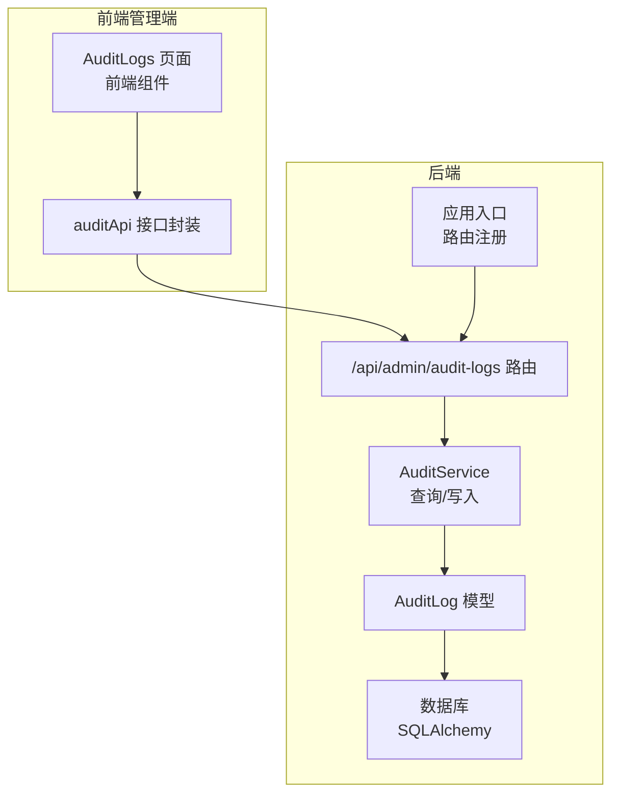
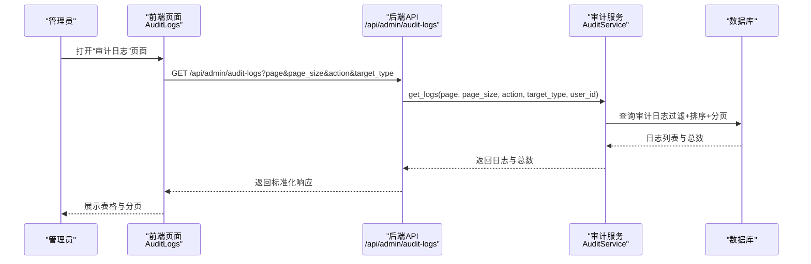
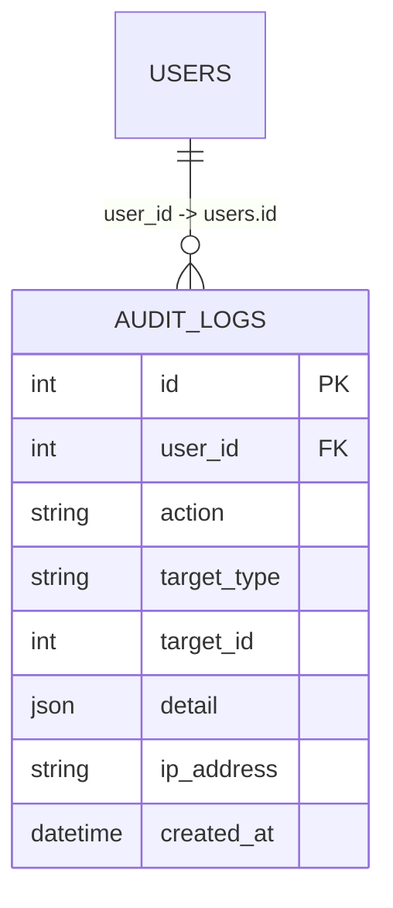
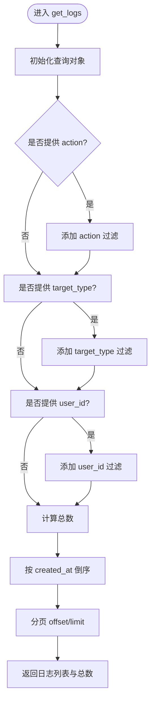
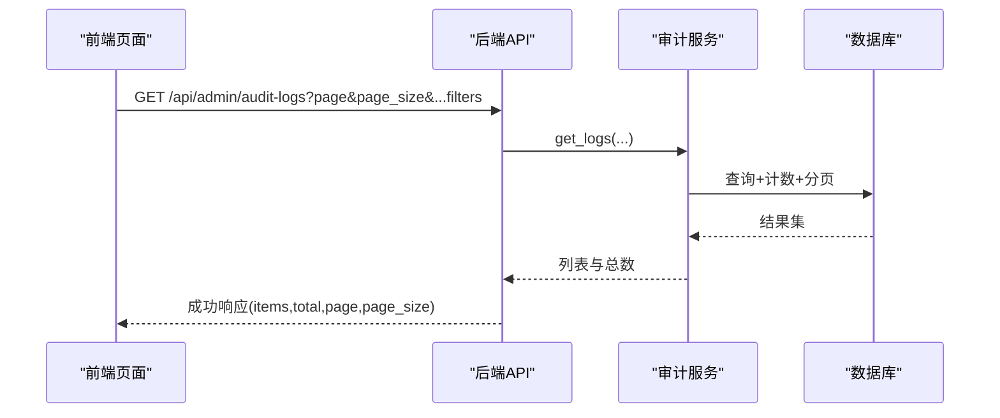
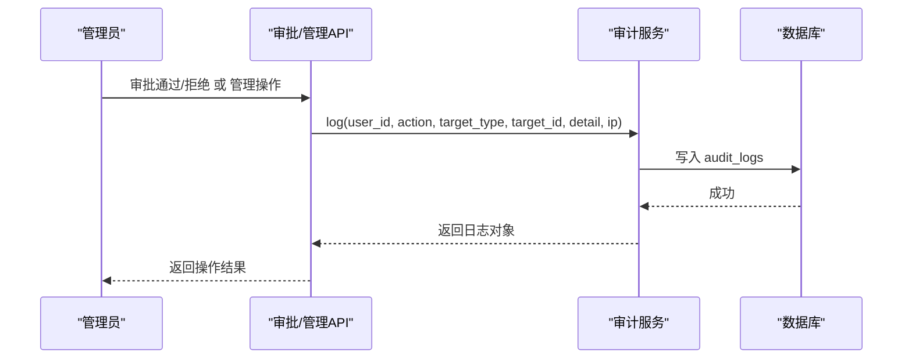
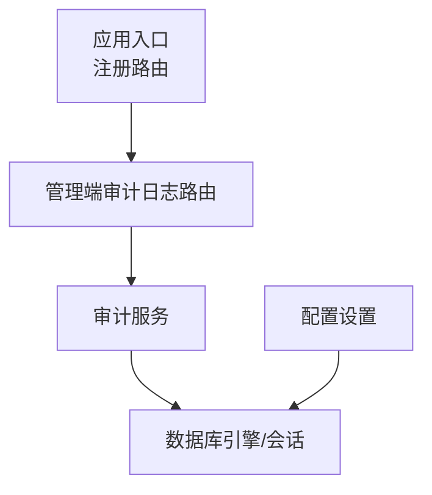

# 审计日志

<cite>
**本文引用的文件**
- [backend/app/models/audit.py](file://backend/app/models/audit.py)
- [backend/app/services/audit.py](file://backend/app/services/audit.py)
- [backend/app/api/admin/audit.py](file://backend/app/api/admin/audit.py)
- [backend/app/main.py](file://backend/app/main.py)
- [backend/alembic/versions/5fb1c261fa23_initial_tables.py](file://backend/alembic/versions/5fb1c261fa23_initial_tables.py)
- [frontend/admin/src/pages/AuditLogs.tsx](file://frontend/admin/src/pages/AuditLogs.tsx)
- [frontend/admin/src/api/index.ts](file://frontend/admin/src/api/index.ts)
- [backend/app/database.py](file://backend/app/database.py)
- [backend/app/config.py](file://backend/app/config.py)
- [backend/app/api/admin/approvals.py](file://backend/app/api/admin/approvals.py)
- [backend/app/api/admin/users.py](file://backend/app/api/admin/users.py)
</cite>

## 目录
1. [简介](#简介)
2. [项目结构](#项目结构)
3. [核心组件](#核心组件)
4. [架构总览](#架构总览)
5. [详细组件分析](#详细组件分析)
6. [依赖分析](#依赖分析)
7. [性能考虑](#性能考虑)
8. [故障排查指南](#故障排查指南)
9. [结论](#结论)
10. [附录](#附录)

## 简介
本文件面向ToolHub管理端的“审计日志”功能，系统化梳理后端模型与服务、前端页面与API对接、以及日志采集与查询的完整实现路径。重点覆盖以下方面：
- 审计日志页面：操作日志列表展示、日志详情查看（当前接口返回列表，未提供单条详情接口）、日志筛选查询（按操作类型、目标类型、用户ID）。
- 审计日志数据结构：操作类型、操作时间、操作用户、影响范围（目标类型/目标ID）、附加详情（JSON）、来源IP等字段。
- 日志查询能力：分页、排序、多维过滤；前端支持操作类型与目标类型的下拉筛选。
- 日志导出、报表与统计：当前代码库未实现导出/报表/统计接口，后续可基于现有列表接口扩展。
- 存储策略、保留期限与归档：当前未见专门的归档/保留策略实现，建议在数据库层或外部存储层补充。
- 分析工具、异常检测与安全监控：当前未见专用分析/检测模块，可在现有日志基础上接入外部分析平台或自建规则引擎。
- 合规性、隐私保护与性能优化：遵循最小采集、访问控制、索引优化与连接池配置等设计原则。

## 项目结构
- 后端采用FastAPI + SQLAlchemy + Alembic，审计日志表由迁移脚本创建。
- 前端管理端页面通过API获取审计日志列表，并提供基础筛选控件。
- 审计日志记录在关键业务操作中被显式写入，如角色/技能/工具/用户/权限请求的增删改与审批。

图表来源
- [backend/app/main.py:39-40](file://backend/app/main.py#L39-L40)
- [backend/app/api/admin/audit.py:12-36](file://backend/app/api/admin/audit.py#L12-L36)
- [backend/app/services/audit.py:32-50](file://backend/app/services/audit.py#L32-L50)
- [backend/app/models/audit.py:6-16](file://backend/app/models/audit.py#L6-L16)

章节来源
- [backend/app/main.py:39-40](file://backend/app/main.py#L39-L40)
- [backend/app/api/admin/audit.py:12-36](file://backend/app/api/admin/audit.py#L12-L36)
- [frontend/admin/src/pages/AuditLogs.tsx:9-52](file://frontend/admin/src/pages/AuditLogs.tsx#L9-L52)
- [frontend/admin/src/api/index.ts:56-59](file://frontend/admin/src/api/index.ts#L56-L59)

## 核心组件
- 审计日志模型（数据库表）：定义了审计日志的字段与约束，包括操作人、操作类型、目标类型/ID、详情JSON、IP与创建时间。
- 审计服务：提供写入与查询能力，支持按操作类型、目标类型、用户ID过滤，并按时间倒序分页。
- 管理端审计日志API：对外暴露列表查询接口，供前端分页展示与筛选。
- 前端审计日志页面：提供操作类型与目标类型筛选、分页表格展示。
- 应用入口与路由：注册管理端审计日志路由，绑定到统一前缀。

章节来源
- [backend/app/models/audit.py:6-16](file://backend/app/models/audit.py#L6-L16)
- [backend/app/services/audit.py:6-50](file://backend/app/services/audit.py#L6-L50)
- [backend/app/api/admin/audit.py:12-36](file://backend/app/api/admin/audit.py#L12-L36)
- [frontend/admin/src/pages/AuditLogs.tsx:9-52](file://frontend/admin/src/pages/AuditLogs.tsx#L9-L52)
- [backend/app/main.py:39-40](file://backend/app/main.py#L39-L40)

## 架构总览
审计日志从“业务操作触发写入”，到“管理端查询展示”的端到端流程如下：

图表来源
- [frontend/admin/src/pages/AuditLogs.tsx:16-22](file://frontend/admin/src/pages/AuditLogs.tsx#L16-L22)
- [frontend/admin/src/api/index.ts:56-59](file://frontend/admin/src/api/index.ts#L56-L59)
- [backend/app/api/admin/audit.py:12-36](file://backend/app/api/admin/audit.py#L12-L36)
- [backend/app/services/audit.py:32-50](file://backend/app/services/audit.py#L32-L50)

## 详细组件分析

### 数据模型与表结构
- 表名：audit_logs
- 关键字段与含义：
  - user_id：操作人ID（外键关联用户表）
  - action：操作类型（如 create/update/delete/approve/reject/login）
  - target_type/target_id：影响范围（目标类型与目标ID）
  - detail：操作详情（JSON结构，用于记录变更前后值或附加信息）
  - ip_address：来源IP
  - created_at：创建时间（UTC）
- 外键与主键：主键为自增ID；user_id外键关联users表
- 迁移脚本：初始版本创建了audit_logs表及索引

图表来源
- [backend/app/models/audit.py:6-16](file://backend/app/models/audit.py#L6-L16)
- [backend/alembic/versions/5fb1c261fa23_initial_tables.py:58-69](file://backend/alembic/versions/5fb1c261fa23_initial_tables.py#L58-L69)

章节来源
- [backend/app/models/audit.py:6-16](file://backend/app/models/audit.py#L6-L16)
- [backend/alembic/versions/5fb1c261fa23_initial_tables.py:58-69](file://backend/alembic/versions/5fb1c261fa23_initial_tables.py#L58-L69)

### 审计服务与查询逻辑
- 写入：提供静态方法接收用户ID、操作类型、目标类型/ID、详情、IP等，创建并持久化一条审计日志。
- 查询：
  - 支持按 action、target_type、user_id 过滤
  - 统计总数与分页结果
  - 默认按 created_at 倒序排序
- 分页参数：默认每页20条，最大100条

图表来源
- [backend/app/services/audit.py:32-50](file://backend/app/services/audit.py#L32-L50)

章节来源
- [backend/app/services/audit.py:6-50](file://backend/app/services/audit.py#L6-L50)

### 管理端API与前端对接
- API路由：GET /api/admin/audit-logs，支持分页与多维过滤
- 响应格式：标准化成功响应，包含 items、total、page、page_size
- 前端页面：
  - 提供操作类型与目标类型的下拉筛选
  - 使用 Ant Design Table 展示日志列表
  - 支持分页切换与筛选重置

图表来源
- [backend/app/api/admin/audit.py:12-36](file://backend/app/api/admin/audit.py#L12-L36)
- [frontend/admin/src/pages/AuditLogs.tsx:16-22](file://frontend/admin/src/pages/AuditLogs.tsx#L16-L22)
- [frontend/admin/src/api/index.ts:56-59](file://frontend/admin/src/api/index.ts#L56-L59)

章节来源
- [backend/app/api/admin/audit.py:12-36](file://backend/app/api/admin/audit.py#L12-L36)
- [frontend/admin/src/pages/AuditLogs.tsx:9-52](file://frontend/admin/src/pages/AuditLogs.tsx#L9-L52)
- [frontend/admin/src/api/index.ts:56-59](file://frontend/admin/src/api/index.ts#L56-L59)

### 已集成的审计日志采集点
- 权限审批：approve/reject时记录对应请求的日志
- 角色管理：create/update/delete/分配技能/分配工具
- 技能管理：create/update/delete
- 工具管理：create/update/delete
- 用户管理：更新角色、更新状态

图表来源
- [backend/app/api/admin/approvals.py:67-84](file://backend/app/api/admin/approvals.py#L67-L84)
- [backend/app/api/admin/users.py:76-93](file://backend/app/api/admin/users.py#L76-L93)
- [backend/app/services/audit.py:10-30](file://backend/app/services/audit.py#L10-L30)

章节来源
- [backend/app/api/admin/approvals.py:67-84](file://backend/app/api/admin/approvals.py#L67-L84)
- [backend/app/api/admin/users.py:76-93](file://backend/app/api/admin/users.py#L76-L93)
- [backend/app/services/audit.py:10-30](file://backend/app/services/audit.py#L10-L30)

## 依赖分析
- 路由注册：应用入口将管理端审计日志路由挂载至统一前缀
- 数据库：使用SQLAlchemy连接池与预检查，确保连接稳定性
- 配置：通过环境变量加载数据库URL、CORS、JWT等配置

图表来源
- [backend/app/main.py:39-40](file://backend/app/main.py#L39-L40)
- [backend/app/database.py:1-25](file://backend/app/database.py#L1-L25)
- [backend/app/config.py:17-18](file://backend/app/config.py#L17-L18)

章节来源
- [backend/app/main.py:39-40](file://backend/app/main.py#L39-L40)
- [backend/app/database.py:1-25](file://backend/app/database.py#L1-L25)
- [backend/app/config.py:17-18](file://backend/app/config.py#L17-L18)

## 性能考虑
- 查询性能
  - 当前查询包含三个可选过滤条件，建议在目标类型与操作类型上建立索引以提升过滤效率
  - created_at默认倒序，建议建立复合索引以优化分页排序
- 分页与限制
  - 默认每页20条，最大100条，避免一次性返回大量数据
- 连接池与回收
  - 连接池启用预检查与定时回收，降低长连接失效带来的问题
- 写入性能
  - 审计日志写入为同步落库，建议在高并发场景评估异步队列或批量写入策略（需结合业务需求）

章节来源
- [backend/app/services/audit.py:32-50](file://backend/app/services/audit.py#L32-L50)
- [backend/app/database.py:8-10](file://backend/app/database.py#L8-L10)

## 故障排查指南
- 无法访问审计日志页面
  - 确认管理端路由已注册且前缀正确
  - 检查鉴权中间件是否生效（需要管理员权限）
- 查询无结果或筛选无效
  - 确认过滤参数是否传入（action、target_type、user_id）
  - 检查数据库中是否存在匹配的日志数据
- 响应格式异常
  - 确认后端返回的是标准化的成功响应结构（包含 items、total、page、page_size）
- 数据库连接问题
  - 检查数据库URL与连接池配置，确认网络可达与账号权限

章节来源
- [backend/app/main.py:39-40](file://backend/app/main.py#L39-L40)
- [backend/app/api/admin/audit.py:12-36](file://backend/app/api/admin/audit.py#L12-L36)
- [backend/app/database.py:1-25](file://backend/app/database.py#L1-L25)

## 结论
- 审计日志功能已具备完善的模型、服务与API支撑，前端提供基础筛选与分页展示。
- 已在多个关键业务操作中植入审计日志采集，形成较为全面的操作轨迹。
- 当前未实现日志导出、报表与统计分析，亦未见专门的归档与保留策略，建议后续按需扩展。

## 附录

### 审计日志字段说明
- 字段
  - id：主键
  - user_id：操作人ID
  - action：操作类型（create/update/delete/approve/reject/login）
  - target_type：目标类型（user/role/skill/tool/permission_request）
  - target_id：目标ID
  - detail：操作详情（JSON）
  - ip_address：来源IP
  - created_at：创建时间

章节来源
- [backend/app/models/audit.py:6-16](file://backend/app/models/audit.py#L6-L16)
- [backend/alembic/versions/5fb1c261fa23_initial_tables.py:58-69](file://backend/alembic/versions/5fb1c261fa23_initial_tables.py#L58-L69)

### 前端筛选与展示要点
- 支持的筛选项：操作类型（create/update/delete/approve/reject）、目标类型（user/role/skill/tool/permission_request）
- 展示列：ID、用户ID、操作、目标类型、目标ID、详情、IP、时间
- 分页：每页20条，支持切换页码

章节来源
- [frontend/admin/src/pages/AuditLogs.tsx:9-52](file://frontend/admin/src/pages/AuditLogs.tsx#L9-L52)

### 已采集的审计日志场景
- 权限审批：approve/reject
- 角色管理：create/update/delete/分配技能/分配工具
- 技能管理：create/update/delete
- 工具管理：create/update/delete
- 用户管理：更新角色、更新状态

章节来源
- [backend/app/api/admin/approvals.py:67-84](file://backend/app/api/admin/approvals.py#L67-L84)
- [backend/app/api/admin/users.py:76-93](file://backend/app/api/admin/users.py#L76-L93)