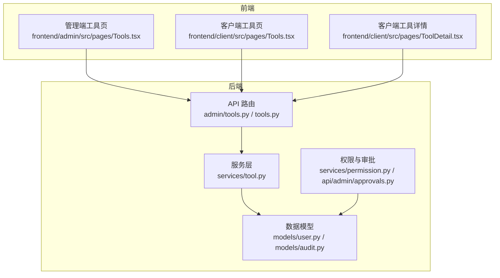
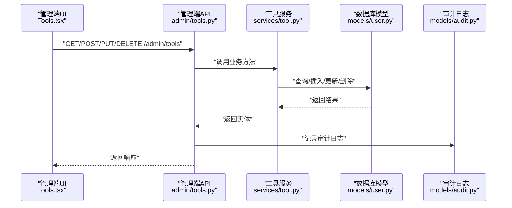
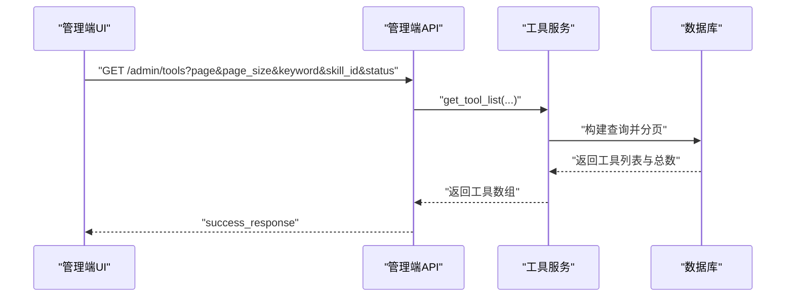
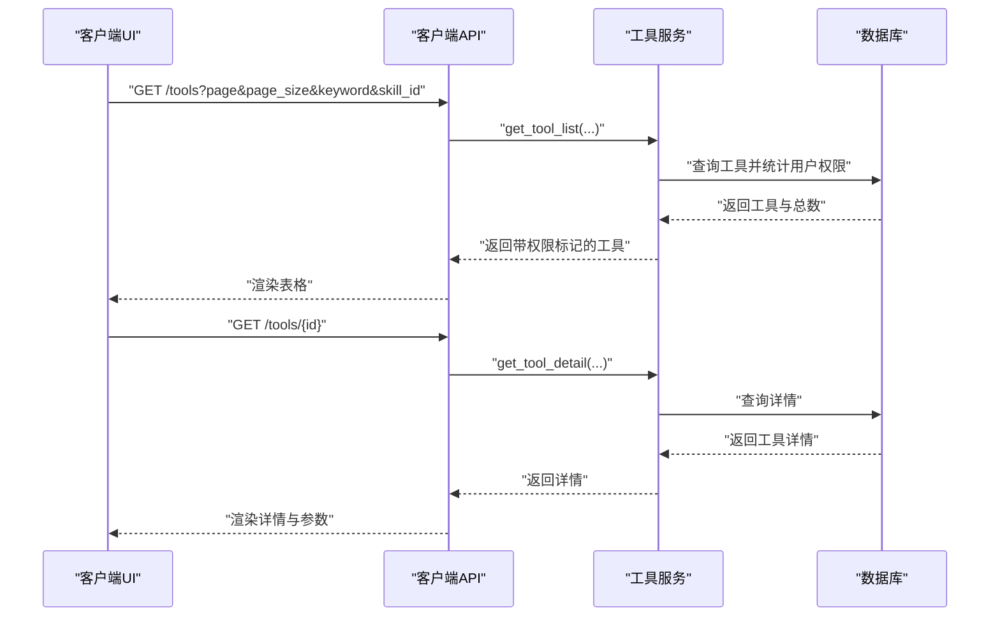
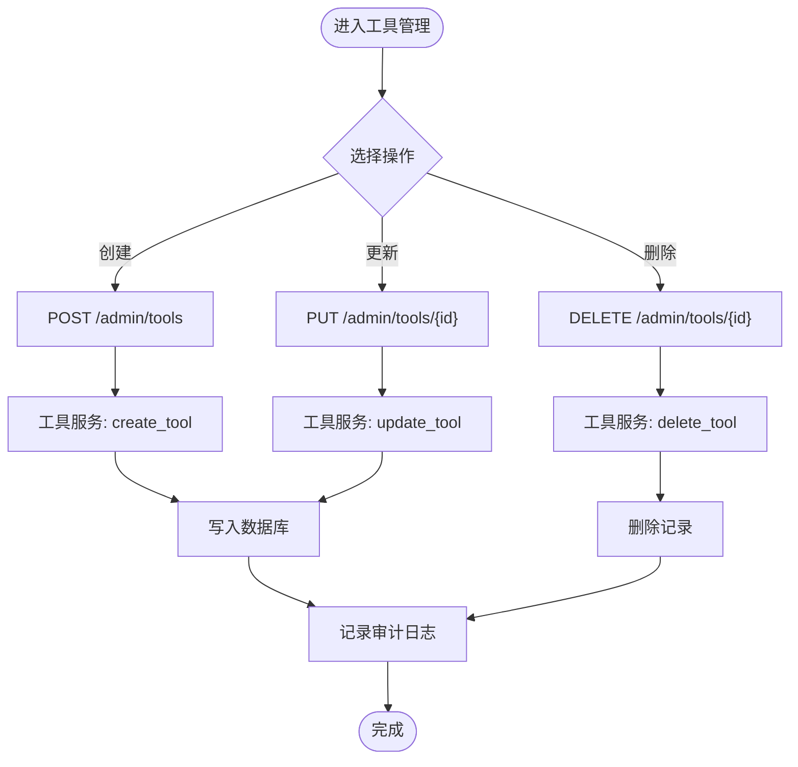
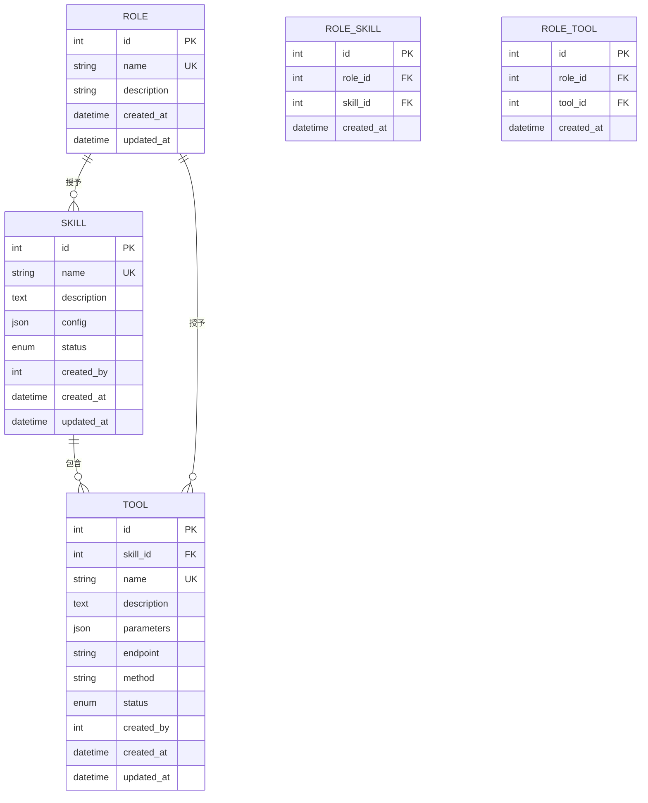
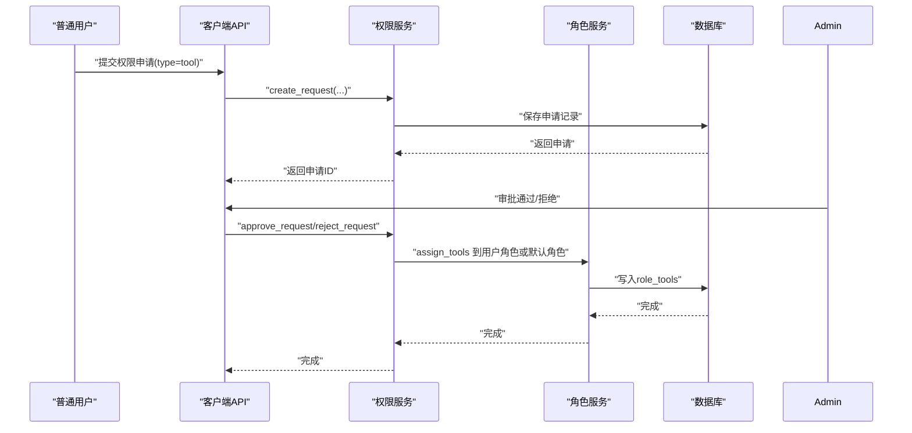
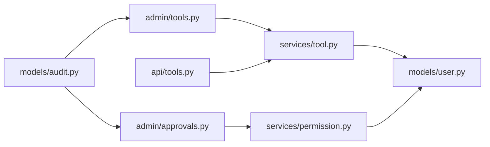

# 工具管理

<cite>
**本文引用的文件**
- [backend/app/api/admin/tools.py](file://backend/app/api/admin/tools.py)
- [backend/app/api/tools.py](file://backend/app/api/tools.py)
- [backend/app/services/tool.py](file://backend/app/services/tool.py)
- [backend/app/schemas/tool.py](file://backend/app/schemas/tool.py)
- [backend/app/models/user.py](file://backend/app/models/user.py)
- [backend/app/models/audit.py](file://backend/app/models/audit.py)
- [backend/app/api/admin/roles.py](file://backend/app/api/admin/roles.py)
- [backend/app/api/skills.py](file://backend/app/api/skills.py)
- [backend/app/api/admin/approvals.py](file://backend/app/api/admin/approvals.py)
- [backend/app/services/permission.py](file://backend/app/services/permission.py)
- [backend/alembic/versions/5fb1c261fa23_initial_tables.py](file://backend/alembic/versions/5fb1c261fa23_initial_tables.py)
- [frontend/admin/src/pages/Tools.tsx](file://frontend/admin/src/pages/Tools.tsx)
- [frontend/client/src/pages/Tools.tsx](file://frontend/client/src/pages/Tools.tsx)
- [frontend/client/src/pages/ToolDetail.tsx](file://frontend/client/src/pages/ToolDetail.tsx)
</cite>

## 目录
1. [简介](#简介)
2. [项目结构](#项目结构)
3. [核心组件](#核心组件)
4. [架构总览](#架构总览)
5. [详细组件分析](#详细组件分析)
6. [依赖分析](#依赖分析)
7. [性能考虑](#性能考虑)
8. [故障排查指南](#故障排查指南)
9. [结论](#结论)
10. [附录](#附录)

## 简介
本文件面向ToolHub管理端“工具管理”功能，系统化梳理工具列表展示、工具分类（技能）管理、工具信息编辑与状态控制、工具配置界面、权限与使用限制、工具与技能的关联关系、工具版本与兼容性控制、批量操作与导入导出、配置模板管理、工具审核流程与内容质量控制、用户使用统计、工具推荐与搜索优化、使用分析、运营策略与资源配置、用户体验优化等主题。文档以代码为依据，结合前后端实现，提供可操作的实践建议与可视化图示。

## 项目结构
- 后端采用FastAPI + SQLAlchemy，分层清晰：API路由层负责请求接入与鉴权，Service层封装业务逻辑，Schema层定义数据模型，Model层映射数据库表。
- 前端分为管理端与客户端两套应用，管理端用于后台工具与权限治理，客户端用于工具浏览与权限申请。

图表来源
- [backend/app/api/admin/tools.py:1-89](file://backend/app/api/admin/tools.py#L1-L89)
- [backend/app/api/tools.py:1-69](file://backend/app/api/tools.py#L1-L69)
- [backend/app/services/tool.py:1-104](file://backend/app/services/tool.py#L1-L104)
- [backend/app/models/user.py:81-98](file://backend/app/models/user.py#L81-L98)
- [backend/app/models/audit.py:6-17](file://backend/app/models/audit.py#L6-L17)
- [backend/app/api/admin/approvals.py:1-88](file://backend/app/api/admin/approvals.py#L1-L88)
- [backend/app/services/permission.py:32-181](file://backend/app/services/permission.py#L32-L181)
- [frontend/admin/src/pages/Tools.tsx:1-91](file://frontend/admin/src/pages/Tools.tsx#L1-L91)
- [frontend/client/src/pages/Tools.tsx:1-70](file://frontend/client/src/pages/Tools.tsx#L1-L70)
- [frontend/client/src/pages/ToolDetail.tsx:1-39](file://frontend/client/src/pages/ToolDetail.tsx#L1-L39)

章节来源
- [backend/app/api/admin/tools.py:1-89](file://backend/app/api/admin/tools.py#L1-L89)
- [backend/app/api/tools.py:1-69](file://backend/app/api/tools.py#L1-L69)
- [backend/app/services/tool.py:1-104](file://backend/app/services/tool.py#L1-L104)
- [backend/app/models/user.py:81-98](file://backend/app/models/user.py#L81-L98)
- [frontend/admin/src/pages/Tools.tsx:1-91](file://frontend/admin/src/pages/Tools.tsx#L1-L91)
- [frontend/client/src/pages/Tools.tsx:1-70](file://frontend/client/src/pages/Tools.tsx#L1-L70)
- [frontend/client/src/pages/ToolDetail.tsx:1-39](file://frontend/client/src/pages/ToolDetail.tsx#L1-L39)

## 核心组件
- 工具API（管理端）：提供工具列表、创建、更新、删除接口；支持关键词、技能过滤、状态过滤；记录审计日志。
- 工具API（客户端）：提供工具列表、详情查询；展示用户是否有权限；支持关键词与技能筛选。
- 工具服务：封装工具列表查询、详情查询、创建、更新、删除、用户工具权限集合计算。
- 数据模型：Tool、Skill、Role、RoleTool、RoleSkill、AuditLog等。
- 权限与审批：权限申请、审批流、自动将权限分配到用户角色或默认角色。
- 前端页面：管理端工具管理页（增删改）、客户端工具浏览与详情页（权限申请、参数展示）。

章节来源
- [backend/app/api/admin/tools.py:14-89](file://backend/app/api/admin/tools.py#L14-L89)
- [backend/app/api/tools.py:12-69](file://backend/app/api/tools.py#L12-L69)
- [backend/app/services/tool.py:11-104](file://backend/app/services/tool.py#L11-L104)
- [backend/app/schemas/tool.py:6-51](file://backend/app/schemas/tool.py#L6-L51)
- [backend/app/models/user.py:81-98](file://backend/app/models/user.py#L81-L98)
- [backend/app/models/audit.py:6-17](file://backend/app/models/audit.py#L6-L17)
- [backend/app/api/admin/approvals.py:14-88](file://backend/app/api/admin/approvals.py#L14-L88)
- [backend/app/services/permission.py:32-181](file://backend/app/services/permission.py#L32-L181)
- [frontend/admin/src/pages/Tools.tsx:5-91](file://frontend/admin/src/pages/Tools.tsx#L5-L91)
- [frontend/client/src/pages/Tools.tsx:7-70](file://frontend/client/src/pages/Tools.tsx#L7-L70)
- [frontend/client/src/pages/ToolDetail.tsx:6-39](file://frontend/client/src/pages/ToolDetail.tsx#L6-L39)

## 架构总览
工具管理在后端通过API路由接收请求，经鉴权后交由服务层处理，服务层访问数据库模型完成读写；前端页面通过HTTP接口与后端交互，管理端进行工具的全量维护，客户端进行工具浏览与权限申请。

图表来源
- [backend/app/api/admin/tools.py:14-89](file://backend/app/api/admin/tools.py#L14-L89)
- [backend/app/services/tool.py:11-104](file://backend/app/services/tool.py#L11-L104)
- [backend/app/models/user.py:81-98](file://backend/app/models/user.py#L81-L98)
- [backend/app/models/audit.py:6-17](file://backend/app/models/audit.py#L6-L17)
- [frontend/admin/src/pages/Tools.tsx:14-45](file://frontend/admin/src/pages/Tools.tsx#L14-L45)

## 详细组件分析

### 工具列表与筛选（管理端）
- 支持分页、关键词（名称/描述）、技能ID、状态过滤。
- 返回字段包含工具基本信息、所属技能名、状态、时间戳等。
- 审计日志记录创建/更新/删除操作。

图表来源
- [backend/app/api/admin/tools.py:14-42](file://backend/app/api/admin/tools.py#L14-L42)
- [backend/app/services/tool.py:12-34](file://backend/app/services/tool.py#L12-L34)

章节来源
- [backend/app/api/admin/tools.py:14-42](file://backend/app/api/admin/tools.py#L14-L42)
- [backend/app/services/tool.py:12-34](file://backend/app/services/tool.py#L12-L34)

### 工具详情与权限标记（客户端）
- 客户端工具列表展示“是否已授权”，用于引导用户申请权限。
- 工具详情页展示参数定义（JSON），便于使用者了解调用方式。

图表来源
- [backend/app/api/tools.py:12-69](file://backend/app/api/tools.py#L12-L69)
- [backend/app/services/tool.py:37-38](file://backend/app/services/tool.py#L37-L38)
- [frontend/client/src/pages/Tools.tsx:16-37](file://frontend/client/src/pages/Tools.tsx#L16-L37)
- [frontend/client/src/pages/ToolDetail.tsx:11-13](file://frontend/client/src/pages/ToolDetail.tsx#L11-L13)

章节来源
- [backend/app/api/tools.py:12-69](file://backend/app/api/tools.py#L12-L69)
- [backend/app/services/tool.py:89-100](file://backend/app/services/tool.py#L89-L100)
- [frontend/client/src/pages/Tools.tsx:7-70](file://frontend/client/src/pages/Tools.tsx#L7-L70)
- [frontend/client/src/pages/ToolDetail.tsx:6-39](file://frontend/client/src/pages/ToolDetail.tsx#L6-L39)

### 工具创建、更新、删除与状态控制
- 创建：记录创建人，生成唯一名称，写入参数、端点、方法等。
- 更新：支持部分字段更新，含状态字段；记录审计日志。
- 删除：软/硬删除取决于业务需求，当前实现为物理删除。
- 状态：枚举值包含“启用/停用”。

图表来源
- [backend/app/api/admin/tools.py:45-89](file://backend/app/api/admin/tools.py#L45-L89)
- [backend/app/services/tool.py:41-86](file://backend/app/services/tool.py#L41-L86)
- [backend/app/models/audit.py:6-17](file://backend/app/models/audit.py#L6-L17)

章节来源
- [backend/app/api/admin/tools.py:45-89](file://backend/app/api/admin/tools.py#L45-L89)
- [backend/app/services/tool.py:41-86](file://backend/app/services/tool.py#L41-L86)
- [backend/app/models/audit.py:6-17](file://backend/app/models/audit.py#L6-L17)

### 工具配置界面与参数管理
- 配置项：名称、描述、所属技能、端点、方法（GET/POST）、参数定义（JSON）。
- 管理端表单支持选择技能、输入端点与方法，编辑时回填数据。
- 客户端详情页展示参数定义，便于使用者理解调用约束。

章节来源
- [frontend/admin/src/pages/Tools.tsx:75-87](file://frontend/admin/src/pages/Tools.tsx#L75-L87)
- [frontend/client/src/pages/ToolDetail.tsx:29-34](file://frontend/client/src/pages/ToolDetail.tsx#L29-L34)
- [backend/app/schemas/tool.py:6-27](file://backend/app/schemas/tool.py#L6-L27)

### 工具与技能的关联关系
- 外键关联：Tool.skill_id 指向 Skill。
- 技能下工具聚合：技能详情页可列出该技能下的工具集合。
- 角色-技能-工具：通过中间表 RoleSkill、RoleTool 实现权限继承。

图表来源
- [backend/alembic/versions/5fb1c261fa23_initial_tables.py:117-138](file://backend/alembic/versions/5fb1c261fa23_initial_tables.py#L117-L138)
- [backend/app/models/user.py:65-98](file://backend/app/models/user.py#L65-L98)

章节来源
- [backend/alembic/versions/5fb1c261fa23_initial_tables.py:117-138](file://backend/alembic/versions/5fb1c261fa23_initial_tables.py#L117-L138)
- [backend/app/models/user.py:65-98](file://backend/app/models/user.py#L65-L98)
- [backend/app/api/skills.py:65-86](file://backend/app/api/skills.py#L65-L86)

### 工具版本管理与兼容性控制
- 当前模型未显式提供“版本号”字段；可通过以下方式扩展：
  - 在Tool模型新增version字段，配合唯一约束或版本号索引。
  - 通过参数定义(parameters)描述兼容性约束（如最低/最高API版本）。
  - 通过状态(status)控制新旧版本切换与灰度发布。
- 建议：版本变更时保留历史版本记录，避免破坏既有调用方。

章节来源
- [backend/app/models/user.py:81-98](file://backend/app/models/user.py#L81-L98)
- [backend/app/schemas/tool.py:6-13](file://backend/app/schemas/tool.py#L6-L13)

### 工具权限级别与使用限制
- 权限模型：用户-角色-技能/工具三级继承；工具状态为“启用”才视为可用。
- 使用限制：通过角色-工具绑定实现最小权限；客户端仅展示“已授权”的工具。
- 申请与审批：用户提交权限申请，管理员审批，审批通过后自动将权限分配到用户角色或默认角色。

图表来源
- [backend/app/api/admin/approvals.py:14-88](file://backend/app/api/admin/approvals.py#L14-L88)
- [backend/app/services/permission.py:32-181](file://backend/app/services/permission.py#L32-L181)
- [backend/app/api/admin/roles.py:97-111](file://backend/app/api/admin/roles.py#L97-L111)
- [backend/app/services/tool.py:89-100](file://backend/app/services/tool.py#L89-L100)

章节来源
- [backend/app/api/admin/approvals.py:14-88](file://backend/app/api/admin/approvals.py#L14-L88)
- [backend/app/services/permission.py:32-181](file://backend/app/services/permission.py#L32-L181)
- [backend/app/api/admin/roles.py:97-111](file://backend/app/api/admin/roles.py#L97-L111)
- [backend/app/services/tool.py:89-100](file://backend/app/services/tool.py#L89-L100)

### 工具数据的批量操作、导入导出与配置模板
- 批量操作：当前API未提供批量接口，可在管理端UI中增加多选与批量状态切换、批量删除等操作，后端可扩展批量接口。
- 导入导出：建议在后端新增导入/导出接口，支持CSV/JSON格式；导入时校验必填字段与唯一性，导出时包含工具元数据与参数定义。
- 配置模板：在Tool.parameters中存储模板化的参数结构，前端提供模板选择与预填充能力。

章节来源
- [backend/app/api/admin/tools.py:14-89](file://backend/app/api/admin/tools.py#L14-L89)
- [backend/app/schemas/tool.py:6-13](file://backend/app/schemas/tool.py#L6-L13)

### 工具审核流程与内容质量控制
- 审核流程：管理端审批页展示待审请求，支持通过/拒绝，记录审计日志。
- 内容质量：可通过参数定义(parameters)规范工具调用约束；状态字段用于快速下线异常工具；审计日志用于追踪变更。

章节来源
- [backend/app/api/admin/approvals.py:14-88](file://backend/app/api/admin/approvals.py#L14-L88)
- [backend/app/models/audit.py:6-17](file://backend/app/models/audit.py#L6-L17)

### 用户使用统计与分析
- 当前未提供专门的使用统计接口；可在后端新增工具调用次数、最近使用时间、失败率等指标，前端提供仪表盘展示。
- 可结合审计日志与调用链路埋点，形成完整的使用画像。

章节来源
- [backend/app/models/audit.py:6-17](file://backend/app/models/audit.py#L6-L17)

### 工具推荐算法、搜索优化与使用分析
- 推荐：基于用户角色-技能-工具的权限矩阵，结合工具状态与技能热度进行协同过滤或基于规则的推荐。
- 搜索：前端支持关键词与技能筛选；后端支持名称/描述模糊匹配；可引入全文检索或向量化召回提升体验。
- 分析：结合权限申请与使用行为，识别高价值工具与低效工具，指导资源投入与淘汰。

章节来源
- [backend/app/api/tools.py:12-42](file://backend/app/api/tools.py#L12-L42)
- [backend/app/services/tool.py:12-34](file://backend/app/services/tool.py#L12-L34)

### 运营策略、资源配置与用户体验优化
- 运营策略：设定工具生命周期（开发/上线/灰度/全量/归档），通过状态与参数控制流量；建立工具分级（高风险/低风险）与审批策略。
- 资源配置：为工具设置调用限额与熔断阈值，结合参数定义进行动态配置下发。
- 用户体验：管理端提供一键启停、批量导入导出；客户端提供参数可视化、权限申请直达、搜索与筛选优化。

章节来源
- [backend/app/schemas/tool.py:6-13](file://backend/app/schemas/tool.py#L6-L13)
- [frontend/admin/src/pages/Tools.tsx:47-66](file://frontend/admin/src/pages/Tools.tsx#L47-L66)
- [frontend/client/src/pages/Tools.tsx:39-54](file://frontend/client/src/pages/Tools.tsx#L39-L54)

## 依赖分析
- 组件耦合：API路由依赖服务层；服务层依赖模型层；权限与审批独立于工具模块但与角色/用户模型耦合。
- 外部依赖：FastAPI、SQLAlchemy、Pydantic、Ant Design（前端）。
- 潜在循环依赖：当前未发现循环导入；角色-技能-工具通过中间表解耦。

图表来源
- [backend/app/api/admin/tools.py:1-11](file://backend/app/api/admin/tools.py#L1-L11)
- [backend/app/api/tools.py:1-9](file://backend/app/api/tools.py#L1-L9)
- [backend/app/services/tool.py:1-6](file://backend/app/services/tool.py#L1-L6)
- [backend/app/models/user.py:1-4](file://backend/app/models/user.py#L1-L4)
- [backend/app/api/admin/approvals.py:1-11](file://backend/app/api/admin/approvals.py#L1-L11)
- [backend/app/services/permission.py:1-4](file://backend/app/services/permission.py#L1-L4)
- [backend/app/models/audit.py:1-3](file://backend/app/models/audit.py#L1-L3)

章节来源
- [backend/app/api/admin/tools.py:1-11](file://backend/app/api/admin/tools.py#L1-L11)
- [backend/app/api/tools.py:1-9](file://backend/app/api/tools.py#L1-L9)
- [backend/app/services/tool.py:1-6](file://backend/app/services/tool.py#L1-L6)
- [backend/app/models/user.py:1-4](file://backend/app/models/user.py#L1-L4)
- [backend/app/api/admin/approvals.py:1-11](file://backend/app/api/admin/approvals.py#L1-L11)
- [backend/app/services/permission.py:1-4](file://backend/app/services/permission.py#L1-L4)
- [backend/app/models/audit.py:1-3](file://backend/app/models/audit.py#L1-L3)

## 性能考虑
- 查询优化：工具列表应为高频接口，建议在名称、描述、技能ID、状态上建立复合索引；分页参数限制合理范围（已实现）。
- 缓存策略：工具详情与技能-工具映射可引入Redis缓存；权限判断可缓存用户有效工具集。
- 并发控制：批量操作建议使用事务与队列异步执行，避免阻塞主请求。
- 日志与监控：审计日志写入独立表，建议异步落盘；关键接口埋点Prometheus指标。

## 故障排查指南
- 工具不存在：更新/删除时若工具不存在会抛出错误；检查工具ID与软删除策略。
- 权限不足：客户端仅展示“已授权”工具；若未授权需走权限申请流程。
- 审批异常：审批状态必须为“待审批”才能操作；检查请求状态与用户权限。
- 参数不合法：前端表单校验与后端Schema校验双重保障；参数定义为JSON，注意格式与必填字段。

章节来源
- [backend/app/services/tool.py:57-86](file://backend/app/services/tool.py#L57-L86)
- [backend/app/services/permission.py:86-99](file://backend/app/services/permission.py#L86-L99)
- [frontend/client/src/pages/Tools.tsx:29-37](file://frontend/client/src/pages/Tools.tsx#L29-L37)

## 结论
工具管理模块以清晰的分层设计实现了从列表、详情、编辑到权限与审批的闭环。当前已具备基础的工具生命周期管理与权限控制能力；建议后续增强版本管理、批量操作、导入导出、配置模板、使用统计与推荐分析，以满足更复杂的运营与用户体验需求。

## 附录
- 关键接口与字段参考
  - 工具列表：支持分页、关键词、技能、状态过滤。
  - 工具详情：返回名称、描述、技能、端点、方法、状态、权限标记、参数定义。
  - 权限申请：type=tool，目标为工具ID。
  - 审批：支持通过/拒绝，记录审计日志。

章节来源
- [backend/app/api/admin/tools.py:14-42](file://backend/app/api/admin/tools.py#L14-L42)
- [backend/app/api/tools.py:12-69](file://backend/app/api/tools.py#L12-L69)
- [backend/app/api/admin/approvals.py:14-88](file://backend/app/api/admin/approvals.py#L14-L88)
- [backend/app/schemas/tool.py:6-51](file://backend/app/schemas/tool.py#L6-L51)