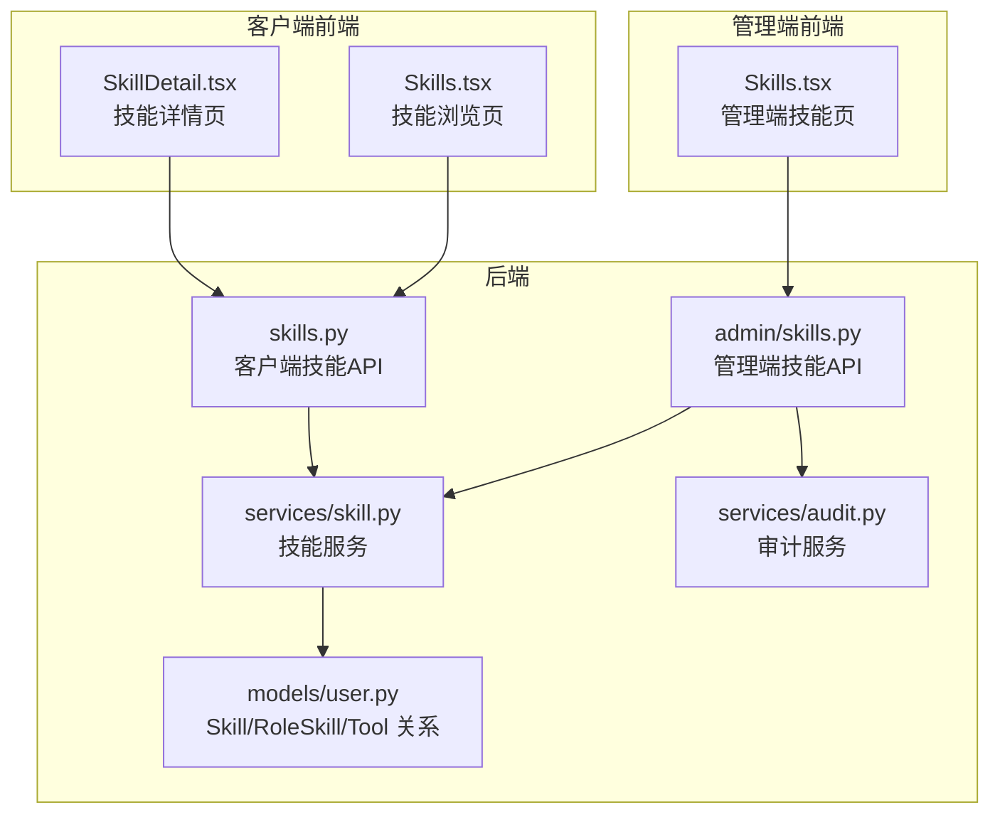
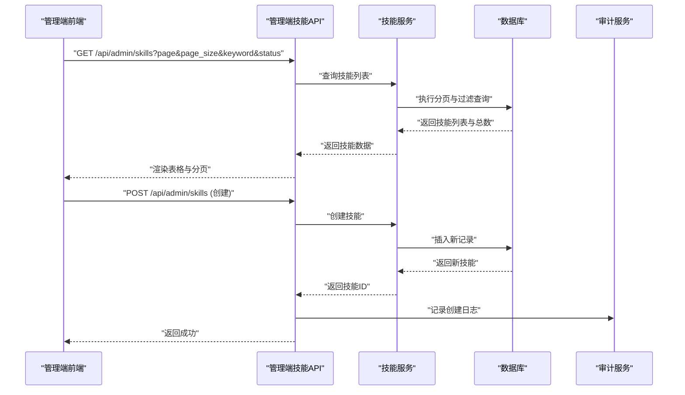
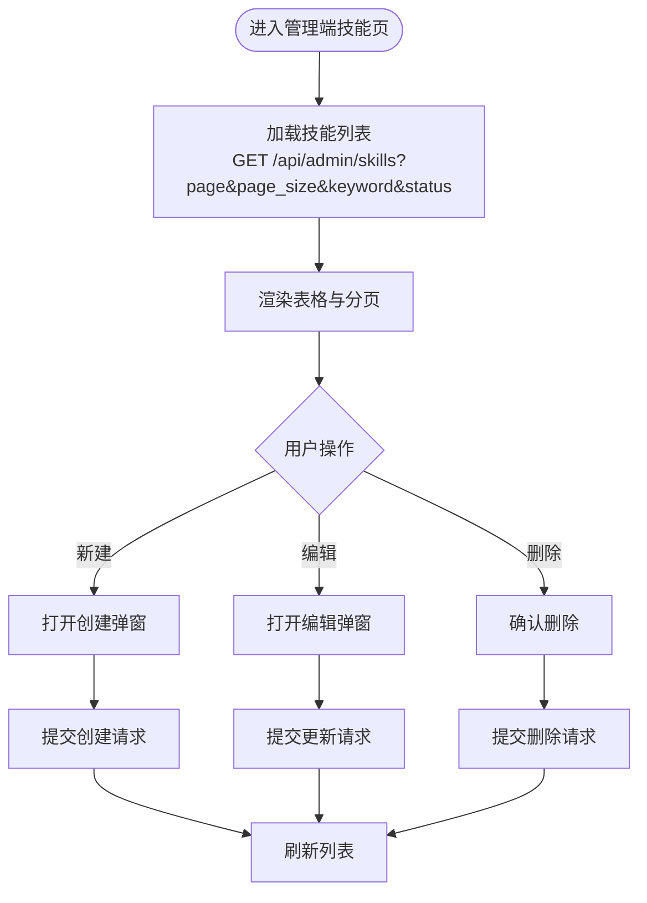
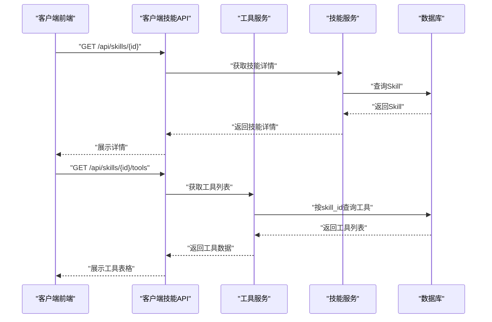
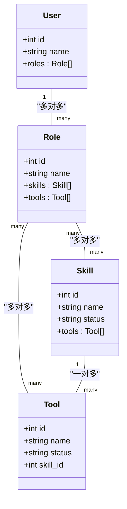
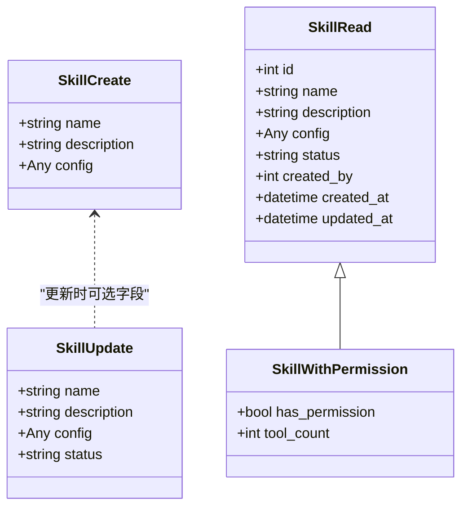
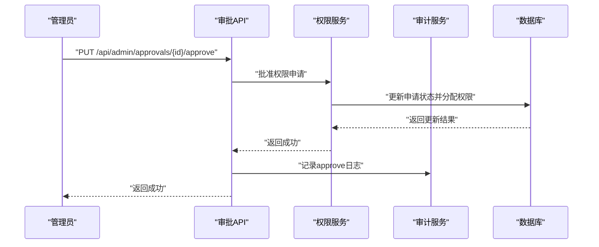
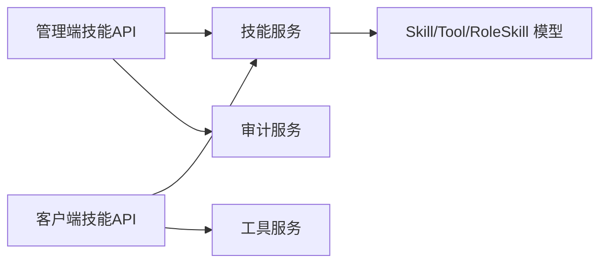

# 技能管理

<cite>
**本文引用的文件**
- [backend/app/api/admin/skills.py](file://backend/app/api/admin/skills.py)
- [backend/app/api/skills.py](file://backend/app/api/skills.py)
- [backend/app/services/skill.py](file://backend/app/services/skill.py)
- [backend/app/schemas/skill.py](file://backend/app/schemas/skill.py)
- [backend/app/models/user.py](file://backend/app/models/user.py)
- [backend/app/services/role.py](file://backend/app/services/role.py)
- [backend/app/api/admin/roles.py](file://backend/app/api/admin/roles.py)
- [backend/app/api/v1/verify.py](file://backend/app/api/v1/verify.py)
- [backend/app/api/admin/approvals.py](file://backend/app/api/admin/approvals.py)
- [backend/app/services/audit.py](file://backend/app/services/audit.py)
- [backend/app/models/audit.py](file://backend/app/models/audit.py)
- [frontend/admin/src/pages/Skills.tsx](file://frontend/admin/src/pages/Skills.tsx)
- [frontend/client/src/pages/Skills.tsx](file://frontend/client/src/pages/Skills.tsx)
- [frontend/client/src/pages/SkillDetail.tsx](file://frontend/client/src/pages/SkillDetail.tsx)
- [README.md](file://README.md)
</cite>

## 目录
1. [简介](#简介)
2. [项目结构](#项目结构)
3. [核心组件](#核心组件)
4. [架构总览](#架构总览)
5. [详细组件分析](#详细组件分析)
6. [依赖分析](#依赖分析)
7. [性能考虑](#性能考虑)
8. [故障排查指南](#故障排查指南)
9. [结论](#结论)
10. [附录](#附录)

## 简介
本文件面向ToolHub管理端“技能管理”功能，系统性梳理技能列表展示、技能分类管理、技能信息编辑、技能状态控制、技能配置界面、权限级别配置、使用限制管理、技能与工具的关联关系、技能等级体系与认证机制、技能数据的批量操作与版本管理、技能审核流程与内容质量控制、用户反馈处理、技能推荐与搜索优化、个性化展示、运营策略与用户体验优化等主题。文档以仓库现有代码为依据，结合前后端实现与数据库模型，给出可落地的说明与建议。

## 项目结构
- 后端采用FastAPI + SQLAlchemy 2.0，按模块划分：API路由、服务层、数据模型、Schema、中间件与工具。
- 管理端前端基于React + Ant Design，提供技能的增删改查与权限分配界面；客户端前端提供技能浏览与权限申请能力。
- RBAC权限模型：用户通过角色获得技能与工具的访问权限；角色与技能/工具为多对多关联。

图表来源
- [frontend/admin/src/pages/Skills.tsx:1-77](file://frontend/admin/src/pages/Skills.tsx#L1-L77)
- [frontend/client/src/pages/Skills.tsx:1-58](file://frontend/client/src/pages/Skills.tsx#L1-L58)
- [frontend/client/src/pages/SkillDetail.tsx:1-65](file://frontend/client/src/pages/SkillDetail.tsx#L1-L65)
- [backend/app/api/admin/skills.py:1-85](file://backend/app/api/admin/skills.py#L1-L85)
- [backend/app/api/skills.py:1-86](file://backend/app/api/skills.py#L1-L86)
- [backend/app/services/skill.py:1-92](file://backend/app/services/skill.py#L1-L92)
- [backend/app/models/user.py:65-106](file://backend/app/models/user.py#L65-L106)
- [backend/app/services/audit.py:1-54](file://backend/app/services/audit.py#L1-L54)

章节来源
- [README.md:1-301](file://README.md#L1-L301)

## 核心组件
- 管理端技能管理页面：提供技能列表、分页、关键词过滤、状态筛选、新增/编辑/删除、状态切换。
- 客户端技能浏览与详情：支持关键词搜索、查看技能详情、查看关联工具、申请权限。
- 技能服务：封装技能列表查询、详情读取、创建、更新、删除、用户权限计算。
- 权限分配：通过角色与技能的多对多关系进行权限授予；支持批量分配。
- 审计日志：对技能的创建/更新/删除/审批等关键操作进行记录。
- 对外验证：提供用户可用技能列表查询接口，供外部系统校验权限。

章节来源
- [backend/app/api/admin/skills.py:14-85](file://backend/app/api/admin/skills.py#L14-L85)
- [backend/app/api/skills.py:13-86](file://backend/app/api/skills.py#L13-L86)
- [backend/app/services/skill.py:11-92](file://backend/app/services/skill.py#L11-L92)
- [backend/app/schemas/skill.py:6-45](file://backend/app/schemas/skill.py#L6-L45)
- [frontend/admin/src/pages/Skills.tsx:1-77](file://frontend/admin/src/pages/Skills.tsx#L1-L77)
- [frontend/client/src/pages/Skills.tsx:1-58](file://frontend/client/src/pages/Skills.tsx#L1-L58)
- [frontend/client/src/pages/SkillDetail.tsx:1-65](file://frontend/client/src/pages/SkillDetail.tsx#L1-L65)
- [backend/app/api/admin/roles.py:81-94](file://backend/app/api/admin/roles.py#L81-L94)
- [backend/app/services/role.py:48-60](file://backend/app/services/role.py#L48-L60)
- [backend/app/api/admin/approvals.py:14-88](file://backend/app/api/admin/approvals.py#L14-L88)
- [backend/app/services/audit.py:9-31](file://backend/app/services/audit.py#L9-L31)
- [backend/app/api/v1/verify.py:33-40](file://backend/app/api/v1/verify.py#L33-L40)

## 架构总览
技能管理遵循“前端页面 + API路由 + 服务层 + 数据模型”的分层设计。管理端与客户端共享同一套后端能力，但鉴权与可见范围不同。管理端API要求管理员权限，客户端API基于当前用户上下文返回权限状态。

图表来源
- [backend/app/api/admin/skills.py:14-54](file://backend/app/api/admin/skills.py#L14-L54)
- [backend/app/services/skill.py:38-48](file://backend/app/services/skill.py#L38-L48)
- [backend/app/services/audit.py:19-30](file://backend/app/services/audit.py#L19-L30)

## 详细组件分析

### 管理端技能管理页面
- 功能点
  - 列表展示：ID、名称、描述、工具数量、状态、操作（编辑/删除）
  - 分页与筛选：页码、每页大小、关键词、状态
  - 新增/编辑：弹窗表单，必填名称，可编辑描述
  - 删除：确认后调用删除接口
- 前端实现要点
  - 使用Ant Design Table与分页控件
  - 状态标签颜色区分启用/停用
  - 提交时根据是否处于编辑态选择创建或更新
- 后端实现要点
  - 管理端路由要求管理员鉴权
  - 支持关键词在名称/描述中模糊匹配
  - 支持按状态过滤
  - 审计日志记录创建/更新/删除操作

图表来源
- [frontend/admin/src/pages/Skills.tsx:13-39](file://frontend/admin/src/pages/Skills.tsx#L13-L39)
- [backend/app/api/admin/skills.py:14-85](file://backend/app/api/admin/skills.py#L14-L85)

章节来源
- [frontend/admin/src/pages/Skills.tsx:1-77](file://frontend/admin/src/pages/Skills.tsx#L1-L77)
- [backend/app/api/admin/skills.py:14-85](file://backend/app/api/admin/skills.py#L14-L85)

### 技能详情与工具关联
- 客户端技能详情页
  - 并发加载技能详情与关联工具列表
  - 展示技能状态与权限状态
  - 工具列表显示名称、描述、权限状态与“申请”按钮
- 技能与工具的关联
  - 技能模型定义与工具的反向关系
  - 工具列表查询支持按技能ID过滤
- 权限判断
  - 用户对技能与工具的权限由其角色决定
  - 客户端API会返回has_permission字段

图表来源
- [frontend/client/src/pages/SkillDetail.tsx:12-22](file://frontend/client/src/pages/SkillDetail.tsx#L12-L22)
- [backend/app/api/skills.py:65-85](file://backend/app/api/skills.py#L65-L85)
- [backend/app/services/skill.py:34-35](file://backend/app/services/skill.py#L34-L35)
- [backend/app/models/user.py:65-78](file://backend/app/models/user.py#L65-L78)

章节来源
- [frontend/client/src/pages/SkillDetail.tsx:1-65](file://frontend/client/src/pages/SkillDetail.tsx#L1-L65)
- [backend/app/api/skills.py:43-85](file://backend/app/api/skills.py#L43-L85)
- [backend/app/models/user.py:65-78](file://backend/app/models/user.py#L65-L78)

### 权限级别配置与使用限制
- 权限模型
  - 用户通过角色获得技能/工具访问权限
  - 角色与技能/工具为多对多关系
  - 用户可拥有多个角色，权限为各角色权限的并集
- 技能权限计算
  - 服务层根据用户的角色集合，过滤状态为“active”的技能ID集合
- 角色分配技能
  - 管理端提供角色-技能批量分配接口
  - 分配时先清空旧关系，再写入新关系
- 使用限制
  - 当前代码未体现显式的“使用次数/频率/有效期”等限制字段
  - 可通过config字段扩展配置项，或新增独立的限制模型

图表来源
- [backend/app/models/user.py:65-106](file://backend/app/models/user.py#L65-L106)
- [backend/app/services/skill.py:77-88](file://backend/app/services/skill.py#L77-L88)
- [backend/app/api/admin/roles.py:81-94](file://backend/app/api/admin/roles.py#L81-L94)
- [backend/app/services/role.py:48-60](file://backend/app/services/role.py#L48-L60)

章节来源
- [backend/app/services/skill.py:77-88](file://backend/app/services/skill.py#L77-L88)
- [backend/app/api/admin/roles.py:81-94](file://backend/app/api/admin/roles.py#L81-L94)
- [backend/app/services/role.py:48-60](file://backend/app/services/role.py#L48-L60)
- [backend/app/models/user.py:65-106](file://backend/app/models/user.py#L65-L106)

### 技能配置界面与数据结构
- 技能基础模型
  - 名称、描述、JSON配置、状态、创建人、时间戳
- 管理端可编辑字段
  - 名称、描述（必填/可选）
  - 状态（启用/停用）
- 客户端展示字段
  - has_permission、tool_count等运行时派生字段

图表来源
- [backend/app/schemas/skill.py:6-45](file://backend/app/schemas/skill.py#L6-L45)

章节来源
- [backend/app/schemas/skill.py:6-45](file://backend/app/schemas/skill.py#L6-L45)
- [backend/app/api/admin/skills.py:41-70](file://backend/app/api/admin/skills.py#L41-L70)
- [backend/app/api/skills.py:13-62](file://backend/app/api/skills.py#L13-L62)

### 审核流程与内容质量控制
- 审批管理
  - 管理端提供待审批列表，支持按状态过滤
  - 支持通过/拒绝，记录审批意见与操作人
- 审计日志
  - 对技能的创建/更新/删除以及审批动作进行记录
  - 日志包含操作类型、目标类型、目标ID、详情与IP
- 内容质量控制建议
  - 在技能状态字段上增加“待审/审核中/已发布/下架”等状态
  - 审批通过后自动将技能状态置为“已发布”，并触发通知
  - 审计日志作为合规追溯依据

图表来源
- [backend/app/api/admin/approvals.py:58-71](file://backend/app/api/admin/approvals.py#L58-L71)
- [backend/app/services/audit.py:19-30](file://backend/app/services/audit.py#L19-L30)
- [backend/app/models/audit.py:6-17](file://backend/app/models/audit.py#L6-L17)

章节来源
- [backend/app/api/admin/approvals.py:14-88](file://backend/app/api/admin/approvals.py#L14-L88)
- [backend/app/services/audit.py:9-50](file://backend/app/services/audit.py#L9-L50)
- [backend/app/models/audit.py:6-17](file://backend/app/models/audit.py#L6-L17)

### 技能与工具的关联关系、等级体系与认证机制
- 关联关系
  - 技能与工具为一对多关系；工具属于某个技能
  - 技能列表页展示每个技能的工具数量
- 等级体系与认证
  - 当前未见明确的“技能等级/认证证书”字段或流程
  - 建议在config中扩展等级/认证元数据，或新增认证任务模型
- 权限认证
  - 通过角色-技能/工具的多对多关系实现
  - 对外验证接口提供用户可用技能列表

章节来源
- [backend/app/models/user.py:65-78](file://backend/app/models/user.py#L65-L78)
- [backend/app/api/v1/verify.py:33-40](file://backend/app/api/v1/verify.py#L33-L40)

### 技能数据的批量操作、导入导出与版本管理
- 批量操作
  - 角色批量分配技能：管理端提供批量分配接口
  - 技能层面暂未提供批量启用/停用/删除
- 导入导出
  - 未发现现成的导入导出接口
  - 建议在管理端新增“技能模板下载/上传”与“批量导入/导出”能力
- 版本管理
  - 未发现技能版本表或变更历史
  - 建议引入技能版本表或变更记录表，配合config字段的版本化

章节来源
- [backend/app/api/admin/roles.py:81-94](file://backend/app/api/admin/roles.py#L81-L94)
- [backend/app/services/role.py:48-60](file://backend/app/services/role.py#L48-L60)

### 技能推荐算法、搜索优化与个性化展示
- 搜索优化
  - 客户端技能列表支持关键词过滤（名称/描述）
  - 建议在后端增加全文索引或向量化检索（如Elasticsearch），提升大体量场景下的搜索体验
- 个性化展示
  - 可基于用户历史申请/使用行为，结合技能热度（工具数量、申请次数）进行排序
  - 展示“我可使用的技能”与“推荐技能”双列
- 推荐算法
  - 协同过滤：相似角色的技能偏好
  - 内容相似度：基于技能描述/标签的向量相似
  - 以上为概念性建议，需结合数据与指标评估

章节来源
- [backend/app/api/skills.py:13-40](file://backend/app/api/skills.py#L13-L40)
- [frontend/client/src/pages/Skills.tsx:14-18](file://frontend/client/src/pages/Skills.tsx#L14-L18)

### 运营策略、内容维护与用户体验优化
- 运营策略
  - 设定技能发布门槛（如最低描述长度、示例工具数量）
  - 建立“热门技能”榜单与“新技能”专区
- 内容维护
  - 定期清理长期无人使用的技能
  - 建立技能评分/评价机制（可选）
- 用户体验
  - 管理端：提供“批量启用/停用”“状态筛选”“关键词搜索”
  - 客户端：突出“已授权/未授权”状态，简化申请流程

## 依赖分析
- 组件耦合
  - 管理端API依赖技能服务与审计服务
  - 客户端API依赖技能服务与工具服务
  - 技能服务依赖数据模型（Skill/Tool/RoleSkill）
- 外部依赖
  - 数据库：MySQL
  - 认证：JWT + 飞书OAuth2
  - 前端UI：Ant Design

图表来源
- [backend/app/api/admin/skills.py:1-11](file://backend/app/api/admin/skills.py#L1-L11)
- [backend/app/api/skills.py:1-10](file://backend/app/api/skills.py#L1-L10)
- [backend/app/services/skill.py:1-6](file://backend/app/services/skill.py#L1-L6)
- [backend/app/models/user.py:65-106](file://backend/app/models/user.py#L65-L106)
- [backend/app/services/audit.py:1-4](file://backend/app/services/audit.py#L1-L4)

章节来源
- [backend/app/api/admin/skills.py:1-11](file://backend/app/api/admin/skills.py#L1-L11)
- [backend/app/api/skills.py:1-10](file://backend/app/api/skills.py#L1-L10)
- [backend/app/services/skill.py:1-6](file://backend/app/services/skill.py#L1-L6)
- [backend/app/models/user.py:65-106](file://backend/app/models/user.py#L65-L106)
- [backend/app/services/audit.py:1-4](file://backend/app/services/audit.py#L1-L4)

## 性能考虑
- 查询优化
  - 技能列表分页与关键词过滤应配合索引（名称、描述、状态）
  - 工具列表按技能ID过滤需确保索引命中
- 并发与缓存
  - 对高频读取的技能详情可引入Redis缓存
  - 批量操作建议异步化，避免阻塞主流程
- 前端体验
  - 列表懒加载与虚拟滚动（当数据量增大时）
  - 并发请求合并（如技能详情与工具列表）

## 故障排查指南
- 常见错误
  - 技能不存在：更新/删除时抛出“技能不存在”异常
  - 权限不足：管理端API需要管理员权限
  - 审批异常：审批状态不合法或目标对象缺失
- 审计追踪
  - 通过审计日志定位操作人、操作类型、目标与时间
- 建议排查步骤
  - 确认用户角色与权限映射
  - 检查技能状态与角色状态
  - 查看审计日志与数据库记录一致性

章节来源
- [backend/app/services/skill.py:51-74](file://backend/app/services/skill.py#L51-L74)
- [backend/app/api/admin/skills.py:68-84](file://backend/app/api/admin/skills.py#L68-L84)
- [backend/app/api/admin/approvals.py:58-87](file://backend/app/api/admin/approvals.py#L58-L87)
- [backend/app/services/audit.py:33-50](file://backend/app/services/audit.py#L33-L50)

## 结论
当前技能管理功能已具备完整的CRUD与权限分配能力，满足管理端对技能的日常运维需求。建议后续在以下方面持续演进：引入更丰富的权限限制与使用限制、完善审核流程与内容质量控制、扩展技能等级与认证机制、增强搜索与推荐能力、补充批量操作与导入导出能力，并建立版本管理与审计闭环，以支撑更大规模的企业级应用场景。

## 附录
- API概览（节选）
  - 管理端技能管理：GET/POST/PUT/DELETE /api/admin/skills
  - 客户端技能浏览：GET /api/skills、GET /api/skills/{id}、GET /api/skills/{id}/tools
  - 对外验证：GET /api/v1/users/{id}/skills
- 数据库表要点
  - skills：技能主表（名称唯一、状态、配置JSON、创建人）
  - role_skills：角色-技能关联表
  - audit_logs：审计日志表

章节来源
- [README.md:166-201](file://README.md#L166-L201)
- [README.md:202-216](file://README.md#L202-L216)