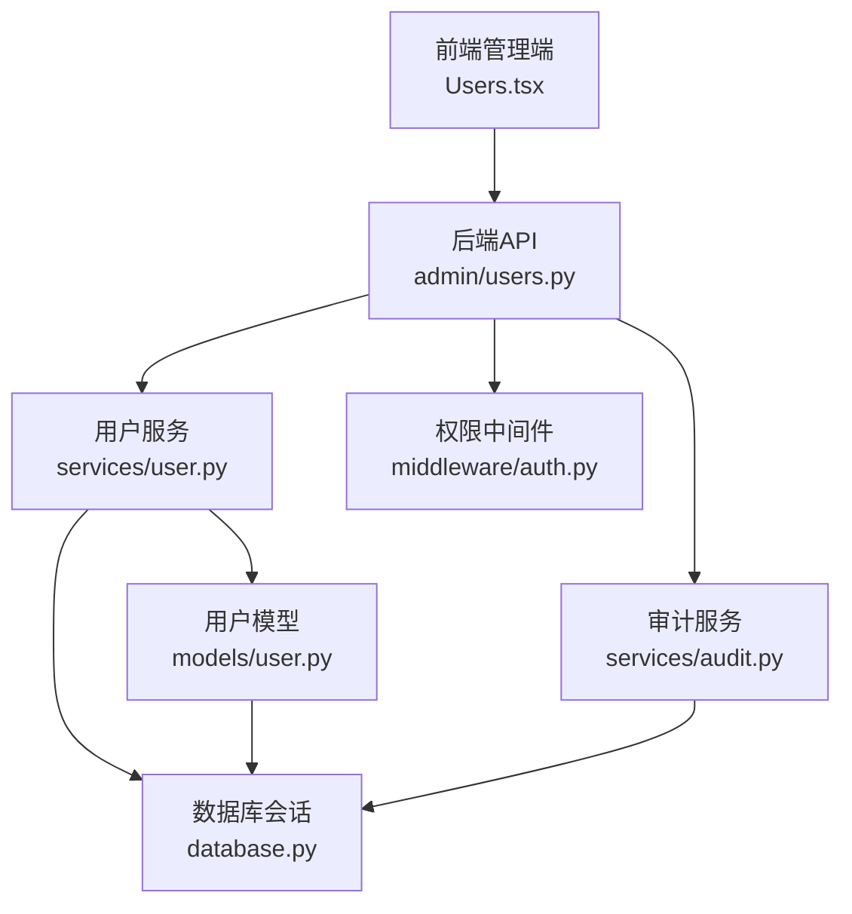
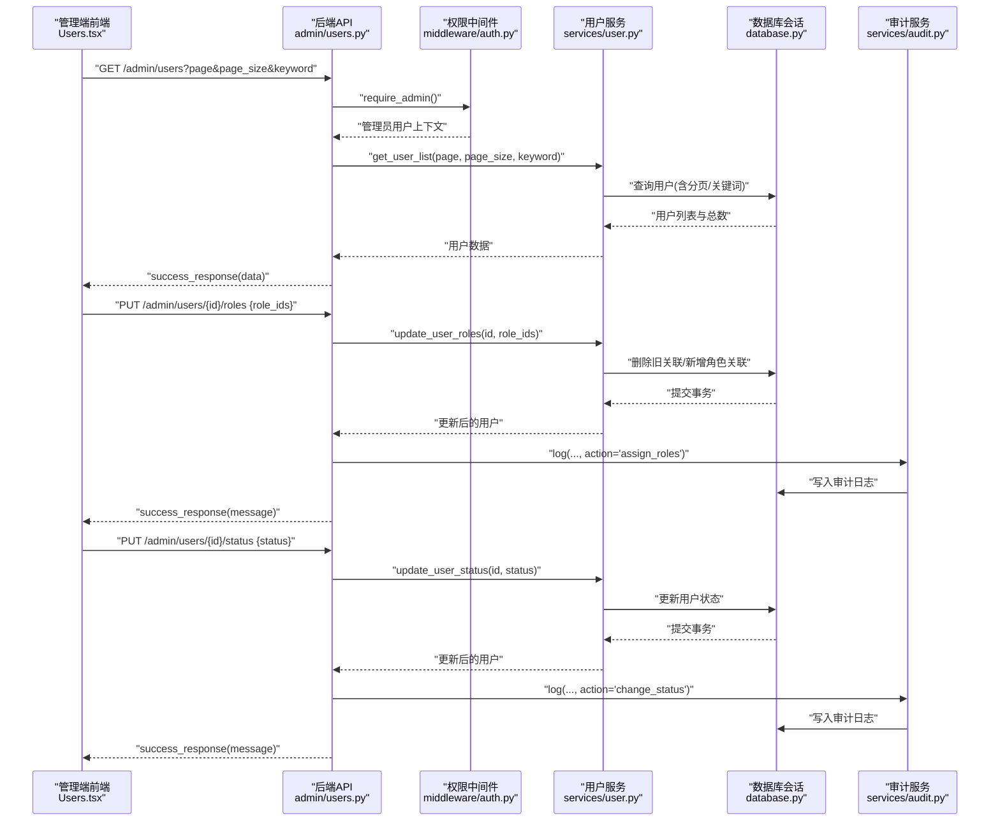
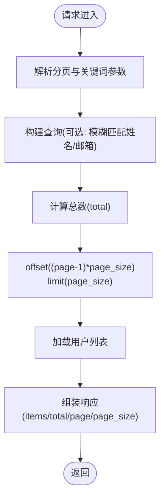
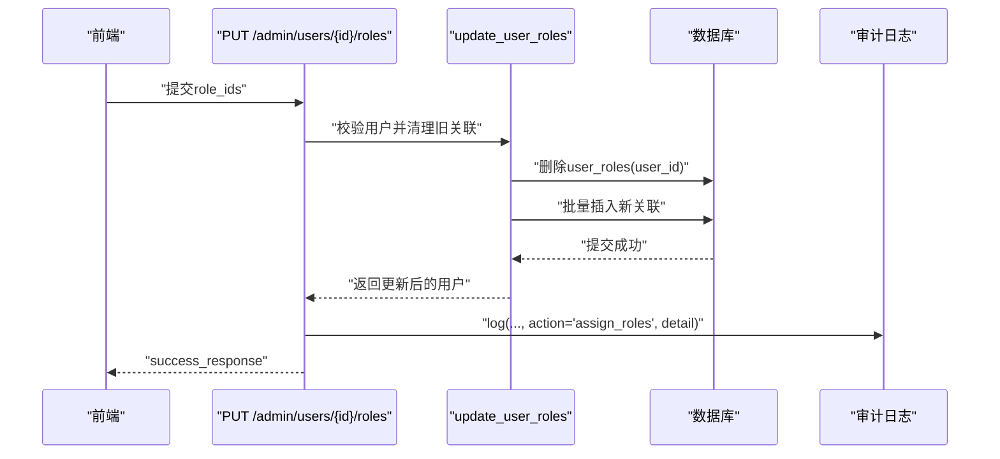
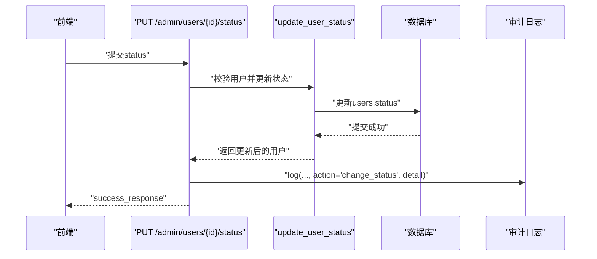
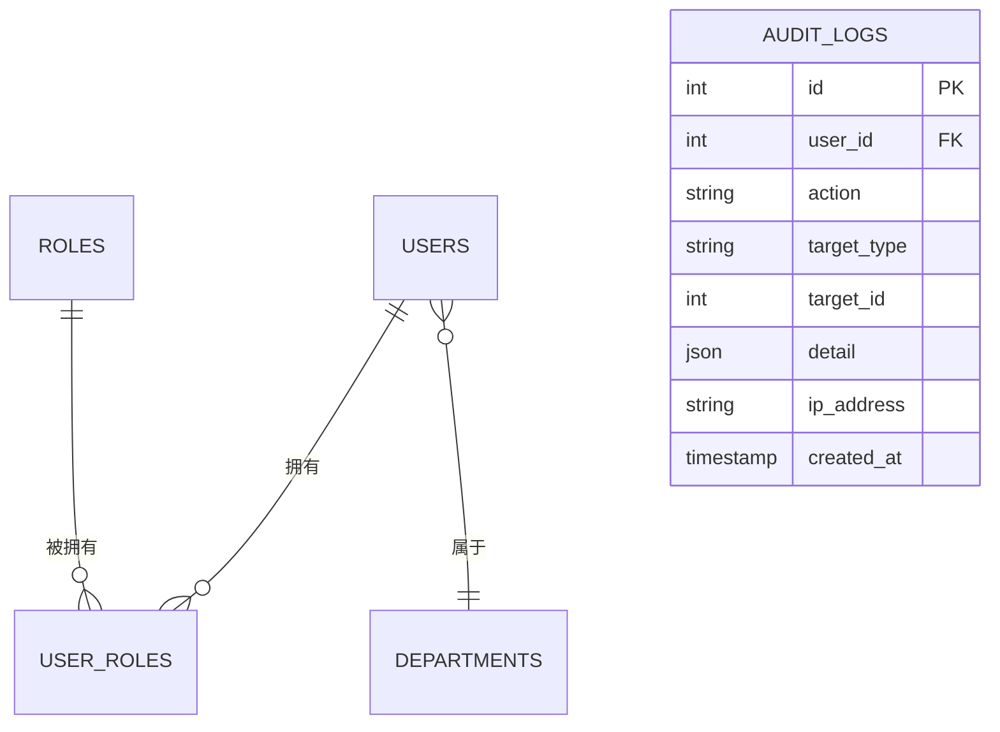
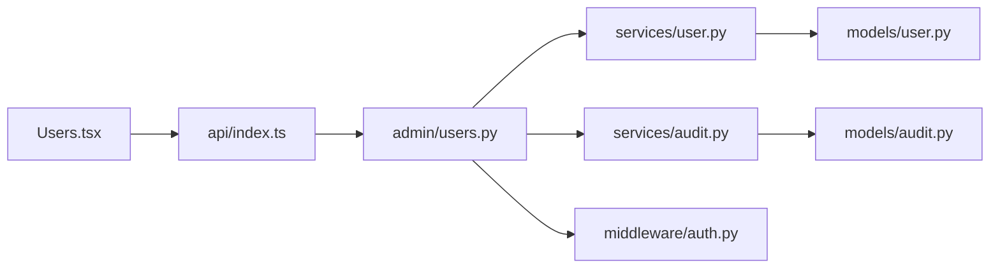

# 用户管理

<cite>
**本文引用的文件**
- [backend/app/api/admin/users.py](file://backend/app/api/admin/users.py)
- [backend/app/api/users.py](file://backend/app/api/users.py)
- [backend/app/models/user.py](file://backend/app/models/user.py)
- [backend/app/schemas/user.py](file://backend/app/schemas/user.py)
- [backend/app/services/user.py](file://backend/app/services/user.py)
- [backend/app/middleware/auth.py](file://backend/app/middleware/auth.py)
- [backend/app/schemas/common.py](file://backend/app/schemas/common.py)
- [backend/app/services/audit.py](file://backend/app/services/audit.py)
- [backend/app/models/audit.py](file://backend/app/models/audit.py)
- [frontend/admin/src/pages/Users.tsx](file://frontend/admin/src/pages/Users.tsx)
- [frontend/admin/src/api/index.ts](file://frontend/admin/src/api/index.ts)
</cite>

## 目录
1. [简介](#简介)
2. [项目结构](#项目结构)
3. [核心组件](#核心组件)
4. [架构总览](#架构总览)
5. [详细组件分析](#详细组件分析)
6. [依赖分析](#依赖分析)
7. [性能考虑](#性能考虑)
8. [故障排查指南](#故障排查指南)
9. [结论](#结论)
10. [附录](#附录)

## 简介
本文件面向ToolHub管理端“用户管理”功能，围绕Users页面的CRUD与批量操作展开，覆盖用户列表展示、搜索过滤、分页排序、状态与角色变更、权限校验、操作审计与数据安全等主题。同时给出前后端交互流程、数据模型映射、错误处理与性能优化建议，帮助开发者与运维人员快速理解与维护该模块。

## 项目结构
- 后端采用FastAPI + SQLAlchemy，用户管理相关代码集中在：
  - 路由层：admin用户路由与普通用户路由
  - 服务层：用户业务逻辑（查询、更新状态、更新角色）
  - 模型层：用户、角色、部门、用户-角色关联、审计日志等
  - 架构中间件：鉴权与管理员权限校验
- 前端采用React + Ant Design，Users页面负责列表渲染、搜索、分页、角色分配弹窗与状态切换。

图表来源
- [backend/app/api/admin/users.py:14-97](file://backend/app/api/admin/users.py#L14-L97)
- [backend/app/services/user.py:8-86](file://backend/app/services/user.py#L8-L86)
- [backend/app/middleware/auth.py:12-45](file://backend/app/middleware/auth.py#L12-L45)
- [backend/app/services/audit.py:6-54](file://backend/app/services/audit.py#L6-L54)
- [backend/app/models/user.py:23-116](file://backend/app/models/user.py#L23-L116)

章节来源
- [backend/app/api/admin/users.py:14-97](file://backend/app/api/admin/users.py#L14-L97)
- [frontend/admin/src/pages/Users.tsx:1-95](file://frontend/admin/src/pages/Users.tsx#L1-L95)

## 核心组件
- 用户列表接口：支持分页、关键词搜索（姓名/邮箱），返回用户基础信息与角色列表
- 用户详情接口：返回用户完整信息（含部门名、角色详情）
- 角色分配接口：更新用户角色集合，记录审计日志
- 状态更新接口：切换用户启用/禁用状态，记录审计日志
- 当前用户权限查询：供前端侧显示可用能力
- 权限中间件：要求管理员身份访问上述接口
- 审计日志：记录关键操作（角色分配、状态变更）的详细信息

章节来源
- [backend/app/api/admin/users.py:14-97](file://backend/app/api/admin/users.py#L14-L97)
- [backend/app/api/users.py:12-29](file://backend/app/api/users.py#L12-L29)
- [backend/app/middleware/auth.py:36-45](file://backend/app/middleware/auth.py#L36-L45)
- [backend/app/services/audit.py:6-54](file://backend/app/services/audit.py#L6-L54)

## 架构总览
下图展示了从管理端Users页面到后端API、服务层与数据库的完整调用链路，以及权限校验与审计日志的集成位置。

图表来源
- [backend/app/api/admin/users.py:14-97](file://backend/app/api/admin/users.py#L14-L97)
- [backend/app/services/user.py:12-63](file://backend/app/services/user.py#L12-L63)
- [backend/app/middleware/auth.py:36-45](file://backend/app/middleware/auth.py#L36-L45)
- [backend/app/services/audit.py:10-30](file://backend/app/services/audit.py#L10-L30)

## 详细组件分析

### 用户列表与搜索过滤
- 接口路径与参数
  - GET /admin/users?page&pageSize&keyword
  - 分页参数：page≥1；pageSize∈[1,100]
  - 关键词搜索：支持姓名或邮箱模糊匹配
- 返回结构
  - items：用户基础字段与角色简要信息
  - total/page/page_size：分页统计
- 服务层实现要点
  - 使用SQLAlchemy的or_组合姓名/邮箱模糊查询
  - 先count再offset+limit分页，避免重复扫描
- 前端实现要点
  - 默认每页20条，支持输入框搜索并重置页码
  - 表格列包含ID、姓名、邮箱、部门、角色标签、状态、管理员标识与操作按钮

图表来源
- [backend/app/api/admin/users.py:14-39](file://backend/app/api/admin/users.py#L14-L39)
- [backend/app/services/user.py:12-28](file://backend/app/services/user.py#L12-L28)

章节来源
- [backend/app/api/admin/users.py:14-39](file://backend/app/api/admin/users.py#L14-L39)
- [backend/app/services/user.py:12-28](file://backend/app/services/user.py#L12-L28)
- [frontend/admin/src/pages/Users.tsx:15-27](file://frontend/admin/src/pages/Users.tsx#L15-L27)

### 用户详情与角色展示
- 接口路径：GET /admin/users/{id}
- 返回字段：包含部门名称、角色详情（含描述）、创建时间等
- 前端用途：用于在表格中展示角色标签、状态颜色与管理员标识

章节来源
- [backend/app/api/admin/users.py:42-64](file://backend/app/api/admin/users.py#L42-L64)
- [frontend/admin/src/pages/Users.tsx:44-72](file://frontend/admin/src/pages/Users.tsx#L44-L72)

### 角色分配（单个用户）
- 接口路径：PUT /admin/users/{id}/roles
- 请求体：role_ids数组
- 服务层流程
  - 校验用户存在性
  - 清空旧的角色关联
  - 逐个插入新的用户-角色关联
  - 提交事务并刷新用户对象
- 审计日志
  - 记录action为“assign_roles”，detail包含role_ids
- 前端流程
  - 打开模态框，多选角色，点击确定后调用接口并提示成功

图表来源
- [backend/app/api/admin/users.py:67-81](file://backend/app/api/admin/users.py#L67-L81)
- [backend/app/services/user.py:35-52](file://backend/app/services/user.py#L35-L52)
- [backend/app/services/audit.py:10-30](file://backend/app/services/audit.py#L10-L30)

章节来源
- [backend/app/api/admin/users.py:67-81](file://backend/app/api/admin/users.py#L67-L81)
- [backend/app/services/user.py:35-52](file://backend/app/services/user.py#L35-L52)
- [frontend/admin/src/pages/Users.tsx:29-35](file://frontend/admin/src/pages/Users.tsx#L29-L35)

### 状态更新（单个用户）
- 接口路径：PUT /admin/users/{id}/status
- 请求体：status字符串（active/inactive）
- 服务层流程
  - 校验用户存在性并更新状态
  - 提交事务并刷新用户对象
- 审计日志
  - 记录action为“change_status”，detail包含新状态
- 前端流程
  - 点击“启用/禁用”按钮，自动切换状态并提示成功

图表来源
- [backend/app/api/admin/users.py:83-97](file://backend/app/api/admin/users.py#L83-L97)
- [backend/app/services/user.py:55-63](file://backend/app/services/user.py#L55-L63)
- [backend/app/services/audit.py:10-30](file://backend/app/services/audit.py#L10-L30)

章节来源
- [backend/app/api/admin/users.py:83-97](file://backend/app/api/admin/users.py#L83-L97)
- [backend/app/services/user.py:55-63](file://backend/app/services/user.py#L55-L63)
- [frontend/admin/src/pages/Users.tsx:37-42](file://frontend/admin/src/pages/Users.tsx#L37-L42)

### 当前用户权限查询
- 接口路径：GET /users/me/permissions
- 用途：前端根据用户权限决定UI可用性（例如是否显示某些按钮）
- 实现：通过用户角色聚合技能与工具名称集合，去重后返回

章节来源
- [backend/app/api/users.py:12-29](file://backend/app/api/users.py#L12-L29)
- [backend/app/services/user.py:66-82](file://backend/app/services/user.py#L66-L82)

### 数据模型与关系
- 用户表：包含基础信息、状态、管理员标记、部门外键、角色多对多关联
- 角色表：角色基本信息与多对多关联
- 用户-角色关联表：用户与角色的多对多中间表
- 审计日志表：记录操作人、动作、目标类型与ID、详情与时间

图表来源
- [backend/app/models/user.py:23-62](file://backend/app/models/user.py#L23-L62)
- [backend/app/models/audit.py:6-16](file://backend/app/models/audit.py#L6-L16)

章节来源
- [backend/app/models/user.py:23-62](file://backend/app/models/user.py#L23-L62)
- [backend/app/models/audit.py:6-16](file://backend/app/models/audit.py#L6-L16)

### 权限控制与错误处理
- 权限控制
  - require_admin中间件确保仅管理员可访问用户管理相关接口
  - get_current_user中间件确保当前用户有效且状态为“active”
- 错误处理
  - 用户不存在时抛出异常，服务层捕获并转换为错误响应
  - 统一响应格式：success_response/error_response

章节来源
- [backend/app/middleware/auth.py:36-45](file://backend/app/middleware/auth.py#L36-L45)
- [backend/app/middleware/auth.py:12-33](file://backend/app/middleware/auth.py#L12-L33)
- [backend/app/schemas/common.py:23-28](file://backend/app/schemas/common.py#L23-L28)
- [backend/app/services/user.py:38-39](file://backend/app/services/user.py#L38-L39)
- [backend/app/services/user.py:58-59](file://backend/app/services/user.py#L58-L59)

### 前后端交互与表单提交
- 前端Users页面
  - 列表加载：调用userApi.getList，传入page/page_size/keyword
  - 角色分配：打开模态框，选择角色后调用userApi.updateRoles
  - 状态切换：调用userApi.updateStatus，自动切换active/inactive
- API封装
  - userApi暴露getList/getDetail/updateRoles/updateStatus
  - roleApi提供角色列表读取（用于角色分配）

章节来源
- [frontend/admin/src/pages/Users.tsx:15-42](file://frontend/admin/src/pages/Users.tsx#L15-L42)
- [frontend/admin/src/api/index.ts:11-17](file://frontend/admin/src/api/index.ts#L11-L17)

## 依赖分析
- 组件耦合
  - admin/users路由依赖用户服务与审计服务
  - 用户服务依赖模型层与数据库会话
  - 权限中间件贯穿所有受保护接口
- 外部依赖
  - FastAPI路由装饰器、SQLAlchemy ORM、Ant Design前端组件库
- 可能的循环依赖
  - 当前模块间为单向依赖，未发现循环导入

图表来源
- [backend/app/api/admin/users.py:14-97](file://backend/app/api/admin/users.py#L14-L97)
- [backend/app/services/user.py:8-86](file://backend/app/services/user.py#L8-L86)
- [backend/app/services/audit.py:6-54](file://backend/app/services/audit.py#L6-L54)
- [backend/app/middleware/auth.py:12-45](file://backend/app/middleware/auth.py#L12-L45)
- [backend/app/models/user.py:23-116](file://backend/app/models/user.py#L23-L116)
- [backend/app/models/audit.py:6-16](file://backend/app/models/audit.py#L6-L16)
- [frontend/admin/src/pages/Users.tsx:1-95](file://frontend/admin/src/pages/Users.tsx#L1-L95)
- [frontend/admin/src/api/index.ts:1-60](file://frontend/admin/src/api/index.ts#L1-L60)

## 性能考虑
- 查询优化
  - 使用or_进行姓名/邮箱模糊匹配时，建议在高频字段上建立索引（如name、email、feishu_id）
  - 分页使用offset+limit，大数据量场景建议引入基于游标或唯一键的高效分页策略
- 写入优化
  - 角色分配采用先删后增，批量插入时注意数据库事务大小与锁竞争
- 缓存建议
  - 对常用角色列表与部门树可做短期缓存，降低频繁查询压力
- 并发控制
  - 在高并发场景下，角色分配应使用数据库级约束与事务隔离级别保障一致性

## 故障排查指南
- 常见问题
  - 403 Forbidden：非管理员用户尝试访问用户管理接口
  - 401 Unauthorized：令牌无效或过期，或用户不存在
  - 404 Not Found：用户不存在或资源未找到
  - 500 Internal Server Error：数据库事务失败或未捕获异常
- 定位步骤
  - 查看后端日志与审计日志，确认操作人、动作、目标与时间
  - 检查数据库连接与事务提交状态
  - 前端确认请求参数（page/page_size/keyword/role_ids/status）是否符合接口约束
- 审计日志
  - 通过审计服务查询指定用户、动作类型与目标类型的日志，辅助复盘

章节来源
- [backend/app/middleware/auth.py:18-32](file://backend/app/middleware/auth.py#L18-L32)
- [backend/app/middleware/auth.py:39-43](file://backend/app/middleware/auth.py#L39-L43)
- [backend/app/services/audit.py:33-50](file://backend/app/services/audit.py#L33-L50)

## 结论
用户管理模块以清晰的分层设计实现了列表查询、搜索过滤、分页排序、角色分配与状态变更等核心功能，并通过权限中间件与审计日志保障了安全性与可追溯性。前端Users页面提供了直观的交互体验。后续可在索引优化、分页策略与缓存方面进一步提升性能与稳定性。

## 附录

### API定义概览
- 获取用户列表
  - 方法：GET
  - 路径：/admin/users
  - 参数：page、page_size、keyword
  - 返回：items、total、page、page_size
- 获取用户详情
  - 方法：GET
  - 路径：/admin/users/{id}
  - 返回：用户完整信息（含部门名、角色详情）
- 更新用户角色
  - 方法：PUT
  - 路径：/admin/users/{id}/roles
  - 请求体：role_ids
  - 返回：成功消息
- 更新用户状态
  - 方法：PUT
  - 路径：/admin/users/{id}/status
  - 请求体：status
  - 返回：成功消息
- 当前用户权限
  - 方法：GET
  - 路径：/users/me/permissions
  - 返回：skills、tools名称集合

章节来源
- [backend/app/api/admin/users.py:14-97](file://backend/app/api/admin/users.py#L14-L97)
- [backend/app/api/users.py:12-29](file://backend/app/api/users.py#L12-L29)

### 数据模型字段说明
- 用户表（users）
  - 字段：id、feishu_id、name、email、avatar、department_id、status、is_admin、created_at、updated_at
  - 关系：属于部门、多对多角色
- 角色表（roles）
  - 字段：id、name、description、created_at、updated_at
  - 关系：多对多用户、多对多技能、多对多工具
- 用户-角色关联（user_roles）
  - 字段：id、user_id、role_id、created_at
- 审计日志（audit_logs）
  - 字段：id、user_id、action、target_type、target_id、detail、ip_address、created_at

章节来源
- [backend/app/models/user.py:23-62](file://backend/app/models/user.py#L23-L62)
- [backend/app/models/audit.py:6-16](file://backend/app/models/audit.py#L6-L16)

### 批量操作现状与建议
- 现状
  - 后端未提供批量删除、批量状态更新、批量角色分配接口
- 建议
  - 新增批量接口，统一参数结构（ids数组 + 操作类型 + 值）
  - 批量操作需在服务层进行幂等与校验，结合审计日志记录批量详情
  - 前端提供全选/反选与批量确认弹窗，避免误操作

[本节为概念性建议，不直接分析具体文件]

### 用户导入导出与数据同步
- 导入
  - 建议提供Excel/CSV模板，后端解析并批量创建用户与角色关联
  - 导入前进行数据清洗与重复检测，失败项单独输出报告
- 导出
  - 支持按筛选条件导出用户列表（含角色、状态、部门）
- 飞书同步
  - 可参考现有部门同步思路，扩展至用户与角色同步
  - 建议异步任务队列处理大批量同步，避免阻塞主请求

[本节为概念性建议，不直接分析具体文件]

### 用户体验与一致性保障
- 体验优化
  - 列表加载中显示骨架屏或占位符
  - 搜索防抖与回车提交
  - 成功/失败统一消息提示，失败时保留表单状态
- 一致性
  - 角色分配与状态变更均需提交后刷新列表
  - 审计日志记录关键字段变更，便于回溯

[本节为概念性建议，不直接分析具体文件]