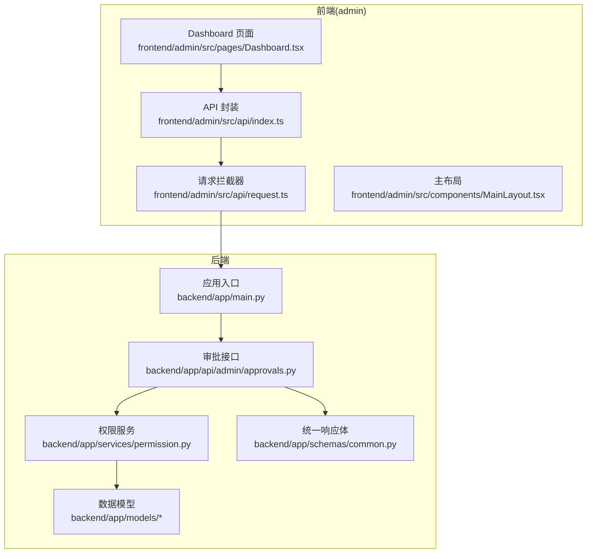
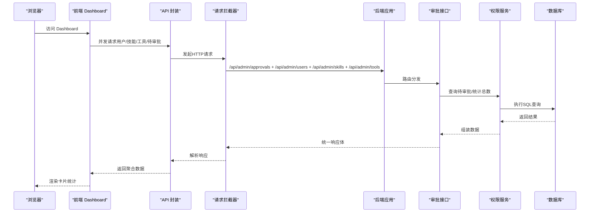
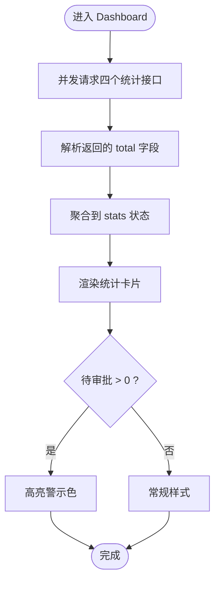
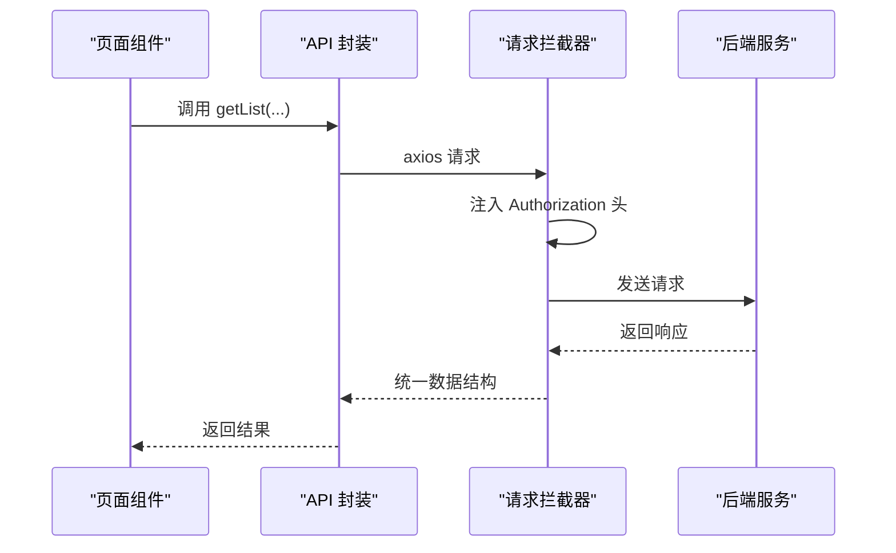
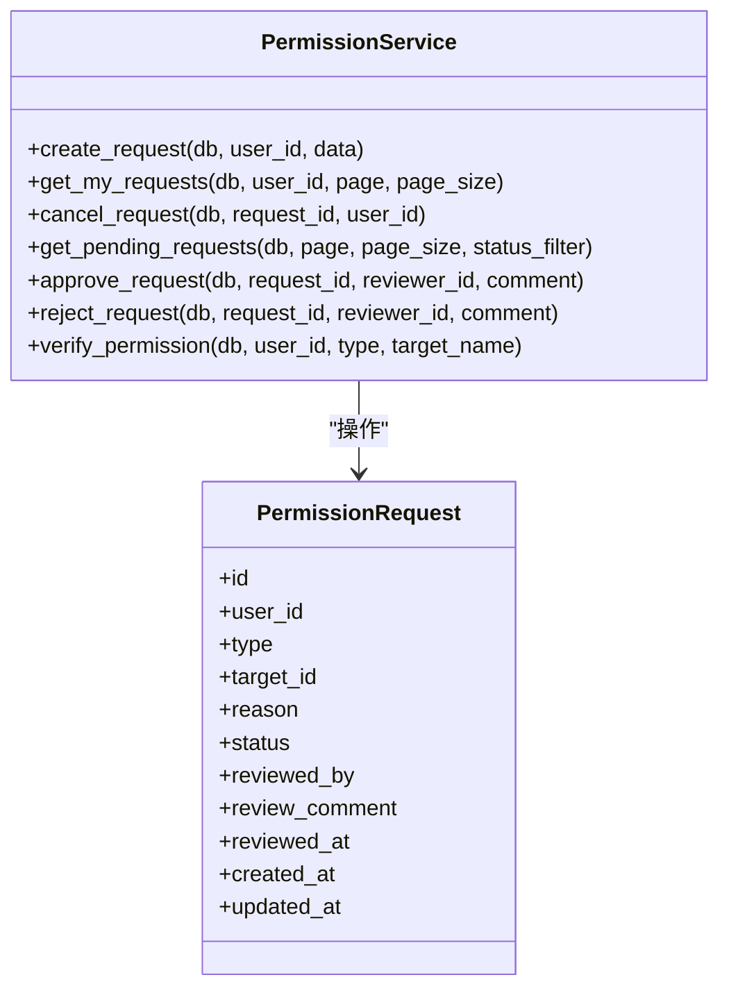
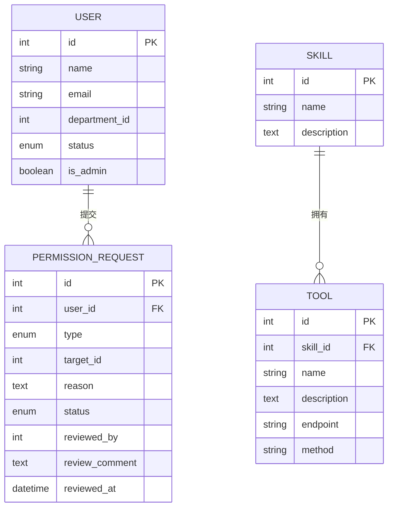
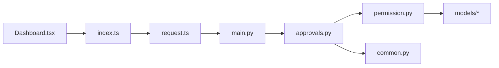

# 管理仪表板

<cite>
**本文引用的文件**
- [Dashboard.tsx](file://frontend/admin/src/pages/Dashboard.tsx)
- [index.ts](file://frontend/admin/src/api/index.ts)
- [request.ts](file://frontend/admin/src/api/request.ts)
- [MainLayout.tsx](file://frontend/admin/src/components/MainLayout.tsx)
- [approvals.py](file://backend/app/api/admin/approvals.py)
- [permission.py](file://backend/app/services/permission.py)
- [common.py](file://backend/app/schemas/common.py)
- [main.py](file://backend/app/main.py)
- [user.py](file://backend/app/models/user.py)
- [permission.py](file://backend/app/models/permission.py)
</cite>

## 目录
1. [简介](#简介)
2. [项目结构](#项目结构)
3. [核心组件](#核心组件)
4. [架构总览](#架构总览)
5. [详细组件分析](#详细组件分析)
6. [依赖分析](#依赖分析)
7. [性能考虑](#性能考虑)
8. [故障排查指南](#故障排查指南)
9. [结论](#结论)
10. [附录](#附录)

## 简介
本文件面向ToolHub管理端仪表板，聚焦Dashboard管理面板的数据展示设计与实现。内容涵盖系统概览、用户统计、权限申请统计、活跃度指标等关键数据的可视化展示；解释卡片式布局、响应式适配与交互效果；梳理数据图表组件选择与配置思路；说明实时数据更新机制、数据刷新策略与缓存管理；提供数据源集成、API调用与错误处理的实现方案；并总结用户体验优化、加载状态与空数据处理的设计原则。

## 项目结构
管理端采用前后端分离架构：
- 前端使用React + Ant Design，路由与页面位于 frontend/admin/src/pages，API封装在 frontend/admin/src/api，通用布局在 frontend/admin/src/components。
- 后端基于FastAPI，管理端接口位于 backend/app/api/admin，业务逻辑在 backend/app/services，数据模型在 backend/app/models，统一响应体在 backend/app/schemas。

**图表来源**
- [Dashboard.tsx:1-51](file://frontend/admin/src/pages/Dashboard.tsx#L1-L51)
- [index.ts:1-60](file://frontend/admin/src/api/index.ts#L1-L60)
- [request.ts:1-28](file://frontend/admin/src/api/request.ts#L1-L28)
- [main.py:1-62](file://backend/app/main.py#L1-L62)
- [approvals.py:1-88](file://backend/app/api/admin/approvals.py#L1-L88)
- [permission.py:1-182](file://backend/app/services/permission.py#L1-L182)
- [common.py:1-29](file://backend/app/schemas/common.py#L1-L29)

**章节来源**
- [Dashboard.tsx:1-51](file://frontend/admin/src/pages/Dashboard.tsx#L1-L51)
- [index.ts:1-60](file://frontend/admin/src/api/index.ts#L1-L60)
- [request.ts:1-28](file://frontend/admin/src/api/request.ts#L1-L28)
- [main.py:1-62](file://backend/app/main.py#L1-L62)

## 核心组件
- 仪表板页面：负责拉取并展示关键统计数据（用户总数、Skills数量、Tools数量、待审批数量），采用卡片式布局与统计组件进行可视化呈现。
- API封装层：集中管理各模块的REST接口，统一参数与返回格式。
- 请求拦截器：自动注入认证令牌，处理未授权重定向。
- 主布局：提供侧边菜单导航与登出流程，承载页面内容区域。

**章节来源**
- [Dashboard.tsx:1-51](file://frontend/admin/src/pages/Dashboard.tsx#L1-L51)
- [index.ts:1-60](file://frontend/admin/src/api/index.ts#L1-L60)
- [request.ts:1-28](file://frontend/admin/src/api/request.ts#L1-L28)
- [MainLayout.tsx:1-68](file://frontend/admin/src/components/MainLayout.tsx#L1-L68)

## 架构总览
下图展示了从浏览器到后端数据库的完整调用链路，以及数据在各层之间的流转。

**图表来源**
- [Dashboard.tsx:9-29](file://frontend/admin/src/pages/Dashboard.tsx#L9-L29)
- [index.ts:44-49](file://frontend/admin/src/api/index.ts#L44-L49)
- [request.ts:3-25](file://frontend/admin/src/api/request.ts#L3-L25)
- [main.py:33-40](file://backend/app/main.py#L33-L40)
- [approvals.py:14-55](file://backend/app/api/admin/approvals.py#L14-L55)
- [permission.py:72-83](file://backend/app/services/permission.py#L72-L83)

## 详细组件分析

### 仪表板页面（Dashboard）
- 数据获取：进入页面时并发发起四个API请求，分别用于获取用户总量、技能总量、工具总量与待审批数量。
- 数据聚合：将各接口返回的total字段汇总到本地状态对象中，用于渲染统计卡片。
- 视觉反馈：当待审批数量大于0时，卡片数值颜色变为警示色以突出风险提示。
- 响应式布局：使用栅格系统实现卡片在不同屏幕尺寸下的自适应排列。

**图表来源**
- [Dashboard.tsx:9-46](file://frontend/admin/src/pages/Dashboard.tsx#L9-L46)

**章节来源**
- [Dashboard.tsx:1-51](file://frontend/admin/src/pages/Dashboard.tsx#L1-L51)

### API封装与请求拦截器
- API封装：将/admin前缀的管理端接口统一导出，便于页面按需调用。
- 请求拦截器：自动从本地存储读取令牌并附加到请求头；对401未授权响应进行登出与跳转处理，提升安全性与可用性。

**图表来源**
- [index.ts:11-49](file://frontend/admin/src/api/index.ts#L11-L49)
- [request.ts:8-25](file://frontend/admin/src/api/request.ts#L8-L25)

**章节来源**
- [index.ts:1-60](file://frontend/admin/src/api/index.ts#L1-L60)
- [request.ts:1-28](file://frontend/admin/src/api/request.ts#L1-L28)

### 后端审批接口与权限服务
- 审批列表接口：支持分页与状态过滤，返回审批条目及总数；同时补充目标资源名称与审批人信息。
- 权限服务：提供创建、取消、审批/拒绝、查询待审批等能力；在审批通过时根据类型为用户授予相应权限（技能或工具）。

**图表来源**
- [permission.py:9-182](file://backend/app/services/permission.py#L9-L182)
- [permission.py:7-28](file://backend/app/models/permission.py#L7-L28)

**章节来源**
- [approvals.py:1-88](file://backend/app/api/admin/approvals.py#L1-L88)
- [permission.py:1-182](file://backend/app/services/permission.py#L1-L182)
- [permission.py:1-28](file://backend/app/models/permission.py#L1-L28)

### 统一响应体与数据模型
- 统一响应体：后端返回固定结构，包含状态码、消息与数据体，便于前端一致化处理。
- 数据模型：用户、角色、技能、工具与权限申请等核心实体，支撑仪表板统计维度。

**图表来源**
- [user.py:23-39](file://backend/app/models/user.py#L23-L39)
- [user.py:65-97](file://backend/app/models/user.py#L65-L97)
- [permission.py:7-28](file://backend/app/models/permission.py#L7-L28)

**章节来源**
- [common.py:1-29](file://backend/app/schemas/common.py#L1-L29)
- [user.py:1-116](file://backend/app/models/user.py#L1-L116)
- [permission.py:1-28](file://backend/app/models/permission.py#L1-L28)

## 依赖分析
- 前端依赖：Dashboard依赖API封装与请求拦截器；API封装依赖axios；后端依赖FastAPI与SQLAlchemy。
- 接口依赖：Dashboard的四个统计接口分别映射到用户、技能、工具与审批模块；审批接口依赖权限服务与数据模型。
- 路由依赖：后端通过include_router注册管理端路由，统一挂载在/api/admin前缀下。

**图表来源**
- [Dashboard.tsx:1-51](file://frontend/admin/src/pages/Dashboard.tsx#L1-L51)
- [index.ts:1-60](file://frontend/admin/src/api/index.ts#L1-L60)
- [request.ts:1-28](file://frontend/admin/src/api/request.ts#L1-L28)
- [main.py:33-40](file://backend/app/main.py#L33-L40)
- [approvals.py:1-88](file://backend/app/api/admin/approvals.py#L1-L88)
- [permission.py:1-182](file://backend/app/services/permission.py#L1-L182)
- [common.py:1-29](file://backend/app/schemas/common.py#L1-L29)

**章节来源**
- [main.py:1-62](file://backend/app/main.py#L1-L62)
- [approvals.py:1-88](file://backend/app/api/admin/approvals.py#L1-L88)

## 性能考虑
- 并发请求：前端对四个统计接口采用并发调用，减少首屏等待时间。
- 分页与总数：后端接口支持分页与返回total，避免一次性传输大量明细数据。
- 缓存建议：可引入浏览器缓存或轻量级内存缓存，针对不频繁变动的统计数据设置TTL；对高频变更的待审批数可采用更短缓存周期。
- 图表组件：若后续扩展为折线图、柱状图、饼图等复杂图表，建议使用虚拟滚动与懒加载，避免大数据集导致的渲染阻塞。
- 网络优化：统一超时与重试策略，结合节流/防抖控制频繁刷新。

## 故障排查指南
- 未授权访问：请求拦截器检测到401时会清除本地令牌并跳转登录页，检查浏览器本地存储中的token是否有效。
- 接口异常：确认后端路由已正确挂载在/api/admin前缀下；检查请求参数（如分页、状态过滤）是否符合后端约束。
- 数据为空：当total为0时，前端显示0；若出现异常，可在控制台查看错误堆栈并定位具体接口。
- 审批状态：审批通过/拒绝会更新状态与审计日志，若状态未变化，检查权限服务的审批逻辑与数据库事务。

**章节来源**
- [request.ts:16-25](file://frontend/admin/src/api/request.ts#L16-L25)
- [main.py:33-40](file://backend/app/main.py#L33-L40)
- [approvals.py:58-87](file://backend/app/api/admin/approvals.py#L58-L87)
- [permission.py:86-144](file://backend/app/services/permission.py#L86-L144)

## 结论
本仪表板以卡片式布局为核心，通过并发请求与统一响应体实现高效的数据展示。后端提供完善的审批与权限服务，支撑管理端关键指标的准确统计。未来可在现有基础上扩展实时更新、图表可视化与缓存策略，进一步提升用户体验与系统性能。

## 附录
- 数据图表组件选型建议
  - 折线图：适用于趋势类指标（如近30天新增用户、审批通过率）。
  - 柱状图：适用于对比类指标（如不同部门的权限申请数量）。
  - 饼图：适用于占比类指标（如技能分布、工具使用占比）。
- 实时更新与刷新策略
  - 轮询：对高频变化指标（如待审批）采用短周期轮询。
  - SSE/WebSocket：对强实时场景（如在线人数）采用长连接推送。
  - 事件驱动：在审批操作完成后主动触发局部刷新。
- 缓存管理
  - LRU/内存缓存：短期热点数据缓存。
  - HTTP缓存：利用ETag/Cache-Control减少重复请求。
  - 本地持久化：对用户偏好与筛选条件进行本地存储。
- 用户体验优化
  - 加载状态：骨架屏或进度指示器，避免白屏。
  - 空数据处理：提供占位图与引导文案。
  - 错误兜底：统一错误提示与重试按钮。
  - 响应式适配：移动端优先，确保在小屏设备上可读性良好。