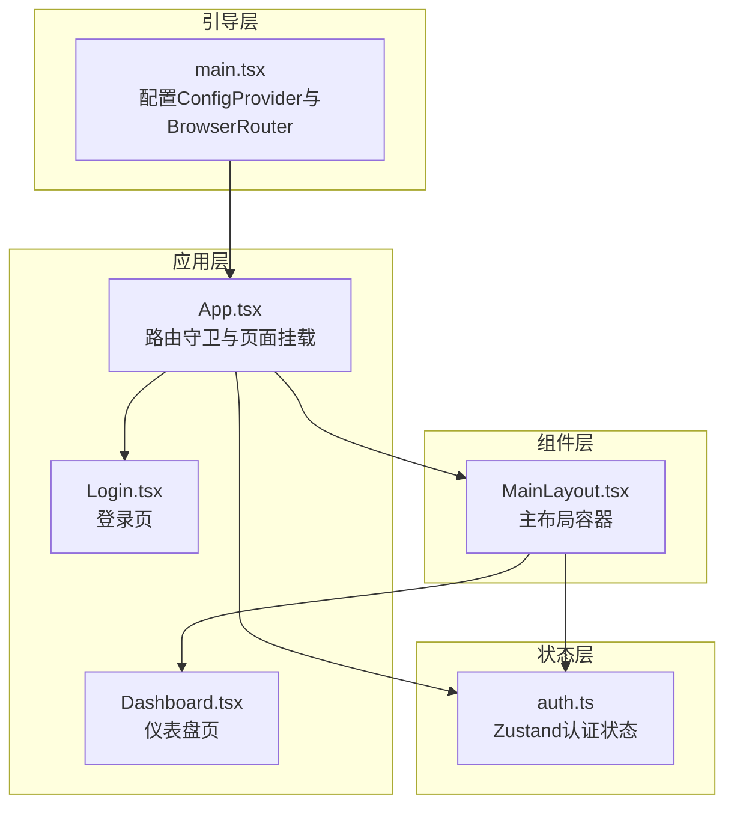
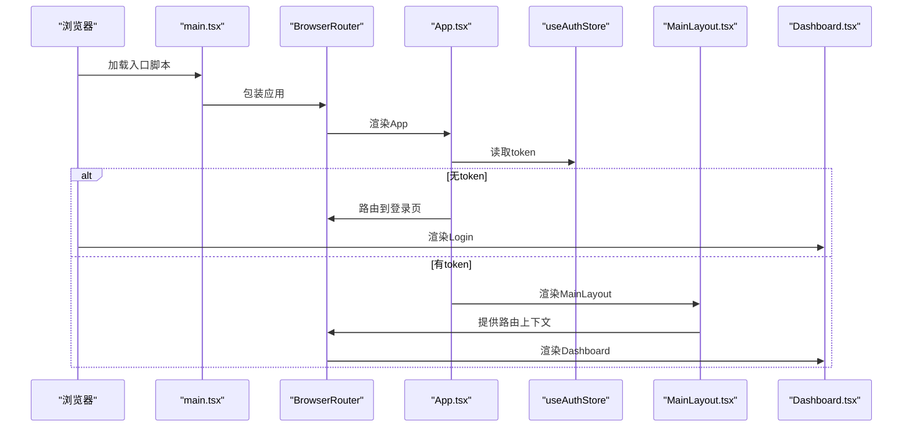
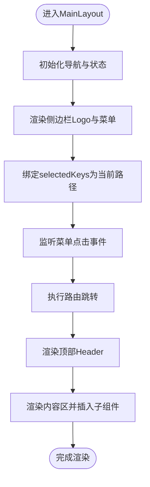
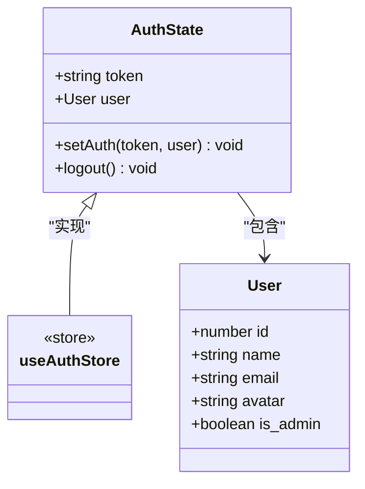
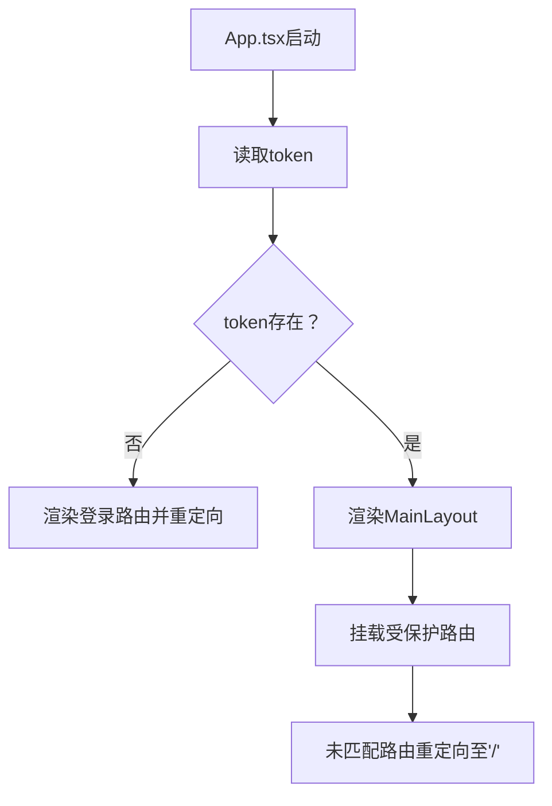
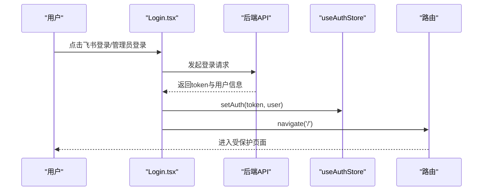
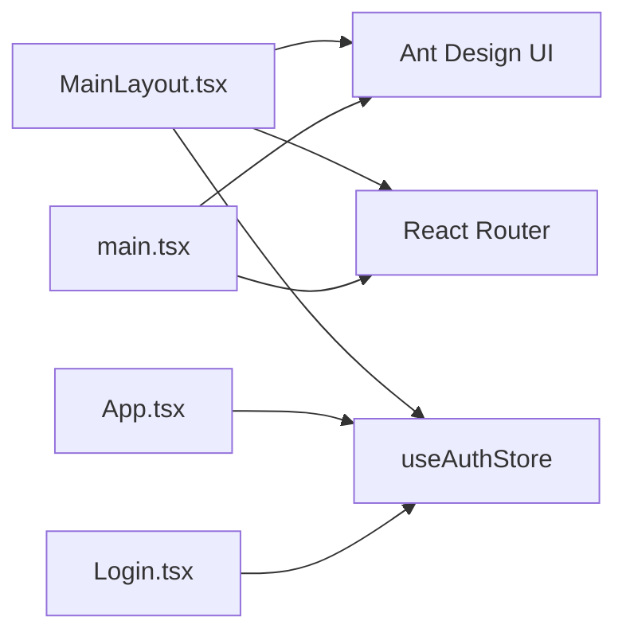

# 管理布局系统

<cite>
**本文档引用的文件**
- [MainLayout.tsx](file://frontend/admin/src/components/MainLayout.tsx)
- [auth.ts](file://frontend/admin/src/store/auth.ts)
- [App.tsx](file://frontend/admin/src/App.tsx)
- [main.tsx](file://frontend/admin/src/main.tsx)
- [Login.tsx](file://frontend/admin/src/pages/Login.tsx)
- [Dashboard.tsx](file://frontend/admin/src/pages/Dashboard.tsx)
- [index.css](file://frontend/admin/src/index.css)
</cite>

## 目录
1. [简介](#简介)
2. [项目结构](#项目结构)
3. [核心组件](#核心组件)
4. [架构总览](#架构总览)
5. [详细组件分析](#详细组件分析)
6. [依赖关系分析](#依赖关系分析)
7. [性能考虑](#性能考虑)
8. [故障排除指南](#故障排除指南)
9. [结论](#结论)
10. [附录](#附录)

## 简介
本文件面向ToolHub管理端的布局系统，重点围绕MainLayout主布局组件进行深入解析，涵盖侧边栏导航菜单、顶部操作栏、内容区域的实现；解释路由守卫机制、用户状态管理与菜单权限动态渲染；提供布局自定义配置、样式主题与国际化支持的实现方案，并总结移动端适配、性能优化与可访问性设计的最佳实践。

## 项目结构
管理端前端采用React + Ant Design + Zustand + React Router架构，布局系统位于admin前端工程中，核心文件组织如下：
- 组件层：MainLayout.tsx为主布局容器，负责整体页面骨架与导航交互
- 状态层：auth.ts使用Zustand管理认证状态（token、用户信息）
- 应用层：App.tsx负责路由守卫与页面挂载
- 引导层：main.tsx配置Ant Design本地化与路由环境
- 页面层：Dashboard等页面作为内容区展示数据
- 样式层：index.css提供基础样式与根节点高度约束

**图表来源**
- [main.tsx:1-18](file://frontend/admin/src/main.tsx#L1-L18)
- [App.tsx:1-44](file://frontend/admin/src/App.tsx#L1-L44)
- [MainLayout.tsx:1-68](file://frontend/admin/src/components/MainLayout.tsx#L1-L68)
- [auth.ts:1-30](file://frontend/admin/src/store/auth.ts#L1-L30)
- [Login.tsx:1-86](file://frontend/admin/src/pages/Login.tsx#L1-L86)
- [Dashboard.tsx:1-51](file://frontend/admin/src/pages/Dashboard.tsx#L1-L51)

**章节来源**
- [main.tsx:1-18](file://frontend/admin/src/main.tsx#L1-L18)
- [App.tsx:1-44](file://frontend/admin/src/App.tsx#L1-L44)
- [MainLayout.tsx:1-68](file://frontend/admin/src/components/MainLayout.tsx#L1-L68)
- [auth.ts:1-30](file://frontend/admin/src/store/auth.ts#L1-L30)
- [Login.tsx:1-86](file://frontend/admin/src/pages/Login.tsx#L1-L86)
- [Dashboard.tsx:1-51](file://frontend/admin/src/pages/Dashboard.tsx#L1-L51)
- [index.css:1-10](file://frontend/admin/src/index.css#L1-L10)

## 核心组件
- 主布局组件MainLayout：提供侧边栏、顶部操作栏与内容区，内置登出逻辑与面包屑占位
- 认证状态管理useAuthStore：提供token与用户信息的持久化存储与登出清理
- 应用入口App：基于token进行路由守卫，未登录时仅允许访问登录页
- 引导入口main：配置Ant Design中文本地化与路由环境
- 登录页Login：支持飞书回调登录与开发模式管理员登录
- 仪表盘Dashboard：作为内容区示例，展示统计信息

**章节来源**
- [MainLayout.tsx:29-68](file://frontend/admin/src/components/MainLayout.tsx#L29-L68)
- [auth.ts:11-30](file://frontend/admin/src/store/auth.ts#L11-L30)
- [App.tsx:14-41](file://frontend/admin/src/App.tsx#L14-L41)
- [main.tsx:9-17](file://frontend/admin/src/main.tsx#L9-L17)
- [Login.tsx:8-54](file://frontend/admin/src/pages/Login.tsx#L8-L54)
- [Dashboard.tsx:6-29](file://frontend/admin/src/pages/Dashboard.tsx#L6-L29)

## 架构总览
下图展示了从应用启动到页面渲染的整体流程，以及布局组件与状态管理、路由守卫的关系：

**图表来源**
- [main.tsx:9-17](file://frontend/admin/src/main.tsx#L9-L17)
- [App.tsx:14-41](file://frontend/admin/src/App.tsx#L14-L41)
- [auth.ts:18-29](file://frontend/admin/src/store/auth.ts#L18-L29)
- [MainLayout.tsx:33-68](file://frontend/admin/src/components/MainLayout.tsx#L33-L68)
- [Dashboard.tsx:6-29](file://frontend/admin/src/pages/Dashboard.tsx#L6-L29)

## 详细组件分析

### MainLayout主布局组件
- 结构组成
  - 侧边栏Sider：包含Logo与菜单项列表，支持暗色主题与内嵌模式
  - 顶部Header：右侧放置登出图标按钮
  - 内容区Content：承载子路由页面，具备圆角背景与溢出滚动
- 导航与交互
  - 使用Ant Design Menu组件渲染固定菜单项集合
  - 通过selectedKeys绑定当前路径，点击菜单项触发路由跳转
  - 登出按钮调用认证状态的logout方法并重定向至登录页
- 响应式与样式
  - 侧边栏宽度固定为200px，内容区通过外边距与内边距形成留白
  - 根节点#root高度限制为100vh，确保布局占满视口

**图表来源**
- [MainLayout.tsx:33-68](file://frontend/admin/src/components/MainLayout.tsx#L33-L68)

**章节来源**
- [MainLayout.tsx:18-27](file://frontend/admin/src/components/MainLayout.tsx#L18-L27)
- [MainLayout.tsx:33-68](file://frontend/admin/src/components/MainLayout.tsx#L33-L68)
- [index.css:7-9](file://frontend/admin/src/index.css#L7-L9)

### 认证状态管理useAuthStore
- 数据模型
  - token：字符串或空，用于标识登录态
  - user：用户对象，包含id、name、email、avatar、is_admin等字段
- 方法接口
  - setAuth：设置token与用户信息，并持久化到localStorage
  - logout：移除localStorage中的token并清空状态
- 与布局集成
  - MainLayout在顶部Header中调用logout进行登出
  - App根据token决定是否渲染MainLayout与受保护页面

**图表来源**
- [auth.ts:11-29](file://frontend/admin/src/store/auth.ts#L11-L29)

**章节来源**
- [auth.ts:3-9](file://frontend/admin/src/store/auth.ts#L3-L9)
- [auth.ts:18-29](file://frontend/admin/src/store/auth.ts#L18-L29)

### 路由守卫与页面挂载
- 守卫逻辑
  - App读取useAuthStore中的token
  - 若无token，仅允许访问登录页，其他路径重定向至登录
  - 若有token，渲染MainLayout并在其内部挂载受保护路由
- 页面路由
  - 受保护路由包括Dashboard、Users、Roles、Skills、Tools、Approvals、Departments、AuditLogs
  - 未匹配路由重定向至Dashboard

**图表来源**
- [App.tsx:14-41](file://frontend/admin/src/App.tsx#L14-L41)

**章节来源**
- [App.tsx:14-41](file://frontend/admin/src/App.tsx#L14-L41)

### 登录流程与回调
- 飞书登录
  - 触发获取飞书登录URL的API请求，成功后跳转至飞书授权页
  - 回调页携带code参数，Login组件检测URL参数并调用回调接口换取token
- 开发模式登录
  - 表单提交用户名，调用开发登录接口，成功后写入token并跳转至首页
- 成功后的状态更新
  - 通过useAuthStore.setAuth写入token与用户信息，随后自动进入受保护路由

**图表来源**
- [Login.tsx:12-54](file://frontend/admin/src/pages/Login.tsx#L12-L54)
- [auth.ts:21-24](file://frontend/admin/src/store/auth.ts#L21-L24)

**章节来源**
- [Login.tsx:12-54](file://frontend/admin/src/pages/Login.tsx#L12-L54)
- [auth.ts:18-29](file://frontend/admin/src/store/auth.ts#L18-L29)

### 内容区示例Dashboard
- 功能概述
  - 并发请求用户、技能、工具与待审批统计，汇总到状态并渲染卡片
  - 待审批数量大于0时，数值颜色变为警示色
- 性能建议
  - 当前使用Promise.all并发请求，已具备基础性能优化
  - 可结合缓存策略与分页加载进一步优化大数据量场景

**章节来源**
- [Dashboard.tsx:6-29](file://frontend/admin/src/pages/Dashboard.tsx#L6-L29)

## 依赖关系分析
- 组件耦合
  - MainLayout依赖Ant Design的Layout、Menu组件与路由hooks
  - App依赖useAuthStore进行路由守卫
  - Login依赖authApi与useAuthStore
- 外部依赖
  - Ant Design提供UI组件与本地化配置
  - React Router提供路由能力
  - Zustand提供轻量级状态管理

**图表来源**
- [MainLayout.tsx:1-16](file://frontend/admin/src/components/MainLayout.tsx#L1-L16)
- [App.tsx:12-12](file://frontend/admin/src/App.tsx#L12-L12)
- [Login.tsx:3-4](file://frontend/admin/src/pages/Login.tsx#L3-L4)
- [main.tsx:4-5](file://frontend/admin/src/main.tsx#L4-L5)

**章节来源**
- [MainLayout.tsx:1-16](file://frontend/admin/src/components/MainLayout.tsx#L1-L16)
- [App.tsx:12-12](file://frontend/admin/src/App.tsx#L12-L12)
- [Login.tsx:3-4](file://frontend/admin/src/pages/Login.tsx#L3-L4)
- [main.tsx:4-5](file://frontend/admin/src/main.tsx#L4-L5)

## 性能考虑
- 并发请求优化：Dashboard使用并发请求聚合统计数据，减少等待时间
- 状态持久化：认证状态通过localStorage持久化，避免刷新丢失
- 路由守卫：在应用入口进行token校验，减少无效渲染
- 样式与布局：固定侧边栏宽度与根节点高度约束，降低重排成本

[本节为通用性能建议，不直接分析具体文件]

## 故障排除指南
- 登录后无法进入受保护页面
  - 检查useAuthStore是否正确写入token与用户信息
  - 确认App.tsx的token读取逻辑与路由守卫条件
- 飞书回调未生效
  - 确认Login.tsx中URL参数code的提取与回调接口调用
  - 检查后端回调接口返回的token与用户信息格式
- 侧边栏菜单点击无反应
  - 检查MainLayout中菜单items与onClick事件绑定
  - 确认selectedKeys与当前路径一致

**章节来源**
- [auth.ts:18-29](file://frontend/admin/src/store/auth.ts#L18-L29)
- [App.tsx:14-41](file://frontend/admin/src/App.tsx#L14-L41)
- [Login.tsx:40-54](file://frontend/admin/src/pages/Login.tsx#L40-L54)
- [MainLayout.tsx:49-55](file://frontend/admin/src/components/MainLayout.tsx#L49-L55)

## 结论
本布局系统以MainLayout为核心，结合Zustand状态管理与React Router路由守卫，实现了简洁高效的管理端页面骨架。当前版本提供了完整的侧边栏导航、顶部操作栏与内容区布局，并通过登录页与认证状态完成基本的权限控制。后续可在菜单权限动态渲染、主题切换、国际化扩展、移动端适配与可访问性方面继续增强。

[本节为总结性内容，不直接分析具体文件]

## 附录

### 布局自定义配置与主题
- Ant Design主题与本地化
  - 在main.tsx中通过ConfigProvider配置locale为中文，满足界面本地化需求
  - 可通过ConfigProvider的theme属性扩展主题变量，实现品牌色统一
- 布局样式定制
  - 通过index.css调整全局字体与根节点高度
  - MainLayout内部样式可按需扩展，如侧边栏宽度、头部内边距等

**章节来源**
- [main.tsx:11-11](file://frontend/admin/src/main.tsx#L11-L11)
- [index.css:1-10](file://frontend/admin/src/index.css#L1-L10)
- [MainLayout.tsx:44-68](file://frontend/admin/src/components/MainLayout.tsx#L44-L68)

### 国际化支持
- 语言包配置
  - 通过ConfigProvider locale={zhCN}启用中文本地化
  - 如需多语言，可在ConfigProvider中动态切换locale并配合i18n库

**章节来源**
- [main.tsx:5-5](file://frontend/admin/src/main.tsx#L5-L5)

### 移动端适配与可访问性
- 移动端适配
  - 建议在MainLayout中增加响应式断点，当屏幕宽度小于阈值时折叠侧边栏或切换为顶部导航
  - 内容区增加最小宽度与滚动优化，保证小屏体验
- 可访问性
  - 为菜单与按钮添加aria-label与键盘导航支持
  - 确保颜色对比度满足WCAG标准，保障视觉障碍用户的使用体验

[本节为通用最佳实践，不直接分析具体文件]