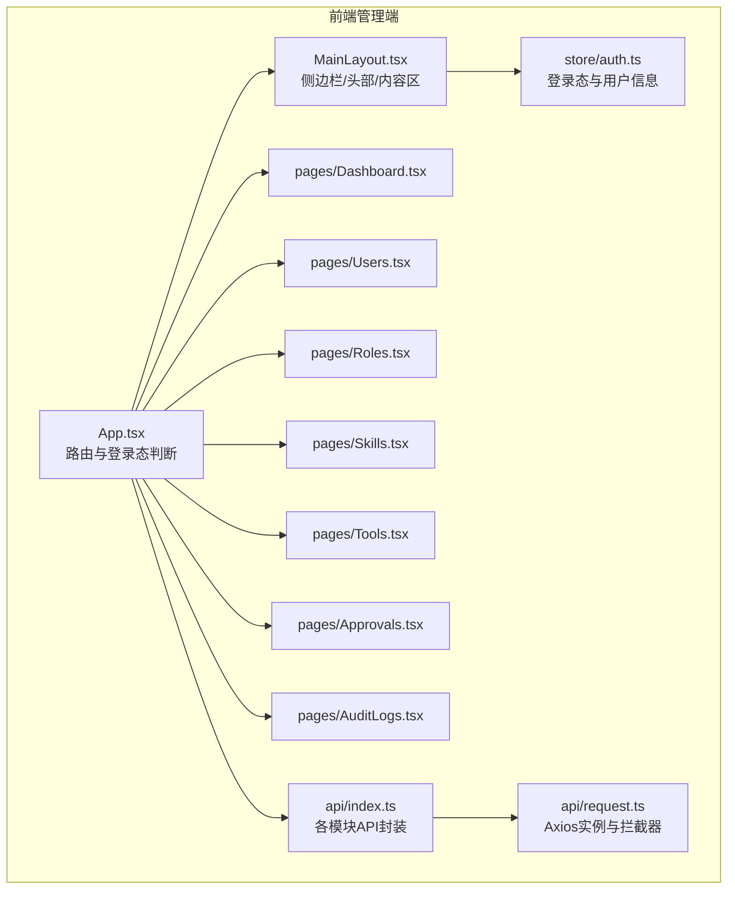
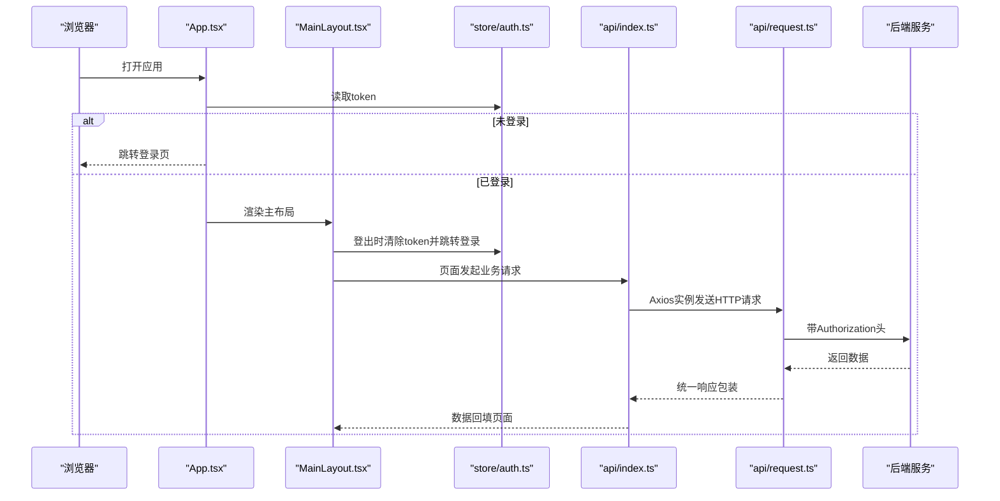
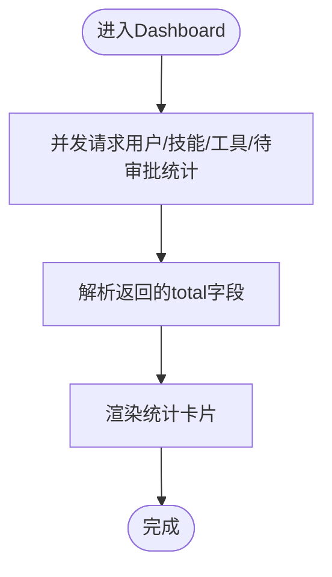
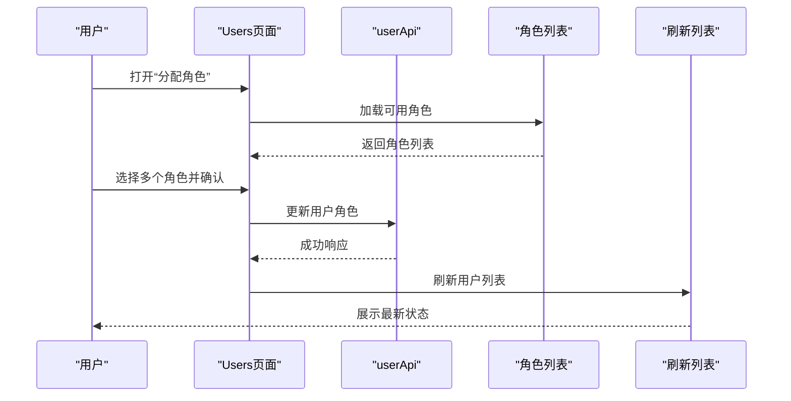
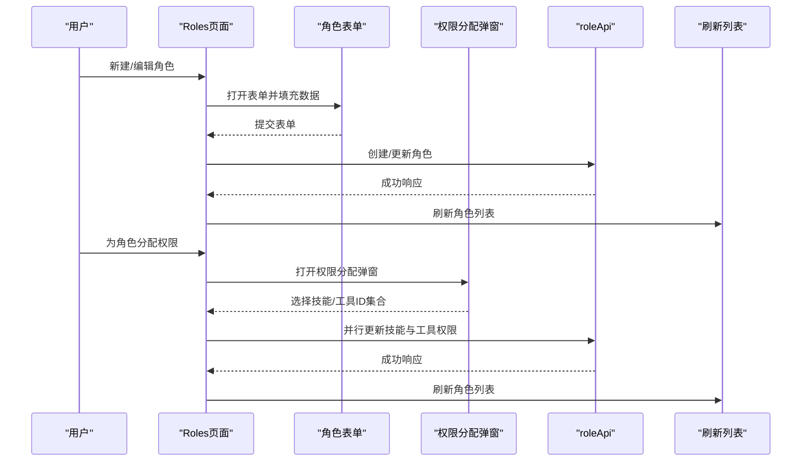
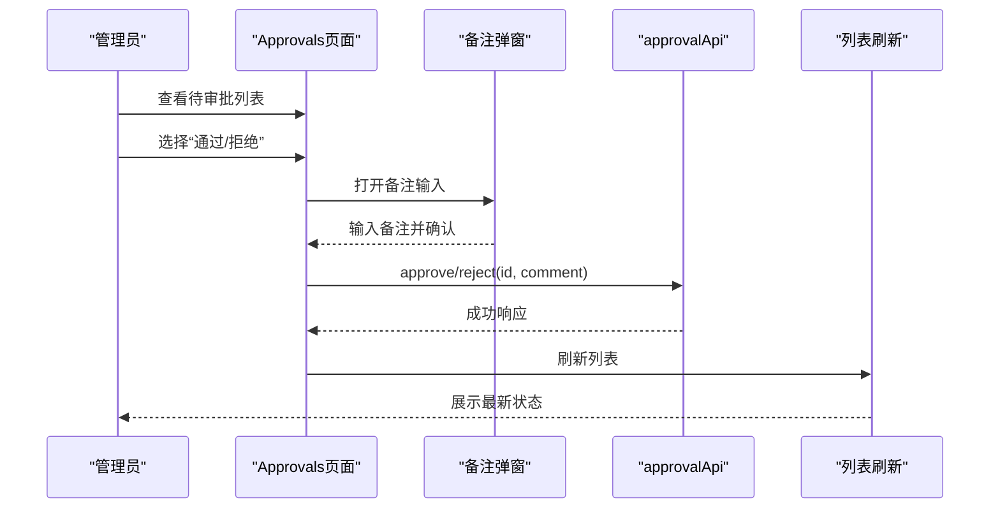
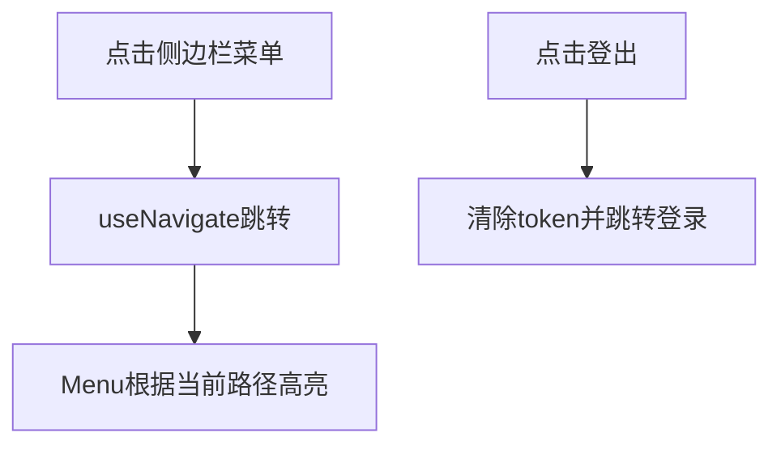
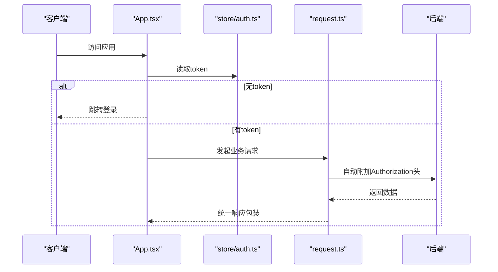
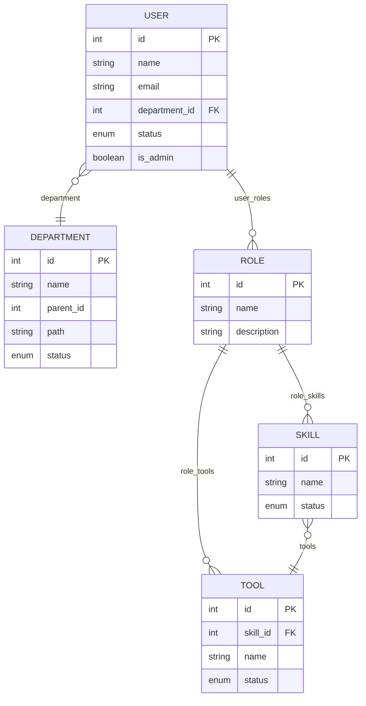

# 管理端应用

<cite>
**本文引用的文件**
- [App.tsx](file://frontend/admin/src/App.tsx)
- [MainLayout.tsx](file://frontend/admin/src/components/MainLayout.tsx)
- [auth.ts](file://frontend/admin/src/store/auth.ts)
- [Dashboard.tsx](file://frontend/admin/src/pages/Dashboard.tsx)
- [Users.tsx](file://frontend/admin/src/pages/Users.tsx)
- [Roles.tsx](file://frontend/admin/src/pages/Roles.tsx)
- [Skills.tsx](file://frontend/admin/src/pages/Skills.tsx)
- [Tools.tsx](file://frontend/admin/src/pages/Tools.tsx)
- [Approvals.tsx](file://frontend/admin/src/pages/Approvals.tsx)
- [AuditLogs.tsx](file://frontend/admin/src/pages/AuditLogs.tsx)
- [index.ts](file://frontend/admin/src/api/index.ts)
- [request.ts](file://frontend/admin/src/api/request.ts)
- [user.py](file://backend/app/models/user.py)
- [role.py](file://backend/app/schemas/role.py)
- [skill.py](file://backend/app/schemas/skill.py)
</cite>

## 目录
1. [简介](#简介)
2. [项目结构](#项目结构)
3. [核心组件](#核心组件)
4. [架构总览](#架构总览)
5. [详细组件分析](#详细组件分析)
6. [依赖分析](#依赖分析)
7. [性能考虑](#性能考虑)
8. [故障排查指南](#故障排查指南)
9. [结论](#结论)
10. [附录](#附录)

## 简介
本文件为ToolHub管理端应用的功能文档，面向管理员用户，覆盖管理界面布局、权限控制与批量操作能力。文档详细说明Dashboard管理面板、Users用户管理、Roles角色管理、Skills技能管理、Tools工具管理、Approvals审批管理、AuditLogs审计日志等页面的实现方式；解释MainLayout主布局组件的管理功能设计、侧边栏导航、面包屑导航、权限控制机制；阐述审批流程的前端实现（待审批列表、审批操作、状态更新）；说明用户管理的CRUD操作、角色分配与权限配置；并提供管理界面的开发规范、数据表格设计、表单验证、批量操作实现建议，以及管理效率优化、数据可视化、操作审计的设计原则。

## 项目结构
管理端采用React + Ant Design + Zustand + Axios构建，路由在应用层集中配置，页面组件按功能模块划分，API封装统一请求与拦截器，状态管理集中在Zustand store中。

图表来源
- [App.tsx:1-44](file://frontend/admin/src/App.tsx#L1-L44)
- [MainLayout.tsx:1-68](file://frontend/admin/src/components/MainLayout.tsx#L1-L68)
- [auth.ts:1-30](file://frontend/admin/src/store/auth.ts#L1-L30)
- [index.ts:1-59](file://frontend/admin/src/api/index.ts#L1-L59)
- [request.ts:1-28](file://frontend/admin/src/api/request.ts#L1-L28)
- [Dashboard.tsx:1-51](file://frontend/admin/src/pages/Dashboard.tsx#L1-L51)
- [Users.tsx:1-95](file://frontend/admin/src/pages/Users.tsx#L1-L95)
- [Roles.tsx:1-121](file://frontend/admin/src/pages/Roles.tsx#L1-L121)
- [Skills.tsx:1-77](file://frontend/admin/src/pages/Skills.tsx#L1-L77)
- [Tools.tsx:1-91](file://frontend/admin/src/pages/Tools.tsx#L1-L91)
- [Approvals.tsx:1-77](file://frontend/admin/src/pages/Approvals.tsx#L1-L77)
- [AuditLogs.tsx:1-53](file://frontend/admin/src/pages/AuditLogs.tsx#L1-L53)

章节来源
- [App.tsx:1-44](file://frontend/admin/src/App.tsx#L1-L44)
- [MainLayout.tsx:1-68](file://frontend/admin/src/components/MainLayout.tsx#L1-L68)
- [auth.ts:1-30](file://frontend/admin/src/store/auth.ts#L1-L30)
- [index.ts:1-59](file://frontend/admin/src/api/index.ts#L1-L59)
- [request.ts:1-28](file://frontend/admin/src/api/request.ts#L1-L28)

## 核心组件
- 应用入口与路由：根据登录态决定渲染登录页或主布局+功能页；默认跳转到Dashboard。
- 主布局组件：左侧Sider菜单（含图标与文案），顶部Header含登出按钮，中间Content承载子页面。
- 认证状态：使用Zustand存储token与用户信息，支持本地持久化与登出清理。
- API封装：统一Axios实例，自动注入Authorization头，处理401重定向至登录。

章节来源
- [App.tsx:14-41](file://frontend/admin/src/App.tsx#L14-L41)
- [MainLayout.tsx:18-27](file://frontend/admin/src/components/MainLayout.tsx#L18-L27)
- [MainLayout.tsx:33-67](file://frontend/admin/src/components/MainLayout.tsx#L33-L67)
- [auth.ts:18-29](file://frontend/admin/src/store/auth.ts#L18-L29)
- [request.ts:8-25](file://frontend/admin/src/api/request.ts#L8-L25)

## 架构总览
管理端采用“路由驱动页面”的前端架构，页面组件通过API层访问后端REST接口，认证态贯穿全局。下图展示从浏览器到后端的关键交互路径与职责边界。

图表来源
- [App.tsx:14-41](file://frontend/admin/src/App.tsx#L14-L41)
- [MainLayout.tsx:33-67](file://frontend/admin/src/components/MainLayout.tsx#L33-L67)
- [auth.ts:18-29](file://frontend/admin/src/store/auth.ts#L18-L29)
- [index.ts:10-58](file://frontend/admin/src/api/index.ts#L10-L58)
- [request.ts:3-25](file://frontend/admin/src/api/request.ts#L3-L25)

## 详细组件分析

### Dashboard管理面板
- 功能概述：加载用户、技能、工具总量与待审批数量，以卡片统计形式展示。
- 实现要点：并发请求四个接口，聚合结果到状态；使用Ant Design Statistic组件展示数值与图标。
- 性能建议：统计类接口应支持分页参数为1，避免全量扫描；必要时引入缓存策略。

图表来源
- [Dashboard.tsx:9-29](file://frontend/admin/src/pages/Dashboard.tsx#L9-L29)

章节来源
- [Dashboard.tsx:1-51](file://frontend/admin/src/pages/Dashboard.tsx#L1-L51)

### Users用户管理
- 功能概述：分页展示用户列表，支持关键词搜索；提供“分配角色”“启用/禁用”等操作。
- 表格列：ID、姓名、邮箱、部门、角色标签、状态标签、是否管理员、操作按钮。
- 操作流程：
  - 分配角色：打开模态框，多选角色，提交后刷新列表。
  - 启用/禁用：切换状态，提交后刷新列表。
- 开发规范：
  - 列渲染使用Ant Design Tag与Space组件，保持一致视觉风格。
  - 分页参数page/page_size固定，关键词为空时传undefined避免无效查询。
  - 提交前进行必要的空值检查与提示。

图表来源
- [Users.tsx:15-35](file://frontend/admin/src/pages/Users.tsx#L15-L35)
- [Users.tsx:44-72](file://frontend/admin/src/pages/Users.tsx#L44-L72)

章节来源
- [Users.tsx:1-95](file://frontend/admin/src/pages/Users.tsx#L1-L95)

### Roles角色管理
- 功能概述：CRUD角色，分配技能与工具权限；支持查看关联用户数。
- 表单验证：角色名称必填；编辑时保留原值。
- 权限分配：弹窗内勾选技能与工具，提交后并行更新技能与工具权限。
- 开发规范：
  - 使用Form组件进行字段校验与重置。
  - 权限分配采用并行请求，提升用户体验。
  - 删除角色后需刷新列表并提示成功。

图表来源
- [Roles.tsx:32-44](file://frontend/admin/src/pages/Roles.tsx#L32-L44)
- [Roles.tsx:52-61](file://frontend/admin/src/pages/Roles.tsx#L52-L61)

章节来源
- [Roles.tsx:1-121](file://frontend/admin/src/pages/Roles.tsx#L1-L121)

### Skills技能管理
- 功能概述：分页展示技能，支持创建/更新/删除；显示工具数量与状态。
- 表单验证：名称必填；描述可选。
- 开发规范：
  - 使用ellipsis控制长文本展示。
  - 删除后刷新列表并提示成功。

章节来源
- [Skills.tsx:1-77](file://frontend/admin/src/pages/Skills.tsx#L1-L77)

### Tools工具管理
- 功能概述：分页展示工具，支持创建/更新/删除；可选择所属技能；设置端点与HTTP方法。
- 表单验证：名称必填；端点可选；方法为GET/POST枚举。
- 开发规范：
  - 技能列表一次性加载上限，避免过多请求。
  - 删除后刷新列表并提示成功。

章节来源
- [Tools.tsx:1-91](file://frontend/admin/src/pages/Tools.tsx#L1-L91)

### Approvals审批管理
- 功能概述：展示权限申请审批列表，支持按状态筛选；对“待审批”项执行“通过/拒绝”，可填写审批备注。
- 状态映射：pending/approved/rejected/cancelled分别对应不同颜色与中文标签。
- 审批流程：
  - 用户点击“通过/拒绝”，弹出备注输入框。
  - 提交后调用审批接口，成功后关闭弹窗并刷新列表。

图表来源
- [Approvals.tsx:14-35](file://frontend/admin/src/pages/Approvals.tsx#L14-L35)
- [Approvals.tsx:40-61](file://frontend/admin/src/pages/Approvals.tsx#L40-L61)

章节来源
- [Approvals.tsx:1-77](file://frontend/admin/src/pages/Approvals.tsx#L1-L77)

### AuditLogs审计日志
- 功能概述：分页展示审计日志，支持按操作类型与目标类型筛选；展示用户ID、目标类型/ID、详情、IP、时间等。
- 开发规范：
  - 使用Tag对操作类型进行颜色区分。
  - 详情字段以JSON字符串展示，便于快速定位问题。

章节来源
- [AuditLogs.tsx:1-53](file://frontend/admin/src/pages/AuditLogs.tsx#L1-L53)

### MainLayout主布局组件
- 侧边栏导航：基于菜单项数组渲染，当前路由高亮；点击菜单项跳转对应页面。
- 头部区域：右侧提供登出图标，点击后清空token并跳转登录页。
- 内容区域：承载子页面，具备内边距与圆角背景，溢出滚动。

图表来源
- [MainLayout.tsx:18-27](file://frontend/admin/src/components/MainLayout.tsx#L18-L27)
- [MainLayout.tsx:38-41](file://frontend/admin/src/components/MainLayout.tsx#L38-L41)

章节来源
- [MainLayout.tsx:1-68](file://frontend/admin/src/components/MainLayout.tsx#L1-L68)

### 权限控制机制
- 登录态控制：App根据token是否存在决定渲染登录页或主布局。
- 请求拦截：统一在请求拦截器中注入Authorization头；401时清理token并跳转登录。
- 用户模型：后端模型包含is_admin字段，用于标识管理员身份（前端store中也包含该标记）。

图表来源
- [App.tsx:17-24](file://frontend/admin/src/App.tsx#L17-L24)
- [request.ts:8-14](file://frontend/admin/src/api/request.ts#L8-L14)
- [auth.ts:18-29](file://frontend/admin/src/store/auth.ts#L18-L29)
- [user.py:33](file://backend/app/models/user.py#L33)

章节来源
- [App.tsx:1-44](file://frontend/admin/src/App.tsx#L1-L44)
- [request.ts:1-28](file://frontend/admin/src/api/request.ts#L1-L28)
- [auth.ts:1-30](file://frontend/admin/src/store/auth.ts#L1-L30)
- [user.py:23-40](file://backend/app/models/user.py#L23-L40)

## 依赖分析
- 前端依赖关系：
  - App路由依赖MainLayout与各页面组件。
  - 页面组件依赖API封装与Zustand store。
  - API封装依赖Axios实例与拦截器。
- 后端实体关系（简化）：
  - User与Department多对一；User与Role多对多（通过user_roles关联表）。
  - Role与Skill、Role与Tool多对多（通过role_skills与role_tools关联表）。
  - Skill与Tool一对多。

图表来源
- [user.py:7-21](file://backend/app/models/user.py#L7-L21)
- [user.py:23-40](file://backend/app/models/user.py#L23-L40)
- [user.py:42-53](file://backend/app/models/user.py#L42-L53)
- [user.py:65-79](file://backend/app/models/user.py#L65-L79)
- [user.py:81-97](file://backend/app/models/user.py#L81-L97)

章节来源
- [user.py:1-116](file://backend/app/models/user.py#L1-L116)
- [role.py:20-27](file://backend/app/schemas/role.py#L20-L27)
- [skill.py:23-31](file://backend/app/schemas/skill.py#L23-L31)

## 性能考虑
- 并发请求：Dashboard与Roles权限分配均采用Promise.all并发，减少等待时间。
- 分页与搜索：Users、Skills、Tools、Approvals、AuditLogs均支持分页与筛选，避免一次性加载大量数据。
- 缓存策略：建议对静态资源（如技能/工具列表）增加内存缓存，降低重复请求。
- 图标与标签：统一使用Ant Design图标与标签组件，减少自定义样式带来的渲染开销。
- 网络错误处理：401自动跳转登录，避免无效重试造成资源浪费。

章节来源
- [Dashboard.tsx:12-17](file://frontend/admin/src/pages/Dashboard.tsx#L12-L17)
- [Roles.tsx:21-28](file://frontend/admin/src/pages/Roles.tsx#L21-L28)
- [request.ts:16-25](file://frontend/admin/src/api/request.ts#L16-L25)

## 故障排查指南
- 登录态异常：
  - 现象：访问页面后被重定向到登录页。
  - 排查：检查本地localStorage中的token是否存在；确认请求拦截器是否正确注入Authorization头。
- 权限不足：
  - 现象：部分页面或操作无响应或报错。
  - 排查：确认用户是否为管理员（is_admin）；核对角色权限是否包含所需技能/工具。
- 审批状态不更新：
  - 现象：审批通过/拒绝后列表状态未变化。
  - 排查：确认审批接口调用成功且返回状态码；检查分页参数与筛选条件是否导致误判。
- 表单提交失败：
  - 现象：新建/编辑失败或无提示。
  - 排查：检查Form字段校验规则；确认后端返回的错误信息并提示用户。

章节来源
- [request.ts:16-25](file://frontend/admin/src/api/request.ts#L16-L25)
- [auth.ts:18-29](file://frontend/admin/src/store/auth.ts#L18-L29)
- [Approvals.tsx:22-35](file://frontend/admin/src/pages/Approvals.tsx#L22-L35)

## 结论
管理端应用围绕“统一布局、清晰导航、强权限控制、高效审批与可观测审计”展开设计。前端通过路由与状态管理实现简洁的登录态控制，页面组件聚焦各自业务域的CRUD与权限配置；后端模型清晰表达用户、角色、技能、工具之间的多对多关系，支撑完整的权限体系。建议在后续迭代中进一步完善批量操作、导出报表、实时通知与更细粒度的操作审计。

## 附录
- 开发规范摘要：
  - 表格设计：固定列宽、标签渲染、分页参数标准化。
  - 表单验证：必填字段明确、错误提示友好、提交前校验。
  - 批量操作：提供全选/反选、批量状态切换、批量删除等能力（建议扩展）。
  - 数据可视化：Dashboard持续扩展指标维度，结合趋势图与热力图提升洞察。
  - 操作审计：细化审计日志字段，支持按用户、目标、时间范围的组合筛选。