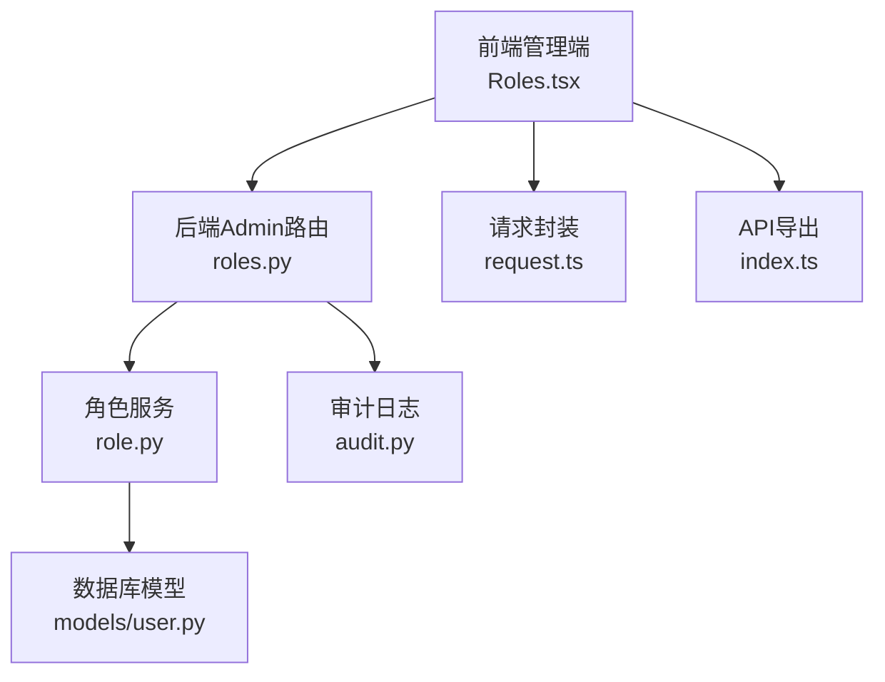
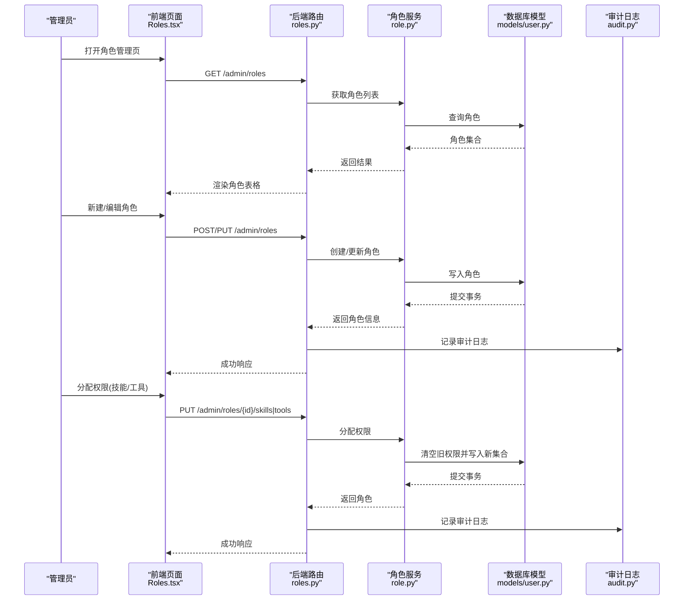
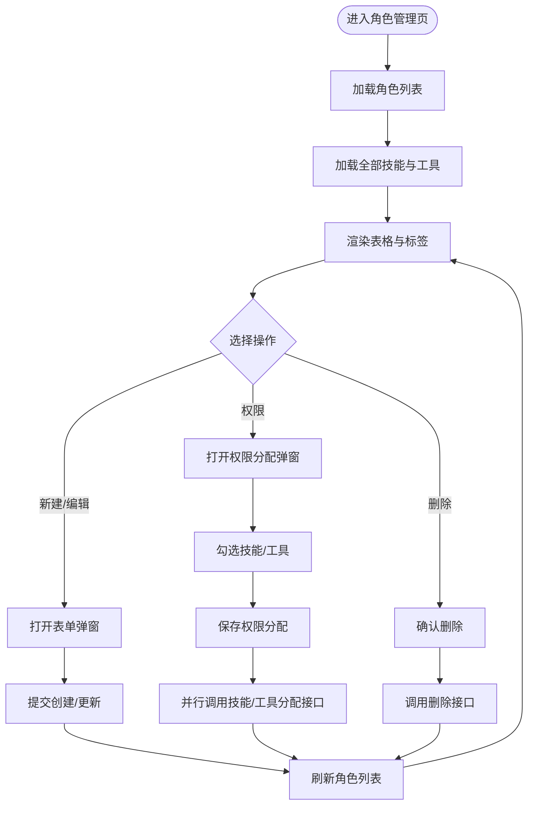
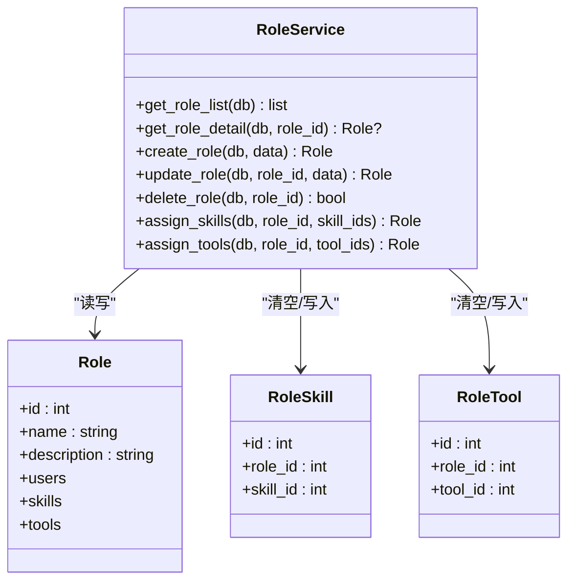
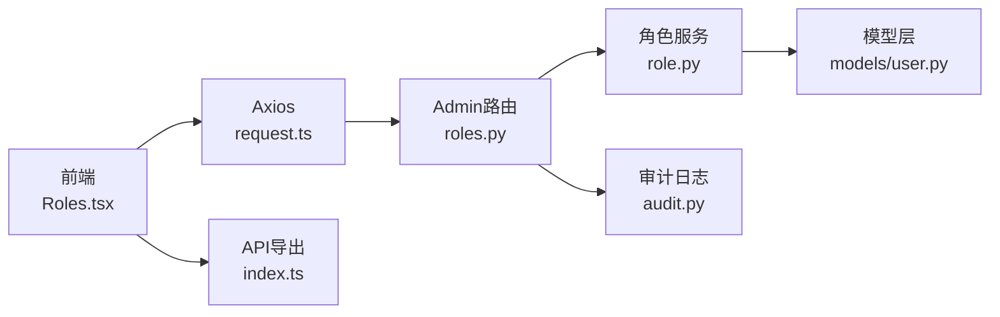

# 角色管理

<cite>
**本文引用的文件**
- [backend/app/api/admin/roles.py](file://backend/app/api/admin/roles.py)
- [backend/app/schemas/role.py](file://backend/app/schemas/role.py)
- [backend/app/services/role.py](file://backend/app/services/role.py)
- [backend/app/models/user.py](file://backend/app/models/user.py)
- [backend/app/models/permission.py](file://backend/app/models/permission.py)
- [backend/app/api/admin/users.py](file://backend/app/api/admin/users.py)
- [backend/app/schemas/user.py](file://backend/app/schemas/user.py)
- [backend/app/api/admin/audit.py](file://backend/app/api/admin/audit.py)
- [frontend/admin/src/pages/Roles.tsx](file://frontend/admin/src/pages/Roles.tsx)
- [frontend/admin/src/api/index.ts](file://frontend/admin/src/api/index.ts)
- [frontend/admin/src/api/request.ts](file://frontend/admin/src/api/request.ts)
</cite>

## 目录
1. [简介](#简介)
2. [项目结构](#项目结构)
3. [核心组件](#核心组件)
4. [架构总览](#架构总览)
5. [详细组件分析](#详细组件分析)
6. [依赖分析](#依赖分析)
7. [性能考量](#性能考量)
8. [故障排查指南](#故障排查指南)
9. [结论](#结论)
10. [附录](#附录)

## 简介
本文件面向ToolHub管理端的角色管理功能，围绕“角色管理页面”的实现进行系统化说明，覆盖以下方面：
- 角色列表展示、角色创建、角色编辑、角色删除
- 角色权限配置界面：权限树形选择、权限批量分配、权限继承关系
- 角色与用户的关联管理、角色权限的动态更新机制
- 角色数据验证、权限冲突检测、权限层级控制
- 安全考虑、权限最小化原则、审计日志记录
- 角色模板、权限预设、批量配置的实现方案
- 用户体验设计、操作便捷性、权限透明度优化策略

## 项目结构
角色管理功能由前后端协同完成：
- 后端提供REST API，负责角色与权限的增删改查、权限分配、审计日志等
- 前端通过Ant Design组件渲染角色表格、表单与权限分配弹窗，调用后端API完成业务操作
- 数据模型采用多对多关系（角色-技能、角色-工具、用户-角色），支持权限继承与动态更新

图表来源
- [frontend/admin/src/pages/Roles.tsx:1-121](file://frontend/admin/src/pages/Roles.tsx#L1-L121)
- [backend/app/api/admin/roles.py:1-111](file://backend/app/api/admin/roles.py#L1-L111)
- [backend/app/services/role.py:1-78](file://backend/app/services/role.py#L1-L78)
- [backend/app/models/user.py:42-116](file://backend/app/models/user.py#L42-L116)
- [backend/app/api/admin/audit.py:1-37](file://backend/app/api/admin/audit.py#L1-L37)
- [frontend/admin/src/api/index.ts:1-60](file://frontend/admin/src/api/index.ts#L1-L60)
- [frontend/admin/src/api/request.ts:1-28](file://frontend/admin/src/api/request.ts#L1-L28)

章节来源
- [frontend/admin/src/pages/Roles.tsx:1-121](file://frontend/admin/src/pages/Roles.tsx#L1-L121)
- [backend/app/api/admin/roles.py:1-111](file://backend/app/api/admin/roles.py#L1-L111)
- [backend/app/models/user.py:42-116](file://backend/app/models/user.py#L42-L116)

## 核心组件
- 角色API路由：提供角色列表、创建、更新、删除以及技能/工具权限分配接口
- 角色服务：封装角色与权限的数据库操作，包括权限重置与批量写入
- 角色Schema：定义角色创建、更新、权限分配的数据结构
- 用户模型：包含角色-用户多对多关系，支撑角色与用户的关联管理
- 审计日志：记录角色相关的关键操作，便于追踪与合规
- 前端页面：角色表格、新增/编辑弹窗、权限分配弹窗、权限树形选择

章节来源
- [backend/app/api/admin/roles.py:14-111](file://backend/app/api/admin/roles.py#L14-L111)
- [backend/app/services/role.py:7-78](file://backend/app/services/role.py#L7-L78)
- [backend/app/schemas/role.py:6-43](file://backend/app/schemas/role.py#L6-L43)
- [backend/app/models/user.py:42-53](file://backend/app/models/user.py#L42-L53)
- [backend/app/api/admin/audit.py:12-37](file://backend/app/api/admin/audit.py#L12-L37)
- [frontend/admin/src/pages/Roles.tsx:1-121](file://frontend/admin/src/pages/Roles.tsx#L1-L121)

## 架构总览
角色管理的端到端流程如下：
- 管理员登录后进入角色管理页，前端拉取角色列表与全部技能/工具资源
- 支持新建/编辑角色，保存后刷新列表
- 点击“权限”打开权限分配弹窗，勾选技能/工具后批量写入
- 后端在分配时清空旧权限并写入新集合，确保权限集合一致性
- 所有关键操作均记录审计日志，供后续审计与回溯

图表来源
- [frontend/admin/src/pages/Roles.tsx:16-61](file://frontend/admin/src/pages/Roles.tsx#L16-L61)
- [backend/app/api/admin/roles.py:14-111](file://backend/app/api/admin/roles.py#L14-L111)
- [backend/app/services/role.py:48-74](file://backend/app/services/role.py#L48-L74)
- [backend/app/models/user.py:100-116](file://backend/app/models/user.py#L100-L116)
- [backend/app/api/admin/audit.py:12-37](file://backend/app/api/admin/audit.py#L12-L37)

## 详细组件分析

### 角色管理页面（前端）
- 列表展示：渲染角色ID、名称、描述、用户数、已授权技能标签与工具标签
- 新建/编辑：弹窗表单，必填校验角色名称；提交后刷新列表
- 删除：确认后调用删除接口，刷新列表
- 权限分配：打开弹窗，展示全部技能与工具，使用复选框分组选择，点击保存后并行调用技能与工具分配接口，完成后刷新列表

图表来源
- [frontend/admin/src/pages/Roles.tsx:16-61](file://frontend/admin/src/pages/Roles.tsx#L16-L61)

章节来源
- [frontend/admin/src/pages/Roles.tsx:1-121](file://frontend/admin/src/pages/Roles.tsx#L1-L121)

### 角色API路由（后端）
- GET /admin/roles：返回角色列表，包含技能与工具简要信息及用户数量
- POST /admin/roles：创建角色，记录审计日志
- PUT /admin/roles/{role_id}：更新角色，记录审计日志
- DELETE /admin/roles/{role_id}：删除角色，记录审计日志
- PUT /admin/roles/{role_id}/skills：分配技能权限，记录审计日志
- PUT /admin/roles/{role_id}/tools：分配工具权限，记录审计日志

章节来源
- [backend/app/api/admin/roles.py:14-111](file://backend/app/api/admin/roles.py#L14-L111)

### 角色服务（后端）
- 角色列表与详情查询
- 创建、更新、删除角色
- 技能权限分配：先清空旧权限，再逐条写入新集合
- 工具权限分配：先清空旧权限，再逐条写入新集合

图表来源
- [backend/app/services/role.py:7-78](file://backend/app/services/role.py#L7-L78)
- [backend/app/models/user.py:42-116](file://backend/app/models/user.py#L42-L116)

章节来源
- [backend/app/services/role.py:7-78](file://backend/app/services/role.py#L7-L78)
- [backend/app/models/user.py:42-116](file://backend/app/models/user.py#L42-L116)

### 角色Schema（后端）
- RoleCreate：角色创建所需字段
- RoleUpdate：可选字段更新
- RoleSkillAssign/RoleToolAssign：权限分配的数据结构

章节来源
- [backend/app/schemas/role.py:6-43](file://backend/app/schemas/role.py#L6-L43)

### 角色与用户关联（后端）
- 用户模型中通过中间表与角色建立多对多关系
- 用户管理API支持为用户分配角色集合，用于角色与用户的绑定管理

章节来源
- [backend/app/models/user.py:38-40](file://backend/app/models/user.py#L38-L40)
- [backend/app/api/admin/users.py:67-81](file://backend/app/api/admin/users.py#L67-L81)
- [backend/app/schemas/user.py:55-61](file://backend/app/schemas/user.py#L55-L61)

### 权限请求与审计日志（后端）
- 权限请求模型：支持技能/工具权限申请与审批流程
- 审计日志：记录管理员对角色与用户的操作，便于合规审计

章节来源
- [backend/app/models/permission.py:7-28](file://backend/app/models/permission.py#L7-L28)
- [backend/app/api/admin/audit.py:12-37](file://backend/app/api/admin/audit.py#L12-L37)

### 前端API对接（前端）
- 角色API：列表、创建、更新、删除、权限分配
- 请求封装：统一设置Authorization头，处理401跳转登录

章节来源
- [frontend/admin/src/api/index.ts:19-26](file://frontend/admin/src/api/index.ts#L19-L26)
- [frontend/admin/src/api/request.ts:8-25](file://frontend/admin/src/api/request.ts#L8-L25)

## 依赖分析
- 前端依赖Ant Design组件库渲染UI，依赖Axios进行HTTP请求
- 后端依赖FastAPI与SQLAlchemy，角色与权限通过多对多关系维护
- 审计日志贯穿关键操作，保障可追溯性

图表来源
- [frontend/admin/src/pages/Roles.tsx:1-121](file://frontend/admin/src/pages/Roles.tsx#L1-L121)
- [frontend/admin/src/api/request.ts:1-28](file://frontend/admin/src/api/request.ts#L1-L28)
- [frontend/admin/src/api/index.ts:1-60](file://frontend/admin/src/api/index.ts#L1-L60)
- [backend/app/api/admin/roles.py:1-111](file://backend/app/api/admin/roles.py#L1-L111)
- [backend/app/services/role.py:1-78](file://backend/app/services/role.py#L1-L78)
- [backend/app/models/user.py:1-116](file://backend/app/models/user.py#L1-L116)
- [backend/app/api/admin/audit.py:1-37](file://backend/app/api/admin/audit.py#L1-L37)

## 性能考量
- 列表查询：当前实现一次性加载全部技能与工具，建议在资源规模较大时增加分页与搜索过滤
- 并发写入：权限分配采用清空-写入策略，批量写入在同一事务内完成，避免中间态
- 前端渲染：标签渲染按需显示，建议对超长列表启用虚拟滚动提升交互流畅度
- 审计日志：按需查询与分页，避免一次性加载过多日志影响性能

## 故障排查指南
- 角色不存在：更新/删除/权限分配时若角色不存在会抛出错误，检查角色ID与存在性
- 权限未生效：确认权限分配接口已成功调用且数据库事务已提交
- 审计日志缺失：检查审计服务是否正常记录，核对管理员权限与日志查询条件
- 前端401：检查本地Token是否过期或丢失，确认请求拦截器是否正确注入Authorization头

章节来源
- [backend/app/services/role.py:27-46](file://backend/app/services/role.py#L27-L46)
- [backend/app/api/admin/roles.py:58-78](file://backend/app/api/admin/roles.py#L58-L78)
- [frontend/admin/src/api/request.ts:16-25](file://frontend/admin/src/api/request.ts#L16-L25)

## 结论
ToolHub的角色管理功能以清晰的前后端职责划分实现了角色生命周期管理与权限分配能力。通过多对多关系与清空-写入策略，确保权限集合的一致性；结合审计日志与管理员鉴权，满足安全与合规要求。建议在资源规模扩大后引入分页与搜索、权限树形选择与批量配置等优化，进一步提升可用性与可维护性。

## 附录

### 角色数据验证与权限控制
- 角色名称必填，描述可选
- 更新/删除/权限分配前进行存在性校验
- 权限分配采用“全量替换”，避免部分写入导致的不一致

章节来源
- [frontend/admin/src/pages/Roles.tsx:103-104](file://frontend/admin/src/pages/Roles.tsx#L103-L104)
- [backend/app/services/role.py:27-46](file://backend/app/services/role.py#L27-L46)
- [backend/app/api/admin/roles.py:58-78](file://backend/app/api/admin/roles.py#L58-L78)

### 权限继承与动态更新
- 角色-技能/工具为多对多继承关系，用户通过角色间接获得权限
- 动态更新：权限分配接口清空旧权限并写入新集合，立即生效

章节来源
- [backend/app/models/user.py:52-53](file://backend/app/models/user.py#L52-L53)
- [backend/app/services/role.py:48-74](file://backend/app/services/role.py#L48-L74)

### 安全考虑与权限最小化
- 管理员鉴权：所有角色相关接口均需管理员权限
- 审计日志：记录关键操作，便于事后审计
- 权限最小化：仅授予完成工作所需的最小权限集合

章节来源
- [backend/app/api/admin/roles.py:6-8](file://backend/app/api/admin/roles.py#L6-L8)
- [backend/app/api/admin/audit.py:12-37](file://backend/app/api/admin/audit.py#L12-L37)

### 用户体验与操作便捷性
- 表格列宽与标签渲染提升信息密度与可读性
- 弹窗表单减少页面跳转成本
- 权限分配弹窗支持批量勾选，提高配置效率

章节来源
- [frontend/admin/src/pages/Roles.tsx:63-91](file://frontend/admin/src/pages/Roles.tsx#L63-L91)
- [frontend/admin/src/pages/Roles.tsx:108-117](file://frontend/admin/src/pages/Roles.tsx#L108-L117)

### 权限预设与批量配置建议
- 预设模板：提供常见岗位的权限组合模板，一键应用
- 批量配置：支持按部门/团队批量分配角色与权限
- 变更追踪：对批量变更记录审计日志，便于回滚与审计

（本节为概念性建议，不涉及具体代码实现）