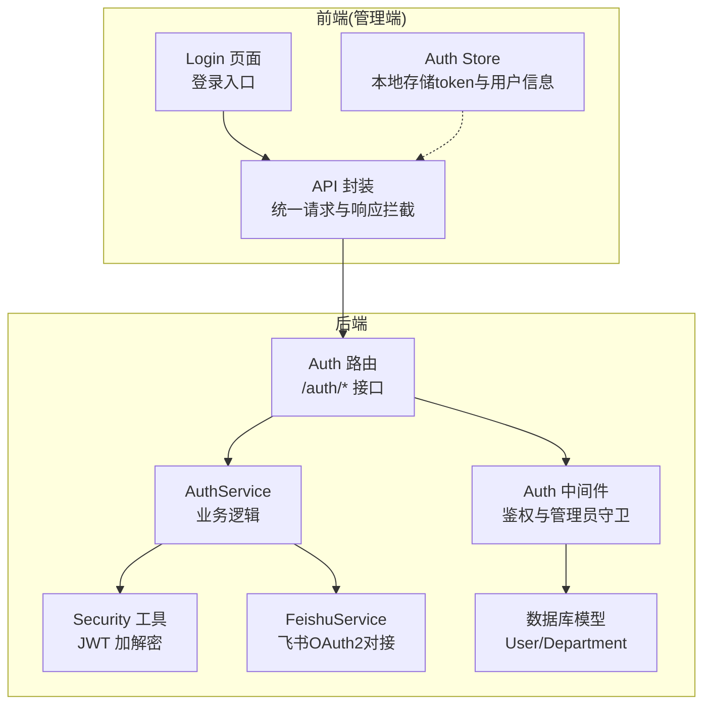
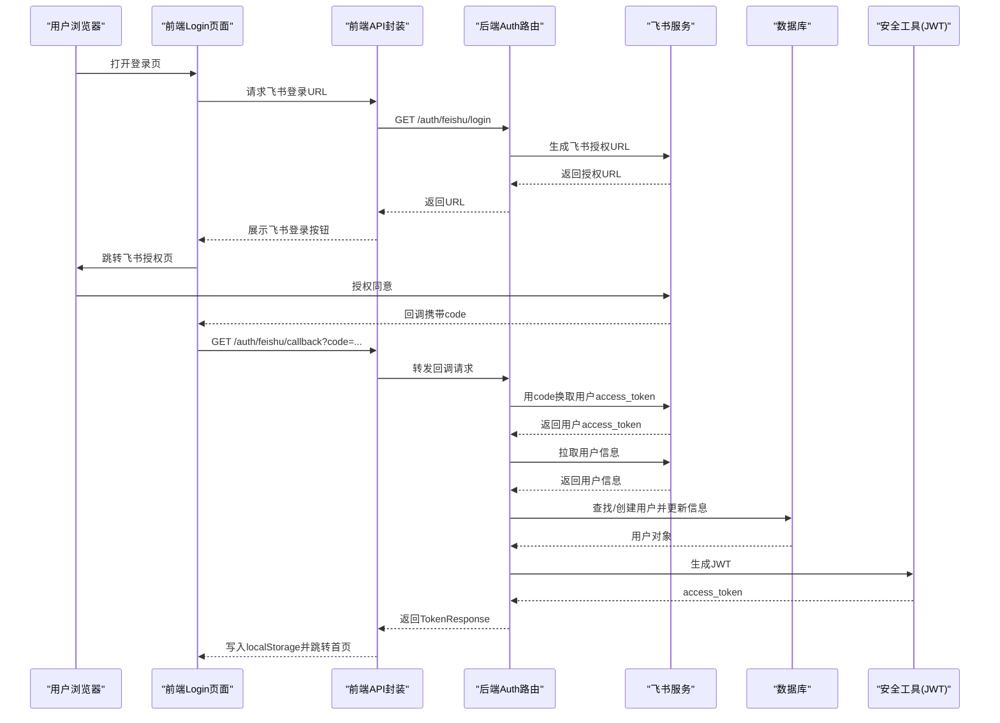
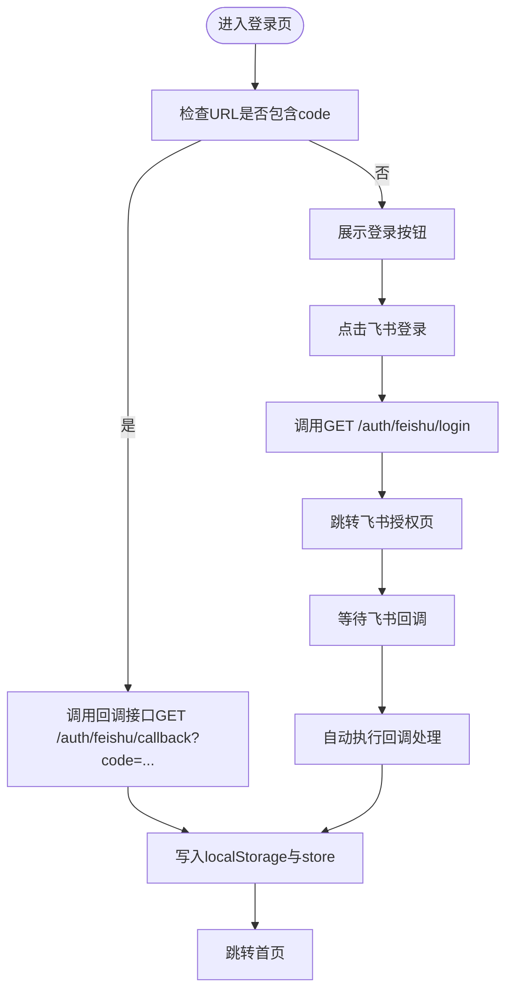
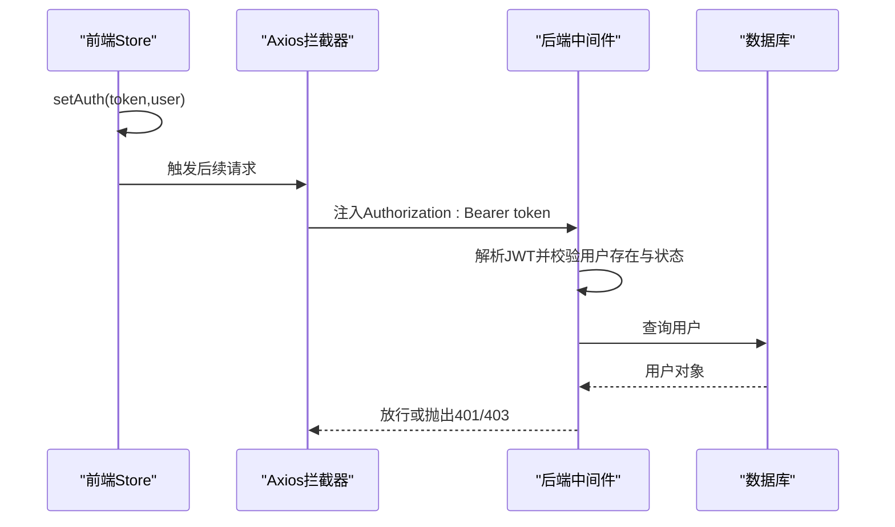
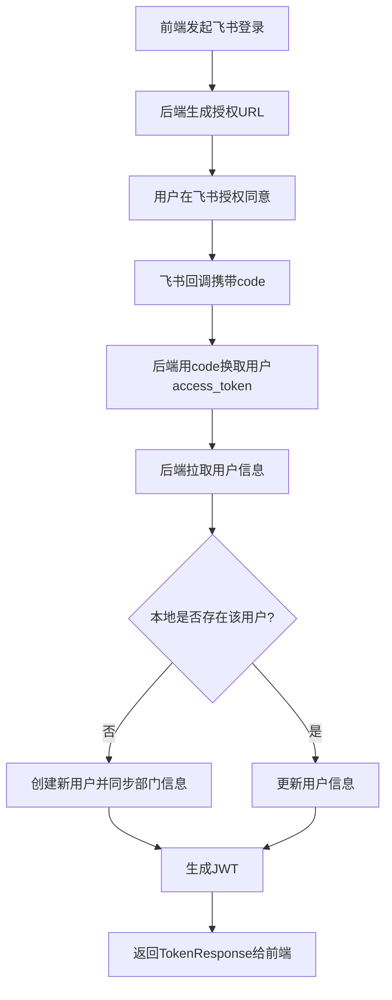
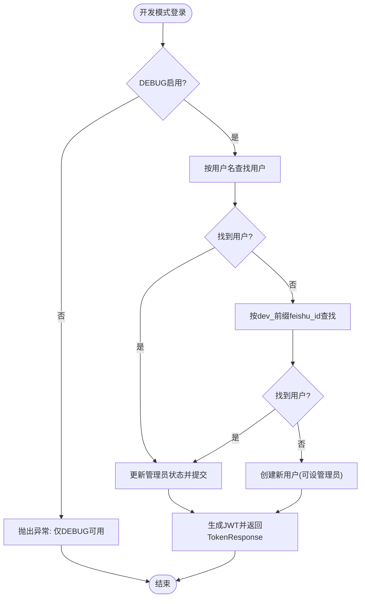
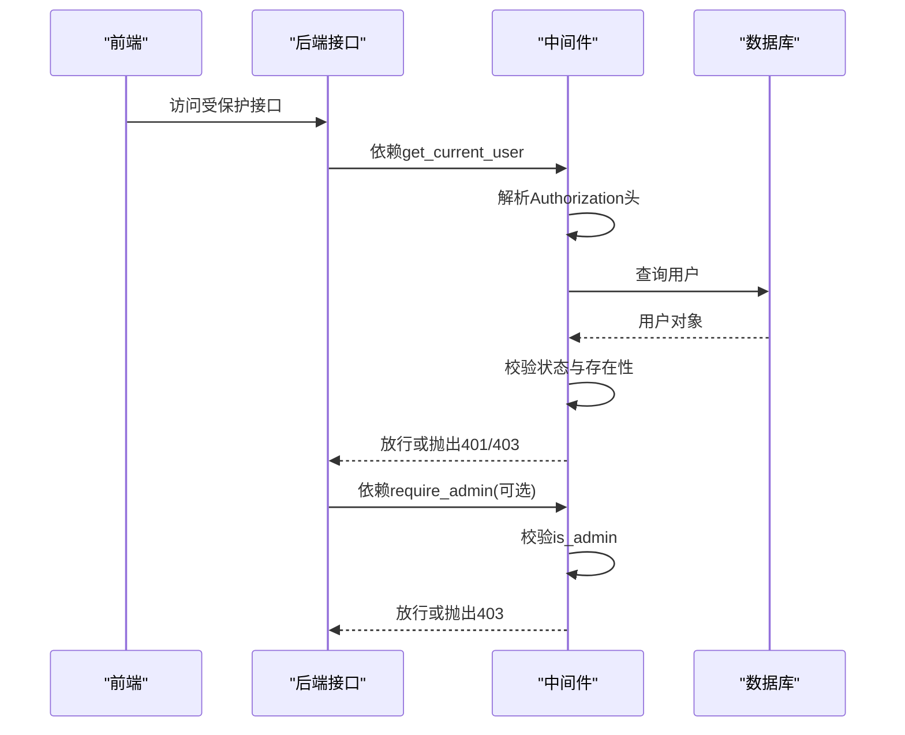
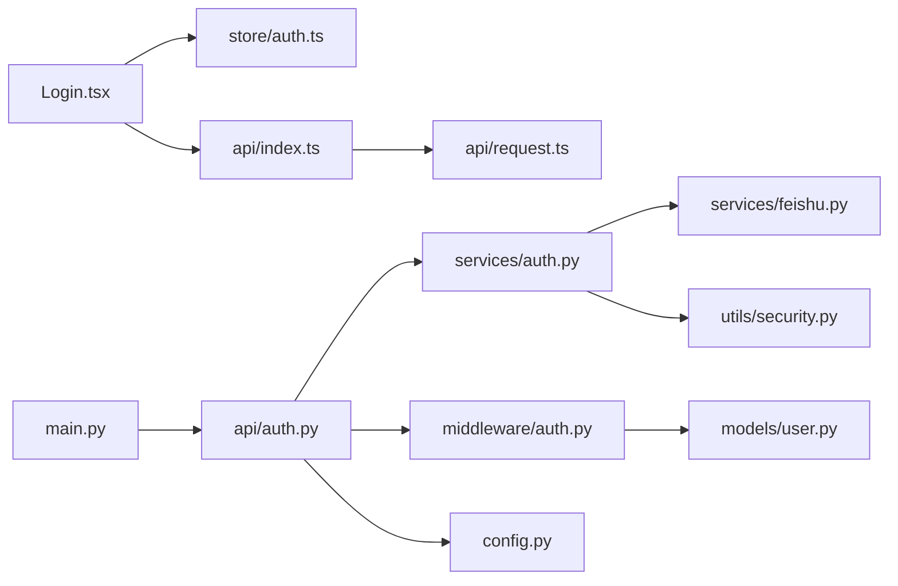

# 认证系统

<cite>
**本文引用的文件**
- [backend/app/api/auth.py](file://backend/app/api/auth.py)
- [backend/app/services/auth.py](file://backend/app/services/auth.py)
- [backend/app/middleware/auth.py](file://backend/app/middleware/auth.py)
- [backend/app/utils/security.py](file://backend/app/utils/security.py)
- [backend/app/services/feishu.py](file://backend/app/services/feishu.py)
- [backend/app/schemas/auth.py](file://backend/app/schemas/auth.py)
- [backend/app/schemas/common.py](file://backend/app/schemas/common.py)
- [backend/app/models/user.py](file://backend/app/models/user.py)
- [backend/app/config.py](file://backend/app/config.py)
- [backend/app/main.py](file://backend/app/main.py)
- [frontend/admin/src/pages/Login.tsx](file://frontend/admin/src/pages/Login.tsx)
- [frontend/admin/src/store/auth.ts](file://frontend/admin/src/store/auth.ts)
- [frontend/admin/src/api/index.ts](file://frontend/admin/src/api/index.ts)
- [frontend/admin/src/api/request.ts](file://frontend/admin/src/api/request.ts)
</cite>

## 目录
1. [简介](#简介)
2. [项目结构](#项目结构)
3. [核心组件](#核心组件)
4. [架构总览](#架构总览)
5. [详细组件分析](#详细组件分析)
6. [依赖关系分析](#依赖关系分析)
7. [性能考量](#性能考量)
8. [故障排查指南](#故障排查指南)
9. [结论](#结论)
10. [附录](#附录)

## 简介
本文件为ToolHub管理端认证系统的详细技术文档，覆盖登录页面实现、飞书OAuth2认证流程、开发模式登录、认证状态管理、JWT令牌存储与会话管理、权限验证与路由守卫、访问控制、用户信息缓存、自动登录与记住密码、安全策略与密码加密、令牌刷新机制、错误处理与重试、账户锁定方案，以及安全性设计、用户体验优化与多设备支持的设计原则。文档同时提供代码级架构图与流程图，帮助开发者快速理解与扩展认证体系。

## 项目结构
认证系统由前后端协作完成：
- 后端采用FastAPI，提供认证接口、中间件校验、JWT签发与解析、飞书OAuth2对接服务。
- 前端使用React + Ant Design，负责登录UI、状态管理、Axios拦截器注入Authorization头、路由跳转与错误处理。

图表来源
- [backend/app/api/auth.py:1-58](file://backend/app/api/auth.py#L1-L58)
- [backend/app/services/auth.py:1-122](file://backend/app/services/auth.py#L1-L122)
- [backend/app/middleware/auth.py:1-45](file://backend/app/middleware/auth.py#L1-L45)
- [backend/app/utils/security.py:1-32](file://backend/app/utils/security.py#L1-L32)
- [backend/app/services/feishu.py:1-120](file://backend/app/services/feishu.py#L1-L120)
- [frontend/admin/src/pages/Login.tsx:1-86](file://frontend/admin/src/pages/Login.tsx#L1-L86)
- [frontend/admin/src/store/auth.ts:1-30](file://frontend/admin/src/store/auth.ts#L1-L30)
- [frontend/admin/src/api/request.ts:1-28](file://frontend/admin/src/api/request.ts#L1-L28)

章节来源
- [backend/app/main.py:1-62](file://backend/app/main.py#L1-L62)
- [backend/app/config.py:1-42](file://backend/app/config.py#L1-L42)

## 核心组件
- 登录页面(Login.tsx)：提供飞书一键登录与开发模式管理员登录入口；在URL含code时自动处理回调并写入本地存储。
- 认证状态管理(zustand store)：持久化token到localStorage，提供setAuth与logout方法。
- Axios拦截器(request.ts)：自动在请求头注入Authorization Bearer token；401时清理token并跳转登录页。
- 认证API封装(index.ts)：统一暴露/auth/*接口调用。
- 认证路由(auth.py)：飞书登录URL获取、回调处理、开发模式登录、登出、当前用户信息查询。
- 认证服务(auth.py)：飞书回调处理、用户查找/创建、JWT签发、开发模式登录。
- 中间件(auth.py)：HTTP Bearer令牌解析、用户存在性与状态校验、管理员守卫。
- 安全工具(security.py)：JWT生成与解码。
- 飞书服务(feishu.py)：飞书授权URL生成、tenant_access_token获取、用户access_token与用户信息获取。
- 数据模型(user.py)：用户、部门、角色等实体定义。
- 全局配置(config.py)：JWT密钥、算法、过期时间、飞书App配置、CORS等。

章节来源
- [frontend/admin/src/pages/Login.tsx:1-86](file://frontend/admin/src/pages/Login.tsx#L1-L86)
- [frontend/admin/src/store/auth.ts:1-30](file://frontend/admin/src/store/auth.ts#L1-L30)
- [frontend/admin/src/api/request.ts:1-28](file://frontend/admin/src/api/request.ts#L1-L28)
- [frontend/admin/src/api/index.ts:1-60](file://frontend/admin/src/api/index.ts#L1-L60)
- [backend/app/api/auth.py:1-58](file://backend/app/api/auth.py#L1-L58)
- [backend/app/services/auth.py:1-122](file://backend/app/services/auth.py#L1-L122)
- [backend/app/middleware/auth.py:1-45](file://backend/app/middleware/auth.py#L1-L45)
- [backend/app/utils/security.py:1-32](file://backend/app/utils/security.py#L1-L32)
- [backend/app/services/feishu.py:1-120](file://backend/app/services/feishu.py#L1-L120)
- [backend/app/models/user.py:1-116](file://backend/app/models/user.py#L1-L116)
- [backend/app/config.py:1-42](file://backend/app/config.py#L1-L42)

## 架构总览
认证系统遵循“前端无状态、后端有状态”的设计：前端只保存token，后端通过中间件解析JWT并从数据库校验用户有效性与状态；飞书OAuth2采用标准授权码流程，后端完成用户信息同步与JWT签发。

图表来源
- [backend/app/api/auth.py:13-27](file://backend/app/api/auth.py#L13-L27)
- [backend/app/services/auth.py:18-77](file://backend/app/services/auth.py#L18-L77)
- [backend/app/services/feishu.py:15-69](file://backend/app/services/feishu.py#L15-L69)
- [backend/app/utils/security.py:8-17](file://backend/app/utils/security.py#L8-L17)
- [frontend/admin/src/pages/Login.tsx:12-54](file://frontend/admin/src/pages/Login.tsx#L12-L54)
- [frontend/admin/src/api/index.ts:4-6](file://frontend/admin/src/api/index.ts#L4-L6)

## 详细组件分析

### 登录页面(Login.tsx)
- 功能要点
  - 飞书一键登录：调用后端获取飞书授权URL并跳转。
  - 开发模式管理员登录：输入用户名，后端创建或更新用户并返回JWT。
  - 自动回调处理：检测URL中的code参数，调用回调接口并写入本地存储。
- 交互流程
  - 用户点击“飞书登录”触发GET /auth/feishu/login，拿到授权URL后跳转飞书。
  - 飞书回调携带code，前端自动调用GET /auth/feishu/callback，成功后写入token并跳转首页。
  - 开发模式下提交表单，调用POST /auth/dev-login，成功后写入token并跳转首页。

图表来源
- [frontend/admin/src/pages/Login.tsx:12-54](file://frontend/admin/src/pages/Login.tsx#L12-L54)
- [frontend/admin/src/api/index.ts:4-6](file://frontend/admin/src/api/index.ts#L4-L6)

章节来源
- [frontend/admin/src/pages/Login.tsx:1-86](file://frontend/admin/src/pages/Login.tsx#L1-L86)

### 认证状态管理与会话管理
- 前端
  - 使用zustand store管理token与用户信息，初始化时从localStorage读取token。
  - 提供setAuth(token, user)写入localStorage并更新store；logout移除localStorage并清空store。
- 后端
  - 中间件get_current_user解析Authorization头中的Bearer token，校验JWT有效性与用户状态。
  - require_admin守卫确保管理员权限。
- 会话策略
  - 前端无会话状态，仅依赖localStorage中的token；后端无服务器端session，基于JWT无状态鉴权。

图表来源
- [frontend/admin/src/store/auth.ts:18-29](file://frontend/admin/src/store/auth.ts#L18-L29)
- [frontend/admin/src/api/request.ts:8-25](file://frontend/admin/src/api/request.ts#L8-L25)
- [backend/app/middleware/auth.py:12-33](file://backend/app/middleware/auth.py#L12-L33)

章节来源
- [frontend/admin/src/store/auth.ts:1-30](file://frontend/admin/src/store/auth.ts#L1-L30)
- [frontend/admin/src/api/request.ts:1-28](file://frontend/admin/src/api/request.ts#L1-L28)
- [backend/app/middleware/auth.py:1-45](file://backend/app/middleware/auth.py#L1-L45)

### 飞书OAuth2认证流程
- 授权URL生成：后端调用飞书服务生成授权URL，包含app_id、redirect_uri、response_type=code、state等参数。
- 回调处理：后端用code换取用户access_token，再拉取用户信息，查找或创建用户，更新部门信息，生成JWT并返回TokenResponse。
- 用户信息同步：根据飞书用户ID查找或创建本地用户，同步姓名、邮箱、头像、部门ID等字段。

图表来源
- [backend/app/services/feishu.py:15-69](file://backend/app/services/feishu.py#L15-L69)
- [backend/app/services/auth.py:18-77](file://backend/app/services/auth.py#L18-L77)
- [backend/app/models/user.py:23-40](file://backend/app/models/user.py#L23-L40)

章节来源
- [backend/app/services/feishu.py:1-120](file://backend/app/services/feishu.py#L1-L120)
- [backend/app/services/auth.py:1-122](file://backend/app/services/auth.py#L1-L122)
- [backend/app/models/user.py:1-116](file://backend/app/models/user.py#L1-L116)

### 开发模式登录(dev-login)
- 仅在DEBUG=True时可用，用于本地开发与演示。
- 优先按用户名查找用户，不存在则按feishu_id前缀查找，仍不存在则创建新用户，可指定是否管理员。
- 成功后签发JWT并返回TokenResponse。

图表来源
- [backend/app/services/auth.py:80-118](file://backend/app/services/auth.py#L80-L118)
- [backend/app/config.py:15-23](file://backend/app/config.py#L15-L23)

章节来源
- [backend/app/services/auth.py:80-118](file://backend/app/services/auth.py#L80-L118)
- [backend/app/config.py:1-42](file://backend/app/config.py#L1-L42)

### 权限验证、路由守卫与访问控制
- 当前用户信息：GET /auth/me返回用户基本信息，供前端展示与权限判断。
- 管理员守卫：require_admin装饰器确保只有is_admin为true的用户才能访问受保护资源。
- 用户状态校验：中间件get_current_user校验用户存在且状态为active，否则401/403。

图表来源
- [backend/app/api/auth.py:46-57](file://backend/app/api/auth.py#L46-L57)
- [backend/app/middleware/auth.py:12-44](file://backend/app/middleware/auth.py#L12-L44)

章节来源
- [backend/app/api/auth.py:1-58](file://backend/app/api/auth.py#L1-L58)
- [backend/app/middleware/auth.py:1-45](file://backend/app/middleware/auth.py#L1-L45)

### JWT令牌存储与刷新机制
- 存储位置：前端localStorage存储access_token；每次请求自动附加Authorization头。
- 过期策略：JWT过期时间由后端配置，默认24小时；前端未实现自动刷新，建议在401时引导重新登录或引入刷新令牌机制。
- 刷新建议：当前未实现refresh token，可在后端新增refresh token表与接口，前端在401时尝试刷新并重试原请求。

章节来源
- [backend/app/utils/security.py:8-17](file://backend/app/utils/security.py#L8-L17)
- [backend/app/config.py:20-23](file://backend/app/config.py#L20-L23)
- [frontend/admin/src/api/request.ts:8-25](file://frontend/admin/src/api/request.ts#L8-L25)

### 用户信息缓存、自动登录与“记住密码”
- 用户信息缓存：前端store中保存用户对象，避免重复请求；后端未实现用户信息缓存。
- 自动登录：前端启动时读取localStorage中的token，若存在则可直接访问受保护接口；后端中间件校验token有效性。
- “记住密码”：当前未实现密码登录与“记住密码”，飞书登录为唯一登录方式；如需密码登录，需新增密码哈希与登录接口。

章节来源
- [frontend/admin/src/store/auth.ts:18-29](file://frontend/admin/src/store/auth.ts#L18-L29)
- [frontend/admin/src/api/request.ts:8-25](file://frontend/admin/src/api/request.ts#L8-L25)

### 安全策略、密码加密与令牌安全
- 密钥与算法：JWT密钥与算法在配置中定义，生产环境需替换默认值。
- 密码策略：当前未实现密码登录，故无密码加密；如需密码登录，应使用强哈希算法(如bcrypt)存储密码，并限制登录失败次数与账户锁定。
- 令牌安全：Authorization头为Bearer token，建议配合HTTPS、CORS白名单、CSRF防护与短令牌有效期。
- 飞书集成：通过飞书官方OIDC接口获取用户信息，避免在前端暴露敏感数据。

章节来源
- [backend/app/config.py:20-36](file://backend/app/config.py#L20-L36)
- [backend/app/utils/security.py:20-31](file://backend/app/utils/security.py#L20-L31)
- [backend/app/services/feishu.py:26-69](file://backend/app/services/feishu.py#L26-L69)

### 错误处理、重试机制与账户锁定
- 错误响应：统一使用通用响应包装(success_response/error_response)，后端异常通过error_response返回。
- 401处理：前端拦截器收到401时清理localStorage并跳转登录页。
- 重试机制：当前未实现自动重试；建议在401时弹窗提示并引导重新登录。
- 账户锁定：当前未实现登录失败计数与锁定；建议在数据库增加登录失败计数与锁定字段，并设置阈值与冷却时间。

章节来源
- [backend/app/schemas/common.py:17-28](file://backend/app/schemas/common.py#L17-L28)
- [frontend/admin/src/api/request.ts:16-25](file://frontend/admin/src/api/request.ts#L16-L25)

### 多设备支持与用户体验优化
- 多设备：JWT无状态，可在多设备登录；建议引入设备指纹与会话管理，必要时支持强制登出。
- 用户体验：登录页提供飞书一键登录与开发模式登录；回调自动处理，减少用户操作步骤。
- 安全体验：401自动跳转登录，避免长时间停留在无权限页面。

章节来源
- [frontend/admin/src/pages/Login.tsx:1-86](file://frontend/admin/src/pages/Login.tsx#L1-L86)
- [frontend/admin/src/api/request.ts:16-25](file://frontend/admin/src/api/request.ts#L16-L25)

## 依赖关系分析
认证系统模块间依赖清晰，职责分离明确：前端负责UI与状态管理，后端负责业务逻辑与安全校验。

图表来源
- [frontend/admin/src/pages/Login.tsx:1-86](file://frontend/admin/src/pages/Login.tsx#L1-L86)
- [frontend/admin/src/store/auth.ts:1-30](file://frontend/admin/src/store/auth.ts#L1-L30)
- [frontend/admin/src/api/index.ts:1-60](file://frontend/admin/src/api/index.ts#L1-L60)
- [frontend/admin/src/api/request.ts:1-28](file://frontend/admin/src/api/request.ts#L1-L28)
- [backend/app/api/auth.py:1-58](file://backend/app/api/auth.py#L1-L58)
- [backend/app/services/auth.py:1-122](file://backend/app/services/auth.py#L1-L122)
- [backend/app/services/feishu.py:1-120](file://backend/app/services/feishu.py#L1-L120)
- [backend/app/utils/security.py:1-32](file://backend/app/utils/security.py#L1-L32)
- [backend/app/middleware/auth.py:1-45](file://backend/app/middleware/auth.py#L1-L45)
- [backend/app/models/user.py:1-116](file://backend/app/models/user.py#L1-L116)
- [backend/app/config.py:1-42](file://backend/app/config.py#L1-L42)
- [backend/app/main.py:1-62](file://backend/app/main.py#L1-L62)

章节来源
- [backend/app/main.py:1-62](file://backend/app/main.py#L1-L62)
- [backend/app/api/auth.py:1-58](file://backend/app/api/auth.py#L1-L58)

## 性能考量
- JWT解码成本低，适合高并发场景；建议缩短令牌有效期并结合CORS与HTTPS提升安全性。
- 飞书接口调用为异步HTTP请求，注意超时与重试策略；可考虑缓存tenant_access_token并在过期前刷新。
- 前端store读取localStorage为O(1)，对性能影响极小。

## 故障排查指南
- 飞书回调失败
  - 检查redirect_uri与飞书应用配置一致。
  - 确认后端能正常调用飞书接口并正确解析返回。
- 401未登录
  - 检查前端是否正确注入Authorization头。
  - 确认localStorage中token未被清理。
- 用户状态异常
  - 确认用户状态为active，中间件会拒绝非active用户。
- 开发模式不可用
  - 确认DEBUG=True，否则/dev-login会被拒绝。

章节来源
- [frontend/admin/src/api/request.ts:8-25](file://frontend/admin/src/api/request.ts#L8-L25)
- [backend/app/middleware/auth.py:12-33](file://backend/app/middleware/auth.py#L12-L33)
- [backend/app/config.py:15-23](file://backend/app/config.py#L15-L23)

## 结论
ToolHub管理端认证系统以飞书OAuth2为核心，结合JWT无状态鉴权与前端本地存储，实现了简洁高效的登录与权限控制。当前系统未包含密码登录、自动刷新与账户锁定等高级特性，建议在保持现有架构不变的前提下逐步增强：引入密码登录与哈希、刷新令牌、登录失败计数与锁定、多设备会话管理与强制登出，以进一步提升安全性与用户体验。

## 附录
- 接口一览
  - GET /api/auth/feishu/login：获取飞书授权URL
  - GET /api/auth/feishu/callback：飞书回调处理
  - POST /api/auth/dev-login：开发模式管理员登录
  - POST /api/auth/logout：登出
  - GET /api/auth/me：获取当前用户信息
- 前端API封装
  - authApi.getFeishuLoginUrl()
  - authApi.feishuCallback(code)
  - authApi.devLogin({ username, is_admin })
  - authApi.getMe()
  - authApi.logout()

章节来源
- [frontend/admin/src/api/index.ts:3-9](file://frontend/admin/src/api/index.ts#L3-L9)
- [backend/app/api/auth.py:1-58](file://backend/app/api/auth.py#L1-L58)