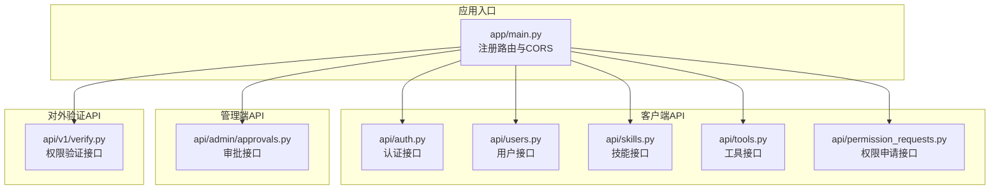
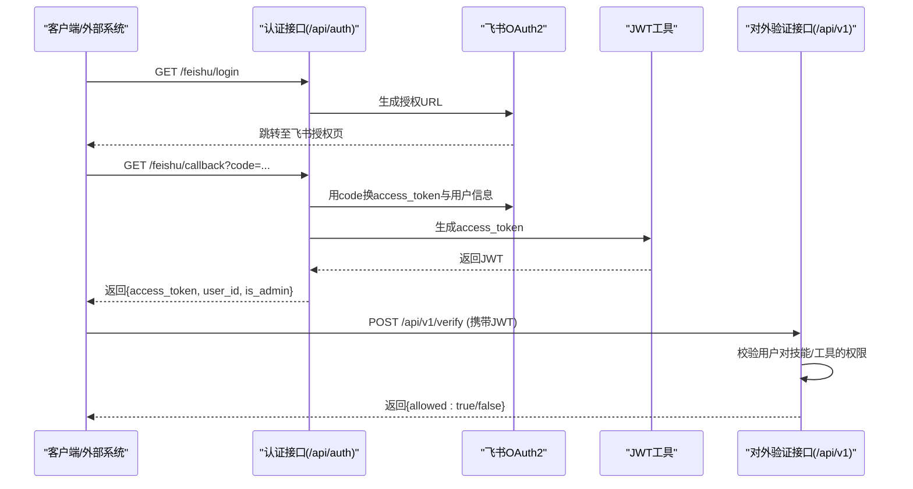
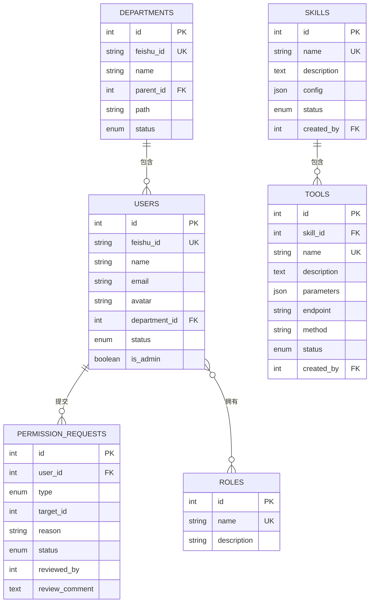
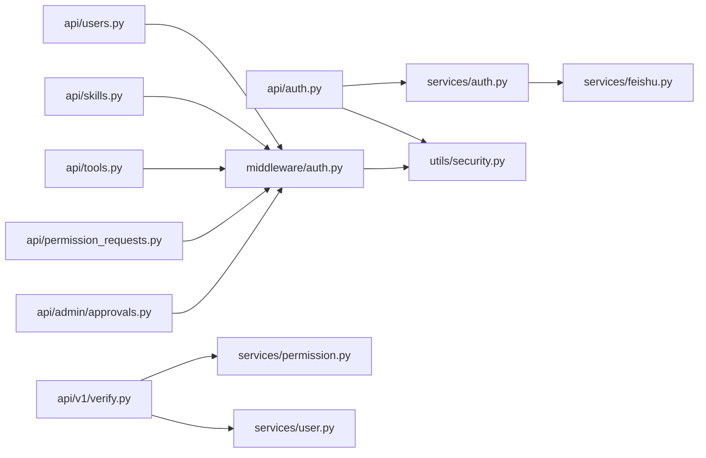
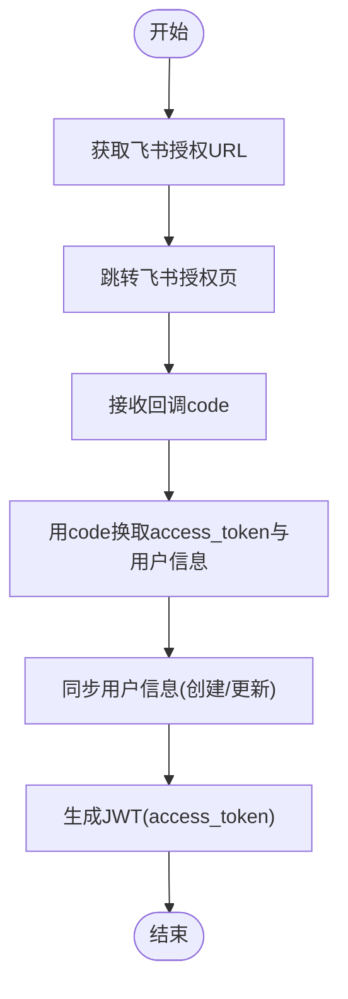
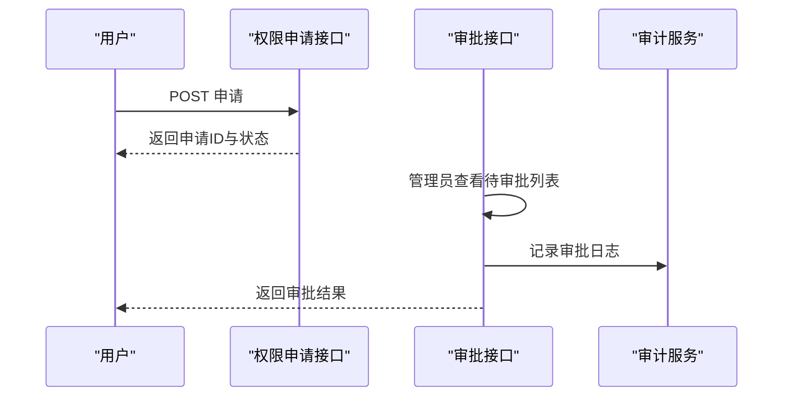

# 后端API文档

<cite>
**本文引用的文件**
- [backend/app/main.py](file://backend/app/main.py)
- [backend/app/config.py](file://backend/app/config.py)
- [backend/app/middleware/auth.py](file://backend/app/middleware/auth.py)
- [backend/app/utils/security.py](file://backend/app/utils/security.py)
- [backend/app/api/auth.py](file://backend/app/api/auth.py)
- [backend/app/api/users.py](file://backend/app/api/users.py)
- [backend/app/api/skills.py](file://backend/app/api/skills.py)
- [backend/app/api/tools.py](file://backend/app/api/tools.py)
- [backend/app/api/permission_requests.py](file://backend/app/api/permission_requests.py)
- [backend/app/api/v1/verify.py](file://backend/app/api/v1/verify.py)
- [backend/app/api/admin/approvals.py](file://backend/app/api/admin/approvals.py)
- [backend/app/services/auth.py](file://backend/app/services/auth.py)
- [backend/app/models/user.py](file://backend/app/models/user.py)
- [backend/app/schemas/auth.py](file://backend/app/schemas/auth.py)
- [backend/app/schemas/common.py](file://backend/app/schemas/common.py)
</cite>

## 目录
1. [简介](#简介)
2. [项目结构](#项目结构)
3. [核心组件](#核心组件)
4. [架构总览](#架构总览)
5. [详细组件分析](#详细组件分析)
6. [依赖分析](#依赖分析)
7. [性能考虑](#性能考虑)
8. [故障排查指南](#故障排查指南)
9. [结论](#结论)
10. [附录](#附录)

## 简介
本文件为 ToolHub 后端 API 的完整文档，覆盖认证相关接口、客户端功能接口、管理端接口与对外验证接口。文档详细说明了飞书 OAuth2 授权流程、JWT 令牌管理、权限验证与审批流程，并提供统一的响应格式、错误码约定、API 版本管理、速率限制与错误处理等设计规范。为便于集成，文档提供了各接口的请求/响应示例与最佳实践。

## 项目结构
后端基于 FastAPI 构建，采用模块化路由组织方式：
- 客户端 API：用户、技能、工具、权限申请、认证等
- 管理端 API：用户、角色、技能、工具、审批、部门、审计日志
- 对外验证 API：权限验证、用户可用工具/技能查询

**图表来源**
- [backend/app/main.py:9-48](file://backend/app/main.py#L9-L48)

**章节来源**
- [backend/app/main.py:9-48](file://backend/app/main.py#L9-L48)

## 核心组件
- 应用入口与路由注册：集中于应用入口文件，统一注册客户端、管理端与对外验证路由，并启用 CORS。
- 认证中间件：基于 HTTP Bearer 令牌进行鉴权，支持管理员权限校验。
- 安全工具：JWT 令牌生成与解码，密钥与算法由配置管理。
- 飞书 OAuth2：提供授权链接生成与回调处理，完成用户信息同步与 JWT 签发。
- 统一响应：成功/失败响应格式统一，便于前端一致处理。

**章节来源**
- [backend/app/main.py:9-48](file://backend/app/main.py#L9-L48)
- [backend/app/middleware/auth.py:12-44](file://backend/app/middleware/auth.py#L12-L44)
- [backend/app/utils/security.py:8-32](file://backend/app/utils/security.py#L8-L32)
- [backend/app/services/auth.py:9-79](file://backend/app/services/auth.py#L9-L79)
- [backend/app/schemas/common.py:17-28](file://backend/app/schemas/common.py#L17-L28)

## 架构总览
下图展示了认证、权限与对外验证的整体交互流程：

**图表来源**
- [backend/app/api/auth.py:13-33](file://backend/app/api/auth.py#L13-L33)
- [backend/app/services/auth.py:16-76](file://backend/app/services/auth.py#L16-L76)
- [backend/app/api/v1/verify.py:13-20](file://backend/app/api/v1/verify.py#L13-L20)
- [backend/app/utils/security.py:8-32](file://backend/app/utils/security.py#L8-L32)

## 详细组件分析

### 认证相关接口
- 飞书登录授权
  - 方法与路径：GET /api/auth/feishu/login
  - 功能：返回飞书 OAuth2 授权 URL
  - 响应：包含授权 URL 的数据对象
  - 示例：见“附录/调用示例”
- 飞书回调处理
  - 方法与路径：GET /api/auth/feishu/callback?code=...
  - 参数：code（必填）
  - 功能：使用 code 换取用户访问令牌与用户信息，同步用户信息，签发 JWT
  - 响应：TokenResponse（access_token、token_type、user_id、name、is_admin）
  - 错误：异常时返回错误响应
  - 示例：见“附录/调用示例”
- 登出
  - 方法与路径：POST /api/auth/logout
  - 功能：提示前端清除本地 token 即可
  - 响应：成功消息
- 当前用户信息
  - 方法与路径：GET /api/auth/me
  - 权限：需要有效 JWT
  - 响应：当前用户基本信息（含部门与管理员标识）

**章节来源**
- [backend/app/api/auth.py:13-47](file://backend/app/api/auth.py#L13-L47)
- [backend/app/services/auth.py:16-76](file://backend/app/services/auth.py#L16-L76)
- [backend/app/schemas/auth.py:10-15](file://backend/app/schemas/auth.py#L10-L15)
- [backend/app/middleware/auth.py:36-44](file://backend/app/middleware/auth.py#L36-L44)

### 客户端功能接口
- 用户权限
  - 方法与路径：GET /api/users/me/permissions
  - 权限：需要有效 JWT
  - 响应：包含用户拥有的技能/工具权限集合
- 用户角色
  - 方法与路径：GET /api/users/me/roles
  - 权限：需要有效 JWT
  - 响应：角色列表（id、name、description）
- 技能列表（含权限状态）
  - 方法与路径：GET /api/skills/?page=&pageSize=&keyword=
  - 权限：需要有效 JWT
  - 响应：分页结果，每项包含 has_permission 字段
- 技能详情
  - 方法与路径：GET /api/skills/{skill_id}
  - 权限：需要有效 JWT
  - 响应：技能详情及 has_permission
- 技能下的工具列表
  - 方法与路径：GET /api/skills/{skill_id}/tools
  - 权限：需要有效 JWT
  - 响应：工具列表及 has_permission
- 工具列表（含权限状态）
  - 方法与路径：GET /api/tools/?page=&pageSize=&keyword=&skill_id=
  - 权限：需要有效 JWT
  - 响应：分页结果，每项包含 has_permission
- 工具详情
  - 方法与路径：GET /api/tools/{tool_id}
  - 权限：需要有效 JWT
  - 响应：工具详情及 has_permission
- 我的权限申请
  - 方法与路径：GET /api/permission-requests/
  - 权限：需要有效 JWT
  - 响应：分页的申请列表（含目标名称、状态、时间戳）
- 提交权限申请
  - 方法与路径：POST /api/permission-requests/
  - 权限：需要有效 JWT
  - 请求体：PermissionRequestCreate
  - 响应：申请 ID 与初始状态
- 申请详情
  - 方法与路径：GET /api/permission-requests/{request_id}
  - 权限：需要有效 JWT
  - 响应：申请详情（含目标名称）
- 撤销申请
  - 方法与路径：DELETE /api/permission-requests/{request_id}
  - 权限：需要有效 JWT
  - 响应：操作成功消息

**章节来源**
- [backend/app/api/users.py:12-28](file://backend/app/api/users.py#L12-L28)
- [backend/app/api/skills.py:13-85](file://backend/app/api/skills.py#L13-L85)
- [backend/app/api/tools.py:12-68](file://backend/app/api/tools.py#L12-L68)
- [backend/app/api/permission_requests.py:13-106](file://backend/app/api/permission_requests.py#L13-L106)

### 管理端接口
- 审批列表
  - 方法与路径：GET /api/admin/approvals/?page=&pageSize=&status=
  - 权限：管理员
  - 响应：分页的待审批列表（含申请人、目标名称、审批人、状态等）
- 审批通过
  - 方法与路径：PUT /api/admin/approvals/{request_id}/approve
  - 权限：管理员
  - 请求体：ApprovalAction（含评论）
  - 响应：操作成功消息
- 审批拒绝
  - 方法与路径：PUT /api/admin/approvals/{request_id}/reject
  - 权限：管理员
  - 请求体：ApprovalAction（含评论）
  - 响应：操作成功消息

**章节来源**
- [backend/app/api/admin/approvals.py:14-87](file://backend/app/api/admin/approvals.py#L14-L87)

### 对外验证接口
- 验证用户权限
  - 方法与路径：POST /api/v1/verify
  - 权限：无（开放接口，供其他系统/Agent调用）
  - 请求体：PermissionVerifyRequest（user_id、type、target_name）
  - 响应：{allowed: true/false}
- 获取用户可用工具列表
  - 方法与路径：GET /api/v1/users/{user_id}/tools
  - 权限：无（开放接口）
  - 响应：用户可用工具列表
- 获取用户可用技能列表
  - 方法与路径：GET /api/v1/users/{user_id}/skills
  - 权限：无（开放接口）
  - 响应：{skills: [...]}

**章节来源**
- [backend/app/api/v1/verify.py:13-40](file://backend/app/api/v1/verify.py#L13-L40)

### 数据模型与权限关系

**图表来源**
- [backend/app/models/user.py:7-116](file://backend/app/models/user.py#L7-L116)

## 依赖分析
- 中间件依赖：认证中间件依赖安全工具进行 JWT 解码；管理员校验依赖当前用户上下文。
- 服务层依赖：认证服务依赖飞书服务与安全工具；对外验证依赖权限与用户服务。
- 路由依赖：各 API 路由依赖数据库会话与中间件；管理端接口依赖管理员权限。

**图表来源**
- [backend/app/api/auth.py:1-8](file://backend/app/api/auth.py#L1-L8)
- [backend/app/middleware/auth.py:1-7](file://backend/app/middleware/auth.py#L1-L7)
- [backend/app/services/auth.py:1-6](file://backend/app/services/auth.py#L1-L6)
- [backend/app/api/v1/verify.py:1-8](file://backend/app/api/v1/verify.py#L1-L8)

**章节来源**
- [backend/app/middleware/auth.py:12-44](file://backend/app/middleware/auth.py#L12-L44)
- [backend/app/utils/security.py:8-32](file://backend/app/utils/security.py#L8-L32)
- [backend/app/services/auth.py:9-79](file://backend/app/services/auth.py#L9-L79)

## 性能考虑
- 分页参数：客户端与管理端接口均支持 page/page_size，建议默认 20，最大 100，避免一次性返回大量数据。
- 缓存策略：对外验证接口可结合业务场景引入缓存（如用户权限快照），降低数据库压力。
- 并发控制：在高并发场景下，建议在网关层实施速率限制，防止滥用。
- 数据库索引：确保常用查询字段（如用户 ID、技能/工具名称、状态）建立索引以提升查询效率。

## 故障排查指南
- 401 未授权
  - 可能原因：缺少有效 JWT 或令牌已过期
  - 处理建议：重新走飞书授权流程获取新令牌
- 403 禁止访问
  - 可能原因：非管理员访问管理端接口
  - 处理建议：确认当前用户 is_admin 标识
- 404 资源不存在
  - 可能原因：技能/工具 ID 无效
  - 处理建议：检查 ID 是否正确
- 业务异常
  - 可能原因：权限申请状态不合法、重复申请等
  - 处理建议：根据错误消息调整请求内容

**章节来源**
- [backend/app/middleware/auth.py:18-32](file://backend/app/middleware/auth.py#L18-L32)
- [backend/app/api/admin/approvals.py:67-71](file://backend/app/api/admin/approvals.py#L67-L71)
- [backend/app/api/permission_requests.py:23-24](file://backend/app/api/permission_requests.py#L23-L24)

## 结论
本 API 文档覆盖了 ToolHub 的认证、权限申请与审批、客户端功能以及对外验证能力。通过飞书 OAuth2 与 JWT 实现身份认证，配合统一响应与错误码，便于前后端与第三方系统集成。建议在生产环境完善速率限制、审计日志与监控告警，持续优化性能与安全性。

## 附录

### API 设计规范
- 版本管理
  - 对外验证接口位于 /api/v1，便于后续版本演进
- 速率限制
  - 建议在网关层设置每 IP 每分钟请求数上限，例如 60 次/分钟
- 统一响应
  - 成功：{"code": 0, "message": "success", "data": ...}
  - 失败：{"code": -1, "message": "...", "data": null}
- 错误码约定
  - 0：成功
  - -1：通用错误
  - 其他：按业务细分（如权限申请状态非法）

**章节来源**
- [backend/app/schemas/common.py:17-28](file://backend/app/schemas/common.py#L17-L28)
- [backend/app/api/v1/verify.py:13-20](file://backend/app/api/v1/verify.py#L13-L20)

### 认证机制详解
- 飞书 OAuth2 授权流程
  - 步骤：获取授权 URL → 用户授权 → 回调换取 access_token 与用户信息 → 同步用户信息 → 生成 JWT
  - 关键配置：飞书 App ID/Secret、重定向地址、基础域名
- JWT 令牌管理
  - 生成：包含 user_id 与 is_admin，设定过期时间
  - 解码：校验签名与有效期，失败则 401
- 权限验证
  - 客户端：通过中间件注入当前用户上下文
  - 管理端：额外校验 is_admin
  - 对外：无需登录态，仅校验权限

**图表来源**
- [backend/app/api/auth.py:13-33](file://backend/app/api/auth.py#L13-L33)
- [backend/app/services/auth.py:16-76](file://backend/app/services/auth.py#L16-L76)
- [backend/app/utils/security.py:8-32](file://backend/app/utils/security.py#L8-L32)

**章节来源**
- [backend/app/config.py:19-23](file://backend/app/config.py#L19-L23)
- [backend/app/middleware/auth.py:12-44](file://backend/app/middleware/auth.py#L12-L44)
- [backend/app/utils/security.py:8-32](file://backend/app/utils/security.py#L8-L32)
- [backend/app/services/auth.py:16-76](file://backend/app/services/auth.py#L16-L76)

### 权限申请与审批流程
- 提交申请
  - 客户端提交申请，状态为待审批
- 管理员审批
  - 列表查看 → 通过/拒绝（可附评论）
- 审计日志
  - 每次审批记录操作类型、对象与备注

**图表来源**
- [backend/app/api/permission_requests.py:13-24](file://backend/app/api/permission_requests.py#L13-L24)
- [backend/app/api/admin/approvals.py:58-87](file://backend/app/api/admin/approvals.py#L58-L87)

**章节来源**
- [backend/app/api/permission_requests.py:13-106](file://backend/app/api/permission_requests.py#L13-L106)
- [backend/app/api/admin/approvals.py:14-87](file://backend/app/api/admin/approvals.py#L14-L87)

### API 调用示例与最佳实践
- 获取飞书授权 URL
  - 请求：GET /api/auth/feishu/login
  - 响应：{"code": 0, "message": "success", "data": {"url": "..."}}
- 飞书回调换取令牌
  - 请求：GET /api/auth/feishu/callback?code=xxx
  - 响应：{"code": 0, "message": "success", "data": {"access_token": "...", "user_id": 1, "is_admin": false}}
- 获取当前用户信息
  - 请求：GET /api/auth/me
  - 响应：{"code": 0, "message": "success", "data": {...}}
- 对外验证权限
  - 请求：POST /api/v1/verify
  - 请求体：{"user_id": 1, "type": "skill|tool", "target_name": "技能/工具名称"}
  - 响应：{"code": 0, "message": "success", "data": {"allowed": true/false}}
- 最佳实践
  - 前端在每次请求头中携带 Authorization: Bearer <access_token>
  - 对外验证接口建议缓存用户权限结果，减少数据库查询
  - 管理端审批需记录详细日志，便于审计

**章节来源**
- [backend/app/api/auth.py:13-47](file://backend/app/api/auth.py#L13-L47)
- [backend/app/api/v1/verify.py:13-40](file://backend/app/api/v1/verify.py#L13-L40)
- [backend/app/middleware/auth.py:9-15](file://backend/app/middleware/auth.py#L9-L15)