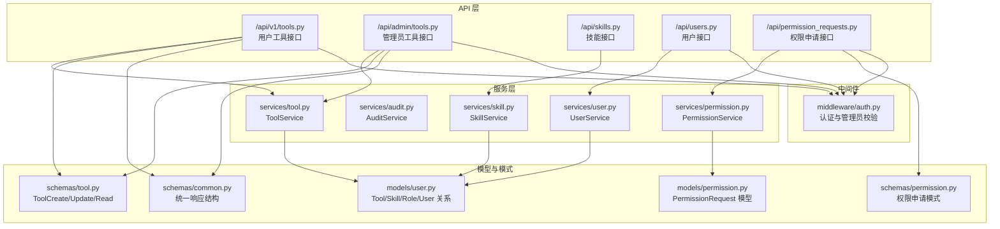
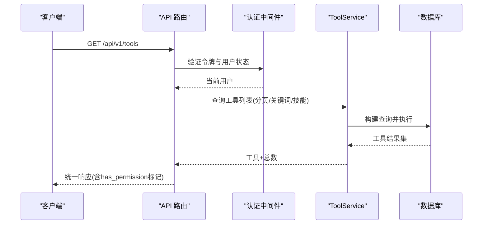
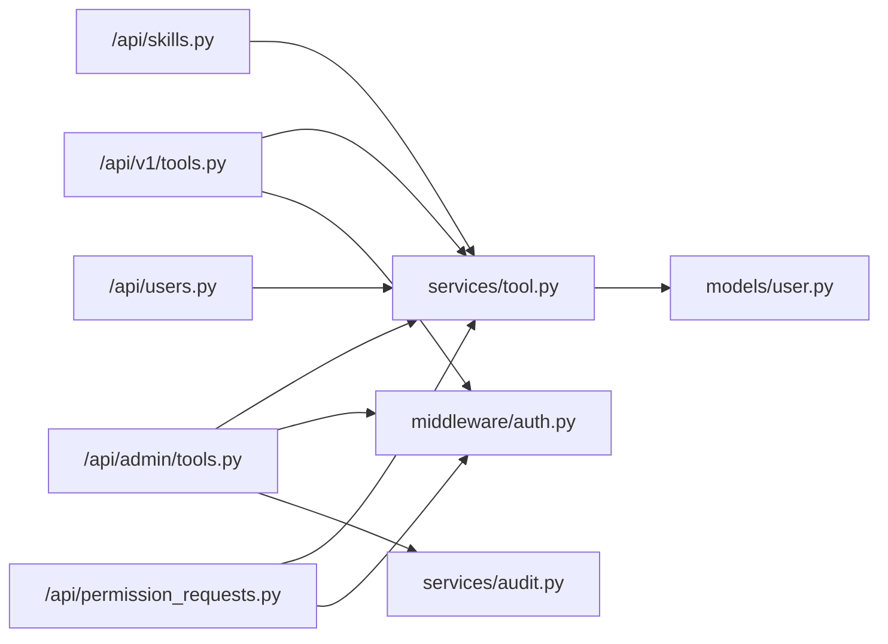
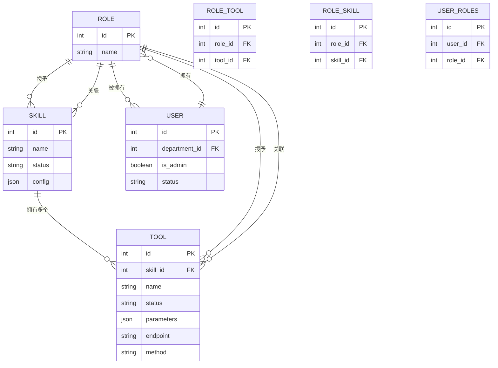

# 工具管理API

<cite>
**本文引用的文件**
- [backend/app/api/tools.py](file://backend/app/api/tools.py)
- [backend/app/api/admin/tools.py](file://backend/app/api/admin/tools.py)
- [backend/app/schemas/tool.py](file://backend/app/schemas/tool.py)
- [backend/app/services/tool.py](file://backend/app/services/tool.py)
- [backend/app/models/user.py](file://backend/app/models/user.py)
- [backend/app/middleware/auth.py](file://backend/app/middleware/auth.py)
- [backend/app/schemas/common.py](file://backend/app/schemas/common.py)
- [backend/app/api/skills.py](file://backend/app/api/skills.py)
- [backend/app/api/users.py](file://backend/app/api/users.py)
- [backend/app/api/permission_requests.py](file://backend/app/api/permission_requests.py)
- [backend/app/schemas/permission.py](file://backend/app/schemas/permission.py)
- [backend/app/services/audit.py](file://backend/app/services/audit.py)
- [backend/app/models/permission.py](file://backend/app/models/permission.py)
</cite>

## 目录
1. [简介](#简介)
2. [项目结构](#项目结构)
3. [核心组件](#核心组件)
4. [架构总览](#架构总览)
5. [详细组件分析](#详细组件分析)
6. [依赖分析](#依赖分析)
7. [性能考虑](#性能考虑)
8. [故障排查指南](#故障排查指南)
9. [结论](#结论)
10. [附录](#附录)

## 简介
本文件为 ToolHub 工具管理API的完整文档，覆盖工具信息管理接口（工具配置、状态控制、访问权限）、工具与技能的关联关系与权限传递机制、工具详情查询、批量筛选、状态更新、审计日志与权限申请流程等。文档同时说明工具数据验证、权限检查、错误处理与生命周期管理（从创建到下线）。

## 项目结构
后端采用 FastAPI + SQLAlchemy 架构，API层负责路由与请求封装，Service层负责业务逻辑，Model层定义数据库模型，Schema层定义请求/响应数据结构，Middleware提供认证与鉴权，Audit服务提供审计日志能力。

图表来源
- [backend/app/api/tools.py:1-69](file://backend/app/api/tools.py#L1-L69)
- [backend/app/api/admin/tools.py:1-89](file://backend/app/api/admin/tools.py#L1-L89)
- [backend/app/services/tool.py:1-104](file://backend/app/services/tool.py#L1-L104)
- [backend/app/models/user.py:81-98](file://backend/app/models/user.py#L81-L98)
- [backend/app/schemas/tool.py:6-51](file://backend/app/schemas/tool.py#L6-L51)
- [backend/app/schemas/common.py:17-28](file://backend/app/schemas/common.py#L17-L28)
- [backend/app/middleware/auth.py:12-44](file://backend/app/middleware/auth.py#L12-L44)
- [backend/app/api/skills.py:1-86](file://backend/app/api/skills.py#L1-L86)
- [backend/app/api/users.py:1-29](file://backend/app/api/users.py#L1-L29)
- [backend/app/api/permission_requests.py:1-107](file://backend/app/api/permission_requests.py#L1-L107)
- [backend/app/schemas/permission.py:6-56](file://backend/app/schemas/permission.py#L6-L56)
- [backend/app/models/permission.py:7-27](file://backend/app/models/permission.py#L7-L27)
- [backend/app/services/audit.py:6-54](file://backend/app/services/audit.py#L6-L54)

章节来源
- [backend/app/api/tools.py:1-69](file://backend/app/api/tools.py#L1-L69)
- [backend/app/api/admin/tools.py:1-89](file://backend/app/api/admin/tools.py#L1-L89)
- [backend/app/schemas/tool.py:6-51](file://backend/app/schemas/tool.py#L6-L51)
- [backend/app/services/tool.py:8-104](file://backend/app/services/tool.py#L8-L104)
- [backend/app/models/user.py:81-98](file://backend/app/models/user.py#L81-L98)
- [backend/app/middleware/auth.py:12-44](file://backend/app/middleware/auth.py#L12-L44)
- [backend/app/schemas/common.py:17-28](file://backend/app/schemas/common.py#L17-L28)
- [backend/app/api/skills.py:1-86](file://backend/app/api/skills.py#L1-L86)
- [backend/app/api/users.py:1-29](file://backend/app/api/users.py#L1-L29)
- [backend/app/api/permission_requests.py:1-107](file://backend/app/api/permission_requests.py#L1-L107)
- [backend/app/schemas/permission.py:6-56](file://backend/app/schemas/permission.py#L6-L56)
- [backend/app/models/permission.py:7-27](file://backend/app/models/permission.py#L7-L27)
- [backend/app/services/audit.py:6-54](file://backend/app/services/audit.py#L6-L54)

## 核心组件
- 工具API（用户侧）
  - 列表与搜索：支持分页、关键词、技能过滤、返回“是否有权限”标记
  - 详情查询：返回工具基础信息、技能关联、权限标记
- 管理员工具API
  - 列表：支持分页、关键词、技能、状态过滤
  - 创建/更新/删除：带审计日志
- 工具服务
  - 列表查询、详情查询、创建、更新、删除、用户工具ID集合计算
- 权限与审计
  - 用户认证与管理员校验中间件
  - 审计日志服务
  - 权限申请与审批流程

章节来源
- [backend/app/api/tools.py:12-69](file://backend/app/api/tools.py#L12-L69)
- [backend/app/api/admin/tools.py:14-89](file://backend/app/api/admin/tools.py#L14-L89)
- [backend/app/services/tool.py:11-100](file://backend/app/services/tool.py#L11-L100)
- [backend/app/middleware/auth.py:12-44](file://backend/app/middleware/auth.py#L12-L44)
- [backend/app/services/audit.py:9-30](file://backend/app/services/audit.py#L9-L30)

## 架构总览
工具管理API围绕“用户-角色-技能-工具”的权限链路工作，用户通过角色继承技能与工具权限；管理员可直接管理工具并记录审计日志；前端通过统一响应结构消费接口。

图表来源
- [backend/app/api/tools.py:12-42](file://backend/app/api/tools.py#L12-L42)
- [backend/app/middleware/auth.py:12-33](file://backend/app/middleware/auth.py#L12-L33)
- [backend/app/services/tool.py:12-34](file://backend/app/services/tool.py#L12-L34)

## 详细组件分析

### 用户工具接口（GET /api/v1/tools, GET /api/v1/tools/{tool_id}）
- 功能
  - 获取工具列表（含权限状态），支持分页、关键词、技能过滤
  - 获取工具详情，返回技能名称、权限标记、基础字段
- 认证与权限
  - 使用通用认证中间件，校验令牌有效性与用户状态
  - 通过工具服务计算当前用户可用工具集合，返回“has_permission”
- 响应结构
  - 统一响应包装，data 包含工具数组与分页信息
- 请求参数
  - GET /api/v1/tools
    - page/page_size：默认1/20，最小1，最大100
    - keyword：名称/描述模糊匹配
    - skill_id：按技能过滤
  - GET /api/v1/tools/{tool_id}
    - tool_id：工具ID
- 返回字段（列表项）
  - id、name、description、skill_id、skill_name、parameters、endpoint、method、status、has_permission、created_at、updated_at
- 返回字段（详情）
  - 在列表基础上增加 has_permission、created_at

章节来源
- [backend/app/api/tools.py:12-69](file://backend/app/api/tools.py#L12-L69)
- [backend/app/services/tool.py:88-100](file://backend/app/services/tool.py#L88-L100)
- [backend/app/schemas/common.py:10-28](file://backend/app/schemas/common.py#L10-L28)

### 管理员工具接口（GET/POST/PUT/DELETE /api/admin/tools）
- 功能
  - 列表：支持分页、关键词、技能、状态过滤
  - 创建：记录审计日志
  - 更新：记录审计日志
  - 删除：记录审计日志
- 权限
  - require_admin 中间件，仅管理员可访问
- 审计
  - 成功后写入审计日志，记录操作类型、目标类型、目标ID、变更详情
- 错误处理
  - 未找到工具时返回错误响应
- 请求参数
  - GET /api/admin/tools
    - page/page_size：默认1/20，最小1，最大100
    - keyword/skill_id/status：过滤条件
  - POST /api/admin/tools
    - ToolCreate：name、description、skill_id、parameters、endpoint、method
  - PUT /api/admin/tools/{tool_id}
    - ToolUpdate：name/description/skill_id/parameters/endpoint/method/status
  - DELETE /api/admin/tools/{tool_id}
    - tool_id：工具ID
- 响应
  - 统一成功/错误响应

章节来源
- [backend/app/api/admin/tools.py:14-89](file://backend/app/api/admin/tools.py#L14-L89)
- [backend/app/services/audit.py:9-30](file://backend/app/services/audit.py#L9-L30)
- [backend/app/middleware/auth.py:36-44](file://backend/app/middleware/auth.py#L36-L44)

### 工具服务（ToolService）
- 方法
  - get_tool_list：关键词/技能/状态过滤，分页查询
  - get_tool_detail：按ID查询
  - create_tool：创建工具并设置创建人
  - update_tool：按ID更新，支持部分字段
  - delete_tool：按ID删除
  - get_user_tool_ids：基于用户角色与工具状态(active)计算可用工具集合
- 复杂度
  - 列表查询为O(n)遍历与分页，过滤条件走SQL索引
  - 权限集合计算为O(R*T)，R为角色数，T为每角色工具数
- 错误处理
  - 未找到工具抛出异常，供上层捕获并返回错误响应

章节来源
- [backend/app/services/tool.py:11-100](file://backend/app/services/tool.py#L11-L100)

### 数据模型与权限传递
- 模型关系
  - Tool 与 Skill 多对一
  - Role 与 Tool/RoleTool 多对多
  - User 与 Role/RoleTool 多对多
- 权限传递
  - 用户通过角色继承技能与工具权限
  - 工具状态为 active 才计入可用集合
- 字段要点
  - Tool.status：枚举 active/inactive
  - RoleTool：角色-工具关联表

章节来源
- [backend/app/models/user.py:81-98](file://backend/app/models/user.py#L81-L98)
- [backend/app/models/user.py:109-116](file://backend/app/models/user.py#L109-L116)

### 技能与工具关联（GET /api/v1/skills/{skill_id}/tools）
- 功能
  - 获取某技能下的工具列表，并标注“是否有权限”
- 实现
  - 先查询工具列表，再结合用户工具ID集合标注权限

章节来源
- [backend/app/api/skills.py:65-86](file://backend/app/api/skills.py#L65-L86)
- [backend/app/services/tool.py:88-100](file://backend/app/services/tool.py#L88-L100)

### 用户权限与角色（GET /api/v1/users/me/permissions, GET /api/v1/users/me/roles）
- 功能
  - 获取当前用户拥有的技能与工具权限名称列表
  - 获取当前用户的角色列表
- 实现
  - 通过用户对象的关联关系读取

章节来源
- [backend/app/api/users.py:12-29](file://backend/app/api/users.py#L12-L29)

### 权限申请与审批（POST/GET/DELETE /api/v1/permission_requests）
- 功能
  - 提交权限申请（技能/工具）
  - 查看我的申请列表与详情
  - 撤销待审申请
- 数据模型
  - PermissionRequest：type/target_id/reason/status/reviewed_by等
- 响应
  - 统一响应结构，详情中补充目标名称

章节来源
- [backend/app/api/permission_requests.py:13-107](file://backend/app/api/permission_requests.py#L13-L107)
- [backend/app/models/permission.py:7-27](file://backend/app/models/permission.py#L7-L27)
- [backend/app/schemas/permission.py:6-28](file://backend/app/schemas/permission.py#L6-L28)

### 审计日志（AuditService）
- 功能
  - 记录用户操作（创建/更新/删除）到审计日志表
  - 支持按动作、目标类型、用户过滤查询
- 接口
  - log：写入一条审计日志
  - get_logs：分页查询审计日志

章节来源
- [backend/app/services/audit.py:9-51](file://backend/app/services/audit.py#L9-L51)

### 数据验证与统一响应
- 请求体验证
  - 使用 Pydantic 模式（ToolCreate/ToolUpdate/ToolRead）进行字段校验
- 统一响应
  - success_response/error_response 提供统一的 code/message/data 结构

章节来源
- [backend/app/schemas/tool.py:6-51](file://backend/app/schemas/tool.py#L6-L51)
- [backend/app/schemas/common.py:17-28](file://backend/app/schemas/common.py#L17-L28)

## 依赖分析
- 组件耦合
  - API 层依赖中间件（认证/管理员校验）、服务层、统一响应
  - 服务层依赖模型层（ORM）与审计服务
  - 权限申请接口依赖 PermissionRequest 模型与权限服务
- 外部依赖
  - FastAPI（路由与依赖注入）
  - SQLAlchemy（ORM）
  - Pydantic（数据验证）

图表来源
- [backend/app/api/tools.py:1-69](file://backend/app/api/tools.py#L1-L69)
- [backend/app/api/admin/tools.py:1-89](file://backend/app/api/admin/tools.py#L1-L89)
- [backend/app/api/skills.py:1-86](file://backend/app/api/skills.py#L1-L86)
- [backend/app/api/users.py:1-29](file://backend/app/api/users.py#L1-L29)
- [backend/app/api/permission_requests.py:1-107](file://backend/app/api/permission_requests.py#L1-L107)
- [backend/app/services/tool.py:1-104](file://backend/app/services/tool.py#L1-L104)
- [backend/app/middleware/auth.py:1-44](file://backend/app/middleware/auth.py#L1-L44)
- [backend/app/services/audit.py:1-54](file://backend/app/services/audit.py#L1-L54)
- [backend/app/models/user.py:1-116](file://backend/app/models/user.py#L1-L116)

## 性能考虑
- 分页与过滤
  - 列表接口支持分页与关键词/技能/状态过滤，建议前端合理设置 page_size，避免过大
- 权限计算
  - get_user_tool_ids 对用户所有角色遍历工具，建议控制用户角色数量或缓存常用权限集合
- 审计日志
  - 审计写入为单条插入，建议在高并发场景下评估日志表索引与写入策略

## 故障排查指南
- 认证失败
  - 现象：401 无效或过期令牌、用户不存在、账户非激活
  - 排查：确认令牌格式与有效期，检查用户状态
- 权限不足
  - 现象：403 管理员访问受限
  - 排查：确认当前用户 is_admin 标记
- 工具不存在
  - 现象：更新/删除时报错
  - 排查：确认 tool_id 是否正确，是否存在
- 审计日志缺失
  - 现象：管理员操作未记录
  - 排查：确认审计服务调用与数据库提交

章节来源
- [backend/app/middleware/auth.py:18-32](file://backend/app/middleware/auth.py#L18-L32)
- [backend/app/middleware/auth.py:39-43](file://backend/app/middleware/auth.py#L39-L43)
- [backend/app/services/tool.py:57-86](file://backend/app/services/tool.py#L57-L86)
- [backend/app/services/audit.py:9-30](file://backend/app/services/audit.py#L9-L30)

## 结论
ToolHub 的工具管理API以清晰的权限链路与统一响应为基础，提供用户侧工具浏览与管理员侧全量管理能力。通过技能-工具-角色-用户的层级关系实现权限传递，配合审计日志与权限申请流程，形成完整的生命周期闭环。建议在高并发场景优化权限计算与日志写入，并持续完善前端交互与错误提示。

## 附录

### API 定义与使用示例

- 获取工具列表（用户侧）
  - 方法与路径：GET /api/v1/tools
  - 查询参数：
    - page: 整数，默认1，最小1
    - page_size: 整数，默认20，范围[1,100]
    - keyword: 字符串，名称/描述模糊匹配
    - skill_id: 整数，按技能过滤
  - 返回：统一响应，data.items 为工具数组，包含 has_permission 标记
  - 使用场景：门户首页展示、技能页工具聚合

- 获取工具详情（用户侧）
  - 方法与路径：GET /api/v1/tools/{tool_id}
  - 路径参数：tool_id
  - 返回：统一响应，data 为工具详情，包含 has_permission 标记
  - 使用场景：工具卡片点击查看详情

- 获取工具列表（管理员侧）
  - 方法与路径：GET /api/admin/tools
  - 查询参数：
    - page/page_size：同上
    - keyword/skill_id/status：过滤条件
  - 返回：统一响应，data.items 为工具数组（含创建人、创建时间等）
  - 使用场景：后台管理面板

- 创建工具（管理员侧）
  - 方法与路径：POST /api/admin/tools
  - 请求体：ToolCreate（name/description/skill_id/parameters/endpoint/method）
  - 返回：统一响应，记录审计日志
  - 使用场景：新增工具配置

- 更新工具（管理员侧）
  - 方法与路径：PUT /api/admin/tools/{tool_id}
  - 路径参数：tool_id
  - 请求体：ToolUpdate（支持部分字段）
  - 返回：统一响应，记录审计日志
  - 使用场景：修改工具端点、参数、状态

- 删除工具（管理员侧）
  - 方法与路径：DELETE /api/admin/tools/{tool_id}
  - 路径参数：tool_id
  - 返回：统一响应，记录审计日志
  - 使用场景：下线不再使用的工具

- 获取技能下的工具列表
  - 方法与路径：GET /api/v1/skills/{skill_id}/tools
  - 路径参数：skill_id
  - 返回：工具数组，包含 has_permission 标记
  - 使用场景：技能详情页展示工具清单

- 获取当前用户权限
  - 方法与路径：GET /api/v1/users/me/permissions
  - 返回：skills/tools 名称数组
  - 使用场景：前端动态渲染权限菜单

- 获取当前用户角色
  - 方法与路径：GET /api/v1/users/me/roles
  - 返回：角色列表
  - 使用场景：角色管理与权限溯源

- 提交权限申请
  - 方法与路径：POST /api/v1/permission_requests
  - 请求体：PermissionRequestCreate（type/target_id/reason）
  - 返回：统一响应，包含申请ID与初始状态
  - 使用场景：普通用户申请技能/工具权限

- 我的权限申请列表
  - 方法与路径：GET /api/v1/permission_requests
  - 查询参数：page/page_size
  - 返回：申请列表（含目标名称）
  - 使用场景：查看历史与进度

- 权限申请详情
  - 方法与路径：GET /api/v1/permission_requests/{request_id}
  - 路径参数：request_id
  - 返回：申请详情（含目标名称）
  - 使用场景：查看详情与审批意见

- 撤销权限申请
  - 方法与路径：DELETE /api/v1/permission_requests/{request_id}
  - 路径参数：request_id
  - 返回：统一响应
  - 使用场景：取消未处理的申请

### 数据模型图（工具、技能、角色、用户）

图表来源
- [backend/app/models/user.py:65-98](file://backend/app/models/user.py#L65-L98)
- [backend/app/models/user.py:100-116](file://backend/app/models/user.py#L100-L116)