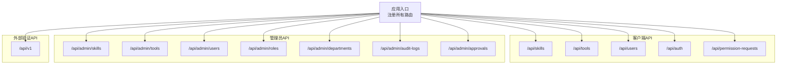
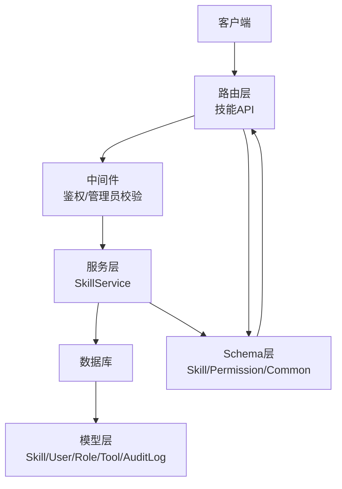
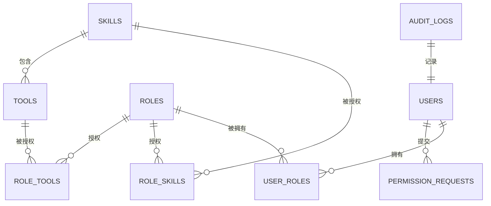
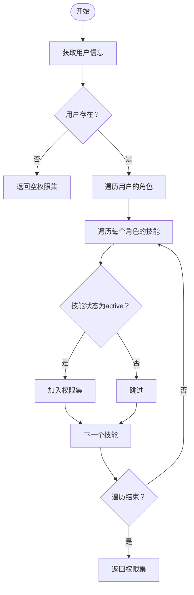
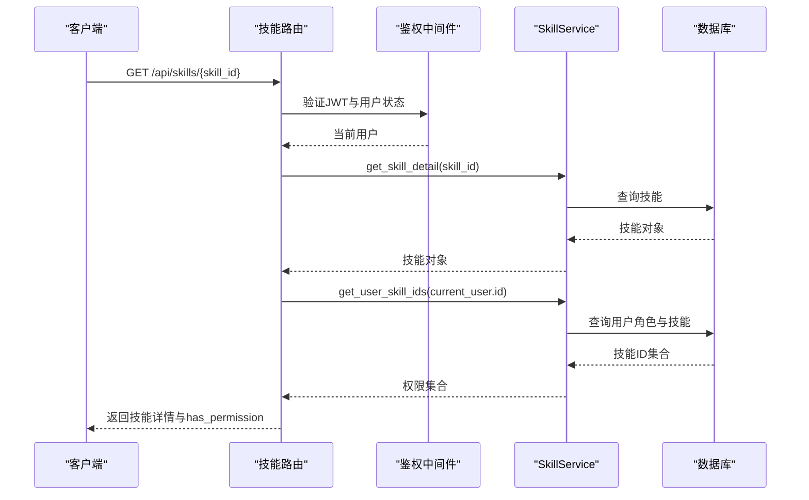

# 技能管理API

<cite>
**本文引用的文件**
- [backend/app/main.py](file://backend/app/main.py)
- [backend/app/api/skills.py](file://backend/app/api/skills.py)
- [backend/app/api/admin/skills.py](file://backend/app/api/admin/skills.py)
- [backend/app/api/permission_requests.py](file://backend/app/api/permission_requests.py)
- [backend/app/middleware/auth.py](file://backend/app/middleware/auth.py)
- [backend/app/services/skill.py](file://backend/app/services/skill.py)
- [backend/app/models/user.py](file://backend/app/models/user.py)
- [backend/app/schemas/skill.py](file://backend/app/schemas/skill.py)
- [backend/app/schemas/common.py](file://backend/app/schemas/common.py)
- [backend/app/schemas/permission.py](file://backend/app/schemas/permission.py)
- [backend/app/models/audit.py](file://backend/app/models/audit.py)
</cite>

## 目录
1. [简介](#简介)
2. [项目结构](#项目结构)
3. [核心组件](#核心组件)
4. [架构总览](#架构总览)
5. [详细组件分析](#详细组件分析)
6. [依赖分析](#依赖分析)
7. [性能考虑](#性能考虑)
8. [故障排查指南](#故障排查指南)
9. [结论](#结论)
10. [附录](#附录)

## 简介
本文件为ToolHub技能管理API的权威文档，覆盖技能信息的增删改查、权限配置、搜索筛选排序、权限验证与审计日志等能力。文档同时说明技能与用户权限的关联关系、权限验证机制、以及技能详情与工具列表等辅助接口。每个接口均提供请求路径、参数、响应格式与典型使用说明，帮助开发者快速集成。

## 项目结构
后端采用FastAPI框架，路由按功能模块划分：
- 客户端API：/api/skills（技能）、/api/tools（工具）、/api/users（用户）、/api/auth（认证）、/api/permission-requests（权限申请）
- 管理员API：/api/admin/skills（技能管理）、/api/admin/tools（工具管理）、/api/admin/users（用户管理）、/api/admin/roles（角色管理）、/api/admin/departments（部门管理）、/api/admin/audit-logs（审计日志）、/api/admin/approvals（审批）
- 外部验证API：/api/v1（权限验证）

图表来源
- [backend/app/main.py:25-42](file://backend/app/main.py#L25-L42)

章节来源
- [backend/app/main.py:9-48](file://backend/app/main.py#L9-L48)

## 核心组件
- 路由层：定义技能相关接口，包括列表、详情、技能下工具列表、权限申请等
- 中间件：鉴权与管理员权限校验
- 服务层：封装数据库操作与业务逻辑（技能CRUD、用户技能权限查询）
- 模型层：技能、工具、用户、角色、权限申请、审计日志等实体
- Schema层：请求/响应数据模型与分页模型
- 审计：管理员操作记录

章节来源
- [backend/app/api/skills.py:13-86](file://backend/app/api/skills.py#L13-L86)
- [backend/app/api/admin/skills.py:14-85](file://backend/app/api/admin/skills.py#L14-L85)
- [backend/app/middleware/auth.py:12-44](file://backend/app/middleware/auth.py#L12-L44)
- [backend/app/services/skill.py:8-92](file://backend/app/services/skill.py#L8-L92)
- [backend/app/models/user.py:65-98](file://backend/app/models/user.py#L65-L98)
- [backend/app/schemas/skill.py:6-45](file://backend/app/schemas/skill.py#L6-L45)
- [backend/app/schemas/common.py:5-29](file://backend/app/schemas/common.py#L5-L29)
- [backend/app/schemas/permission.py:6-56](file://backend/app/schemas/permission.py#L6-L56)
- [backend/app/models/audit.py:6-16](file://backend/app/models/audit.py#L6-L16)

## 架构总览
技能管理API遵循“路由-中间件-服务-模型-Schema”的分层设计，权限通过JWT令牌解析与用户状态校验，管理员权限通过require_admin装饰器强制校验。

图表来源
- [backend/app/api/skills.py:13-86](file://backend/app/api/skills.py#L13-L86)
- [backend/app/middleware/auth.py:12-44](file://backend/app/middleware/auth.py#L12-L44)
- [backend/app/services/skill.py:8-92](file://backend/app/services/skill.py#L8-L92)
- [backend/app/models/user.py:23-98](file://backend/app/models/user.py#L23-L98)
- [backend/app/schemas/skill.py:6-45](file://backend/app/schemas/skill.py#L6-L45)
- [backend/app/schemas/common.py:17-29](file://backend/app/schemas/common.py#L17-L29)
- [backend/app/schemas/permission.py:6-56](file://backend/app/schemas/permission.py#L6-L56)
- [backend/app/models/audit.py:6-16](file://backend/app/models/audit.py#L6-L16)

## 详细组件分析

### 技能列表（客户端）
- 路径：GET /api/skills
- 权限：登录用户（携带有效JWT）
- 查询参数：
  - page：页码（>=1）
  - page_size：每页数量（1~100）
  - keyword：关键词（支持名称/描述模糊匹配）
- 响应字段：
  - items：技能数组，包含id、name、description、config、status、has_permission、tool_count、created_at、updated_at
  - total、page、page_size
- 关键逻辑：
  - 调用服务层获取技能列表与总数
  - 获取当前用户具备权限的技能ID集合，计算has_permission
  - 计算tool_count为技能下工具数量

章节来源
- [backend/app/api/skills.py:13-41](file://backend/app/api/skills.py#L13-L41)
- [backend/app/services/skill.py:12-31](file://backend/app/services/skill.py#L12-L31)
- [backend/app/services/skill.py:77-88](file://backend/app/services/skill.py#L77-L88)
- [backend/app/schemas/common.py:10-15](file://backend/app/schemas/common.py#L10-L15)

### 技能详情（客户端）
- 路径：GET /api/skills/{skill_id}
- 权限：登录用户
- 响应字段：
  - id、name、description、config、status、has_permission、created_at
- 关键逻辑：
  - 获取技能详情
  - 计算has_permission

章节来源
- [backend/app/api/skills.py:43-62](file://backend/app/api/skills.py#L43-L62)
- [backend/app/services/skill.py:34-35](file://backend/app/services/skill.py#L34-L35)
- [backend/app/services/skill.py:77-88](file://backend/app/services/skill.py#L77-L88)

### 技能下工具列表（客户端）
- 路径：GET /api/skills/{skill_id}/tools
- 权限：登录用户
- 响应字段：工具数组，包含id、name、description、has_permission、status
- 关键逻辑：
  - 获取技能下工具列表
  - 计算has_permission（基于用户具备权限的工具集合）

章节来源
- [backend/app/api/skills.py:65-86](file://backend/app/api/skills.py#L65-L86)
- [backend/app/api/tools.py](file://backend/app/api/tools.py)

### 技能列表（管理员）
- 路径：GET /api/admin/skills
- 权限：管理员
- 查询参数：
  - page、page_size、keyword、status
- 响应字段：
  - items：技能数组，包含id、name、description、config、status、tool_count、created_by、created_at、updated_at
  - total、page、page_size

章节来源
- [backend/app/api/admin/skills.py:14-38](file://backend/app/api/admin/skills.py#L14-L38)
- [backend/app/services/skill.py:12-31](file://backend/app/services/skill.py#L12-L31)

### 创建技能（管理员）
- 路径：POST /api/admin/skills
- 权限：管理员
- 请求体：SkillCreate（name、description、config）
- 响应：成功返回新建技能的id与name；失败返回错误信息
- 审计：记录create操作

章节来源
- [backend/app/api/admin/skills.py:41-54](file://backend/app/api/admin/skills.py#L41-L54)
- [backend/app/services/skill.py:38-48](file://backend/app/services/skill.py#L38-L48)
- [backend/app/models/audit.py:6-16](file://backend/app/models/audit.py#L6-L16)

### 更新技能（管理员）
- 路径：PUT /api/admin/skills/{skill_id}
- 权限：管理员
- 请求体：SkillUpdate（name、description、config、status）
- 响应：成功返回提示；失败返回错误信息
- 审计：记录update操作及变更详情

章节来源
- [backend/app/api/admin/skills.py:56-70](file://backend/app/api/admin/skills.py#L56-L70)
- [backend/app/services/skill.py:51-65](file://backend/app/services/skill.py#L51-L65)
- [backend/app/models/audit.py:6-16](file://backend/app/models/audit.py#L6-L16)

### 删除技能（管理员）
- 路径：DELETE /api/admin/skills/{skill_id}
- 权限：管理员
- 响应：成功返回提示；失败返回错误信息
- 审计：记录delete操作

章节来源
- [backend/app/api/admin/skills.py:72-85](file://backend/app/api/admin/skills.py#L72-L85)
- [backend/app/services/skill.py:68-74](file://backend/app/services/skill.py#L68-L74)
- [backend/app/models/audit.py:6-16](file://backend/app/models/audit.py#L6-L16)

### 权限申请（客户端）
- 提交申请：POST /api/permission-requests
  - 权限：登录用户
  - 请求体：PermissionRequestCreate（type: skill|tool, target_id, reason）
  - 响应：返回申请id与初始状态
- 我的申请列表：GET /api/permission-requests
  - 分页参数：page、page_size
  - 响应：items包含type、target_id、target_name、reason、status、reviewed_at、created_at
- 申请详情：GET /api/permission-requests/{request_id}
  - 响应：单条申请详情
- 撤销申请：DELETE /api/permission-requests/{request_id}
  - 响应：成功提示

章节来源
- [backend/app/api/permission_requests.py:13-107](file://backend/app/api/permission_requests.py#L13-L107)
- [backend/app/schemas/permission.py:6-29](file://backend/app/schemas/permission.py#L6-L29)

### 权限验证（外部验证）
- 路径：/api/v1（外部验证API，用于校验用户对技能/工具的权限）
- 请求体：PermissionVerifyRequest（user_id、type、target_name）
- 响应体：PermissionVerifyResponse（allowed、user_id、type、target_name、reason）

章节来源
- [backend/app/api/v1/verify.py](file://backend/app/api/v1/verify.py)
- [backend/app/schemas/permission.py:35-48](file://backend/app/schemas/permission.py#L35-L48)

## 依赖分析

### 数据模型关系
技能、工具、用户、角色、权限申请、审计日志之间的关系如下：

图表来源
- [backend/app/models/user.py:23-116](file://backend/app/models/user.py#L23-L116)
- [backend/app/models/audit.py:6-16](file://backend/app/models/audit.py#L6-L16)

### 技能权限计算流程
用户具备的技能权限由其角色授予，且仅统计状态为“active”的技能。

图表来源
- [backend/app/services/skill.py:77-88](file://backend/app/services/skill.py#L77-L88)

### 接口调用时序（技能详情）

图表来源
- [backend/app/api/skills.py:43-62](file://backend/app/api/skills.py#L43-L62)
- [backend/app/middleware/auth.py:12-33](file://backend/app/middleware/auth.py#L12-L33)
- [backend/app/services/skill.py:34-35](file://backend/app/services/skill.py#L34-L35)
- [backend/app/services/skill.py:77-88](file://backend/app/services/skill.py#L77-L88)

## 性能考虑
- 列表查询建议合理设置page_size，避免过大导致内存压力
- 关键查询已使用分页与条件过滤，建议在高并发场景启用数据库连接池与索引优化
- has_permission与tool_count计算在服务层完成，注意在大数据量时的N+1问题，可考虑预加载或批量查询优化

## 故障排查指南
- 401 未授权：检查请求头Authorization是否携带有效JWT
- 403 禁止访问：确认用户状态为active，管理员接口需管理员权限
- 404 资源不存在：技能/工具/申请ID无效
- 业务异常：技能更新/删除时若技能不存在会抛出错误，需捕获并返回错误响应

章节来源
- [backend/app/middleware/auth.py:18-32](file://backend/app/middleware/auth.py#L18-L32)
- [backend/app/api/admin/skills.py:68-69](file://backend/app/api/admin/skills.py#L68-L69)
- [backend/app/api/admin/skills.py:83](file://backend/app/api/admin/skills.py#L83)

## 结论
技能管理API提供了从客户端到管理员的完整能力矩阵，结合权限申请与验证机制，实现了对技能与工具的精细化权限控制。通过清晰的分层设计与统一的响应模型，便于扩展与维护。

## 附录

### 响应通用结构
- 成功响应：code=0，message="success"，data为具体数据
- 错误响应：code为负数，message为错误信息，data可选

章节来源
- [backend/app/schemas/common.py:17-29](file://backend/app/schemas/common.py#L17-L29)

### 数据模型要点
- 技能：唯一名称，JSON配置，状态枚举（active/inactive），外键创建人
- 工具：属于技能，JSON参数定义，HTTP端点与方法，状态枚举
- 用户：状态枚举，管理员标记，多角色关联
- 角色：多用户、多技能、多工具授权
- 权限申请：类型（skill/tool）、目标ID、状态（pending/approved/rejected/cancelled）、审批人与时间
- 审计日志：操作类型、目标类型与ID、详情、IP、时间

章节来源
- [backend/app/models/user.py:65-116](file://backend/app/models/user.py#L65-L116)
- [backend/app/schemas/permission.py:12-29](file://backend/app/schemas/permission.py#L12-L29)
- [backend/app/models/audit.py:6-16](file://backend/app/models/audit.py#L6-L16)