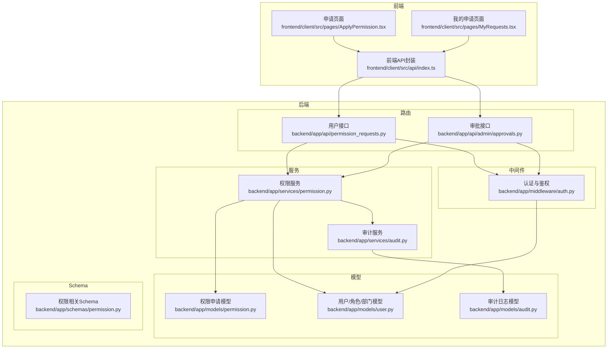
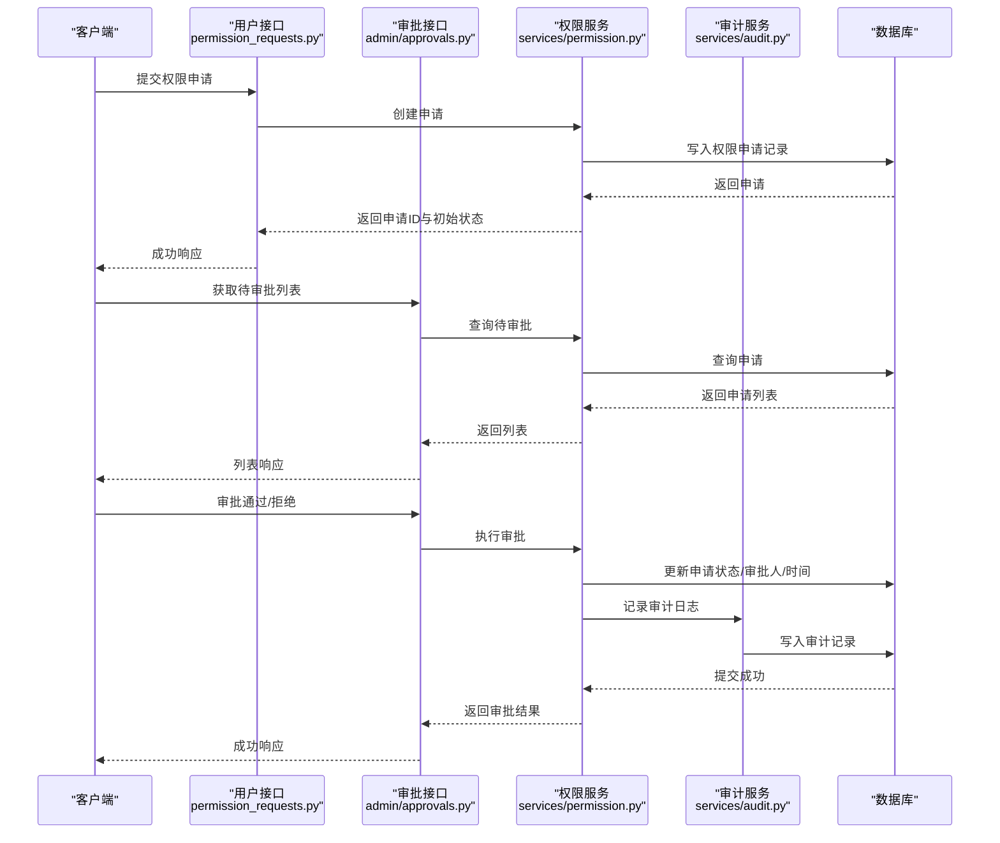
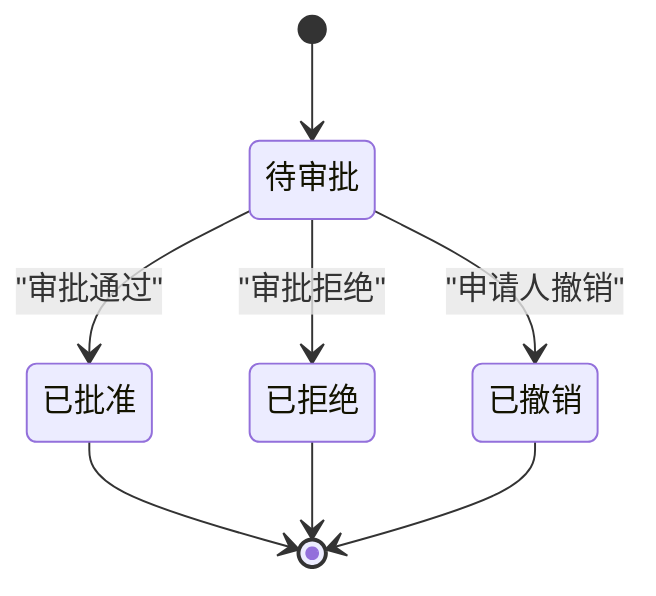
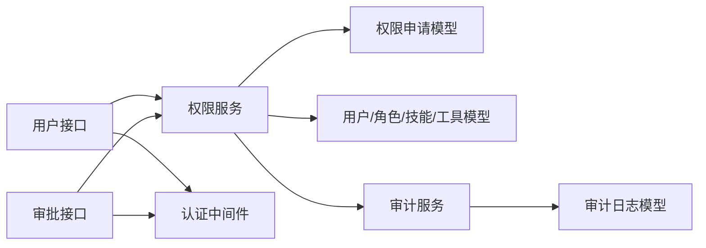

# 权限申请API

<cite>
**本文引用的文件**
- [backend/app/api/permission_requests.py](file://backend/app/api/permission_requests.py)
- [backend/app/api/admin/approvals.py](file://backend/app/api/admin/approvals.py)
- [backend/app/services/permission.py](file://backend/app/services/permission.py)
- [backend/app/models/permission.py](file://backend/app/models/permission.py)
- [backend/app/models/user.py](file://backend/app/models/user.py)
- [backend/app/schemas/permission.py](file://backend/app/schemas/permission.py)
- [backend/app/middleware/auth.py](file://backend/app/middleware/auth.py)
- [backend/app/services/audit.py](file://backend/app/services/audit.py)
- [backend/app/models/audit.py](file://backend/app/models/audit.py)
- [frontend/client/src/api/index.ts](file://frontend/client/src/api/index.ts)
- [frontend/client/src/pages/ApplyPermission.tsx](file://frontend/client/src/pages/ApplyPermission.tsx)
- [frontend/client/src/pages/MyRequests.tsx](file://frontend/client/src/pages/MyRequests.tsx)
</cite>

## 目录
1. [简介](#简介)
2. [项目结构](#项目结构)
3. [核心组件](#核心组件)
4. [架构总览](#架构总览)
5. [详细组件分析](#详细组件分析)
6. [依赖分析](#依赖分析)
7. [性能考虑](#性能考虑)
8. [故障排查指南](#故障排查指南)
9. [结论](#结论)
10. [附录](#附录)

## 简介
本文件为ToolHub权限申请API的权威文档，覆盖从“申请提交”到“审批完成”的全流程设计，包括：
- 权限申请的创建、查询、撤销等接口
- 审批管理接口（列表、审批通过、审批拒绝）
- 权限申请状态机设计与流转
- 与用户权限、技能/工具的关联关系
- 高级能力：批量申请、历史查询、统计分析建议
- 审核流程、审计日志与通知机制的实现要点
- 每个接口的使用示例与最佳实践

## 项目结构
围绕权限申请API的关键文件组织如下：
- 路由层：用户侧接口与管理员侧接口分别位于独立模块
- 服务层：统一的权限申请业务逻辑封装
- 模型层：权限申请、用户、角色、技能、工具、审计日志等数据模型
- Schema层：请求/响应数据结构定义
- 中间件：认证与鉴权
- 前端：调用示例与页面交互

图表来源
- [backend/app/api/permission_requests.py:1-107](file://backend/app/api/permission_requests.py#L1-L107)
- [backend/app/api/admin/approvals.py:1-88](file://backend/app/api/admin/approvals.py#L1-L88)
- [backend/app/services/permission.py:1-182](file://backend/app/services/permission.py#L1-L182)
- [backend/app/models/permission.py:1-28](file://backend/app/models/permission.py#L1-L28)
- [backend/app/models/user.py:1-116](file://backend/app/models/user.py#L1-L116)
- [backend/app/schemas/permission.py:1-56](file://backend/app/schemas/permission.py#L1-L56)
- [backend/app/middleware/auth.py:1-45](file://backend/app/middleware/auth.py#L1-L45)
- [backend/app/services/audit.py:1-54](file://backend/app/services/audit.py#L1-L54)
- [backend/app/models/audit.py:1-17](file://backend/app/models/audit.py#L1-L17)
- [frontend/client/src/api/index.ts:1-36](file://frontend/client/src/api/index.ts#L1-L36)
- [frontend/client/src/pages/ApplyPermission.tsx:1-71](file://frontend/client/src/pages/ApplyPermission.tsx#L1-L71)
- [frontend/client/src/pages/MyRequests.tsx:1-56](file://frontend/client/src/pages/MyRequests.tsx#L1-L56)

章节来源
- [backend/app/api/permission_requests.py:1-107](file://backend/app/api/permission_requests.py#L1-L107)
- [backend/app/api/admin/approvals.py:1-88](file://backend/app/api/admin/approvals.py#L1-L88)
- [backend/app/services/permission.py:1-182](file://backend/app/services/permission.py#L1-L182)
- [backend/app/models/permission.py:1-28](file://backend/app/models/permission.py#L1-L28)
- [backend/app/models/user.py:1-116](file://backend/app/models/user.py#L1-L116)
- [backend/app/schemas/permission.py:1-56](file://backend/app/schemas/permission.py#L1-L56)
- [backend/app/middleware/auth.py:1-45](file://backend/app/middleware/auth.py#L1-L45)
- [backend/app/services/audit.py:1-54](file://backend/app/services/audit.py#L1-L54)
- [backend/app/models/audit.py:1-17](file://backend/app/models/audit.py#L1-L17)
- [frontend/client/src/api/index.ts:1-36](file://frontend/client/src/api/index.ts#L1-L36)
- [frontend/client/src/pages/ApplyPermission.tsx:1-71](file://frontend/client/src/pages/ApplyPermission.tsx#L1-L71)
- [frontend/client/src/pages/MyRequests.tsx:1-56](file://frontend/client/src/pages/MyRequests.tsx#L1-L56)

## 核心组件
- 用户侧权限申请接口：提交申请、查询我的申请、撤销申请
- 管理员侧审批接口：审批列表、审批通过、审批拒绝
- 权限服务：申请创建、查询、撤销、审批通过/拒绝、权限校验
- 数据模型：权限申请、用户/角色/技能/工具、审计日志
- 认证与鉴权：基于Token的用户获取与管理员校验
- 审计日志：对审批动作进行记录

章节来源
- [backend/app/api/permission_requests.py:13-107](file://backend/app/api/permission_requests.py#L13-L107)
- [backend/app/api/admin/approvals.py:14-88](file://backend/app/api/admin/approvals.py#L14-L88)
- [backend/app/services/permission.py:9-182](file://backend/app/services/permission.py#L9-L182)
- [backend/app/models/permission.py:7-28](file://backend/app/models/permission.py#L7-L28)
- [backend/app/models/user.py:23-116](file://backend/app/models/user.py#L23-L116)
- [backend/app/schemas/permission.py:6-56](file://backend/app/schemas/permission.py#L6-L56)
- [backend/app/middleware/auth.py:12-44](file://backend/app/middleware/auth.py#L12-L44)
- [backend/app/services/audit.py:6-54](file://backend/app/services/audit.py#L6-L54)

## 架构总览
下图展示权限申请从提交到审批完成的整体流程，以及与用户权限、技能/工具、审计日志的关系。

图表来源
- [backend/app/api/permission_requests.py:13-107](file://backend/app/api/permission_requests.py#L13-L107)
- [backend/app/api/admin/approvals.py:14-88](file://backend/app/api/admin/approvals.py#L14-L88)
- [backend/app/services/permission.py:12-144](file://backend/app/services/permission.py#L12-L144)
- [backend/app/services/audit.py:10-30](file://backend/app/services/audit.py#L10-L30)

## 详细组件分析

### 权限申请状态机
权限申请状态包括：待审批、已批准、已拒绝、已撤销。状态转换规则如下：
- 待审批：新提交的申请初始状态
- 已批准：管理员审批通过，系统自动为用户授予对应权限（技能或工具）
- 已拒绝：管理员拒绝申请
- 已撤销：申请人仅在待审批状态下可撤销

图表来源
- [backend/app/models/permission.py:15-19](file://backend/app/models/permission.py#L15-L19)
- [backend/app/services/permission.py:86-144](file://backend/app/services/permission.py#L86-L144)

章节来源
- [backend/app/models/permission.py:15-19](file://backend/app/models/permission.py#L15-L19)
- [backend/app/services/permission.py:86-144](file://backend/app/services/permission.py#L86-L144)

### 用户侧接口

#### 提交权限申请
- 方法与路径：POST /permission-requests
- 功能：为当前登录用户提交权限申请（技能或工具）
- 请求体字段：
  - type: "skill" 或 "tool"
  - target_id: 技能或工具的ID
  - reason: 可选，申请理由
- 响应：返回申请ID与初始状态
- 限制：
  - 同一用户对同一目标的“待审批”申请不可重复提交
  - 目标必须存在且有效
- 错误码：400（参数错误/重复申请/目标不存在），401/403（未登录/非活跃用户）

章节来源
- [backend/app/api/permission_requests.py:13-25](file://backend/app/api/permission_requests.py#L13-L25)
- [backend/app/services/permission.py:12-44](file://backend/app/services/permission.py#L12-L44)
- [backend/app/schemas/permission.py:6-10](file://backend/app/schemas/permission.py#L6-L10)
- [backend/app/middleware/auth.py:12-33](file://backend/app/middleware/auth.py#L12-L33)

#### 查询我的申请
- 方法与路径：GET /permission-requests
- 功能：分页查询当前用户的申请列表
- 查询参数：
  - page/page_size：分页控制（page≥1，page_size∈[1,100]）
- 响应字段：
  - items：申请列表，包含类型、目标名称、状态、审批备注、时间戳等
  - total/page/page_size：分页信息
- 注意：目标名称通过关联查询技能/工具名称填充

章节来源
- [backend/app/api/permission_requests.py:27-59](file://backend/app/api/permission_requests.py#L27-L59)
- [backend/app/services/permission.py:46-55](file://backend/app/services/permission.py#L46-L55)

#### 申请详情
- 方法与路径：GET /permission-requests/{request_id}
- 功能：获取指定申请的详情
- 参数：request_id
- 响应：包含类型、目标名称、状态、审批备注、时间戳等
- 错误：当申请不属于当前用户时返回错误

章节来源
- [backend/app/api/permission_requests.py:62-92](file://backend/app/api/permission_requests.py#L62-L92)
- [backend/app/services/permission.py:46-55](file://backend/app/services/permission.py#L46-L55)

#### 撤销申请
- 方法与路径：DELETE /permission-requests/{request_id}
- 功能：撤销“待审批”中的申请
- 限制：仅“待审批”状态可撤销；否则返回错误
- 响应：成功消息

章节来源
- [backend/app/api/permission_requests.py:95-107](file://backend/app/api/permission_requests.py#L95-L107)
- [backend/app/services/permission.py:58-69](file://backend/app/services/permission.py#L58-L69)

### 管理员侧接口

#### 获取待审批列表
- 方法与路径：GET /admin/approvals
- 功能：分页获取所有待审批的权限申请
- 查询参数：
  - page/page_size：分页
  - status：可选过滤条件（用于按状态筛选）
- 响应：包含申请人、目标名称、状态、审批人、时间戳等

章节来源
- [backend/app/api/admin/approvals.py:14-55](file://backend/app/api/admin/approvals.py#L14-L55)
- [backend/app/services/permission.py:72-83](file://backend/app/services/permission.py#L72-L83)

#### 审批通过
- 方法与路径：PUT /admin/approvals/{request_id}/approve
- 功能：将指定申请标记为“已批准”，并自动为用户授予对应权限
- 请求体：comment（可选，审批备注）
- 审批通过逻辑：
  - 将申请状态置为“已批准”
  - 记录审批人、审批时间、备注
  - 自动为用户授予对应技能或工具权限（若用户角色中尚未包含该权限）
- 审计：记录“approve”动作

章节来源
- [backend/app/api/admin/approvals.py:58-72](file://backend/app/api/admin/approvals.py#L58-L72)
- [backend/app/services/permission.py:86-128](file://backend/app/services/permission.py#L86-L128)
- [backend/app/services/audit.py:10-30](file://backend/app/services/audit.py#L10-L30)

#### 审批拒绝
- 方法与路径：PUT /admin/approvals/{request_id}/reject
- 功能：将指定申请标记为“已拒绝”
- 请求体：comment（可选，审批备注）
- 审计：记录“reject”动作

章节来源
- [backend/app/api/admin/approvals.py:74-88](file://backend/app/api/admin/approvals.py#L74-L88)
- [backend/app/services/permission.py:131-144](file://backend/app/services/permission.py#L131-L144)
- [backend/app/services/audit.py:10-30](file://backend/app/services/audit.py#L10-L30)

### 权限校验与关联关系
- 关联关系：
  - 用户与权限申请：一对多
  - 权限申请与技能/工具：多对一（type+target_id）
  - 审批人：权限申请可关联到审批人用户
- 权限校验：
  - 服务提供“verify_permission”接口，根据用户、类型（技能/工具）与目标名称判断是否拥有权限
  - 仅当用户状态为“active”且目标状态为“active”时才视为有效

章节来源
- [backend/app/models/permission.py:26-27](file://backend/app/models/permission.py#L26-L27)
- [backend/app/models/user.py:39](file://backend/app/models/user.py#L39)
- [backend/app/services/permission.py:147-164](file://backend/app/services/permission.py#L147-L164)

### 审计日志与通知机制
- 审计日志：
  - 审批通过/拒绝后写入审计记录，包含操作人、动作、目标类型与ID、详情（含评论）、时间等
- 通知机制：
  - 当前代码未内置通知发送逻辑，可在审批完成后扩展通知渠道（邮件/IM等）

章节来源
- [backend/app/services/audit.py:10-50](file://backend/app/services/audit.py#L10-L50)
- [backend/app/models/audit.py:6-17](file://backend/app/models/audit.py#L6-L17)
- [backend/app/api/admin/approvals.py:68](file://backend/app/api/admin/approvals.py#L68)
- [backend/app/api/admin/approvals.py:84](file://backend/app/api/admin/approvals.py#L84)

### 前端集成示例
- 提交申请：前端通过API封装调用“创建申请”，并在成功后提示用户
- 我的申请：前端分页加载申请列表，并支持在“待审批”状态下撤销
- 页面组件：
  - 申请页面：动态加载技能/工具列表，提交申请
  - 我的申请页面：展示状态标签、审批备注、撤销按钮

章节来源
- [frontend/client/src/api/index.ts:24-30](file://frontend/client/src/api/index.ts#L24-L30)
- [frontend/client/src/pages/ApplyPermission.tsx:21-36](file://frontend/client/src/pages/ApplyPermission.tsx#L21-L36)
- [frontend/client/src/pages/MyRequests.tsx:13-29](file://frontend/client/src/pages/MyRequests.tsx#L13-L29)

## 依赖分析
- 组件耦合：
  - 路由层依赖服务层；服务层依赖模型层与审计服务；审计服务依赖审计模型
  - 认证中间件贯穿用户侧与管理员侧接口
- 外部依赖：
  - SQLAlchemy ORM、FastAPI、Pydantic
- 潜在循环依赖：
  - 服务层内部通过延迟导入避免循环依赖（如默认角色创建）

图表来源
- [backend/app/api/permission_requests.py:1-10](file://backend/app/api/permission_requests.py#L1-L10)
- [backend/app/api/admin/approvals.py:1-11](file://backend/app/api/admin/approvals.py#L1-L11)
- [backend/app/services/permission.py:1-7](file://backend/app/services/permission.py#L1-L7)
- [backend/app/services/audit.py:1-4](file://backend/app/services/audit.py#L1-L4)
- [backend/app/middleware/auth.py:1-8](file://backend/app/middleware/auth.py#L1-L8)

章节来源
- [backend/app/api/permission_requests.py:1-10](file://backend/app/api/permission_requests.py#L1-L10)
- [backend/app/api/admin/approvals.py:1-11](file://backend/app/api/admin/approvals.py#L1-L11)
- [backend/app/services/permission.py:1-7](file://backend/app/services/permission.py#L1-L7)
- [backend/app/services/audit.py:1-4](file://backend/app/services/audit.py#L1-L4)
- [backend/app/middleware/auth.py:1-8](file://backend/app/middleware/auth.py#L1-L8)

## 性能考虑
- 分页查询：列表接口均支持分页，建议前端按需加载，避免一次性拉取过多数据
- 关联查询：详情与列表中对技能/工具名称的查询可考虑缓存或预加载策略
- 审批通过自动授权：在高并发场景下，建议对用户角色与权限映射进行幂等检查，避免重复写入
- 审计日志：审计写入为顺序I/O，建议在高峰期关注数据库写入压力

## 故障排查指南
- 常见错误与原因：
  - 401/403：Token无效、过期或用户非活跃
  - 400：重复提交“待审批”申请、目标不存在、状态不允许撤销
- 排查步骤：
  - 确认Token有效性与用户状态
  - 检查目标资源是否存在且处于有效状态
  - 核对申请状态是否允许执行当前操作
  - 查看审计日志确认审批动作与详情

章节来源
- [backend/app/middleware/auth.py:12-33](file://backend/app/middleware/auth.py#L12-L33)
- [backend/app/services/permission.py:16-44](file://backend/app/services/permission.py#L16-L44)
- [backend/app/services/permission.py:58-69](file://backend/app/services/permission.py#L58-L69)
- [backend/app/services/audit.py:33-50](file://backend/app/services/audit.py#L33-L50)

## 结论
本权限申请API以清晰的职责分离与完善的状态机设计，实现了从“申请—审批—授权—审计”的闭环。通过服务层抽象与Schema约束，保证了接口的一致性与可维护性。建议后续结合业务需求扩展批量申请、历史统计与通知机制，进一步提升用户体验与管理效率。

## 附录

### 接口一览与最佳实践

- 提交权限申请
  - 最佳实践：在提交前校验目标资源状态；提供简洁的申请理由模板
  - 示例路径：[提交申请:13-25](file://backend/app/api/permission_requests.py#L13-L25)

- 查询我的申请
  - 最佳实践：分页参数合理设置；对目标名称缺失的情况给出友好提示
  - 示例路径：[我的申请列表:27-59](file://backend/app/api/permission_requests.py#L27-L59)

- 申请详情
  - 最佳实践：仅允许本人查看；对空值进行安全渲染
  - 示例路径：[申请详情:62-92](file://backend/app/api/permission_requests.py#L62-L92)

- 撤销申请
  - 最佳实践：在UI上明确状态限制；撤销后刷新列表
  - 示例路径：[撤销申请:95-107](file://backend/app/api/permission_requests.py#L95-L107)

- 获取待审批列表
  - 最佳实践：支持按状态过滤；分页加载
  - 示例路径：[审批列表:14-55](file://backend/app/api/admin/approvals.py#L14-L55)

- 审批通过
  - 最佳实践：审批备注必填或可选但建议必填；审批后立即同步权限
  - 示例路径：[审批通过:58-72](file://backend/app/api/admin/approvals.py#L58-L72)

- 审批拒绝
  - 最佳实践：记录拒绝原因；通知申请人
  - 示例路径：[审批拒绝:74-88](file://backend/app/api/admin/approvals.py#L74-L88)

- 权限校验
  - 最佳实践：在资源访问前统一调用校验接口
  - 示例路径：[权限校验:147-164](file://backend/app/services/permission.py#L147-164)

- 审计日志
  - 最佳实践：对关键动作进行审计；定期归档与检索
  - 示例路径：[审计日志:33-50](file://backend/app/services/audit.py#L33-50)