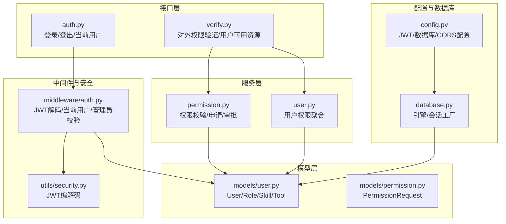
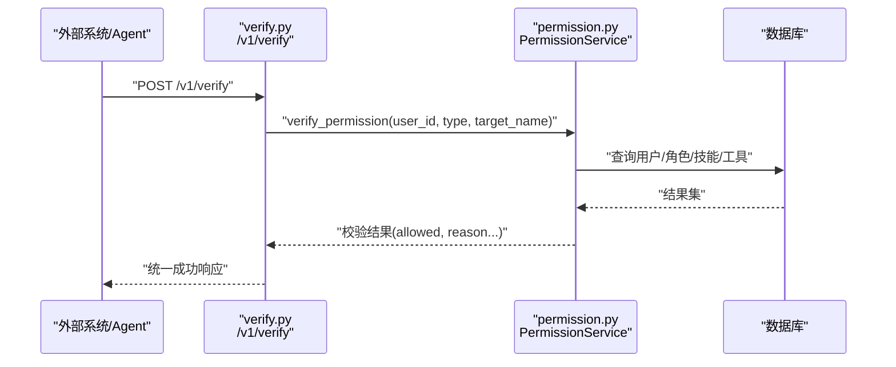
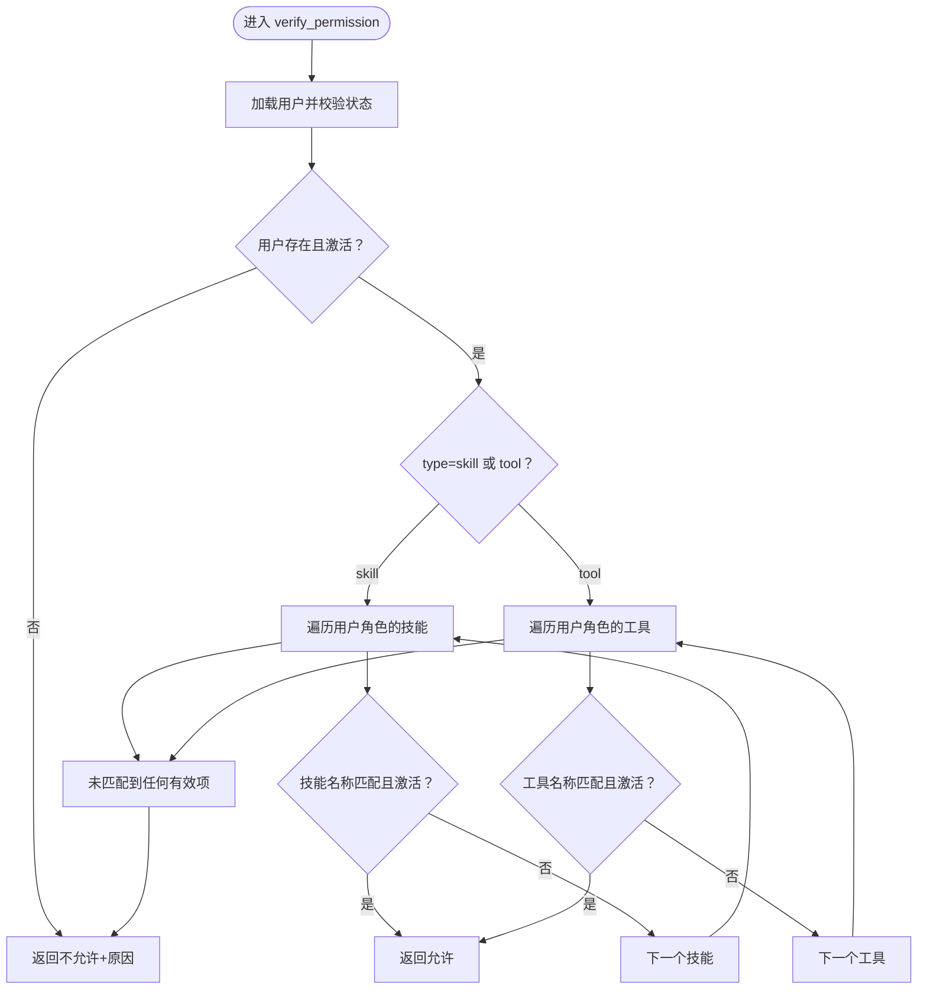
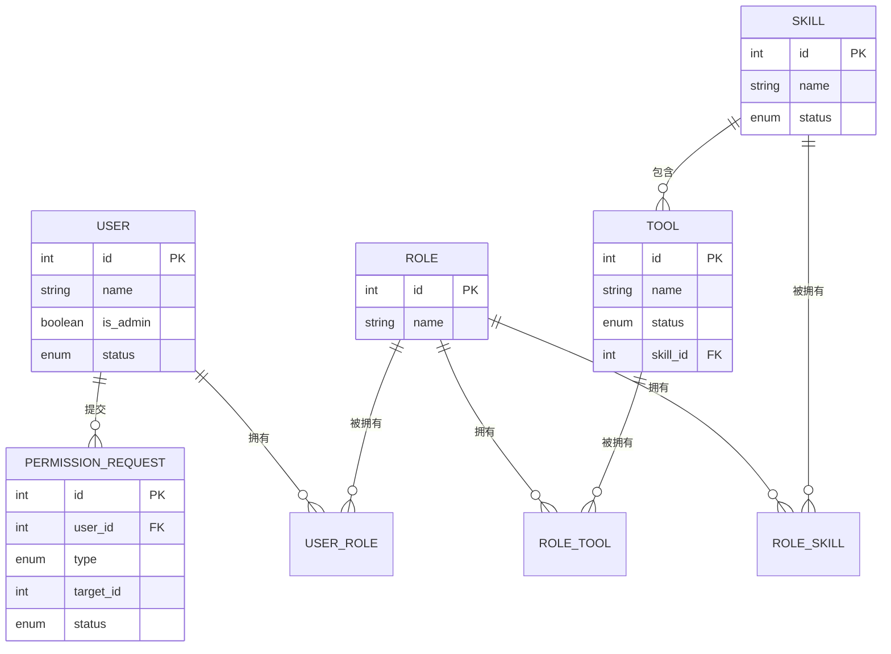
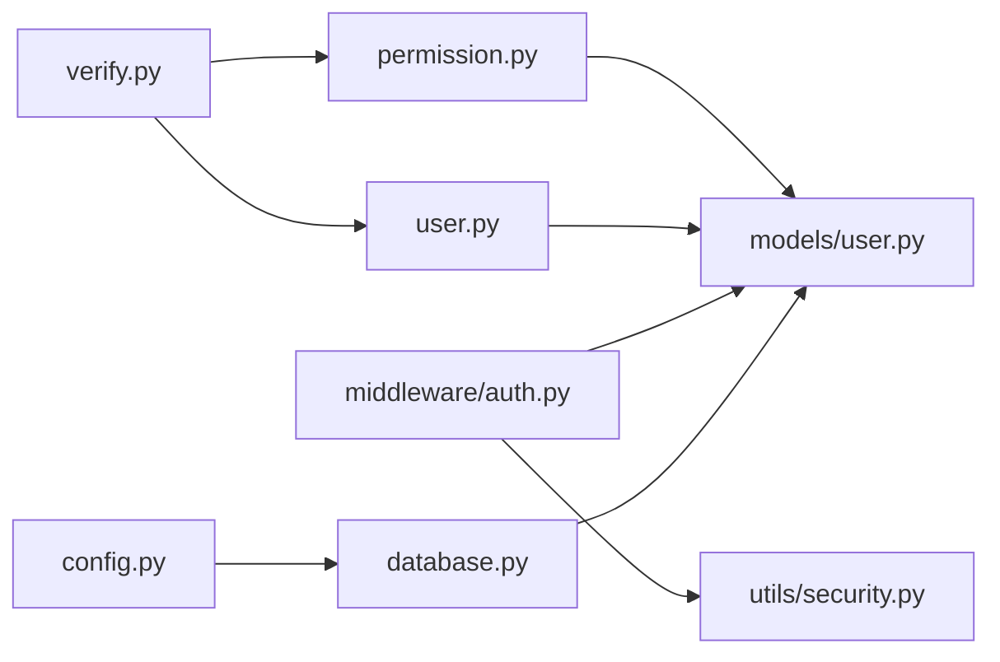

# 权限验证API

<cite>
**本文引用的文件**
- [backend/app/api/v1/verify.py](file://backend/app/api/v1/verify.py)
- [backend/app/services/permission.py](file://backend/app/services/permission.py)
- [backend/app/services/user.py](file://backend/app/services/user.py)
- [backend/app/schemas/permission.py](file://backend/app/schemas/permission.py)
- [backend/app/schemas/common.py](file://backend/app/schemas/common.py)
- [backend/app/middleware/auth.py](file://backend/app/middleware/auth.py)
- [backend/app/utils/security.py](file://backend/app/utils/security.py)
- [backend/app/models/user.py](file://backend/app/models/user.py)
- [backend/app/models/permission.py](file://backend/app/models/permission.py)
- [backend/app/api/auth.py](file://backend/app/api/auth.py)
- [backend/app/config.py](file://backend/app/config.py)
- [backend/app/database.py](file://backend/app/database.py)
</cite>

## 目录
1. [简介](#简介)
2. [项目结构](#项目结构)
3. [核心组件](#核心组件)
4. [架构总览](#架构总览)
5. [详细组件分析](#详细组件分析)
6. [依赖关系分析](#依赖关系分析)
7. [性能考量](#性能考量)
8. [故障排查指南](#故障排查指南)
9. [结论](#结论)
10. [附录](#附录)

## 简介
本文件面向ToolHub的“权限验证API”，聚焦对外权限校验接口的设计与实现，涵盖权限检查、访问控制验证、接口规范、错误处理、安全与防攻击措施、性能优化与缓存策略、使用示例与集成指南，以及测试与调试方法。该API主要服务于其他系统或Agent对ToolHub内部资源（技能/工具）的权限校验需求。

## 项目结构
围绕权限验证API的关键目录与文件如下：
- 接口层：对外权限验证与用户可用资源查询接口
- 服务层：权限校验与用户权限聚合逻辑
- 模型层：用户、角色、技能、工具、权限申请等数据模型
- 中间件与安全：JWT解析、用户鉴权、管理员校验
- 配置与数据库：JWT配置、数据库连接、会话管理

图表来源
- [backend/app/api/v1/verify.py:1-41](file://backend/app/api/v1/verify.py#L1-L41)
- [backend/app/services/permission.py:1-182](file://backend/app/services/permission.py#L1-L182)
- [backend/app/services/user.py:1-86](file://backend/app/services/user.py#L1-L86)
- [backend/app/models/user.py:23-116](file://backend/app/models/user.py#L23-L116)
- [backend/app/models/permission.py:7-28](file://backend/app/models/permission.py#L7-L28)
- [backend/app/middleware/auth.py:1-45](file://backend/app/middleware/auth.py#L1-L45)
- [backend/app/utils/security.py:1-32](file://backend/app/utils/security.py#L1-L32)
- [backend/app/api/auth.py:1-58](file://backend/app/api/auth.py#L1-L58)
- [backend/app/config.py:11-42](file://backend/app/config.py#L11-L42)
- [backend/app/database.py:1-25](file://backend/app/database.py#L1-L25)

章节来源
- [backend/app/api/v1/verify.py:1-41](file://backend/app/api/v1/verify.py#L1-L41)
- [backend/app/services/permission.py:146-165](file://backend/app/services/permission.py#L146-L165)
- [backend/app/services/user.py:66-82](file://backend/app/services/user.py#L66-L82)
- [backend/app/middleware/auth.py:12-33](file://backend/app/middleware/auth.py#L12-L33)
- [backend/app/utils/security.py:20-31](file://backend/app/utils/security.py#L20-L31)
- [backend/app/config.py:21-23](file://backend/app/config.py#L21-L23)

## 核心组件
- 对外权限验证接口
  - 路径：POST /v1/verify
  - 功能：根据用户ID、权限类型（skill/tool）、目标名称（技能名或工具名）进行权限校验
  - 返回：统一成功响应包装，包含允许标志与必要上下文字段
- 用户可用资源查询接口
  - 路径：GET /v1/users/{user_id}/tools
  - 功能：返回用户可使用的工具列表
  - 路径：GET /v1/users/{user_id}/skills
  - 功能：返回用户可使用的技能列表
- 权限校验服务
  - 核心方法：verify_permission
  - 逻辑：基于用户角色聚合技能/工具，匹配目标名称与状态
- 用户权限聚合服务
  - 核心方法：get_user_permissions
  - 逻辑：遍历用户角色，收集激活状态的技能/工具名称集合

章节来源
- [backend/app/api/v1/verify.py:13-40](file://backend/app/api/v1/verify.py#L13-L40)
- [backend/app/services/permission.py:146-165](file://backend/app/services/permission.py#L146-L165)
- [backend/app/services/user.py:66-82](file://backend/app/services/user.py#L66-L82)

## 架构总览
权限验证API的调用链路如下：

图表来源
- [backend/app/api/v1/verify.py:13-20](file://backend/app/api/v1/verify.py#L13-L20)
- [backend/app/services/permission.py:146-165](file://backend/app/services/permission.py#L146-L165)

## 详细组件分析

### 接口层：对外权限验证与用户可用资源
- POST /v1/verify
  - 请求体：PermissionVerifyRequest（包含user_id、type、target_name）
  - 响应：success_response(data=PermissionVerifyResponse)
  - 用途：跨系统/Agent进行权限校验
- GET /v1/users/{user_id}/tools
  - 响应：success_response(data=用户可用工具列表)
- GET /v1/users/{user_id}/skills
  - 响应：success_response(data={"skills": 用户可用技能列表})

章节来源
- [backend/app/api/v1/verify.py:13-40](file://backend/app/api/v1/verify.py#L13-L40)
- [backend/app/schemas/permission.py:35-48](file://backend/app/schemas/permission.py#L35-L48)
- [backend/app/schemas/common.py:23-28](file://backend/app/schemas/common.py#L23-L28)

### 服务层：权限校验与用户权限聚合
- 权限校验服务（PermissionService.verify_permission）
  - 输入：user_id、type（skill/tool）、target_name
  - 输出：字典，包含allowed、user_id、type、target_name、reason（可选）
  - 核心逻辑：
    - 校验用户存在且状态为active
    - 遍历用户角色下的技能/工具，匹配名称与状态
    - 返回命中/未命中及原因
- 用户权限聚合服务（UserService.get_user_permissions）
  - 输入：user_id
  - 输出：{"skills": [...], "tools": [...]}
  - 核心逻辑：
    - 遍历用户角色，收集激活状态的技能/工具名称
    - 去重后返回

图表来源
- [backend/app/services/permission.py:146-165](file://backend/app/services/permission.py#L146-L165)

章节来源
- [backend/app/services/permission.py:146-165](file://backend/app/services/permission.py#L146-L165)
- [backend/app/services/user.py:66-82](file://backend/app/services/user.py#L66-L82)

### 数据模型：用户、角色、技能、工具与权限申请
- User/Role/Skill/Tool/RoleSkill/RoleTool/UserRole
  - 用户与角色多对多，角色与技能/工具多对多
  - 工具属于技能，技能可拥有多个工具
- PermissionRequest
  - 记录权限申请的类型、目标、状态、审批人等

图表来源
- [backend/app/models/user.py:23-116](file://backend/app/models/user.py#L23-L116)
- [backend/app/models/permission.py:7-28](file://backend/app/models/permission.py#L7-L28)

章节来源
- [backend/app/models/user.py:23-116](file://backend/app/models/user.py#L23-L116)
- [backend/app/models/permission.py:7-28](file://backend/app/models/permission.py#L7-L28)

### 中间件与安全：JWT与用户鉴权
- get_current_user
  - 解析HTTP Bearer Token，校验用户存在与状态
  - 返回当前用户对象
- require_admin
  - 校验管理员权限，否则拒绝访问
- decode_access_token
  - JWT解码，提取user_id与is_admin

章节来源
- [backend/app/middleware/auth.py:12-44](file://backend/app/middleware/auth.py#L12-L44)
- [backend/app/utils/security.py:20-31](file://backend/app/utils/security.py#L20-L31)

### 统一响应与错误处理
- success_response / error_response
  - 统一返回结构：code、message、data
  - verify接口返回success_response(data=校验结果)

章节来源
- [backend/app/schemas/common.py:17-28](file://backend/app/schemas/common.py#L17-L28)
- [backend/app/api/v1/verify.py:18-20](file://backend/app/api/v1/verify.py#L18-L20)

## 依赖关系分析
- verify.py 依赖 permission_service 和 user_service
- permission_service 依赖 User/Role/Skill/Tool 模型
- user_service 依赖 User/Role 模型
- 中间件依赖 security 工具与 User 模型
- 配置与数据库为全局依赖

图表来源
- [backend/app/api/v1/verify.py:1-8](file://backend/app/api/v1/verify.py#L1-L8)
- [backend/app/services/permission.py:1-6](file://backend/app/services/permission.py#L1-L6)
- [backend/app/services/user.py:1-5](file://backend/app/services/user.py#L1-L5)
- [backend/app/middleware/auth.py:1-7](file://backend/app/middleware/auth.py#L1-L7)
- [backend/app/utils/security.py:1-5](file://backend/app/utils/security.py#L1-L5)
- [backend/app/config.py:11-42](file://backend/app/config.py#L11-L42)
- [backend/app/database.py:1-25](file://backend/app/database.py#L1-L25)

章节来源
- [backend/app/api/v1/verify.py:1-8](file://backend/app/api/v1/verify.py#L1-L8)
- [backend/app/services/permission.py:1-6](file://backend/app/services/permission.py#L1-L6)
- [backend/app/services/user.py:1-5](file://backend/app/services/user.py#L1-L5)
- [backend/app/middleware/auth.py:1-7](file://backend/app/middleware/auth.py#L1-L7)
- [backend/app/utils/security.py:1-5](file://backend/app/utils/security.py#L1-L5)
- [backend/app/config.py:11-42](file://backend/app/config.py#L11-L42)
- [backend/app/database.py:1-25](file://backend/app/database.py#L1-L25)

## 性能考量
- 查询复杂度
  - verify_permission：O(R*S) 或 O(R*T)，R为用户角色数，S/T为每角色技能/工具数
  - get_user_permissions：O(R*(S+T))
- 可能的优化方向
  - 缓存策略
    - 用户权限缓存：以user_id为key，缓存get_user_permissions结果；当用户角色变更或技能/工具状态变化时失效
    - 单次校验缓存：以(user_id, type, target_name)为key缓存verify_permission结果，有效期较短（如数分钟）
  - 数据库索引
    - 角色-技能/工具关联表建立复合索引，加速匹配
    - 用户状态、技能/工具状态字段建立索引
  - 分页与限制
    - 若未来扩展批量校验，建议分页与并发限制
  - 连接池与预热
    - 数据库连接池配置与预热，减少首查延迟
- 当前实现特点
  - 采用逐角色遍历匹配，逻辑清晰，适合中小规模场景；大规模场景建议引入缓存与索引优化

[本节为通用性能建议，不直接分析具体文件]

## 故障排查指南
- 常见错误与定位
  - 401 无效或过期令牌：检查Authorization头与JWT密钥/算法配置
  - 403 用户账户非激活/无管理员权限：检查用户状态与is_admin标记
  - 404 用户不存在：确认user_id正确
  - 校验返回allowed=false且带reason：检查目标名称与状态
- 调试步骤
  - 启用DEBUG与SQL回显，观察实际SQL
  - 在verify_permission中增加日志，输出匹配过程
  - 使用单元测试覆盖边界条件（空角色、无匹配、禁用状态）
- 关键配置核对
  - JWT_SECRET_KEY、JWT_ALGORITHM、JWT_ACCESS_TOKEN_EXPIRE_MINUTES
  - DATABASE_URL

章节来源
- [backend/app/middleware/auth.py:18-32](file://backend/app/middleware/auth.py#L18-L32)
- [backend/app/utils/security.py:20-31](file://backend/app/utils/security.py#L20-L31)
- [backend/app/config.py:21-23](file://backend/app/config.py#L21-L23)
- [backend/app/database.py:5-10](file://backend/app/database.py#L5-L10)

## 结论
ToolHub的权限验证API通过简洁的对外接口与清晰的服务层设计，实现了对技能与工具的权限校验与资源查询能力。结合JWT鉴权与统一响应规范，满足跨系统/Agent的权限验证需求。建议在生产环境引入缓存与索引优化，并完善批量校验与并发控制，以进一步提升性能与稳定性。

[本节为总结性内容，不直接分析具体文件]

## 附录

### API接口规范

- 统一响应
  - 成功：{"code": 0, "message": "success", "data": {...}}
  - 失败：{"code": -1, "message": "...", "data": null}

章节来源
- [backend/app/schemas/common.py:17-28](file://backend/app/schemas/common.py#L17-L28)

- POST /v1/verify
  - 请求体：PermissionVerifyRequest
    - user_id: int
    - type: "skill" | "tool"
    - target_name: string
  - 响应体：PermissionVerifyResponse
    - allowed: boolean
    - user_id: int
    - type: string
    - target_name: string
    - reason: string（可选）

章节来源
- [backend/app/api/v1/verify.py:13-20](file://backend/app/api/v1/verify.py#L13-L20)
- [backend/app/schemas/permission.py:35-48](file://backend/app/schemas/permission.py#L35-L48)

- GET /v1/users/{user_id}/tools
  - 响应体：{"tools": [...]}
- GET /v1/users/{user_id}/skills
  - 响应体：{"skills": [...]}
  
章节来源
- [backend/app/api/v1/verify.py:23-40](file://backend/app/api/v1/verify.py#L23-L40)
- [backend/app/services/user.py:66-82](file://backend/app/services/user.py#L66-L82)

### 使用示例与集成指南
- 示例流程
  - 外部系统准备：构造PermissionVerifyRequest（user_id、type、target_name）
  - 发起请求：POST /v1/verify
  - 处理响应：读取allowed字段决定放行或拦截
- 集成要点
  - 令牌管理：确保Authorization头携带有效的JWT
  - 错误处理：对401/403/404进行降级或重试
  - 批量校验：建议合并请求或异步处理，避免阻塞

[本节为概念性示例，不直接分析具体文件]

### 安全考虑与防攻击措施
- JWT安全
  - 使用强密钥与安全算法，定期轮换密钥
  - 控制令牌有效期，避免长期有效令牌
- 访问控制
  - 严格校验用户状态与管理员权限
  - 对敏感接口启用中间件保护
- 输入校验
  - 对type与target_name进行白名单校验
  - 防止注入与越权访问

章节来源
- [backend/app/utils/security.py:8-17](file://backend/app/utils/security.py#L8-L17)
- [backend/app/middleware/auth.py:18-32](file://backend/app/middleware/auth.py#L18-L32)
- [backend/app/config.py:21-23](file://backend/app/config.py#L21-L23)

### 测试用例与调试方法
- 单元测试建议
  - verify_permission：用户不存在、用户非激活、技能/工具不存在、名称不匹配、禁用状态
  - get_user_permissions：空角色、多角色、重复技能/工具、禁用状态
- 集成测试建议
  - 伪造JWT令牌，调用verify接口，断言allowed与reason
  - 修改用户角色/技能/工具状态，验证缓存失效与结果更新
- 调试技巧
  - 开启DEBUG与SQL回显
  - 在服务层关键节点打印日志
  - 使用最小化数据集复现问题

[本节为通用测试与调试建议，不直接分析具体文件]