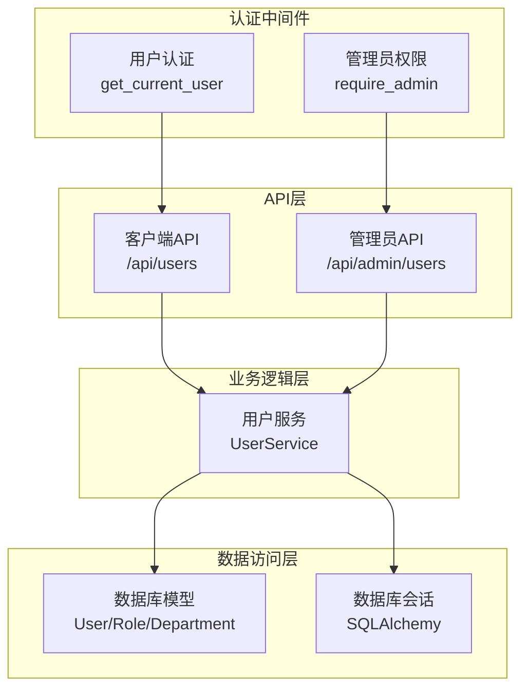
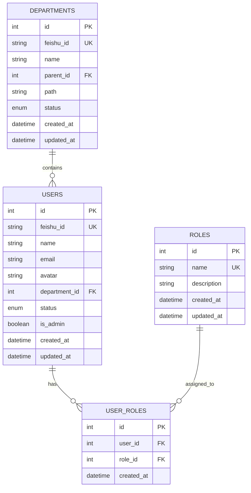
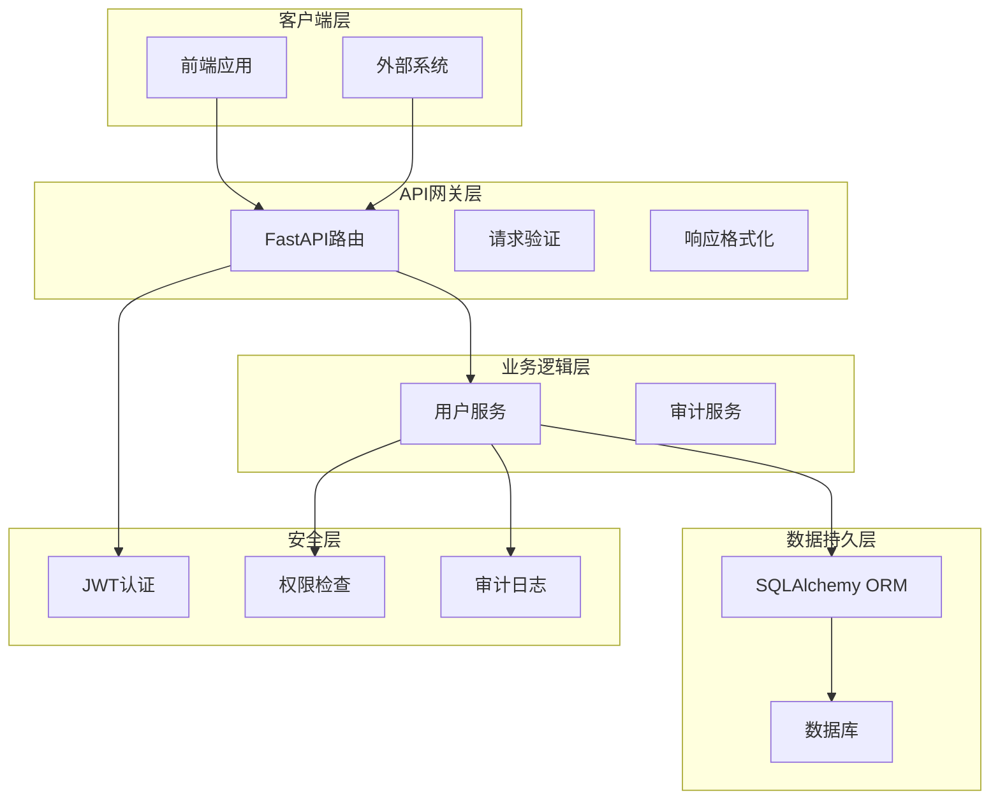
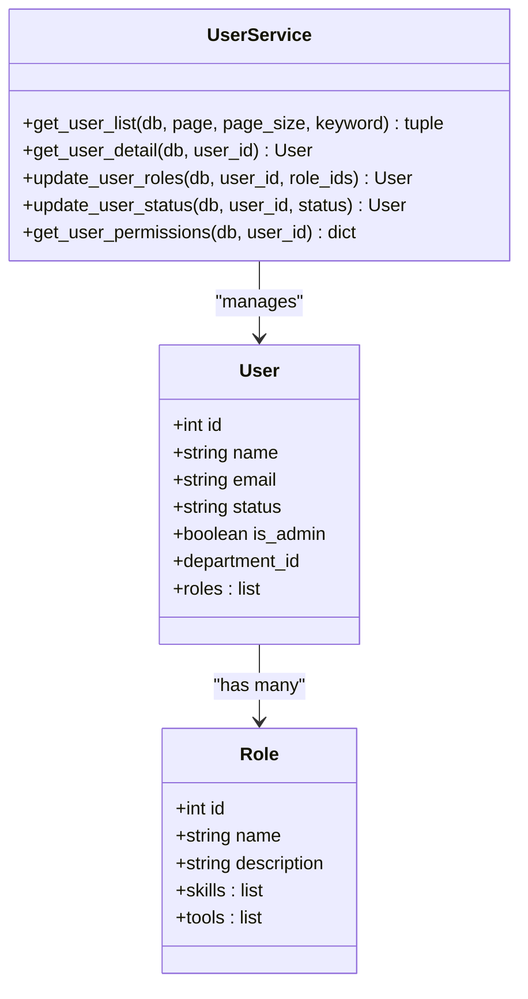
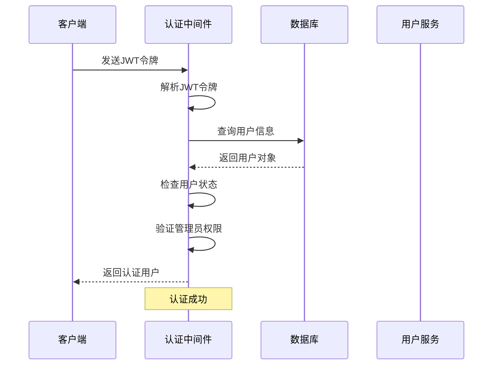
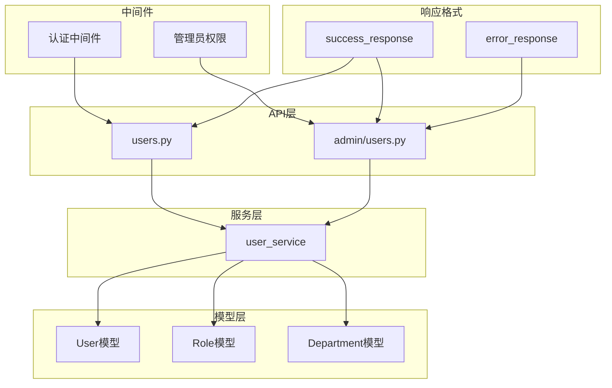

# 用户管理API

<cite>
**本文档引用的文件**
- [backend/app/main.py](file://backend/app/main.py)
- [backend/app/api/users.py](file://backend/app/api/users.py)
- [backend/app/api/admin/users.py](file://backend/app/api/admin/users.py)
- [backend/app/middleware/auth.py](file://backend/app/middleware/auth.py)
- [backend/app/services/user.py](file://backend/app/services/user.py)
- [backend/app/models/user.py](file://backend/app/models/user.py)
- [backend/app/schemas/user.py](file://backend/app/schemas/user.py)
- [backend/app/schemas/common.py](file://backend/app/schemas/common.py)
</cite>

## 目录
1. [简介](#简介)
2. [项目结构](#项目结构)
3. [核心组件](#核心组件)
4. [架构概览](#架构概览)
5. [详细组件分析](#详细组件分析)
6. [依赖分析](#依赖分析)
7. [性能考虑](#性能考虑)
8. [故障排除指南](#故障排除指南)
9. [结论](#结论)

## 简介

ToolHub是一个AI技能与工具权限管理系统，用户管理API是该系统的核心功能模块之一。本文档详细介绍了用户信息查询、更新、删除等CRUD操作接口，以及用户角色管理、部门关联、权限状态等功能接口。

系统采用FastAPI框架构建，支持管理员和普通用户两种访问模式。管理员拥有完整的用户管理权限，包括用户列表查询、详情查看、角色分配、状态管理等操作。

## 项目结构

用户管理API主要分布在以下模块中：

**图表来源**
- [backend/app/main.py:25-39](file://backend/app/main.py#L25-L39)
- [backend/app/api/users.py:12-29](file://backend/app/api/users.py#L12-L29)
- [backend/app/api/admin/users.py:14-97](file://backend/app/api/admin/users.py#L14-L97)

**章节来源**
- [backend/app/main.py:25-39](file://backend/app/main.py#L25-L39)
- [backend/app/api/users.py:1-29](file://backend/app/api/users.py#L1-L29)
- [backend/app/api/admin/users.py:1-97](file://backend/app/api/admin/users.py#L1-L97)

## 核心组件

### 数据模型设计

系统采用关系型数据库设计，核心用户相关表包括：

**图表来源**
- [backend/app/models/user.py:23-63](file://backend/app/models/user.py#L23-L63)

### 数据验证模型

系统使用Pydantic进行数据验证，主要的数据模型包括：

- **UserBase**: 用户基础信息模型
- **UserRead**: 用户完整读取模型（包含部门信息）
- **UserBrief**: 用户简要信息模型
- **UserRoleUpdate**: 角色更新请求模型
- **UserStatusUpdate**: 用户状态更新模型

**章节来源**
- [backend/app/schemas/user.py:27-67](file://backend/app/schemas/user.py#L27-L67)
- [backend/app/models/user.py:23-40](file://backend/app/models/user.py#L23-L40)

## 架构概览

用户管理API采用分层架构设计，确保了清晰的关注点分离：

**图表来源**
- [backend/app/main.py:9-48](file://backend/app/main.py#L9-L48)
- [backend/app/middleware/auth.py:12-44](file://backend/app/middleware/auth.py#L12-L44)

## 详细组件分析

### 客户端用户API

客户端用户API提供个人用户信息查询功能：

#### 获取当前用户权限
- **路径**: `/api/users/me/permissions`
- **方法**: GET
- **认证**: 需要有效JWT令牌
- **功能**: 返回当前用户的权限列表（基于角色的技能和工具）

#### 获取当前用户角色
- **路径**: `/api/users/me/roles`
- **方法**: GET
- **认证**: 需要有效JWT令牌
- **功能**: 返回当前用户的所有角色信息

**章节来源**
- [backend/app/api/users.py:12-29](file://backend/app/api/users.py#L12-L29)

### 管理员用户API

管理员用户API提供完整的用户管理功能：

#### 用户列表查询
- **路径**: `/api/admin/users/`
- **方法**: GET
- **认证**: 需要管理员权限
- **分页参数**:
  - `page`: 页码，默认1，最小1
  - `page_size`: 每页数量，默认20，范围1-100
  - `keyword`: 搜索关键词，支持用户名和邮箱模糊匹配

**章节来源**
- [backend/app/api/admin/users.py:14-39](file://backend/app/api/admin/users.py#L14-L39)

#### 用户详情查询
- **路径**: `/api/admin/users/{user_id}`
- **方法**: GET
- **认证**: 需要管理员权限
- **参数**: `user_id` (路径参数)
- **功能**: 返回指定用户的完整信息，包括部门名称、角色列表等

**章节来源**
- [backend/app/api/admin/users.py:42-64](file://backend/app/api/admin/users.py#L42-L64)

#### 更新用户角色
- **路径**: `/api/admin/users/{user_id}/roles`
- **方法**: PUT
- **认证**: 需要管理员权限
- **请求体**: `UserRoleUpdate`模型
  - `role_ids`: 角色ID数组
- **功能**: 批量更新用户角色，会删除旧的角色关联并建立新的关联
- **审计**: 自动记录角色变更操作

**章节来源**
- [backend/app/api/admin/users.py:67-81](file://backend/app/api/admin/users.py#L67-L81)

#### 更新用户状态
- **路径**: `/api/admin/users/{user_id}/status`
- **方法**: PUT
- **认证**: 需要管理员权限
- **请求体**: `UserStatusUpdate`模型
  - `status`: 用户状态（"active" 或 "inactive"）
- **功能**: 更新用户账户状态
- **审计**: 自动记录状态变更操作

**章节来源**
- [backend/app/api/admin/users.py:83-97](file://backend/app/api/admin/users.py#L83-L97)

### 服务层实现

#### 用户服务核心功能

**图表来源**
- [backend/app/services/user.py:8-86](file://backend/app/services/user.py#L8-L86)
- [backend/app/models/user.py:23-53](file://backend/app/models/user.py#L23-L53)

**章节来源**
- [backend/app/services/user.py:8-86](file://backend/app/services/user.py#L8-L86)

### 认证与授权机制

系统采用JWT令牌进行用户认证，并通过中间件实现权限控制：

**图表来源**
- [backend/app/middleware/auth.py:12-33](file://backend/app/middleware/auth.py#L12-L33)

**章节来源**
- [backend/app/middleware/auth.py:12-44](file://backend/app/middleware/auth.py#L12-L44)

## 依赖分析

### 组件依赖关系

**图表来源**
- [backend/app/api/users.py:1-29](file://backend/app/api/users.py#L1-L29)
- [backend/app/api/admin/users.py:1-97](file://backend/app/api/admin/users.py#L1-L97)
- [backend/app/services/user.py:1-86](file://backend/app/services/user.py#L1-L86)

### 外部依赖

系统主要依赖以下外部库：
- **FastAPI**: Web框架和API装饰器
- **SQLAlchemy**: ORM对象关系映射
- **Pydantic**: 数据验证和序列化
- **Python-jose**: JWT令牌处理

**章节来源**
- [backend/app/main.py:1-61](file://backend/app/main.py#L1-L61)

## 性能考虑

### 查询优化策略

1. **索引设计**: 用户表的`feishu_id`和`email`字段设置了数据库索引，支持快速查询
2. **分页机制**: 默认每页20条记录，最大支持100条/页，防止大数据量查询
3. **条件查询**: 支持按用户名和邮箱的模糊搜索，使用SQL LIKE操作符
4. **关联查询**: 使用JOIN查询减少N+1查询问题

### 缓存策略

建议在生产环境中实现以下缓存策略：
- 用户权限信息缓存（30分钟有效期）
- 用户角色列表缓存（15分钟有效期）
- 部门树结构缓存（1小时有效期）

## 故障排除指南

### 常见错误及解决方案

#### 认证相关错误
- **401 未授权**: 检查JWT令牌格式和有效期
- **403 禁止访问**: 确认用户具有管理员权限
- **404 用户不存在**: 验证用户ID的有效性

#### 数据验证错误
- **422 参数验证失败**: 检查请求体格式是否符合Pydantic模型定义
- **500 服务器内部错误**: 检查数据库连接和事务处理

#### 业务逻辑错误
- **用户不存在**: 确保用户ID在数据库中存在
- **角色冲突**: 检查角色ID的有效性和用户状态

**章节来源**
- [backend/app/middleware/auth.py:18-32](file://backend/app/middleware/auth.py#L18-L32)
- [backend/app/api/admin/users.py:49-51](file://backend/app/api/admin/users.py#L49-L51)

### 调试建议

1. **启用详细日志**: 在开发环境中启用SQLAlchemy查询日志
2. **使用Swagger UI**: 通过`/docs`端点测试API接口
3. **检查数据库连接**: 确保数据库服务正常运行
4. **验证JWT配置**: 检查密钥配置和过期时间设置

## 结论

ToolHub用户管理API提供了完整的用户生命周期管理功能，包括基本的CRUD操作、角色管理、状态控制等。系统采用分层架构设计，具有良好的可扩展性和安全性。

主要特点：
- **双层权限设计**: 区分普通用户和管理员权限
- **完整的审计功能**: 所有管理操作都有详细的操作日志
- **灵活的查询机制**: 支持分页、搜索、过滤等多种查询方式
- **强类型验证**: 使用Pydantic确保数据完整性
- **JWT认证**: 提供安全的用户身份验证机制

建议在生产环境中进一步增强的功能：
- 实现用户密码重置功能
- 添加用户导入导出功能
- 增加用户行为监控和异常检测
- 实现更细粒度的权限控制