# 管理员管理API

<cite>
**本文引用的文件**
- [backend/app/main.py](file://backend/app/main.py)
- [backend/app/middleware/auth.py](file://backend/app/middleware/auth.py)
- [backend/app/api/admin/users.py](file://backend/app/api/admin/users.py)
- [backend/app/api/admin/roles.py](file://backend/app/api/admin/roles.py)
- [backend/app/api/admin/departments.py](file://backend/app/api/admin/departments.py)
- [backend/app/api/admin/skills.py](file://backend/app/api/admin/skills.py)
- [backend/app/api/admin/tools.py](file://backend/app/api/admin/tools.py)
- [backend/app/api/admin/audit.py](file://backend/app/api/admin/audit.py)
- [backend/app/api/admin/approvals.py](file://backend/app/api/admin/approvals.py)
- [backend/app/services/user.py](file://backend/app/services/user.py)
- [backend/app/services/role.py](file://backend/app/services/role.py)
- [backend/app/services/department.py](file://backend/app/services/department.py)
- [backend/app/services/skill.py](file://backend/app/services/skill.py)
- [backend/app/services/tool.py](file://backend/app/services/tool.py)
- [backend/app/services/audit.py](file://backend/app/services/audit.py)
- [backend/app/models/user.py](file://backend/app/models/user.py)
- [backend/app/models/audit.py](file://backend/app/models/audit.py)
</cite>

## 目录
1. [简介](#简介)
2. [项目结构](#项目结构)
3. [核心组件](#核心组件)
4. [架构总览](#架构总览)
5. [详细组件分析](#详细组件分析)
6. [依赖分析](#依赖分析)
7. [性能考量](#性能考量)
8. [故障排查指南](#故障排查指南)
9. [结论](#结论)
10. [附录](#附录)

## 简介
本文件为 ToolHub 管理员管理API的完整技术文档，覆盖管理员专用功能接口，包括用户管理、角色配置、部门管理、技能与工具管理、审批流程、审计日志查询等。文档同时说明管理员权限验证与访问控制机制、批量操作与数据导入导出能力、系统配置与监控统计相关的管理工具API，并给出安全审计与权限最小化原则等安全建议。为便于理解，文档在关键处提供架构图与流程图，并对各管理模块间的数据关联与业务逻辑进行梳理。

## 项目结构
后端采用 FastAPI + SQLAlchemy 架构，管理员API位于独立的 admin 路由下，统一前缀为 /api/admin。权限校验通过中间件 require_admin 实现，所有管理员接口均需具备管理员身份。

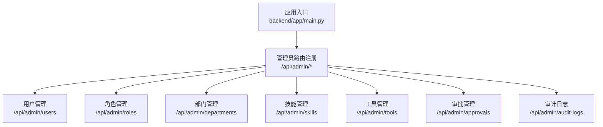

图表来源
- [backend/app/main.py:32-39](file://backend/app/main.py#L32-L39)

章节来源
- [backend/app/main.py:1-61](file://backend/app/main.py#L1-L61)

## 核心组件
- 权限中间件：require_admin 用于强制要求当前用户为管理员，否则返回禁止访问。
- 服务层：每个管理模块对应一个服务类（如 UserService、RoleService、DepartmentService、SkillService、ToolService、AuditService），封装数据库操作与业务逻辑。
- 模型层：用户、角色、部门、技能、工具、审计日志等实体及其关系映射。
- 审计服务：统一记录管理员操作，支持按条件分页查询。

章节来源
- [backend/app/middleware/auth.py:36-44](file://backend/app/middleware/auth.py#L36-L44)
- [backend/app/services/user.py:8-86](file://backend/app/services/user.py#L8-L86)
- [backend/app/services/role.py:7-78](file://backend/app/services/role.py#L7-L78)
- [backend/app/services/department.py:7-76](file://backend/app/services/department.py#L7-L76)
- [backend/app/services/skill.py:8-92](file://backend/app/services/skill.py#L8-L92)
- [backend/app/services/tool.py:8-104](file://backend/app/services/tool.py#L8-L104)
- [backend/app/services/audit.py:6-54](file://backend/app/services/audit.py#L6-L54)
- [backend/app/models/user.py:23-116](file://backend/app/models/user.py#L23-L116)
- [backend/app/models/audit.py:6-17](file://backend/app/models/audit.py#L6-L17)

## 架构总览
管理员API的请求处理链路如下：客户端 → FastAPI 路由 → require_admin 中间件 → 业务服务层 → 数据库持久化 → 审计日志记录 → 返回响应。

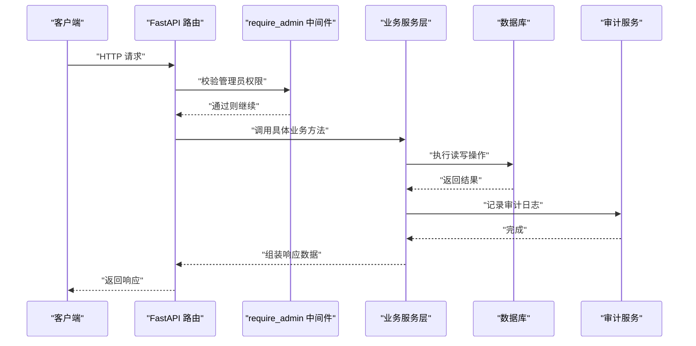

图表来源
- [backend/app/middleware/auth.py:36-44](file://backend/app/middleware/auth.py#L36-L44)
- [backend/app/api/admin/users.py:14-97](file://backend/app/api/admin/users.py#L14-L97)
- [backend/app/api/admin/roles.py:14-111](file://backend/app/api/admin/roles.py#L14-L111)
- [backend/app/api/admin/departments.py:12-33](file://backend/app/api/admin/departments.py#L12-L33)
- [backend/app/api/admin/skills.py:14-85](file://backend/app/api/admin/skills.py#L14-L85)
- [backend/app/api/admin/tools.py:14-89](file://backend/app/api/admin/tools.py#L14-L89)
- [backend/app/api/admin/audit.py:12-37](file://backend/app/api/admin/audit.py#L12-L37)
- [backend/app/api/admin/approvals.py:14-88](file://backend/app/api/admin/approvals.py#L14-L88)
- [backend/app/services/audit.py:9-31](file://backend/app/services/audit.py#L9-L31)

## 详细组件分析

### 用户管理
- 接口概览
  - 列表查询：GET /api/admin/users
  - 详情查询：GET /api/admin/users/{user_id}
  - 更新用户角色：PUT /api/admin/users/{user_id}/roles
  - 更新用户状态：PUT /api/admin/users/{user_id}/status
- 关键特性
  - 分页与关键词过滤（支持姓名/邮箱）
  - 角色批量重置与审计日志记录
  - 状态变更审计日志记录
- 数据模型关联
  - 用户与部门（一对多）、用户与角色（多对多）
- 安全要点
  - 所有接口均受 require_admin 保护
  - 角色与状态更新会记录审计日志，便于追踪

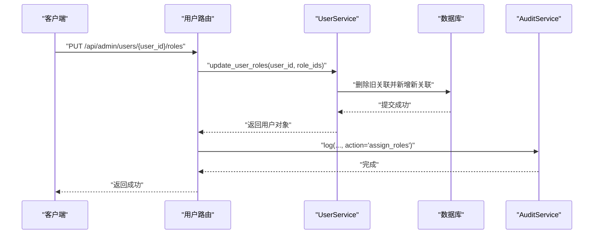

图表来源
- [backend/app/api/admin/users.py:67-81](file://backend/app/api/admin/users.py#L67-L81)
- [backend/app/services/user.py:35-52](file://backend/app/services/user.py#L35-L52)
- [backend/app/services/audit.py:9-31](file://backend/app/services/audit.py#L9-L31)

章节来源
- [backend/app/api/admin/users.py:14-97](file://backend/app/api/admin/users.py#L14-L97)
- [backend/app/services/user.py:8-86](file://backend/app/services/user.py#L8-L86)
- [backend/app/models/user.py:23-40](file://backend/app/models/user.py#L23-L40)

### 角色管理
- 接口概览
  - 列表查询：GET /api/admin/roles
  - 创建角色：POST /api/admin/roles
  - 更新角色：PUT /api/admin/roles/{role_id}
  - 删除角色：DELETE /api/admin/roles/{role_id}
  - 分配技能权限：PUT /api/admin/roles/{role_id}/skills
  - 分配工具权限：PUT /api/admin/roles/{role_id}/tools
- 关键特性
  - 技能/工具权限的批量重置与审计日志
  - 角色级权限直接影响用户可访问的技能与工具集合
- 数据模型关联
  - 角色与技能（多对多）、角色与工具（多对多）

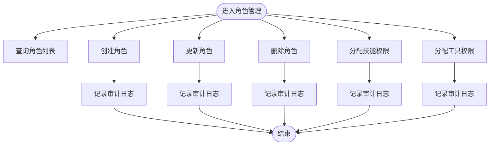

图表来源
- [backend/app/api/admin/roles.py:14-111](file://backend/app/api/admin/roles.py#L14-L111)
- [backend/app/services/role.py:18-74](file://backend/app/services/role.py#L18-L74)
- [backend/app/services/audit.py:9-31](file://backend/app/services/audit.py#L9-L31)

章节来源
- [backend/app/api/admin/roles.py:14-111](file://backend/app/api/admin/roles.py#L14-L111)
- [backend/app/services/role.py:7-78](file://backend/app/services/role.py#L7-L78)
- [backend/app/models/user.py:42-53](file://backend/app/models/user.py#L42-L53)

### 部门管理
- 接口概览
  - 部门树形列表：GET /api/admin/departments
  - 手动同步飞书组织架构：POST /api/admin/departments/sync
- 关键特性
  - 支持飞书组织架构的增量/全量同步
  - 返回树形结构，便于前端展示层级关系
- 数据模型关联
  - 部门自引用（父子关系）与用户一对多

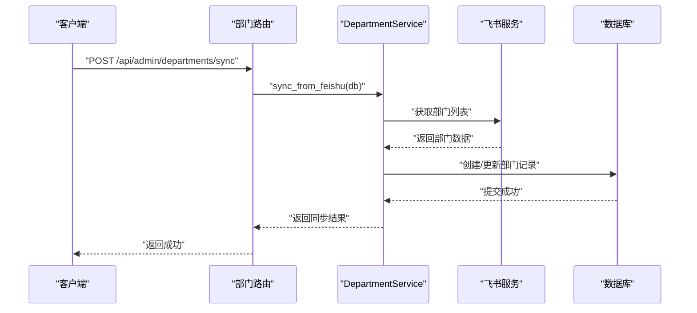

图表来源
- [backend/app/api/admin/departments.py:22-33](file://backend/app/api/admin/departments.py#L22-L33)
- [backend/app/services/department.py:27-73](file://backend/app/services/department.py#L27-L73)

章节来源
- [backend/app/api/admin/departments.py:12-33](file://backend/app/api/admin/departments.py#L12-L33)
- [backend/app/services/department.py:7-76](file://backend/app/services/department.py#L7-L76)
- [backend/app/models/user.py:7-21](file://backend/app/models/user.py#L7-L21)

### 技能管理
- 接口概览
  - 列表查询：GET /api/admin/skills
  - 创建技能：POST /api/admin/skills
  - 更新技能：PUT /api/admin/skills/{skill_id}
  - 删除技能：DELETE /api/admin/skills/{skill_id}
- 关键特性
  - 支持关键词与状态过滤
  - 删除时级联删除相关工具
  - 审计日志记录创建/更新/删除操作
- 数据模型关联
  - 技能与工具（一对多，级联删除）

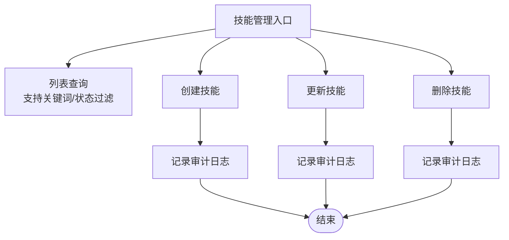

图表来源
- [backend/app/api/admin/skills.py:14-85](file://backend/app/api/admin/skills.py#L14-L85)
- [backend/app/services/skill.py:11-74](file://backend/app/services/skill.py#L11-L74)
- [backend/app/models/user.py:65-79](file://backend/app/models/user.py#L65-L79)

章节来源
- [backend/app/api/admin/skills.py:14-85](file://backend/app/api/admin/skills.py#L14-L85)
- [backend/app/services/skill.py:8-92](file://backend/app/services/skill.py#L8-L92)
- [backend/app/models/user.py:65-79](file://backend/app/models/user.py#L65-L79)

### 工具管理
- 接口概览
  - 列表查询：GET /api/admin/tools
  - 创建工具：POST /api/admin/tools
  - 更新工具：PUT /api/admin/tools/{tool_id}
  - 删除工具：DELETE /api/admin/tools/{tool_id}
- 关键特性
  - 支持关键词、技能筛选、状态过滤
  - 删除时级联删除相关权限映射
  - 审计日志记录创建/更新/删除操作
- 数据模型关联
  - 工具与技能（多对一）、工具与角色（多对多）

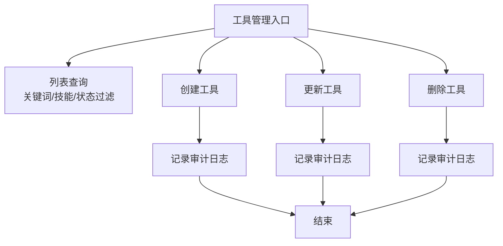

图表来源
- [backend/app/api/admin/tools.py:14-89](file://backend/app/api/admin/tools.py#L14-L89)
- [backend/app/services/tool.py:11-86](file://backend/app/services/tool.py#L11-L86)
- [backend/app/models/user.py:81-98](file://backend/app/models/user.py#L81-L98)

章节来源
- [backend/app/api/admin/tools.py:14-89](file://backend/app/api/admin/tools.py#L14-L89)
- [backend/app/services/tool.py:8-104](file://backend/app/services/tool.py#L8-L104)
- [backend/app/models/user.py:81-98](file://backend/app/models/user.py#L81-L98)

### 审批管理
- 接口概览
  - 审批列表：GET /api/admin/approvals
  - 审批通过：PUT /api/admin/approvals/{request_id}/approve
  - 审批拒绝：PUT /api/admin/approvals/{request_id}/reject
- 关键特性
  - 支持按状态过滤待审批项
  - 审批完成后记录审计日志
  - 自动解析目标名称与审批人信息

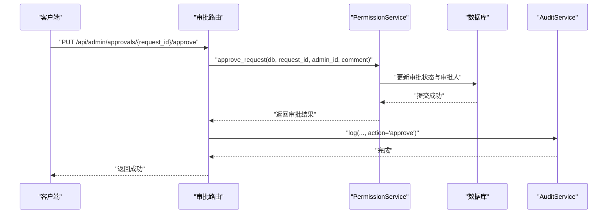

图表来源
- [backend/app/api/admin/approvals.py:58-72](file://backend/app/api/admin/approvals.py#L58-L72)
- [backend/app/services/audit.py:9-31](file://backend/app/services/audit.py#L9-L31)

章节来源
- [backend/app/api/admin/approvals.py:14-88](file://backend/app/api/admin/approvals.py#L14-L88)

### 审计日志查询
- 接口概览
  - 审计日志列表：GET /api/admin/audit-logs
- 关键特性
  - 支持按操作类型、目标类型、用户ID过滤
  - 分页查询，按时间倒序

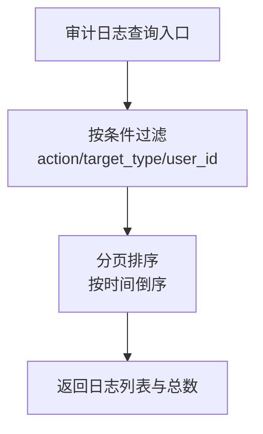

图表来源
- [backend/app/api/admin/audit.py:12-37](file://backend/app/api/admin/audit.py#L12-L37)
- [backend/app/services/audit.py:32-50](file://backend/app/services/audit.py#L32-L50)

章节来源
- [backend/app/api/admin/audit.py:12-37](file://backend/app/api/admin/audit.py#L12-L37)
- [backend/app/services/audit.py:6-54](file://backend/app/services/audit.py#L6-L54)
- [backend/app/models/audit.py:6-17](file://backend/app/models/audit.py#L6-L17)

## 依赖分析
- 路由到中间件：所有管理员路由均依赖 require_admin 中间件进行管理员身份校验。
- 路由到服务：各管理员路由调用对应的业务服务类，完成数据读写与权限计算。
- 服务到模型：业务服务通过 SQLAlchemy ORM 访问数据库，维护实体关系。
- 服务到审计：所有写操作均触发审计日志记录，确保可追溯性。
- 部门同步：DepartmentService 依赖外部飞书服务以同步组织架构。

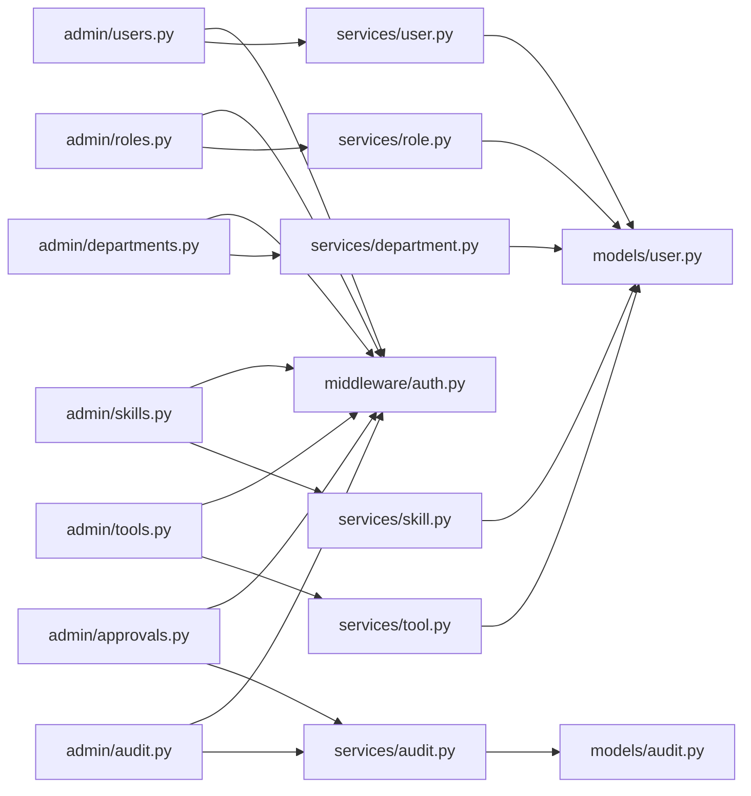

图表来源
- [backend/app/api/admin/users.py:1-10](file://backend/app/api/admin/users.py#L1-L10)
- [backend/app/api/admin/roles.py:1-10](file://backend/app/api/admin/roles.py#L1-L10)
- [backend/app/api/admin/departments.py:1-10](file://backend/app/api/admin/departments.py#L1-L10)
- [backend/app/api/admin/skills.py:1-10](file://backend/app/api/admin/skills.py#L1-L10)
- [backend/app/api/admin/tools.py:1-10](file://backend/app/api/admin/tools.py#L1-L10)
- [backend/app/api/admin/approvals.py:1-10](file://backend/app/api/admin/approvals.py#L1-L10)
- [backend/app/api/admin/audit.py:1-10](file://backend/app/api/admin/audit.py#L1-L10)
- [backend/app/middleware/auth.py:36-44](file://backend/app/middleware/auth.py#L36-L44)
- [backend/app/services/user.py:1-6](file://backend/app/services/user.py#L1-L6)
- [backend/app/services/role.py:1-5](file://backend/app/services/role.py#L1-L5)
- [backend/app/services/department.py:1-5](file://backend/app/services/department.py#L1-L5)
- [backend/app/services/skill.py:1-6](file://backend/app/services/skill.py#L1-L6)
- [backend/app/services/tool.py:1-6](file://backend/app/services/tool.py#L1-L6)
- [backend/app/services/audit.py:1-4](file://backend/app/services/audit.py#L1-L4)
- [backend/app/models/user.py:1-5](file://backend/app/models/user.py#L1-L5)
- [backend/app/models/audit.py:1-4](file://backend/app/models/audit.py#L1-L4)

章节来源
- [backend/app/main.py:32-39](file://backend/app/main.py#L32-L39)

## 性能考量
- 分页与过滤：列表接口普遍支持分页与多维过滤，建议合理设置 page_size 并使用索引字段（如关键字、状态、用户ID）以提升查询效率。
- 批量操作：角色与技能/工具权限分配采用批量删除后重建的方式，适合中低频次的权限调整；高频场景建议评估事务开销与锁竞争。
- 审计日志：每次写操作均产生审计记录，建议对高并发写入场景进行异步审计或批量落库优化。
- 部门同步：递归同步飞书组织架构可能涉及大量网络与数据库IO，建议限制同步深度与频率，并在后台任务中执行。

## 故障排查指南
- 权限错误
  - 现象：返回禁止访问
  - 原因：当前用户非管理员
  - 处理：确认登录用户具备管理员身份
- 资源不存在
  - 现象：返回资源未找到
  - 原因：用户/角色/技能/工具ID无效
  - 处理：核对ID并确保资源存在
- 审计日志查询异常
  - 现象：查询不到预期日志
  - 原因：过滤条件不匹配或分页参数不当
  - 处理：检查 action、target_type、user_id 参数与分页范围

章节来源
- [backend/app/middleware/auth.py:36-44](file://backend/app/middleware/auth.py#L36-L44)
- [backend/app/services/user.py:35-42](file://backend/app/services/user.py#L35-L42)
- [backend/app/services/role.py:48-58](file://backend/app/services/role.py#L48-L58)
- [backend/app/services/skill.py:67-74](file://backend/app/services/skill.py#L67-L74)
- [backend/app/services/tool.py:79-86](file://backend/app/services/tool.py#L79-L86)

## 结论
管理员管理API围绕“权限最小化”与“可追溯性”两大原则设计：通过 require_admin 强制管理员身份，结合审计日志实现全流程可审计；通过角色-技能-工具三层权限模型，实现细粒度的访问控制。建议在生产环境中配合异步任务、缓存与索引策略进一步优化性能，并持续完善安全基线与合规审计。

## 附录

### 权限验证与访问控制机制
- 中间件 require_admin：在路由处理前校验用户是否为管理员，非管理员直接拒绝。
- 审计日志：所有写操作均记录操作人、动作、目标类型与详情，便于事后审计。

章节来源
- [backend/app/middleware/auth.py:36-44](file://backend/app/middleware/auth.py#L36-L44)
- [backend/app/services/audit.py:9-31](file://backend/app/services/audit.py#L9-L31)

### 数据模型关系图
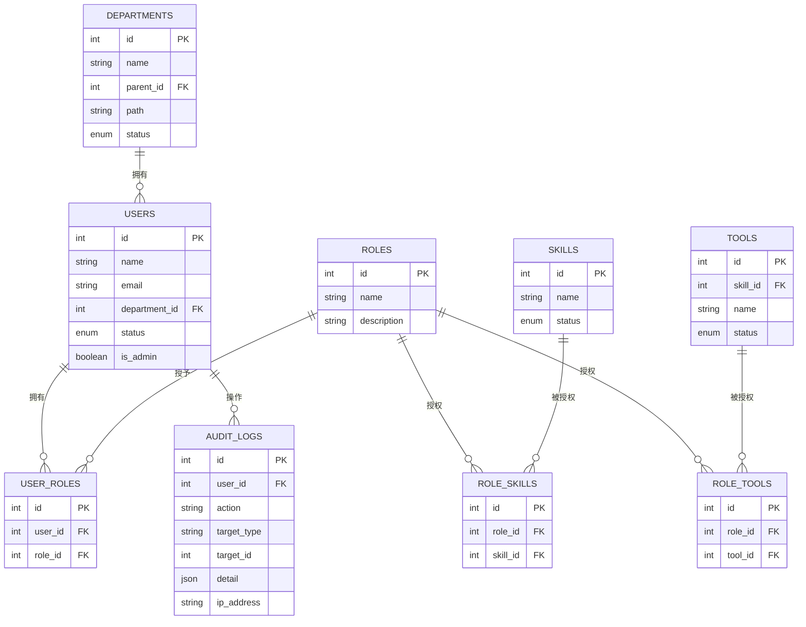

图表来源
- [backend/app/models/user.py:23-116](file://backend/app/models/user.py#L23-L116)
- [backend/app/models/audit.py:6-17](file://backend/app/models/audit.py#L6-L17)