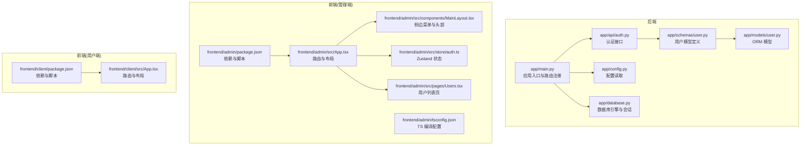
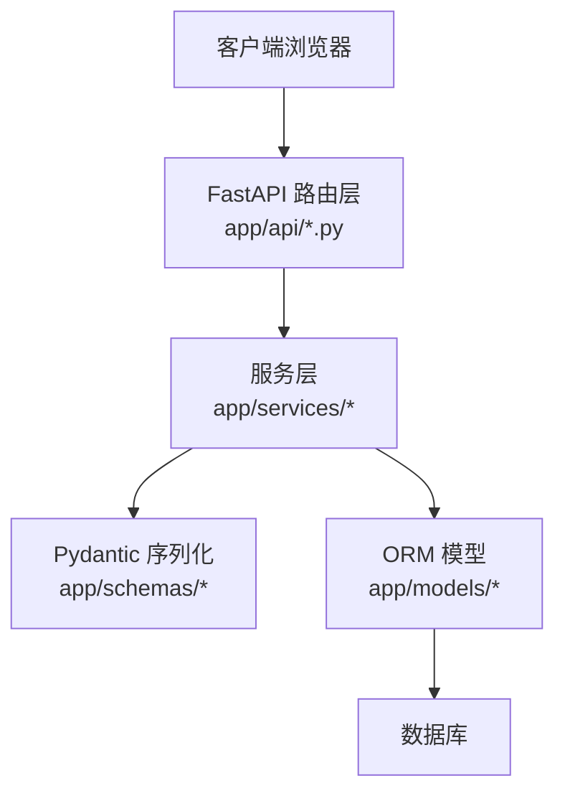
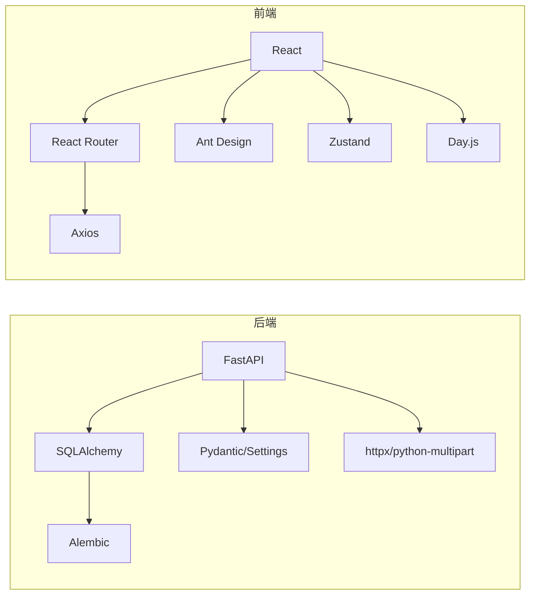

# 代码规范

<cite>
**本文引用的文件**
- [backend/pyproject.toml](file://backend/pyproject.toml)
- [backend/app/main.py](file://backend/app/main.py)
- [backend/app/config.py](file://backend/app/config.py)
- [backend/app/database.py](file://backend/app/database.py)
- [backend/app/api/auth.py](file://backend/app/api/auth.py)
- [backend/app/models/user.py](file://backend/app/models/user.py)
- [backend/app/schemas/user.py](file://backend/app/schemas/user.py)
- [frontend/admin/package.json](file://frontend/admin/package.json)
- [frontend/client/package.json](file://frontend/client/package.json)
- [frontend/admin/tsconfig.json](file://frontend/admin/tsconfig.json)
- [frontend/admin/src/App.tsx](file://frontend/admin/src/App.tsx)
- [frontend/admin/src/store/auth.ts](file://frontend/admin/src/store/auth.ts)
- [frontend/admin/src/components/MainLayout.tsx](file://frontend/admin/src/components/MainLayout.tsx)
- [frontend/admin/src/pages/Users.tsx](file://frontend/admin/src/pages/Users.tsx)
- [frontend/client/src/App.tsx](file://frontend/client/src/App.tsx)
</cite>

## 目录
1. [引言](#引言)
2. [项目结构](#项目结构)
3. [核心组件](#核心组件)
4. [架构总览](#架构总览)
5. [详细组件分析](#详细组件分析)
6. [依赖分析](#依赖分析)
7. [性能考虑](#性能考虑)
8. [故障排查指南](#故障排查指南)
9. [结论](#结论)
10. [附录](#附录)

## 引言
本文件为 ToolHub 项目的代码规范文档，覆盖 Python 后端与 TypeScript 前端的编码规范、命名约定、类型注解、类设计原则、异常处理、文件组织、注释与导入导出规范，并给出格式化与 Lint 工具建议及 Git 提交消息与代码审查标准。内容基于仓库现有实现进行提炼与总结，旨在统一团队开发风格，提升可维护性与协作效率。

## 项目结构
ToolHub 采用前后端分离架构：后端基于 FastAPI，前端包含两个子应用（admin 管理端与 client 用户端），均使用 Vite + React + TypeScript 技术栈。后端通过 Alembic 进行数据库迁移，Pydantic 用于数据模型校验，SQLAlchemy 作为 ORM。

**图表来源**
- [backend/app/main.py:1-61](file://backend/app/main.py#L1-L61)
- [backend/app/config.py:1-42](file://backend/app/config.py#L1-L42)
- [backend/app/database.py:1-25](file://backend/app/database.py#L1-L25)
- [backend/app/api/auth.py:1-48](file://backend/app/api/auth.py#L1-L48)
- [backend/app/schemas/user.py:1-67](file://backend/app/schemas/user.py#L1-L67)
- [backend/app/models/user.py:1-116](file://backend/app/models/user.py#L1-L116)
- [frontend/admin/package.json:1-29](file://frontend/admin/package.json#L1-L29)
- [frontend/admin/tsconfig.json:1-25](file://frontend/admin/tsconfig.json#L1-L25)
- [frontend/admin/src/App.tsx:1-44](file://frontend/admin/src/App.tsx#L1-L44)
- [frontend/admin/src/components/MainLayout.tsx:1-68](file://frontend/admin/src/components/MainLayout.tsx#L1-L68)
- [frontend/admin/src/store/auth.ts:1-30](file://frontend/admin/src/store/auth.ts#L1-L30)
- [frontend/admin/src/pages/Users.tsx:1-95](file://frontend/admin/src/pages/Users.tsx#L1-L95)
- [frontend/client/src/App.tsx:1-42](file://frontend/client/src/App.tsx#L1-L42)

**章节来源**
- [backend/app/main.py:1-61](file://backend/app/main.py#L1-L61)
- [frontend/admin/src/App.tsx:1-44](file://frontend/admin/src/App.tsx#L1-L44)
- [frontend/client/src/App.tsx:1-42](file://frontend/client/src/App.tsx#L1-L42)

## 核心组件
- 应用入口与路由注册：在应用入口中集中注册各模块路由，便于统一管理与扩展。
- 配置系统：使用 Pydantic Settings 从环境文件加载配置，支持调试、数据库、JWT、CORS、飞书 OAuth 等配置项。
- 数据库层：通过 SQLAlchemy 创建引擎与会话，提供依赖注入式会话获取。
- 认证接口：提供飞书登录授权、回调处理、登出与当前用户信息查询。
- 数据模型与序列化：使用 Pydantic BaseModel 定义请求/响应模型，配合 SQLAlchemy ORM 模型完成数据持久化。
- 前端路由与状态：管理端使用 React Router 管理页面路由，Zustand 管理认证状态；通用布局组件提供菜单与头部交互。

**章节来源**
- [backend/app/main.py:9-48](file://backend/app/main.py#L9-L48)
- [backend/app/config.py:11-42](file://backend/app/config.py#L11-L42)
- [backend/app/database.py:5-24](file://backend/app/database.py#L5-L24)
- [backend/app/api/auth.py:13-47](file://backend/app/api/auth.py#L13-L47)
- [backend/app/schemas/user.py:6-67](file://backend/app/schemas/user.py#L6-L67)
- [backend/app/models/user.py:7-116](file://backend/app/models/user.py#L7-L116)
- [frontend/admin/src/App.tsx:14-41](file://frontend/admin/src/App.tsx#L14-L41)
- [frontend/admin/src/store/auth.ts:18-29](file://frontend/admin/src/store/auth.ts#L18-L29)

## 架构总览
后端采用分层架构：路由层(APIRouter)负责接口暴露，服务层处理业务逻辑，模型层负责数据映射，配置与数据库层提供基础设施。前端采用组件化与状态管理分离的设计，路由控制页面切换，状态管理独立于组件。

**图表来源**
- [backend/app/api/auth.py:1-48](file://backend/app/api/auth.py#L1-L48)
- [backend/app/schemas/user.py:1-67](file://backend/app/schemas/user.py#L1-L67)
- [backend/app/models/user.py:1-116](file://backend/app/models/user.py#L1-L116)

## 详细组件分析

### Python 后端代码规范

- PEP8 编码规范
  - 行宽与缩进：遵循 PEP8 的 4 空格缩进与最大行宽建议，保持一致的视觉层级。
  - 空行与空格：函数与类之间使用空行分隔；运算符两侧与逗号后保留适当空格。
  - 导入顺序：标准库、第三方库、本地应用模块分组导入，避免未使用的导入。
  - 注释与文档字符串：公共接口应包含简明的英文文档字符串，解释用途、参数与返回值。

- 类型注解使用
  - 函数签名：明确标注参数与返回值类型，如依赖注入中的 Session、Pydantic 模型等。
  - 变量注解：对复杂数据结构（如列表、字典）使用 typing 中的泛型类型。
  - Forward Reference：在模型互相引用时使用字符串形式的前向引用，避免循环导入。

- 函数命名约定
  - 路由处理器：使用动词短语命名，如 feishu_login、handle_feishu_callback、logout、get_me。
  - 辅助函数：使用小驼峰或下划线风格，保持与现有代码一致。

- 类设计原则
  - ORM 模型：每个表对应一个类，主键、外键、索引与字段注释清晰；关系使用 relationship 明确双向绑定。
  - Pydantic 模型：按职责拆分基类、读取类与更新类，避免在单个类中承担过多职责。
  - 配置类：使用 Pydantic Settings 统一读取环境变量，提供默认值与类型约束。

- 异常处理规范
  - 接口层：捕获业务异常并返回统一的成功/失败响应结构，避免泄露内部异常细节。
  - 服务层：抛出明确的业务异常，便于上层统一处理。
  - 数据库层：使用依赖注入的会话，确保异常时及时关闭连接。

- 文件命名约定
  - 路由模块：以资源名命名，如 auth.py、users.py、tools.py。
  - 模型与序列化：models/* 与 schemas/* 分离职责，文件名与实体一致。
  - 配置与入口：config.py、database.py、main.py。

- 注释规范
  - 公共接口：使用英文文档字符串说明用途、参数与返回值。
  - 复杂逻辑：在关键步骤添加注释，解释业务背景与边界条件。
  - TODO/NOTE：使用简短标记并在后续迭代中清理。

- 导入导出规范
  - 标准库优先，第三方次之，本地模块最后；同一组内按字母排序。
  - 避免 from ... import *；显式导入需要的对象。
  - 在 __init__.py 中聚合导出常用对象，减少跨模块导入复杂度。

- 错误处理模式
  - 统一响应结构：success_response 与 error_response 作为接口层的标准输出。
  - 异常捕获：在路由层捕获异常并转换为错误响应，记录必要日志。

- 代码示例（正确与错误对比）
  - 正确：在路由层捕获异常并返回统一错误响应，避免直接抛出异常给客户端。
  - 错误：在路由层直接抛出底层异常，导致响应格式不一致且泄露内部信息。

- 格式化与 Lint 规则
  - Black：用于 Python 代码格式化，统一缩进、空行与排版。
  - Ruff：用于静态检查与导入排序，建议开启行宽、未使用导入、类型注解缺失等规则。
  - 配置文件：在项目根目录新增 pyproject.toml 或 ruff 配置文件，统一团队规则。

- Git 提交消息规范
  - 类型：feat、fix、docs、style、refactor、test、chore。
  - 格式：type(scope): subject，正文说明变更动机与影响，引用相关 Issue。
  - 示例：feat(api): 添加飞书登录回调接口，修复回调参数解析问题。

- 代码审查标准
  - 功能正确性：接口行为符合需求，边界条件处理完整。
  - 可读性：命名清晰、注释充分、结构合理。
  - 安全性：输入校验、权限控制、敏感信息保护。
  - 性能：避免 N+1 查询、合理使用缓存与索引。
  - 兼容性：版本升级与依赖变更的影响评估。

**章节来源**
- [backend/app/api/auth.py:13-47](file://backend/app/api/auth.py#L13-L47)
- [backend/app/schemas/user.py:6-67](file://backend/app/schemas/user.py#L6-L67)
- [backend/app/models/user.py:7-116](file://backend/app/models/user.py#L7-L116)
- [backend/app/config.py:11-42](file://backend/app/config.py#L11-L42)
- [backend/app/database.py:5-24](file://backend/app/database.py#L5-L24)

### TypeScript 前端代码规范

- 命名规范
  - 组件：首字母大写的 PascalCase，如 MainLayout、Users。
  - 页面：与组件一致，如 Dashboard、Login。
  - Hook：以 use 开头的小驼峰，如 useAuthStore。
  - 类型与接口：以大写字母开头的 PascalCase，如 User、AuthState。

- 接口定义规范
  - 使用 TypeScript 接口描述 props 与状态结构，避免 any。
  - 对可选属性使用 ? 标记，必要时提供默认值。
  - 将通用类型抽离到独立文件，避免重复定义。

- 组件设计原则
  - 单一职责：每个组件只负责单一功能，复杂页面拆分为多个子组件。
  - Props 透传：尽量减少中间层的 props 传递，必要时使用 Context 或状态管理。
  - 事件处理：在组件内部封装事件处理逻辑，对外暴露简洁的回调。

- 状态管理规范
  - 使用 Zustand 管理轻量级全局状态，避免过度使用 Context。
  - 状态更新：通过动作函数集中更新，保证状态变更可追踪。
  - 本地存储：敏感信息不直接存入 localStorage，仅存令牌与必要标识。

- 样式文件组织
  - 全局样式：在 index.css 中集中定义基础样式与主题变量。
  - 组件样式：优先使用 CSS Modules 或 styled-components，避免全局污染。
  - Ant Design：统一使用 Ant Design 组件，保持视觉一致性。

- 文件命名约定
  - 组件与页面：.tsx 扩展名，文件名与组件名一致。
  - Store：store 目录下以功能命名，如 auth.ts。
  - API：api 目录下统一请求封装，避免分散在组件中。

- 注释规范
  - 组件：简述用途与关键 props。
  - 函数：说明输入、输出与副作用。
  - 复杂逻辑：在关键步骤添加注释，解释业务背景。

- 导入导出规范
  - 路径别名：使用 @/* 别名简化相对路径。
  - 依赖声明：在 package.json 中声明依赖，避免安装无关包。
  - 类型导入：仅导入类型时使用 import type。

- 错误处理模式
  - 请求错误：在请求封装中统一拦截错误，提示用户或重定向登录。
  - 渲染错误：在组件中使用 React Error Boundary 捕获渲染异常。
  - 状态错误：通过状态管理统一处理登录态失效与权限不足。

- 代码示例（正确与错误对比）
  - 正确：在路由层判断 token 并根据登录态决定渲染内容，避免在子组件中重复判断。
  - 错误：在多个组件中重复判断 token，导致逻辑分散与维护困难。

- 格式化与 Lint 规则
  - Prettier：统一代码风格，与 ESLint 配合使用。
  - ESLint：启用 @typescript-eslint 与 react-hooks 规则，禁止 any 与未使用变量。
  - 配置文件：在项目根目录新增 .prettierrc 与 .eslintrc，统一团队规则。

- Git 提交消息规范
  - 类型：feat、fix、docs、style、refactor、test、chore。
  - 格式：type(scope): subject，正文说明变更动机与影响，引用相关 Issue。
  - 示例：feat(store): 添加用户认证状态管理，优化登录流程。

- 代码审查标准
  - 类型安全：避免 any，确保接口与状态类型完整。
  - 组件复用：高内聚低耦合，避免重复代码。
  - 性能：避免不必要的重渲染，合理使用 memo 与 useMemo。
  - 可访问性：按钮与链接具备可访问性标签，键盘可导航。

**章节来源**
- [frontend/admin/src/App.tsx:14-41](file://frontend/admin/src/App.tsx#L14-L41)
- [frontend/admin/src/store/auth.ts:18-29](file://frontend/admin/src/store/auth.ts#L18-L29)
- [frontend/admin/src/components/MainLayout.tsx:33-67](file://frontend/admin/src/components/MainLayout.tsx#L33-L67)
- [frontend/admin/src/pages/Users.tsx:15-42](file://frontend/admin/src/pages/Users.tsx#L15-L42)
- [frontend/admin/tsconfig.json:2-22](file://frontend/admin/tsconfig.json#L2-L22)
- [frontend/admin/package.json:1-29](file://frontend/admin/package.json#L1-L29)
- [frontend/client/package.json:1-29](file://frontend/client/package.json#L1-L29)

## 依赖分析
- 后端依赖
  - FastAPI：提供 Web 框架与路由装饰器。
  - SQLAlchemy：ORM 与数据库连接池。
  - Pydantic/Pydantic Settings：数据模型与配置管理。
  - Alembic：数据库迁移。
  - httpx/python-multipart：HTTP 客户端与表单上传。
- 前端依赖
  - React/React DOM：UI 框架。
  - React Router DOM：路由管理。
  - Ant Design：UI 组件库。
  - Axios：HTTP 客户端。
  - Zustand：轻量级状态管理。
  - Day.js：日期处理。

**图表来源**
- [backend/pyproject.toml:7-20](file://backend/pyproject.toml#L7-L20)
- [frontend/admin/package.json:11-27](file://frontend/admin/package.json#L11-L27)
- [frontend/client/package.json:11-27](file://frontend/client/package.json#L11-L27)

**章节来源**
- [backend/pyproject.toml:1-31](file://backend/pyproject.toml#L1-L31)
- [frontend/admin/package.json:1-29](file://frontend/admin/package.json#L1-L29)
- [frontend/client/package.json:1-29](file://frontend/client/package.json#L1-L29)

## 性能考虑
- 后端
  - 数据库连接池：合理设置 pre_ping 与回收时间，避免连接泄漏。
  - 查询优化：避免 N+1 查询，使用 select joined 或预加载策略。
  - 缓存：对热点数据与静态配置使用缓存，降低数据库压力。
- 前端
  - 组件懒加载：对非关键页面与组件使用动态导入。
  - 状态粒度：避免全局状态过大，拆分细粒度 store。
  - 渲染优化：使用 React.memo、useMemo、useCallback 降低重渲染。

## 故障排查指南
- 后端
  - 路由无法访问：检查路由前缀与 tags 是否正确注册。
  - 数据库连接失败：核对 DATABASE_URL 与网络连通性。
  - JWT 校验失败：确认密钥与算法配置一致。
- 前端
  - 登录后空白页：检查 token 是否存在与路由守卫逻辑。
  - 状态不同步：确认 Zustand 动作是否正确触发与持久化。
  - UI 不显示：检查 Ant Design 主题与样式文件引入。

**章节来源**
- [backend/app/main.py:25-42](file://backend/app/main.py#L25-L42)
- [backend/app/config.py:17-36](file://backend/app/config.py#L17-L36)
- [frontend/admin/src/App.tsx:17-24](file://frontend/admin/src/App.tsx#L17-L24)
- [frontend/admin/src/store/auth.ts:19-28](file://frontend/admin/src/store/auth.ts#L19-L28)

## 结论
本规范文档基于 ToolHub 项目的现有实现，总结了 Python 后端与 TypeScript 前端的编码风格、命名约定、类型注解、类与组件设计原则、异常处理与状态管理实践，并给出了格式化与 Lint 工具配置建议以及 Git 提交与代码审查标准。建议团队在日常开发中严格遵循，持续改进以提升代码质量与协作效率。

## 附录
- 工具配置建议
  - Python：Black、Ruff、mypy（可选）、pytest（可选）。
  - TypeScript：Prettier、ESLint、TypeScript 编译器。
- 术语表
  - ORM：对象关系映射，用于数据库操作。
  - DTO：数据传输对象，用于接口间的数据封装。
  - 状态管理：集中管理应用全局状态的机制。