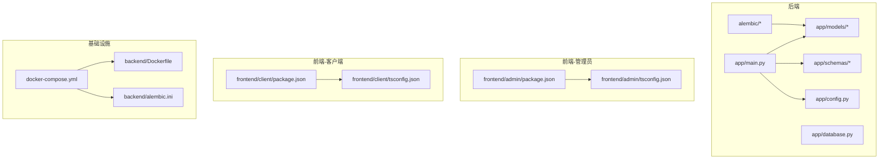
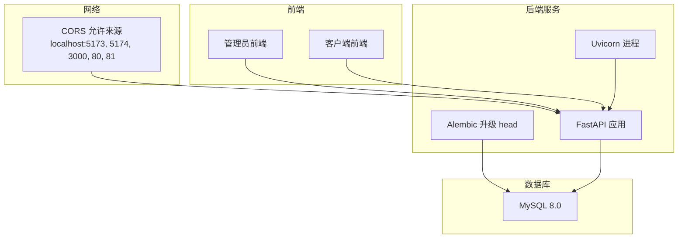
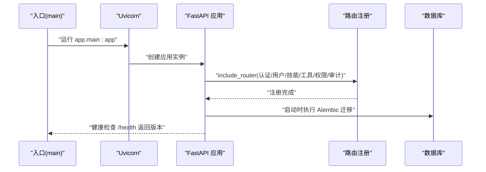
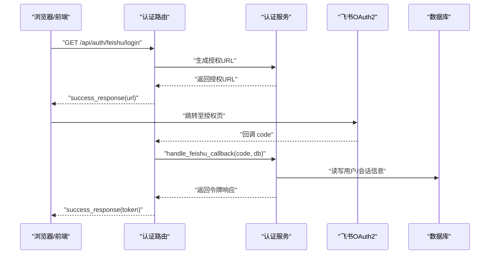
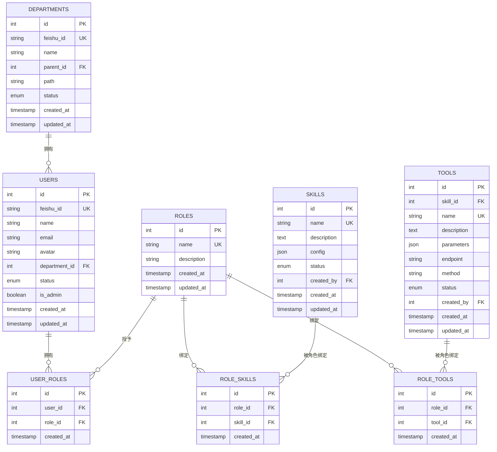
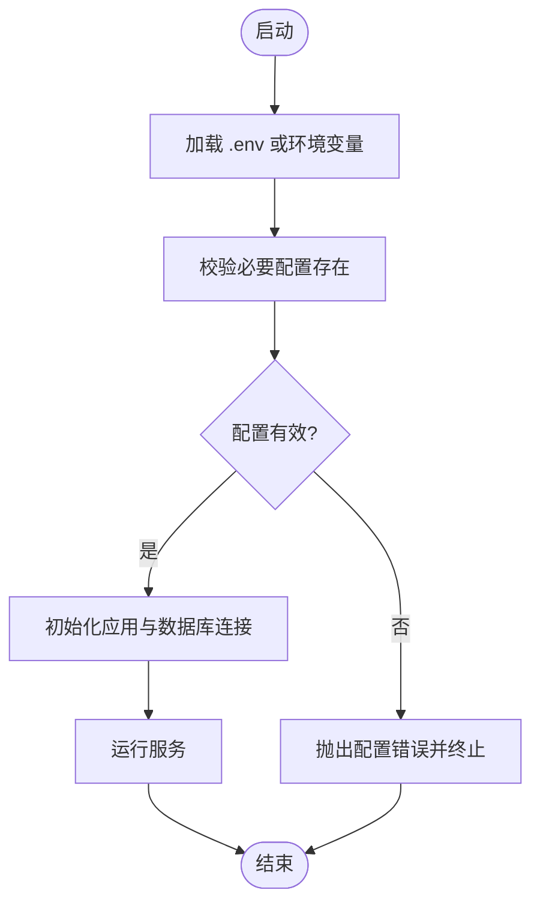
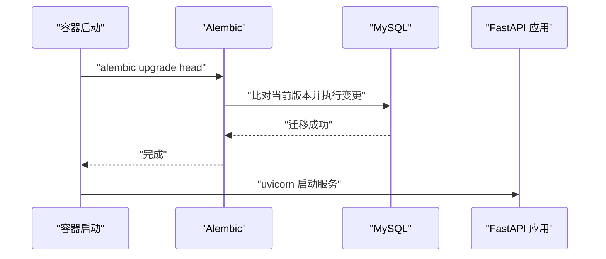
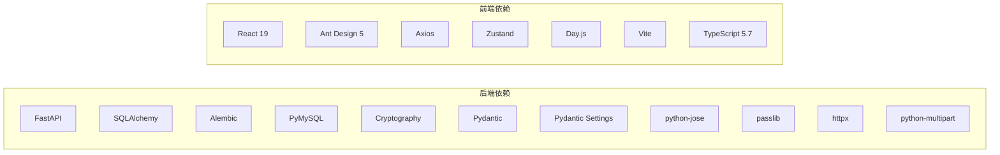

# 开发指南

<cite>
**本文引用的文件**
- [backend/pyproject.toml](file://backend/pyproject.toml)
- [backend/Dockerfile](file://backend/Dockerfile)
- [backend/alembic.ini](file://backend/alembic.ini)
- [backend/alembic/env.py](file://backend/alembic/env.py)
- [backend/app/main.py](file://backend/app/main.py)
- [backend/app/config.py](file://backend/app/config.py)
- [backend/app/api/auth.py](file://backend/app/api/auth.py)
- [backend/app/models/user.py](file://backend/app/models/user.py)
- [backend/app/schemas/user.py](file://backend/app/schemas/user.py)
- [frontend/admin/package.json](file://frontend/admin/package.json)
- [frontend/admin/tsconfig.json](file://frontend/admin/tsconfig.json)
- [frontend/client/package.json](file://frontend/client/package.json)
- [frontend/client/tsconfig.json](file://frontend/client/tsconfig.json)
- [docker-compose.yml](file://docker-compose.yml)
- [.gitignore](file://.gitignore)
</cite>

## 目录
1. [简介](#简介)
2. [项目结构](#项目结构)
3. [核心组件](#核心组件)
4. [架构总览](#架构总览)
5. [详细组件分析](#详细组件分析)
6. [依赖分析](#依赖分析)
7. [性能考虑](#性能考虑)
8. [故障排查指南](#故障排查指南)
9. [结论](#结论)
10. [附录](#附录)

## 简介
本开发指南面向ToolHub项目的后端与前端开发者，提供从开发规范、流程管理、测试策略、调试与性能分析、数据库迁移与Schema设计，到环境配置与版本控制的最佳实践。文档内容均基于仓库现有实现进行提炼与总结，帮助团队统一标准、提升协作效率与交付质量。

## 项目结构
ToolHub采用前后端分离架构：后端基于FastAPI，使用SQLAlchemy与Alembic；前端分为管理员端与普通客户端两套应用，均基于React与TypeScript，并通过Vite构建。整体通过Docker Compose编排MySQL、后端服务、管理员前端与普通客户端。

图表来源
- [backend/app/main.py:1-61](file://backend/app/main.py#L1-L61)
- [backend/app/config.py:1-42](file://backend/app/config.py#L1-L42)
- [backend/Dockerfile:1-29](file://backend/Dockerfile#L1-L29)
- [backend/alembic.ini:1-37](file://backend/alembic.ini#L1-L37)
- [frontend/admin/package.json:1-29](file://frontend/admin/package.json#L1-L29)
- [frontend/admin/tsconfig.json:1-25](file://frontend/admin/tsconfig.json#L1-L25)
- [frontend/client/package.json:1-29](file://frontend/client/package.json#L1-L29)
- [frontend/client/tsconfig.json:1-20](file://frontend/client/tsconfig.json#L1-L20)
- [docker-compose.yml:1-84](file://docker-compose.yml#L1-L84)

章节来源
- [backend/app/main.py:1-61](file://backend/app/main.py#L1-L61)
- [docker-compose.yml:1-84](file://docker-compose.yml#L1-L84)

## 核心组件
- 应用入口与路由注册：后端通过工厂函数创建FastAPI实例，集中注册认证、用户、技能、工具、权限申请、审计日志等API路由，并开放健康检查端点。
- 配置管理：使用Pydantic Settings加载环境变量，涵盖应用名、版本、数据库连接、JWT密钥算法与过期时间、飞书OAuth2参数、CORS白名单等。
- 数据模型与Schema：采用SQLAlchemy定义多表关系（部门、用户、角色、技能、工具及中间表），Pydantic定义请求/响应模型，支持树形部门结构与用户关联角色等复杂字段。
- 前端包与类型配置：管理员端与客户端前端分别维护独立的package.json与tsconfig.json，统一使用React 19、Ant Design 5、Axios、Zustand等依赖与TypeScript 5.7。

章节来源
- [backend/app/main.py:9-48](file://backend/app/main.py#L9-L48)
- [backend/app/config.py:11-41](file://backend/app/config.py#L11-L41)
- [backend/app/models/user.py:7-116](file://backend/app/models/user.py#L7-L116)
- [backend/app/schemas/user.py:6-67](file://backend/app/schemas/user.py#L6-L67)
- [frontend/admin/package.json:1-29](file://frontend/admin/package.json#L1-L29)
- [frontend/admin/tsconfig.json:1-25](file://frontend/admin/tsconfig.json#L1-L25)
- [frontend/client/package.json:1-29](file://frontend/client/package.json#L1-L29)
- [frontend/client/tsconfig.json:1-20](file://frontend/client/tsconfig.json#L1-L20)

## 架构总览
下图展示ToolHub的整体运行时拓扑：容器编排MySQL、后端服务、管理员前端与客户端前端；后端通过Alembic在启动时执行数据库迁移；前端通过Vite开发服务器或构建产物提供静态资源。

图表来源
- [backend/app/main.py:16-46](file://backend/app/main.py#L16-L46)
- [backend/Dockerfile:27-28](file://backend/Dockerfile#L27-L28)
- [docker-compose.yml:24-76](file://docker-compose.yml#L24-L76)

## 详细组件分析

### 后端应用入口与路由
- 工厂函数创建应用，设置标题、版本与描述，启用CORS并允许所有方法与头。
- 注册客户端API与管理员API路由，前缀清晰分层，便于维护与扩展。
- 提供健康检查端点返回版本号，便于容器探针与运维监控。

图表来源
- [backend/app/main.py:9-48](file://backend/app/main.py#L9-L48)
- [backend/Dockerfile:27-28](file://backend/Dockerfile#L27-L28)

章节来源
- [backend/app/main.py:9-48](file://backend/app/main.py#L9-L48)

### 认证与会话
- 提供飞书OAuth2登录URL生成与回调处理，返回令牌相关信息。
- 提供登出提示（前端清理Token即可）、当前用户信息查询接口。
- 使用中间件获取当前用户，配合Pydantic响应封装统一错误与成功格式。

图表来源
- [backend/app/api/auth.py:13-27](file://backend/app/api/auth.py#L13-L27)

章节来源
- [backend/app/api/auth.py:1-48](file://backend/app/api/auth.py#L1-L48)

### 数据模型与Schema
- 模型层：定义部门、用户、角色、技能、工具及其多对多中间表，使用外键约束与JSON字段存储动态配置，枚举字段统一状态管理。
- Schema层：使用Pydantic定义基础、读取、简要信息与状态更新等模型，支持嵌套与向前引用重建，保证序列化一致性。

图表来源
- [backend/app/models/user.py:7-116](file://backend/app/models/user.py#L7-L116)

章节来源
- [backend/app/models/user.py:7-116](file://backend/app/models/user.py#L7-L116)
- [backend/app/schemas/user.py:6-67](file://backend/app/schemas/user.py#L6-L67)

### 配置与环境变量
- 应用名、版本、调试开关、数据库URL、JWT密钥与算法、过期时间、飞书OAuth2参数、CORS白名单等均通过环境变量注入。
- Docker Compose中为各服务设置了默认值与可覆盖项，便于本地与CI环境一致化。

图表来源
- [backend/app/config.py:11-41](file://backend/app/config.py#L11-L41)
- [docker-compose.yml:31-41](file://docker-compose.yml#L31-L41)

章节来源
- [backend/app/config.py:11-41](file://backend/app/config.py#L11-L41)
- [docker-compose.yml:31-41](file://docker-compose.yml#L31-L41)

### 数据库迁移与Schema演进
- Alembic配置与环境文件已就绪，支持离线与在线迁移模式，自动扫描模型以生成迁移脚本。
- Dockerfile在启动时先执行迁移再启动服务，确保Schema与代码一致。

图表来源
- [backend/Dockerfile:27-28](file://backend/Dockerfile#L27-L28)
- [backend/alembic/env.py:20-47](file://backend/alembic/env.py#L20-L47)
- [backend/alembic.ini:1-37](file://backend/alembic.ini#L1-L37)

章节来源
- [backend/alembic/env.py:1-48](file://backend/alembic/env.py#L1-L48)
- [backend/alembic.ini:1-37](file://backend/alembic.ini#L1-L37)
- [backend/Dockerfile:27-28](file://backend/Dockerfile#L27-L28)

### 前端工程化
- 管理员端与客户端前端各自维护独立的包与类型配置，使用Vite+React+TS，Ant Design作为UI框架，Axios进行HTTP请求，Zustand管理状态。
- tsconfig启用严格模式与bundler解析，减少运行时错误。

章节来源
- [frontend/admin/package.json:1-29](file://frontend/admin/package.json#L1-L29)
- [frontend/admin/tsconfig.json:1-25](file://frontend/admin/tsconfig.json#L1-L25)
- [frontend/client/package.json:1-29](file://frontend/client/package.json#L1-L29)
- [frontend/client/tsconfig.json:1-20](file://frontend/client/tsconfig.json#L1-L20)

## 依赖分析
- 后端依赖：FastAPI、Uvicorn、SQLAlchemy、Alembic、PyMySQL、Cryptography、Pydantic、Pydantic Settings、python-jose、passlib、httpx、python-multipart。
- 前端依赖：React 19、React DOM、React Router、Ant Design、Axios、Zustand、Day.js、TypeScript 5.7、Vite、@vitejs/plugin-react。
- 构建系统：后端使用Hatchling；前端使用Vite与TypeScript编译。

图表来源
- [backend/pyproject.toml:7-20](file://backend/pyproject.toml#L7-L20)
- [frontend/admin/package.json:11-27](file://frontend/admin/package.json#L11-L27)
- [frontend/client/package.json:11-27](file://frontend/client/package.json#L11-L27)

章节来源
- [backend/pyproject.toml:1-31](file://backend/pyproject.toml#L1-L31)
- [frontend/admin/package.json:1-29](file://frontend/admin/package.json#L1-L29)
- [frontend/client/package.json:1-29](file://frontend/client/package.json#L1-L29)

## 性能考虑
- 启动阶段：后端容器在启动时先执行数据库迁移，避免运行期失败；建议在生产环境开启只读迁移日志与健康检查。
- 数据访问：合理使用索引（如飞书ID、部门父子关系路径）与枚举字段，减少查询成本；批量操作时使用事务。
- 前端构建：生产构建开启最小化与Tree Shaking；按需引入Ant Design组件，避免全量打包。
- CORS与安全：仅允许必要的Origin，限制请求方法与头；JWT过期时间应结合业务场景调整。

## 故障排查指南
- 启动失败
  - 检查数据库连接字符串与凭据是否正确，确认MySQL容器健康。
  - 查看Alembic迁移日志，确认目标版本与当前版本一致。
- 认证异常
  - 核对飞书OAuth2的App ID/Secret与回调地址是否与配置一致。
  - 检查JWT密钥与算法是否匹配，过期时间是否合理。
- 跨域问题
  - 确认CORS白名单包含前端访问地址（本地开发端口与生产域名）。
- 前端无法访问后端
  - 检查后端容器端口映射与防火墙；确认路由前缀与接口路径一致。

章节来源
- [backend/app/config.py:17-36](file://backend/app/config.py#L17-L36)
- [backend/alembic.ini:14-26](file://backend/alembic.ini#L14-L26)
- [docker-compose.yml:42-46](file://docker-compose.yml#L42-L46)

## 结论
本指南基于ToolHub现有实现，给出了统一的开发规范、流程与最佳实践建议。建议团队在后续迭代中持续完善测试体系、文档与自动化流程，确保系统稳定性与可维护性。

## 附录

### 开发规范与约定
- Python编码规范
  - 使用类型注解与Pydantic模型，保持接口契约清晰。
  - 异常处理遵循统一响应封装，错误信息明确且不泄露敏感细节。
  - ORM操作尽量使用事务，避免长事务与死锁。
- TypeScript编码规范
  - 严格模式开启，禁用未使用变量与参数，保持类型安全。
  - 组件拆分与Hook职责单一，状态管理集中在Zustand。
- 文件命名约定
  - 模型文件使用复数形式（如models/user.py），Schema使用单数形式（如schemas/user.py）。
  - Alembic迁移脚本按时间戳命名，描述简洁明确。
- 注释规范
  - 接口与关键逻辑添加中文注释，说明用途、输入输出与边界条件。
  - 复杂算法或业务规则补充注释说明，便于后续维护。

### 开发流程
- 分支管理策略
  - 主分支保护，功能开发在特性分支，合并前要求通过CI与代码审查。
- 代码审查流程
  - 提交PR时附带变更说明与测试要点，至少一名Reviewer同意方可合并。
- 测试流程
  - 单元测试：针对服务层与工具函数，使用pytest或unittest。
  - 集成测试：覆盖API路由与数据库交互，使用TestClient或Postman集合。
  - 端到端测试：使用Cypress或Playwright验证前端关键流程。
- 发布流程
  - 版本号遵循语义化版本，变更记录写入CHANGELOG；Docker镜像打标签并推送至镜像仓库。

### 测试策略
- 单元测试
  - 覆盖核心业务逻辑与边界条件，Mock外部依赖（如飞书OAuth2、数据库）。
- 集成测试
  - 使用独立测试数据库，验证路由、序列化、权限控制与事务一致性。
- 端到端测试
  - 自动化验证登录、权限申请、审批流、仪表盘等关键用户路径。

### 调试技巧与工具
- IDE配置
  - VS Code推荐插件：Python、Pylance、ESLint、Prettier、Docker。
- 调试器使用
  - 后端：使用uvicorn的reload模式与断点调试；必要时使用pdb或IDE内置调试器。
  - 前端：Chrome DevTools断点调试，React DevTools检查组件状态与Props。
- 性能分析
  - 后端：使用cProfile或py-spy分析CPU与内存占用；关注慢查询与重复请求。
  - 前端：使用Performance面板分析首屏渲染与重绘；Network面板检查接口耗时。

### 数据库开发规范
- Alembic迁移脚本
  - 新增字段使用nullable与默认值，删除字段前评估影响并提供回滚方案。
  - 批量修改使用batch模式，避免长事务锁表。
- Schema设计
  - 外键约束与唯一索引明确，枚举字段统一命名与取值范围。
  - JSON字段用于动态配置，避免过度规范化导致查询复杂度上升。
- 数据模型更新流程
  - 在特性分支中编写迁移脚本并通过本地迁移验证；合并后在预生产环境执行迁移。

### 开发环境配置与依赖管理
- 依赖管理
  - 后端使用uv安装依赖，确保与pyproject.toml一致；前端使用npm/yarn安装依赖。
- 版本控制最佳实践
  - .gitignore排除Python与Node生成文件与虚拟环境；提交信息清晰描述变更。
- 容器化部署
  - Dockerfile使用多阶段构建与系统依赖安装；Compose文件定义服务间依赖与健康检查。

章节来源
- [backend/pyproject.toml:1-31](file://backend/pyproject.toml#L1-L31)
- [frontend/admin/package.json:1-29](file://frontend/admin/package.json#L1-L29)
- [frontend/client/package.json:1-29](file://frontend/client/package.json#L1-L29)
- [.gitignore:1-11](file://.gitignore#L1-L11)
- [docker-compose.yml:1-84](file://docker-compose.yml#L1-L84)