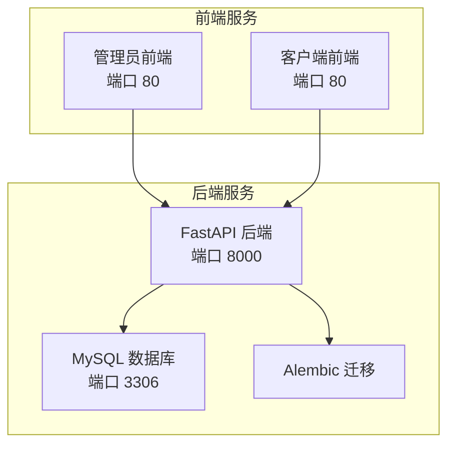
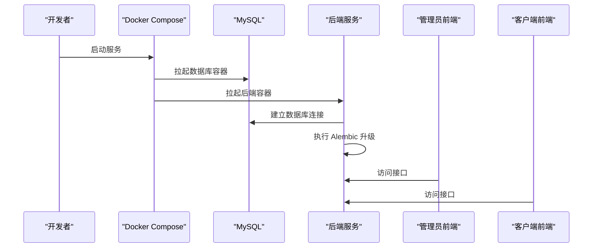
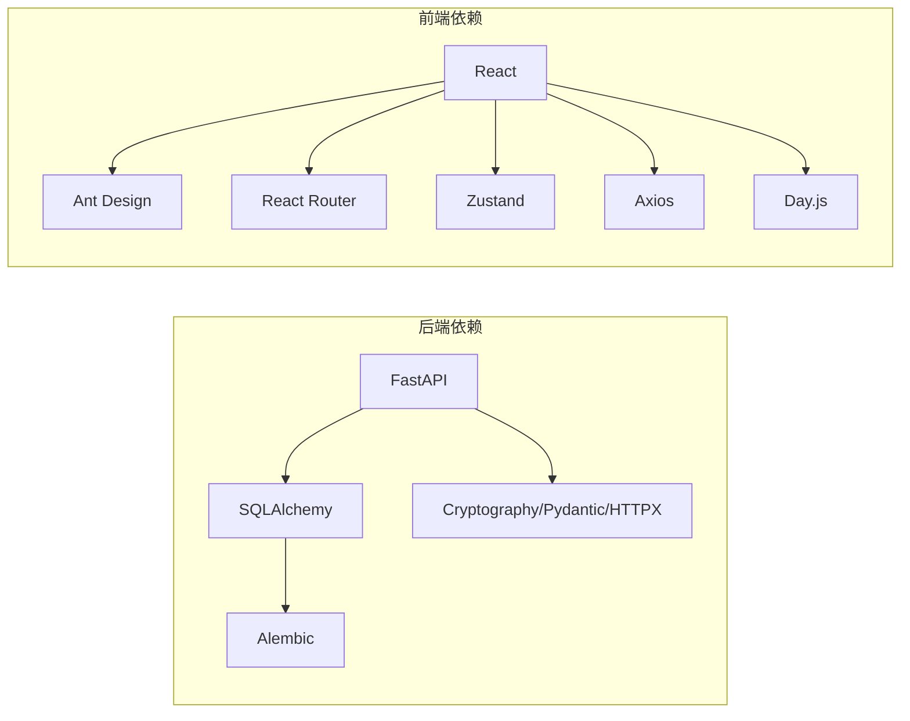

# 开发流程

<cite>
**本文引用的文件**
- [docker-compose.yml](file://docker-compose.yml)
- [.gitignore](file://.gitignore)
- [backend/pyproject.toml](file://backend/pyproject.toml)
- [backend/Dockerfile](file://backend/Dockerfile)
- [backend/alembic.ini](file://backend/alembic.ini)
- [backend/app/config.py](file://backend/app/config.py)
- [frontend/admin/package.json](file://frontend/admin/package.json)
- [frontend/admin/Dockerfile](file://frontend/admin/Dockerfile)
- [frontend/client/package.json](file://frontend/client/package.json)
- [frontend/client/Dockerfile](file://frontend/client/Dockerfile)
</cite>

## 目录
1. [引言](#引言)
2. [项目结构](#项目结构)
3. [核心组件](#核心组件)
4. [架构总览](#架构总览)
5. [详细组件分析](#详细组件分析)
6. [依赖分析](#依赖分析)
7. [性能考虑](#性能考虑)
8. [故障排查指南](#故障排查指南)
9. [结论](#结论)
10. [附录](#附录)

## 引言
本文件面向ToolHub项目的开发与运维团队，系统化梳理从本地开发到容器化部署的完整流程，包括Git分支管理策略、功能分支创建与合并、代码审查规范、版本发布流程；同时覆盖开发环境搭建、依赖安装、本地调试配置；以及持续集成/持续部署（CI/CD）建议、自动化测试与构建打包流程、热修复与紧急发布回滚策略，并给出团队协作与沟通机制建议。

## 项目结构
ToolHub采用前后端分离的多服务架构：后端使用FastAPI + SQLAlchemy + Alembic，前端提供管理员端与普通客户端两套应用，数据库使用MySQL，通过Docker Compose编排运行。整体结构清晰，便于独立开发与容器化部署。

图表来源
- [docker-compose.yml:1-84](file://docker-compose.yml#L1-L84)
- [backend/Dockerfile:1-29](file://backend/Dockerfile#L1-L29)
- [frontend/admin/Dockerfile:1-30](file://frontend/admin/Dockerfile#L1-L30)
- [frontend/client/Dockerfile:1-30](file://frontend/client/Dockerfile#L1-L30)

章节来源
- [docker-compose.yml:1-84](file://docker-compose.yml#L1-L84)

## 核心组件
- 后端服务（FastAPI）
  - 应用入口与路由组织在后端模块中，使用Pydantic设置管理配置项，支持JWT认证、CORS跨域、飞书OAuth回调等。
  - 使用Alembic进行数据库迁移管理，启动时自动升级到最新版本。
- 前端应用（React + Vite）
  - 管理员端与客户端端分别构建，生产环境由Nginx提供静态资源服务。
- 数据库（MySQL）
  - 通过Docker Compose统一管理，健康检查确保服务可用性。
- 配置与环境变量
  - 后端通过.env文件加载配置，支持数据库连接、JWT密钥、飞书应用参数、CORS白名单等。

章节来源
- [backend/app/config.py:1-42](file://backend/app/config.py#L1-L42)
- [backend/alembic.ini:1-37](file://backend/alembic.ini#L1-L37)
- [backend/Dockerfile:1-29](file://backend/Dockerfile#L1-L29)
- [frontend/admin/Dockerfile:1-30](file://frontend/admin/Dockerfile#L1-L30)
- [frontend/client/Dockerfile:1-30](file://frontend/client/Dockerfile#L1-L30)
- [docker-compose.yml:1-84](file://docker-compose.yml#L1-L84)

## 架构总览
下图展示开发与部署阶段的关键交互：本地开发时可直接运行后端与前端；通过Docker Compose一键拉起数据库与后端服务；前端通过Nginx提供静态页面；Alembic在后端容器启动时执行数据库迁移。

图表来源
- [docker-compose.yml:1-84](file://docker-compose.yml#L1-L84)
- [backend/Dockerfile:27-29](file://backend/Dockerfile#L27-L29)
- [backend/alembic.ini:1-37](file://backend/alembic.ini#L1-L37)

## 详细组件分析

### Git 分支管理策略（推荐：Git Flow）
- 主分支
  - main：用于发布稳定版本，每次打标签即视为一次正式发布。
  - develop：用于集成特性分支，保持可随时发布状态。
- 功能分支
  - 从develop切出，命名示例：feature/user-auth、feature/skill-search。
  - 合并回develop前需完成代码审查与单元测试。
- 预发布分支
  - release/vX.Y.Z：准备发布时从develop切出，仅做缺陷修复与最终验证。
  - 合并回main与develop，打标签并推送到远程。
- 热修复分支
  - hotfix/issue-number：从main切出，修复后合并回main与develop，并打新标签。
- 分支保护
  - main与develop开启分支保护，禁止直接推送，必须通过PR合并。

### 功能分支创建与合并流程
- 创建分支
  - 从develop检出新分支，提交初始commit并推送远程。
- 提交规范
  - 使用简明语义化的提交信息，例如feat(api): 添加用户权限接口。
- 代码审查（Pull Request）
  - PR标题格式：类型(作用域): 描述；正文说明变更动机、影响范围与测试要点。
  - 至少一名Reviewer批准后方可合并。
- 合并策略
  - Squash merge以保持主分支整洁；或Rebase后再合并以避免脏历史。

### 版本发布流程
- 预发布
  - 在release分支上进行回归测试与安全扫描，修复问题后合并至main与develop。
- 打标签
  - 在main上创建语义化版本标签（如v0.1.0），触发CI构建与镜像发布。
- 回归与验证
  - 验证数据库迁移、接口连通性、前端页面渲染与核心业务流程。

### 开发环境搭建
- 系统要求
  - Python 3.13+、Node.js 20+、Docker与Docker Compose。
- 克隆仓库并安装依赖
  - 后端：使用uv安装项目依赖（见后端Dockerfile中的依赖安装步骤）。
  - 前端：在admin与client目录分别执行依赖安装脚本。
- 环境变量
  - 复制后端.env模板，按需填写数据库、JWT、飞书应用等参数。
- 启动服务
  - 使用Docker Compose一键启动：数据库、后端、管理员前端、客户端前端。
  - 后端容器启动时会自动执行数据库迁移。

章节来源
- [backend/Dockerfile:1-29](file://backend/Dockerfile#L1-L29)
- [frontend/admin/package.json:1-29](file://frontend/admin/package.json#L1-L29)
- [frontend/client/package.json:1-29](file://frontend/client/package.json#L1-L29)
- [backend/app/config.py:1-42](file://backend/app/config.py#L1-L42)
- [docker-compose.yml:1-84](file://docker-compose.yml#L1-L84)

### 本地调试配置
- 后端
  - 通过Docker容器运行，日志输出由Alembic与SQLAlchemy日志级别控制。
  - 可调整DEBUG开关与CORS白名单以适配不同前端端口。
- 前端
  - 管理员前端默认端口5174，客户端前端默认端口5173；可在各自package.json中修改。
  - 生产构建产物由Nginx提供，可通过本地预览命令验证。

章节来源
- [backend/alembic.ini:1-37](file://backend/alembic.ini#L1-L37)
- [backend/app/config.py:1-42](file://backend/app/config.py#L1-L42)
- [frontend/admin/package.json:1-29](file://frontend/admin/package.json#L1-L29)
- [frontend/client/package.json:1-29](file://frontend/client/package.json#L1-L29)

### 持续集成/持续部署（CI/CD）流程
- 触发条件
  - push到develop/release/*、hotfix/*或main；或创建tag。
- CI任务建议
  - 代码检查（lint、type check）、单元测试、集成测试。
  - 构建后端与前端镜像，推送至镜像仓库。
- CD任务建议
  - 在预发布环境进行验收测试；在生产环境部署时执行数据库迁移。
- 测试执行
  - 后端：在CI中运行pytest（若存在）；前端：运行构建与静态检查。
- 构建打包
  - 后端：基于uv安装依赖并打包wheel；前端：Vite构建静态资源，Nginx镜像作为运行时。

章节来源
- [backend/pyproject.toml:1-31](file://backend/pyproject.toml#L1-L31)
- [backend/Dockerfile:1-29](file://backend/Dockerfile#L1-L29)
- [frontend/admin/Dockerfile:1-30](file://frontend/admin/Dockerfile#L1-L30)
- [frontend/client/Dockerfile:1-30](file://frontend/client/Dockerfile#L1-L30)

### 热修复与紧急发布
- 流程
  - 从main切出hotfix分支，修复后合并回main与develop，立即打新标签并部署。
- 回滚策略
  - 若新版本出现严重问题，回滚到上一个稳定标签对应的镜像版本；必要时回滚数据库迁移。

### 开发任务分配与跟踪
- 任务来源
  - 通过Issue记录需求与缺陷；在项目看板中规划迭代。
- 分配原则
  - 按功能域划分责任组，避免跨域冲突；复杂任务拆分为子任务。
- 跟踪方式
  - 使用标签区分类型（bug、enhancement、feature）与优先级；每日站会同步进度。

### 需求评审流程
- 参与者：产品、研发、测试、运维代表。
- 输出：明确验收标准、风险评估、排期与资源需求。
- 文档化：评审纪要与决策记录在Issue中，便于追溯。

### 团队协作规范与沟通机制
- 沟通渠道：Slack/钉钉群用于日常沟通，Issue/PR用于正式记录。
- 会议制度：每日站会、迭代计划会、回顾会。
- 文档规范：README、API文档、部署手册、故障预案。

## 依赖分析
- 后端依赖
  - Web框架、ORM、数据库驱动、加密与认证、配置管理、HTTP客户端等。
- 前端依赖
  - React生态、UI组件库、路由、状态管理、日期处理与HTTP请求。
- 构建工具
  - 后端使用uv与Hatch构建；前端使用Vite与TypeScript。

图表来源
- [backend/pyproject.toml:1-31](file://backend/pyproject.toml#L1-L31)
- [frontend/admin/package.json:1-29](file://frontend/admin/package.json#L1-L29)
- [frontend/client/package.json:1-29](file://frontend/client/package.json#L1-L29)

章节来源
- [backend/pyproject.toml:1-31](file://backend/pyproject.toml#L1-L31)
- [frontend/admin/package.json:1-29](file://frontend/admin/package.json#L1-L29)
- [frontend/client/package.json:1-29](file://frontend/client/package.json#L1-L29)

## 性能考虑
- 后端
  - 合理设置JWT过期时间与刷新策略；数据库连接池与查询优化。
- 前端
  - 组件懒加载与分包策略；静态资源缓存与CDN加速。
- 部署
  - 使用Nginx作为反向代理与静态资源服务；容器资源限制与健康检查。

## 故障排查指南
- 数据库连接失败
  - 检查环境变量DATABASE_URL与网络连通性；确认MySQL容器健康状态。
- Alembic迁移异常
  - 查看迁移日志与错误堆栈；必要时回滚至上一版本并修复迁移脚本。
- 前端无法访问后端接口
  - 检查CORS白名单与后端端口映射；确认后端容器已执行迁移。
- 容器启动卡住
  - 查看容器日志与健康检查结果；确认依赖服务（MySQL）可用。

章节来源
- [backend/alembic.ini:1-37](file://backend/alembic.ini#L1-L37)
- [backend/app/config.py:1-42](file://backend/app/config.py#L1-L42)
- [docker-compose.yml:1-84](file://docker-compose.yml#L1-L84)

## 结论
本开发流程文档结合ToolHub现有技术栈与容器化部署方案，提供了从分支策略、代码审查、版本发布到CI/CD与故障排查的全链路实践建议。建议团队在实际落地过程中根据项目演进持续优化流程与工具链，确保交付质量与效率。

## 附录
- 关键文件清单
  - 后端：Dockerfile、pyproject.toml、alembic.ini、app/config.py
  - 前端：admin与client的package.json与Dockerfile
  - 运维：docker-compose.yml、.gitignore