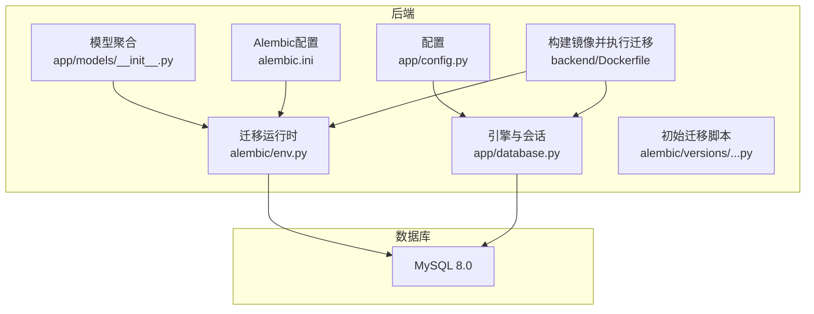
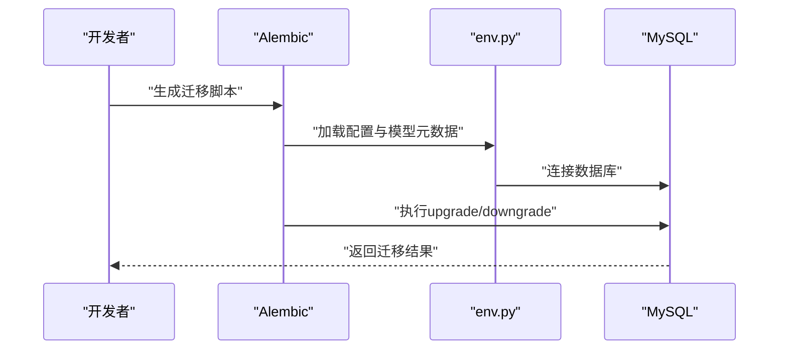
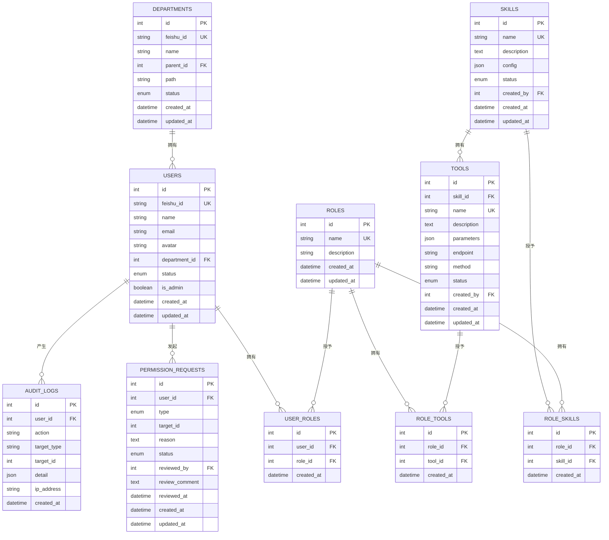
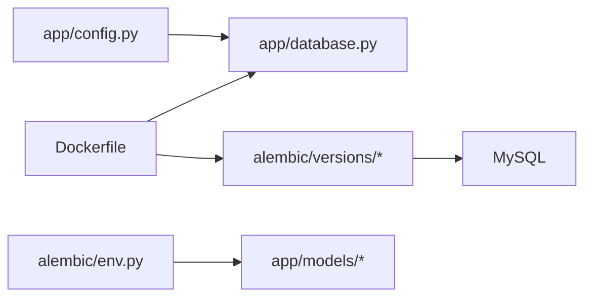

# 数据库开发

<cite>
**本文引用的文件**
- [alembic.ini](file://backend/alembic.ini)
- [env.py](file://backend/alembic/env.py)
- [script.py.mako](file://backend/alembic/script.py.mako)
- [5fb1c261fa23_initial_tables.py](file://backend/alembic/versions/5fb1c261fa23_initial_tables.py)
- [database.py](file://backend/app/database.py)
- [config.py](file://backend/app/config.py)
- [models/__init__.py](file://backend/app/models/__init__.py)
- [user.py](file://backend/app/models/user.py)
- [permission.py](file://backend/app/models/permission.py)
- [audit.py](file://backend/app/models/audit.py)
- [Dockerfile](file://backend/Dockerfile)
- [docker-compose.yml](file://docker-compose.yml)
</cite>

## 目录
1. [简介](#简介)
2. [项目结构](#项目结构)
3. [核心组件](#核心组件)
4. [架构总览](#架构总览)
5. [详细组件分析](#详细组件分析)
6. [依赖关系分析](#依赖关系分析)
7. [性能与优化](#性能与优化)
8. [故障排查指南](#故障排查指南)
9. [结论](#结论)
10. [附录](#附录)

## 简介
本指南面向ToolHub项目的数据库开发与运维，聚焦以下主题：
- Alembic迁移脚本编写规范（命名、版本管理、数据迁移策略）
- 数据库Schema设计原则（表结构、索引、约束、数据类型）
- 数据模型更新流程（模型修改、迁移生成、数据回填）
- 开发环境配置、本地数据库设置、测试数据库管理
- 备份恢复策略、性能优化与查询优化方法
- 版本控制与多环境同步、生产维护流程

## 项目结构
后端使用SQLAlchemy ORM与Alembic进行数据库版本管理，MySQL作为持久化存储，Docker Compose编排服务。

图表来源
- [config.py:11-42](file://backend/app/config.py#L11-L42)
- [database.py:1-25](file://backend/app/database.py#L1-L25)
- [models/__init__.py:1-17](file://backend/app/models/__init__.py#L1-L17)
- [alembic.ini:1-37](file://backend/alembic.ini#L1-L37)
- [env.py:1-49](file://backend/alembic/env.py#L1-L49)
- [Dockerfile:1-28](file://backend/Dockerfile#L1-L28)

章节来源
- [config.py:11-42](file://backend/app/config.py#L11-L42)
- [database.py:1-25](file://backend/app/database.py#L1-L25)
- [models/__init__.py:1-17](file://backend/app/models/__init__.py#L1-L17)
- [alembic.ini:1-37](file://backend/alembic.ini#L1-L37)
- [env.py:1-49](file://backend/alembic/env.py#L1-L49)
- [Dockerfile:1-28](file://backend/Dockerfile#L1-L28)

## 核心组件
- 配置层：集中管理数据库连接串、调试开关等，支持从环境变量覆盖。
- ORM层：统一的Base类与Engine/Session，提供连接池与预检查。
- 模型层：用户、角色、技能、工具、权限申请、审计日志等核心实体。
- 迁移层：Alembic配置与运行时，支持离线/在线迁移，自动发现模型元数据。
- 编排层：Dockerfile在启动前自动执行迁移，确保数据库Schema与代码一致。

章节来源
- [config.py:11-42](file://backend/app/config.py#L11-L42)
- [database.py:1-25](file://backend/app/database.py#L1-L25)
- [models/__init__.py:1-17](file://backend/app/models/__init__.py#L1-L17)
- [env.py:1-49](file://backend/alembic/env.py#L1-L49)

## 架构总览
数据库开发与部署的关键流程如下：

图表来源
- [env.py:11-18](file://backend/alembic/env.py#L11-L18)
- [env.py:21-48](file://backend/alembic/env.py#L21-L48)
- [alembic.ini:2-3](file://backend/alembic.ini#L2-L3)

## 详细组件分析

### Alembic迁移脚本编写规范
- 命名规范
  - 使用自动生成的带时间戳的修订ID，避免手写ID冲突。
  - 迁移脚本文件名应与修订ID一致，便于版本追踪。
- 版本管理
  - 单向演进：仅允许从旧版本升级到新版本；降级需提供对应downgrade实现。
  - 依赖链：通过down_revision明确前后版本关系。
- 数据迁移策略
  - 尽量使用不可变字段与唯一约束，避免破坏性变更。
  - 对于需要回填的数据，建议在upgrade中分批处理，并记录进度。
  - 删除列或表前，先迁移数据至新结构，再删除旧对象。
- 自动发现模型
  - env.py导入所有模型以供autogenerate识别，确保新增模型能被纳入迁移。

章节来源
- [script.py.mako:1-24](file://backend/alembic/script.py.mako#L1-L24)
- [5fb1c261fa23_initial_tables.py:1-161](file://backend/alembic/versions/5fb1c261fa23_initial_tables.py#L1-L161)
- [env.py:5-7](file://backend/alembic/env.py#L5-L7)

### 数据库Schema设计原则
- 表结构设计
  - 主键统一使用自增整数，外键引用清晰，避免循环依赖。
  - 关系表（如用户-角色、角色-技能、角色-工具）采用复合主键或自增主键+必要唯一约束。
- 索引策略
  - 唯一索引用于保证业务唯一性（如用户飞书ID、角色名、工具名）。
  - 复合索引用于高并发查询场景（如权限申请的状态+目标组合查询）。
- 约束定义
  - 使用ON DELETE CASCADE处理级联删除，保持数据一致性。
  - ENUM枚举用于有限取值集合，提升可读性与校验能力。
- 数据类型选择
  - 文本描述使用Text，JSON结构使用JSON类型保存配置。
  - 时间戳使用DateTime，布尔状态使用Boolean。
  - IP地址使用较短字符串类型，满足IPv4/IPv6需求。

章节来源
- [user.py:7-116](file://backend/app/models/user.py#L7-L116)
- [permission.py:7-28](file://backend/app/models/permission.py#L7-L28)
- [audit.py:6-17](file://backend/app/models/audit.py#L6-L17)

### 数据模型更新流程
- 修改模型
  - 在ORM模型中添加/修改字段，确保注释与约束完整。
- 生成迁移
  - 使用Alembic的autogenerate功能对比模型与数据库差异，生成脚本。
- 执行迁移
  - 在开发环境先执行upgrade，验证无误后再合并到主分支。
- 数据回填
  - 对于新增字段，提供默认值或回填逻辑，避免NULL泛滥。
  - 对历史数据进行批量补全，注意事务与分页处理。

章节来源
- [models/__init__.py:1-17](file://backend/app/models/__init__.py#L1-L17)
- [env.py:5-7](file://backend/alembic/env.py#L5-L7)

### 开发环境配置与本地数据库
- 数据库连接
  - 优先从环境变量DATABASE_URL获取，其次使用应用配置settings.DATABASE_URL，最后回退到alembic.ini中的默认值。
- 本地MySQL
  - 使用Docker Compose一键拉起MySQL 8.0，设置根密码、数据库名、用户与密码。
- 后端容器
  - Dockerfile在启动前执行alembic upgrade head，确保Schema与代码一致。
- 测试数据库
  - 建议为测试环境单独配置DATABASE_URL，避免污染开发数据。

章节来源
- [env.py:11-13](file://backend/alembic/env.py#L11-L13)
- [config.py:17-18](file://backend/app/config.py#L17-L18)
- [alembic.ini:3](file://backend/alembic.ini#L3)
- [docker-compose.yml:1-84](file://docker-compose.yml#L1-L84)
- [Dockerfile:27-28](file://backend/Dockerfile#L27-L28)

### 初始迁移脚本解析
该脚本定义了完整的初始Schema，包含部门、用户、角色、技能、工具、权限申请与审计日志等表，并建立必要的索引与外键约束。

图表来源
- [5fb1c261fa23_initial_tables.py:19-161](file://backend/alembic/versions/5fb1c261fa23_initial_tables.py#L19-L161)
- [user.py:7-116](file://backend/app/models/user.py#L7-L116)
- [permission.py:7-28](file://backend/app/models/permission.py#L7-L28)
- [audit.py:6-17](file://backend/app/models/audit.py#L6-L17)

## 依赖关系分析
- Alembic依赖SQLAlchemy元数据，env.py导入所有模型以供自动发现。
- 运行时连接由app/config.py与app/database.py提供，支持环境变量覆盖。
- Dockerfile在启动前执行alembic upgrade head，确保容器内Schema与代码一致。

图表来源
- [config.py:11-42](file://backend/app/config.py#L11-L42)
- [database.py:1-25](file://backend/app/database.py#L1-L25)
- [env.py:5-7](file://backend/alembic/env.py#L5-L7)
- [Dockerfile:27-28](file://backend/Dockerfile#L27-L28)

章节来源
- [config.py:11-42](file://backend/app/config.py#L11-L42)
- [database.py:1-25](file://backend/app/database.py#L1-L25)
- [env.py:5-7](file://backend/alembic/env.py#L5-L7)
- [Dockerfile:27-28](file://backend/Dockerfile#L27-L28)

## 性能与优化
- 连接与池化
  - 启用pool_pre_ping与合理的pool_recycle，减少断连与资源泄漏。
  - 根据并发调整连接池大小，避免过度占用。
- 查询优化
  - 为高频过滤与关联字段建立索引，避免全表扫描。
  - 使用分页查询与LIMIT，避免一次性返回大量数据。
  - 避免N+1查询，优先使用join或select_in_load。
- Schema设计
  - ENUM与固定长度字符串减少存储冗余。
  - JSON适合非结构化配置，复杂查询时考虑规范化拆分。
- 迁移期间
  - 大表DDL建议在低峰期执行，必要时使用在线DDL工具。
  - 分批回填数据，记录进度，失败可重试。

## 故障排查指南
- 迁移失败
  - 检查DATABASE_URL是否正确，确认环境变量覆盖顺序。
  - 确认所有模型已导入，以便Alembic自动发现。
- 连接异常
  - 查看DEBUG与SQL日志级别，定位连接问题。
  - 核对MySQL容器健康状态与端口映射。
- Docker启动卡住
  - 确认MySQL容器健康检查通过后再启动后端。
  - 查看Dockerfile中alembic命令执行日志。

章节来源
- [env.py:11-13](file://backend/alembic/env.py#L11-L13)
- [docker-compose.yml:16-21](file://docker-compose.yml#L16-L21)
- [Dockerfile:27-28](file://backend/Dockerfile#L27-L28)

## 结论
通过标准化的Alembic迁移流程、清晰的Schema设计与完善的开发/测试/生产环境配置，ToolHub能够稳定地演进数据库结构。建议在团队内统一迁移命名与提交规范，持续关注查询性能与索引策略，确保系统在高并发下的可靠性与可维护性。

## 附录
- 多环境同步
  - 开发/测试/生产分别配置独立DATABASE_URL，避免相互影响。
  - 使用相同版本的Alembic与Python依赖，确保迁移行为一致。
- 生产维护流程
  - 变更前先在测试环境验证迁移脚本与数据回填策略。
  - 采用灰度发布，逐步扩大升级范围，并准备回滚方案。
- 备份与恢复
  - 定期导出数据库快照，验证恢复流程。
  - 迁移前对关键表进行增量备份，保留恢复点。