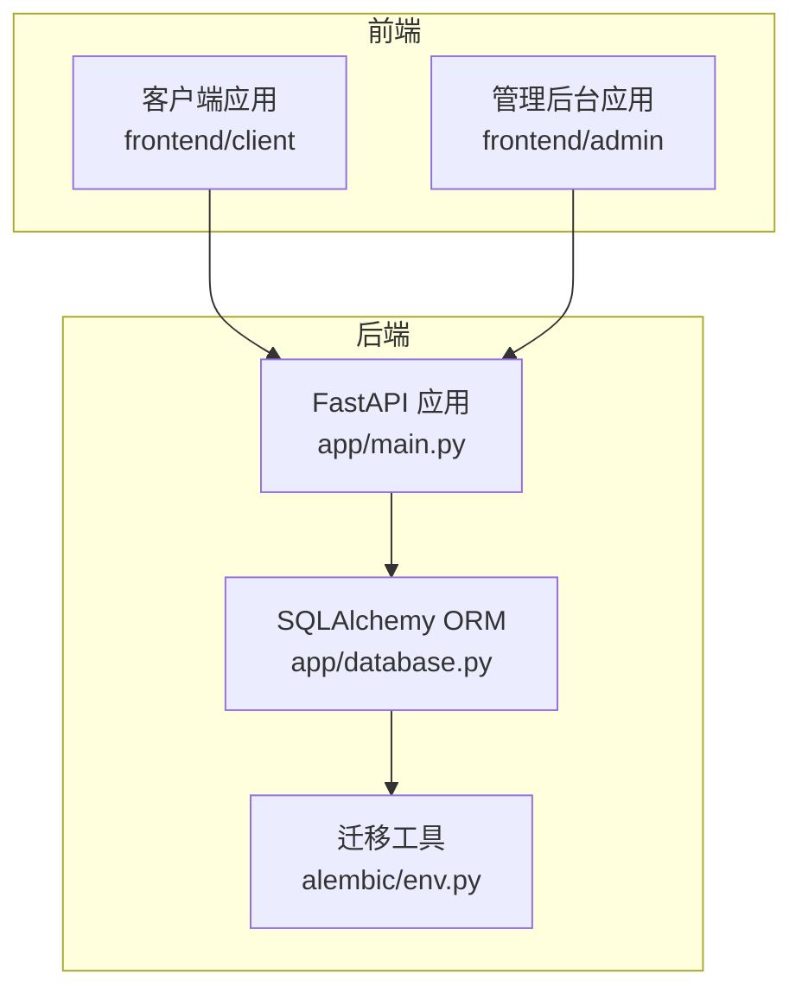
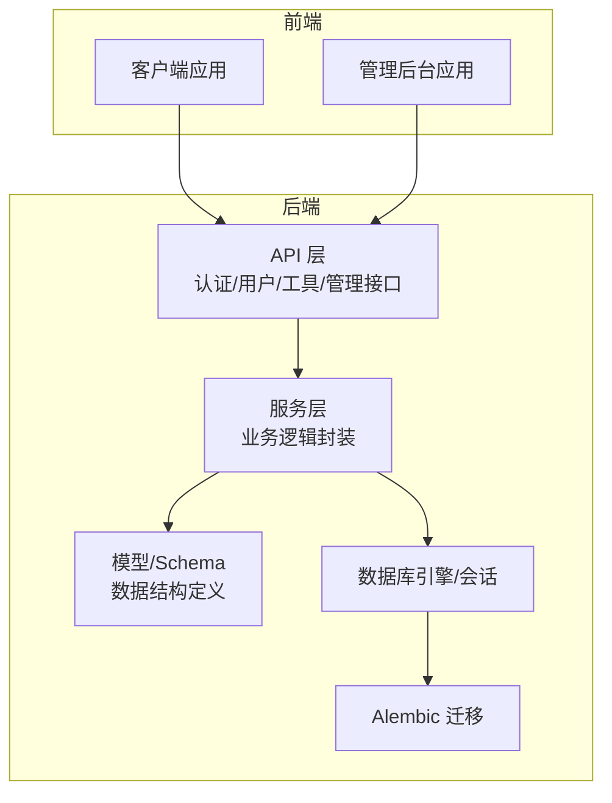
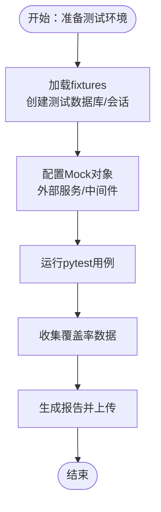
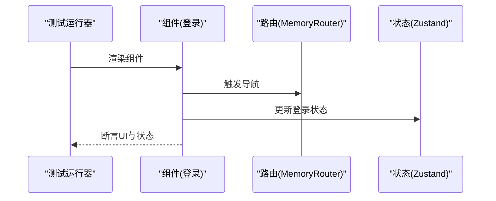
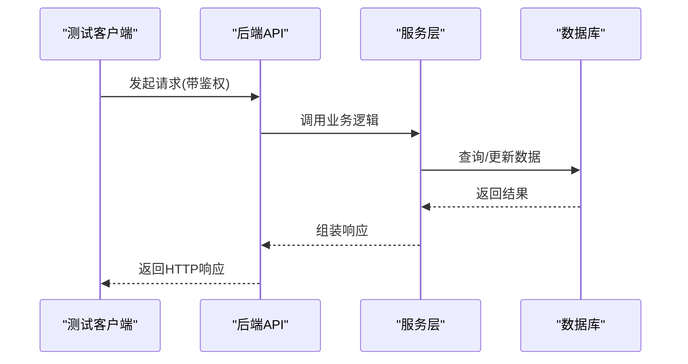
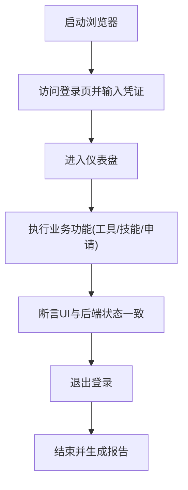
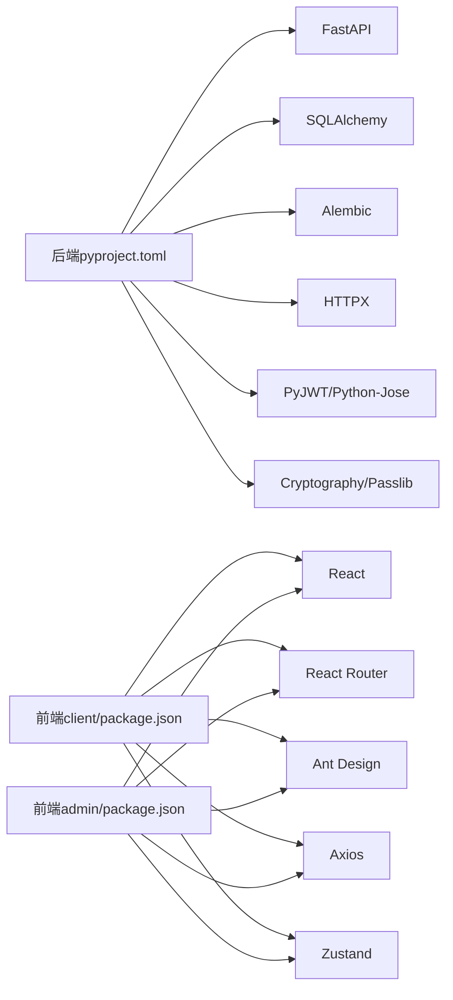

# 测试策略

<cite>
**本文引用的文件**
- [backend/pyproject.toml](file://backend/pyproject.toml)
- [backend/app/config.py](file://backend/app/config.py)
- [backend/app/database.py](file://backend/app/database.py)
- [backend/alembic/env.py](file://backend/alembic/env.py)
- [backend/alembic/versions/5fb1c261fa23_initial_tables.py](file://backend/alembic/versions/5fb1c261fa23_initial_tables.py)
- [backend/app/api/auth.py](file://backend/app/api/auth.py)
- [backend/app/api/users.py](file://backend/app/api/users.py)
- [backend/app/api/tools.py](file://backend/app/api/tools.py)
- [backend/app/api/admin/users.py](file://backend/app/api/admin/users.py)
- [backend/app/api/admin/tools.py](file://backend/app/api/admin/tools.py)
- [backend/app/api/admin/roles.py](file://backend/app/api/admin/roles.py)
- [backend/app/api/admin/departments.py](file://backend/app/api/admin/departments.py)
- [backend/app/api/admin/skills.py](file://backend/app/api/admin/skills.py)
- [backend/app/api/admin/audit.py](file://backend/app/api/admin/audit.py)
- [backend/app/api/admin/approvals.py](file://backend/app/api/admin/approvals.py)
- [backend/app/services/auth.py](file://backend/app/services/auth.py)
- [backend/app/services/user.py](file://backend/app/services/user.py)
- [backend/app/services/tool.py](file://backend/app/services/tool.py)
- [backend/app/services/role.py](file://backend/app/services/role.py)
- [backend/app/services/department.py](file://backend/app/services/department.py)
- [backend/app/services/skill.py](file://backend/app/services/skill.py)
- [backend/app/services/audit.py](file://backend/app/services/audit.py)
- [backend/app/services/permission.py](file://backend/app/services/permission.py)
- [backend/app/models/user.py](file://backend/app/models/user.py)
- [backend/app/models/audit.py](file://backend/app/models/audit.py)
- [backend/app/schemas/auth.py](file://backend/app/schemas/auth.py)
- [backend/app/schemas/user.py](file://backend/app/schemas/user.py)
- [backend/app/schemas/tool.py](file://backend/app/schemas/tool.py)
- [backend/app/schemas/permission.py](file://backend/app/schemas/permission.py)
- [backend/app/middleware/auth.py](file://backend/app/middleware/auth.py)
- [backend/docker-compose.yml](file://backend/docker-compose.yml)
- [frontend/client/package.json](file://frontend/client/package.json)
- [frontend/admin/package.json](file://frontend/admin/package.json)
- [frontend/client/src/pages/Login.tsx](file://frontend/client/src/pages/Login.tsx)
- [frontend/client/src/pages/Dashboard.tsx](file://frontend/client/src/pages/Dashboard.tsx)
- [frontend/client/src/pages/Tools.tsx](file://frontend/client/src/pages/Tools.tsx)
- [frontend/client/src/pages/Skills.tsx](file://frontend/client/src/pages/Skills.tsx)
- [frontend/client/src/pages/ApplyPermission.tsx](file://frontend/client/src/pages/ApplyPermission.tsx)
- [frontend/client/src/pages/MyRequests.tsx](file://frontend/client/src/pages/MyRequests.tsx)
- [frontend/client/src/components/MainLayout.tsx](file://frontend/client/src/components/MainLayout.tsx)
- [frontend/client/src/store/auth.ts](file://frontend/client/src/store/auth.ts)
- [frontend/admin/src/pages/Login.tsx](file://frontend/admin/src/pages/Login.tsx)
- [frontend/admin/src/pages/Dashboard.tsx](file://frontend/admin/src/pages/Dashboard.tsx)
- [frontend/admin/src/pages/Users.tsx](file://frontend/admin/src/pages/Users.tsx)
- [frontend/admin/src/pages/Tools.tsx](file://frontend/admin/src/pages/Tools.tsx)
- [frontend/admin/src/pages/Roles.tsx](file://frontend/admin/src/pages/Roles.tsx)
- [frontend/admin/src/pages/Departments.tsx](file://frontend/admin/src/pages/Departments.tsx)
- [frontend/admin/src/pages/Skills.tsx](file://frontend/admin/src/pages/Skills.tsx)
- [frontend/admin/src/pages/AuditLogs.tsx](file://frontend/admin/src/pages/AuditLogs.tsx)
- [frontend/admin/src/pages/Approvals.tsx](file://frontend/admin/src/pages/Approvals.tsx)
- [frontend/admin/src/components/MainLayout.tsx](file://frontend/admin/src/components/MainLayout.tsx)
- [frontend/admin/src/store/auth.ts](file://frontend/admin/src/store/auth.ts)
</cite>

## 目录
1. [引言](#引言)
2. [项目结构](#项目结构)
3. [核心组件](#核心组件)
4. [架构总览](#架构总览)
5. [详细组件分析](#详细组件分析)
6. [依赖关系分析](#依赖关系分析)
7. [性能考虑](#性能考虑)
8. [故障排查指南](#故障排查指南)
9. [结论](#结论)
10. [附录](#附录)

## 引言
本测试策略文档面向ToolHub项目，覆盖后端Python/FastAPI、前端React应用的全栈测试体系，包括单元测试、集成测试、端到端测试、性能与安全测试以及自动化与持续测试流程建议。文档基于仓库现有代码结构与依赖进行设计，确保可落地执行。

## 项目结构
ToolHub采用前后端分离架构：后端使用FastAPI + SQLAlchemy + Alembic；前端提供两套应用（client/admin），均基于React + Vite。测试策略将分别针对后端API与ORM、前端组件与路由状态进行分层设计。

图表来源
- [backend/app/database.py:1-25](file://backend/app/database.py#L1-L25)
- [backend/alembic/env.py](file://backend/alembic/env.py)
- [frontend/client/package.json:1-29](file://frontend/client/package.json#L1-L29)
- [frontend/admin/package.json:1-29](file://frontend/admin/package.json#L1-L29)

章节来源
- [backend/app/config.py:1-42](file://backend/app/config.py#L1-L42)
- [backend/app/database.py:1-25](file://backend/app/database.py#L1-L25)
- [backend/alembic/env.py](file://backend/alembic/env.py)
- [frontend/client/package.json:1-29](file://frontend/client/package.json#L1-L29)
- [frontend/admin/package.json:1-29](file://frontend/admin/package.json#L1-L29)

## 核心组件
- 后端核心模块
  - 配置与环境：应用名称、调试模式、数据库URL、JWT密钥与算法、Feishu OAuth参数、CORS白名单等。
  - 数据库连接与会话：通过SQLAlchemy创建引擎与会话工厂，并提供依赖注入的数据库会话生成器。
  - 迁移：Alembic版本化迁移脚本用于数据库演进。
  - API层：认证、用户、工具、技能、权限请求、管理员相关接口。
  - 服务层：封装业务逻辑，如认证、用户、工具、角色、部门、技能、审计、权限等。
  - 模型与Schema：定义数据库模型与请求/响应数据结构。
  - 中间件：鉴权中间件。
- 前端核心模块
  - 客户端应用：登录、仪表盘、工具列表、技能详情、申请权限、我的申请等页面。
  - 管理后台应用：登录、仪表盘、用户、工具、角色、部门、技能、审计日志、审批等页面。
  - 组件与状态：主布局组件、全局状态（Zustand）等。

章节来源
- [backend/app/config.py:11-42](file://backend/app/config.py#L11-L42)
- [backend/app/database.py:1-25](file://backend/app/database.py#L1-L25)
- [backend/alembic/versions/5fb1c261fa23_initial_tables.py](file://backend/alembic/versions/5fb1c261fa23_initial_tables.py)
- [backend/app/api/auth.py](file://backend/app/api/auth.py)
- [backend/app/api/users.py](file://backend/app/api/users.py)
- [backend/app/api/tools.py](file://backend/app/api/tools.py)
- [backend/app/api/admin/users.py](file://backend/app/api/admin/users.py)
- [backend/app/api/admin/tools.py](file://backend/app/api/admin/tools.py)
- [backend/app/api/admin/roles.py](file://backend/app/api/admin/roles.py)
- [backend/app/api/admin/departments.py](file://backend/app/api/admin/departments.py)
- [backend/app/api/admin/skills.py](file://backend/app/api/admin/skills.py)
- [backend/app/api/admin/audit.py](file://backend/app/api/admin/audit.py)
- [backend/app/api/admin/approvals.py](file://backend/app/api/admin/approvals.py)
- [backend/app/services/auth.py](file://backend/app/services/auth.py)
- [backend/app/services/user.py](file://backend/app/services/user.py)
- [backend/app/services/tool.py](file://backend/app/services/tool.py)
- [backend/app/services/role.py](file://backend/app/services/role.py)
- [backend/app/services/department.py](file://backend/app/services/department.py)
- [backend/app/services/skill.py](file://backend/app/services/skill.py)
- [backend/app/services/audit.py](file://backend/app/services/audit.py)
- [backend/app/services/permission.py](file://backend/app/services/permission.py)
- [backend/app/models/user.py](file://backend/app/models/user.py)
- [backend/app/models/audit.py](file://backend/app/models/audit.py)
- [backend/app/schemas/auth.py](file://backend/app/schemas/auth.py)
- [backend/app/schemas/user.py](file://backend/app/schemas/user.py)
- [backend/app/schemas/tool.py](file://backend/app/schemas/tool.py)
- [backend/app/schemas/permission.py](file://backend/app/schemas/permission.py)
- [backend/app/middleware/auth.py](file://backend/app/middleware/auth.py)
- [frontend/client/src/pages/Login.tsx](file://frontend/client/src/pages/Login.tsx)
- [frontend/client/src/pages/Dashboard.tsx](file://frontend/client/src/pages/Dashboard.tsx)
- [frontend/client/src/pages/Tools.tsx](file://frontend/client/src/pages/Tools.tsx)
- [frontend/client/src/pages/Skills.tsx](file://frontend/client/src/pages/Skills.tsx)
- [frontend/client/src/pages/ApplyPermission.tsx](file://frontend/client/src/pages/ApplyPermission.tsx)
- [frontend/client/src/pages/MyRequests.tsx](file://frontend/client/src/pages/MyRequests.tsx)
- [frontend/client/src/components/MainLayout.tsx](file://frontend/client/src/components/MainLayout.tsx)
- [frontend/client/src/store/auth.ts](file://frontend/client/src/store/auth.ts)
- [frontend/admin/src/pages/Login.tsx](file://frontend/admin/src/pages/Login.tsx)
- [frontend/admin/src/pages/Dashboard.tsx](file://frontend/admin/src/pages/Dashboard.tsx)
- [frontend/admin/src/pages/Users.tsx](file://frontend/admin/src/pages/Users.tsx)
- [frontend/admin/src/pages/Tools.tsx](file://frontend/admin/src/pages/Tools.tsx)
- [frontend/admin/src/pages/Roles.tsx](file://frontend/admin/src/pages/Roles.tsx)
- [frontend/admin/src/pages/Departments.tsx](file://frontend/admin/src/pages/Departments.tsx)
- [frontend/admin/src/pages/Skills.tsx](file://frontend/admin/src/pages/Skills.tsx)
- [frontend/admin/src/pages/AuditLogs.tsx](file://frontend/admin/src/pages/AuditLogs.tsx)
- [frontend/admin/src/pages/Approvals.tsx](file://frontend/admin/src/pages/Approvals.tsx)
- [frontend/admin/src/components/MainLayout.tsx](file://frontend/admin/src/components/MainLayout.tsx)
- [frontend/admin/src/store/auth.ts](file://frontend/admin/src/store/auth.ts)

## 架构总览
下图展示后端API、服务层、数据库与迁移工具之间的交互关系，以及前端两套应用如何调用后端API。

图表来源
- [backend/app/api/auth.py](file://backend/app/api/auth.py)
- [backend/app/api/users.py](file://backend/app/api/users.py)
- [backend/app/api/tools.py](file://backend/app/api/tools.py)
- [backend/app/api/admin/users.py](file://backend/app/api/admin/users.py)
- [backend/app/api/admin/tools.py](file://backend/app/api/admin/tools.py)
- [backend/app/services/user.py](file://backend/app/services/user.py)
- [backend/app/services/tool.py](file://backend/app/services/tool.py)
- [backend/app/database.py:1-25](file://backend/app/database.py#L1-L25)
- [backend/alembic/env.py](file://backend/alembic/env.py)

## 详细组件分析

### 后端单元测试策略（pytest）
- 测试框架与运行
  - 使用pytest作为测试运行器，结合HTTP客户端（如httpx或FastAPI TestClient）发起请求。
  - 在测试中替换真实数据库为内存SQLite或独立测试数据库实例，避免污染生产数据。
- Mock与依赖注入
  - 对外部服务（如Feishu OAuth）使用Mock对象模拟回调与用户信息获取。
  - 使用pytest fixtures管理数据库会话、测试数据与临时配置。
- 测试数据准备
  - 使用Alembic在测试前执行迁移，确保表结构一致。
  - 编写小而明确的测试夹具，按需插入最小化测试数据。
- 关键模块测试要点
  - 认证与鉴权：登录、令牌刷新、权限校验、中间件拦截无效请求。
  - 用户与权限：用户CRUD、权限申请与审批、角色与部门关联。
  - 工具与技能：工具查询、详情、权限绑定；技能目录与关联。
  - 管理员功能：用户管理、工具管理、角色与部门维护、审计日志与审批流。
- 覆盖率与报告
  - 使用pytest-cov统计覆盖率，目标行覆盖率≥80%，函数/分支覆盖率≥70%。
  - 生成HTML与XML报告，集成CI系统。

图表来源
- [backend/pyproject.toml:1-31](file://backend/pyproject.toml#L1-L31)
- [backend/app/config.py:11-42](file://backend/app/config.py#L11-L42)
- [backend/app/database.py:1-25](file://backend/app/database.py#L1-L25)
- [backend/alembic/env.py](file://backend/alembic/env.py)

章节来源
- [backend/pyproject.toml:1-31](file://backend/pyproject.toml#L1-L31)
- [backend/app/config.py:11-42](file://backend/app/config.py#L11-L42)
- [backend/app/database.py:1-25](file://backend/app/database.py#L1-L25)
- [backend/alembic/env.py](file://backend/alembic/env.py)

### 前端组件测试策略（React Testing Library）
- 测试范围
  - 页面组件：登录、仪表盘、工具、技能、申请权限、我的申请、管理后台各页面。
  - 复用组件：主布局、状态容器（Zustand store）。
- 测试类型
  - 单元测试：组件渲染、事件触发、状态变更、路由行为。
  - 快照测试：组件输出稳定性验证，防止UI回归。
  - 集成测试：组件与store、路由、API调用的协作。
- 测试工具
  - React Testing Library + Jest（或Vitest）。
  - 使用MemoryRouter模拟路由，useNavigate/useLocation断言导航行为。
  - 使用Zustand测试工具对store进行mock与断言。
- 覆盖率与质量
  - 行覆盖率≥80%，函数/语句覆盖率≥75%。
  - 重点保障交互路径与错误边界覆盖。

图表来源
- [frontend/client/src/pages/Login.tsx](file://frontend/client/src/pages/Login.tsx)
- [frontend/admin/src/pages/Login.tsx](file://frontend/admin/src/pages/Login.tsx)
- [frontend/client/src/store/auth.ts](file://frontend/client/src/store/auth.ts)
- [frontend/admin/src/store/auth.ts](file://frontend/admin/src/store/auth.ts)

章节来源
- [frontend/client/src/pages/Login.tsx](file://frontend/client/src/pages/Login.tsx)
- [frontend/admin/src/pages/Login.tsx](file://frontend/admin/src/pages/Login.tsx)
- [frontend/client/src/store/auth.ts](file://frontend/client/src/store/auth.ts)
- [frontend/admin/src/store/auth.ts](file://frontend/admin/src/store/auth.ts)

### 集成测试方案
- API接口测试
  - 使用TestClient或httpx发起请求，覆盖认证、用户、工具、技能、权限、管理后台等接口。
  - 验证响应状态码、JSON结构、分页与过滤、排序、鉴权失败等边界条件。
- 数据库集成测试
  - 在独立测试数据库中执行迁移，插入测试数据，验证CRUD与联表查询。
  - 使用事务回滚或数据库快照恢复，保证测试隔离与可重复性。
- 第三方服务集成测试
  - Mock Feishu OAuth回调，验证授权码换取令牌、用户信息拉取、本地账户映射。
  - 验证审计日志记录与审批流程的端到端链路。

图表来源
- [backend/app/api/auth.py](file://backend/app/api/auth.py)
- [backend/app/services/auth.py](file://backend/app/services/auth.py)
- [backend/app/database.py:1-25](file://backend/app/database.py#L1-L25)

章节来源
- [backend/app/api/auth.py](file://backend/app/api/auth.py)
- [backend/app/services/auth.py](file://backend/app/services/auth.py)
- [backend/app/database.py:1-25](file://backend/app/database.py#L1-L25)

### 端到端测试策略（Playwright/Cypress）
- 工具选择
  - Playwright：跨浏览器支持（Chromium/Firefox/Safari），网络与设备模拟能力强。
  - Cypress：开发体验佳，适合快速迭代与本地调试。
- 用户场景测试
  - 客户端：登录→查看工具→查看技能→申请权限→查看我的申请→退出。
  - 管理后台：登录→用户管理→工具管理→角色/部门维护→审计日志→审批。
- 跨浏览器测试
  - CI中并行运行Chromium/Firefox/Safari，失败重试与截图/视频留存。
- 状态与数据
  - 使用测试专用账号与预置数据，确保场景可重现。
  - 通过API或数据库初始化测试数据，避免依赖UI步骤。

图表来源
- [frontend/client/src/pages/Login.tsx](file://frontend/client/src/pages/Login.tsx)
- [frontend/client/src/pages/Dashboard.tsx](file://frontend/client/src/pages/Dashboard.tsx)
- [frontend/client/src/pages/ApplyPermission.tsx](file://frontend/client/src/pages/ApplyPermission.tsx)
- [frontend/admin/src/pages/Login.tsx](file://frontend/admin/src/pages/Login.tsx)
- [frontend/admin/src/pages/Dashboard.tsx](file://frontend/admin/src/pages/Dashboard.tsx)

章节来源
- [frontend/client/src/pages/Login.tsx](file://frontend/client/src/pages/Login.tsx)
- [frontend/client/src/pages/Dashboard.tsx](file://frontend/client/src/pages/Dashboard.tsx)
- [frontend/admin/src/pages/Login.tsx](file://frontend/admin/src/pages/Login.tsx)
- [frontend/admin/src/pages/Dashboard.tsx](file://frontend/admin/src/pages/Dashboard.tsx)

### 性能测试、安全测试与兼容性测试
- 性能测试
  - 接口压测：使用Locust或Artillery对高频接口（登录、工具列表、技能详情）施压，观察P95/P99延迟与错误率。
  - 前端性能：Lighthouse或WebPageTest评估首屏时间、交互延迟、资源体积。
- 安全测试
  - 依赖注入与SQL注入：参数化查询与ORM使用，避免原生SQL拼接。
  - XSS与CSRF：前端输入校验与后端CSRF保护（如适用），CORS配置严格白名单。
  - 权限越权：强制RBAC校验，管理员操作审计。
- 兼容性测试
  - 前端：主流浏览器（Chrome最新、Firefox最新、Safari最新）与移动端视口。
  - 后端：Python版本与依赖兼容矩阵，数据库驱动兼容性。

## 依赖关系分析
- 后端依赖
  - FastAPI、SQLAlchemy、Alembic、Pydantic、Pydantic-Settings、HTTPX、Passlib、PyJWT等。
- 前端依赖
  - React、React Router、Ant Design、Axios、Zustand、Day.js等。
- 测试相关依赖
  - pytest、pytest-cov、httpx、pytest-mock、pytest-asyncio（如使用异步测试）。

图表来源
- [backend/pyproject.toml:1-31](file://backend/pyproject.toml#L1-L31)
- [frontend/client/package.json:1-29](file://frontend/client/package.json#L1-L29)
- [frontend/admin/package.json:1-29](file://frontend/admin/package.json#L1-L29)

章节来源
- [backend/pyproject.toml:1-31](file://backend/pyproject.toml#L1-L31)
- [frontend/client/package.json:1-29](file://frontend/client/package.json#L1-L29)
- [frontend/admin/package.json:1-29](file://frontend/admin/package.json#L1-L29)

## 性能考虑
- 后端
  - 数据库连接池参数与超时设置，避免长事务与阻塞。
  - 分页查询与索引优化，避免N+1查询。
  - 缓存热点数据（如工具/技能列表），减少数据库压力。
- 前端
  - 组件懒加载与路由懒加载，减小首包体积。
  - 列表虚拟化与分页，避免一次性渲染大量节点。
  - 图标与图片资源压缩与CDN加速。

## 故障排查指南
- 数据库连接失败
  - 检查DATABASE_URL与网络连通性，确认容器/服务已就绪。
  - 查看DEBUG日志与SQL回放，定位慢查询。
- 认证与鉴权异常
  - 核对JWT密钥、算法与过期时间，检查中间件是否正确注入。
  - 校验CORS白名单与Cookie SameSite策略。
- 前端路由与状态问题
  - 使用React DevTools与Redux DevTools（Zustand DevTools）检查状态变化。
  - MemoryRouter下断言导航行为，确保路由守卫生效。

章节来源
- [backend/app/config.py:11-42](file://backend/app/config.py#L11-L42)
- [backend/app/database.py:1-25](file://backend/app/database.py#L1-L25)
- [backend/app/middleware/auth.py](file://backend/app/middleware/auth.py)
- [frontend/client/src/store/auth.ts](file://frontend/client/src/store/auth.ts)
- [frontend/admin/src/store/auth.ts](file://frontend/admin/src/store/auth.ts)

## 结论
本测试策略以“分层覆盖、可重复执行、可观测性”为核心原则，结合pytest、RTL、E2E工具与CI流水线，确保ToolHub在功能正确性、性能稳定性与安全性方面达到工程化标准。建议优先补齐缺失的测试文件，并在CI中引入覆盖率阈值与质量门禁。

## 附录
- 测试数据管理
  - 使用Alembic迁移初始化测试数据库，编写轻量级fixture插入最小测试集。
  - 对敏感数据（如JWT密钥）使用环境变量或测试专用配置。
- 测试环境配置
  - 后端：独立测试数据库、Mock外部服务、关闭DEBUG或仅在本地开启。
  - 前端：Vite测试模式、内存路由、Mock API与Store。
- 自动化与持续测试
  - CI中分阶段执行：单元测试（pytest）→集成测试（数据库+API）→端到端测试（Playwright/Cypress）→覆盖率上报。
  - 失败重试与报告归档，便于回溯与质量追踪。