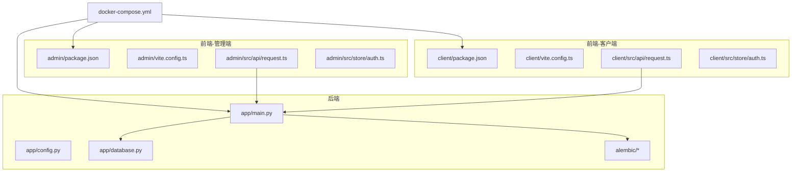
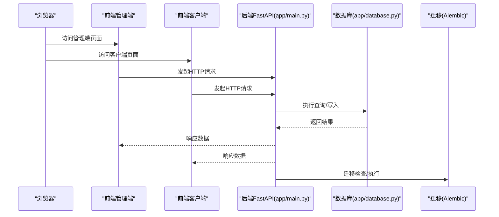
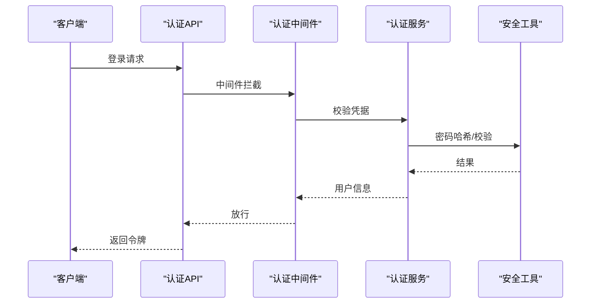
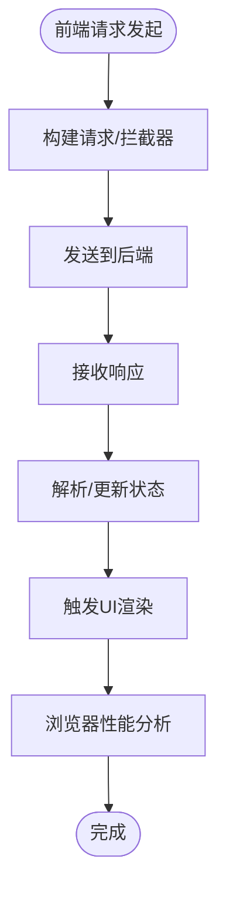
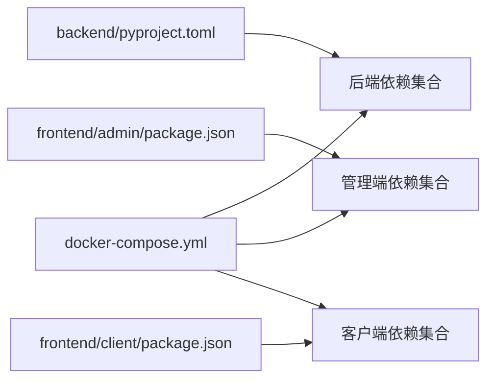

# 调试与工具

<cite>
**本文引用的文件**
- [backend/pyproject.toml](file://backend/pyproject.toml)
- [pyproject.toml](file://pyproject.toml)
- [docker-compose.yml](file://docker-compose.yml)
- [backend/Dockerfile](file://backend/Dockerfile)
- [frontend/admin/Dockerfile](file://frontend/admin/Dockerfile)
- [frontend/client/Dockerfile](file://frontend/client/Dockerfile)
- [backend/app/main.py](file://backend/app/main.py)
- [backend/app/config.py](file://backend/app/config.py)
- [backend/app/database.py](file://backend/app/database.py)
- [backend/app/api/auth.py](file://backend/app/api/auth.py)
- [backend/app/api/tools.py](file://backend/app/api/tools.py)
- [backend/app/api/users.py](file://backend/app/api/users.py)
- [backend/app/middleware/auth.py](file://backend/app/middleware/auth.py)
- [backend/app/services/auth.py](file://backend/app/services/auth.py)
- [backend/app/utils/security.py](file://backend/app/utils/security.py)
- [backend/alembic/env.py](file://backend/alembic/env.py)
- [backend/alembic/script.py.mako](file://backend/alembic/script.py.mako)
- [backend/alembic.ini](file://backend/alembic.ini)
- [frontend/admin/package.json](file://frontend/admin/package.json)
- [frontend/admin/vite.config.ts](file://frontend/admin/vite.config.ts)
- [frontend/admin/src/api/request.ts](file://frontend/admin/src/api/request.ts)
- [frontend/admin/src/store/auth.ts](file://frontend/admin/src/store/auth.ts)
- [frontend/client/package.json](file://frontend/client/package.json)
- [frontend/client/vite.config.ts](file://frontend/client/vite.config.ts)
- [frontend/client/src/api/request.ts](file://frontend/client/src/api/request.ts)
- [frontend/client/src/store/auth.ts](file://frontend/client/src/store/auth.ts)
</cite>

## 目录
1. [简介](#简介)
2. [项目结构](#项目结构)
3. [核心组件](#核心组件)
4. [架构总览](#架构总览)
5. [详细组件分析](#详细组件分析)
6. [依赖分析](#依赖分析)
7. [性能考虑](#性能考虑)
8. [故障排查指南](#故障排查指南)
9. [结论](#结论)
10. [附录](#附录)

## 简介
本指南面向ToolHub项目的开发者与调试人员，覆盖后端Python（FastAPI）、前端React（TS）以及Docker容器环境下的调试与开发工具使用方法。内容包括IDE配置建议（VS Code、PyCharm、WebStorm）、调试器技巧（断点、变量监视、调用栈、异步调试）、性能分析（Python性能分析器、前端性能监控、数据库查询优化）、日志与错误追踪、网络请求调试、容器与数据库调试，以及常用开发命令与效率工具。

## 项目结构
ToolHub采用前后端分离架构：后端基于FastAPI，前端分为管理端与客户端两套应用，均通过Vite构建；整体通过Docker进行容器化部署，并使用docker-compose编排。

**图表来源**
- [backend/app/main.py:1-200](file://backend/app/main.py#L1-L200)
- [backend/app/config.py:1-120](file://backend/app/config.py#L1-L120)
- [backend/app/database.py:1-120](file://backend/app/database.py#L1-L120)
- [backend/alembic/env.py:1-120](file://backend/alembic/env.py#L1-L120)
- [frontend/admin/package.json:1-200](file://frontend/admin/package.json#L1-L200)
- [frontend/admin/vite.config.ts:1-120](file://frontend/admin/vite.config.ts#L1-L120)
- [frontend/admin/src/api/request.ts:1-120](file://frontend/admin/src/api/request.ts#L1-L120)
- [frontend/admin/src/store/auth.ts:1-120](file://frontend/admin/src/store/auth.ts#L1-L120)
- [frontend/client/package.json:1-200](file://frontend/client/package.json#L1-L200)
- [frontend/client/vite.config.ts:1-120](file://frontend/client/vite.config.ts#L1-L120)
- [frontend/client/src/api/request.ts:1-120](file://frontend/client/src/api/request.ts#L1-L120)
- [frontend/client/src/store/auth.ts:1-120](file://frontend/client/src/store/auth.ts#L1-L120)
- [docker-compose.yml:1-200](file://docker-compose.yml#L1-L200)

**章节来源**
- [backend/app/main.py:1-200](file://backend/app/main.py#L1-L200)
- [docker-compose.yml:1-200](file://docker-compose.yml#L1-L200)

## 核心组件
- 后端主入口与路由：后端通过主程序启动FastAPI应用，注册路由与中间件，负责业务API与数据库交互。
- 配置模块：集中管理运行时配置（如数据库连接、安全参数等）。
- 数据库模块：封装数据库连接、会话与初始化逻辑。
- Alembic迁移：数据库版本管理与迁移脚本。
- 前端管理端与客户端：分别提供不同用户角色的界面与状态管理。
- 容器编排：通过Compose统一启动后端与前端服务。

**章节来源**
- [backend/app/main.py:1-200](file://backend/app/main.py#L1-L200)
- [backend/app/config.py:1-120](file://backend/app/config.py#L1-L120)
- [backend/app/database.py:1-120](file://backend/app/database.py#L1-L120)
- [backend/alembic/env.py:1-120](file://backend/alembic/env.py#L1-L120)
- [frontend/admin/package.json:1-200](file://frontend/admin/package.json#L1-L200)
- [frontend/client/package.json:1-200](file://frontend/client/package.json#L1-L200)
- [docker-compose.yml:1-200](file://docker-compose.yml#L1-L200)

## 架构总览
下图展示从浏览器到后端API、数据库与迁移系统的端到端流程。

**图表来源**
- [backend/app/main.py:1-200](file://backend/app/main.py#L1-L200)
- [backend/app/database.py:1-120](file://backend/app/database.py#L1-L120)
- [backend/alembic/env.py:1-120](file://backend/alembic/env.py#L1-L120)

## 详细组件分析

### 后端FastAPI应用与调试配置
- 应用入口：在主程序中定义路由、中间件与异常处理，便于在本地启用调试模式与日志输出。
- 调试建议：
  - 使用断点在路由函数、服务层与工具函数处设置，观察请求上下文与返回值。
  - 在中间件中设置断点以捕获认证与权限校验链路。
  - 对异步API（如数据库事务、外部服务调用）使用异步断点，关注事件循环与协程状态。
- 变量监视：重点监视请求体、查询参数、响应结构与数据库会话对象。
- 调用栈分析：结合异常堆栈定位问题来源，优先检查中间件→服务层→数据库层的调用链。

**章节来源**
- [backend/app/main.py:1-200](file://backend/app/main.py#L1-L200)
- [backend/app/middleware/auth.py:1-120](file://backend/app/middleware/auth.py#L1-L120)

### 认证与权限调试
- 认证流程：在认证接口与中间件中设置断点，验证令牌生成、解析与校验过程。
- 权限请求：在权限请求相关API与服务层设置断点，检查权限判定与审计记录。
- 安全工具：在安全工具模块中设置断点，验证密码哈希与敏感信息处理。

**图表来源**
- [backend/app/api/auth.py:1-200](file://backend/app/api/auth.py#L1-L200)
- [backend/app/middleware/auth.py:1-120](file://backend/app/middleware/auth.py#L1-L120)
- [backend/app/services/auth.py:1-200](file://backend/app/services/auth.py#L1-L200)
- [backend/app/utils/security.py:1-120](file://backend/app/utils/security.py#L1-L120)

**章节来源**
- [backend/app/api/auth.py:1-200](file://backend/app/api/auth.py#L1-L200)
- [backend/app/middleware/auth.py:1-120](file://backend/app/middleware/auth.py#L1-L120)
- [backend/app/services/auth.py:1-200](file://backend/app/services/auth.py#L1-L200)
- [backend/app/utils/security.py:1-120](file://backend/app/utils/security.py#L1-L120)

### 工具与用户管理API调试
- 工具与用户API：在工具与用户相关路由设置断点，验证数据模型、权限控制与业务规则。
- 服务层：在服务函数中设置断点，检查数据访问、缓存与外部集成。
- 数据库：在数据库模块中设置断点，观察SQL执行与事务提交。

**章节来源**
- [backend/app/api/tools.py:1-200](file://backend/app/api/tools.py#L1-L200)
- [backend/app/api/users.py:1-200](file://backend/app/api/users.py#L1-L200)
- [backend/app/services/tool.py:1-200](file://backend/app/services/tool.py#L1-L200)
- [backend/app/services/user.py:1-200](file://backend/app/services/user.py#L1-L200)
- [backend/app/database.py:1-120](file://backend/app/database.py#L1-L120)

### 前端调试与性能监控
- 管理端与客户端：在各自Vite配置中启用开发服务器与热更新，便于快速迭代。
- 请求调试：在前端API模块中设置断点，检查请求构造、拦截器与响应处理。
- 性能监控：使用浏览器性能面板分析渲染、网络与JS执行时间；结合Redux/状态管理调试工具定位状态变更热点。

**图表来源**
- [frontend/admin/vite.config.ts:1-120](file://frontend/admin/vite.config.ts#L1-L120)
- [frontend/admin/src/api/request.ts:1-120](file://frontend/admin/src/api/request.ts#L1-L120)
- [frontend/admin/src/store/auth.ts:1-120](file://frontend/admin/src/store/auth.ts#L1-L120)
- [frontend/client/vite.config.ts:1-120](file://frontend/client/vite.config.ts#L1-L120)
- [frontend/client/src/api/request.ts:1-120](file://frontend/client/src/api/request.ts#L1-L120)
- [frontend/client/src/store/auth.ts:1-120](file://frontend/client/src/store/auth.ts#L1-L120)

**章节来源**
- [frontend/admin/vite.config.ts:1-120](file://frontend/admin/vite.config.ts#L1-L120)
- [frontend/admin/src/api/request.ts:1-120](file://frontend/admin/src/api/request.ts#L1-L120)
- [frontend/admin/src/store/auth.ts:1-120](file://frontend/admin/src/store/auth.ts#L1-L120)
- [frontend/client/vite.config.ts:1-120](file://frontend/client/vite.config.ts#L1-L120)
- [frontend/client/src/api/request.ts:1-120](file://frontend/client/src/api/request.ts#L1-L120)
- [frontend/client/src/store/auth.ts:1-120](file://frontend/client/src/store/auth.ts#L1-L120)

### 数据库与迁移调试
- 连接与会话：在数据库模块设置断点，观察连接池、事务与异常回滚。
- 迁移：在迁移环境中设置断点，验证迁移脚本执行顺序与版本一致性。
- 查询优化：结合后端日志与数据库慢查询日志定位热点SQL，必要时引入索引或重写查询。

**章节来源**
- [backend/app/database.py:1-120](file://backend/app/database.py#L1-L120)
- [backend/alembic/env.py:1-120](file://backend/alembic/env.py#L1-L120)
- [backend/alembic/script.py.mako:1-120](file://backend/alembic/script.py.mako#L1-L120)
- [backend/alembic.ini:1-120](file://backend/alembic.ini#L1-L120)

## 依赖分析
- 后端依赖：通过包管理配置集中声明，便于在容器内安装与调试。
- 前端依赖：管理端与客户端分别维护独立依赖，确保开发与构建隔离。
- 容器依赖：Compose编排后端与前端服务，便于端到端调试。

**图表来源**
- [backend/pyproject.toml:1-200](file://backend/pyproject.toml#L1-L200)
- [frontend/admin/package.json:1-200](file://frontend/admin/package.json#L1-L200)
- [frontend/client/package.json:1-200](file://frontend/client/package.json#L1-L200)
- [docker-compose.yml:1-200](file://docker-compose.yml#L1-L200)

**章节来源**
- [backend/pyproject.toml:1-200](file://backend/pyproject.toml#L1-L200)
- [frontend/admin/package.json:1-200](file://frontend/admin/package.json#L1-L200)
- [frontend/client/package.json:1-200](file://frontend/client/package.json#L1-L200)
- [docker-compose.yml:1-200](file://docker-compose.yml#L1-L200)

## 性能考虑
- Python性能分析：
  - 使用内置分析器对关键API与服务函数进行采样，识别耗时热点。
  - 关注数据库操作与外部服务调用的延迟。
- 前端性能监控：
  - 使用浏览器性能面板分析首屏渲染、资源加载与JS执行时间。
  - 结合状态管理调试工具定位频繁重渲染与不必要计算。
- 数据库查询优化：
  - 通过日志与慢查询分析热点SQL，合理添加索引与拆分查询。
  - 在服务层减少N+1查询，使用批量操作与预加载策略。

[本节为通用指导，无需列出具体文件来源]

## 故障排查指南
- 日志记录最佳实践：
  - 后端：在主程序与中间件中统一配置日志级别与格式，区分请求日志与错误日志。
  - 前端：在API模块中记录请求与响应摘要，避免泄露敏感信息。
- 错误追踪：
  - 后端：结合异常处理器与中间件捕获未处理异常，输出结构化错误信息。
  - 前端：在全局错误边界与Promise拒绝处记录错误上下文。
- 网络请求调试：
  - 使用浏览器开发者工具Network面板检查请求头、响应体与状态码。
  - 在后端开启详细日志，核对请求路径、参数与响应时间。
- 容器调试：
  - 通过Compose启动后，进入容器查看进程与日志，逐步缩小问题范围。
  - 分别调试后端与前端容器，确认端口映射与健康检查。
- 数据库调试：
  - 在数据库模块设置断点，检查连接与事务状态。
  - 使用迁移环境验证版本一致性，必要时回滚或修复迁移脚本。
- 第三方服务调试：
  - 在服务层设置断点，验证外部API调用与响应解析。
  - 使用代理或Mock工具模拟第三方服务，隔离问题来源。

**章节来源**
- [backend/app/main.py:1-200](file://backend/app/main.py#L1-L200)
- [backend/app/middleware/auth.py:1-120](file://backend/app/middleware/auth.py#L1-L120)
- [frontend/admin/src/api/request.ts:1-120](file://frontend/admin/src/api/request.ts#L1-L120)
- [frontend/client/src/api/request.ts:1-120](file://frontend/client/src/api/request.ts#L1-L120)
- [docker-compose.yml:1-200](file://docker-compose.yml#L1-L200)
- [backend/app/database.py:1-120](file://backend/app/database.py#L1-L120)
- [backend/alembic/env.py:1-120](file://backend/alembic/env.py#L1-L120)

## 结论
通过合理的IDE配置、调试器技巧与性能分析工具，结合容器化与数据库迁移机制，可以高效地定位与解决ToolHub项目中的问题。建议在开发过程中持续完善日志与错误追踪体系，确保问题可复现、可诊断、可修复。

[本节为总结性内容，无需列出具体文件来源]

## 附录

### IDE配置推荐与快捷键
- VS Code（Python/TypeScript）
  - 插件：Python、Pylance、ESLint、EditorConfig、Docker、YAML。
  - 调试：为后端FastAPI与前端Vite分别配置launch配置，支持断点、变量监视与调用栈。
  - 代码补全：启用Pylance智能感知与TypeScript类型检查。
- PyCharm（Python）
  - 调试：使用内置调试器，设置断点于路由、服务与数据库层。
  - 代码补全：启用类型提示与Django/Flask风格的模板补全。
- WebStorm（TypeScript/React）
  - 调试：配置Chrome/Node.js调试，支持React DevTools与状态管理调试。
  - 代码补全：启用TSX语法与ESLint集成。

[本节为通用配置建议，无需列出具体文件来源]

### 常用开发命令与效率工具
- 后端
  - 安装依赖：使用包管理配置安装后端依赖。
  - 运行开发服务器：在主程序中启用调试模式与自动重启。
  - 数据库迁移：使用迁移工具执行版本升级与回滚。
- 前端
  - 安装依赖：分别在管理端与客户端目录安装依赖。
  - 开发服务器：使用Vite启动开发服务器，启用热更新。
  - 构建与打包：在生产环境下构建静态资源。
- 容器
  - 编排与启动：使用Compose一键启动后端与前端服务。
  - 日志查看：进入容器查看后端与前端日志，定位问题。

**章节来源**
- [backend/pyproject.toml:1-200](file://backend/pyproject.toml#L1-L200)
- [frontend/admin/package.json:1-200](file://frontend/admin/package.json#L1-L200)
- [frontend/client/package.json:1-200](file://frontend/client/package.json#L1-L200)
- [docker-compose.yml:1-200](file://docker-compose.yml#L1-L200)
- [backend/alembic.ini:1-120](file://backend/alembic.ini#L1-L120)