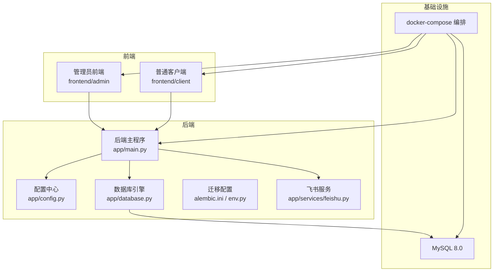
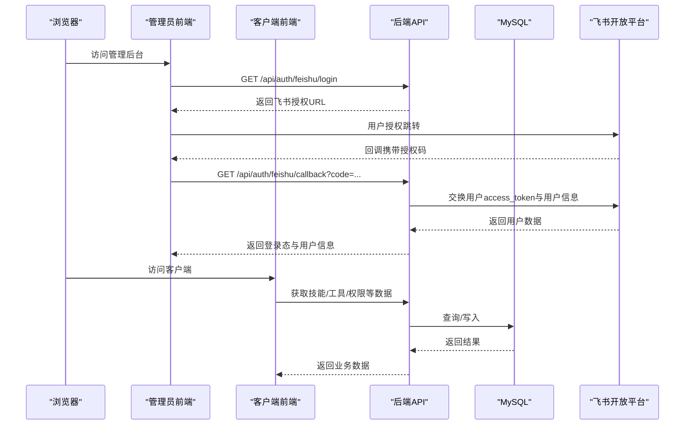
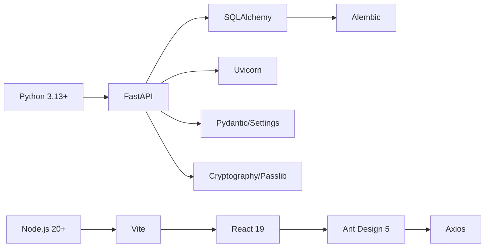

# 快速开始

<cite>
**本文引用的文件**
- [backend/pyproject.toml](file://backend/pyproject.toml)
- [backend/app/config.py](file://backend/app/config.py)
- [backend/app/main.py](file://backend/app/main.py)
- [backend/app/database.py](file://backend/app/database.py)
- [backend/alembic.ini](file://backend/alembic.ini)
- [backend/alembic/env.py](file://backend/alembic/env.py)
- [backend/Dockerfile](file://backend/Dockerfile)
- [backend/app/services/feishu.py](file://backend/app/services/feishu.py)
- [docker-compose.yml](file://docker-compose.yml)
- [frontend/admin/package.json](file://frontend/admin/package.json)
- [frontend/admin/Dockerfile](file://frontend/admin/Dockerfile)
- [frontend/admin/src/api/index.ts](file://frontend/admin/src/api/index.ts)
- [frontend/client/package.json](file://frontend/client/package.json)
- [frontend/client/Dockerfile](file://frontend/client/Dockerfile)
- [frontend/client/src/api/index.ts](file://frontend/client/src/api/index.ts)
</cite>

## 目录
1. [简介](#简介)
2. [项目结构](#项目结构)
3. [核心组件](#核心组件)
4. [架构总览](#架构总览)
5. [详细组件分析](#详细组件分析)
6. [依赖关系分析](#依赖关系分析)
7. [性能与并发特性](#性能与并发特性)
8. [部署方式](#部署方式)
9. [飞书应用配置指南](#飞书应用配置指南)
10. [常见问题与故障排除](#常见问题与故障排除)
11. [结语](#结语)

## 简介
本指南面向新手开发者，帮助你在约30分钟内完成ToolHub项目的环境准备、本地开发运行以及三种部署方式（本地开发模式、Docker容器化部署、生产环境部署）的落地操作。同时提供飞书应用配置的完整步骤与常见问题排查建议。

## 项目结构
ToolHub采用前后端分离架构：
- 后端：FastAPI + SQLAlchemy + Alembic，使用MySQL 8.0作为持久化存储，支持JWT鉴权与CORS跨域。
- 前端：React + Ant Design + Vite，分为管理员后台（admin）与普通客户端（client）两个独立应用。
- 部署：通过docker-compose编排MySQL、后端、管理员前端与普通前端；后端与前端均提供独立Dockerfile用于容器化构建。

图表来源
- [backend/app/main.py:1-61](file://backend/app/main.py#L1-L61)
- [backend/app/config.py:1-36](file://backend/app/config.py#L1-L36)
- [backend/app/database.py:1-25](file://backend/app/database.py#L1-L25)
- [backend/alembic.ini:1-37](file://backend/alembic.ini#L1-L37)
- [backend/alembic/env.py:1-48](file://backend/alembic/env.py#L1-L48)
- [backend/app/services/feishu.py:1-120](file://backend/app/services/feishu.py#L1-L120)
- [docker-compose.yml:1-84](file://docker-compose.yml#L1-L84)

章节来源
- [backend/app/main.py:1-61](file://backend/app/main.py#L1-L61)
- [backend/app/config.py:1-36](file://backend/app/config.py#L1-L36)
- [backend/app/database.py:1-25](file://backend/app/database.py#L1-L25)
- [docker-compose.yml:1-84](file://docker-compose.yml#L1-L84)

## 核心组件
- 应用入口与路由注册：后端在主程序中注册认证、用户、技能、工具、权限申请等API路由，并暴露健康检查接口。
- 配置中心：集中管理应用名称、版本、调试开关、数据库连接、JWT密钥算法与过期时间、飞书应用参数、CORS白名单等。
- 数据库层：基于SQLAlchemy创建引擎与会话，启用连接池预检与回收策略，提供依赖注入式数据库会话。
- 迁移系统：Alembic负责数据库Schema升级，支持离线与在线迁移模式，模型自动发现。
- 飞书集成：封装飞书OAuth2授权流程、租户访问令牌获取、用户信息拉取、部门树同步等能力。
- 前端API封装：管理员与客户端分别定义统一的API模块，调用后端REST接口。

章节来源
- [backend/app/main.py:9-48](file://backend/app/main.py#L9-L48)
- [backend/app/config.py:5-32](file://backend/app/config.py#L5-L32)
- [backend/app/database.py:5-24](file://backend/app/database.py#L5-L24)
- [backend/alembic/env.py:17-47](file://backend/alembic/env.py#L17-L47)
- [backend/app/services/feishu.py:6-119](file://backend/app/services/feishu.py#L6-L119)
- [frontend/admin/src/api/index.ts:1-59](file://frontend/admin/src/api/index.ts#L1-L59)
- [frontend/client/src/api/index.ts:1-35](file://frontend/client/src/api/index.ts#L1-L35)

## 架构总览
下图展示了从浏览器到后端、再到数据库与飞书开放平台的整体交互路径。

图表来源
- [backend/app/services/feishu.py:15-69](file://backend/app/services/feishu.py#L15-L69)
- [frontend/admin/src/api/index.ts:3-8](file://frontend/admin/src/api/index.ts#L3-L8)
- [frontend/client/src/api/index.ts:3-8](file://frontend/client/src/api/index.ts#L3-L8)
- [backend/app/main.py:25-42](file://backend/app/main.py#L25-L42)
- [backend/app/database.py:19-24](file://backend/app/database.py#L19-L24)

## 详细组件分析

### 后端主程序与路由
- 路由组织：按功能模块划分客户端API与管理端API，并统一前缀与标签。
- 中间件：启用CORS，允许指定源、凭证、方法与头。
- 健康检查：提供/version与/status等轻量探活接口。

章节来源
- [backend/app/main.py:9-48](file://backend/app/main.py#L9-L48)

### 配置中心（Settings）
- 关键项：应用名/版本、调试开关、数据库URL、JWT密钥与算法、飞书应用ID/密钥/基础URL/回调地址、CORS白名单。
- 环境变量：通过.env文件加载，便于本地与容器化部署解耦。

章节来源
- [backend/app/config.py:5-32](file://backend/app/config.py#L5-L32)

### 数据库与迁移
- 引擎与会话：连接池预检与回收，适配调试输出。
- 迁移：Alembic离线/在线模式，自动发现模型，支持覆盖sqlalchemy.url。

章节来源
- [backend/app/database.py:5-24](file://backend/app/database.py#L5-L24)
- [backend/alembic.ini:1-37](file://backend/alembic.ini#L1-L37)
- [backend/alembic/env.py:10-47](file://backend/alembic/env.py#L10-L47)

### 飞书服务（FeishuService）
- 授权流程：生成授权URL、换取用户access_token、获取用户信息。
- 组织架构：分页拉取部门列表与详情，支持递归或批量获取。
- 错误处理：对返回码进行校验并抛出异常，便于上层捕获。

章节来源
- [backend/app/services/feishu.py:15-119](file://backend/app/services/feishu.py#L15-L119)

### 前端API封装
- 管理端：登录、登出、用户管理、角色管理、技能管理、工具管理、审批流、部门同步、审计日志等。
- 客户端：登录、个人权限与角色、技能与工具查询、权限申请与历史。

章节来源
- [frontend/admin/src/api/index.ts:1-59](file://frontend/admin/src/api/index.ts#L1-L59)
- [frontend/client/src/api/index.ts:1-35](file://frontend/client/src/api/index.ts#L1-L35)

## 依赖关系分析
- 后端语言与框架：Python 3.13+、FastAPI、Uvicorn、SQLAlchemy、Alembic、PyMySQL、Cryptography、Pydantic、Pydantic Settings、Passlib、HTTPX等。
- 前端技术栈：Node.js 20+、Vite、React 19、Ant Design 5、Axios、Zustand、Day.js等。
- 容器镜像：后端使用python:3.13-slim + uv安装依赖；前端使用node:20-alpine构建，Nginx发布静态资源。

图表来源
- [backend/pyproject.toml:6-20](file://backend/pyproject.toml#L6-L20)
- [frontend/admin/package.json:11-27](file://frontend/admin/package.json#L11-L27)
- [frontend/client/package.json:11-27](file://frontend/client/package.json#L11-L27)

章节来源
- [backend/pyproject.toml:6-20](file://backend/pyproject.toml#L6-L20)
- [frontend/admin/package.json:11-27](file://frontend/admin/package.json#L11-L27)
- [frontend/client/package.json:11-27](file://frontend/client/package.json#L11-L27)

## 性能与并发特性
- 后端：Uvicorn异步服务器，适合高并发I/O场景；SQLAlchemy连接池参数可按生产环境调优。
- 前端：Vite开发服务器热更新，生产构建产物由Nginx提供静态托管。
- 数据库：开启pool_pre_ping与合理pool_recycle，降低连接失效导致的错误重试成本。

章节来源
- [backend/app/database.py:5-10](file://backend/app/database.py#L5-L10)
- [backend/Dockerfile:22-28](file://backend/Dockerfile#L22-L28)
- [frontend/admin/Dockerfile:15-29](file://frontend/admin/Dockerfile#L15-L29)
- [frontend/client/Dockerfile:15-29](file://frontend/client/Dockerfile#L15-L29)

## 部署方式

### 本地开发模式
- 前置条件
  - Python 3.13+
  - Node.js 20+
  - MySQL 8.0+
- 步骤
  1) 准备数据库
     - 在MySQL中创建数据库与用户，确保DATABASE_URL可用。
  2) 安装后端依赖
     - 使用pip安装后端依赖（推荐使用uv以提升速度）。
  3) 初始化数据库
     - 执行Alembic迁移，升级到最新版本。
  4) 设置环境变量
     - 复制.env模板，填写数据库、JWT、飞书应用参数、CORS白名单等。
  5) 启动后端
     - 运行后端主程序，监听8000端口。
  6) 启动前端
     - 分别进入admin与client目录，安装依赖并启动Vite开发服务器。
  7) 访问
     - 管理端默认端口5174，客户端默认端口5173，或根据package.json脚本调整。

章节来源
- [backend/pyproject.toml:6-20](file://backend/pyproject.toml#L6-L20)
- [backend/alembic.ini:1-3](file://backend/alembic.ini#L1-L3)
- [backend/app/config.py:11-30](file://backend/app/config.py#L11-L30)
- [backend/app/main.py:54-60](file://backend/app/main.py#L54-L60)
- [frontend/admin/package.json:6-10](file://frontend/admin/package.json#L6-L10)
- [frontend/client/package.json:6-10](file://frontend/client/package.json#L6-L10)

### Docker容器化部署
- 前置条件
  - 已安装Docker与Docker Compose
- 步骤
  1) 构建镜像
     - 后端：基于python:3.13-slim + uv安装依赖。
     - 前端：基于node:20-alpine构建，Nginx发布。
  2) 编排服务
     - 使用docker-compose编排MySQL、后端、管理员前端、客户端前端。
  3) 环境变量
     - 通过环境变量传递数据库、JWT、飞书参数与CORS白名单。
  4) 启动服务
     - docker-compose up -d，等待MySQL健康检查通过后再启动其他服务。
  5) 访问
     - 默认端口：MySQL 3306、后端 8000、管理端 81、客户端 80。

章节来源
- [docker-compose.yml:1-84](file://docker-compose.yml#L1-L84)
- [backend/Dockerfile:1-29](file://backend/Dockerfile#L1-L29)
- [frontend/admin/Dockerfile:1-30](file://frontend/admin/Dockerfile#L1-L30)
- [frontend/client/Dockerfile:1-30](file://frontend/client/Dockerfile#L1-L30)

### 生产环境部署
- 建议
  - 使用反向代理（如Nginx/Traefik）统一入口与TLS终止。
  - 将后端与前端分别部署为独立容器或静态站点托管。
  - 数据库使用云厂商托管MySQL 8.0，确保网络连通与备份策略。
  - 严格设置JWT密钥、飞书应用参数与CORS白名单。
- 参考
  - 后端Dockerfile与docker-compose已提供生产可用的最小化镜像与编排示例。

章节来源
- [backend/Dockerfile:1-29](file://backend/Dockerfile#L1-L29)
- [docker-compose.yml:24-76](file://docker-compose.yml#L24-L76)

## 飞书应用配置指南
- 创建企业自建应用
  - 登录飞书开发者平台，创建应用，记录App ID与App Secret。
- 权限配置
  - 开放平台“身份授权”与“通讯录”相关权限，确保能获取用户信息与部门树。
- 回调地址设置
  - 在应用配置中设置授权回调地址为客户端前端的回调路径（例如http://localhost:5173/auth/callback），并与后端配置一致。
- 后端参数
  - 在配置中心设置FEISHU_APP_ID、FEISHU_APP_SECRET、FEISHU_BASE_URL、FEISHU_REDIRECT_URI。
- 测试流程
  - 管理端或客户端触发登录，后端生成授权URL并重定向至飞书，回调后换取用户信息并下发登录态。

章节来源
- [backend/app/config.py:19-24](file://backend/app/config.py#L19-L24)
- [backend/app/services/feishu.py:15-24](file://backend/app/services/feishu.py#L15-L24)
- [frontend/admin/src/api/index.ts:3-8](file://frontend/admin/src/api/index.ts#L3-L8)
- [frontend/client/src/api/index.ts:3-8](file://frontend/client/src/api/index.ts#L3-L8)

## 常见问题与故障排除
- 数据库无法连接
  - 检查DATABASE_URL格式与凭据；确认MySQL服务可达且防火墙放行。
  - 若使用Docker，请确认容器网络与端口映射正确。
- 迁移失败
  - 确认Alembic配置中的sqlalchemy.url与实际数据库一致；在容器环境中可通过环境变量覆盖。
- JWT密钥未设置
  - 生产环境必须替换默认密钥；否则可能引发签发/验证异常。
- CORS跨域错误
  - 检查CORS_ORIGINS是否包含前端访问域名与端口；容器化时注意多端口白名单。
- 飞书授权失败
  - 确认FEISHU_APP_ID/SECRET正确；回调地址与前端路由一致；租户访问令牌获取接口返回码需为成功。
- 健康检查
  - 访问后端/health接口确认服务状态与版本。

章节来源
- [backend/app/config.py:11-30](file://backend/app/config.py#L11-L30)
- [backend/alembic.ini:2-3](file://backend/alembic.ini#L2-L3)
- [backend/app/main.py:44-46](file://backend/app/main.py#L44-L46)
- [backend/app/services/feishu.py:26-57](file://backend/app/services/feishu.py#L26-L57)

## 结语
按照本指南，你可以在30分钟内完成ToolHub的环境准备与运行。建议先以本地开发模式验证功能，再过渡到Docker编排与生产部署。遇到问题优先检查数据库、迁移、JWT与CORS配置，以及飞书应用的回调地址一致性。