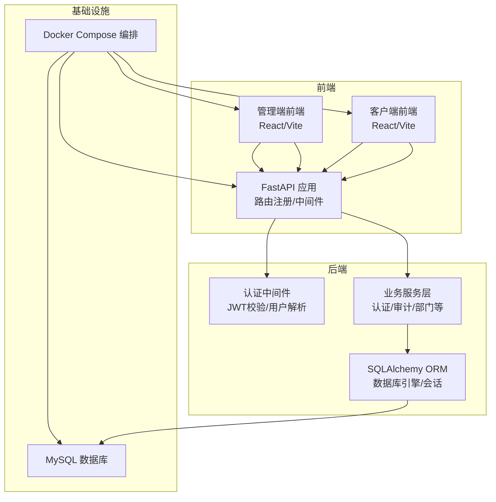
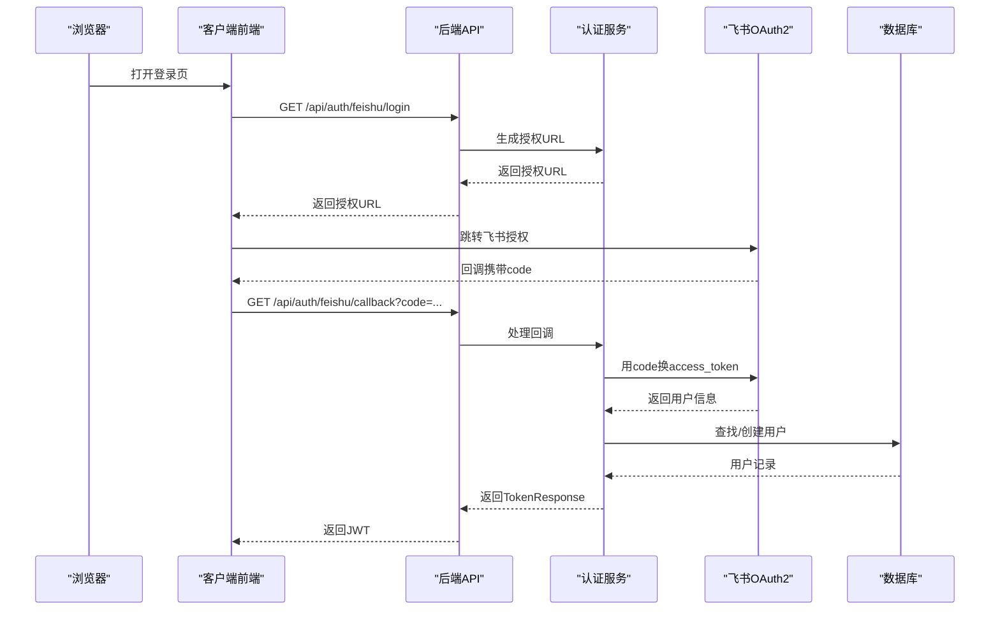
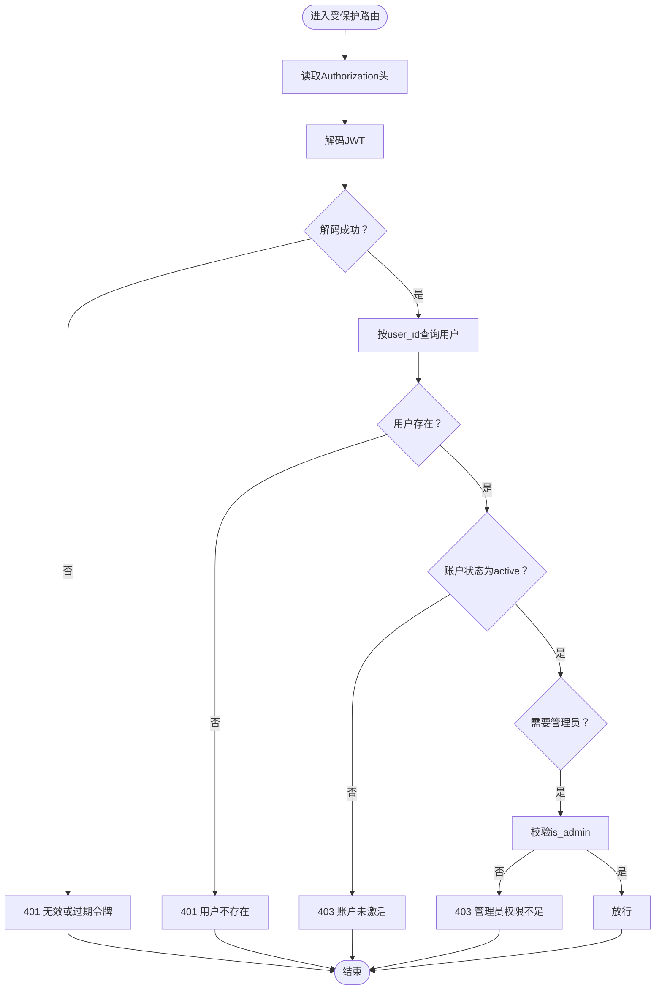
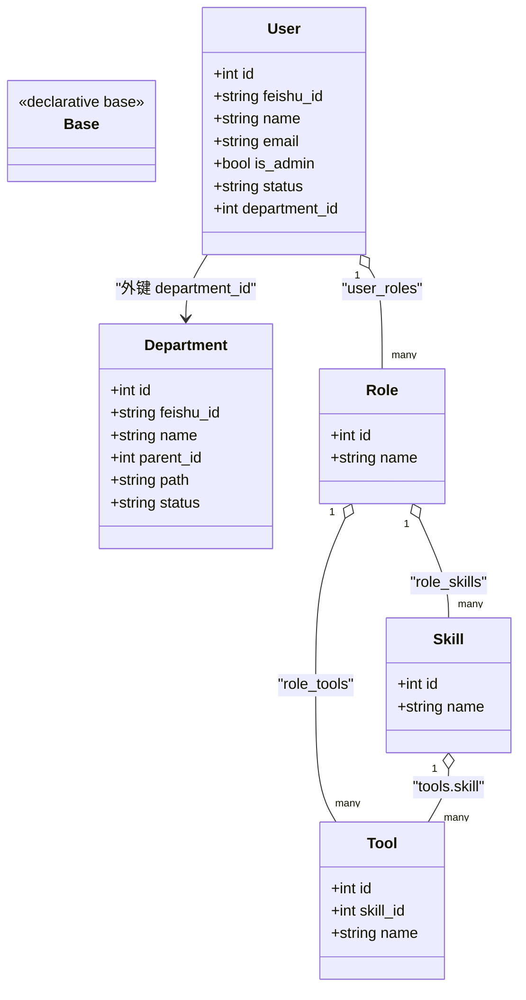
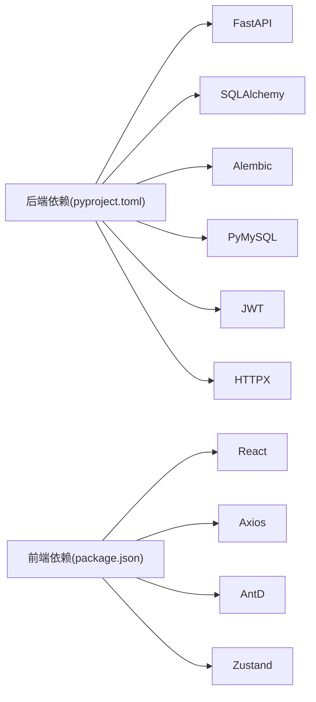

# 故障排除

<cite>
**本文引用的文件**
- [backend/app/main.py](file://backend/app/main.py)
- [backend/app/config.py](file://backend/app/config.py)
- [backend/app/database.py](file://backend/app/database.py)
- [backend/app/middleware/auth.py](file://backend/app/middleware/auth.py)
- [backend/app/api/auth.py](file://backend/app/api/auth.py)
- [backend/app/services/auth.py](file://backend/app/services/auth.py)
- [backend/app/utils/security.py](file://backend/app/utils/security.py)
- [backend/app/models/user.py](file://backend/app/models/user.py)
- [backend/pyproject.toml](file://backend/pyproject.toml)
- [frontend/client/src/store/auth.ts](file://frontend/client/src/store/auth.ts)
- [frontend/client/src/api/request.ts](file://frontend/client/src/api/request.ts)
- [docker-compose.yml](file://docker-compose.yml)
- [backend/alembic.ini](file://backend/alembic.ini)
</cite>

## 目录
1. [简介](#简介)
2. [项目结构](#项目结构)
3. [核心组件](#核心组件)
4. [架构总览](#架构总览)
5. [详细组件分析](#详细组件分析)
6. [依赖分析](#依赖分析)
7. [性能考虑](#性能考虑)
8. [故障排除指南](#故障排除指南)
9. [结论](#结论)
10. [附录](#附录)

## 简介
本指南面向ToolHub项目的运维与开发人员，提供系统化、可操作的故障排除流程与方法。内容覆盖环境搭建、数据库连接、认证与权限、网络连通性、日志与错误追踪、性能诊断与优化、以及紧急恢复策略。文档同时给出可视化图示与定位到具体源码位置的参考路径，便于快速定位问题。

## 项目结构
ToolHub采用前后端分离架构：后端基于FastAPI，前端包含管理端与客户端两套React应用；通过Docker Compose编排MySQL、后端、管理端与客户端服务。后端通过SQLAlchemy ORM访问数据库，并使用JWT进行认证；前端通过Axios统一发起API请求并在401时自动跳转登录。

图表来源
- [backend/app/main.py:9-48](file://backend/app/main.py#L9-L48)
- [backend/app/database.py:5-10](file://backend/app/database.py#L5-L10)
- [backend/app/middleware/auth.py:12-33](file://backend/app/middleware/auth.py#L12-L33)
- [frontend/client/src/api/request.ts:3-6](file://frontend/client/src/api/request.ts#L3-L6)
- [docker-compose.yml:1-84](file://docker-compose.yml#L1-L84)

章节来源
- [backend/app/main.py:9-48](file://backend/app/main.py#L9-L48)
- [backend/app/database.py:5-10](file://backend/app/database.py#L5-L10)
- [frontend/client/src/api/request.ts:3-6](file://frontend/client/src/api/request.ts#L3-L6)
- [docker-compose.yml:1-84](file://docker-compose.yml#L1-L84)

## 核心组件
- 应用入口与路由：后端通过工厂函数创建FastAPI实例，注册CORS与各模块路由，提供健康检查端点。
- 配置中心：集中管理应用名、版本、数据库URL、JWT密钥算法、飞书OAuth2参数、CORS白名单等。
- 数据库层：基于SQLAlchemy创建引擎，启用pool_pre_ping与回收策略，提供会话生命周期管理。
- 认证中间件：从Authorization头解析Bearer Token，解码JWT并加载用户信息，校验账户状态与管理员权限。
- 前端请求拦截：统一设置Authorization头，处理401并重定向至登录页。
- Docker编排：MySQL、后端、管理端、客户端四服务协同运行，含健康检查与网络隔离。

章节来源
- [backend/app/main.py:9-48](file://backend/app/main.py#L9-L48)
- [backend/app/config.py:11-38](file://backend/app/config.py#L11-L38)
- [backend/app/database.py:5-10](file://backend/app/database.py#L5-L10)
- [backend/app/middleware/auth.py:12-33](file://backend/app/middleware/auth.py#L12-L33)
- [frontend/client/src/api/request.ts:8-25](file://frontend/client/src/api/request.ts#L8-L25)
- [docker-compose.yml:1-84](file://docker-compose.yml#L1-L84)

## 架构总览
下图展示一次典型认证流程：前端发起飞书OAuth2回调，后端服务层调用飞书接口获取用户信息并创建/更新本地用户，随后签发JWT返回给前端。

图表来源
- [backend/app/api/auth.py:13-27](file://backend/app/api/auth.py#L13-L27)
- [backend/app/services/auth.py:17-76](file://backend/app/services/auth.py#L17-L76)
- [backend/app/utils/security.py:8-17](file://backend/app/utils/security.py#L8-L17)
- [backend/app/models/user.py:23-40](file://backend/app/models/user.py#L23-L40)

## 详细组件分析

### 认证与权限组件
- 中间件职责：校验Authorization头中的JWT，解析用户ID与管理员标记，查询用户并校验状态。
- 权限控制：提供管理员权限装饰器，未满足条件返回403。
- 前端状态：使用本地存储保存token与用户信息，请求拦截器自动附加Authorization头。

图表来源
- [backend/app/middleware/auth.py:12-44](file://backend/app/middleware/auth.py#L12-L44)
- [backend/app/utils/security.py:20-31](file://backend/app/utils/security.py#L20-L31)
- [frontend/client/src/store/auth.ts:18-29](file://frontend/client/src/store/auth.ts#L18-L29)

章节来源
- [backend/app/middleware/auth.py:12-44](file://backend/app/middleware/auth.py#L12-L44)
- [backend/app/utils/security.py:20-31](file://backend/app/utils/security.py#L20-L31)
- [frontend/client/src/store/auth.ts:18-29](file://frontend/client/src/store/auth.ts#L18-L29)

### 数据库连接与会话
- 引擎配置：开启DEBUG时输出SQL，启用pool_pre_ping与回收策略，提升连接稳定性。
- 会话管理：每次请求创建独立会话，使用上下文确保关闭，避免连接泄漏。
- 模型关系：用户、部门、角色、技能、工具等模型通过外键与关联表建立多对多/一对多关系。

图表来源
- [backend/app/database.py:15-16](file://backend/app/database.py#L15-L16)
- [backend/app/models/user.py:23-116](file://backend/app/models/user.py#L23-L116)

章节来源
- [backend/app/database.py:5-10](file://backend/app/database.py#L5-L10)
- [backend/app/database.py:19-24](file://backend/app/database.py#L19-L24)
- [backend/app/models/user.py:23-116](file://backend/app/models/user.py#L23-L116)

### 健康检查与外部依赖
- 后端提供/health端点返回版本信息，便于容器编排健康检查。
- Docker Compose中MySQL设置了健康检查探针，后端服务依赖数据库健康状态启动。

章节来源
- [backend/app/main.py:44-46](file://backend/app/main.py#L44-L46)
- [docker-compose.yml:16-20](file://docker-compose.yml#L16-L20)
- [docker-compose.yml:44-46](file://docker-compose.yml#L44-L46)

## 依赖分析
- 后端依赖：FastAPI、Uvicorn、SQLAlchemy、Alembic、PyMySQL、Pydantic、JWT工具链、HTTP客户端等。
- 前端依赖：React、React Router、Ant Design、Axios、Zustand、Day.js等。
- 运行时：Python 3.13+要求，容器内服务通过环境变量注入配置。

图表来源
- [backend/pyproject.toml:7-19](file://backend/pyproject.toml#L7-L19)
- [frontend/client/package.json:11-27](file://frontend/client/package.json#L11-L27)

章节来源
- [backend/pyproject.toml:7-19](file://backend/pyproject.toml#L7-L19)
- [frontend/client/package.json:11-27](file://frontend/client/package.json#L11-L27)

## 性能考虑
- 数据库查询优化
  - 使用索引字段进行过滤（如用户与部门的唯一/索引字段），减少全表扫描。
  - 对分页查询使用LIMIT/OFFSET，避免一次性拉取大量数据。
  - 关联查询尽量使用JOIN并限制返回列，避免N+1查询。
- API响应时间优化
  - 减少不必要的ORM对象转换与序列化开销，优先使用DTO/Schema。
  - 对热点接口增加缓存（如部门树、常用配置），降低数据库压力。
- 前端渲染优化
  - 使用虚拟滚动/懒加载展示长列表。
  - 合理拆分组件与代码分割，减少首屏体积。
- 连接池与超时
  - 后端已启用pool_pre_ping与回收策略，建议结合业务峰值调整最大连接数与超时时间。

## 故障排除指南

### 一、环境搭建与容器编排
- 症状：容器启动后后端无法访问或频繁重启
  - 排查要点
    - MySQL健康检查是否通过（查看容器日志与健康探针）
    - 后端服务是否等待数据库健康后再启动（depends_on: service_healthy）
    - 端口映射是否冲突（BACKEND_PORT/CLIENT_PORT/ADMIN_PORT）
  - 解决步骤
    - 检查docker-compose.yml中环境变量与卷挂载
    - 确认网络toolhub-network可用且无冲突
    - 重启相关容器并观察日志

章节来源
- [docker-compose.yml:16-20](file://docker-compose.yml#L16-L20)
- [docker-compose.yml:44-46](file://docker-compose.yml#L44-L46)
- [docker-compose.yml:42-43](file://docker-compose.yml#L42-L43)

### 二、数据库连接问题
- 症状：后端启动时报数据库连接失败、查询超时或连接池耗尽
  - 可能原因
    - DATABASE_URL配置错误或主机不可达
    - MySQL未就绪或凭据不正确
    - 连接池参数不匹配业务负载
  - 诊断方法
    - 在后端容器内执行网络连通性测试（telnet/nc）
    - 检查后端DEBUG模式下的SQL日志（echo=settings.DEBUG）
    - 查看数据库慢查询与锁等待
  - 解决步骤
    - 校验DATABASE_URL格式与凭据
    - 调整pool_pre_ping与pool_recycle参数
    - 增加最大连接数或优化查询

章节来源
- [backend/app/config.py:17-18](file://backend/app/config.py#L17-L18)
- [backend/app/database.py:5-10](file://backend/app/database.py#L5-L10)
- [backend/alembic.ini:18-26](file://backend/alembic.ini#L18-L26)

### 三、认证失败与权限异常
- 症状：登录成功但接口返回401/403，或管理员功能不可用
  - 可能原因
    - Authorization头缺失或格式错误
    - JWT签名密钥/算法不一致
    - 用户状态非active或不存在
    - 管理员权限不足
  - 诊断方法
    - 检查前端请求拦截器是否附加Authorization头
    - 校验JWT_SECRET_KEY与JWT_ALGORITHM一致性
    - 在中间件断点处确认token解析与用户查询结果
  - 解决步骤
    - 前端确保localStorage中token存在且未过期
    - 后端核对配置文件与环境变量
    - 确保用户状态为active且is_admin标记正确

章节来源
- [frontend/client/src/api/request.ts:8-14](file://frontend/client/src/api/request.ts#L8-L14)
- [backend/app/utils/security.py:14-17](file://backend/app/utils/security.py#L14-L17)
- [backend/app/middleware/auth.py:16-33](file://backend/app/middleware/auth.py#L16-L33)

### 四、飞书OAuth2回调异常
- 症状：点击登录后无响应或回调报错
  - 可能原因
    - FEISHU_APP_ID/FEISHU_APP_SECRET为空
    - FEISHU_REDIRECT_URI与平台配置不一致
    - 回调接口未捕获异常导致错误信息丢失
  - 诊断方法
    - 检查后端配置中的飞书参数
    - 在回调处理器中打印异常堆栈
    - 校验前端跳转URL与后端路由匹配
  - 解决步骤
    - 补充飞书应用凭据与回调地址
    - 确保回调路由正确接收并处理code参数

章节来源
- [backend/app/config.py:25-29](file://backend/app/config.py#L25-L29)
- [backend/app/api/auth.py:20-27](file://backend/app/api/auth.py#L20-L27)
- [backend/app/services/auth.py:17-24](file://backend/app/services/auth.py#L17-L24)

### 五、CORS跨域与前端路由
- 症状：前端请求被浏览器拦截或路由跳转异常
  - 可能原因
    - CORS_ORIGINS未包含前端域名
    - 前端代理/baseURL与后端路由前缀不一致
  - 诊断方法
    - 浏览器Network面板查看CORS响应头
    - 检查后端CORS中间件配置
    - 确认前端Axios baseURL与后端include_router前缀一致
  - 解决步骤
    - 在配置中添加允许的前端源
    - 统一前后端路由前缀与代理设置

章节来源
- [backend/app/main.py:16-23](file://backend/app/main.py#L16-L23)
- [backend/app/config.py:31-36](file://backend/app/config.py#L31-L36)
- [frontend/client/src/api/request.ts:3-6](file://frontend/client/src/api/request.ts#L3-L6)

### 六、日志分析与错误追踪
- 后端日志
  - 使用Uvicorn运行器在控制台输出请求日志
  - SQLAlchemy与Alembic日志级别可在配置文件中调整
- 前端日志
  - 浏览器Console与Network面板查看错误与响应体
  - 请求拦截器中对401进行重定向，便于定位认证问题
- 建议
  - 将关键业务操作（如认证、权限变更、审计）打点记录
  - 使用结构化日志，包含trace_id与用户标识

章节来源
- [backend/app/main.py:54-60](file://backend/app/main.py#L54-L60)
- [backend/alembic.ini:18-26](file://backend/alembic.ini#L18-L26)
- [frontend/client/src/api/request.ts:16-25](file://frontend/client/src/api/request.ts#L16-L25)

### 七、性能问题诊断与优化
- 数据库层面
  - 分析慢查询与索引缺失，必要时添加复合索引
  - 控制单次查询返回量，使用分页与游标翻页
- 接口层面
  - 对高频接口增加缓存（如部门树、技能/工具清单）
  - 合理拆分接口，避免一次性返回过多数据
- 前端层面
  - 长列表虚拟化、图片懒加载、组件按需加载
  - 减少重复渲染，合理使用memoization

### 八、紧急情况与恢复策略
- 快速降级
  - 临时关闭高负载接口或降级为只读
  - 降级CORS策略以便前端调试（仅限临时）
- 数据库回滚
  - 使用Alembic历史版本回退迁移
  - 备份恢复前先验证数据一致性
- 服务重启
  - 先停止后端，再重启数据库，最后重启前端
  - 观察健康检查状态与日志输出

章节来源
- [backend/alembic.ini:1-36](file://backend/alembic.ini#L1-L36)
- [docker-compose.yml:44-46](file://docker-compose.yml#L44-L46)

## 结论
本指南提供了从环境、数据库、认证、网络到性能与应急处理的完整排查路径。建议在日常运维中建立标准化的日志规范与监控告警，配合本指南的步骤可显著缩短故障定位与修复时间。

## 附录

### 常见错误码与含义
- 400：请求参数错误（如回调缺少code）
- 401：未认证或令牌无效/过期
- 403：权限不足（非管理员访问管理接口）
- 404：资源不存在
- 500：服务器内部错误

### 调试工具使用指南
- 浏览器开发者工具
  - Network：查看请求/响应头、状态码、响应体
  - Console：查看前端错误与警告
- Postman
  - 配置Authorization为Bearer Token
  - 设置基础URL为后端API前缀
- 数据库客户端
  - 连接MySQL，执行查询验证用户/部门/角色等数据一致性