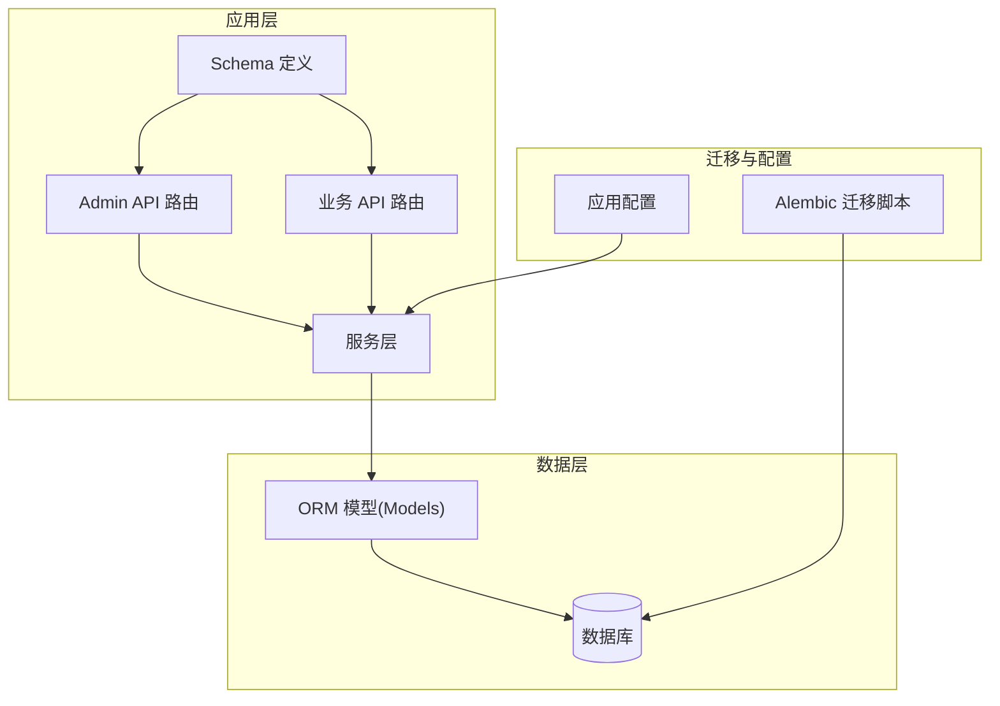
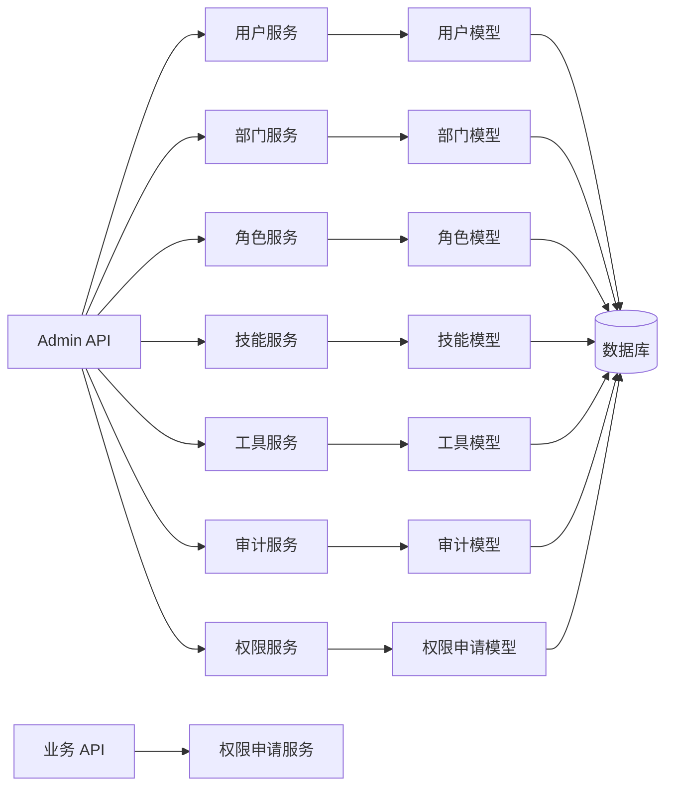
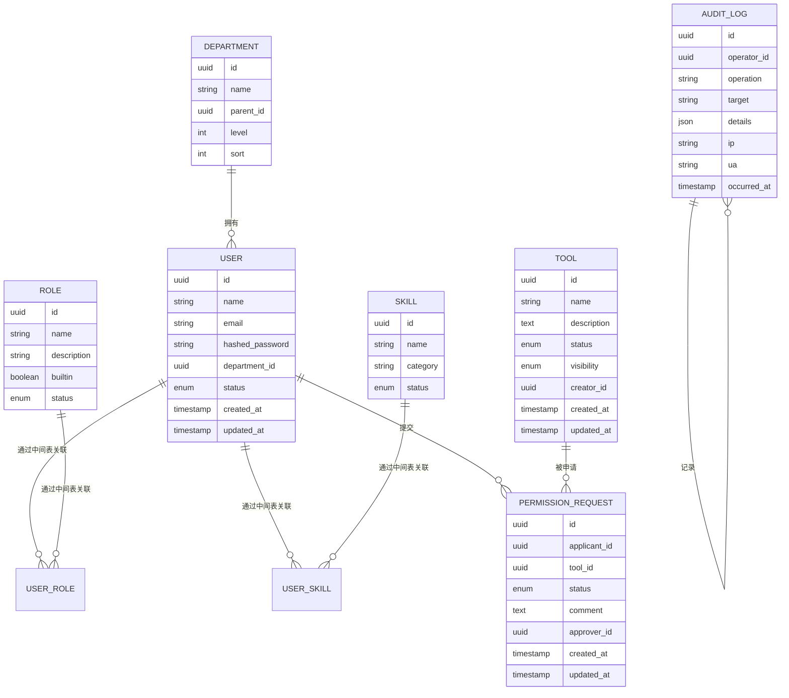
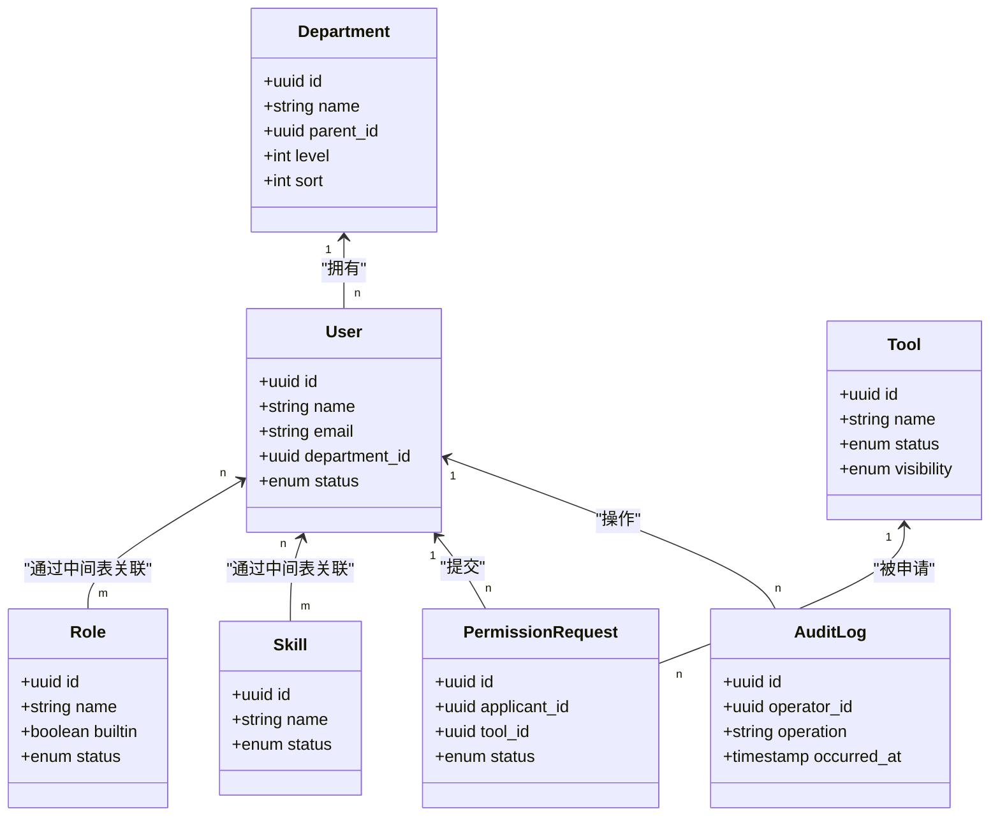
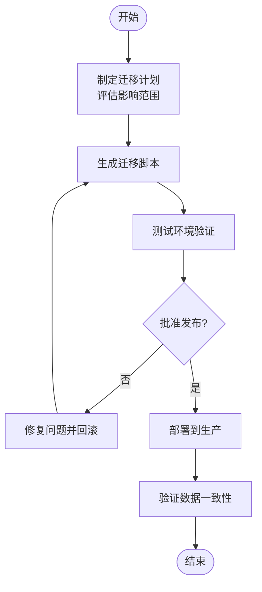
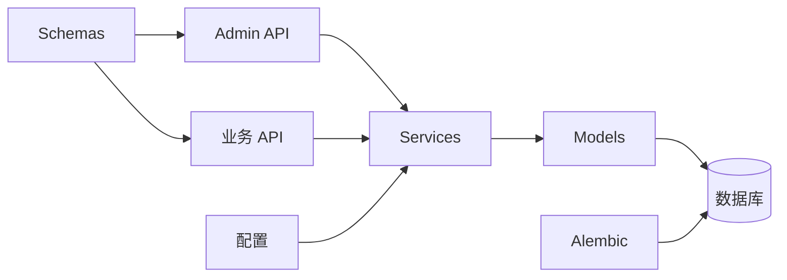

# 数据库设计

<cite>
**本文引用的文件**
- [backend/app/models/user.py](file://backend/app/models/user.py)
- [backend/app/models/audit.py](file://backend/app/models/audit.py)
- [backend/app/models/permission.py](file://backend/app/models/permission.py)
- [backend/app/schemas/user.py](file://backend/app/schemas/user.py)
- [backend/app/schemas/role.py](file://backend/app/schemas/role.py)
- [backend/app/schemas/skill.py](file://backend/app/schemas/skill.py)
- [backend/app/schemas/tool.py](file://backend/app/schemas/tool.py)
- [backend/app/schemas/permission.py](file://backend/app/schemas/permission.py)
- [backend/app/schemas/common.py](file://backend/app/schemas/common.py)
- [backend/app/api/admin/users.py](file://backend/app/api/admin/users.py)
- [backend/app/api/admin/departments.py](file://backend/app/api/admin/departments.py)
- [backend/app/api/admin/roles.py](file://backend/app/api/admin/roles.py)
- [backend/app/api/admin/skills.py](file://backend/app/api/admin/skills.py)
- [backend/app/api/admin/tools.py](file://backend/app/api/admin/tools.py)
- [backend/app/api/admin/audits.py](file://backend/app/api/admin/audits.py)
- [backend/app/api/admin/approvals.py](file://backend/app/api/admin/approvals.py)
- [backend/app/api/permission_requests.py](file://backend/app/api/permission_requests.py)
- [backend/app/services/user.py](file://backend/app/services/user.py)
- [backend/app/services/department.py](file://backend/app/services/department.py)
- [backend/app/services/role.py](file://backend/app/services/role.py)
- [backend/app/services/skill.py](file://backend/app/services/skill.py)
- [backend/app/services/tool.py](file://backend/app/services/tool.py)
- [backend/app/services/audit.py](file://backend/app/services/audit.py)
- [backend/app/services/permission.py](file://backend/app/services/permission.py)
- [backend/app/database.py](file://backend/app/database.py)
- [backend/alembic/env.py](file://backend/alembic/env.py)
- [backend/alembic/script.py.mako](file://backend/alembic/script.py.mako)
- [backend/alembic/versions/](file://backend/alembic/versions/)
- [backend/app/config.py](file://backend/app/config.py)
</cite>

## 目录
1. [简介](#简介)
2. [项目结构](#项目结构)
3. [核心组件](#核心组件)
4. [架构总览](#架构总览)
5. [详细组件分析](#详细组件分析)
6. [依赖分析](#依赖分析)
7. [性能考虑](#性能考虑)
8. [故障排查指南](#故障排查指南)
9. [结论](#结论)
10. [附录](#附录)

## 简介
本文件面向ToolHub数据库设计，系统化梳理用户、部门、角色、技能、工具、权限申请与审计日志等核心实体的数据模型，明确字段定义、数据类型、约束与索引设计，阐释表间关系（一对一、一对多、多对多）及外键约束，并给出ER图与表关系图。同时覆盖数据访问模式、查询优化策略、缓存设计、数据迁移与版本管理、备份恢复方案以及数据安全与访问控制机制。

## 项目结构
后端采用Python+SQLAlchemy ORM架构，数据库层通过Alembic进行版本迁移管理。Admin与业务API分别在不同路由下提供用户、部门、角色、技能、工具、审计与审批等资源操作；对应的Pydantic Schema用于请求/响应数据结构定义；Services封装业务逻辑；Models映射到数据库表。

**图表来源**
- [backend/app/api/admin/users.py](file://backend/app/api/admin/users.py)
- [backend/app/api/admin/departments.py](file://backend/app/api/admin/departments.py)
- [backend/app/api/admin/roles.py](file://backend/app/api/admin/roles.py)
- [backend/app/api/admin/skills.py](file://backend/app/api/admin/skills.py)
- [backend/app/api/admin/tools.py](file://backend/app/api/admin/tools.py)
- [backend/app/api/admin/audits.py](file://backend/app/api/admin/audits.py)
- [backend/app/api/admin/approvals.py](file://backend/app/api/admin/approvals.py)
- [backend/app/api/permission_requests.py](file://backend/app/api/permission_requests.py)
- [backend/app/services/user.py](file://backend/app/services/user.py)
- [backend/app/services/department.py](file://backend/app/services/department.py)
- [backend/app/services/role.py](file://backend/app/services/role.py)
- [backend/app/services/skill.py](file://backend/app/services/skill.py)
- [backend/app/services/tool.py](file://backend/app/services/tool.py)
- [backend/app/services/audit.py](file://backend/app/services/audit.py)
- [backend/app/services/permission.py](file://backend/app/services/permission.py)
- [backend/app/models/user.py](file://backend/app/models/user.py)
- [backend/app/models/audit.py](file://backend/app/models/audit.py)
- [backend/app/models/permission.py](file://backend/app/models/permission.py)
- [backend/app/database.py](file://backend/app/database.py)
- [backend/alembic/env.py](file://backend/alembic/env.py)
- [backend/alembic/script.py.mako](file://backend/alembic/script.py.mako)
- [backend/app/config.py](file://backend/app/config.py)

**章节来源**
- [backend/app/database.py](file://backend/app/database.py)
- [backend/app/config.py](file://backend/app/config.py)
- [backend/alembic/env.py](file://backend/alembic/env.py)
- [backend/alembic/script.py.mako](file://backend/alembic/script.py.mako)

## 核心组件
- 用户(User)：存储用户基本信息、关联部门、角色、技能等
- 部门(Department)：组织架构层级
- 角色(Role)：权限集合载体
- 技能(Skill)：用户掌握技能标签
- 工具(Tool)：可被申请使用的资源
- 权限申请(Request)：用户对工具的权限申请记录
- 审计(AuditLog)：系统操作审计

上述组件在Models中以ORM类形式定义，在Schemas中以Pydantic模型定义对外接口，在Services中封装CRUD与业务规则，在API中暴露REST端点。

**章节来源**
- [backend/app/models/user.py](file://backend/app/models/user.py)
- [backend/app/models/audit.py](file://backend/app/models/audit.py)
- [backend/app/models/permission.py](file://backend/app/models/permission.py)
- [backend/app/schemas/user.py](file://backend/app/schemas/user.py)
- [backend/app/schemas/role.py](file://backend/app/schemas/role.py)
- [backend/app/schemas/skill.py](file://backend/app/schemas/skill.py)
- [backend/app/schemas/tool.py](file://backend/app/schemas/tool.py)
- [backend/app/schemas/permission.py](file://backend/app/schemas/permission.py)
- [backend/app/schemas/common.py](file://backend/app/schemas/common.py)

## 架构总览
ToolHub数据库层采用“模型-服务-接口”三层结构，数据持久化通过SQLAlchemy ORM完成，迁移管理通过Alembic实现。API层负责输入校验与输出格式化，服务层封装业务规则与事务控制，模型层定义表结构与关系。

**图表来源**
- [backend/app/api/admin/users.py](file://backend/app/api/admin/users.py)
- [backend/app/api/admin/departments.py](file://backend/app/api/admin/departments.py)
- [backend/app/api/admin/roles.py](file://backend/app/api/admin/roles.py)
- [backend/app/api/admin/skills.py](file://backend/app/api/admin/skills.py)
- [backend/app/api/admin/tools.py](file://backend/app/api/admin/tools.py)
- [backend/app/api/admin/audits.py](file://backend/app/api/admin/audits.py)
- [backend/app/api/admin/approvals.py](file://backend/app/api/admin/approvals.py)
- [backend/app/api/permission_requests.py](file://backend/app/api/permission_requests.py)
- [backend/app/services/user.py](file://backend/app/services/user.py)
- [backend/app/services/department.py](file://backend/app/services/department.py)
- [backend/app/services/role.py](file://backend/app/services/role.py)
- [backend/app/services/skill.py](file://backend/app/services/skill.py)
- [backend/app/services/tool.py](file://backend/app/services/tool.py)
- [backend/app/services/audit.py](file://backend/app/services/audit.py)
- [backend/app/services/permission.py](file://backend/app/services/permission.py)
- [backend/app/models/user.py](file://backend/app/models/user.py)
- [backend/app/models/audit.py](file://backend/app/models/audit.py)
- [backend/app/models/permission.py](file://backend/app/models/permission.py)

## 详细组件分析

### 用户(User)模型
- 字段要点（示例性描述）
  - 基本信息：用户名、邮箱、密码哈希、状态、创建/更新时间
  - 关联：部门ID（外键）、多个角色ID（多对多中间表）
  - 索引：邮箱唯一索引、部门索引
- 约束：非空、唯一性、长度限制
- 复杂度：查询按部门/角色过滤时建议建立复合索引
- 依赖：与部门、角色、技能、权限申请存在一对多/多对多关系

**章节来源**
- [backend/app/models/user.py](file://backend/app/models/user.py)
- [backend/app/schemas/user.py](file://backend/app/schemas/user.py)
- [backend/app/services/user.py](file://backend/app/services/user.py)

### 部门(Department)模型
- 字段要点（示例性描述）
  - 组织信息：名称、父部门ID（自引用）、层级、排序
  - 约束：自引用外键、层级深度限制
  - 索引：父节点索引、层级索引
- 复杂度：树形结构查询建议使用路径枚举或闭包表策略

**章节来源**
- [backend/app/models/user.py](file://backend/app/models/user.py)
- [backend/app/schemas/user.py](file://backend/app/schemas/user.py)
- [backend/app/services/department.py](file://backend/app/services/department.py)

### 角色(Role)模型
- 字段要点（示例性描述）
  - 角色标识：名称、描述、是否内置、状态
  - 权限：与权限项的多对多关联（中间表）
  - 索引：名称唯一索引
- 复杂度：权限匹配查询需结合中间表与权限项表

**章节来源**
- [backend/app/models/permission.py](file://backend/app/models/permission.py)
- [backend/app/schemas/role.py](file://backend/app/schemas/role.py)
- [backend/app/services/role.py](file://backend/app/services/role.py)

### 技能(Skill)模型
- 字段要点（示例性描述）
  - 技能标签：名称、分类、状态
  - 关联：与用户的多对多关联（中间表）
  - 索引：名称唯一索引
- 复杂度：标签搜索建议全文索引或前缀索引

**章节来源**
- [backend/app/models/user.py](file://backend/app/models/user.py)
- [backend/app/schemas/skill.py](file://backend/app/schemas/skill.py)
- [backend/app/services/skill.py](file://backend/app/services/skill.py)

### 工具(Tool)模型
- 字段要点（示例性描述）
  - 资源属性：名称、描述、状态、可见范围、创建者、创建/更新时间
  - 约束：状态枚举、可见范围枚举
  - 索引：状态、可见范围、创建者
- 复杂度：权限过滤查询需联合权限申请与角色/部门

**章节来源**
- [backend/app/models/permission.py](file://backend/app/models/permission.py)
- [backend/app/schemas/tool.py](file://backend/app/schemas/tool.py)
- [backend/app/services/tool.py](file://backend/app/services/tool.py)

### 权限申请(Request)模型
- 字段要点（示例性描述）
  - 申请信息：申请人ID、工具ID、状态、处理意见、创建/更新时间
  - 关联：用户、工具、审批人（可选）
  - 索引：申请人、工具、状态、创建时间
- 复杂度：审批流查询需按状态与时间排序

**章节来源**
- [backend/app/models/permission.py](file://backend/app/models/permission.py)
- [backend/app/schemas/permission.py](file://backend/app/schemas/permission.py)
- [backend/app/services/permission.py](file://backend/app/services/permission.py)

### 审计(AuditLog)模型
- 字段要点（示例性描述）
  - 审计信息：操作人、操作类型、对象、详情、IP、UA、时间
  - 索引：操作人、时间、对象
- 复杂度：审计查询常按时间窗口与对象过滤

**章节来源**
- [backend/app/models/audit.py](file://backend/app/models/audit.py)
- [backend/app/schemas/common.py](file://backend/app/schemas/common.py)
- [backend/app/services/audit.py](file://backend/app/services/audit.py)

## 架构总览

**图表来源**
- [backend/app/models/user.py](file://backend/app/models/user.py)
- [backend/app/models/audit.py](file://backend/app/models/audit.py)
- [backend/app/models/permission.py](file://backend/app/models/permission.py)

## 详细组件分析

### 表关系与约束
- 一对一：用户与部门（用户表含部门ID）
- 一对多：部门-用户（一个部门可有多名用户）、工具-权限申请（一个工具可有多个申请）
- 多对多：用户-角色、用户-技能（通过中间表实现）
- 外键：严格参照主键，启用级联删除/更新（视具体业务需求）
- 约束：唯一索引（如邮箱、技能名称）、枚举字段（状态、可见范围）、时间戳字段

**图表来源**
- [backend/app/models/user.py](file://backend/app/models/user.py)
- [backend/app/models/audit.py](file://backend/app/models/audit.py)
- [backend/app/models/permission.py](file://backend/app/models/permission.py)

**章节来源**
- [backend/app/models/user.py](file://backend/app/models/user.py)
- [backend/app/models/audit.py](file://backend/app/models/audit.py)
- [backend/app/models/permission.py](file://backend/app/models/permission.py)

### 数据访问模式与查询优化
- 访问模式
  - 列表分页：按时间倒序、状态过滤、关键词模糊匹配
  - 树形查询：部门层级遍历、路径枚举
  - 多对多关联：通过中间表JOIN，避免笛卡尔积
- 查询优化
  - 建立常用过滤字段索引（状态、可见范围、部门ID、申请人ID）
  - 复合索引：部门+状态、工具+状态
  - 分页使用LIMIT/OFFSET，必要时使用基于游标的方式
  - 缓存热点数据：用户角色列表、技能标签、工具清单

**章节来源**
- [backend/app/services/user.py](file://backend/app/services/user.py)
- [backend/app/services/department.py](file://backend/app/services/department.py)
- [backend/app/services/role.py](file://backend/app/services/role.py)
- [backend/app/services/skill.py](file://backend/app/services/skill.py)
- [backend/app/services/tool.py](file://backend/app/services/tool.py)
- [backend/app/services/permission.py](file://backend/app/services/permission.py)
- [backend/app/services/audit.py](file://backend/app/services/audit.py)

### 缓存设计
- 缓存策略
  - L1：进程内缓存（如用户角色、技能标签）
  - L2：Redis缓存（如用户权限集合、热门工具列表）
  - 失效策略：写操作后主动失效；定时刷新热点数据
- 缓存键命名：遵循“模块:实体:标识”的规范，便于维护

**章节来源**
- [backend/app/services/user.py](file://backend/app/services/user.py)
- [backend/app/services/role.py](file://backend/app/services/role.py)
- [backend/app/services/skill.py](file://backend/app/services/skill.py)
- [backend/app/services/tool.py](file://backend/app/services/tool.py)

### 数据迁移策略与版本管理
- 迁移流程
  - 使用Alembic生成迁移脚本，编写升级/降级SQL
  - 先在测试环境验证，再发布到生产
  - 对大表变更采用在线DDL或分批迁移
- 版本管理
  - 通过版本目录下的脚本记录每次变更
  - 保持迁移脚本幂等与可逆

**图表来源**
- [backend/alembic/env.py](file://backend/alembic/env.py)
- [backend/alembic/script.py.mako](file://backend/alembic/script.py.mako)
- [backend/alembic/versions/](file://backend/alembic/versions/)

**章节来源**
- [backend/alembic/env.py](file://backend/alembic/env.py)
- [backend/alembic/script.py.mako](file://backend/alembic/script.py.mako)

### 备份恢复方案
- 备份策略
  - 全量备份：每周一次
  - 增量备份：每日一次，保留最近7天
  - 归档日志：开启binlog/WAL，支持时间点恢复
- 恢复流程
  - RTO/RPO目标明确
  - 恢复演练定期进行
  - 恢复后校验数据完整性

**章节来源**
- [backend/app/database.py](file://backend/app/database.py)
- [backend/app/config.py](file://backend/app/config.py)

### 数据安全与访问控制
- 安全设计
  - 密码存储：使用安全散列算法加盐
  - 传输加密：HTTPS/TLS
  - 存储加密：敏感字段可考虑透明加密
- 访问控制
  - RBAC：基于角色的权限控制
  - 最小权限：仅授予必要权限
  - 审计追踪：所有敏感操作必须记录

**章节来源**
- [backend/app/models/user.py](file://backend/app/models/user.py)
- [backend/app/models/audit.py](file://backend/app/models/audit.py)
- [backend/app/services/permission.py](file://backend/app/services/permission.py)

## 依赖分析

**图表来源**
- [backend/app/models/user.py](file://backend/app/models/user.py)
- [backend/app/models/audit.py](file://backend/app/models/audit.py)
- [backend/app/models/permission.py](file://backend/app/models/permission.py)
- [backend/app/schemas/user.py](file://backend/app/schemas/user.py)
- [backend/app/schemas/role.py](file://backend/app/schemas/role.py)
- [backend/app/schemas/skill.py](file://backend/app/schemas/skill.py)
- [backend/app/schemas/tool.py](file://backend/app/schemas/tool.py)
- [backend/app/schemas/permission.py](file://backend/app/schemas/permission.py)
- [backend/app/schemas/common.py](file://backend/app/schemas/common.py)
- [backend/app/api/admin/users.py](file://backend/app/api/admin/users.py)
- [backend/app/api/admin/departments.py](file://backend/app/api/admin/departments.py)
- [backend/app/api/admin/roles.py](file://backend/app/api/admin/roles.py)
- [backend/app/api/admin/skills.py](file://backend/app/api/admin/skills.py)
- [backend/app/api/admin/tools.py](file://backend/app/api/admin/tools.py)
- [backend/app/api/admin/audits.py](file://backend/app/api/admin/audits.py)
- [backend/app/api/admin/approvals.py](file://backend/app/api/admin/approvals.py)
- [backend/app/api/permission_requests.py](file://backend/app/api/permission_requests.py)
- [backend/app/services/user.py](file://backend/app/services/user.py)
- [backend/app/services/department.py](file://backend/app/services/department.py)
- [backend/app/services/role.py](file://backend/app/services/role.py)
- [backend/app/services/skill.py](file://backend/app/services/skill.py)
- [backend/app/services/tool.py](file://backend/app/services/tool.py)
- [backend/app/services/audit.py](file://backend/app/services/audit.py)
- [backend/app/services/permission.py](file://backend/app/services/permission.py)
- [backend/app/database.py](file://backend/app/database.py)
- [backend/alembic/env.py](file://backend/alembic/env.py)
- [backend/alembic/script.py.mako](file://backend/alembic/script.py.mako)
- [backend/app/config.py](file://backend/app/config.py)

**章节来源**
- [backend/app/database.py](file://backend/app/database.py)
- [backend/app/config.py](file://backend/app/config.py)
- [backend/alembic/env.py](file://backend/alembic/env.py)
- [backend/alembic/script.py.mako](file://backend/alembic/script.py.mako)

## 性能考虑
- 索引策略：为高频过滤字段建立单列/复合索引；避免过度索引导致写入性能下降
- 查询优化：使用EXPLAIN分析慢查询；拆分复杂查询为多个简单查询
- 缓存：热点数据缓存，写后失效；批量读取合并请求
- 连接池：合理设置连接数与超时，避免连接泄漏
- 分库分表：高并发场景下考虑按用户ID或时间维度分片

## 故障排查指南
- 常见问题
  - 外键约束失败：检查关联实体是否存在、状态是否允许
  - 唯一索引冲突：确认业务唯一性条件是否满足
  - 查询超时：分析执行计划，补充索引或重写SQL
- 排查步骤
  - 查看错误日志与审计日志
  - 复现最小化用例
  - 回滚到上一个稳定版本并对比差异
- 回滚策略：使用Alembic降级脚本，确保数据一致性

**章节来源**
- [backend/alembic/env.py](file://backend/alembic/env.py)
- [backend/app/services/audit.py](file://backend/app/services/audit.py)

## 结论
ToolHub数据库设计围绕用户、部门、角色、技能、工具、权限申请与审计日志构建，采用清晰的模型-服务-接口分层，配合Alembic迁移与缓存策略，满足日常运营与扩展需求。建议持续完善索引与查询优化，强化安全与合规审计，确保系统稳定与可维护性。

## 附录
- API与服务对应关系
  - Admin用户/部门/角色/技能/工具/审计/审批：对应各自服务与模型
  - 权限申请：业务API与服务独立，便于权限隔离
- Schema与Model映射
  - 所有对外Schema均与内部模型保持一致字段与约束

**章节来源**
- [backend/app/api/admin/users.py](file://backend/app/api/admin/users.py)
- [backend/app/api/admin/departments.py](file://backend/app/api/admin/departments.py)
- [backend/app/api/admin/roles.py](file://backend/app/api/admin/roles.py)
- [backend/app/api/admin/skills.py](file://backend/app/api/admin/skills.py)
- [backend/app/api/admin/tools.py](file://backend/app/api/admin/tools.py)
- [backend/app/api/admin/audits.py](file://backend/app/api/admin/audits.py)
- [backend/app/api/admin/approvals.py](file://backend/app/api/admin/approvals.py)
- [backend/app/api/permission_requests.py](file://backend/app/api/permission_requests.py)
- [backend/app/services/user.py](file://backend/app/services/user.py)
- [backend/app/services/department.py](file://backend/app/services/department.py)
- [backend/app/services/role.py](file://backend/app/services/role.py)
- [backend/app/services/skill.py](file://backend/app/services/skill.py)
- [backend/app/services/tool.py](file://backend/app/services/tool.py)
- [backend/app/services/audit.py](file://backend/app/services/audit.py)
- [backend/app/services/permission.py](file://backend/app/services/permission.py)
- [backend/app/models/user.py](file://backend/app/models/user.py)
- [backend/app/models/audit.py](file://backend/app/models/audit.py)
- [backend/app/models/permission.py](file://backend/app/models/permission.py)
- [backend/app/schemas/user.py](file://backend/app/schemas/user.py)
- [backend/app/schemas/role.py](file://backend/app/schemas/role.py)
- [backend/app/schemas/skill.py](file://backend/app/schemas/skill.py)
- [backend/app/schemas/tool.py](file://backend/app/schemas/tool.py)
- [backend/app/schemas/permission.py](file://backend/app/schemas/permission.py)
- [backend/app/schemas/common.py](file://backend/app/schemas/common.py)