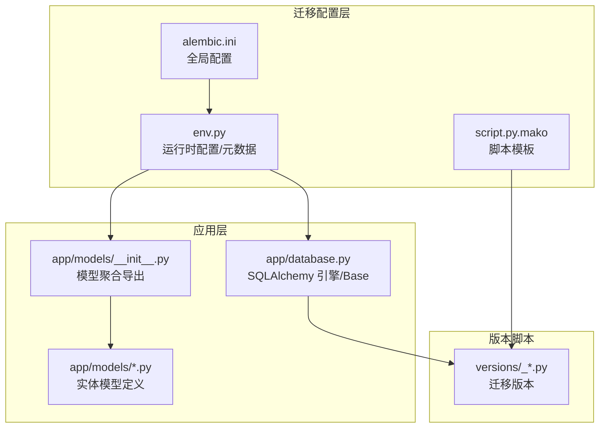
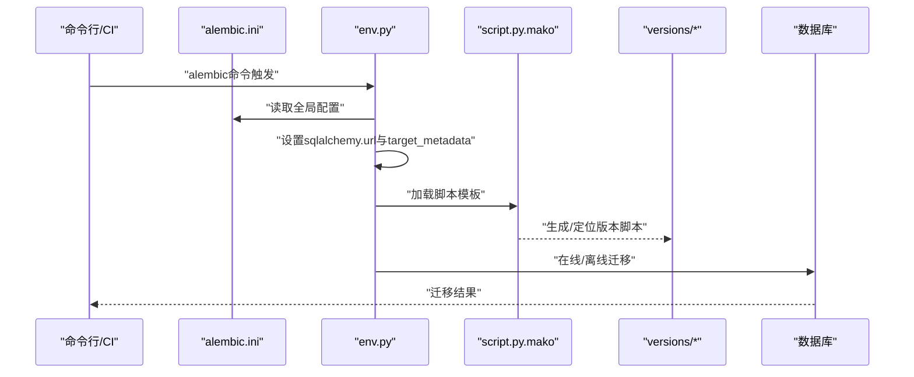
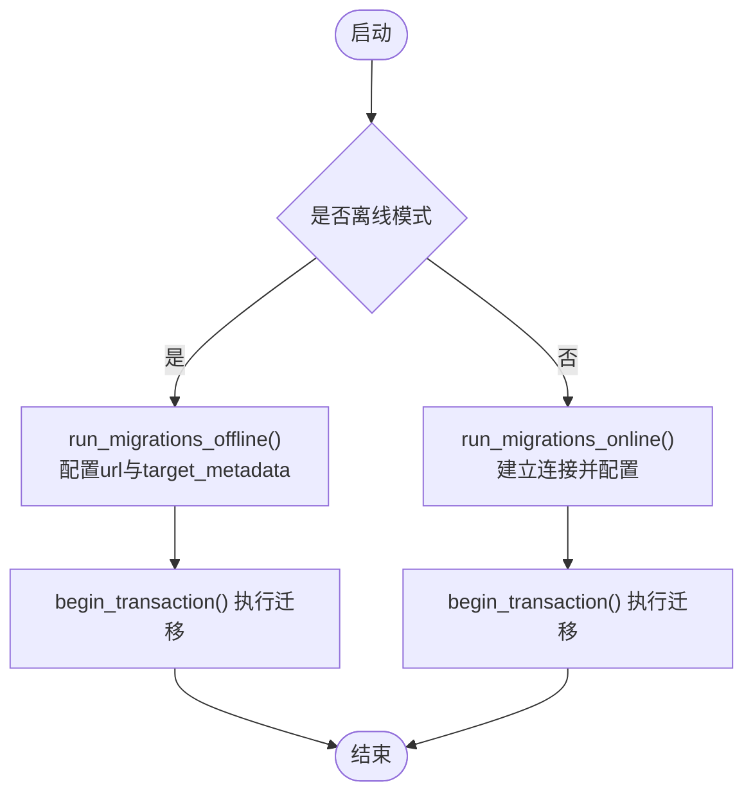
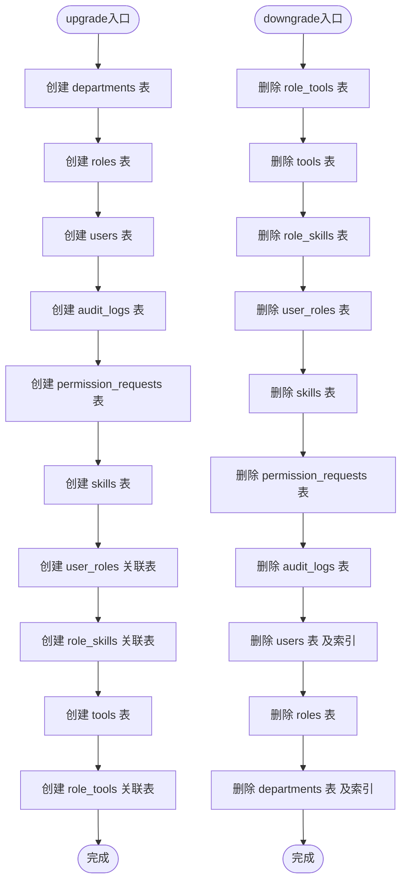
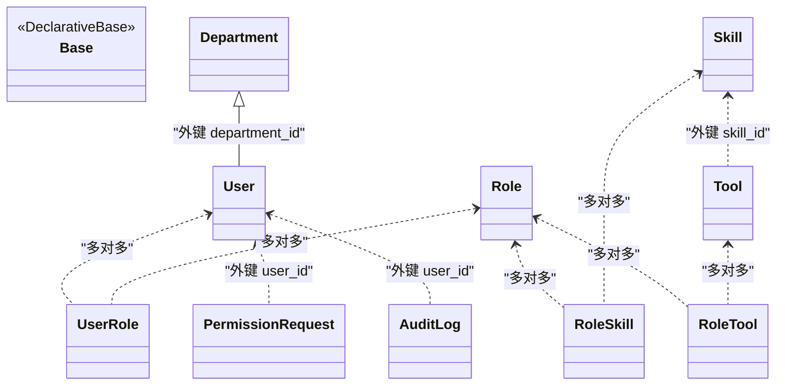
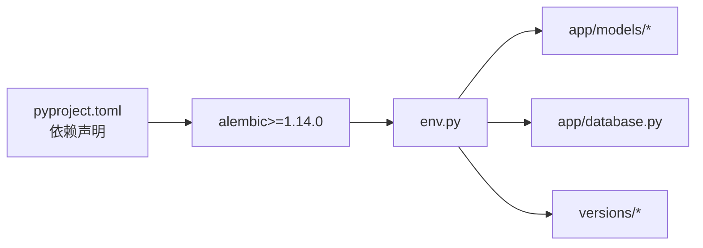

# 数据库迁移

<cite>
**本文引用的文件**
- [backend/alembic/env.py](file://backend/alembic/env.py)
- [backend/alembic.ini](file://backend/alembic.ini)
- [backend/alembic/script.py.mako](file://backend/alembic/script.py.mako)
- [backend/alembic/versions/5fb1c261fa23_initial_tables.py](file://backend/alembic/versions/5fb1c261fa23_initial_tables.py)
- [backend/pyproject.toml](file://backend/pyproject.toml)
- [backend/app/database.py](file://backend/app/database.py)
- [backend/app/models/__init__.py](file://backend/app/models/__init__.py)
- [backend/app/models/user.py](file://backend/app/models/user.py)
- [backend/app/models/permission.py](file://backend/app/models/permission.py)
- [backend/app/models/audit.py](file://backend/app/models/audit.py)
</cite>

## 目录
1. [简介](#简介)
2. [项目结构](#项目结构)
3. [核心组件](#核心组件)
4. [架构总览](#架构总览)
5. [详细组件分析](#详细组件分析)
6. [依赖分析](#依赖分析)
7. [性能考虑](#性能考虑)
8. [故障排除指南](#故障排除指南)
9. [结论](#结论)
10. [附录](#附录)

## 简介
本文件面向ToolHub项目的数据库迁移管理，系统性阐述基于Alembic的迁移体系：从配置与初始化、迁移脚本生成与执行、版本与依赖管理、到结构与数据变更策略；覆盖生产环境迁移流程、备份与回滚预案、最佳实践、常见问题与性能优化建议，并给出迁移测试与团队协作规范、监控与日志记录要点。

## 项目结构
ToolHub后端采用FastAPI + SQLAlchemy + Alembic的典型Python后端架构。数据库迁移相关的核心位置如下：
- Alembic配置与入口：backend/alembic/
- 迁移脚本模板：backend/alembic/script.py.mako
- 迁移脚本版本目录：backend/alembic/versions/
- Alembic全局配置：backend/alembic.ini
- 应用数据库引擎与Base模型：backend/app/database.py
- 模型聚合导出：backend/app/models/__init__.py
- 实体模型定义：backend/app/models/*.py（如用户、权限、审计等）

图表来源
- [backend/alembic.ini:1-37](file://backend/alembic.ini#L1-L37)
- [backend/alembic/script.py.mako:1-25](file://backend/alembic/script.py.mako#L1-L25)
- [backend/alembic/env.py:1-49](file://backend/alembic/env.py#L1-L49)
- [backend/app/database.py:1-25](file://backend/app/database.py#L1-L25)
- [backend/app/models/__init__.py:1-17](file://backend/app/models/__init__.py#L1-L17)

章节来源
- [backend/alembic.ini:1-37](file://backend/alembic.ini#L1-L37)
- [backend/alembic/script.py.mako:1-25](file://backend/alembic/script.py.mako#L1-L25)
- [backend/alembic/env.py:1-49](file://backend/alembic/env.py#L1-L49)
- [backend/app/database.py:1-25](file://backend/app/database.py#L1-L25)
- [backend/app/models/__init__.py:1-17](file://backend/app/models/__init__.py#L1-L17)

## 核心组件
- Alembic配置与运行时
  - env.py负责在离线/在线模式下配置目标元数据与连接，确保迁移脚本可访问应用模型。
  - alembic.ini提供全局配置项，包括脚本位置、SQLAlchemy连接串、日志级别等。
- 模型与元数据
  - app/database.py定义Base与引擎，供Alembic通过env.py读取target_metadata。
  - app/models/__init__.py统一导出所有模型，使env.py在autogenerate时能发现模型。
- 迁移脚本
  - script.py.mako是模板，生成的版本脚本包含升级/降级函数与版本元信息。
  - 已有初始版本脚本演示了完整的表结构与索引/约束定义。

章节来源
- [backend/alembic/env.py:1-49](file://backend/alembic/env.py#L1-L49)
- [backend/alembic.ini:1-37](file://backend/alembic.ini#L1-L37)
- [backend/alembic/script.py.mako:1-25](file://backend/alembic/script.py.mako#L1-L25)
- [backend/app/database.py:1-25](file://backend/app/database.py#L1-L25)
- [backend/app/models/__init__.py:1-17](file://backend/app/models/__init__.py#L1-L17)

## 架构总览
下图展示迁移系统的关键交互：Alembic通过env.py读取应用配置与模型元数据，结合alembic.ini进行离线/在线迁移；版本脚本由模板生成并按版本顺序执行。

图表来源
- [backend/alembic/env.py:1-49](file://backend/alembic/env.py#L1-L49)
- [backend/alembic.ini:1-37](file://backend/alembic.ini#L1-L37)
- [backend/alembic/script.py.mako:1-25](file://backend/alembic/script.py.mako#L1-L25)
- [backend/alembic/versions/5fb1c261fa23_initial_tables.py:1-161](file://backend/alembic/versions/5fb1c261fa23_initial_tables.py#L1-L161)

## 详细组件分析

### 组件A：迁移配置与运行时（env.py）
- 离线/在线模式切换：根据context.is_offline_mode选择不同执行路径。
- 配置优先级：优先使用环境变量DATABASE_URL，其次使用settings.DATABASE_URL，最终回退到alembic.ini中的sqlalchemy.url。
- 元数据绑定：target_metadata来自app.database.Base，确保模型变更被迁移系统感知。
- autogenerate支持：通过导入app.models.*，使Alembic在autogenerate时扫描到所有模型。

图表来源
- [backend/alembic/env.py:21-48](file://backend/alembic/env.py#L21-L48)

章节来源
- [backend/alembic/env.py:1-49](file://backend/alembic/env.py#L1-L49)

### 组件B：全局配置（alembic.ini）
- 脚本位置与连接串：script_location指向alembic目录，sqlalchemy.url提供默认连接串。
- 日志配置：控制root、sqlalchemy.engine、alembic三类日志级别与输出格式。

章节来源
- [backend/alembic.ini:1-37](file://backend/alembic.ini#L1-L37)

### 组件C：脚本模板（script.py.mako）
- 模板字段：包含消息、修订ID、上/下游修订、分支标签与依赖等。
- 升级/降级占位：通过${upgrades}/${downgrades}注入实际DDL/DML。

章节来源
- [backend/alembic/script.py.mako:1-25](file://backend/alembic/script.py.mako#L1-L25)

### 组件D：初始版本脚本（5fb1c261fa23_initial_tables.py）
- 版本元信息：revision、down_revision、branch_labels、depends_on。
- 升级逻辑：创建部门、角色、用户、审计日志、权限申请、技能、用户角色关联、技能角色关联、工具、角色工具关联等表及索引/约束。
- 降级逻辑：逆序删除表与索引，确保幂等回滚。

图表来源
- [backend/alembic/versions/5fb1c261fa23_initial_tables.py:19-161](file://backend/alembic/versions/5fb1c261fa23_initial_tables.py#L19-L161)

章节来源
- [backend/alembic/versions/5fb1c261fa23_initial_tables.py:1-161](file://backend/alembic/versions/5fb1c261fa23_initial_tables.py#L1-L161)

### 组件E：模型与元数据（models与database）
- 模型聚合：app/models/__init__.py导出全部实体，确保env.py在autogenerate时可见。
- 实体模型：用户、角色、部门、权限申请、审计日志、技能、工具及其多对多关联表。
- Base与引擎：app/database.py提供Base与SQLAlchemy引擎，env.py通过target_metadata与之绑定。

图表来源
- [backend/app/models/user.py:7-116](file://backend/app/models/user.py#L7-L116)
- [backend/app/models/permission.py:7-28](file://backend/app/models/permission.py#L7-L28)
- [backend/app/models/audit.py:6-17](file://backend/app/models/audit.py#L6-L17)
- [backend/app/models/__init__.py:1-17](file://backend/app/models/__init__.py#L1-L17)

章节来源
- [backend/app/models/__init__.py:1-17](file://backend/app/models/__init__.py#L1-L17)
- [backend/app/models/user.py:1-116](file://backend/app/models/user.py#L1-L116)
- [backend/app/models/permission.py:1-28](file://backend/app/models/permission.py#L1-L28)
- [backend/app/models/audit.py:1-17](file://backend/app/models/audit.py#L1-L17)
- [backend/app/database.py:1-25](file://backend/app/database.py#L1-L25)

## 依赖分析
- 外部依赖
  - Alembic版本：pyproject.toml声明了alembic>=1.14.0，确保模板与脚本兼容。
- 内部耦合
  - env.py依赖app.database.Base与app.models.*以暴露target_metadata。
  - 迁移脚本依赖SQLAlchemy DDL API（op）与模板生成。
- 风险点
  - DATABASE_URL优先级链路需在不同环境正确配置，避免误连。
  - autogenerate仅在模型变更时启用，避免手动修改生成脚本导致冲突。

图表来源
- [backend/pyproject.toml:1-31](file://backend/pyproject.toml#L1-L31)
- [backend/alembic/env.py:1-49](file://backend/alembic/env.py#L1-L49)
- [backend/app/models/__init__.py:1-17](file://backend/app/models/__init__.py#L1-L17)
- [backend/app/database.py:1-25](file://backend/app/database.py#L1-L25)

章节来源
- [backend/pyproject.toml:1-31](file://backend/pyproject.toml#L1-L31)
- [backend/alembic/env.py:1-49](file://backend/alembic/env.py#L1-L49)

## 性能考虑
- 连接与池化
  - 应用层engine启用了pool_pre_ping与pool_recycle，有助于长连接稳定性；迁移时建议使用NullPool以避免连接池干扰。
- 大表变更
  - 建议拆分大DDL为多个小版本，配合索引/约束分步添加，减少锁竞争。
- 并发与事务
  - 单次迁移在一个事务中执行，失败自动回滚；批量数据迁移应分批提交并记录进度。
- 日志与可观测性
  - 提高alembic日志级别以便定位问题；在CI中记录迁移耗时与结果。

## 故障排除指南
- 连接失败
  - 检查环境变量DATABASE_URL与settings.DATABASE_URL是否正确；确认alembic.ini中的sqlalchemy.url作为兜底。
- 无法发现模型
  - 确认app/models/__init__.py导出了全部模型；env.py已导入app.models.*。
- autogenerate不生效
  - 确保只在模型定义变更时使用autogenerate；不要直接编辑生成的脚本，必要时回滚重做。
- 回滚失败
  - 检查降级顺序是否与建表顺序相反；确认外键约束与索引删除顺序正确。
- 生产回滚
  - 建议先在预生产验证回滚脚本；保留备份快照；回滚前做好数据备份与通知。

## 结论
ToolHub的迁移体系以Alembic为核心，结合应用层的SQLAlchemy模型与配置，实现了从离线/在线模式到版本管理与依赖追踪的完整闭环。遵循本文的最佳实践与流程规范，可在保障数据安全的前提下高效推进数据库演进。

## 附录

### 迁移管理流程（建议）
- 开发阶段
  - 使用autogenerate生成脚本；在本地与测试库验证升级/降级。
- 预生产阶段
  - 在隔离环境中执行迁移；记录耗时与异常；准备回滚方案。
- 生产阶段
  - 制定停机窗口或灰度策略；执行前备份；执行中监控；执行后验证。

### 编写规范与策略
- 脚本命名：语义化版本号+简要描述，便于追溯。
- 升降级对称：每条DDL必有对应的DROP/ALTER。
- 数据迁移：优先使用SQL原生更新，避免ORM批量加载；分批处理并记录进度。
- 依赖关系：明确down_revision与depends_on，避免跨版本循环依赖。

### 测试与一致性
- 环境一致性：确保各环境的alembic.ini与DATABASE_URL一致；镜像数据库结构。
- 自动化测试：在CI中执行alembic current/head/upgrade/downgrade流水线。
- 团队协作：每次模型变更提交对应迁移脚本；禁止直接修改历史版本。

### 监控与日志
- 日志级别：提升alembic与sqlalchemy日志级别以捕获DDL细节。
- 监控指标：记录迁移开始/结束时间、影响行数、错误码。
- 告警：对长时间运行或失败的迁移触发告警。