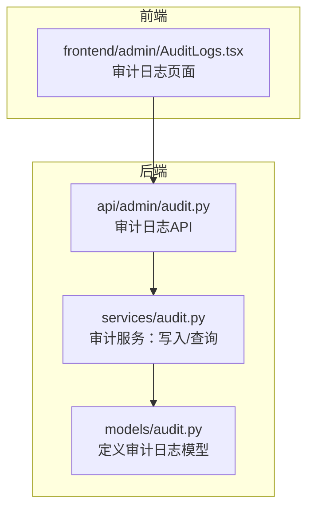
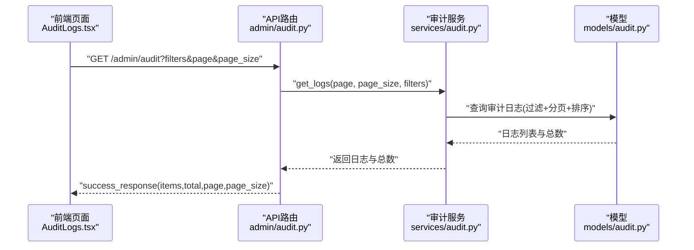
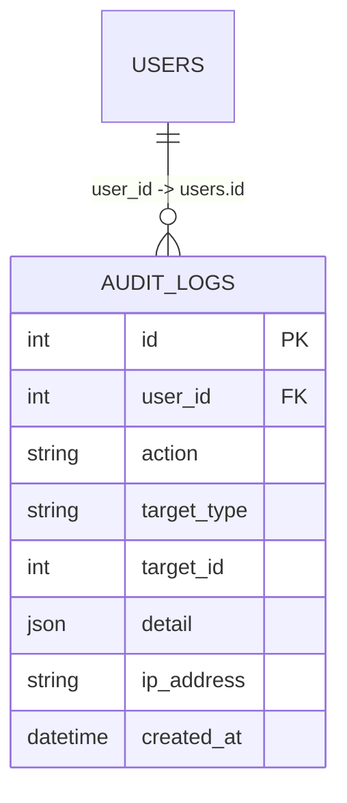
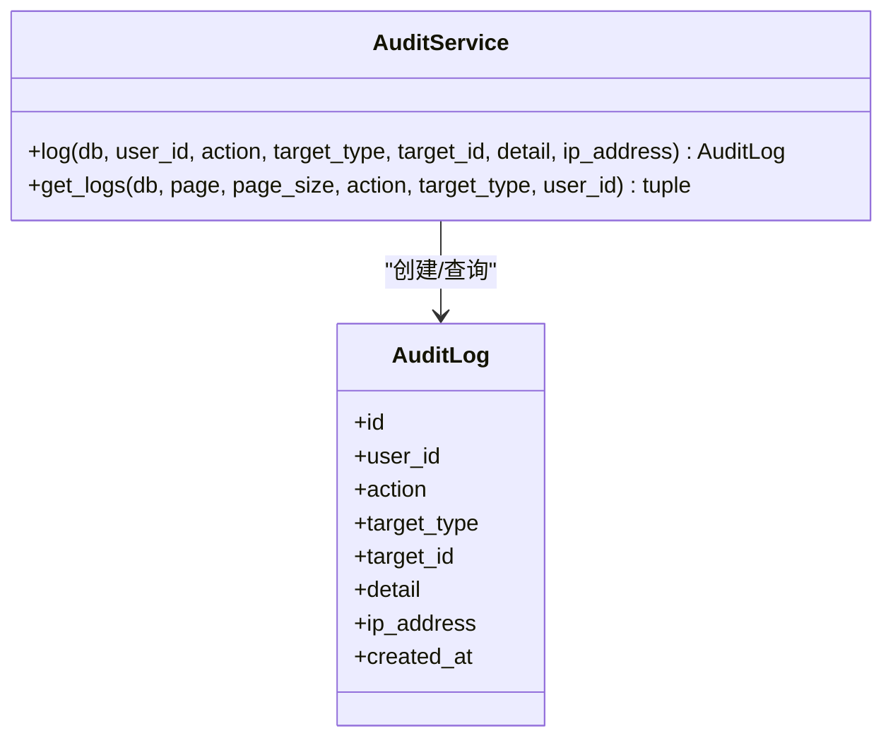
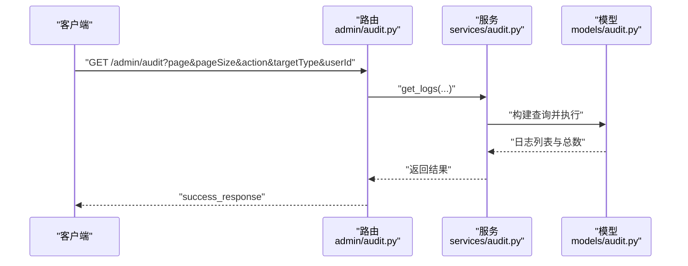
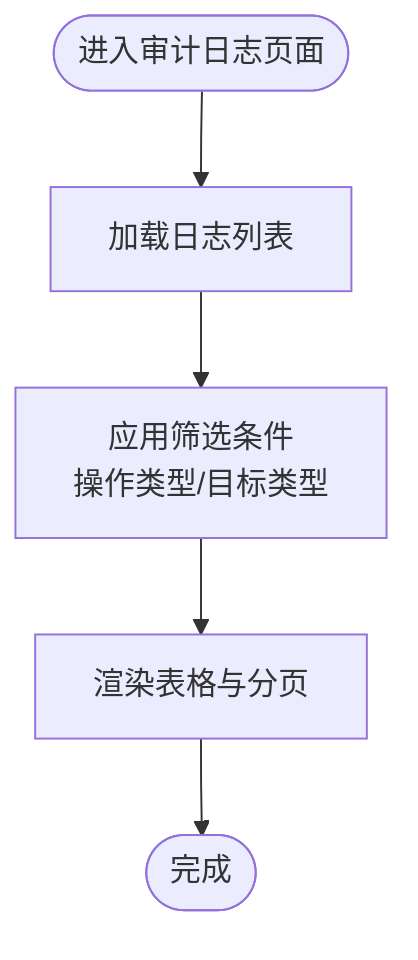

# 审计日志模型

<cite>
**本文引用的文件**
- [backend/app/models/audit.py](file://backend/app/models/audit.py)
- [backend/app/services/audit.py](file://backend/app/services/audit.py)
- [backend/app/api/admin/audit.py](file://backend/app/api/admin/audit.py)
- [frontend/admin/src/pages/AuditLogs.tsx](file://frontend/admin/src/pages/AuditLogs.tsx)
</cite>

## 目录
1. [简介](#简介)
2. [项目结构](#项目结构)
3. [核心组件](#核心组件)
4. [架构总览](#架构总览)
5. [详细组件分析](#详细组件分析)
6. [依赖分析](#依赖分析)
7. [性能考虑](#性能考虑)
8. [故障排查指南](#故障排查指南)
9. [结论](#结论)
10. [附录](#附录)

## 简介
本文件围绕ToolHub的审计日志模型进行系统化数据建模与实现说明，覆盖以下方面：
- 审计事件类型分类：用户操作、权限变更、系统事件
- 操作详情记录：操作内容、影响范围、变更前后对比
- 时间戳管理与操作者标识
- 字段定义与约束：事件时间、用户ID、操作类型、IP地址、User-Agent等
- 存储策略、查询优化与归档机制
- 在系统监控、合规性检查、安全审计中的作用
- 查询示例、统计分析方法与性能优化建议

## 项目结构
审计日志功能由后端ORM模型、服务层、API路由与前端展示页面共同组成，采用分层设计，职责清晰：
- 数据模型层：定义审计日志表结构与字段
- 服务层：封装写入与查询逻辑
- API层：对外暴露审计日志查询接口
- 前端层：提供审计日志列表与筛选能力

图表来源
- [backend/app/models/audit.py:1-17](file://backend/app/models/audit.py#L1-L17)
- [backend/app/services/audit.py:1-54](file://backend/app/services/audit.py#L1-L54)
- [backend/app/api/admin/audit.py:1-37](file://backend/app/api/admin/audit.py#L1-L37)
- [frontend/admin/src/pages/AuditLogs.tsx:1-52](file://frontend/admin/src/pages/AuditLogs.tsx#L1-L52)

章节来源
- [backend/app/models/audit.py:1-17](file://backend/app/models/audit.py#L1-L17)
- [backend/app/services/audit.py:1-54](file://backend/app/services/audit.py#L1-L54)
- [backend/app/api/admin/audit.py:1-37](file://backend/app/api/admin/audit.py#L1-L37)
- [frontend/admin/src/pages/AuditLogs.tsx:1-52](file://frontend/admin/src/pages/AuditLogs.tsx#L1-L52)

## 核心组件
- 审计日志模型（ORM）
  - 表名：audit_logs
  - 主键：自增整数ID
  - 关键字段：用户ID、操作类型、目标类型、目标ID、操作详情（JSON）、IP地址、创建时间
- 审计服务
  - 写入：接收用户ID、操作类型、目标类型、目标ID、详情、IP等参数，持久化到数据库
  - 查询：支持按操作类型、目标类型、用户ID过滤，分页排序返回
- 审计日志API
  - 提供分页查询接口，返回标准化响应结构
- 前端审计日志页面
  - 支持按操作类型与目标类型筛选，展示列表与分页

章节来源
- [backend/app/models/audit.py:6-17](file://backend/app/models/audit.py#L6-L17)
- [backend/app/services/audit.py:6-53](file://backend/app/services/audit.py#L6-L53)
- [backend/app/api/admin/audit.py:12-36](file://backend/app/api/admin/audit.py#L12-L36)
- [frontend/admin/src/pages/AuditLogs.tsx:9-52](file://frontend/admin/src/pages/AuditLogs.tsx#L9-L52)

## 架构总览
审计日志从产生到呈现的完整流程如下：

图表来源
- [backend/app/api/admin/audit.py:12-36](file://backend/app/api/admin/audit.py#L12-L36)
- [backend/app/services/audit.py:32-50](file://backend/app/services/audit.py#L32-L50)
- [backend/app/models/audit.py:6-17](file://backend/app/models/audit.py#L6-L17)

## 详细组件分析

### 数据模型：AuditLog
- 设计要点
  - 使用字符串枚举值表示操作类型，便于前端渲染与筛选
  - 使用JSON字段存储操作详情，支持灵活记录变更前后对比、影响范围等
  - 目标类型与目标ID用于定位具体资源，便于关联其他业务实体
  - IP地址字段便于溯源与风控
  - 创建时间默认使用UTC，便于跨时区统一展示
- 字段定义与约束
  - id：主键，自增
  - user_id：外键关联用户表，允许为空（匿名或系统操作）
  - action：操作类型，如“create”、“update”、“delete”、“approve”、“reject”、“login”
  - target_type：目标类型，如“user”、“role”、“skill”、“tool”、“permission_request”
  - target_id：目标对象ID
  - detail：JSON格式的操作详情
  - ip_address：客户端IP
  - created_at：记录创建时间（UTC）

图表来源
- [backend/app/models/audit.py:6-17](file://backend/app/models/audit.py#L6-L17)

章节来源
- [backend/app/models/audit.py:6-17](file://backend/app/models/audit.py#L6-L17)

### 服务层：AuditService
- 写入日志
  - 接收用户ID、操作类型、目标类型、目标ID、详情、IP等参数
  - 构造模型实例并提交事务，刷新后返回
- 查询日志
  - 支持按操作类型、目标类型、用户ID过滤
  - 统计总数并按创建时间倒序分页查询
  - 返回日志列表与总数

图表来源
- [backend/app/services/audit.py:6-53](file://backend/app/services/audit.py#L6-L53)
- [backend/app/models/audit.py:6-17](file://backend/app/models/audit.py#L6-L17)

章节来源
- [backend/app/services/audit.py:6-53](file://backend/app/services/audit.py#L6-L53)

### API层：审计日志接口
- 路径：GET /admin/audit
- 参数
  - page/page_size：分页参数（最小为1，最大为100）
  - action：操作类型过滤
  - target_type：目标类型过滤
  - user_id：用户ID过滤
- 返回
  - items：日志条目数组
  - total：总数
  - page/page_size：分页信息

图表来源
- [backend/app/api/admin/audit.py:12-36](file://backend/app/api/admin/audit.py#L12-L36)
- [backend/app/services/audit.py:32-50](file://backend/app/services/audit.py#L32-L50)
- [backend/app/models/audit.py:6-17](file://backend/app/models/audit.py#L6-L17)

章节来源
- [backend/app/api/admin/audit.py:12-36](file://backend/app/api/admin/audit.py#L12-L36)

### 前端展示：审计日志页面
- 功能
  - 支持按操作类型与目标类型筛选
  - 展示日志列表（ID、用户ID、操作、目标类型、目标ID、详情、IP、时间）
  - 分页展示与重置筛选
- 渲染
  - 操作类型以颜色区分，提升可读性

图表来源
- [frontend/admin/src/pages/AuditLogs.tsx:9-52](file://frontend/admin/src/pages/AuditLogs.tsx#L9-L52)

章节来源
- [frontend/admin/src/pages/AuditLogs.tsx:9-52](file://frontend/admin/src/pages/AuditLogs.tsx#L9-L52)

## 依赖分析
- 组件耦合
  - API路由依赖审计服务
  - 审计服务依赖模型定义
  - 前端页面依赖API路由
- 外部依赖
  - SQLAlchemy ORM（模型与查询）
  - FastAPI（路由与响应）
  - Ant Design（前端表格与选择器）

图表来源
- [backend/app/api/admin/audit.py:1-37](file://backend/app/api/admin/audit.py#L1-L37)
- [backend/app/services/audit.py:1-54](file://backend/app/services/audit.py#L1-L54)
- [backend/app/models/audit.py:1-17](file://backend/app/models/audit.py#L1-L17)

章节来源
- [backend/app/api/admin/audit.py:1-37](file://backend/app/api/admin/audit.py#L1-L37)
- [backend/app/services/audit.py:1-54](file://backend/app/services/audit.py#L1-L54)
- [backend/app/models/audit.py:1-17](file://backend/app/models/audit.py#L1-L17)

## 性能考虑
- 查询性能
  - 当前查询未显式建立索引，建议对高频过滤字段（如user_id、action、target_type、created_at）建立复合索引或单独索引，以降低全表扫描成本
  - 分页使用offset/limit，大数据量下建议引入“基于游标”的分页方案，避免深度分页导致的性能退化
- 写入性能
  - 单条日志写入为短事务，整体开销较小；若日志量极大，可考虑批量写入或异步队列
- 存储与归档
  - 建议按月/季度分区或归档历史数据至冷存储，保留热数据在高性能存储中
  - 对detail字段可做压缩存储（如gzip），减少空间占用
- 缓存与统计
  - 对高频统计（如按天/小时操作量）可引入Redis缓存，定期更新
- 安全与合规
  - 敏感字段（如IP、User-Agent）需遵循隐私保护要求，必要时脱敏处理
  - 日志保留周期与删除策略需满足合规要求

## 故障排查指南
- 常见问题
  - 查询结果为空：确认筛选条件是否正确，尤其是目标类型与操作类型的拼写
  - 分页异常：检查page与page_size边界（最小为1，最大为100）
  - 详情字段显示异常：确认detail为合法JSON结构
- 排查步骤
  - 后端：核对服务层查询逻辑与模型字段映射
  - 前端：核对请求参数与响应解析
  - 数据库：确认表结构与索引是否存在

章节来源
- [backend/app/services/audit.py:32-50](file://backend/app/services/audit.py#L32-L50)
- [backend/app/api/admin/audit.py:12-36](file://backend/app/api/admin/audit.py#L12-L36)
- [frontend/admin/src/pages/AuditLogs.tsx:9-52](file://frontend/admin/src/pages/AuditLogs.tsx#L9-L52)

## 结论
ToolHub的审计日志模型以简洁的字段设计与清晰的分层架构实现了对用户操作、权限变更与系统事件的全面记录。通过服务层抽象与API接口，系统具备良好的扩展性与可维护性。建议后续在索引优化、分页策略、存储归档与统计缓存等方面进一步完善，以支撑更大规模的日志场景。

## 附录

### 字段定义与取值规范
- 事件时间：created_at（UTC）
- 用户ID：user_id（可空）
- 操作类型：action（如create、update、delete、approve、reject、login）
- 目标类型：target_type（如user、role、skill、tool、permission_request）
- 目标ID：target_id
- 操作详情：detail（JSON，建议包含变更前后对比、影响范围等）
- IP地址：ip_address
- User-Agent：当前模型未包含该字段，如需可扩展

章节来源
- [backend/app/models/audit.py:6-17](file://backend/app/models/audit.py#L6-L17)

### 审计事件类型分类
- 用户操作：用户登录、资料修改、密码变更等
- 权限变更：角色分配、权限申请审批、授权调整等
- 系统事件：工具/技能/部门等资源的新增、修改、删除等

### 操作详情记录建议
- 变更前后对比：以JSON形式记录字段级差异
- 影响范围：涉及的资源ID列表或数量
- 备注信息：操作原因、审批意见等

### 查询示例与统计分析
- 查询示例
  - 获取某用户最近的日志：按user_id过滤并按created_at倒序分页
  - 获取某类资源的变更日志：按target_type与target_id过滤
  - 获取某时间段内的登录日志：结合created_at与action过滤
- 统计分析
  - 按天/小时/操作类型聚合统计
  - 异常行为检测：短时间内高频操作、跨地域登录等

### 存储策略与归档机制
- 热数据：近期30-90天保留在高性能存储
- 温数据：1-12个月归档至中速存储
- 冷数据：超过一年移至低成本/离线存储
- 压缩与脱敏：对detail等字段进行压缩与敏感信息脱敏