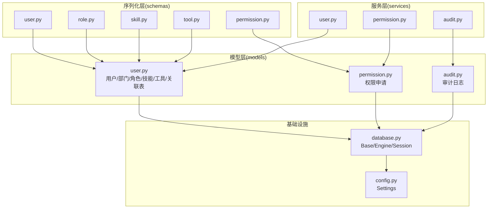
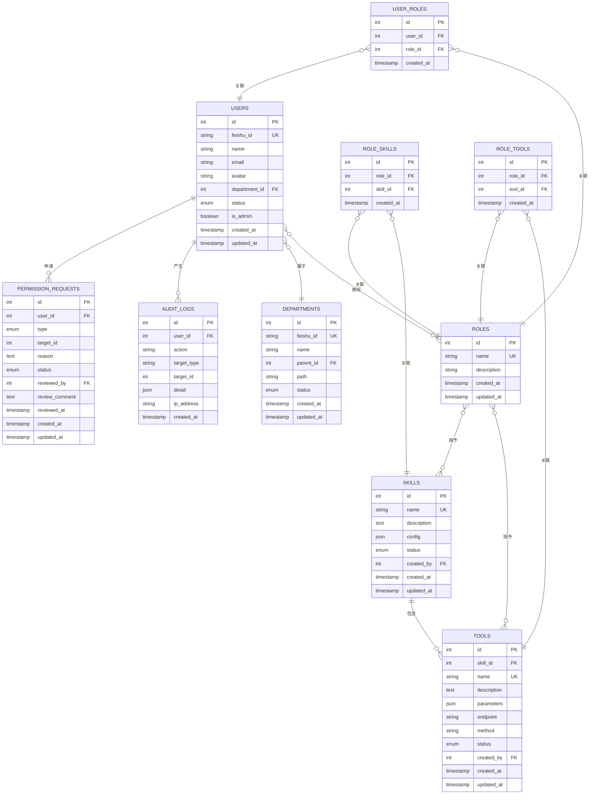
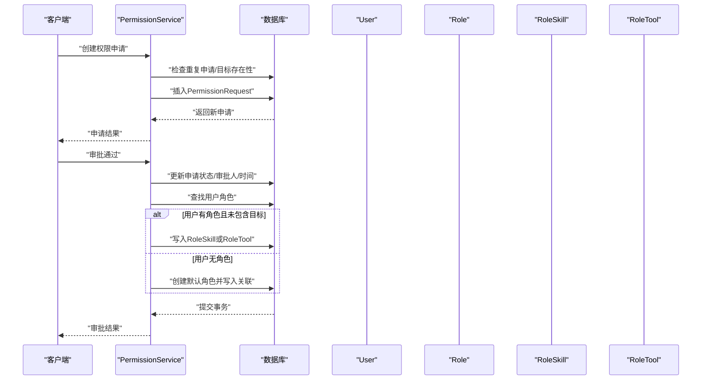
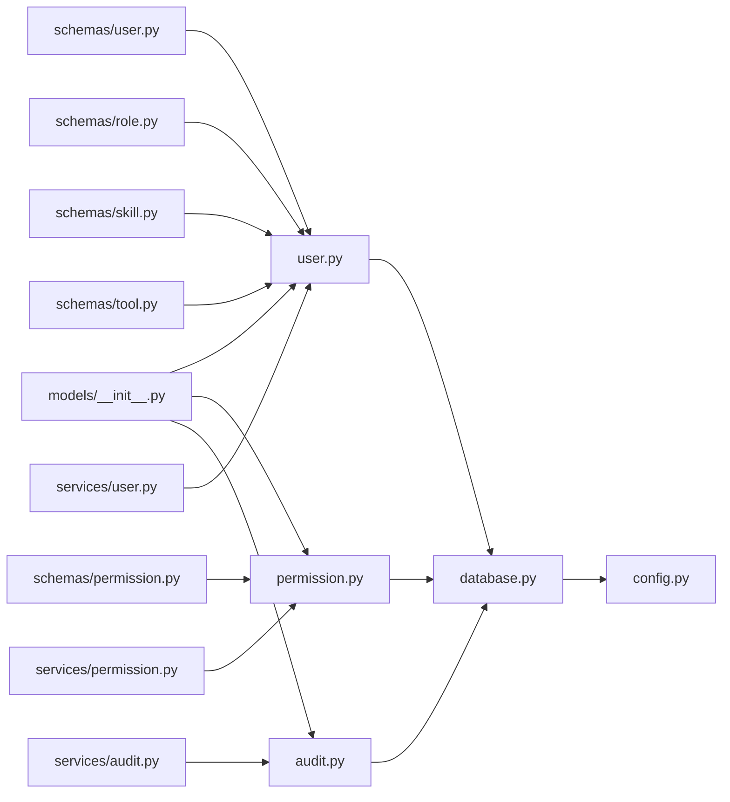

# 数据模型

<cite>
**本文引用的文件**
- [backend/app/models/user.py](file://backend/app/models/user.py)
- [backend/app/models/permission.py](file://backend/app/models/permission.py)
- [backend/app/models/audit.py](file://backend/app/models/audit.py)
- [backend/app/models/__init__.py](file://backend/app/models/__init__.py)
- [backend/app/database.py](file://backend/app/database.py)
- [backend/app/schemas/user.py](file://backend/app/schemas/user.py)
- [backend/app/schemas/permission.py](file://backend/app/schemas/permission.py)
- [backend/app/schemas/role.py](file://backend/app/schemas/role.py)
- [backend/app/schemas/skill.py](file://backend/app/schemas/skill.py)
- [backend/app/schemas/tool.py](file://backend/app/schemas/tool.py)
- [backend/app/services/user.py](file://backend/app/services/user.py)
- [backend/app/services/permission.py](file://backend/app/services/permission.py)
- [backend/app/services/audit.py](file://backend/app/services/audit.py)
- [backend/app/config.py](file://backend/app/config.py)
</cite>

## 目录
1. [简介](#简介)
2. [项目结构](#项目结构)
3. [核心组件](#核心组件)
4. [架构总览](#架构总览)
5. [详细组件分析](#详细组件分析)
6. [依赖分析](#依赖分析)
7. [性能考虑](#性能考虑)
8. [故障排查指南](#故障排查指南)
9. [结论](#结论)
10. [附录](#附录)

## 简介
本文件系统性梳理ToolHub项目的核心数据模型，覆盖用户(User)、权限(PermissionRequest)、审计(AuditLog)等关键实体，明确字段定义、数据类型、验证规则、关系映射、生命周期管理、序列化处理、ORM映射配置、索引设计与性能优化策略，并给出模型扩展点与自定义字段添加方法。文档同时提供模型类图与关系图，帮助开发者快速理解与维护数据模型。

## 项目结构
ToolHub采用分层架构，数据模型位于backend/app/models目录，配合Pydantic Schema进行输入输出校验，SQLAlchemy ORM负责持久化，服务层封装业务逻辑，配置文件集中管理数据库连接参数。

图表来源
- [backend/app/models/user.py:1-116](file://backend/app/models/user.py#L1-L116)
- [backend/app/models/permission.py:1-28](file://backend/app/models/permission.py#L1-L28)
- [backend/app/models/audit.py:1-17](file://backend/app/models/audit.py#L1-L17)
- [backend/app/schemas/user.py:1-67](file://backend/app/schemas/user.py#L1-L67)
- [backend/app/schemas/permission.py:1-56](file://backend/app/schemas/permission.py#L1-L56)
- [backend/app/schemas/role.py:1-43](file://backend/app/schemas/role.py#L1-L43)
- [backend/app/schemas/skill.py:1-45](file://backend/app/schemas/skill.py#L1-L45)
- [backend/app/schemas/tool.py:1-51](file://backend/app/schemas/tool.py#L1-L51)
- [backend/app/services/user.py:1-86](file://backend/app/services/user.py#L1-L86)
- [backend/app/services/permission.py:1-182](file://backend/app/services/permission.py#L1-L182)
- [backend/app/services/audit.py:1-54](file://backend/app/services/audit.py#L1-L54)
- [backend/app/database.py:1-25](file://backend/app/database.py#L1-L25)
- [backend/app/config.py:1-42](file://backend/app/config.py#L1-L42)

章节来源
- [backend/app/models/__init__.py:1-17](file://backend/app/models/__init__.py#L1-L17)
- [backend/app/database.py:1-25](file://backend/app/database.py#L1-L25)
- [backend/app/config.py:1-42](file://backend/app/config.py#L1-L42)

## 核心组件
本节对核心数据模型进行逐项说明，包括字段定义、数据类型、验证规则、关系映射、索引与约束、生命周期字段等。

- 用户(User)
  - 字段与类型
    - 主键: 整型自增
    - 飞书ID: 字符串唯一，支持空值，建立索引
    - 姓名: 字符串非空
    - 邮箱: 字符串可空
    - 头像: 字符串可空
    - 部门ID: 整型外键，可空
    - 状态: 枚举(active/inactive)，默认active
    - 是否管理员: 布尔，默认false
    - 创建/更新时间: 时间戳，默认当前UTC，更新时自动刷新
  - 关系
    - 属于部门: 外键关联departments.id
    - 角色集合: 多对多，通过user_roles中间表
    - 权限申请集合: 一对多，back_populates到PermissionRequest.user
  - 约束与索引
    - 唯一索引: feishu_id
    - 普通索引: feishu_id
    - 级联删除: user_roles中user_id与role_id均设置ondelete=CASCADE
  - 生命周期
    - created_at: 默认当前UTC
    - updated_at: 默认当前UTC，onupdate自动刷新

- 部门(Department)
  - 字段与类型
    - 主键: 整型自增
    - 飞书ID: 字符串唯一，支持空值，建立索引
    - 名称: 字符串非空
    - 父部门ID: 整型外键，可空，自引用
    - 路径: 字符串可空
    - 状态: 枚举(active/inactive)，默认active
    - 创建/更新时间: 时间戳
  - 关系
    - 自引用父子关系: parent与children
    - 用户集合: 一对多，back_populates到User.department
  - 约束与索引
    - 唯一索引: feishu_id
    - 普通索引: feishu_id
  - 生命周期
    - created_at/updated_at: 同上

- 角色(Role)
  - 字段与类型
    - 主键: 整型自增
    - 名称: 字符串唯一，非空
    - 描述: 字符串可空
    - 创建/更新时间: 时间戳
  - 关系
    - 用户集合: 多对多，通过user_roles中间表
    - 技能集合: 多对多，通过role_skills中间表
    - 工具集合: 多对多，通过role_tools中间表
  - 约束与索引
    - 唯一索引: name
  - 生命周期
    - created_at/updated_at: 同上

- 用户-角色关联(UserRole)
  - 字段与类型
    - 主键: 整型自增
    - 用户ID: 整型外键，非空，ondelete=CASCADE
    - 角色ID: 整型外键，非空，ondelete=CASCADE
    - 创建时间: 时间戳
  - 约束与索引
    - 复合唯一: (user_id, role_id)
    - 级联删除: CASCADE

- 技能(Skill)
  - 字段与类型
    - 主键: 整型自增
    - 名称: 字符串唯一，非空
    - 描述: 文本可空
    - 配置: JSON可空
    - 状态: 枚举(active/inactive)，默认active
    - 创建人: 整型外键，可空
    - 创建/更新时间: 时间戳
  - 关系
    - 角色集合: 多对多，通过role_skills中间表
    - 工具集合: 一对多，back_populates到Tool.skill，级联删除孤儿
  - 约束与索引
    - 唯一索引: name
  - 生命周期
    - created_at/updated_at: 同上

- 工具(Tool)
  - 字段与类型
    - 主键: 整型自增
    - 技能ID: 整型外键，可空，ondelete=CASCADE
    - 名称: 字符串唯一，非空
    - 描述: 文本可空
    - 参数: JSON可空
    - 端点: 字符串可空
    - 方法: 字符串默认POST
    - 状态: 枚举(active/inactive)，默认active
    - 创建人: 整型外键，可空
    - 创建/更新时间: 时间戳
  - 关系
    - 所属技能: 外键回溯到Skill
    - 角色集合: 多对多，通过role_tools中间表
  - 约束与索引
    - 唯一索引: name
  - 生命周期
    - created_at/updated_at: 同上

- 技能-角色关联(RoleSkill)
  - 字段与类型
    - 主键: 整型自增
    - 角色ID: 整型外键，非空，ondelete=CASCADE
    - 技能ID: 整型外键，非空，ondelete=CASCADE
    - 创建时间: 时间戳
  - 约束与索引
    - 复合唯一: (role_id, skill_id)
    - 级联删除: CASCADE

- 工具-角色关联(RoleTool)
  - 字段与类型
    - 主键: 整型自增
    - 角色ID: 整型外键，非空，ondelete=CASCADE
    - 工具ID: 整型外键，非空，ondelete=CASCADE
    - 创建时间: 时间戳
  - 约殊与索引
    - 复合唯一: (role_id, tool_id)
    - 级联删除: CASCADE

- 权限申请(PermissionRequest)
  - 字段与类型
    - 主键: 整型自增
    - 申请人ID: 整型外键，非空，ondelete=CASCADE
    - 类型: 枚举(skill/tool)，非空
    - 目标ID: 整型，非空
    - 申请理由: 文本可空
    - 状态: 枚举(pending/approved/rejected/cancelled)，默认pending
    - 审批人ID: 整型外键，可空
    - 审批备注: 文本可空
    - 审批时间: 时间戳可空
    - 创建/更新时间: 时间戳
  - 关系
    - 申请人: 外键回溯到User
    - 审批人: 外键回溯到User
  - 约束与索引
    - 级联删除: CASCADE
  - 生命周期
    - created_at/updated_at: 同上

- 审计日志(AuditLog)
  - 字段与类型
    - 主键: 整型自增
    - 操作人ID: 整型外键，可空
    - 操作类型: 字符串非空
    - 目标类型: 字符串可空
    - 目标ID: 整型可空
    - 详情: JSON可空
    - IP地址: 字符串可空
    - 创建时间: 时间戳
  - 关系
    - 无外键关系
  - 约束与索引
    - 无显式唯一索引
  - 生命周期
    - created_at: 默认当前UTC

章节来源
- [backend/app/models/user.py:7-116](file://backend/app/models/user.py#L7-L116)
- [backend/app/models/permission.py:7-28](file://backend/app/models/permission.py#L7-L28)
- [backend/app/models/audit.py:6-17](file://backend/app/models/audit.py#L6-L17)

## 架构总览
下图展示数据模型之间的实体关系与外键约束，体现ToolHub的权限与资源管理核心关系。

图表来源
- [backend/app/models/user.py:7-116](file://backend/app/models/user.py#L7-L116)
- [backend/app/models/permission.py:7-28](file://backend/app/models/permission.py#L7-L28)
- [backend/app/models/audit.py:6-17](file://backend/app/models/audit.py#L6-L17)

## 详细组件分析

### 用户(User)模型
- 设计要点
  - 支持飞书ID唯一标识，便于与外部系统集成
  - 状态枚举控制用户启用/停用
  - is_admin标记用于快速识别管理员
  - 多对多角色关系通过中间表管理
- 查询优化
  - feishu_id建立索引，支持按飞书ID快速检索
  - 分页查询在服务层实现，避免一次性加载大量用户
- 序列化
  - Pydantic Schema提供基础读取模型，支持from_attributes映射
- 生命周期
  - created_at/updated_at自动维护

章节来源
- [backend/app/models/user.py:23-40](file://backend/app/models/user.py#L23-L40)
- [backend/app/schemas/user.py:27-43](file://backend/app/schemas/user.py#L27-L43)
- [backend/app/services/user.py:12-28](file://backend/app/services/user.py#L12-L28)

### 权限申请(PermissionRequest)模型
- 设计要点
  - 统一的申请入口，支持技能与工具两类目标
  - 状态机管理(pending/approved/rejected/cancelled)
  - 审批流程记录审批人、时间与备注
- 查询优化
  - 服务层提供按用户、状态过滤的分页查询
- 审批逻辑
  - 通过审批自动为用户分配对应角色-技能/工具关联
  - 若用户无角色，自动创建默认角色并绑定

图表来源
- [backend/app/services/permission.py:13-128](file://backend/app/services/permission.py#L13-L128)

章节来源
- [backend/app/models/permission.py:7-28](file://backend/app/models/permission.py#L7-L28)
- [backend/app/schemas/permission.py:6-28](file://backend/app/schemas/permission.py#L6-L28)
- [backend/app/services/permission.py:86-128](file://backend/app/services/permission.py#L86-L128)

### 审计(AuditLog)模型
- 设计要点
  - 记录用户操作行为，支持按操作类型、目标类型、用户过滤
  - 详情字段存储JSON，便于扩展
- 查询优化
  - 服务层提供多维过滤与排序
- 使用场景
  - 安全审计、合规追踪、问题溯源

章节来源
- [backend/app/models/audit.py:6-17](file://backend/app/models/audit.py#L6-L17)
- [backend/app/schemas/permission.py:41-48](file://backend/app/schemas/permission.py#L41-L48)
- [backend/app/services/audit.py:9-50](file://backend/app/services/audit.py#L9-L50)

### 角色-技能-工具关联模型
- 设计要点
  - 三张中间表分别管理多对多关系
  - 级联删除保证数据一致性
- 性能建议
  - 在高频查询维度建立复合索引
  - 批量写入减少事务开销

章节来源
- [backend/app/models/user.py:56-116](file://backend/app/models/user.py#L56-L116)

## 依赖分析
- 模型导入与导出
  - models/__init__.py统一导出所有模型，便于API路由与Alembic迁移使用
- ORM与数据库
  - database.py基于DeclarativeBase定义Base类，统一继承
  - engine与session配置支持池化与预检
- 服务层耦合
  - 服务层通过SQLAlchemy Session访问模型，遵循单一职责
- 配置中心
  - config.py集中管理DATABASE_URL等环境变量

图表来源
- [backend/app/models/__init__.py:1-17](file://backend/app/models/__init__.py#L1-L17)
- [backend/app/models/user.py:1-116](file://backend/app/models/user.py#L1-L116)
- [backend/app/models/permission.py:1-28](file://backend/app/models/permission.py#L1-L28)
- [backend/app/models/audit.py:1-17](file://backend/app/models/audit.py#L1-L17)
- [backend/app/database.py:1-25](file://backend/app/database.py#L1-L25)
- [backend/app/config.py:1-42](file://backend/app/config.py#L1-L42)

章节来源
- [backend/app/models/__init__.py:1-17](file://backend/app/models/__init__.py#L1-L17)
- [backend/app/database.py:1-25](file://backend/app/database.py#L1-L25)
- [backend/app/config.py:17-18](file://backend/app/config.py#L17-L18)

## 性能考虑
- 索引设计
  - 唯一索引: feishu_id(用户/部门)、name(技能/工具)
  - 普通索引: feishu_id(用户/部门)、created_at(审计日志)
  - 复合唯一: 中间表(user_roles/role_skills/role_tools)的(user_id, role_id)等
- 查询优化
  - 分页查询: 服务层统一实现offset/limit与count统计
  - 过滤条件: 支持关键词、状态、用户ID等多维过滤
- 事务与连接
  - 连接池预检与回收配置，降低连接失效带来的性能损耗
- 缓存与批量
  - 对热点查询结果可引入应用层缓存
  - 批量写入中间表减少事务次数

## 故障排查指南
- 常见错误与定位
  - 重复申请: 创建权限申请时检查同用户、同类型、同目标的pending状态
  - 目标不存在: 创建/审批前校验技能或工具是否存在
  - 非待审批状态: 审批/撤销仅允许对pending状态执行
  - 用户不存在或非激活: 权限校验前确认用户状态
- 日志与追踪
  - 审计日志记录关键操作，便于问题复盘
  - 服务层异常抛出明确错误信息，便于前端提示

章节来源
- [backend/app/services/permission.py:13-43](file://backend/app/services/permission.py#L13-L43)
- [backend/app/services/permission.py:58-69](file://backend/app/services/permission.py#L58-L69)
- [backend/app/services/permission.py:86-96](file://backend/app/services/permission.py#L86-L96)
- [backend/app/services/permission.py:131-142](file://backend/app/services/permission.py#L131-L142)
- [backend/app/services/permission.py:147-164](file://backend/app/services/permission.py#L147-L164)
- [backend/app/services/audit.py:9-30](file://backend/app/services/audit.py#L9-L30)

## 结论
ToolHub数据模型围绕“用户-角色-技能-工具”的权限体系构建，辅以权限申请与审计日志，形成完整的权限闭环。模型设计注重唯一性约束、外键关系与级联删除，结合Pydantic Schema实现前后端一致的数据契约。通过合理的索引与分页查询策略，满足生产环境的性能需求。建议在后续迭代中持续完善索引覆盖、批量写入与缓存策略，并保持Schema与模型的一致演进。

## 附录

### ORM映射配置与生命周期
- ORM基类
  - Base继承自DeclarativeBase，统一模型基类
- 连接与会话
  - engine基于settings.DATABASE_URL创建
  - SessionLocal提供autocommit/autoflush配置
- 生命周期字段
  - created_at默认当前UTC
  - updated_at默认当前UTC并onupdate自动刷新

章节来源
- [backend/app/database.py:15-25](file://backend/app/database.py#L15-L25)
- [backend/app/config.py:17-18](file://backend/app/config.py#L17-L18)

### 索引设计与查询优化
- 唯一索引
  - 用户: feishu_id
  - 部门: feishu_id
  - 技能: name
  - 工具: name
- 复合唯一
  - user_roles: (user_id, role_id)
  - role_skills: (role_id, skill_id)
  - role_tools: (role_id, tool_id)
- 查询优化
  - 分页: offset/limit + count统计
  - 过滤: 支持关键字、状态、用户ID等

章节来源
- [backend/app/models/user.py:10-11](file://backend/app/models/user.py#L10-L11)
- [backend/app/models/user.py:45-53](file://backend/app/models/user.py#L45-L53)
- [backend/app/models/permission.py:10-19](file://backend/app/models/permission.py#L10-L19)
- [backend/app/services/user.py:17-28](file://backend/app/services/user.py#L17-L28)
- [backend/app/services/permission.py:51-55](file://backend/app/services/permission.py#L51-L55)
- [backend/app/services/permission.py:77-83](file://backend/app/services/permission.py#L77-L83)
- [backend/app/services/audit.py:40-50](file://backend/app/services/audit.py#L40-L50)

### 模型扩展点与自定义字段添加方法
- 新增字段步骤
  - 在对应模型类中添加Column定义
  - 在相关Schema中添加对应字段与默认值
  - 更新服务层查询/过滤逻辑（如涉及搜索）
  - 如需唯一性，添加唯一索引并在Schema中声明
- 关系扩展
  - 新增中间表时，定义外键与ondelete策略
  - 在两端模型中添加relationship并指定back_populates
- 约束与索引
  - 为高频查询字段建立索引
  - 为唯一性字段添加唯一约束
- 迁移与版本控制
  - 使用Alembic生成迁移脚本，确保数据库结构演进可控
- 兼容性
  - 保持Schema与模型字段命名一致
  - 对可空字段提供默认值，避免破坏现有查询