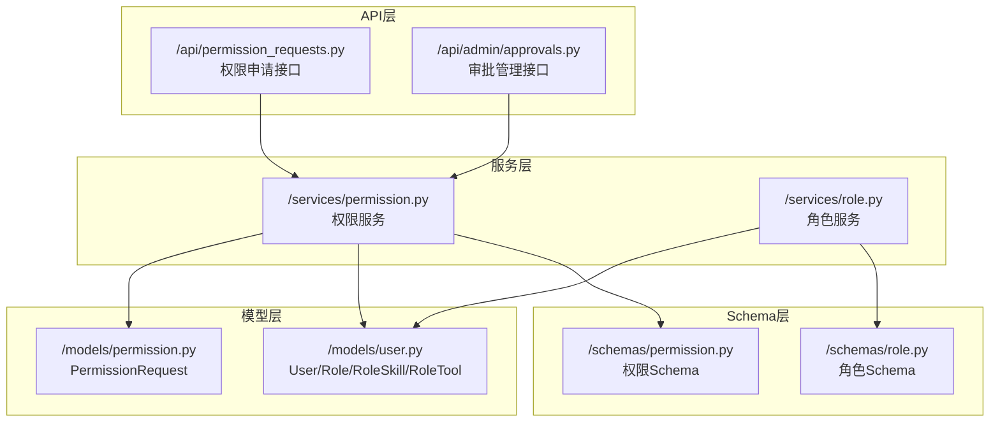
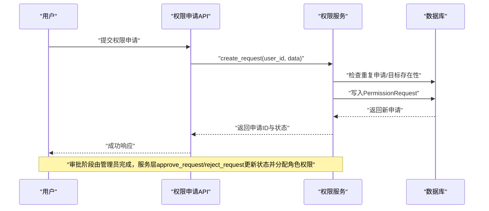
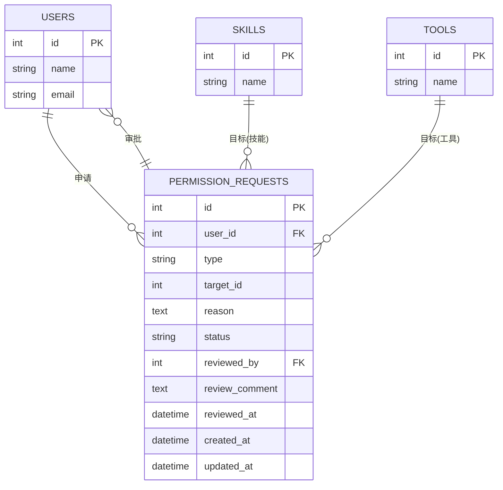
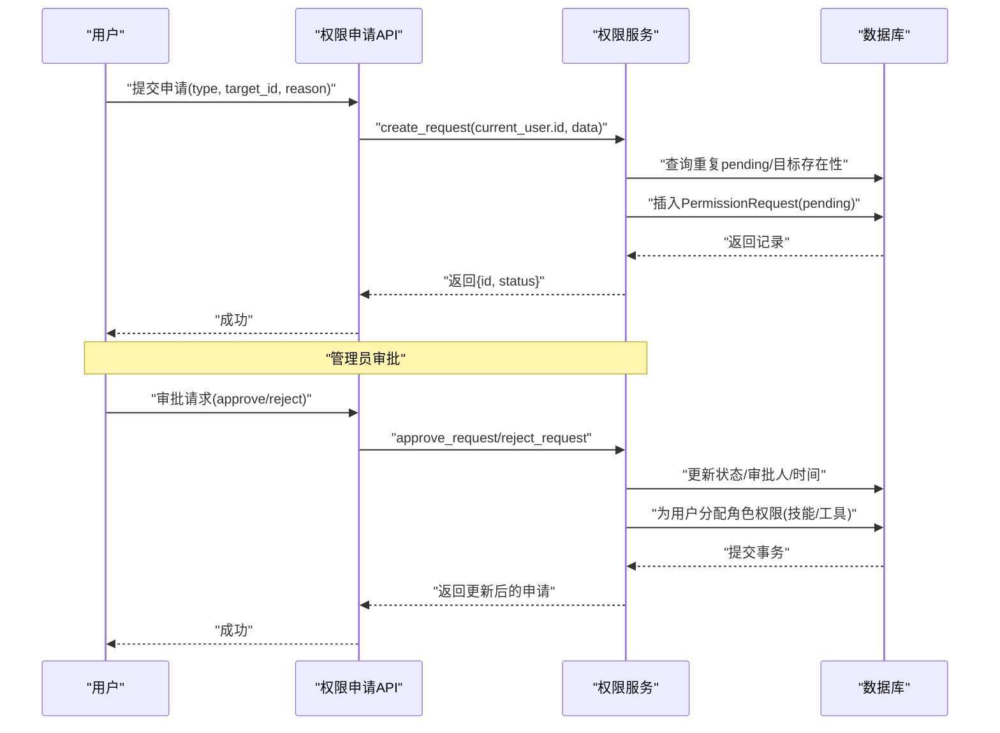
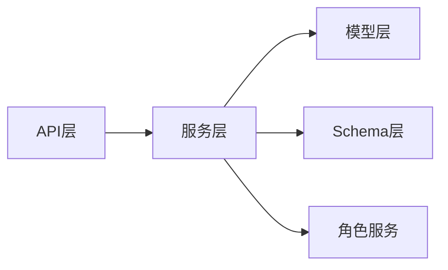

# 权限模型

<cite>
**本文引用的文件**
- [backend/app/models/permission.py](file://backend/app/models/permission.py)
- [backend/app/schemas/permission.py](file://backend/app/schemas/permission.py)
- [backend/app/services/permission.py](file://backend/app/services/permission.py)
- [backend/app/api/permission_requests.py](file://backend/app/api/permission_requests.py)
- [backend/app/models/user.py](file://backend/app/models/user.py)
- [backend/app/schemas/role.py](file://backend/app/schemas/role.py)
- [backend/app/services/role.py](file://backend/app/services/role.py)
- [backend/app/api/admin/approvals.py](file://backend/app/api/admin/approvals.py)
- [backend/app/api/users.py](file://backend/app/api/users.py)
- [backend/app/api/skills.py](file://backend/app/api/skills.py)
- [backend/app/api/tools.py](file://backend/app/api/tools.py)
</cite>

## 目录
1. [引言](#引言)
2. [项目结构](#项目结构)
3. [核心组件](#核心组件)
4. [架构总览](#架构总览)
5. [详细组件分析](#详细组件分析)
6. [依赖关系分析](#依赖关系分析)
7. [性能考虑](#性能考虑)
8. [故障排除指南](#故障排除指南)
9. [结论](#结论)
10. [附录](#附录)

## 引言
本文件系统性梳理ToolHub的权限模型，围绕“权限申请与审批”这一核心业务，详细阐述PermissionRequest模型的设计与实现，涵盖权限类型分类（技能权限、工具权限）、权限状态管理（申请中、已批准、被拒绝、已撤销）、权限范围控制（全局权限、部门权限、个人权限）在当前实现中的边界与扩展点；同时说明权限申请流程相关的字段设计（申请人、审批人、审批状态、审批意见等），以及权限模型与用户、技能、工具模型的关联关系。此外，文档给出权限申请、审批、撤销的完整流程示例与代码实现路径，并讨论权限继承机制、权限组合规则与冲突处理策略。

## 项目结构
ToolHub后端采用分层架构：API路由层负责请求接入与响应封装；服务层承载业务逻辑；模型层定义数据库表结构；Schema层定义数据传输对象。权限相关能力主要分布在以下模块：
- 模型层：PermissionRequest（权限申请记录）、User/Role/RoleSkill/RoleTool（用户-角色-技能-工具关联）
- Schema层：权限申请创建、读取、审批动作、权限校验等数据结构
- 服务层：权限申请创建、查询、撤销、审批、权限校验等核心逻辑
- API层：对外暴露权限申请、我的申请列表、详情、撤销等接口



**图表来源**
- [backend/app/api/permission_requests.py:1-107](file://backend/app/api/permission_requests.py#L1-L107)
- [backend/app/services/permission.py:1-182](file://backend/app/services/permission.py#L1-L182)
- [backend/app/models/permission.py:1-28](file://backend/app/models/permission.py#L1-L28)
- [backend/app/models/user.py:1-116](file://backend/app/models/user.py#L1-L116)
- [backend/app/schemas/permission.py:1-56](file://backend/app/schemas/permission.py#L1-L56)
- [backend/app/schemas/role.py:1-40](file://backend/app/schemas/role.py#L1-L40)
- [backend/app/services/role.py:1-120](file://backend/app/services/role.py#L1-L120)
- [backend/app/api/admin/approvals.py:1-200](file://backend/app/api/admin/approvals.py#L1-L200)

**章节来源**
- [backend/app/api/permission_requests.py:1-107](file://backend/app/api/permission_requests.py#L1-L107)
- [backend/app/services/permission.py:1-182](file://backend/app/services/permission.py#L1-L182)
- [backend/app/models/permission.py:1-28](file://backend/app/models/permission.py#L1-L28)
- [backend/app/models/user.py:1-116](file://backend/app/models/user.py#L1-L116)
- [backend/app/schemas/permission.py:1-56](file://backend/app/schemas/permission.py#L1-L56)
- [backend/app/schemas/role.py:1-40](file://backend/app/schemas/role.py#L1-L40)
- [backend/app/services/role.py:1-120](file://backend/app/services/role.py#L1-L120)

## 核心组件
- PermissionRequest（权限申请记录）：存储申请人的身份、申请类型（技能/工具）、目标ID、申请理由、审批状态、审批人、审批意见与时间戳等关键字段。
- 用户-角色-技能-工具关联：通过User、Role、RoleSkill、RoleTool多对多关系，实现权限的继承与组合。
- 权限服务：提供创建申请、查询我的申请、撤销申请、审批（批准/拒绝）、权限校验等能力。
- 权限Schema：定义创建、读取、审批动作、权限校验等数据结构。

**章节来源**
- [backend/app/models/permission.py:7-28](file://backend/app/models/permission.py#L7-L28)
- [backend/app/models/user.py:23-116](file://backend/app/models/user.py#L23-L116)
- [backend/app/services/permission.py:9-182](file://backend/app/services/permission.py#L9-L182)
- [backend/app/schemas/permission.py:6-56](file://backend/app/schemas/permission.py#L6-L56)

## 架构总览
权限模型以PermissionRequest为核心，贯穿“申请—审批—生效”的闭环。申请阶段由API路由接收请求，服务层进行业务校验与持久化；审批阶段由管理员接口完成，服务层更新状态并按类型为用户授予相应角色权限；最终通过权限校验接口判断用户对某技能或工具的访问权限。



**图表来源**
- [backend/app/api/permission_requests.py:13-25](file://backend/app/api/permission_requests.py#L13-L25)
- [backend/app/services/permission.py:12-44](file://backend/app/services/permission.py#L12-L44)
- [backend/app/models/permission.py:7-28](file://backend/app/models/permission.py#L7-L28)

## 详细组件分析

### 数据模型：PermissionRequest
- 字段设计要点
  - 申请人：user_id 外键关联用户表
  - 申请类型：枚举值“skill”、“tool”
  - 目标ID：指向技能或工具的ID
  - 申请理由：文本字段
  - 状态：枚举值“pending”、“approved”、“rejected”、“cancelled”
  - 审批人：reviewed_by 外键关联用户表
  - 审批意见与时间：review_comment、reviewed_at
  - 时间戳：created_at、updated_at
- 关联关系
  - 与User：一对多（user_id）；与Reviewer：一对一（reviewed_by）
  - 与技能/工具：通过type与target_id间接关联



**图表来源**
- [backend/app/models/permission.py:7-28](file://backend/app/models/permission.py#L7-L28)
- [backend/app/models/user.py:23-98](file://backend/app/models/user.py#L23-L98)

**章节来源**
- [backend/app/models/permission.py:7-28](file://backend/app/models/permission.py#L7-L28)

### 权限类型分类
- 技能权限：type=“skill”，target_id指向技能ID
- 工具权限：type=“tool”，target_id指向工具ID
- 当前实现通过type字段区分目标类型，服务层在创建与审批时分别查询Skill或Tool表进行存在性校验。

**章节来源**
- [backend/app/models/permission.py:12-13](file://backend/app/models/permission.py#L12-L13)
- [backend/app/services/permission.py:25-31](file://backend/app/services/permission.py#L25-L31)

### 权限状态管理
- 状态枚举：pending（申请中）、approved（已批准）、rejected（被拒绝）、cancelled（已撤销）
- 状态流转
  - 创建申请：初始状态为pending
  - 撤销申请：仅pending状态可撤销，置为cancelled
  - 审批：仅pending状态可批准/拒绝，分别置为approved或rejected
- 状态变更由服务层统一维护，API层仅暴露操作入口。

**章节来源**
- [backend/app/models/permission.py:15-19](file://backend/app/models/permission.py#L15-L19)
- [backend/app/services/permission.py:58-70](file://backend/app/services/permission.py#L58-L70)
- [backend/app/services/permission.py:86-96](file://backend/app/services/permission.py#L86-L96)
- [backend/app/services/permission.py:131-142](file://backend/app/services/permission.py#L131-L142)

### 权限范围控制
- 当前实现未显式支持“部门权限”“个人权限”等范围维度
- 权限生效方式：审批通过后，服务层为用户分配对应的角色权限（技能或工具），若用户无角色则自动创建默认角色
- 扩展建议：可在Role或RoleSkill/RoleTool上增加scope字段（如global、department、personal），并在权限校验时结合用户部门信息进行判定

**章节来源**
- [backend/app/services/permission.py:98-124](file://backend/app/services/permission.py#L98-L124)
- [backend/app/services/permission.py:167-178](file://backend/app/services/permission.py#L167-L178)

### 权限申请流程字段设计
- 申请人信息：user_id（当前登录用户）
- 申请类型与目标：type、target_id
- 申请理由：reason
- 审批状态：status（默认pending）
- 审批人信息：reviewed_by、review_comment、reviewed_at
- 时间戳：created_at、updated_at

**章节来源**
- [backend/app/models/permission.py:10-24](file://backend/app/models/permission.py#L10-L24)
- [backend/app/schemas/permission.py:6-28](file://backend/app/schemas/permission.py#L6-L28)

### 权限模型与用户、技能、工具的关联关系
- 用户与权限申请：User与PermissionRequest为一对多（user_id）
- 用户与角色：User与Role通过user_roles中间表多对多
- 角色与技能/工具：Role与Skill通过role_skills中间表多对多；Role与Tool通过role_tools中间表多对多
- 权限生效：审批通过后，服务层将技能ID或工具ID添加到用户对应角色的role_skills或role_tools中

```mermaid
classDiagram
class User {
+int id
+string name
+Role[] roles
+PermissionRequest[] permission_requests
}
class Role {
+int id
+string name
+Skill[] skills
+Tool[] tools
}
class RoleSkill {
+int id
+int role_id
+int skill_id
}
class RoleTool {
+int id
+int role_id
+int tool_id
}
class Skill {
+int id
+string name
}
class Tool {
+int id
+string name
}
class PermissionRequest {
+int id
+int user_id
+string type
+int target_id
+string status
}
User "1" -- "many" PermissionRequest : "申请"
User "many" -- "many" Role : "拥有"
Role "many" -- "many" Skill : "具备"
Role "many" -- "many" Tool : "具备"
RoleSkill : "role_id" --> Role : "外键"
RoleSkill : "skill_id" --> Skill : "外键"
RoleTool : "role_id" --> Role : "外键"
RoleTool : "tool_id" --> Tool : "外键"
```

**图表来源**
- [backend/app/models/user.py:23-116](file://backend/app/models/user.py#L23-L116)
- [backend/app/models/permission.py:7-28](file://backend/app/models/permission.py#L7-L28)

**章节来源**
- [backend/app/models/user.py:23-116](file://backend/app/models/user.py#L23-L116)
- [backend/app/models/permission.py:26-27](file://backend/app/models/permission.py#L26-L27)

### 权限继承机制、组合规则与冲突处理
- 继承机制：用户通过角色获得技能/工具权限，角色继承自用户，形成“用户→角色→权限”的层级
- 组合规则：用户可拥有多个角色，从而组合多个技能/工具权限；服务层在审批通过时优先检查用户是否已具备该技能/工具，避免重复添加
- 冲突处理：当前实现未内置冲突检测逻辑；若同一目标被多次申请且状态不同，服务层通过唯一pending约束避免重复申请；建议在扩展范围控制时引入冲突仲裁策略（如优先级、有效期、覆盖规则）

**章节来源**
- [backend/app/services/permission.py:100-124](file://backend/app/services/permission.py#L100-L124)
- [backend/app/services/permission.py:167-178](file://backend/app/services/permission.py#L167-L178)

### 权限申请、审批、撤销流程示例与代码实现
- 提交权限申请
  - 路由：POST /api/permission_requests/
  - 服务：create_request(user_id, data)
  - 校验：不允许重复pending申请；目标必须存在
  - 结果：返回申请ID与状态
- 我的申请列表
  - 路由：GET /api/permission_requests/
  - 服务：get_my_requests(user_id, page, page_size)
  - 结果：返回分页列表，包含目标名称、状态、审批意见等
- 申请详情
  - 路由：GET /api/permission_requests/{request_id}
  - 服务：get_my_requests + 查询目标名称
- 撤销申请
  - 路由：DELETE /api/permission_requests/{request_id}
  - 服务：cancel_request(request_id, user_id)
  - 校验：仅pending状态可撤销
- 审批（管理员）
  - 路由：GET/PUT /api/admin/approvals/（示例）
  - 服务：approve_request/reject_request(request_id, reviewer_id, comment)
  - 生效：审批通过后为用户分配角色权限（技能或工具）
- 权限校验
  - 路由：GET /api/v1/verify/（示例）
  - 服务：verify_permission(user_id, type, target_name)
  - 结果：返回allowed与原因



**图表来源**
- [backend/app/api/permission_requests.py:13-25](file://backend/app/api/permission_requests.py#L13-L25)
- [backend/app/services/permission.py:12-44](file://backend/app/services/permission.py#L12-L44)
- [backend/app/services/permission.py:86-144](file://backend/app/services/permission.py#L86-L144)

**章节来源**
- [backend/app/api/permission_requests.py:13-107](file://backend/app/api/permission_requests.py#L13-L107)
- [backend/app/services/permission.py:12-144](file://backend/app/services/permission.py#L12-L144)

## 依赖关系分析
- API层依赖服务层：权限申请、我的申请、撤销等接口均调用权限服务
- 服务层依赖模型层：权限申请、用户、技能、工具、角色等模型
- 权限服务依赖角色服务：在缺少角色时自动创建默认角色
- Schema层为API与服务层提供数据契约，确保输入输出一致



**图表来源**
- [backend/app/api/permission_requests.py:1-107](file://backend/app/api/permission_requests.py#L1-L107)
- [backend/app/services/permission.py:1-182](file://backend/app/services/permission.py#L1-L182)
- [backend/app/models/permission.py:1-28](file://backend/app/models/permission.py#L1-L28)
- [backend/app/models/user.py:1-116](file://backend/app/models/user.py#L1-L116)
- [backend/app/schemas/permission.py:1-56](file://backend/app/schemas/permission.py#L1-L56)
- [backend/app/schemas/role.py:1-40](file://backend/app/schemas/role.py#L1-L40)
- [backend/app/services/role.py:1-120](file://backend/app/services/role.py#L1-L120)

**章节来源**
- [backend/app/api/permission_requests.py:1-107](file://backend/app/api/permission_requests.py#L1-L107)
- [backend/app/services/permission.py:1-182](file://backend/app/services/permission.py#L1-L182)
- [backend/app/models/permission.py:1-28](file://backend/app/models/permission.py#L1-L28)
- [backend/app/models/user.py:1-116](file://backend/app/models/user.py#L1-L116)
- [backend/app/schemas/permission.py:1-56](file://backend/app/schemas/permission.py#L1-L56)
- [backend/app/schemas/role.py:1-40](file://backend/app/schemas/role.py#L1-L40)
- [backend/app/services/role.py:1-120](file://backend/app/services/role.py#L1-L120)

## 性能考虑
- 查询优化：权限申请列表按创建时间倒序分页查询，建议在user_id、status、created_at建立索引
- 并发控制：审批状态更新需使用原子操作，避免竞态条件；必要时引入乐观锁或悲观锁
- 缓存策略：热点技能/工具的权限校验结果可缓存，结合用户角色变化失效
- 批量操作：批量审批或撤销时应分批提交，避免长事务阻塞

## 故障排除指南
- 重复申请：当存在pending状态的相同目标申请时，服务层会抛出异常；前端应提示用户等待或撤销后再试
- 目标不存在：申请的目标（技能/工具）不存在时，服务层会抛出异常；请确认目标ID正确
- 非pending不可撤销：仅pending状态可撤销，否则提示错误；请确认申请状态
- 非pending不可审批：仅pending状态可批准/拒绝，否则提示错误；请确认申请状态
- 用户无效或非活跃：权限校验时若用户不存在或状态非active，返回不允许；请检查用户状态

**章节来源**
- [backend/app/services/permission.py:15-31](file://backend/app/services/permission.py#L15-L31)
- [backend/app/services/permission.py:58-69](file://backend/app/services/permission.py#L58-L69)
- [backend/app/services/permission.py:86-96](file://backend/app/services/permission.py#L86-L96)
- [backend/app/services/permission.py:131-142](file://backend/app/services/permission.py#L131-L142)
- [backend/app/services/permission.py:147-164](file://backend/app/services/permission.py#L147-L164)

## 结论
ToolHub的权限模型以PermissionRequest为核心，实现了“申请—审批—生效”的闭环，通过用户-角色-技能-工具的多对多关系实现权限继承与组合。当前实现聚焦于技能与工具两类权限，状态管理完善，但尚未引入部门/个人等范围控制。建议后续扩展范围维度与冲突仲裁策略，并在性能与并发方面持续优化。

## 附录
- 相关接口与实现路径
  - 权限申请：POST /api/permission_requests/ → 服务：create_request
  - 我的申请：GET /api/permission_requests/ → 服务：get_my_requests
  - 申请详情：GET /api/permission_requests/{request_id}
  - 撤销申请：DELETE /api/permission_requests/{request_id} → 服务：cancel_request
  - 审批接口：GET/PUT /api/admin/approvals/ → 服务：approve_request/reject_request
  - 权限校验：GET /api/v1/verify/ → 服务：verify_permission

**章节来源**
- [backend/app/api/permission_requests.py:13-107](file://backend/app/api/permission_requests.py#L13-L107)
- [backend/app/services/permission.py:12-144](file://backend/app/services/permission.py#L12-L144)
- [backend/app/api/admin/approvals.py:1-200](file://backend/app/api/admin/approvals.py#L1-L200)