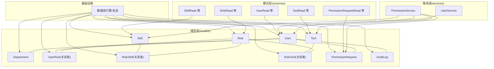
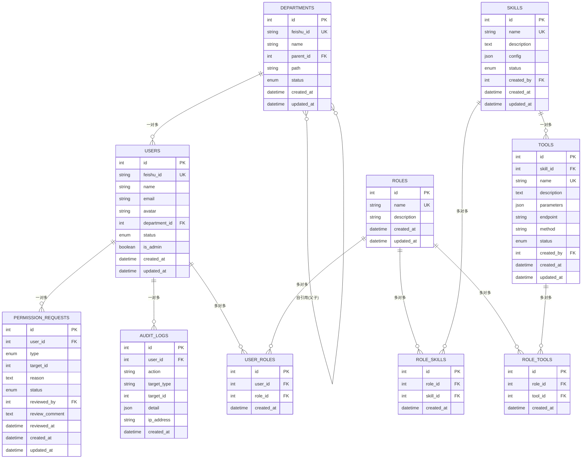
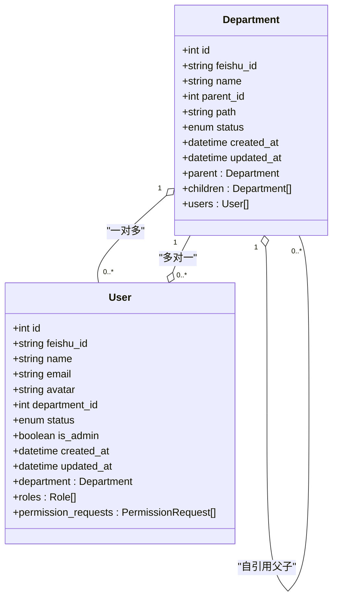
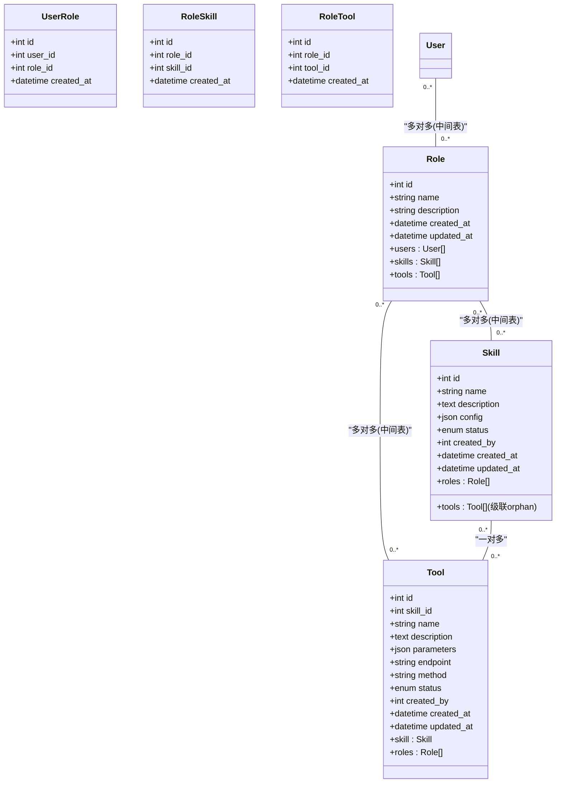
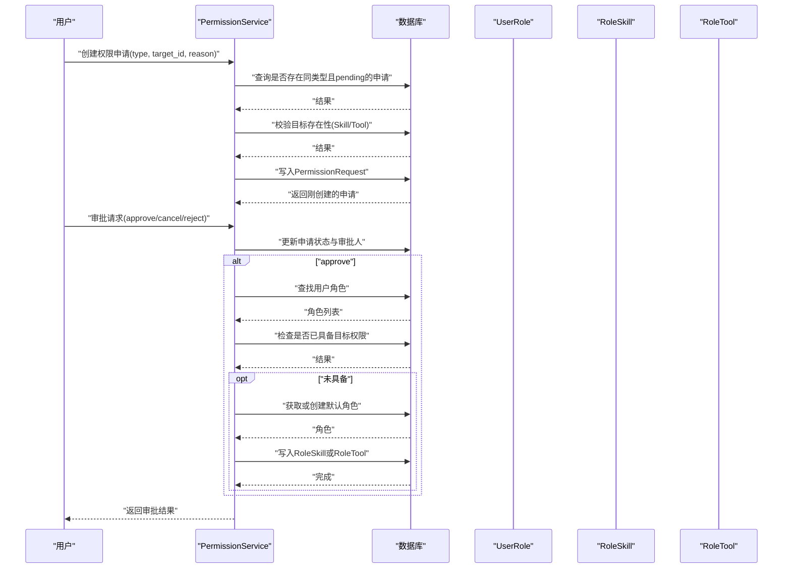
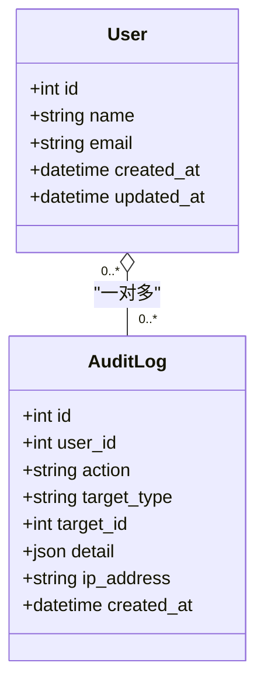
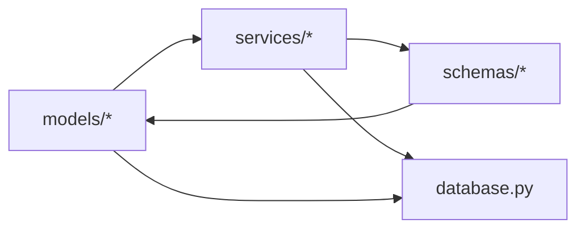

# 模型关系设计

<cite>
**本文引用的文件**
- [backend/app/models/__init__.py](file://backend/app/models/__init__.py)
- [backend/app/models/user.py](file://backend/app/models/user.py)
- [backend/app/models/permission.py](file://backend/app/models/permission.py)
- [backend/app/models/audit.py](file://backend/app/models/audit.py)
- [backend/app/schemas/user.py](file://backend/app/schemas/user.py)
- [backend/app/schemas/permission.py](file://backend/app/schemas/permission.py)
- [backend/app/schemas/role.py](file://backend/app/schemas/role.py)
- [backend/app/schemas/skill.py](file://backend/app/schemas/skill.py)
- [backend/app/schemas/tool.py](file://backend/app/schemas/tool.py)
- [backend/app/services/user.py](file://backend/app/services/user.py)
- [backend/app/services/permission.py](file://backend/app/services/permission.py)
- [backend/app/database.py](file://backend/app/database.py)
- [backend/alembic/versions/5fb1c261fa23_initial_tables.py](file://backend/alembic/versions/5fb1c261fa23_initial_tables.py)
</cite>

## 目录
1. [简介](#简介)
2. [项目结构](#项目结构)
3. [核心组件](#核心组件)
4. [架构总览](#架构总览)
5. [详细组件分析](#详细组件分析)
6. [依赖分析](#依赖分析)
7. [性能考虑](#性能考虑)
8. [故障排查指南](#故障排查指南)
9. [结论](#结论)
10. [附录](#附录)

## 简介
本文件系统性梳理ToolHub的数据模型关系设计，覆盖一对一、一对多、多对多关系的实现方式；详述外键约束与级联操作（删除/更新）；解释关系表的设计与依赖关系；给出查询优化策略、N+1问题的解决方案；结合业务场景（权限继承、组织架构、技能-工具关联）说明模型关系的应用，并提供复杂查询示例、关系图谱与性能优化建议。

## 项目结构
后端采用SQLAlchemy ORM建模，模型集中于models目录，配合Alembic进行数据库迁移；服务层封装业务逻辑；模式层（schemas）用于API输入输出；数据库连接与会话管理位于database模块。

图表来源
- [backend/app/models/user.py:7-116](file://backend/app/models/user.py#L7-L116)
- [backend/app/models/permission.py:7-28](file://backend/app/models/permission.py#L7-L28)
- [backend/app/models/audit.py:6-17](file://backend/app/models/audit.py#L6-L17)
- [backend/app/services/user.py:8-86](file://backend/app/services/user.py#L8-L86)
- [backend/app/services/permission.py:9-182](file://backend/app/services/permission.py#L9-L182)
- [backend/app/schemas/user.py:6-67](file://backend/app/schemas/user.py#L6-L67)
- [backend/app/schemas/permission.py:6-56](file://backend/app/schemas/permission.py#L6-L56)
- [backend/app/schemas/role.py:6-43](file://backend/app/schemas/role.py#L6-L43)
- [backend/app/schemas/skill.py:6-45](file://backend/app/schemas/skill.py#L6-L45)
- [backend/app/schemas/tool.py:6-51](file://backend/app/schemas/tool.py#L6-L51)
- [backend/app/database.py:1-25](file://backend/app/database.py#L1-L25)

章节来源
- [backend/app/models/__init__.py:1-17](file://backend/app/models/__init__.py#L1-L17)
- [backend/app/database.py:1-25](file://backend/app/database.py#L1-L25)

## 核心组件
- 组织架构：Department（部门）与User（用户）之间为“一对多”关系，Department.parent/children支持自引用树形结构。
- 用户角色：User与Role通过中间表UserRole建立“多对多”关系；Role再与Skill/Tool分别通过RoleSkill/RoleTool建立“多对多”关系。
- 技能-工具：Skill与Tool之间为“一对多”，Tool.skill_id外键指向Skill；同时Role通过RoleTool与Tool建立“多对多”。
- 权限申请：PermissionRequest记录用户对Skill/Tool的申请与审批状态，与User形成“一对多”。
- 审计日志：AuditLog记录用户操作行为，与User形成“一对多”。

章节来源
- [backend/app/models/user.py:7-116](file://backend/app/models/user.py#L7-L116)
- [backend/app/models/permission.py:7-28](file://backend/app/models/permission.py#L7-L28)
- [backend/app/models/audit.py:6-17](file://backend/app/models/audit.py#L6-L17)

## 架构总览
下图展示模型间的主要关系与外键约束，以及级联删除策略：

图表来源
- [backend/alembic/versions/5fb1c261fa23_initial_tables.py:21-142](file://backend/alembic/versions/5fb1c261fa23_initial_tables.py#L21-L142)
- [backend/app/models/user.py:7-116](file://backend/app/models/user.py#L7-L116)
- [backend/app/models/permission.py:7-28](file://backend/app/models/permission.py#L7-L28)
- [backend/app/models/audit.py:6-17](file://backend/app/models/audit.py#L6-L17)

## 详细组件分析

### 部门与用户：组织架构树
- 关系：Department.parent/children（自引用）；Department.users（一对多）；User.department（多对一）。
- 外键约束：部门表的parent_id引用自身id；用户表的department_id引用部门id。
- 级联操作：未见显式onupdate/ondelete配置，遵循数据库默认行为。
- 查询优化：为feishu_id与name建立索引；路径path可按需建立索引以支持层级查询。
- N+1问题：在读取用户列表时应使用select_inload/join加载department，避免逐个访问department属性触发额外查询。

图表来源
- [backend/app/models/user.py:7-40](file://backend/app/models/user.py#L7-L40)

章节来源
- [backend/app/models/user.py:7-40](file://backend/app/models/user.py#L7-L40)
- [backend/alembic/versions/5fb1c261fa23_initial_tables.py:21-57](file://backend/alembic/versions/5fb1c261fa23_initial_tables.py#L21-L57)

### 角色、用户、技能、工具：权限继承与技能-工具关联
- 多对多关系：
  - User与Role：通过UserRole中间表关联。
  - Role与Skill：通过RoleSkill中间表关联。
  - Role与Tool：通过RoleTool中间表关联。
- 一对多关系：
  - Skill与Tool：Skill.id → Tool.skill_id。
- 外键与级联：
  - 中间表的user_id、role_id、skill_id、tool_id均设置ondelete=CASCADE，确保删除主实体时自动清理关联。
- 查询优化：
  - 在获取用户权限时，应一次性加载其所有角色、角色下的技能与工具，避免N+1。
  - 对于角色-技能/工具的批量赋权，使用批量插入中间表条目。
- N+1问题：
  - 在UserService.get_user_permissions中，应预先join加载user.roles/skill/tools，或使用selectinload。

图表来源
- [backend/app/models/user.py:42-116](file://backend/app/models/user.py#L42-L116)

章节来源
- [backend/app/models/user.py:42-116](file://backend/app/models/user.py#L42-L116)
- [backend/alembic/versions/5fb1c261fa23_initial_tables.py:99-142](file://backend/alembic/versions/5fb1c261fa23_initial_tables.py#L99-L142)

### 权限申请与审批：流程与权限下发
- 关系：PermissionRequest.user_id → User.id；PermissionRequest.reviewed_by → User.id；type/target_id标识目标（Skill/Tool）。
- 级联：PermissionRequest.user_id设置ondelete=CASCADE，保证用户删除时自动清理其申请记录。
- 业务流程：
  - 创建申请：校验重复与目标存在性。
  - 审批通过：为用户分配对应技能或工具权限（优先复用现有角色，否则创建默认角色并写入中间表）。
  - 权限验证：遍历用户角色下的技能/工具集合进行匹配。
- 查询优化：
  - 批量查询用户的角色、技能、工具集合，避免逐条查询。
  - 审批时先检查是否已存在目标权限，避免重复写入。

图表来源
- [backend/app/services/permission.py:9-182](file://backend/app/services/permission.py#L9-L182)
- [backend/app/models/permission.py:7-28](file://backend/app/models/permission.py#L7-L28)
- [backend/app/models/user.py:56-116](file://backend/app/models/user.py#L56-L116)

章节来源
- [backend/app/services/permission.py:9-182](file://backend/app/services/permission.py#L9-L182)
- [backend/app/models/permission.py:7-28](file://backend/app/models/permission.py#L7-L28)

### 审计日志：操作追踪
- 关系：AuditLog.user_id → User.id；记录操作类型、目标类型与目标ID、详情与IP。
- 应用：可用于权限变更审计、用户登录登出追踪、资源修改记录等。

图表来源
- [backend/app/models/audit.py:6-17](file://backend/app/models/audit.py#L6-L17)

章节来源
- [backend/app/models/audit.py:6-17](file://backend/app/models/audit.py#L6-L17)

### 复杂查询示例与最佳实践
- 示例1：获取用户的所有可访问工具名（去重）
  - 步骤：从User开始，join其roles，再join role.tools，过滤tool.status='active'，收集name并去重。
  - 参考路径：[backend/app/services/user.py:66-82](file://backend/app/services/user.py#L66-L82)
- 示例2：统计每个技能的工具数量
  - 步骤：按Skill分组统计Tools数量，注意只统计status='active'的工具。
  - 参考路径：[backend/app/schemas/skill.py:40-45](file://backend/app/schemas/skill.py#L40-L45)
- 示例3：查询某部门及其子部门的所有用户
  - 步骤：递归构建部门路径或使用CTE，然后筛选users.department_id在该集合内。
  - 参考路径：[backend/app/models/user.py:7-21](file://backend/app/models/user.py#L7-L21)

## 依赖分析
- 模块耦合：
  - models层仅依赖Base与SQLAlchemy类型；service层依赖models与schemas；schemas用于API输入输出转换。
- 外部依赖：
  - SQLAlchemy ORM与Alembic迁移工具；数据库连接由settings配置驱动。
- 潜在循环依赖：
  - 模型与服务之间通过中间表解耦，未发现循环导入迹象。
- 接口契约：
  - 中间表统一采用ondelete=CASCADE，确保数据一致性；User与Role的多对多通过UserRole承载。

图表来源
- [backend/app/models/__init__.py:1-17](file://backend/app/models/__init__.py#L1-L17)
- [backend/app/services/user.py:1-86](file://backend/app/services/user.py#L1-L86)
- [backend/app/services/permission.py:1-182](file://backend/app/services/permission.py#L1-L182)
- [backend/app/database.py:1-25](file://backend/app/database.py#L1-L25)

章节来源
- [backend/app/models/__init__.py:1-17](file://backend/app/models/__init__.py#L1-L17)
- [backend/app/database.py:1-25](file://backend/app/database.py#L1-L25)

## 性能考虑
- 索引策略：
  - 为唯一字段（如users.feishu_id、departments.feishu_id、skills.name、tools.name）建立唯一索引。
  - 为常用过滤字段（如users.department_id、permission_requests.user_id、audit_logs.user_id）建立普通索引。
- 查询优化：
  - 使用selectinload/joinedload预加载关联对象，避免N+1问题。
  - 对批量写入中间表（UserRole/RoleSkill/RoleTool）使用bulk_insert_mappings提升效率。
- 级联与删除：
  - 中间表已启用CASCASE DELETE，确保删除主实体时自动清理关联，减少冗余数据。
- 连接池与会话：
  - 使用pool_pre_ping与pool_recycle提升连接稳定性；按需开启echo调试。

章节来源
- [backend/alembic/versions/5fb1c261fa23_initial_tables.py:33-132](file://backend/alembic/versions/5fb1c261fa23_initial_tables.py#L33-L132)
- [backend/app/database.py:5-12](file://backend/app/database.py#L5-L12)

## 故障排查指南
- 常见错误与定位：
  - “用户不存在”：在更新角色、状态或验证权限前先校验User存在性。
    - 参考路径：[backend/app/services/user.py:37-40](file://backend/app/services/user.py#L37-L40)
  - “重复申请”：创建权限申请前检查同一用户、同一目标、同一类型的pending申请。
    - 参考路径：[backend/app/services/permission.py:15-24](file://backend/app/services/permission.py#L15-L24)
  - “目标不存在”：创建申请时校验Skill/Tool存在性。
    - 参考路径：[backend/app/services/permission.py:25-32](file://backend/app/services/permission.py#L25-L32)
  - “非pending不可取消/审批”：在取消或审批前检查状态。
    - 参考路径：[backend/app/services/permission.py:58-69](file://backend/app/services/permission.py#L58-L69)
- 日志与审计：
  - 使用AuditLog记录关键操作，便于回溯与问题定位。
    - 参考路径：[backend/app/models/audit.py:6-17](file://backend/app/models/audit.py#L6-L17)

章节来源
- [backend/app/services/user.py:35-63](file://backend/app/services/user.py#L35-L63)
- [backend/app/services/permission.py:12-43](file://backend/app/services/permission.py#L12-L43)
- [backend/app/models/audit.py:6-17](file://backend/app/models/audit.py#L6-L17)

## 结论
ToolHub的模型关系设计清晰地体现了“组织架构—角色—权限”的三层结构：Department/User支撑组织，Role承载权限集合，Skill/Tool作为最小权限单元。通过中间表实现多对多关系，并在关键外键上启用CASCASE DELETE，保障了数据一致性与可维护性。结合预加载与批量写入等优化手段，可在保证功能正确性的前提下显著提升查询与写入性能。建议在后续迭代中进一步完善索引策略与审计粒度，并持续监控N+1问题的回归。

## 附录
- 模式层与模型层映射：
  - UserRead/UserBrief等模式类用于API输出，内部通过from_attributes映射模型字段。
  - 参考路径：[backend/app/schemas/user.py:12-67](file://backend/app/schemas/user.py#L12-L67)
- 复杂查询建议：
  - 获取用户可访问技能/工具清单：使用join+distinct或set去重。
  - 统计技能工具数：groupby+count，注意过滤有效状态。
  - 部门树查询：递归CTE或路径like匹配，视数据库方言而定。