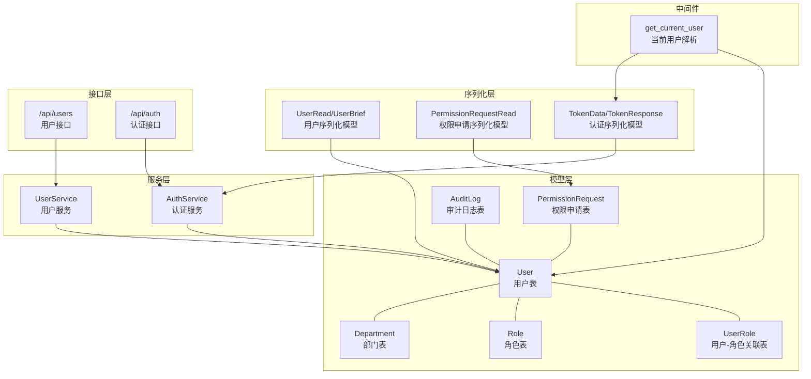
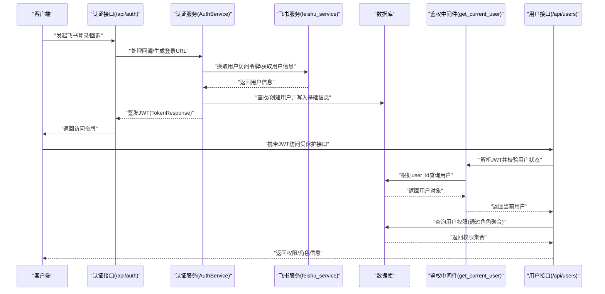
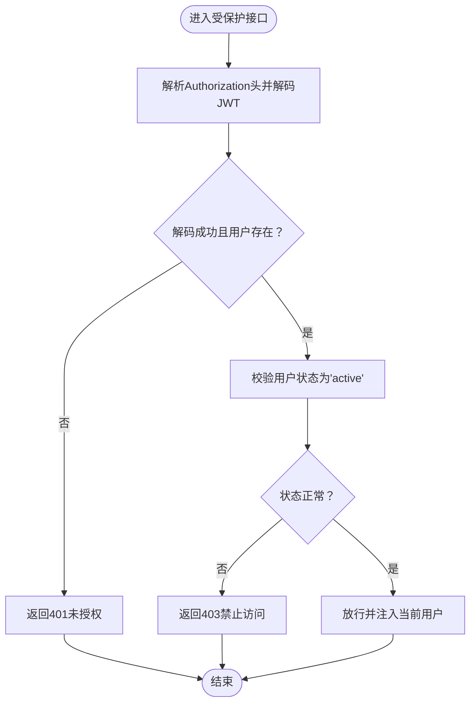
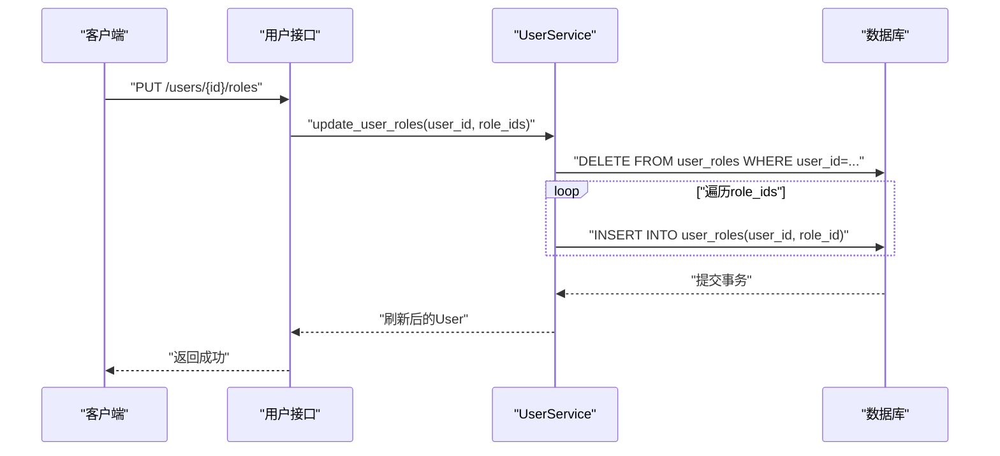
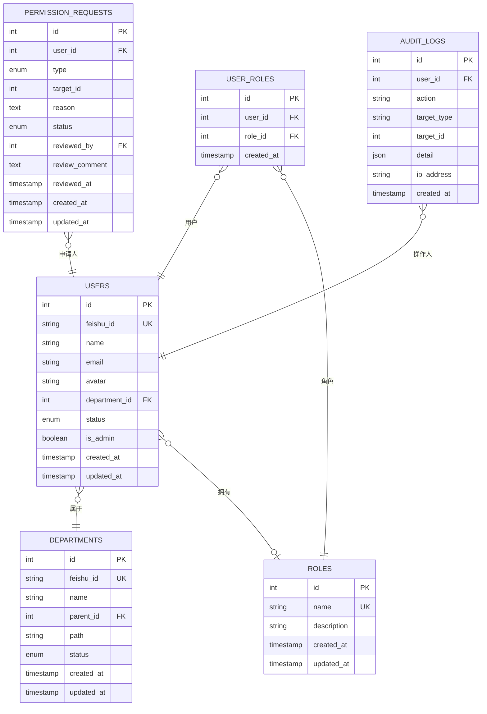

# 用户模型

<cite>
**本文引用的文件**
- [backend/app/models/user.py](file://backend/app/models/user.py)
- [backend/app/schemas/user.py](file://backend/app/schemas/user.py)
- [backend/app/services/user.py](file://backend/app/services/user.py)
- [backend/app/api/users.py](file://backend/app/api/users.py)
- [backend/app/models/permission.py](file://backend/app/models/permission.py)
- [backend/app/models/audit.py](file://backend/app/models/audit.py)
- [backend/app/middleware/auth.py](file://backend/app/middleware/auth.py)
- [backend/app/api/auth.py](file://backend/app/api/auth.py)
- [backend/app/services/auth.py](file://backend/app/services/auth.py)
- [backend/app/schemas/auth.py](file://backend/app/schemas/auth.py)
- [backend/app/models/__init__.py](file://backend/app/models/__init__.py)
</cite>

## 目录
1. [简介](#简介)
2. [项目结构](#项目结构)
3. [核心组件](#核心组件)
4. [架构总览](#架构总览)
5. [详细组件分析](#详细组件分析)
6. [依赖分析](#依赖分析)
7. [性能考虑](#性能考虑)
8. [故障排查指南](#故障排查指南)
9. [结论](#结论)
10. [附录](#附录)

## 简介
本文件系统性梳理ToolHub中的用户模型设计与实现，覆盖以下方面：
- 用户基本信息字段（用户名、邮箱、头像、部门等）
- 认证相关字段与流程（飞书ID、JWT令牌、登录态校验）
- 状态管理字段（激活/锁定状态、管理员标识）
- 用户与其他模型的关系（角色、权限申请、审计日志）
- 用户生命周期管理（创建、查询、更新、删除）
- 序列化处理与权限验证机制
- CRUD操作示例与最佳实践

## 项目结构
用户模型位于后端Python应用中，采用“模型-序列化-服务-接口-中间件”的分层组织方式：
- 模型层：定义数据库表结构及关系
- 序列化层：Pydantic模型用于API输入输出
- 服务层：封装业务逻辑（查询、更新、权限聚合）
- 接口层：FastAPI路由暴露REST接口
- 中间件层：鉴权与权限控制

图表来源
- [backend/app/models/user.py:23-40](file://backend/app/models/user.py#L23-L40)
- [backend/app/models/permission.py:7-27](file://backend/app/models/permission.py#L7-L27)
- [backend/app/models/audit.py:6-16](file://backend/app/models/audit.py#L6-L16)
- [backend/app/schemas/user.py:27-43](file://backend/app/schemas/user.py#L27-L43)
- [backend/app/schemas/permission.py:12-28](file://backend/app/schemas/permission.py#L12-L28)
- [backend/app/schemas/auth.py:5-16](file://backend/app/schemas/auth.py#L5-L16)
- [backend/app/services/user.py:8-85](file://backend/app/services/user.py#L8-L85)
- [backend/app/services/auth.py:10-121](file://backend/app/services/auth.py#L10-L121)
- [backend/app/api/users.py:1-29](file://backend/app/api/users.py#L1-L29)
- [backend/app/api/auth.py:1-58](file://backend/app/api/auth.py#L1-L58)
- [backend/app/middleware/auth.py:12-33](file://backend/app/middleware/auth.py#L12-L33)

章节来源
- [backend/app/models/__init__.py:1-17](file://backend/app/models/__init__.py#L1-L17)

## 核心组件
- 用户模型（User）：承载用户基本信息、状态、管理员标识以及与部门、角色、权限申请的关联
- 部门模型（Department）：支持树形结构与状态管理
- 角色模型（Role）：角色与技能、工具的多对多关系
- 用户-角色关联（UserRole）：维护用户与角色的多对多映射
- 权限申请模型（PermissionRequest）：记录用户对技能/工具的申请与审批
- 审计日志模型（AuditLog）：记录用户相关的关键操作
- 用户序列化模型（UserRead/UserBrief）：用于API响应
- 认证序列化模型（TokenData/TokenResponse）：用于JWT载荷与返回体
- 用户服务（UserService）：提供列表、详情、角色更新、状态更新、权限聚合等能力
- 认证服务（AuthService）：飞书登录、开发模式登录、JWT签发
- 鉴权中间件（get_current_user）：基于JWT解析当前用户并校验状态

章节来源
- [backend/app/models/user.py:23-40](file://backend/app/models/user.py#L23-L40)
- [backend/app/schemas/user.py:27-43](file://backend/app/schemas/user.py#L27-L43)
- [backend/app/services/user.py:8-85](file://backend/app/services/user.py#L8-L85)
- [backend/app/middleware/auth.py:12-33](file://backend/app/middleware/auth.py#L12-L33)

## 架构总览
用户模型贯穿认证、授权与资源访问的全链路。下图展示从认证到权限查询的关键交互。

图表来源
- [backend/app/api/auth.py:13-27](file://backend/app/api/auth.py#L13-L27)
- [backend/app/services/auth.py:18-77](file://backend/app/services/auth.py#L18-L77)
- [backend/app/middleware/auth.py:12-33](file://backend/app/middleware/auth.py#L12-L33)
- [backend/app/api/users.py:12-28](file://backend/app/api/users.py#L12-L28)
- [backend/app/services/user.py:66-82](file://backend/app/services/user.py#L66-L82)

## 详细组件分析

### 数据模型与字段定义
- 用户表（users）
  - 字段
    - id：主键，自增整数
    - feishu_id：字符串，唯一索引，存储飞书用户ID
    - name：字符串，非空，用户名
    - email：字符串，可空，邮箱
    - avatar：字符串，可空，头像URL
    - department_id：外键，指向部门表
    - status：枚举，取值"active"/"inactive"，默认"active"
    - is_admin：布尔，默认False
    - created_at/updated_at：时间戳
  - 关系
    - 与部门：一对多（部门.users）
    - 与角色：多对多（通过user_roles关联）
    - 与权限申请：一对多（PermissionRequest.user）

- 部门表（departments）
  - 字段
    - id：主键，自增整数
    - feishu_id：字符串，唯一索引，飞书部门ID
    - name：字符串，非空
    - parent_id：外键，自引用（树形结构）
    - path：字符串，层级路径
    - status：枚举，取值"active"/"inactive"，默认"active"
    - created_at/updated_at：时间戳
  - 关系
    - 自引用父子关系（parent/children）
    - 与用户：一对多（users）

- 角色表（roles）
  - 字段
    - id/name/description：主键、名称、描述
    - created_at/updated_at：时间戳
  - 关系
    - 与用户：多对多（user_roles）
    - 与技能/工具：多对多（role_skills/role_tools）

- 用户-角色关联（user_roles）
  - 字段
    - id/user_id/role_id/created_at：主键、用户ID、角色ID、创建时间
  - 约束
    - 外键级联删除

- 权限申请表（permission_requests）
  - 字段
    - id/user_id/type/target_id/reason/status/reviewed_by/review_comment/reviewed_at/created_at/updated_at
  - 关系
    - 与用户：多对一（user）
    - 与用户：多对一（reviewer）

- 审计日志表（audit_logs）
  - 字段
    - id/user_id/action/target_type/target_id/detail/ip_address/created_at
  - 关系
    - 与用户：多对一（user）

章节来源
- [backend/app/models/user.py:23-40](file://backend/app/models/user.py#L23-L40)
- [backend/app/models/user.py:7-21](file://backend/app/models/user.py#L7-L21)
- [backend/app/models/user.py:42-54](file://backend/app/models/user.py#L42-L54)
- [backend/app/models/user.py:56-63](file://backend/app/models/user.py#L56-L63)
- [backend/app/models/permission.py:7-27](file://backend/app/models/permission.py#L7-L27)
- [backend/app/models/audit.py:6-16](file://backend/app/models/audit.py#L6-L16)

### 序列化模型与默认值
- 用户序列化
  - UserRead：包含id、feishu_id、department_id、department_name、status、is_admin、created_at、roles等；默认status为"active"、is_admin为False
  - UserBrief：包含id、name、email、avatar
  - DepartmentRead/Tree：包含部门基本信息与children树结构
- 认证序列化
  - TokenData：包含user_id、is_admin
  - TokenResponse：包含access_token、token_type、user_id、name、is_admin
- 权限申请序列化
  - PermissionRequestRead：包含申请详情、状态、审批人信息、时间戳等

章节来源
- [backend/app/schemas/user.py:27-43](file://backend/app/schemas/user.py#L27-L43)
- [backend/app/schemas/user.py:6-24](file://backend/app/schemas/user.py#L6-L24)
- [backend/app/schemas/auth.py:5-16](file://backend/app/schemas/auth.py#L5-L16)
- [backend/app/schemas/permission.py:12-28](file://backend/app/schemas/permission.py#L12-L28)

### 权限验证机制
- 当前用户解析
  - 中间件get_current_user从Authorization头解析JWT，解码TokenData，查询用户并校验状态为"active"
- 管理员权限
  - require_admin中间件在get_current_user基础上进一步检查is_admin
- 用户权限聚合
  - UserService.get_user_permissions通过用户的角色集合，聚合其具备的技能名与工具名（仅统计状态为"active"的条目）

图表来源
- [backend/app/middleware/auth.py:12-33](file://backend/app/middleware/auth.py#L12-L33)

章节来源
- [backend/app/middleware/auth.py:12-44](file://backend/app/middleware/auth.py#L12-L44)
- [backend/app/services/user.py:66-82](file://backend/app/services/user.py#L66-L82)

### 用户生命周期管理
- 创建
  - 飞书登录回调：AuthService.handle_feishu_callback根据飞书用户信息查找或创建用户，填充基础字段并生成JWT
  - 开发模式登录：AuthService.dev_login在DEBUG模式下快速创建或更新用户并签发JWT
- 查询
  - 列表：UserService.get_user_list支持关键词过滤与分页
  - 详情：UserService.get_user_detail按ID查询
  - 当前用户信息：/api/auth/me返回当前用户简要信息
  - 当前用户权限/角色：/api/users/me/permissions与/me/roles
- 更新
  - 角色更新：UserService.update_user_roles清空旧关联并建立新关联
  - 状态更新：UserService.update_user_status修改用户状态
- 删除
  - 用户-角色关联表使用外键级联删除，删除用户会级联清理关联记录；未在用户模型上直接暴露删除接口

图表来源
- [backend/app/services/user.py:35-52](file://backend/app/services/user.py#L35-L52)
- [backend/app/api/users.py:1-29](file://backend/app/api/users.py#L1-L29)

章节来源
- [backend/app/services/auth.py:18-77](file://backend/app/services/auth.py#L18-L77)
- [backend/app/services/auth.py:79-118](file://backend/app/services/auth.py#L79-L118)
- [backend/app/services/user.py:11-28](file://backend/app/services/user.py#L11-L28)
- [backend/app/services/user.py:35-62](file://backend/app/services/user.py#L35-L62)
- [backend/app/api/auth.py:13-27](file://backend/app/api/auth.py#L13-L27)
- [backend/app/api/auth.py:30-37](file://backend/app/api/auth.py#L30-L37)
- [backend/app/api/auth.py:46-57](file://backend/app/api/auth.py#L46-L57)
- [backend/app/api/users.py:12-28](file://backend/app/api/users.py#L12-L28)

### 用户模型与其他模型的关系
- 用户与部门：一对多（一个部门可有多名用户）
- 用户与角色：多对多（通过user_roles关联）
- 用户与权限申请：一对多（一个用户可提交多个申请）
- 审计日志：多对一（一条日志可记录某个用户的操作）

图表来源
- [backend/app/models/user.py:23-40](file://backend/app/models/user.py#L23-L40)
- [backend/app/models/user.py:7-21](file://backend/app/models/user.py#L7-L21)
- [backend/app/models/user.py:42-54](file://backend/app/models/user.py#L42-L54)
- [backend/app/models/user.py:56-63](file://backend/app/models/user.py#L56-L63)
- [backend/app/models/permission.py:7-27](file://backend/app/models/permission.py#L7-L27)
- [backend/app/models/audit.py:6-16](file://backend/app/models/audit.py#L6-L16)

## 依赖分析
- 组件耦合
  - UserService依赖User、UserRole、Role模型与UserRead序列化模型
  - AuthService依赖User、Department模型与TokenResponse序列化模型
  - API路由依赖中间件与服务层
  - 中间件依赖安全工具与TokenData序列化模型
- 外部依赖
  - 飞书OAuth2服务（通过AuthService间接使用）
  - JWT签名与解码（通过安全工具）
- 可能的循环依赖
  - Pydantic前向引用用于RoleRead与SkillBrief/ToolBrief的相互引用，已在schema层重建模型避免循环导入

章节来源
- [backend/app/services/user.py:1-8](file://backend/app/services/user.py#L1-L8)
- [backend/app/services/auth.py:1-7](file://backend/app/services/auth.py#L1-L7)
- [backend/app/api/users.py:1-8](file://backend/app/api/users.py#L1-L8)
- [backend/app/api/auth.py:1-8](file://backend/app/api/auth.py#L1-L8)
- [backend/app/middleware/auth.py:1-7](file://backend/app/middleware/auth.py#L1-L7)
- [backend/app/schemas/user.py:64-67](file://backend/app/schemas/user.py#L64-L67)
- [backend/app/schemas/role.py:38-42](file://backend/app/schemas/role.py#L38-L42)

## 性能考虑
- 查询优化
  - 用户列表查询支持关键词过滤与分页，建议在name与email字段建立索引以提升检索效率
  - 分页offset+limit查询在大数据量场景下可能产生性能问题，可考虑基于游标的分页策略
- 关联查询
  - 权限聚合通过角色-技能-工具链路进行，建议在角色与技能/工具的关联表上建立复合索引
- 缓存策略
  - 对热点用户信息与权限集合可引入缓存（如Redis），减少数据库压力
- 并发与锁
  - 角色更新涉及批量删除与插入，建议在事务内执行并注意死锁规避

## 故障排查指南
- 登录失败
  - 飞书回调异常：检查AuthService.handle_feishu_callback流程与飞书服务连通性
  - 开发模式登录：确认DEBUG模式开启，否则会抛出异常
- 未授权访问
  - JWT无效或过期：中间件get_current_user会在解码失败时返回401
  - 用户被禁用：中间件get_current_user会在用户状态非"active"时返回403
- 权限不足
  - 需要管理员权限的接口：require_admin中间件会拒绝非管理员用户
- 数据不一致
  - 角色更新后权限未生效：确认UserService.update_user_roles事务已提交并刷新用户对象

章节来源
- [backend/app/services/auth.py:18-77](file://backend/app/services/auth.py#L18-L77)
- [backend/app/services/auth.py:79-118](file://backend/app/services/auth.py#L79-L118)
- [backend/app/middleware/auth.py:12-33](file://backend/app/middleware/auth.py#L12-L33)
- [backend/app/api/auth.py:13-27](file://backend/app/api/auth.py#L13-L27)
- [backend/app/api/auth.py:30-37](file://backend/app/api/auth.py#L30-L37)
- [backend/app/services/user.py:35-52](file://backend/app/services/user.py#L35-L52)

## 结论
用户模型围绕“飞书集成 + JWT鉴权 + 角色驱动权限”展开，具备清晰的层次化设计与完善的权限校验机制。通过部门、角色、权限申请与审计日志的协同，实现了从身份识别到资源访问的闭环管理。建议在生产环境中结合索引优化、缓存与更高效的分页策略，持续提升性能与稳定性。

## 附录

### 字段与验证规则摘要
- 用户字段
  - feishu_id：唯一、可空、索引、用于飞书集成
  - name：非空、长度限制由数据库约束决定
  - email：可空、建议配合邮箱格式校验
  - avatar：可空、URL字符串
  - department_id：可空、外键
  - status：枚举"active"/"inactive"，默认"active"
  - is_admin：布尔，默认False
- 验证规则
  - 中间件get_current_user确保用户存在且状态为"active"
  - require_admin确保管理员身份
- 默认值
  - UserRead.status默认"active"
  - UserRead.is_admin默认False
  - Department.status默认"active"

章节来源
- [backend/app/models/user.py:23-40](file://backend/app/models/user.py#L23-L40)
- [backend/app/schemas/user.py:33-43](file://backend/app/schemas/user.py#L33-L43)
- [backend/app/middleware/auth.py:28-32](file://backend/app/middleware/auth.py#L28-L32)

### CRUD操作示例与最佳实践
- 创建用户（飞书登录）
  - 调用 /api/auth/feishu/login 获取授权URL
  - 处理 /api/auth/feishu/callback，服务端完成用户创建/更新并签发JWT
  - 最佳实践：在回调中同步用户部门信息，避免后续查询跨部门数据
- 查询用户
  - 列表：/api/admin/departments/{id}/users（管理员端）
  - 当前用户：/api/auth/me
  - 权限/角色：/api/users/me/permissions、/api/users/me/roles
  - 最佳实践：对关键词查询添加长度阈值与白名单字符限制
- 更新用户
  - 角色：/api/admin/users/{id}/roles（管理员端）
  - 状态：/api/admin/users/{id}/status（管理员端）
  - 最佳实践：角色更新采用全量替换策略，先删后增保证一致性
- 删除用户
  - 建议通过管理员端软删除或禁用状态管理，避免物理删除导致关联数据悬挂
  - 若需物理删除，确保触发外键级联清理user_roles

章节来源
- [backend/app/api/auth.py:13-27](file://backend/app/api/auth.py#L13-L27)
- [backend/app/api/auth.py:46-57](file://backend/app/api/auth.py#L46-L57)
- [backend/app/api/users.py:12-28](file://backend/app/api/users.py#L12-L28)
- [backend/app/services/user.py:35-62](file://backend/app/services/user.py#L35-L62)
- [backend/app/models/user.py:56-63](file://backend/app/models/user.py#L56-L63)