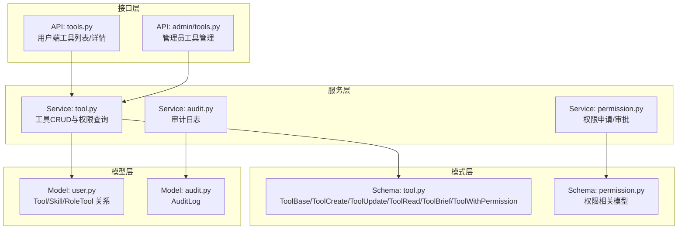
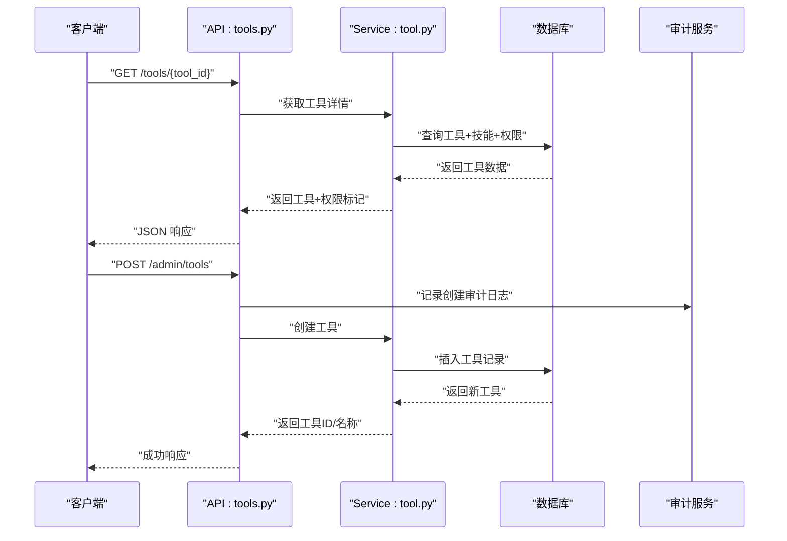
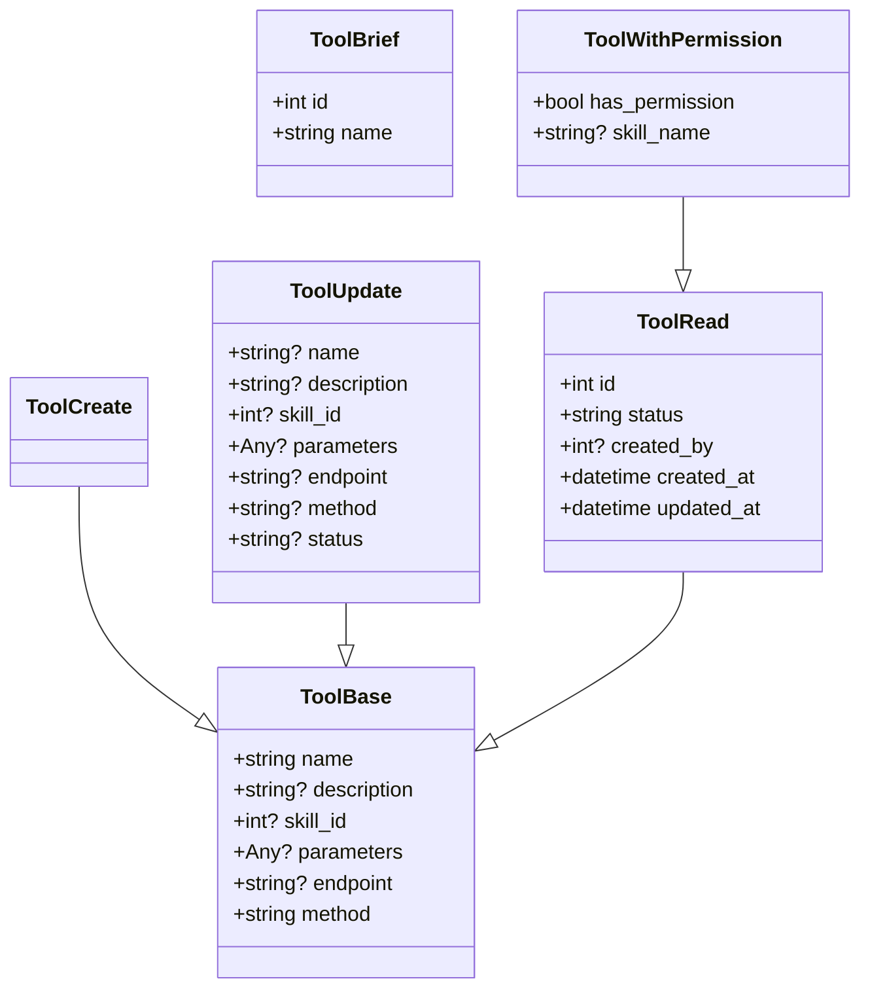
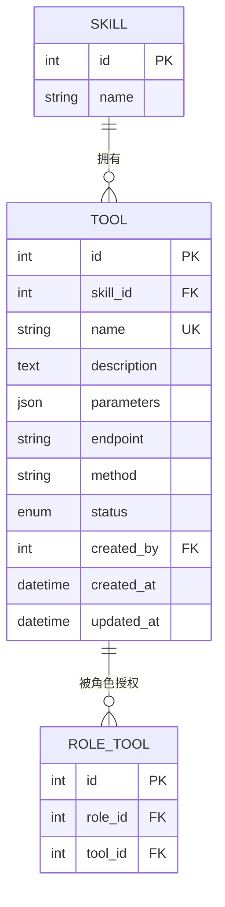
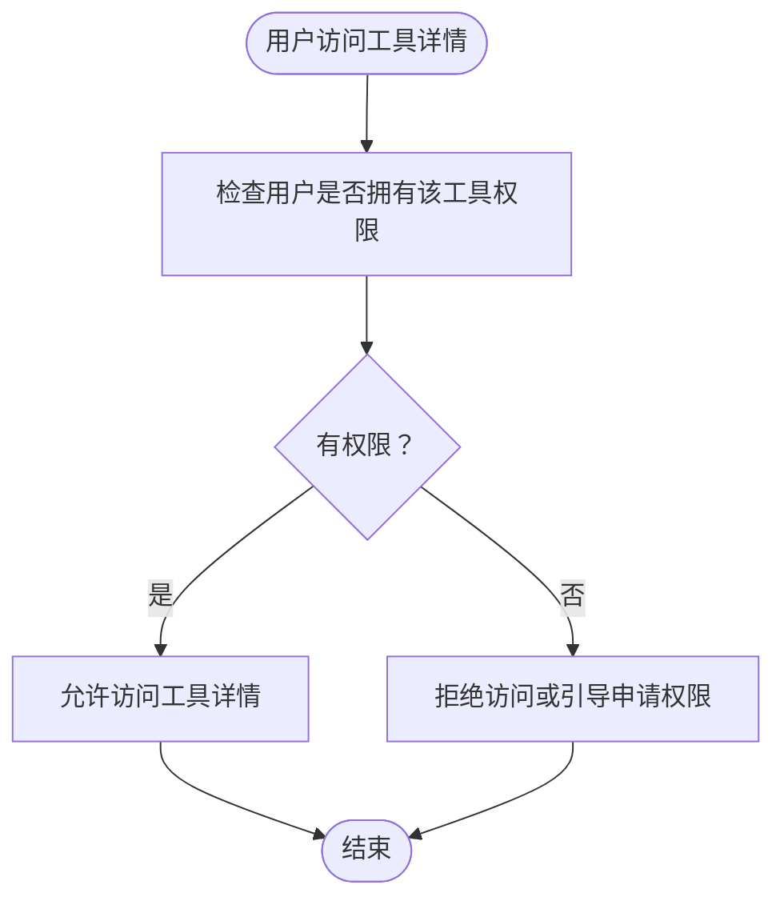
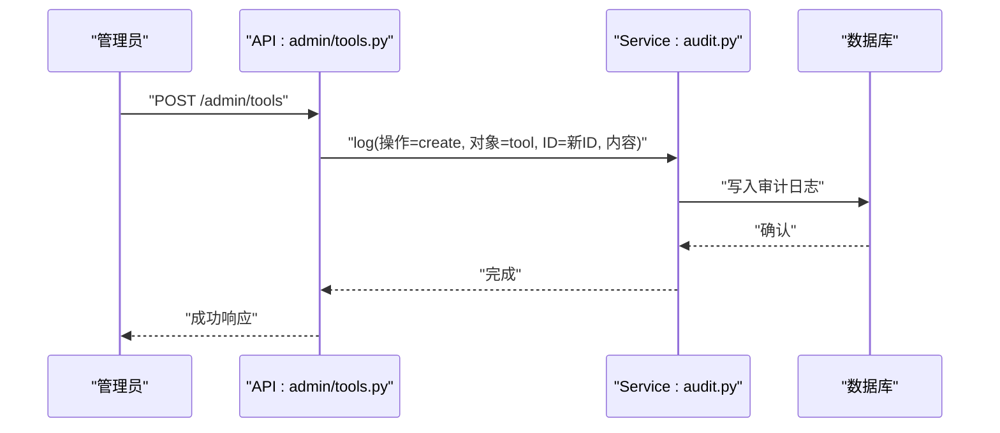
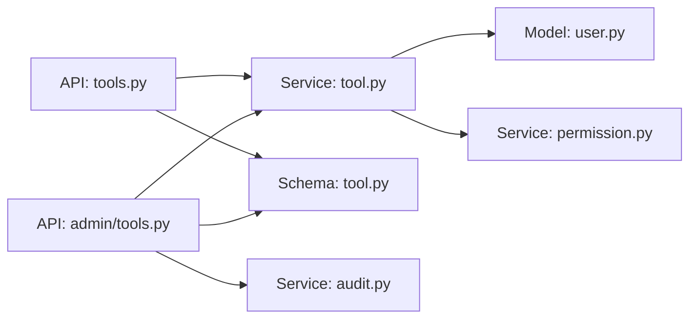

# 工具模式

<cite>
**本文引用的文件**
- [backend/app/schemas/tool.py](file://backend/app/schemas/tool.py)
- [backend/app/models/user.py](file://backend/app/models/user.py)
- [backend/app/services/tool.py](file://backend/app/services/tool.py)
- [backend/app/api/tools.py](file://backend/app/api/tools.py)
- [backend/app/api/admin/tools.py](file://backend/app/api/admin/tools.py)
- [backend/alembic/versions/5fb1c261fa23_initial_tables.py](file://backend/alembic/versions/5fb1c261fa23_initial_tables.py)
- [backend/app/models/audit.py](file://backend/app/models/audit.py)
- [backend/app/services/audit.py](file://backend/app/services/audit.py)
- [backend/app/api/permission_requests.py](file://backend/app/api/permission_requests.py)
- [backend/app/services/permission.py](file://backend/app/services/permission.py)
- [backend/app/schemas/permission.py](file://backend/app/schemas/permission.py)
</cite>

## 目录
1. [简介](#简介)
2. [项目结构](#项目结构)
3. [核心组件](#核心组件)
4. [架构总览](#架构总览)
5. [详细组件分析](#详细组件分析)
6. [依赖分析](#依赖分析)
7. [性能考虑](#性能考虑)
8. [故障排查指南](#故障排查指南)
9. [结论](#结论)
10. [附录](#附录)

## 简介
本文件面向ToolHub的“工具模式”，系统性梳理工具数据模型、API接口、服务层处理、数据库映射以及与权限申请、使用统计、审计日志的关联关系。重点覆盖以下内容：
- ToolBase、ToolCreate、ToolUpdate、ToolRead、ToolBrief、ToolWithPermission等Pydantic模型的设计与用途
- 工具基本信息字段（名称、描述、API配置、状态、使用限制等）的定义、数据类型、验证规则、配置管理
- 工具API连接参数、认证方式、调用频率限制、使用统计
- 工具分类体系（技能）、权限控制策略、使用日志记录
- 工具模式的配置示例与集成方案
- 工具模式与权限申请、使用统计、审计日志的关联关系

## 项目结构
围绕工具模式的关键文件组织如下：
- 模型层：定义数据库表结构及关系
- 模式层：定义Pydantic数据模型用于请求/响应校验与序列化
- 服务层：封装业务逻辑（查询、创建、更新、权限判断）
- 接口层：对外暴露REST API，包含管理员端与普通用户端
- 审计与权限：与审计日志、权限申请流程集成

**图表来源**
- [backend/app/api/tools.py:37-68](file://backend/app/api/tools.py#L37-L68)
- [backend/app/api/admin/tools.py:38-78](file://backend/app/api/admin/tools.py#L38-L78)
- [backend/app/services/tool.py:1-79](file://backend/app/services/tool.py#L1-L79)
- [backend/app/schemas/tool.py:1-50](file://backend/app/schemas/tool.py#L1-L50)
- [backend/app/models/user.py:80-115](file://backend/app/models/user.py#L80-L115)
- [backend/app/models/audit.py](file://backend/app/models/audit.py)
- [backend/app/services/audit.py](file://backend/app/services/audit.py)
- [backend/app/api/permission_requests.py](file://backend/app/api/permission_requests.py)
- [backend/app/services/permission.py](file://backend/app/services/permission.py)
- [backend/app/schemas/permission.py](file://backend/app/schemas/permission.py)

**章节来源**
- [backend/app/schemas/tool.py:1-50](file://backend/app/schemas/tool.py#L1-L50)
- [backend/app/models/user.py:80-115](file://backend/app/models/user.py#L80-L115)
- [backend/app/services/tool.py:1-79](file://backend/app/services/tool.py#L1-L79)
- [backend/app/api/tools.py:37-68](file://backend/app/api/tools.py#L37-L68)
- [backend/app/api/admin/tools.py:38-78](file://backend/app/api/admin/tools.py#L38-L78)

## 核心组件
- 数据模型（Pydantic）
  - ToolBase：工具基础字段集合，作为创建/读取的基础模型
  - ToolCreate：继承自ToolBase，用于创建时的输入校验
  - ToolUpdate：可选字段集合，支持部分更新
  - ToolRead：在ToolBase基础上增加标识、状态、时间戳、创建者等只读字段
  - ToolBrief：工具简要信息（ID、名称）
  - ToolWithPermission：在ToolRead基础上增加“是否拥有权限”和“技能名称”
- 数据库模型（SQLAlchemy）
  - Tool：工具实体，包含名称、描述、参数定义、端点、方法、状态、外键关联等
  - Skill：技能实体，工具通过skill_id关联
  - RoleTool：角色-工具关联表，用于权限控制
- 服务层
  - ToolService：提供工具列表、详情、创建、更新等操作；包含用户工具权限判断
- 接口层
  - 用户端：列出工具、查看详情（含权限标记）
  - 管理员端：创建、更新、删除工具，并记录审计日志

**章节来源**
- [backend/app/schemas/tool.py:1-50](file://backend/app/schemas/tool.py#L1-L50)
- [backend/app/models/user.py:80-115](file://backend/app/models/user.py#L80-L115)
- [backend/app/services/tool.py:1-79](file://backend/app/services/tool.py#L1-L79)
- [backend/app/api/tools.py:37-68](file://backend/app/api/tools.py#L37-L68)
- [backend/app/api/admin/tools.py:38-78](file://backend/app/api/admin/tools.py#L38-L78)

## 架构总览
工具模式的端到端流程包括：请求进入API层 → 服务层执行业务 → 模式层进行数据校验与序列化 → 模型层持久化到数据库 → 审计与权限模块联动。

**图表来源**
- [backend/app/api/tools.py:45-68](file://backend/app/api/tools.py#L45-L68)
- [backend/app/api/admin/tools.py:45-78](file://backend/app/api/admin/tools.py#L45-L78)
- [backend/app/services/tool.py:36-54](file://backend/app/services/tool.py#L36-L54)
- [backend/app/services/audit.py](file://backend/app/services/audit.py)
- [backend/app/models/audit.py](file://backend/app/models/audit.py)

## 详细组件分析

### Pydantic模型设计与用途
- ToolBase
  - 字段：name、description、skill_id、parameters、endpoint、method
  - 验证规则：字符串长度、枚举值（method默认值）、可空字段
  - 用途：作为ToolCreate/ToolRead的基类，统一字段定义
- ToolCreate
  - 继承ToolBase，无新增约束，用于创建工具的输入校验
- ToolUpdate
  - 可选字段：name、description、skill_id、parameters、endpoint、method、status
  - 用途：支持部分字段更新，避免强制传入所有字段
- ToolRead
  - 新增：id、status（默认active）、created_by、created_at、updated_at
  - 用途：对外输出工具完整信息，支持from_attributes序列化
- ToolBrief
  - 新增：id、name
  - 用途：列表页或嵌套引用场景下的轻量信息
- ToolWithPermission
  - 新增：has_permission、skill_name
  - 用途：在用户视角展示是否具备使用权限及技能名称

**图表来源**
- [backend/app/schemas/tool.py:1-50](file://backend/app/schemas/tool.py#L1-L50)

**章节来源**
- [backend/app/schemas/tool.py:1-50](file://backend/app/schemas/tool.py#L1-L50)

### 工具基本信息字段定义、数据类型与验证规则
- 名称（name）
  - 类型：字符串
  - 规则：唯一性约束（数据库唯一索引），长度限制由数据库列长度决定
- 描述（description）
  - 类型：文本（可空）
- 技能ID（skill_id）
  - 类型：整数（可空）
  - 关联：外键指向skills表，删除时级联删除工具
- 参数定义（parameters）
  - 类型：JSON对象（可空）
  - 用途：描述工具调用所需的参数结构
- 端点（endpoint）
  - 类型：字符串（可空）
  - 用途：工具调用的目标URL
- 方法（method）
  - 类型：字符串，默认“POST”
  - 用途：HTTP方法（GET/POST等）
- 状态（status）
  - 类型：枚举（active/inactive），默认active
- 创建者（created_by）
  - 类型：整数（可空）
  - 关联：外键指向users表
- 时间戳（created_at、updated_at）
  - 类型：日期时间，自动维护

**图表来源**
- [backend/alembic/versions/5fb1c261fa23_initial_tables.py:115-138](file://backend/alembic/versions/5fb1c261fa23_initial_tables.py#L115-L138)
- [backend/app/models/user.py:80-115](file://backend/app/models/user.py#L80-L115)

**章节来源**
- [backend/alembic/versions/5fb1c261fa23_initial_tables.py:115-138](file://backend/alembic/versions/5fb1c261fa23_initial_tables.py#L115-L138)
- [backend/app/models/user.py:80-115](file://backend/app/models/user.py#L80-L115)

### 工具API连接参数、认证方式、调用频率限制与使用统计
- 连接参数
  - endpoint：工具调用目标地址（可空，便于本地或外部系统对接）
  - method：HTTP方法（默认POST）
  - parameters：工具参数定义（JSON），用于描述调用所需字段
- 认证方式
  - 当前模式未在工具模型中内置认证字段；建议通过网关或中间件统一鉴权
- 调用频率限制
  - 当前模式未内置频率限制字段；可在网关或服务层实现限流策略
- 使用统计
  - 当前模式未内置使用次数统计字段；可通过审计日志聚合实现

**章节来源**
- [backend/app/schemas/tool.py:1-50](file://backend/app/schemas/tool.py#L1-L50)
- [backend/app/models/user.py:80-115](file://backend/app/models/user.py#L80-L115)

### 工具分类体系与权限控制策略
- 分类体系
  - 工具通过skill_id关联到技能（Skill），形成“技能-工具”的一对多关系
- 权限控制
  - 通过RoleTool（角色-工具）关联表实现角色对工具的授权
  - 用户端接口会返回“has_permission”字段，指示当前用户是否具备使用该工具的权限
  - 管理员端接口支持创建/更新工具，并在更新时记录审计日志

**图表来源**
- [backend/app/api/tools.py:45-68](file://backend/app/api/tools.py#L45-L68)
- [backend/app/services/tool.py:1-79](file://backend/app/services/tool.py#L1-L79)
- [backend/app/models/user.py:108-115](file://backend/app/models/user.py#L108-L115)

**章节来源**
- [backend/app/api/tools.py:37-68](file://backend/app/api/tools.py#L37-L68)
- [backend/app/services/tool.py:1-79](file://backend/app/services/tool.py#L1-L79)
- [backend/app/models/user.py:80-115](file://backend/app/models/user.py#L80-L115)

### 使用日志记录与审计
- 审计日志
  - 管理员创建/更新工具后，调用审计服务记录操作日志
  - 日志包含操作类型（create/update）、对象类型（tool）、对象ID、变更内容等
- 审计模型
  - 审计日志模型定义于models/audit.py，服务层通过services/audit.py进行写入

**图表来源**
- [backend/app/api/admin/tools.py:45-57](file://backend/app/api/admin/tools.py#L45-L57)
- [backend/app/services/audit.py](file://backend/app/services/audit.py)
- [backend/app/models/audit.py](file://backend/app/models/audit.py)

**章节来源**
- [backend/app/api/admin/tools.py:45-57](file://backend/app/api/admin/tools.py#L45-L57)
- [backend/app/services/audit.py](file://backend/app/services/audit.py)
- [backend/app/models/audit.py](file://backend/app/models/audit.py)

### 配置示例与集成方案
- 工具参数定义（parameters）建议采用JSON Schema风格，明确字段名、类型、是否必填、默认值、范围等
- 端点（endpoint）与方法（method）用于对接外部系统或内部微服务
- 权限申请与审批
  - 用户可通过权限申请接口提交申请，管理员在后台审批
  - 审批通过后，系统通过角色-工具关联授予使用权限
- 集成步骤
  - 在前端页面中，先拉取工具列表与权限标记，再根据权限决定按钮可用性
  - 后端服务层在执行工具调用前，再次校验用户权限

**章节来源**
- [backend/app/api/tools.py:37-68](file://backend/app/api/tools.py#L37-L68)
- [backend/app/api/permission_requests.py](file://backend/app/api/permission_requests.py)
- [backend/app/services/permission.py](file://backend/app/services/permission.py)
- [backend/app/schemas/permission.py](file://backend/app/schemas/permission.py)

## 依赖分析
- 模块耦合
  - API层依赖服务层；服务层依赖模型层与模式层；审计与权限模块独立但被API/服务调用
- 外部依赖
  - SQLAlchemy（ORM）、Alembic（迁移）、Pydantic（数据校验）
- 潜在循环依赖
  - 当前结构清晰，未发现循环导入

**图表来源**
- [backend/app/api/tools.py:37-68](file://backend/app/api/tools.py#L37-L68)
- [backend/app/api/admin/tools.py:38-78](file://backend/app/api/admin/tools.py#L38-L78)
- [backend/app/services/tool.py:1-79](file://backend/app/services/tool.py#L1-L79)
- [backend/app/schemas/tool.py:1-50](file://backend/app/schemas/tool.py#L1-L50)
- [backend/app/models/user.py:80-115](file://backend/app/models/user.py#L80-L115)
- [backend/app/services/audit.py](file://backend/app/services/audit.py)
- [backend/app/services/permission.py](file://backend/app/services/permission.py)

**章节来源**
- [backend/app/api/tools.py:37-68](file://backend/app/api/tools.py#L37-L68)
- [backend/app/api/admin/tools.py:38-78](file://backend/app/api/admin/tools.py#L38-L78)
- [backend/app/services/tool.py:1-79](file://backend/app/services/tool.py#L1-L79)
- [backend/app/schemas/tool.py:1-50](file://backend/app/schemas/tool.py#L1-L50)
- [backend/app/models/user.py:80-115](file://backend/app/models/user.py#L80-L115)

## 性能考虑
- 查询优化
  - 列表查询支持关键词、技能ID、状态过滤，建议在相关列建立索引以提升检索效率
- 序列化开销
  - ToolWithPermission在用户端返回时包含权限标记，建议按需加载，避免不必要的计算
- 审计日志
  - 审计写入为异步或批量策略可降低写入压力（建议在服务层实现）

## 故障排查指南
- 工具不存在
  - 更新工具时若找不到对应ID，服务层抛出异常；API层捕获并返回错误响应
- 权限不足
  - 用户访问无权限工具时，返回空结果或引导申请权限
- 审计缺失
  - 管理员创建/更新工具后未见审计日志，检查审计服务是否正确调用与数据库写入

**章节来源**
- [backend/app/services/tool.py:56-77](file://backend/app/services/tool.py#L56-L77)
- [backend/app/api/admin/tools.py:60-74](file://backend/app/api/admin/tools.py#L60-L74)
- [backend/app/api/tools.py:45-68](file://backend/app/api/tools.py#L45-L68)

## 结论
工具模式通过清晰的Pydantic模型、SQLAlchemy模型与服务层封装，实现了工具的创建、查询、权限控制与审计记录。当前版本未内置认证与限流字段，建议在网关或服务层补充；使用统计可通过审计日志聚合实现。整体架构层次分明，易于扩展与维护。

## 附录
- 数据库迁移脚本展示了工具表的字段与约束，可作为部署与升级参考
- 权限申请与审批流程与工具模式解耦，便于独立演进

**章节来源**
- [backend/alembic/versions/5fb1c261fa23_initial_tables.py:115-138](file://backend/alembic/versions/5fb1c261fa23_initial_tables.py#L115-L138)
- [backend/app/api/permission_requests.py](file://backend/app/api/permission_requests.py)
- [backend/app/services/permission.py](file://backend/app/services/permission.py)
- [backend/app/schemas/permission.py](file://backend/app/schemas/permission.py)