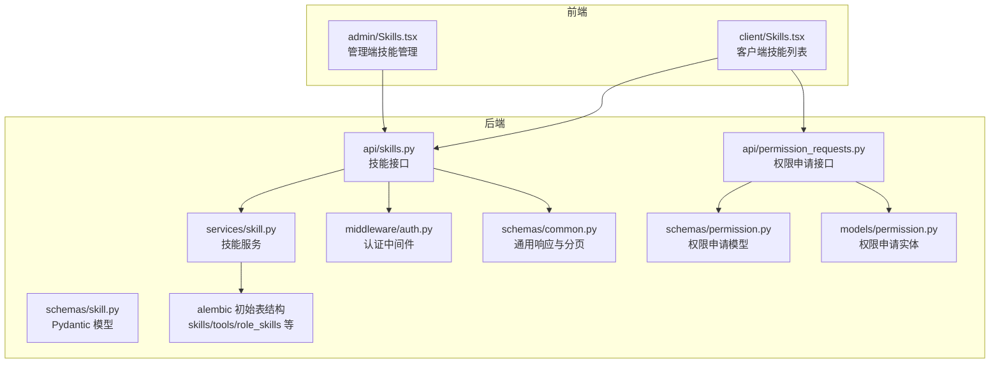
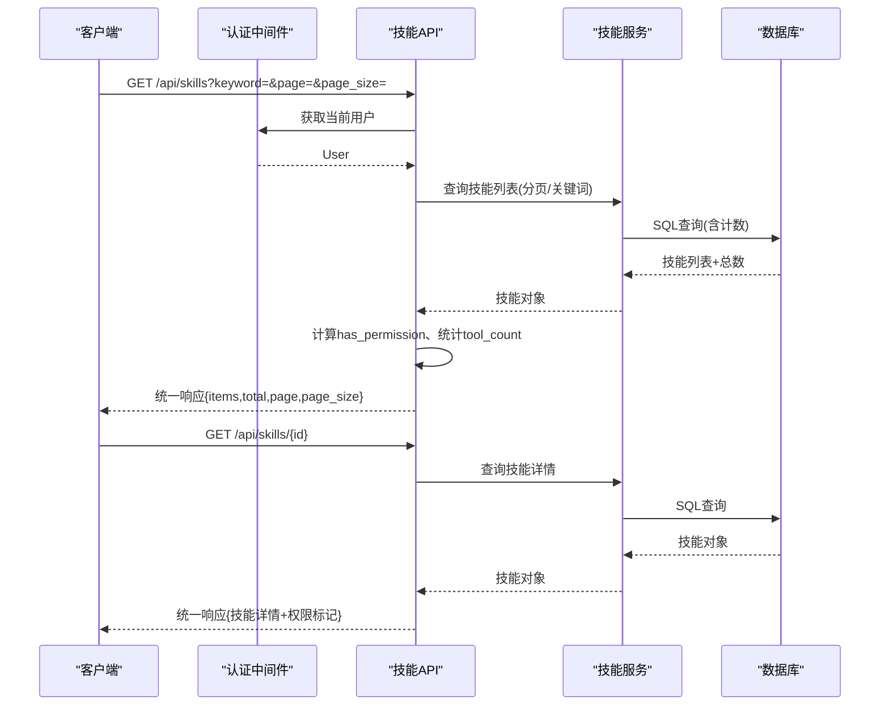
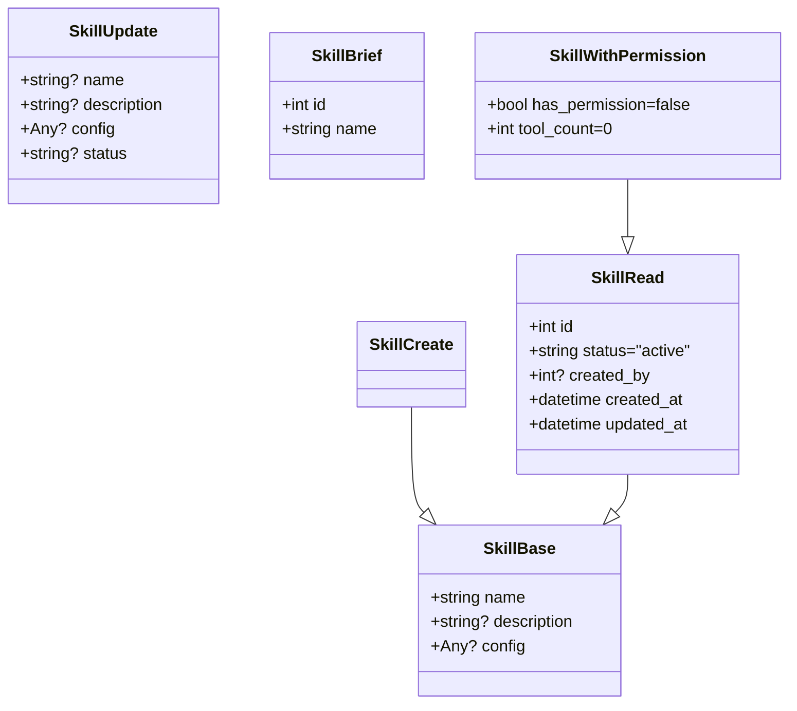
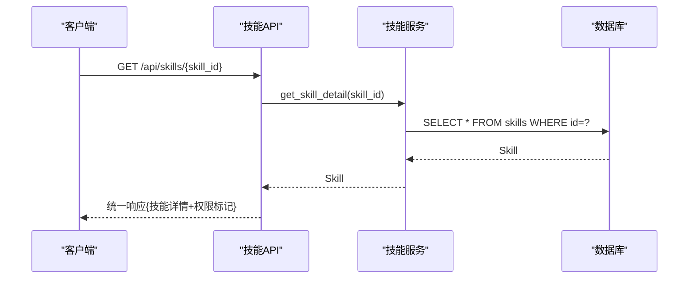
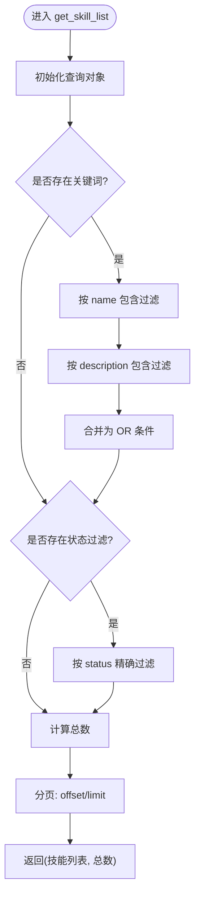
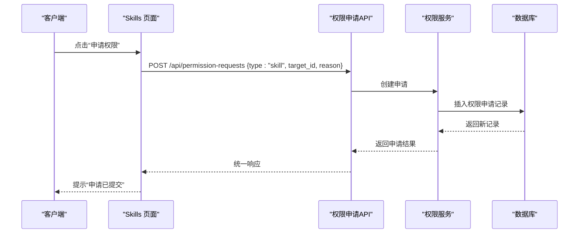
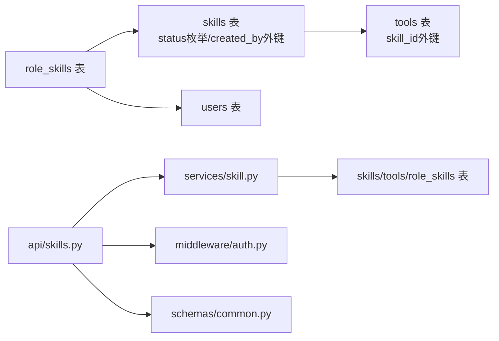

# 技能模式

<cite>
**本文引用的文件**
- [backend/app/schemas/skill.py](file://backend/app/schemas/skill.py)
- [backend/app/api/skills.py](file://backend/app/api/skills.py)
- [backend/app/services/skill.py](file://backend/app/services/skill.py)
- [backend/alembic/versions/5fb1c261fa23_initial_tables.py](file://backend/alembic/versions/5fb1c261fa23_initial_tables.py)
- [backend/app/middleware/auth.py](file://backend/app/middleware/auth.py)
- [backend/app/schemas/common.py](file://backend/app/schemas/common.py)
- [backend/app/api/permission_requests.py](file://backend/app/api/permission_requests.py)
- [backend/app/schemas/permission.py](file://backend/app/schemas/permission.py)
- [backend/app/models/permission.py](file://backend/app/models/permission.py)
- [frontend/client/src/pages/Skills.tsx](file://frontend/client/src/pages/Skills.tsx)
- [frontend/admin/src/pages/Skills.tsx](file://frontend/admin/src/pages/Skills.tsx)
</cite>

## 目录
1. [简介](#简介)
2. [项目结构](#项目结构)
3. [核心组件](#核心组件)
4. [架构总览](#架构总览)
5. [详细组件分析](#详细组件分析)
6. [依赖分析](#依赖分析)
7. [性能考虑](#性能考虑)
8. [故障排查指南](#故障排查指南)
9. [结论](#结论)
10. [附录](#附录)

## 简介
本文件面向ToolHub“技能模式”的数据验证与业务流程，系统性梳理以下内容：
- Pydantic模型：SkillBase、SkillCreate、SkillUpdate、SkillRead、SkillBrief、SkillWithPermission 的设计与用途
- 技能基本信息字段的定义、数据类型、验证规则与状态管理
- 技能分类体系、技能等级定义、技能与工具的关联关系
- 技能搜索过滤、排序规则、分页处理
- 技能模式的管理界面数据结构与API交互示例
- 技能模式与权限申请、用户学习进度的关联关系

## 项目结构
技能模式涉及后端Schema、API路由、服务层、数据库模型以及前后端页面组件。下图展示与技能模式直接相关的模块与文件：

图表来源
- [backend/app/schemas/skill.py:1-45](file://backend/app/schemas/skill.py#L1-L45)
- [backend/app/api/skills.py:1-86](file://backend/app/api/skills.py#L1-L86)
- [backend/app/services/skill.py:1-92](file://backend/app/services/skill.py#L1-L92)
- [backend/alembic/versions/5fb1c261fa23_initial_tables.py:86-133](file://backend/alembic/versions/5fb1c261fa23_initial_tables.py#L86-L133)
- [backend/app/middleware/auth.py:1-45](file://backend/app/middleware/auth.py#L1-L45)
- [backend/app/schemas/common.py:1-29](file://backend/app/schemas/common.py#L1-L29)
- [backend/app/api/permission_requests.py:1-107](file://backend/app/api/permission_requests.py#L1-L107)
- [backend/app/schemas/permission.py:1-56](file://backend/app/schemas/permission.py#L1-L56)
- [backend/app/models/permission.py:1-28](file://backend/app/models/permission.py#L1-L28)
- [frontend/client/src/pages/Skills.tsx:1-59](file://frontend/client/src/pages/Skills.tsx#L1-L59)
- [frontend/admin/src/pages/Skills.tsx:1-77](file://frontend/admin/src/pages/Skills.tsx#L1-L77)

章节来源
- [backend/app/schemas/skill.py:1-45](file://backend/app/schemas/skill.py#L1-L45)
- [backend/app/api/skills.py:1-86](file://backend/app/api/skills.py#L1-L86)
- [backend/app/services/skill.py:1-92](file://backend/app/services/skill.py#L1-L92)
- [backend/alembic/versions/5fb1c261fa23_initial_tables.py:86-133](file://backend/alembic/versions/5fb1c261fa23_initial_tables.py#L86-L133)
- [frontend/client/src/pages/Skills.tsx:1-59](file://frontend/client/src/pages/Skills.tsx#L1-L59)
- [frontend/admin/src/pages/Skills.tsx:1-77](file://frontend/admin/src/pages/Skills.tsx#L1-L77)

## 核心组件
本节聚焦技能模式的Pydantic模型及其职责边界，明确输入输出的数据结构与验证约束。

- SkillBase
  - 字段：name、description、config
  - 类型：name为字符串；description可空字符串；config可空任意JSON兼容对象
  - 验证规则：由Pydantic默认校验保证字段存在性与类型；无额外自定义约束
  - 用途：作为技能数据的基础载体，供创建/读取使用

- SkillCreate
  - 继承：SkillBase
  - 字段：同SkillBase
  - 验证规则：与SkillBase一致
  - 用途：用于创建技能时的请求体模型

- SkillUpdate
  - 继承：BaseModel
  - 字段：name、description、config（均可空）、status（可空）
  - 验证规则：Pydantic默认校验；status可为空表示不更新状态
  - 用途：用于更新技能信息与状态

- SkillRead
  - 继承：SkillBase
  - 字段：id、status（默认值"active"）、created_by（可空）、created_at、updated_at
  - 配置：model_config开启from_attributes，支持从ORM对象映射
  - 用途：用于返回技能详情的标准响应模型

- SkillBrief
  - 继承：BaseModel
  - 字段：id、name
  - 配置：model_config开启from_attributes
  - 用途：用于简要展示技能标识的轻量模型

- SkillWithPermission
  - 继承：SkillRead
  - 字段：has_permission（布尔，默认false）、tool_count（整数，默认0）
  - 配置：model_config开启from_attributes
  - 用途：在技能列表中附加权限与工具数量信息，便于前端渲染

章节来源
- [backend/app/schemas/skill.py:6-45](file://backend/app/schemas/skill.py#L6-L45)

## 架构总览
技能模式的端到端流程包括：前端发起请求 → 认证中间件校验 → API路由处理 → 服务层查询/更新 → 数据库持久化 → 返回统一响应格式。下图展示关键交互：

图表来源
- [backend/app/api/skills.py:13-86](file://backend/app/api/skills.py#L13-L86)
- [backend/app/services/skill.py:12-31](file://backend/app/services/skill.py#L12-L31)
- [backend/app/middleware/auth.py:12-33](file://backend/app/middleware/auth.py#L12-L33)
- [backend/app/schemas/common.py:17-28](file://backend/app/schemas/common.py#L17-L28)

## 详细组件分析

### 数据模型类图
Skill系列模型之间的继承与组合关系如下：

图表来源
- [backend/app/schemas/skill.py:6-45](file://backend/app/schemas/skill.py#L6-L45)

章节来源
- [backend/app/schemas/skill.py:6-45](file://backend/app/schemas/skill.py#L6-L45)

### 技能列表与详情API流程
- 列表接口
  - 路径：GET /api/skills
  - 分页参数：page（≥1）、page_size（1-100）
  - 过滤参数：keyword（技能名或描述包含）
  - 响应：统一响应包装，包含items（技能项）、total、page、page_size
  - 技能项扩展：has_permission（基于用户角色授予）、tool_count（技能下工具数量）

- 详情接口
  - 路径：GET /api/skills/{skill_id}
  - 响应：统一响应包装，包含技能详情与has_permission标记

- 工具列表接口（关联）
  - 路径：GET /api/skills/{skill_id}/tools
  - 响应：技能下工具列表，每项包含has_permission标记

图表来源
- [backend/app/api/skills.py:43-62](file://backend/app/api/skills.py#L43-L62)
- [backend/app/services/skill.py:34-35](file://backend/app/services/skill.py#L34-L35)

章节来源
- [backend/app/api/skills.py:13-86](file://backend/app/api/skills.py#L13-L86)
- [backend/app/services/skill.py:12-31](file://backend/app/services/skill.py#L12-L31)

### 技能搜索、过滤与分页
- 关键词过滤：对name与description进行包含匹配
- 状态过滤：支持按status精确过滤（服务层预留参数）
- 分页：page≥1，page_size范围1-100，offset=(page-1)*page_size，limit=page_size
- 排序：当前实现未显式指定排序字段，遵循数据库默认顺序

图表来源
- [backend/app/services/skill.py:12-31](file://backend/app/services/skill.py#L12-L31)

章节来源
- [backend/app/services/skill.py:12-31](file://backend/app/services/skill.py#L12-L31)

### 技能状态管理
- 数据库状态枚举：active、inactive
- 默认状态：SkillRead中status默认值为"active"
- 更新策略：SkillUpdate允许将status设为可空，若传入则更新，否则保持不变

章节来源
- [backend/alembic/versions/5fb1c261fa23_initial_tables.py:91-91](file://backend/alembic/versions/5fb1c261fa23_initial_tables.py#L91-L91)
- [backend/app/schemas/skill.py:25-25](file://backend/app/schemas/skill.py#L25-L25)
- [backend/app/services/skill.py:61-62](file://backend/app/services/skill.py#L61-L62)

### 技能与工具的关联关系
- 外键关系：tools.skill_id → skills.id（级联删除）
- 关联查询：技能详情包含tools属性；列表接口通过遍历计算tool_count
- 工具权限：工具列表接口返回has_permission标记（基于用户角色授予）

章节来源
- [backend/alembic/versions/5fb1c261fa23_initial_tables.py:119-130](file://backend/alembic/versions/5fb1c261fa23_initial_tables.py#L119-L130)
- [backend/app/api/skills.py:65-85](file://backend/app/api/skills.py#L65-L85)

### 技能与权限申请的关联
- 客户端技能页：点击“申请权限”向权限申请接口提交type=skill的申请
- 权限申请模型：PermissionRequestCreate包含type、target_id、reason
- 申请状态：权限申请记录包含状态枚举（pending、approved、rejected、cancelled）

图表来源
- [frontend/client/src/pages/Skills.tsx:22-30](file://frontend/client/src/pages/Skills.tsx#L22-L30)
- [backend/app/api/permission_requests.py:13-24](file://backend/app/api/permission_requests.py#L13-L24)
- [backend/app/schemas/permission.py:6-10](file://backend/app/schemas/permission.py#L6-L10)
- [backend/app/models/permission.py:7-27](file://backend/app/models/permission.py#L7-L27)

章节来源
- [frontend/client/src/pages/Skills.tsx:22-30](file://frontend/client/src/pages/Skills.tsx#L22-L30)
- [backend/app/api/permission_requests.py:13-24](file://backend/app/api/permission_requests.py#L13-L24)
- [backend/app/schemas/permission.py:6-10](file://backend/app/schemas/permission.py#L6-L10)
- [backend/app/models/permission.py:7-27](file://backend/app/models/permission.py#L7-L27)

### 管理界面数据结构与API交互示例
- 客户端技能列表（浏览）
  - 请求：GET /api/skills?page&page_size&keyword
  - 响应：items包含id、name、description、config、status、has_permission、tool_count、created_at、updated_at
  - 搜索：前端通过Input.Search触发，keyword为空时清空搜索条件
  - 分页：Table分页控件onChange更新page并重新加载

- 管理端技能管理（创建/更新/删除）
  - 新建/编辑：弹窗表单提交，字段包含name、description
  - 删除：调用删除接口，删除成功后刷新列表

- 权限申请（客户端）
  - 提交：POST /api/permission-requests，body包含type、target_id、reason
  - 列表：GET /api/permission-requests?page&page_size
  - 详情：GET /api/permission-requests/{request_id}
  - 撤销：DELETE /api/permission-requests/{request_id}

章节来源
- [frontend/client/src/pages/Skills.tsx:14-58](file://frontend/client/src/pages/Skills.tsx#L14-L58)
- [frontend/admin/src/pages/Skills.tsx:13-76](file://frontend/admin/src/pages/Skills.tsx#L13-L76)
- [backend/app/api/skills.py:13-86](file://backend/app/api/skills.py#L13-L86)
- [backend/app/api/permission_requests.py:13-107](file://backend/app/api/permission_requests.py#L13-L107)

## 依赖分析
- 模型依赖
  - Skill模型定义于数据库迁移脚本中，包含name唯一约束、status枚举、created_by外键
  - Tool模型通过skill_id外键关联到Skill
  - 角色-技能关联表role_skills用于权限授予

- 服务层依赖
  - SkillService依赖SQLAlchemy ORM进行查询、创建、更新、删除
  - 用户技能ID集合通过用户-角色-技能链路获取，并仅包含状态为active的技能

- API层依赖
  - 使用统一响应封装（success_response/error_response）
  - 依赖认证中间件获取当前用户并校验状态

图表来源
- [backend/alembic/versions/5fb1c261fa23_initial_tables.py:86-133](file://backend/alembic/versions/5fb1c261fa23_initial_tables.py#L86-L133)
- [backend/app/api/skills.py:1-10](file://backend/app/api/skills.py#L1-L10)
- [backend/app/services/skill.py:1-6](file://backend/app/services/skill.py#L1-L6)
- [backend/app/middleware/auth.py:1-8](file://backend/app/middleware/auth.py#L1-L8)
- [backend/app/schemas/common.py:17-28](file://backend/app/schemas/common.py#L17-L28)

章节来源
- [backend/alembic/versions/5fb1c261fa23_initial_tables.py:86-133](file://backend/alembic/versions/5fb1c261fa23_initial_tables.py#L86-L133)
- [backend/app/services/skill.py:77-88](file://backend/app/services/skill.py#L77-L88)
- [backend/app/api/skills.py:22-38](file://backend/app/api/skills.py#L22-L38)

## 性能考虑
- 查询优化
  - 列表接口先执行count再分页查询，避免一次性加载全部数据
  - 关键词过滤使用包含匹配，建议在name、description上建立索引以提升检索效率
- 缓存建议
  - 对常用技能列表与详情可引入缓存层，降低重复查询压力
- 分页限制
  - page_size上限为100，防止过大分页导致资源消耗

## 故障排查指南
- 认证失败
  - 现象：401未授权或403禁止访问
  - 可能原因：令牌无效/过期、用户不存在、用户状态非active
  - 处理：检查令牌有效性与用户状态

- 技能不存在
  - 现象：技能详情返回空或抛出异常
  - 可能原因：skill_id错误或已被删除
  - 处理：确认skill_id正确性

- 权限申请失败
  - 现象：提交申请时报错
  - 可能原因：target_id不存在、type非法、用户无权申请
  - 处理：核对type与target_id，确保目标存在且状态正常

章节来源
- [backend/app/middleware/auth.py:17-32](file://backend/app/middleware/auth.py#L17-L32)
- [backend/app/services/skill.py:53-54](file://backend/app/services/skill.py#L53-L54)
- [backend/app/api/permission_requests.py:23-24](file://backend/app/api/permission_requests.py#L23-L24)

## 结论
技能模式通过清晰的Pydantic模型定义、严格的分页与过滤机制、完善的权限申请流程，实现了从数据建模到前端交互的完整闭环。建议后续在关键词检索、权限缓存与状态变更审计方面进一步优化，以提升用户体验与系统性能。

## 附录
- 统一响应格式
  - 成功：{"code": 0, "message": "success", "data": Any}
  - 失败：{"code": -1, "message": "error", "data": Any}

- 分页参数
  - page：起始页（≥1）
  - page_size：每页条数（1-100）

章节来源
- [backend/app/schemas/common.py:17-28](file://backend/app/schemas/common.py#L17-L28)
- [backend/app/api/skills.py:15-16](file://backend/app/api/skills.py#L15-L16)