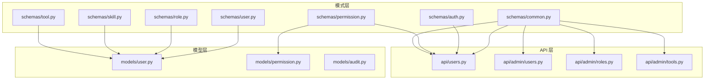
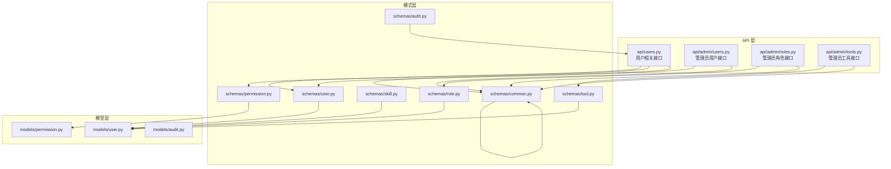
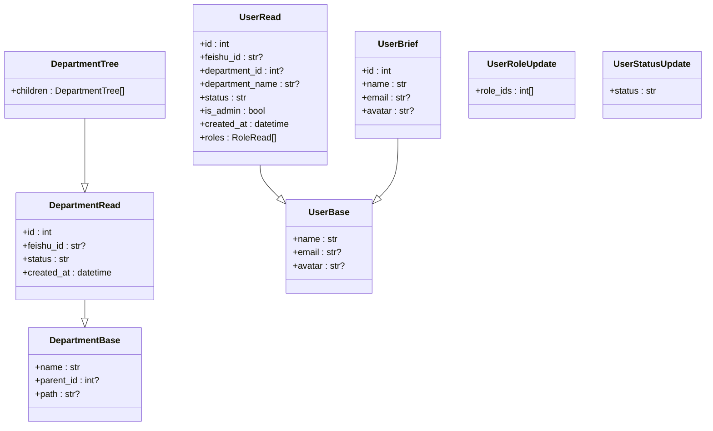
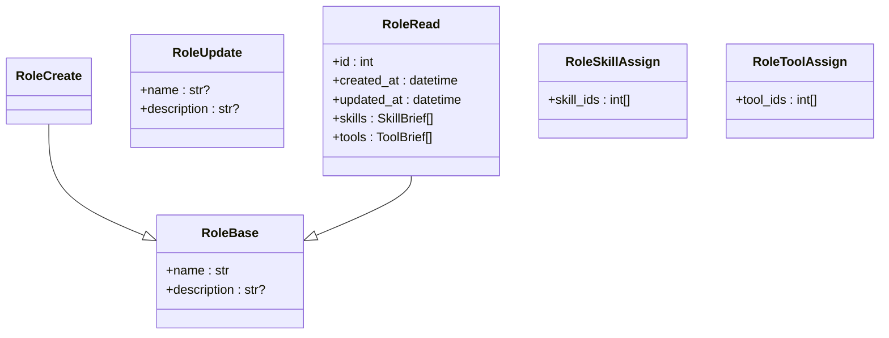
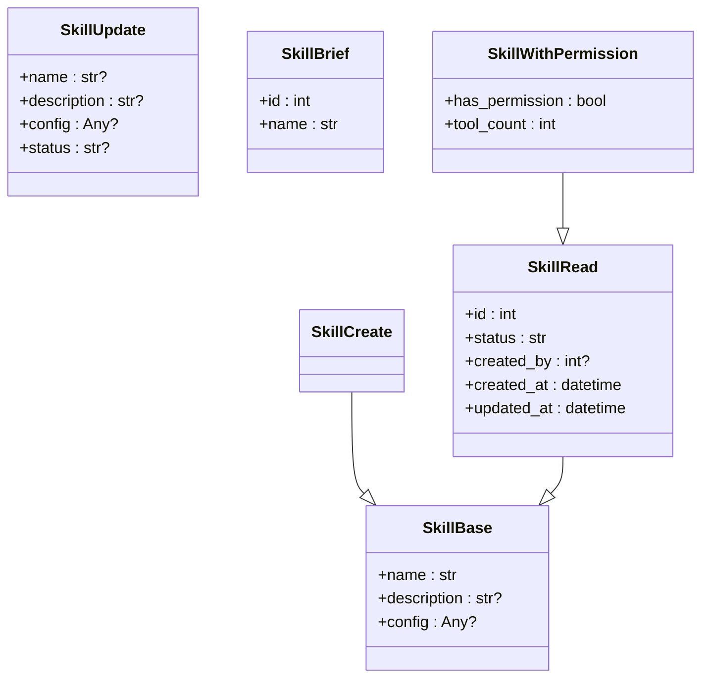
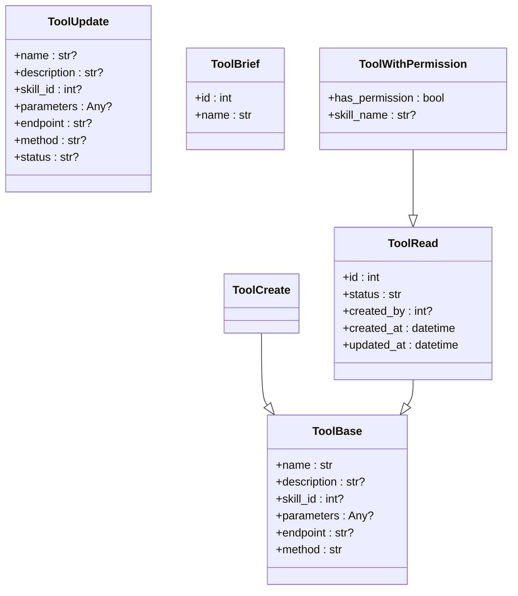
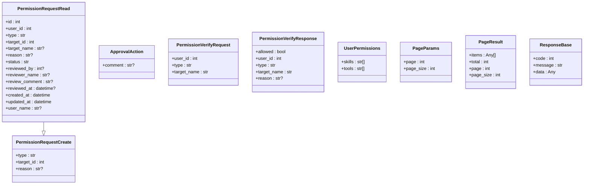
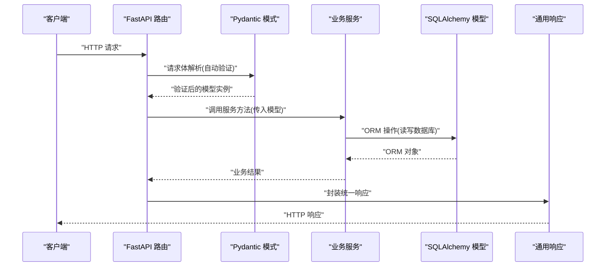
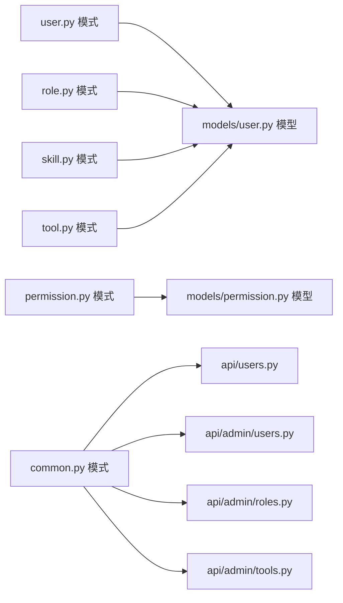

# 数据模式

<cite>
**本文引用的文件**
- [backend/app/schemas/user.py](file://backend/app/schemas/user.py)
- [backend/app/schemas/role.py](file://backend/app/schemas/role.py)
- [backend/app/schemas/skill.py](file://backend/app/schemas/skill.py)
- [backend/app/schemas/tool.py](file://backend/app/schemas/tool.py)
- [backend/app/schemas/permission.py](file://backend/app/schemas/permission.py)
- [backend/app/schemas/common.py](file://backend/app/schemas/common.py)
- [backend/app/schemas/auth.py](file://backend/app/schemas/auth.py)
- [backend/app/models/user.py](file://backend/app/models/user.py)
- [backend/app/models/permission.py](file://backend/app/models/permission.py)
- [backend/app/models/audit.py](file://backend/app/models/audit.py)
- [backend/app/api/users.py](file://backend/app/api/users.py)
- [backend/app/api/admin/users.py](file://backend/app/api/admin/users.py)
- [backend/app/api/admin/roles.py](file://backend/app/api/admin/roles.py)
- [backend/app/api/admin/tools.py](file://backend/app/api/admin/tools.py)
</cite>

## 目录
1. [引言](#引言)
2. [项目结构](#项目结构)
3. [核心组件](#核心组件)
4. [架构总览](#架构总览)
5. [详细组件分析](#详细组件分析)
6. [依赖分析](#依赖分析)
7. [性能考量](#性能考量)
8. [故障排查指南](#故障排查指南)
9. [结论](#结论)
10. [附录](#附录)

## 引言
本文件系统性梳理 ToolHub 的数据模式与序列化层，围绕 Pydantic 模型展开，覆盖用户、部门、角色、技能、工具、权限申请与通用响应等模块。文档重点说明：
- 字段定义、数据类型、默认值与校验规则
- 模式间继承关系、嵌套模式与前向引用
- 输入验证、输出序列化、错误处理机制
- 使用场景与最佳实践
- 扩展方法、自定义验证器与字段别名
- 版本管理与向后兼容策略

## 项目结构
数据模式主要位于 backend/app/schemas 目录，与 SQLAlchemy 模型位于 backend/app/models 目录一一对应，API 层通过 FastAPI 路由使用这些模式进行请求解析与响应封装。

图表来源
- [backend/app/schemas/user.py:1-67](file://backend/app/schemas/user.py#L1-L67)
- [backend/app/schemas/role.py:1-43](file://backend/app/schemas/role.py#L1-L43)
- [backend/app/schemas/skill.py:1-45](file://backend/app/schemas/skill.py#L1-L45)
- [backend/app/schemas/tool.py:1-51](file://backend/app/schemas/tool.py#L1-L51)
- [backend/app/schemas/permission.py:1-56](file://backend/app/schemas/permission.py#L1-L56)
- [backend/app/schemas/common.py:1-29](file://backend/app/schemas/common.py#L1-L29)
- [backend/app/schemas/auth.py:1-26](file://backend/app/schemas/auth.py#L1-L26)
- [backend/app/models/user.py:1-116](file://backend/app/models/user.py#L1-L116)
- [backend/app/models/permission.py:1-28](file://backend/app/models/permission.py#L1-L28)
- [backend/app/models/audit.py:1-17](file://backend/app/models/audit.py#L1-L17)
- [backend/app/api/users.py:1-29](file://backend/app/api/users.py#L1-L29)
- [backend/app/api/admin/users.py:1-97](file://backend/app/api/admin/users.py#L1-L97)
- [backend/app/api/admin/roles.py:1-111](file://backend/app/api/admin/roles.py#L1-L111)
- [backend/app/api/admin/tools.py:1-89](file://backend/app/api/admin/tools.py#L1-L89)

章节来源
- [backend/app/schemas/user.py:1-67](file://backend/app/schemas/user.py#L1-L67)
- [backend/app/schemas/role.py:1-43](file://backend/app/schemas/role.py#L1-L43)
- [backend/app/schemas/skill.py:1-45](file://backend/app/schemas/skill.py#L1-L45)
- [backend/app/schemas/tool.py:1-51](file://backend/app/schemas/tool.py#L1-L51)
- [backend/app/schemas/permission.py:1-56](file://backend/app/schemas/permission.py#L1-L56)
- [backend/app/schemas/common.py:1-29](file://backend/app/schemas/common.py#L1-L29)
- [backend/app/schemas/auth.py:1-26](file://backend/app/schemas/auth.py#L1-L26)
- [backend/app/models/user.py:1-116](file://backend/app/models/user.py#L1-L116)
- [backend/app/models/permission.py:1-28](file://backend/app/models/permission.py#L1-L28)
- [backend/app/models/audit.py:1-17](file://backend/app/models/audit.py#L1-L17)
- [backend/app/api/users.py:1-29](file://backend/app/api/users.py#L1-L29)
- [backend/app/api/admin/users.py:1-97](file://backend/app/api/admin/users.py#L1-L97)
- [backend/app/api/admin/roles.py:1-111](file://backend/app/api/admin/roles.py#L1-L111)
- [backend/app/api/admin/tools.py:1-89](file://backend/app/api/admin/tools.py#L1-L89)

## 核心组件
本节概述各模式模块的职责与关键字段，便于快速定位与理解。

- 用户与部门模式
  - DepartmentBase/DepartmentRead/DepartmentTree：描述部门的树形结构与读取态字段
  - UserBase/UserRead/UserBrief：描述用户基本信息、完整信息与简要信息
  - 用户状态与角色更新：UserRoleUpdate、UserStatusUpdate
- 角色模式
  - RoleBase/RoleCreate/RoleUpdate/RoleRead：角色增删改查与读取态
  - 角色权限分配：RoleSkillAssign、RoleToolAssign
- 技能模式
  - SkillBase/SkillCreate/SkillUpdate/SkillRead：技能增删改查与读取态
  - 简要技能与带权限信息的技能视图：SkillBrief、SkillWithPermission
- 工具模式
  - ToolBase/ToolCreate/ToolUpdate/ToolRead：工具增删改查与读取态
  - 简要工具与带权限信息的工具视图：ToolBrief、ToolWithPermission
- 权限与通用响应
  - 权限申请：PermissionRequestCreate、PermissionRequestRead、ApprovalAction
  - 权限校验：PermissionVerifyRequest、PermissionVerifyResponse
  - 用户权限聚合：UserPermissions
  - 通用分页与响应包装：PageParams、PageResult、ResponseBase 及辅助函数
- 认证与令牌
  - TokenData、TokenResponse、飞书授权链接、开发登录请求

章节来源
- [backend/app/schemas/user.py:6-67](file://backend/app/schemas/user.py#L6-L67)
- [backend/app/schemas/role.py:6-43](file://backend/app/schemas/role.py#L6-L43)
- [backend/app/schemas/skill.py:6-45](file://backend/app/schemas/skill.py#L6-L45)
- [backend/app/schemas/tool.py:6-51](file://backend/app/schemas/tool.py#L6-L51)
- [backend/app/schemas/permission.py:6-56](file://backend/app/schemas/permission.py#L6-L56)
- [backend/app/schemas/common.py:5-29](file://backend/app/schemas/common.py#L5-L29)
- [backend/app/schemas/auth.py:5-26](file://backend/app/schemas/auth.py#L5-L26)

## 架构总览
下图展示模式层与模型层、API 层的交互关系，以及模式在请求/响应中的使用位置。

图表来源
- [backend/app/api/users.py:1-29](file://backend/app/api/users.py#L1-L29)
- [backend/app/api/admin/users.py:1-97](file://backend/app/api/admin/users.py#L1-L97)
- [backend/app/api/admin/roles.py:1-111](file://backend/app/api/admin/roles.py#L1-L111)
- [backend/app/api/admin/tools.py:1-89](file://backend/app/api/admin/tools.py#L1-L89)
- [backend/app/schemas/user.py:1-67](file://backend/app/schemas/user.py#L1-L67)
- [backend/app/schemas/role.py:1-43](file://backend/app/schemas/role.py#L1-L43)
- [backend/app/schemas/skill.py:1-45](file://backend/app/schemas/skill.py#L1-L45)
- [backend/app/schemas/tool.py:1-51](file://backend/app/schemas/tool.py#L1-L51)
- [backend/app/schemas/permission.py:1-56](file://backend/app/schemas/permission.py#L1-L56)
- [backend/app/schemas/common.py:1-29](file://backend/app/schemas/common.py#L1-L29)
- [backend/app/schemas/auth.py:1-26](file://backend/app/schemas/auth.py#L1-L26)
- [backend/app/models/user.py:1-116](file://backend/app/models/user.py#L1-L116)
- [backend/app/models/permission.py:1-28](file://backend/app/models/permission.py#L1-L28)
- [backend/app/models/audit.py:1-17](file://backend/app/models/audit.py#L1-L17)

## 详细组件分析

### 用户与部门模式
- 设计要点
  - 基础模型用于创建/更新；读取模型用于对外返回，包含默认值与只读字段
  - 部门树形结构支持递归子节点
  - 用户模型内联角色列表，使用前向引用解决循环依赖
- 关键字段与默认值
  - DepartmentRead：feishu_id 可空；status 默认“active”；created_at 只读
  - DepartmentTree：children 默认空列表
  - UserRead：feishu_id、department_id、department_name 可空；status 默认“active”；is_admin 默认 False；roles 默认空列表
  - UserBrief：最小化字段集合
  - 更新模型：UserRoleUpdate(role_ids)、UserStatusUpdate(status)
- 序列化与验证
  - 读取模型启用 from_attributes，便于 ORM 对象直接序列化
  - 前向引用通过 model_rebuild 解决
- 使用场景
  - 管理员查询用户列表时返回简要信息
  - 获取当前用户详情时返回完整信息（含角色）
- 错误处理
  - API 层对未找到资源返回统一错误响应

图表来源
- [backend/app/schemas/user.py:6-67](file://backend/app/schemas/user.py#L6-L67)

章节来源
- [backend/app/schemas/user.py:6-67](file://backend/app/schemas/user.py#L6-L67)
- [backend/app/api/admin/users.py:14-64](file://backend/app/api/admin/users.py#L14-L64)

### 角色模式
- 设计要点
  - 角色与用户、技能、工具多对多关联，通过中间表维护
  - 读取模型包含技能与工具列表，便于权限聚合
  - 分配模型仅包含变更字段
- 关键字段与默认值
  - RoleRead：skills、tools 默认空列表
  - RoleSkillAssign/RoleToolAssign：仅包含 ids 列表
- 使用场景
  - 管理员创建/更新角色
  - 为角色批量分配技能或工具权限
- 错误处理
  - API 层捕获业务异常并返回统一错误响应

图表来源
- [backend/app/schemas/role.py:6-43](file://backend/app/schemas/role.py#L6-L43)

章节来源
- [backend/app/schemas/role.py:6-43](file://backend/app/schemas/role.py#L6-L43)
- [backend/app/api/admin/roles.py:14-111](file://backend/app/api/admin/roles.py#L14-L111)

### 技能模式
- 设计要点
  - 支持可选配置对象（JSON），便于扩展
  - 读取模型包含状态与时间戳，默认状态为“active”
  - 提供带权限信息的视图，便于前端判断
- 关键字段与默认值
  - SkillRead：status 默认“active”，created_by 可空
  - SkillWithPermission：has_permission 默认 False，tool_count 默认 0
- 使用场景
  - 工具分类与权限控制
  - 前端展示技能及其关联工具数量与权限状态

图表来源
- [backend/app/schemas/skill.py:6-45](file://backend/app/schemas/skill.py#L6-L45)

章节来源
- [backend/app/schemas/skill.py:6-45](file://backend/app/schemas/skill.py#L6-L45)

### 工具模式
- 设计要点
  - 支持可选参数定义与端点配置，method 默认“POST”
  - 读取模型包含状态与时间戳，默认状态为“active”
  - 提供带权限信息的视图，便于前端判断
- 关键字段与默认值
  - ToolRead：status 默认“active”，method 默认“POST”
  - ToolWithPermission：has_permission 默认 False，skill_name 可空
- 使用场景
  - 工具目录展示与权限校验
  - 前端根据工具配置动态渲染

图表来源
- [backend/app/schemas/tool.py:6-51](file://backend/app/schemas/tool.py#L6-L51)

章节来源
- [backend/app/schemas/tool.py:6-51](file://backend/app/schemas/tool.py#L6-L51)
- [backend/app/api/admin/tools.py:14-89](file://backend/app/api/admin/tools.py#L14-L89)

### 权限与通用响应
- 权限申请
  - 创建：type/target_id/reason
  - 读取：包含申请人、审批人、状态、时间戳等
  - 审批：comment
- 权限校验
  - 请求：user_id/type/target_name
  - 响应：allowed/reason
- 用户权限聚合
  - skills/tools 以字符串列表形式返回
- 通用响应
  - PageParams/PageResult：分页参数与结果
  - ResponseBase：统一响应体 code/message/data
  - success_response/error_response：便捷构造函数

图表来源
- [backend/app/schemas/permission.py:6-56](file://backend/app/schemas/permission.py#L6-L56)
- [backend/app/schemas/common.py:5-29](file://backend/app/schemas/common.py#L5-L29)

章节来源
- [backend/app/schemas/permission.py:6-56](file://backend/app/schemas/permission.py#L6-L56)
- [backend/app/schemas/common.py:5-29](file://backend/app/schemas/common.py#L5-L29)

### 认证与令牌
- TokenData：携带 user_id 与 is_admin
- TokenResponse：access_token/token_type/user_id/name/is_admin
- 飞书授权链接：url
- 开发登录：username/is_admin

章节来源
- [backend/app/schemas/auth.py:5-26](file://backend/app/schemas/auth.py#L5-L26)

### 数据输入验证与输出序列化流程
以下序列图展示典型 API 请求从路由到服务再到序列化的流程，并体现模式在其中的作用。

图表来源
- [backend/app/api/admin/users.py:67-96](file://backend/app/api/admin/users.py#L67-L96)
- [backend/app/schemas/user.py:55-61](file://backend/app/schemas/user.py#L55-L61)
- [backend/app/schemas/common.py:17-29](file://backend/app/schemas/common.py#L17-L29)

## 依赖分析
- 模式与模型映射
  - 用户/角色/技能/工具/权限申请等模式与 SQLAlchemy 模型一一对应
  - 读取模型启用 from_attributes，简化 ORM 对象序列化
- 循环依赖与前向引用
  - 用户模型中角色列表、角色模型中技能/工具列表使用前向引用并通过 model_rebuild 解决
- API 层依赖
  - 各路由依赖相应模式进行请求解析与响应封装
  - 统一使用 success_response/error_response 进行响应格式化

图表来源
- [backend/app/schemas/user.py:63-67](file://backend/app/schemas/user.py#L63-L67)
- [backend/app/schemas/role.py:38-43](file://backend/app/schemas/role.py#L38-L43)
- [backend/app/models/user.py:1-116](file://backend/app/models/user.py#L1-L116)
- [backend/app/models/permission.py:1-28](file://backend/app/models/permission.py#L1-L28)
- [backend/app/api/users.py:1-29](file://backend/app/api/users.py#L1-L29)
- [backend/app/api/admin/users.py:1-97](file://backend/app/api/admin/users.py#L1-L97)
- [backend/app/api/admin/roles.py:1-111](file://backend/app/api/admin/roles.py#L1-L111)
- [backend/app/api/admin/tools.py:1-89](file://backend/app/api/admin/tools.py#L1-L89)

章节来源
- [backend/app/schemas/user.py:63-67](file://backend/app/schemas/user.py#L63-L67)
- [backend/app/schemas/role.py:38-43](file://backend/app/schemas/role.py#L38-L43)
- [backend/app/models/user.py:1-116](file://backend/app/models/user.py#L1-L116)
- [backend/app/models/permission.py:1-28](file://backend/app/models/permission.py#L1-L28)
- [backend/app/api/users.py:1-29](file://backend/app/api/users.py#L1-L29)
- [backend/app/api/admin/users.py:1-97](file://backend/app/api/admin/users.py#L1-L97)
- [backend/app/api/admin/roles.py:1-111](file://backend/app/api/admin/roles.py#L1-L111)
- [backend/app/api/admin/tools.py:1-89](file://backend/app/api/admin/tools.py#L1-L89)

## 性能考量
- 序列化优化
  - 读取模型启用 from_attributes，避免手动字段映射，减少序列化开销
- 分页与批量操作
  - PageParams/PageResult 支持分页，降低单次响应体积
- 前向引用重建
  - model_rebuild 在模块导入末尾执行，确保循环依赖解析完成，避免运行时重建成本

## 故障排查指南
- 常见问题
  - 字段缺失或类型不匹配：检查请求体是否符合对应模式定义
  - 未找到资源：API 层返回统一错误响应，确认 ID 或查询条件
  - 权限不足：确认用户角色与目标资源权限
- 排查步骤
  - 查看 API 路由使用的模式定义
  - 核对模型层字段与数据库约束
  - 使用审计日志定位操作轨迹
- 相关文件
  - 统一响应：success_response/error_response
  - 审计日志：audit_logs 表记录操作类型、目标类型与详情

章节来源
- [backend/app/schemas/common.py:23-29](file://backend/app/schemas/common.py#L23-L29)
- [backend/app/models/audit.py:6-17](file://backend/app/models/audit.py#L6-L17)
- [backend/app/api/admin/users.py:50-51](file://backend/app/api/admin/users.py#L50-L51)
- [backend/app/api/admin/roles.py:74-78](file://backend/app/api/admin/roles.py#L74-L78)
- [backend/app/api/admin/tools.py:83-87](file://backend/app/api/admin/tools.py#L83-L87)

## 结论
ToolHub 的数据模式采用清晰的分层设计：基础模型负责创建/更新，读取模型负责对外输出，配合前向引用与 from_attributes 优化，既保证了类型安全，又提升了序列化效率。结合统一响应与审计日志，系统在易用性与可观测性方面表现良好。建议后续在复杂校验场景引入自定义验证器，在版本演进中保持向后兼容。

## 附录

### 字段别名与自定义验证器
- 字段别名
  - 若需支持不同命名风格，可在模式中使用 alias 参数（例如字段别名映射）
- 自定义验证器
  - 可通过 field_validator、model_validator 实现字段级与模型级校验
  - 示例路径参考：[backend/app/schemas/user.py:27-43](file://backend/app/schemas/user.py#L27-L43)，[backend/app/schemas/role.py:6-27](file://backend/app/schemas/role.py#L6-L27)，[backend/app/schemas/skill.py:6-30](file://backend/app/schemas/skill.py#L6-L30)，[backend/app/schemas/tool.py:6-36](file://backend/app/schemas/tool.py#L6-L36)，[backend/app/schemas/permission.py:6-28](file://backend/app/schemas/permission.py#L6-L28)，[backend/app/schemas/common.py:5-20](file://backend/app/schemas/common.py#L5-L20)，[backend/app/schemas/auth.py:5-26](file://backend/app/schemas/auth.py#L5-L26)

### 模式扩展与版本管理
- 扩展方法
  - 新增字段时优先在创建/更新模型中使用可空类型，保持向后兼容
  - 读取模型新增只读字段不影响写入流程
- 版本管理
  - 通过 API 版本区分不同字段集（如 v1）
  - 旧字段保留默认值，避免破坏现有调用方逻辑
- 向后兼容性
  - 读取模型默认值与可空字段确保旧客户端稳定
  - 审计日志记录变更详情，便于回溯

### 使用场景示例（路径指引）
- 获取当前用户权限
  - 路由：[backend/app/api/users.py:12-19](file://backend/app/api/users.py#L12-L19)
  - 模式：[backend/app/schemas/permission.py:51-56](file://backend/app/schemas/permission.py#L51-L56)
- 管理员分配用户角色
  - 路由：[backend/app/api/admin/users.py:67-96](file://backend/app/api/admin/users.py#L67-L96)
  - 模式：[backend/app/schemas/user.py:55-61](file://backend/app/schemas/user.py#L55-L61)
- 管理员创建角色
  - 路由：[backend/app/api/admin/roles.py:35-63](file://backend/app/api/admin/roles.py#L35-L63)
  - 模式：[backend/app/schemas/role.py:11-18](file://backend/app/schemas/role.py#L11-L18)
- 管理员创建工具
  - 路由：[backend/app/api/admin/tools.py:45-73](file://backend/app/api/admin/tools.py#L45-L73)
  - 模式：[backend/app/schemas/tool.py:15-26](file://backend/app/schemas/tool.py#L15-L26)