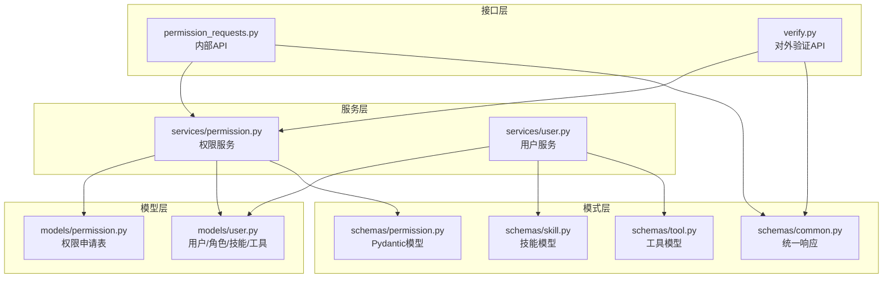
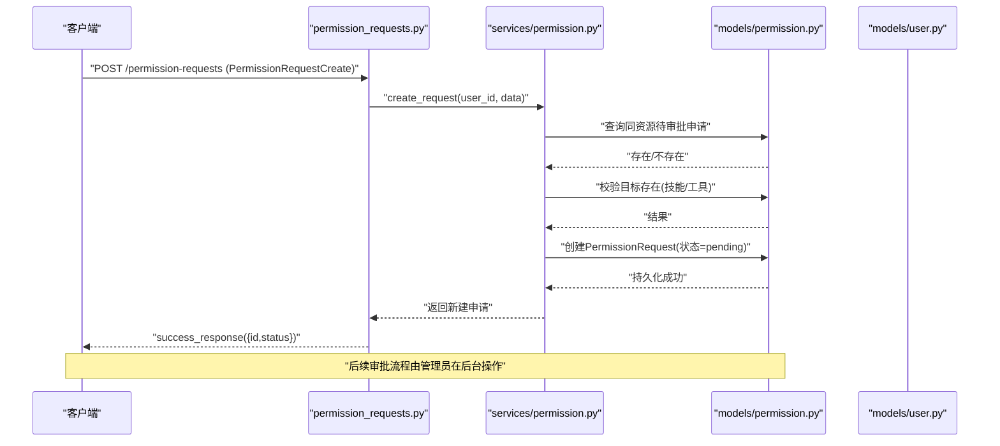
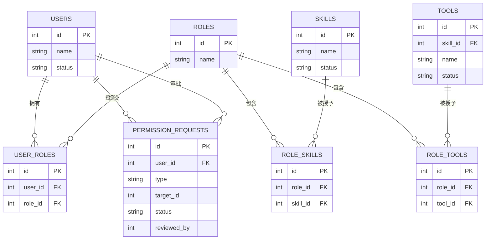
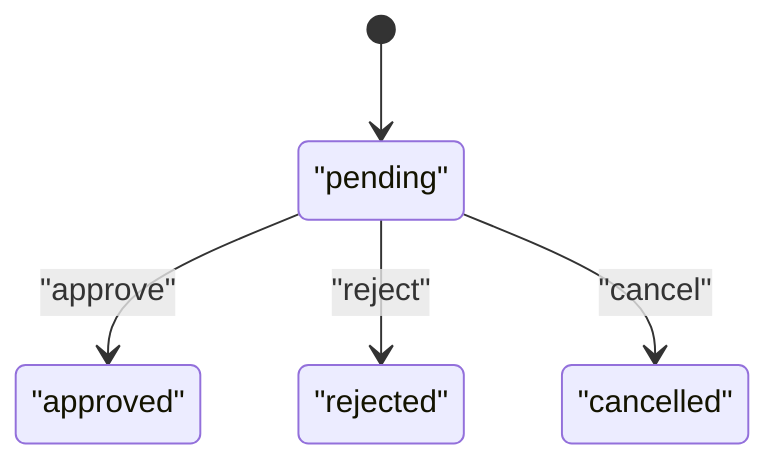
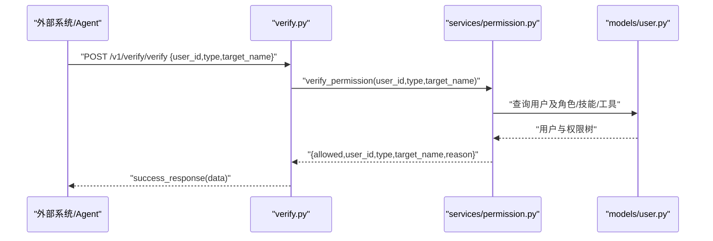
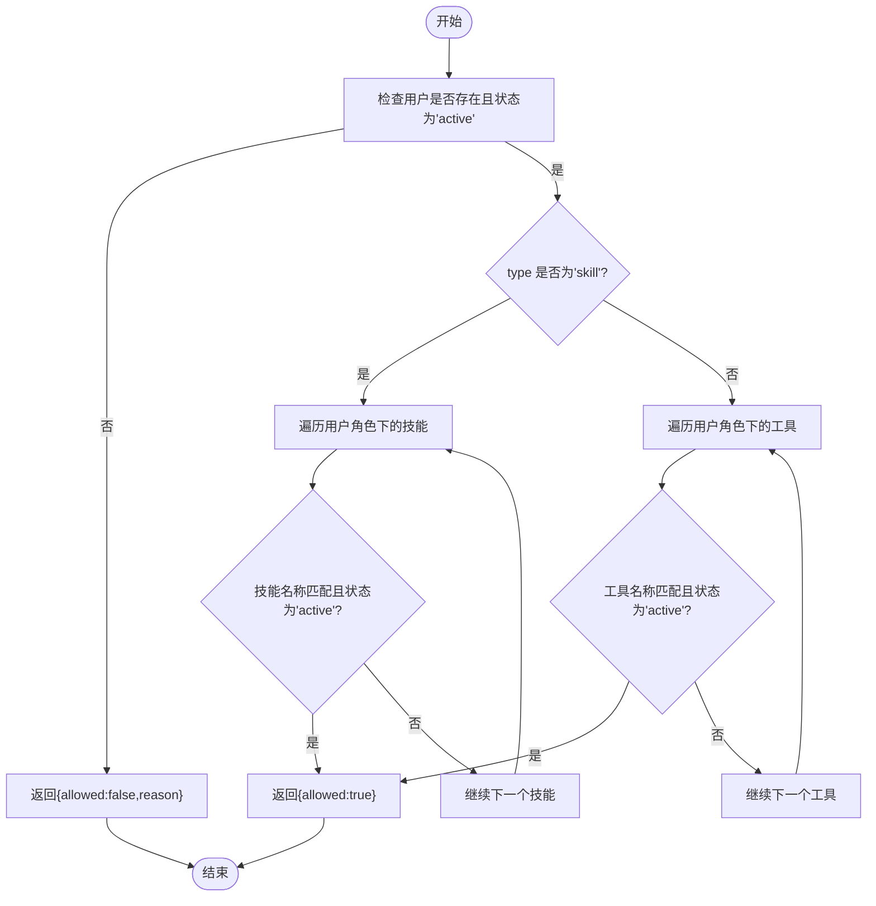

# 权限模式

<cite>
**本文引用的文件**
- [backend/app/schemas/permission.py](file://backend/app/schemas/permission.py)
- [backend/app/models/permission.py](file://backend/app/models/permission.py)
- [backend/app/services/permission.py](file://backend/app/services/permission.py)
- [backend/app/api/permission_requests.py](file://backend/app/api/permission_requests.py)
- [backend/app/models/user.py](file://backend/app/models/user.py)
- [backend/app/services/user.py](file://backend/app/services/user.py)
- [backend/app/api/v1/verify.py](file://backend/app/api/v1/verify.py)
- [backend/app/schemas/common.py](file://backend/app/schemas/common.py)
- [backend/app/schemas/skill.py](file://backend/app/schemas/skill.py)
- [backend/app/schemas/tool.py](file://backend/app/schemas/tool.py)
</cite>

## 目录
1. [引言](#引言)
2. [项目结构](#项目结构)
3. [核心组件](#核心组件)
4. [架构总览](#架构总览)
5. [详细组件分析](#详细组件分析)
6. [依赖分析](#依赖分析)
7. [性能考虑](#性能考虑)
8. [故障排查指南](#故障排查指南)
9. [结论](#结论)
10. [附录](#附录)

## 引言
本文件围绕ToolHub的权限模式，系统性梳理“权限申请与审批”及“权限验证”的数据模型、业务流程与接口设计。重点覆盖以下内容：
- Pydantic模型：PermissionRequestCreate、PermissionRequestRead、ApprovalAction、PermissionVerifyRequest、PermissionVerifyResponse、UserPermissions 的字段定义、数据类型与验证规则
- 权限申请生命周期：创建、查询、撤销、审批（同意/拒绝）
- 审批流程状态枚举与流转约束
- 权限类型分类：技能类权限与工具类权限
- 权限验证接口：输入输出模式、权限检查逻辑、对外API
- 多租户与用户/技能/工具模型的关联关系
- 实际使用场景与最佳实践

## 项目结构
权限模式涉及的后端模块分布如下：
- 模型层：permission.py 定义数据库表结构与字段约束
- 模式层：schemas/permission.py 定义请求/响应/展示模型
- 服务层：services/permission.py 实现业务逻辑（创建、审批、验证）
- 接口层：api/permission_requests.py 提供内部API；api/v1/verify.py 提供对外验证API
- 关联模型：models/user.py、services/user.py 提供用户与权限聚合能力
- 公共响应：schemas/common.py 统一响应格式

图表来源
- [backend/app/api/permission_requests.py:1-107](file://backend/app/api/permission_requests.py#L1-L107)
- [backend/app/api/v1/verify.py:1-41](file://backend/app/api/v1/verify.py#L1-L41)
- [backend/app/services/permission.py:1-182](file://backend/app/services/permission.py#L1-L182)
- [backend/app/services/user.py:1-86](file://backend/app/services/user.py#L1-L86)
- [backend/app/schemas/permission.py:1-56](file://backend/app/schemas/permission.py#L1-L56)
- [backend/app/schemas/common.py:1-29](file://backend/app/schemas/common.py#L1-L29)
- [backend/app/schemas/skill.py:1-45](file://backend/app/schemas/skill.py#L1-L45)
- [backend/app/schemas/tool.py:1-51](file://backend/app/schemas/tool.py#L1-L51)
- [backend/app/models/permission.py:1-28](file://backend/app/models/permission.py#L1-L28)
- [backend/app/models/user.py:1-116](file://backend/app/models/user.py#L1-L116)

章节来源
- [backend/app/api/permission_requests.py:1-107](file://backend/app/api/permission_requests.py#L1-L107)
- [backend/app/api/v1/verify.py:1-41](file://backend/app/api/v1/verify.py#L1-L41)
- [backend/app/services/permission.py:1-182](file://backend/app/services/permission.py#L1-L182)
- [backend/app/services/user.py:1-86](file://backend/app/services/user.py#L1-L86)
- [backend/app/schemas/permission.py:1-56](file://backend/app/schemas/permission.py#L1-L56)
- [backend/app/schemas/common.py:1-29](file://backend/app/schemas/common.py#L1-L29)
- [backend/app/schemas/skill.py:1-45](file://backend/app/schemas/skill.py#L1-L45)
- [backend/app/schemas/tool.py:1-51](file://backend/app/schemas/tool.py#L1-L51)
- [backend/app/models/permission.py:1-28](file://backend/app/models/permission.py#L1-L28)
- [backend/app/models/user.py:1-116](file://backend/app/models/user.py#L1-L116)

## 核心组件
本节聚焦权限模式的核心Pydantic模型及其职责。

- PermissionRequestCreate
  - 字段与类型：type(str)、target_id(int)、reason(Optional[str])
  - 验证规则：type仅允许"skill"或"tool"；target_id必须为正整数；reason可空
  - 用途：用于提交权限申请的输入校验
  - 章节来源
    - [backend/app/schemas/permission.py:6-10](file://backend/app/schemas/permission.py#L6-L10)

- PermissionRequestRead
  - 字段与类型：id(int)、user_id(int)、type(str)、target_id(int)、target_name(Optional[str])、reason(Optional[str])、status(str)、reviewed_by(Optional[int])、reviewer_name(Optional[str])、review_comment(Optional[str])、reviewed_at(Optional[datetime])、created_at(datetime)、updated_at(datetime)、user_name(Optional[str])
  - 验证规则：所有字段均为只读展示；from_attributes启用ORM映射
  - 用途：用于返回权限申请的完整信息（含审批人、时间戳等）
  - 章节来源
    - [backend/app/schemas/permission.py:12-28](file://backend/app/schemas/permission.py#L12-L28)

- ApprovalAction
  - 字段与类型：comment(Optional[str])
  - 验证规则：可空评论
  - 用途：审批动作的输入载体（当前API未直接使用该模型，但可用于扩展）
  - 章节来源
    - [backend/app/schemas/permission.py:31-33](file://backend/app/schemas/permission.py#L31-L33)

- PermissionVerifyRequest
  - 字段与类型：user_id(int)、type(str)、target_name(str)
  - 验证规则：type仅允许"skill"或"tool"；target_name非空
  - 用途：对外权限验证接口的输入
  - 章节来源
    - [backend/app/schemas/permission.py:35-39](file://backend/app/schemas/permission.py#L35-L39)

- PermissionVerifyResponse
  - 字段与类型：allowed(bool)、user_id(int)、type(str)、target_name(str)、reason(Optional[str])
  - 验证规则：from_attributes启用ORM映射；reason可空
  - 用途：对外权限验证接口的输出
  - 章节来源
    - [backend/app/schemas/permission.py:41-48](file://backend/app/schemas/permission.py#L41-L48)

- UserPermissions
  - 字段与类型：skills(list[str])、tools(list[str])
  - 验证规则：默认为空列表；from_attributes启用ORM映射
  - 用途：返回用户拥有的技能名与工具名集合
  - 章节来源
    - [backend/app/schemas/permission.py:51-56](file://backend/app/schemas/permission.py#L51-L56)

章节来源
- [backend/app/schemas/permission.py:1-56](file://backend/app/schemas/permission.py#L1-L56)

## 架构总览
权限模式采用“接口-服务-模型-模式”的分层架构，结合数据库模型与Pydantic模型实现数据验证与业务处理。

图表来源
- [backend/app/api/permission_requests.py:13-25](file://backend/app/api/permission_requests.py#L13-L25)
- [backend/app/services/permission.py:12-44](file://backend/app/services/permission.py#L12-L44)
- [backend/app/models/permission.py:7-28](file://backend/app/models/permission.py#L7-L28)
- [backend/app/models/user.py:23-40](file://backend/app/models/user.py#L23-L40)

## 详细组件分析

### 数据模型与状态枚举
- 权限申请实体
  - 表名：permission_requests
  - 关键字段：user_id、type、target_id、reason、status、reviewed_by、review_comment、reviewed_at、created_at、updated_at
  - 类型约束：
    - type：枚举"skill"/"tool"
    - status：枚举"pending"/"approved"/"rejected"/"cancelled"
  - 外键关系：user_id、reviewed_by 均指向 users.id
  - 章节来源
    - [backend/app/models/permission.py:7-28](file://backend/app/models/permission.py#L7-L28)

- 用户/角色/技能/工具关联
  - 用户与角色：多对多（user_roles）
  - 角色与技能：多对多（role_skills）
  - 角色与工具：多对多（role_tools）
  - 技能与工具：一对多（skill → tools）
  - 章节来源
    - [backend/app/models/user.py:23-116](file://backend/app/models/user.py#L23-L116)

图表来源
- [backend/app/models/permission.py:7-28](file://backend/app/models/permission.py#L7-L28)
- [backend/app/models/user.py:23-116](file://backend/app/models/user.py#L23-L116)

### 权限申请生命周期与状态流转
- 生命周期阶段
  - 创建：提交申请（type、target_id、reason），状态初始化为"pending"
  - 查询：支持我的申请列表、详情查询
  - 撤销：仅"pending"状态可撤销，置为"cancelled"
  - 审批：管理员审批（同意/拒绝），状态变为"approved"/"rejected"，记录审批人、时间与备注
- 状态流转图

- 流转约束
  - 仅"pending"可执行撤销/审批
  - 审批通过后自动为用户授予对应技能/工具权限（通过角色关联）
  - 章节来源
    - [backend/app/services/permission.py:58-144](file://backend/app/services/permission.py#L58-L144)

### 权限验证接口与逻辑
- 对外验证接口
  - 路径：POST /v1/verify/verify
  - 输入：PermissionVerifyRequest（user_id、type、target_name）
  - 输出：PermissionVerifyResponse（allowed、user_id、type、target_name、reason）
- 验证逻辑
  - 用户有效性：用户存在且状态为"active"
  - 权限匹配：遍历用户角色下的技能/工具，名称匹配且状态为"active"
  - 结果：命中则allowed=true，否则false并给出原因
- 章节来源
  - [backend/app/api/v1/verify.py:13-21](file://backend/app/api/v1/verify.py#L13-L21)
  - [backend/app/services/permission.py:147-164](file://backend/app/services/permission.py#L147-L164)

图表来源
- [backend/app/api/v1/verify.py:13-21](file://backend/app/api/v1/verify.py#L13-L21)
- [backend/app/services/permission.py:147-164](file://backend/app/services/permission.py#L147-L164)
- [backend/app/models/user.py:23-116](file://backend/app/models/user.py#L23-L116)

### 内部权限申请接口与流程
- 创建申请
  - 路径：POST /permission-requests/
  - 输入：PermissionRequestCreate
  - 逻辑：去重检查（同一用户同资源同状态）、目标存在性检查、创建申请
  - 章节来源
    - [backend/app/api/permission_requests.py:13-25](file://backend/app/api/permission_requests.py#L13-L25)
    - [backend/app/services/permission.py:12-44](file://backend/app/services/permission.py#L12-L44)

- 我的申请列表
  - 路径：GET /permission-requests/
  - 参数：page/page_size
  - 逻辑：按创建时间倒序分页返回，并补充目标名称
  - 章节来源
    - [backend/app/api/permission_requests.py:27-59](file://backend/app/api/permission_requests.py#L27-L59)

- 申请详情
  - 路径：GET /permission-requests/{request_id}
  - 逻辑：仅返回当前用户可见的申请详情
  - 章节来源
    - [backend/app/api/permission_requests.py:62-92](file://backend/app/api/permission_requests.py#L62-L92)

- 撤销申请
  - 路径：DELETE /permission-requests/{request_id}
  - 逻辑：仅"pending"可撤销，置为"cancelled"
  - 章节来源
    - [backend/app/api/permission_requests.py:95-107](file://backend/app/api/permission_requests.py#L95-L107)
    - [backend/app/services/permission.py:58-69](file://backend/app/services/permission.py#L58-L69)

### 权限类型分类与目标对象
- 类型分类
  - skill：技能类权限，关联角色与技能
  - tool：工具类权限，关联角色与工具
- 目标对象
  - 技能：Skill（name、status等）
  - 工具：Tool（name、status、skill_id等）
- 章节来源
  - [backend/app/schemas/permission.py:6-10](file://backend/app/schemas/permission.py#L6-L10)
  - [backend/app/schemas/skill.py:6-31](file://backend/app/schemas/skill.py#L6-L31)
  - [backend/app/schemas/tool.py:6-36](file://backend/app/schemas/tool.py#L6-L36)
  - [backend/app/models/user.py:65-98](file://backend/app/models/user.py#L65-L98)

### 多租户与用户/角色/权限聚合
- 用户权限聚合
  - 通过用户-角色-技能/工具三层关系聚合权限
  - 返回技能名与工具名集合，过滤状态为"active"
- 章节来源
  - [backend/app/services/user.py:66-82](file://backend/app/services/user.py#L66-L82)
  - [backend/app/models/user.py:42-98](file://backend/app/models/user.py#L42-L98)

## 依赖分析
- 组件耦合
  - 接口层依赖服务层；服务层依赖模型层与用户服务；模式层为数据契约
- 外部依赖
  - SQLAlchemy ORM、FastAPI路由、Pydantic模型
- 可能的循环依赖
  - 当前结构清晰，未发现循环导入
- 章节来源
  - [backend/app/api/permission_requests.py:1-107](file://backend/app/api/permission_requests.py#L1-L107)
  - [backend/app/services/permission.py:1-182](file://backend/app/services/permission.py#L1-L182)
  - [backend/app/models/permission.py:1-28](file://backend/app/models/permission.py#L1-L28)
  - [backend/app/models/user.py:1-116](file://backend/app/models/user.py#L1-L116)
  - [backend/app/schemas/permission.py:1-56](file://backend/app/schemas/permission.py#L1-L56)
  - [backend/app/schemas/common.py:1-29](file://backend/app/schemas/common.py#L1-L29)

## 性能考虑
- 查询优化
  - 分页参数限制（page/page_size）避免一次性返回大量数据
  - 列表查询按创建时间倒序，便于快速定位最新申请
- 存储与索引
  - 建议在permission_requests.user_id、status、target_id上建立索引以提升查询效率
- 审批并发
  - 审批接口应加锁或使用数据库事务保证状态一致性
- 序列化开销
  - 展示模型启用from_attributes，减少重复转换成本

## 故障排查指南
- 常见错误与处理
  - 同资源重复申请：当存在"pending"状态时禁止重复创建
  - 目标不存在：type为"skill"或"tool"时需确保对应目标存在
  - 申请状态不符：仅"pending"可撤销/审批
  - 用户无效或非活跃：验证接口会返回明确原因
- 章节来源
  - [backend/app/services/permission.py:16-43](file://backend/app/services/permission.py#L16-L43)
  - [backend/app/services/permission.py:58-69](file://backend/app/services/permission.py#L58-L69)
  - [backend/app/services/permission.py:86-144](file://backend/app/services/permission.py#L86-L144)
  - [backend/app/services/permission.py:147-164](file://backend/app/services/permission.py#L147-L164)

## 结论
ToolHub的权限模式通过清晰的Pydantic模型、严谨的状态机与服务层业务逻辑，实现了“权限申请—审批—授权”的闭环。其设计具备良好的扩展性与可维护性，适合在多租户与复杂权限体系中推广使用。

## 附录

### API定义与使用示例
- 创建权限申请
  - 方法与路径：POST /permission-requests/
  - 请求体：PermissionRequestCreate
  - 响应：success_response({id, status})
  - 章节来源
    - [backend/app/api/permission_requests.py:13-25](file://backend/app/api/permission_requests.py#L13-L25)

- 获取我的申请列表
  - 方法与路径：GET /permission-requests/
  - 查询参数：page、page_size
  - 响应：分页结果（items、total、page、page_size）
  - 章节来源
    - [backend/app/api/permission_requests.py:27-59](file://backend/app/api/permission_requests.py#L27-L59)

- 申请详情
  - 方法与路径：GET /permission-requests/{request_id}
  - 响应：申请详情（含目标名称、审批信息等）
  - 章节来源
    - [backend/app/api/permission_requests.py:62-92](file://backend/app/api/permission_requests.py#L62-L92)

- 撤销申请
  - 方法与路径：DELETE /permission-requests/{request_id}
  - 响应：success_response(message)
  - 章节来源
    - [backend/app/api/permission_requests.py:95-107](file://backend/app/api/permission_requests.py#L95-L107)

- 对外权限验证
  - 方法与路径：POST /v1/verify/verify
  - 请求体：PermissionVerifyRequest
  - 响应：PermissionVerifyResponse
  - 章节来源
    - [backend/app/api/v1/verify.py:13-21](file://backend/app/api/v1/verify.py#L13-L21)

### 关键流程算法示意
- 权限验证算法

图表来源
- [backend/app/services/permission.py:147-164](file://backend/app/services/permission.py#L147-L164)