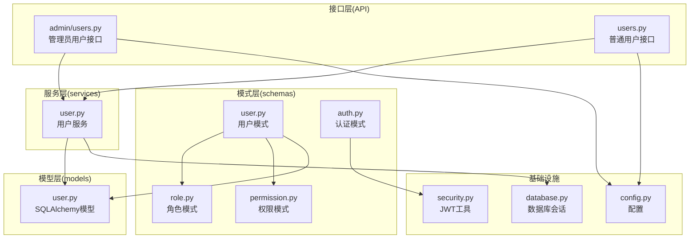
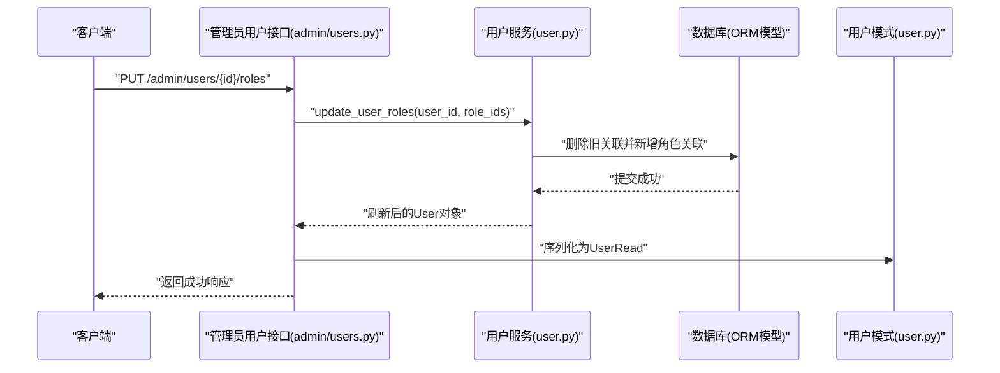
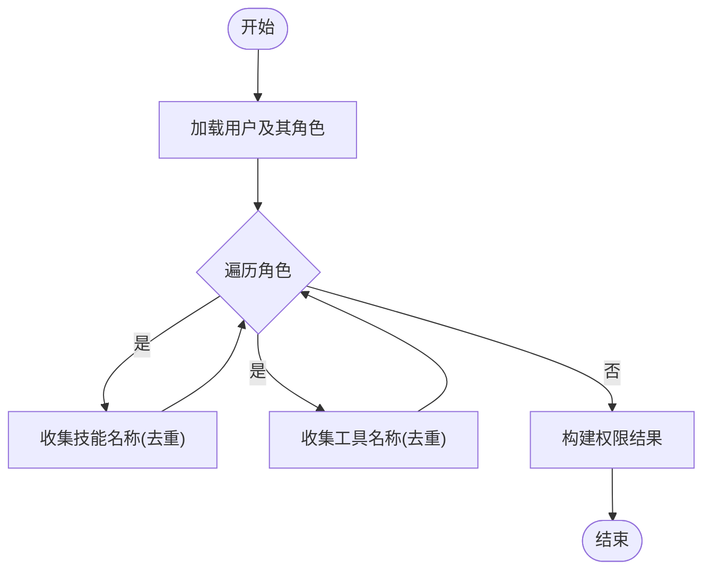
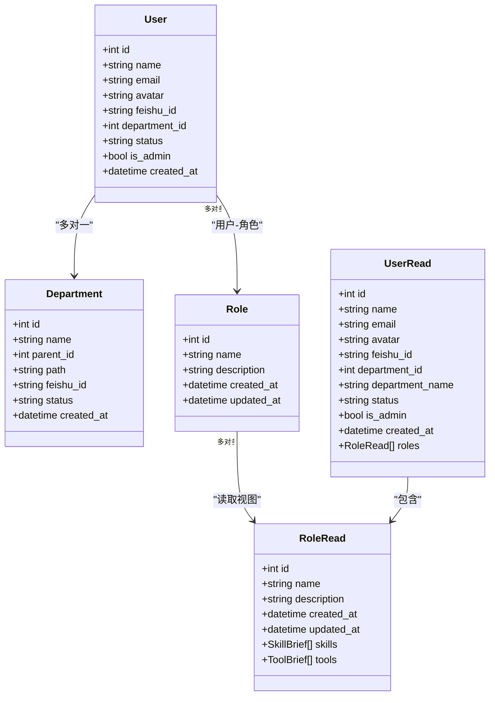
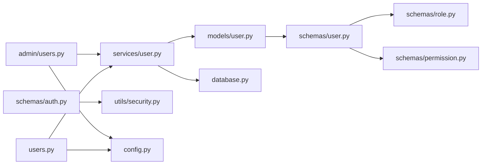

# 用户模式

<cite>
**本文引用的文件**
- [backend/app/schemas/user.py](file://backend/app/schemas/user.py)
- [backend/app/models/user.py](file://backend/app/models/user.py)
- [backend/app/services/user.py](file://backend/app/services/user.py)
- [backend/app/api/admin/users.py](file://backend/app/api/admin/users.py)
- [backend/app/api/users.py](file://backend/app/api/users.py)
- [backend/app/schemas/role.py](file://backend/app/schemas/role.py)
- [backend/app/schemas/permission.py](file://backend/app/schemas/permission.py)
- [backend/app/schemas/auth.py](file://backend/app/schemas/auth.py)
- [backend/app/utils/security.py](file://backend/app/utils/security.py)
- [backend/app/config.py](file://backend/app/config.py)
- [backend/app/database.py](file://backend/app/database.py)
</cite>

## 目录
1. [简介](#简介)
2. [项目结构](#项目结构)
3. [核心组件](#核心组件)
4. [架构总览](#架构总览)
5. [详细组件分析](#详细组件分析)
6. [依赖分析](#依赖分析)
7. [性能考虑](#性能考虑)
8. [故障排查指南](#故障排查指南)
9. [结论](#结论)
10. [附录](#附录)

## 简介
本文件聚焦于ToolHub用户模式的数据验证与使用规范，围绕Pydantic模型UserBase、UserRead、UserRoleUpdate、UserStatusUpdate等进行系统化说明。内容涵盖：
- 用户基本信息字段的定义、数据类型与约束
- 用户创建与更新场景下的验证差异与字段可选性
- 飞书用户ID与部门关联、状态管理与权限继承机制
- 模型间关系与最佳实践
- 与角色、权限系统的集成方式

## 项目结构
用户模式相关代码分布于schemas、models、services、api等模块，并与认证、权限、配置等子系统协同工作。

**图示来源**
- [backend/app/schemas/user.py:1-67](file://backend/app/schemas/user.py#L1-L67)
- [backend/app/schemas/role.py:1-43](file://backend/app/schemas/role.py#L1-L43)
- [backend/app/schemas/permission.py:1-56](file://backend/app/schemas/permission.py#L1-L56)
- [backend/app/schemas/auth.py:1-26](file://backend/app/schemas/auth.py#L1-L26)
- [backend/app/models/user.py:1-116](file://backend/app/models/user.py#L1-L116)
- [backend/app/services/user.py:1-86](file://backend/app/services/user.py#L1-L86)
- [backend/app/api/admin/users.py:1-97](file://backend/app/api/admin/users.py#L1-L97)
- [backend/app/api/users.py:1-29](file://backend/app/api/users.py#L1-L29)
- [backend/app/config.py:1-42](file://backend/app/config.py#L1-L42)
- [backend/app/database.py:1-25](file://backend/app/database.py#L1-L25)
- [backend/app/utils/security.py:1-32](file://backend/app/utils/security.py#L1-L32)

**章节来源**
- [backend/app/schemas/user.py:1-67](file://backend/app/schemas/user.py#L1-L67)
- [backend/app/models/user.py:1-116](file://backend/app/models/user.py#L1-L116)
- [backend/app/services/user.py:1-86](file://backend/app/services/user.py#L1-L86)
- [backend/app/api/admin/users.py:1-97](file://backend/app/api/admin/users.py#L1-L97)
- [backend/app/api/users.py:1-29](file://backend/app/api/users.py#L1-L29)
- [backend/app/schemas/role.py:1-43](file://backend/app/schemas/role.py#L1-L43)
- [backend/app/schemas/permission.py:1-56](file://backend/app/schemas/permission.py#L1-L56)
- [backend/app/schemas/auth.py:1-26](file://backend/app/schemas/auth.py#L1-L26)
- [backend/app/utils/security.py:1-32](file://backend/app/utils/security.py#L1-L32)
- [backend/app/config.py:1-42](file://backend/app/config.py#L1-L42)
- [backend/app/database.py:1-25](file://backend/app/database.py#L1-L25)

## 核心组件
本节对用户模式的关键Pydantic模型进行逐项解析，明确字段、类型、默认值与验证规则，并说明其在系统中的职责。

- UserBase
  - 字段：name、email、avatar（可选）
  - 用途：作为用户信息的基础载体，用于创建与更新流程中的通用字段集合
  - 验证要点：name必填；email可选；avatar可选
  - 复杂度：O(1)，仅字段校验
  - 参考路径：[backend/app/schemas/user.py:27-31](file://backend/app/schemas/user.py#L27-L31)

- UserRead
  - 字段：id、feishu_id、department_id、department_name、status、is_admin、created_at、roles（可选）
  - 用途：对外返回的用户完整视图，包含部门与角色信息
  - 验证要点：status默认“active”；is_admin默认false；roles为RoleRead列表（延迟导入）
  - 复杂度：O(n)（n为角色数量），序列化时展开角色
  - 参考路径：[backend/app/schemas/user.py:33-43](file://backend/app/schemas/user.py#L33-L43)

- UserBrief
  - 字段：id、name、email、avatar（可选）
  - 用途：轻量级用户信息展示，常用于列表或上下文提示
  - 验证要点：字段均为可选或基础类型
  - 复杂度：O(1)
  - 参考路径：[backend/app/schemas/user.py:46-52](file://backend/app/schemas/user.py#L46-L52)

- UserRoleUpdate
  - 字段：role_ids（整数列表）
  - 用途：批量更新用户的角色分配
  - 验证要点：role_ids非空时需确保每个元素为整数且存在对应角色
  - 复杂度：O(m)（m为role_ids长度），服务层循环插入
  - 参考路径：[backend/app/schemas/user.py:55-57](file://backend/app/schemas/user.py#L55-L57)

- UserStatusUpdate
  - 字段：status（字符串）
  - 用途：更新用户状态（如“active/inactive”）
  - 验证要点：status枚举值应限定为允许集合
  - 复杂度：O(1)
  - 参考路径：[backend/app/schemas/user.py:59-61](file://backend/app/schemas/user.py#L59-L61)

- DepartmentBase/DepartmentRead/DepartmentTree
  - 字段：name、parent_id、path（可选）；DepartmentRead扩展id、feishu_id、status、created_at；DepartmentTree递归包含children
  - 用途：部门层级与树形结构建模
  - 验证要点：feishu_id唯一且可索引；status枚举；path为层级路径
  - 复杂度：树形遍历取决于层级深度
  - 参考路径：[backend/app/schemas/user.py:6-24](file://backend/app/schemas/user.py#L6-L24)

- RoleRead
  - 字段：id、name、description、created_at、updated_at、skills、tools（可选）
  - 用途：角色读取视图，包含技能与工具简要信息
  - 验证要点：from_attributes启用ORM映射
  - 复杂度：O(k)（k为技能与工具数量）
  - 参考路径：[backend/app/schemas/role.py:20-27](file://backend/app/schemas/role.py#L20-L27)

- UserPermissions
  - 字段：skills（技能名列表）、tools（工具名列表）
  - 用途：用户权限聚合结果（基于角色继承）
  - 验证要点：列表元素为字符串
  - 复杂度：O(p)（p为角色关联的技能与工具总数）
  - 参考路径：[backend/app/schemas/permission.py:51-56](file://backend/app/schemas/permission.py#L51-L56)

**章节来源**
- [backend/app/schemas/user.py:27-67](file://backend/app/schemas/user.py#L27-L67)
- [backend/app/schemas/role.py:20-27](file://backend/app/schemas/role.py#L20-L27)
- [backend/app/schemas/permission.py:51-56](file://backend/app/schemas/permission.py#L51-L56)

## 架构总览
用户模式在系统中的交互链路如下：API接收请求，经由服务层调用数据库模型，最终通过模式层进行序列化输出。

**图示来源**
- [backend/app/api/admin/users.py:67-81](file://backend/app/api/admin/users.py#L67-L81)
- [backend/app/services/user.py:35-52](file://backend/app/services/user.py#L35-L52)
- [backend/app/schemas/user.py:33-43](file://backend/app/schemas/user.py#L33-L43)

**章节来源**
- [backend/app/api/admin/users.py:67-81](file://backend/app/api/admin/users.py#L67-L81)
- [backend/app/services/user.py:35-52](file://backend/app/services/user.py#L35-L52)
- [backend/app/schemas/user.py:33-43](file://backend/app/schemas/user.py#L33-L43)

## 详细组件分析

### 用户基本信息字段与约束
- 字段清单与类型
  - name: 必填字符串，最大长度见模型定义
  - email: 可选字符串，邮箱格式建议在上层校验（如API层）
  - avatar: 可选字符串，头像URL
  - feishu_id: 可选字符串，唯一索引，用于飞书用户关联
  - department_id: 可选整数，外键关联部门
  - status: 默认“active”，枚举值限定
  - is_admin: 布尔，默认false
  - created_at: 时间戳，自动填充
- 数据类型与约束
  - SQLAlchemy模型中字段具备长度、唯一性、外键、枚举等约束
  - Pydantic模型通过类型注解与from_attributes实现ORM映射
- 字段可选性与默认值
  - UserBase中name必填，email/avtar可选
  - UserRead中feishu_id、department_id、department_name、roles可选；status默认“active”；is_admin默认false
- 飞书ID关联
  - feishu_id在模型层唯一且可索引，便于外部系统对接
- 状态管理
  - status枚举控制用户启用/停用，服务层提供更新接口
- 权限继承
  - 用户通过多对多关系关联角色，角色再关联技能与工具，形成权限聚合

**章节来源**
- [backend/app/models/user.py:23-40](file://backend/app/models/user.py#L23-L40)
- [backend/app/schemas/user.py:27-43](file://backend/app/schemas/user.py#L27-L43)

### 用户创建与更新的验证差异
- 创建流程
  - 使用UserBase作为输入载体，name必填，email/avtar可选
  - 服务层将UserBase转换为模型并持久化，不包含roles与status（默认active）
- 更新流程
  - 支持部分字段更新：email、avatar、department_id等
  - 角色更新通过UserRoleUpdate批量替换
  - 状态更新通过UserStatusUpdate修改
- 字段可选性处理
  - 对于可选字段，若未提供则保持不变
  - 批量角色更新采用“先清后增”的策略，确保一致性
- 密码加密存储机制
  - 当前仓库未发现用户密码字段与加密逻辑，建议在实际实现中引入密码哈希（如bcrypt）并在创建/更新时进行加密存储

**章节来源**
- [backend/app/schemas/user.py:27-61](file://backend/app/schemas/user.py#L27-L61)
- [backend/app/services/user.py:35-52](file://backend/app/services/user.py#L35-L52)

### 用户状态管理与权限继承
- 状态管理
  - 服务层提供update_user_status接口，支持“active/inactive”
  - 状态变更记录审计日志
- 权限继承
  - 用户-角色-技能-工具三层继承关系
  - 服务层聚合用户所有角色对应的技能与工具名称，去重后返回
- 接口访问
  - 普通用户可通过/me/permissions与/me/roles获取自身权限与角色

**图示来源**
- [backend/app/services/user.py:66-82](file://backend/app/services/user.py#L66-L82)
- [backend/app/schemas/permission.py:51-56](file://backend/app/schemas/permission.py#L51-L56)

**章节来源**
- [backend/app/services/user.py:55-82](file://backend/app/services/user.py#L55-L82)
- [backend/app/api/users.py:12-29](file://backend/app/api/users.py#L12-L29)
- [backend/app/schemas/permission.py:51-56](file://backend/app/schemas/permission.py#L51-L56)

### 飞书用户ID关联
- 字段定义
  - User模型与Department模型均包含feishu_id字段，唯一且可索引
- 使用场景
  - 与飞书OAuth2流程结合，实现第三方身份打通
  - 在认证流程中，可通过feishu_id快速定位用户
- 安全与一致性
  - 唯一性约束避免重复绑定
  - 建议在认证回调中校验飞书返回的用户信息并写入feishu_id

**章节来源**
- [backend/app/models/user.py:27-16](file://backend/app/models/user.py#L27-L16)
- [backend/app/schemas/auth.py:18-20](file://backend/app/schemas/auth.py#L18-L20)

### 模式关系与最佳实践
- 模式关系
  - UserRead依赖RoleRead（延迟导入），通过model_rebuild完成重建
  - User与Department为一对多关系，User与Role为多对多关系
- 最佳实践
  - 输入校验：在API层对email等字段进行格式校验
  - 输出安全：避免泄露敏感字段；必要时使用UserBrief进行列表展示
  - 批量操作：角色更新采用“清空-重建”策略，保证幂等性
  - 权限查询：使用服务层聚合函数，避免在接口层直接遍历ORM对象
  - 飞书集成：在认证流程中生成Token并携带is_admin标识，便于前端判断

**图示来源**
- [backend/app/models/user.py:23-53](file://backend/app/models/user.py#L23-L53)
- [backend/app/schemas/user.py:33-43](file://backend/app/schemas/user.py#L33-L43)
- [backend/app/schemas/role.py:20-27](file://backend/app/schemas/role.py#L20-L27)

**章节来源**
- [backend/app/models/user.py:23-53](file://backend/app/models/user.py#L23-L53)
- [backend/app/schemas/user.py:33-43](file://backend/app/schemas/user.py#L33-L43)
- [backend/app/schemas/role.py:20-27](file://backend/app/schemas/role.py#L20-L27)

## 依赖分析
- 组件耦合
  - API层依赖服务层；服务层依赖模型层；模式层依赖角色与权限模式
- 外部依赖
  - JWT工具用于认证令牌生成与解析
  - 配置模块提供数据库与飞书OAuth2参数
- 循环依赖
  - 用户模式通过延迟导入RoleRead，避免循环导入问题

**图示来源**
- [backend/app/api/admin/users.py:1-97](file://backend/app/api/admin/users.py#L1-L97)
- [backend/app/api/users.py:1-29](file://backend/app/api/users.py#L1-L29)
- [backend/app/services/user.py:1-86](file://backend/app/services/user.py#L1-L86)
- [backend/app/models/user.py:1-116](file://backend/app/models/user.py#L1-L116)
- [backend/app/schemas/user.py:63-67](file://backend/app/schemas/user.py#L63-L67)
- [backend/app/schemas/role.py:38-42](file://backend/app/schemas/role.py#L38-L42)
- [backend/app/schemas/permission.py:1-56](file://backend/app/schemas/permission.py#L1-L56)
- [backend/app/schemas/auth.py:1-26](file://backend/app/schemas/auth.py#L1-L26)
- [backend/app/utils/security.py:1-32](file://backend/app/utils/security.py#L1-L32)
- [backend/app/config.py:1-42](file://backend/app/config.py#L1-L42)
- [backend/app/database.py:1-25](file://backend/app/database.py#L1-L25)

**章节来源**
- [backend/app/api/admin/users.py:1-97](file://backend/app/api/admin/users.py#L1-L97)
- [backend/app/api/users.py:1-29](file://backend/app/api/users.py#L1-L29)
- [backend/app/services/user.py:1-86](file://backend/app/services/user.py#L1-L86)
- [backend/app/models/user.py:1-116](file://backend/app/models/user.py#L1-L116)
- [backend/app/schemas/user.py:63-67](file://backend/app/schemas/user.py#L63-L67)
- [backend/app/schemas/role.py:38-42](file://backend/app/schemas/role.py#L38-L42)
- [backend/app/schemas/permission.py:1-56](file://backend/app/schemas/permission.py#L1-L56)
- [backend/app/schemas/auth.py:1-26](file://backend/app/schemas/auth.py#L1-L26)
- [backend/app/utils/security.py:1-32](file://backend/app/utils/security.py#L1-L32)
- [backend/app/config.py:1-42](file://backend/app/config.py#L1-L42)
- [backend/app/database.py:1-25](file://backend/app/database.py#L1-L25)

## 性能考虑
- 查询优化
  - 列表查询支持分页与关键词过滤，建议在数据库层面建立索引（如email、feishu_id）
- 序列化开销
  - UserRead包含roles列表，序列化时需注意避免N+1查询；建议在服务层预加载关联
- 权限聚合
  - 聚合过程使用集合去重，时间复杂度与角色数量线性相关；建议缓存热点用户的权限结果

## 故障排查指南
- 常见错误与处理
  - 用户不存在：服务层抛出异常，接口返回错误响应
  - 角色ID无效：服务层忽略不存在的角色，建议在API层进行前置校验
  - 状态枚举非法：服务层拒绝非法状态，建议在API层限制枚举值
- 日志与审计
  - 管理员操作会记录审计日志，便于追踪角色分配与状态变更
- 认证问题
  - JWT解析失败或过期：检查密钥、算法与过期时间配置

**章节来源**
- [backend/app/api/admin/users.py:75-96](file://backend/app/api/admin/users.py#L75-L96)
- [backend/app/services/user.py:38-62](file://backend/app/services/user.py#L38-L62)
- [backend/app/utils/security.py:20-31](file://backend/app/utils/security.py#L20-L31)
- [backend/app/config.py:20-23](file://backend/app/config.py#L20-L23)

## 结论
本文系统梳理了ToolHub用户模式的字段定义、验证规则、状态管理与权限继承机制，并给出了与角色、权限、认证、配置等模块的集成方案与最佳实践。建议在后续实现中补充密码加密、输入格式校验与缓存策略，以进一步提升安全性与性能。

## 附录
- 使用示例与最佳实践
  - 获取当前用户权限：调用/me/permissions接口，服务层聚合用户角色对应的技能与工具名称
  - 获取当前用户角色：调用/me/roles接口，返回角色简要信息
  - 分配用户角色：管理员调用/admin/users/{id}/roles，传入role_ids数组
  - 更新用户状态：管理员调用/admin/users/{id}/status，传入status字段
- 关键路径参考
  - 权限聚合：[backend/app/services/user.py:66-82](file://backend/app/services/user.py#L66-L82)
  - 角色分配：[backend/app/services/user.py:35-52](file://backend/app/services/user.py#L35-L52)
  - 状态更新：[backend/app/services/user.py:55-63](file://backend/app/services/user.py#L55-L63)
  - 接口定义：[backend/app/api/users.py:12-29](file://backend/app/api/users.py#L12-L29)、[backend/app/api/admin/users.py:67-96](file://backend/app/api/admin/users.py#L67-L96)