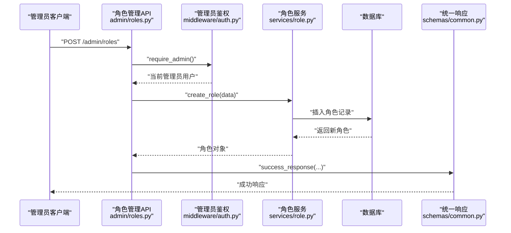
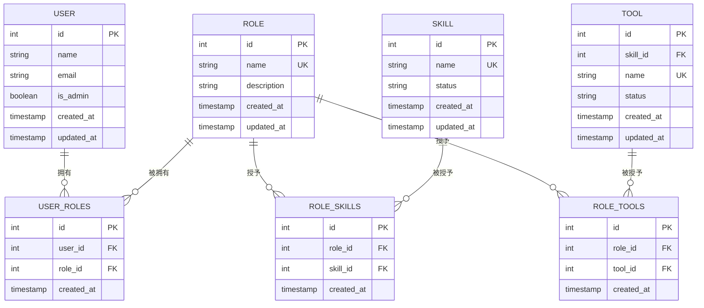
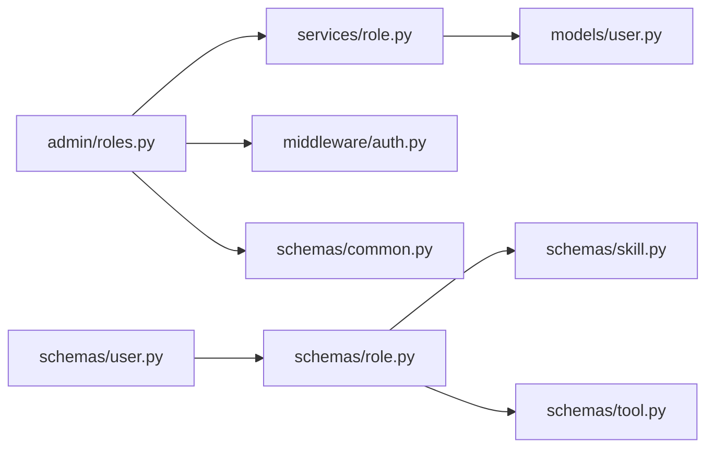

# 角色模式

<cite>
**本文引用的文件**
- [backend/app/schemas/role.py](file://backend/app/schemas/role.py)
- [backend/app/models/user.py](file://backend/app/models/user.py)
- [backend/app/services/role.py](file://backend/app/services/role.py)
- [backend/app/api/admin/roles.py](file://backend/app/api/admin/roles.py)
- [backend/app/middleware/auth.py](file://backend/app/middleware/auth.py)
- [backend/app/schemas/common.py](file://backend/app/schemas/common.py)
- [backend/app/schemas/user.py](file://backend/app/schemas/user.py)
- [backend/app/schemas/skill.py](file://backend/app/schemas/skill.py)
- [backend/app/schemas/tool.py](file://backend/app/schemas/tool.py)
</cite>

## 目录
1. [简介](#简介)
2. [项目结构](#项目结构)
3. [核心组件](#核心组件)
4. [架构总览](#架构总览)
5. [详细组件分析](#详细组件分析)
6. [依赖分析](#依赖分析)
7. [性能考虑](#性能考虑)
8. [故障排查指南](#故障排查指南)
9. [结论](#结论)
10. [附录：配置示例与使用场景](#附录配置示例与使用场景)

## 简介
本文件面向ToolHub系统中的“角色模式”，围绕Pydantic模型RoleBase、RoleCreate、RoleUpdate、RoleRead以及权限分配模型RoleSkillAssign、RoleToolAssign进行系统化数据验证与行为说明。重点涵盖：
- 角色基本信息字段的定义、数据类型与验证规则
- 权限分配（技能与工具）的模型设计与校验
- 角色与用户、技能、工具之间的多对多关系
- 管理员权限控制与审计日志集成
- 动态权限计算与权限矩阵的实现思路
- 常见问题排查与最佳实践

## 项目结构
角色模式涉及的后端模块分布如下：
- 模型层：角色、用户、技能、工具及其关联表
- 服务层：角色增删改查与权限分配逻辑
- 接口层：管理员端角色管理API
- 中间件：管理员鉴权
- 公共响应：统一返回格式

```mermaid
graph TB
subgraph "接口层"
R["角色管理API<br/>admin/roles.py"]
end
subgraph "服务层"
S["角色服务<br/>services/role.py"]
end
subgraph "模型层"
M1["角色模型<br/>models/user.py: Role"]
M2["用户模型<br/>models/user.py: User"]
M3["技能模型<br/>models/user.py: Skill"]
M4["工具模型<br/>models/user.py: Tool"]
M5["角色-技能关联<br/>models/user.py: RoleSkill"]
M6["角色-工具关联<br/>models/user.py: RoleTool"]
end
subgraph "模式层"
P1["角色模式<br/>schemas/role.py"]
P2["用户模式<br/>schemas/user.py"]
P3["技能模式<br/>schemas/skill.py"]
P4["工具模式<br/>schemas/tool.py"]
end
subgraph "中间件与公共"
W["管理员鉴权<br/>middleware/auth.py"]
C["统一响应<br/>schemas/common.py"]
end
R --> S
S --> M1
S --> M5
S --> M6
R --> W
R --> C
P1 --> P3
P1 --> P4
M1 < --> M2
M1 < --> M3
M1 < --> M4
```

图表来源
- [backend/app/api/admin/roles.py:1-111](file://backend/app/api/admin/roles.py#L1-L111)
- [backend/app/services/role.py:1-78](file://backend/app/services/role.py#L1-L78)
- [backend/app/models/user.py:41-116](file://backend/app/models/user.py#L41-L116)
- [backend/app/schemas/role.py:1-43](file://backend/app/schemas/role.py#L1-L43)
- [backend/app/schemas/user.py:1-67](file://backend/app/schemas/user.py#L1-L67)
- [backend/app/schemas/skill.py:1-45](file://backend/app/schemas/skill.py#L1-L45)
- [backend/app/schemas/tool.py:1-51](file://backend/app/schemas/tool.py#L1-L51)
- [backend/app/middleware/auth.py:1-45](file://backend/app/middleware/auth.py#L1-L45)
- [backend/app/schemas/common.py:1-29](file://backend/app/schemas/common.py#L1-L29)

章节来源
- [backend/app/api/admin/roles.py:1-111](file://backend/app/api/admin/roles.py#L1-L111)
- [backend/app/services/role.py:1-78](file://backend/app/services/role.py#L1-L78)
- [backend/app/models/user.py:41-116](file://backend/app/models/user.py#L41-L116)
- [backend/app/schemas/role.py:1-43](file://backend/app/schemas/role.py#L1-L43)
- [backend/app/schemas/user.py:1-67](file://backend/app/schemas/user.py#L1-L67)
- [backend/app/schemas/skill.py:1-45](file://backend/app/schemas/skill.py#L1-L45)
- [backend/app/schemas/tool.py:1-51](file://backend/app/schemas/tool.py#L1-L51)
- [backend/app/middleware/auth.py:1-45](file://backend/app/middleware/auth.py#L1-L45)
- [backend/app/schemas/common.py:1-29](file://backend/app/schemas/common.py#L1-L29)

## 核心组件
- 角色基础模型
  - RoleBase：包含角色名称与可选描述，作为创建/读取的基础
  - RoleCreate：继承自RoleBase，用于创建角色时的输入校验
  - RoleUpdate：允许部分字段更新（名称、描述），用于更新角色
  - RoleRead：在RoleBase基础上增加标识符、时间戳与关联资源（技能、工具）简述，并启用from_attributes以支持ORM对象直接序列化
- 权限分配模型
  - RoleSkillAssign：包含技能ID列表，用于批量分配技能权限
  - RoleToolAssign：包含工具ID列表，用于批量分配工具权限
- 关联模型与关系
  - 用户-角色：多对多，通过中间表user_roles维护
  - 角色-技能：多对多，通过中间表role_skills维护
  - 角色-工具：多对多，通过中间表role_tools维护

章节来源
- [backend/app/schemas/role.py:6-43](file://backend/app/schemas/role.py#L6-L43)
- [backend/app/models/user.py:41-116](file://backend/app/models/user.py#L41-L116)

## 架构总览
角色模式在系统中的工作流如下：
- 管理员通过鉴权中间件获取当前用户并校验管理员身份
- 调用角色服务执行角色增删改查与权限分配
- 服务层操作数据库，更新角色与其关联的技能/工具
- API层返回统一响应格式



图表来源
- [backend/app/api/admin/roles.py:35-47](file://backend/app/api/admin/roles.py#L35-L47)
- [backend/app/middleware/auth.py:36-44](file://backend/app/middleware/auth.py#L36-L44)
- [backend/app/services/role.py:18-24](file://backend/app/services/role.py#L18-L24)
- [backend/app/schemas/common.py:23-28](file://backend/app/schemas/common.py#L23-L28)

## 详细组件分析

### Pydantic模型设计与验证规则
- RoleBase
  - 字段：name（字符串）、description（可选字符串）
  - 验证：基于Pydantic的字段类型与非空约束；name必填且非空
- RoleCreate
  - 继承RoleBase，用于创建流程的输入校验
- RoleUpdate
  - 支持部分字段更新：name（可选）、description（可选）
  - 验证：仅当提供对应字段时才更新，避免误更新
- RoleRead
  - 扩展字段：id、created_at、updated_at
  - 关联字段：skills（技能简述列表）、tools（工具简述列表）
  - from_attributes启用：可直接从ORM对象序列化
- RoleSkillAssign / RoleToolAssign
  - 字段：skill_ids（技能ID列表）、tool_ids（工具ID列表）
  - 验证：列表元素为整数ID，用于批量赋权

章节来源
- [backend/app/schemas/role.py:6-43](file://backend/app/schemas/role.py#L6-L43)

### 数据模型与关系映射
- 角色-用户：多对多，通过user_roles中间表
- 角色-技能：多对多，通过role_skills中间表
- 角色-工具：多对多，通过role_tools中间表
- 用户模型中包含is_admin布尔字段，用于管理员判定
- 技能与工具模型包含状态字段，影响权限有效性



图表来源
- [backend/app/models/user.py:41-116](file://backend/app/models/user.py#L41-L116)

章节来源
- [backend/app/models/user.py:41-116](file://backend/app/models/user.py#L41-L116)

### 权限分配与动态权限计算
- 技能权限分配
  - 通过RoleSkillAssign提供技能ID列表，服务层先清空旧分配，再逐条写入新分配
  - 分配完成后刷新角色对象，确保后续查询包含最新权限
- 工具权限分配
  - 通过RoleToolAssign提供工具ID列表，服务层同上处理
- 动态权限计算
  - 当前代码未直接实现“动态权限计算”逻辑，但可通过以下方式扩展：
    - 在用户读取模型中引入has_permission字段（参考技能与工具模式），在查询用户权限时按角色-技能/工具关系进行聚合
    - 在服务层新增“根据用户角色集合计算其可用技能/工具”的函数，结合数据库查询与缓存策略
  - 权限矩阵建议
    - 以角色ID为行，技能/工具ID为列，构建布尔矩阵，便于快速判断某角色是否具备某权限
    - 结合状态字段过滤无效权限（如技能/工具状态为非active）

章节来源
- [backend/app/services/role.py:48-74](file://backend/app/services/role.py#L48-L74)
- [backend/app/schemas/skill.py:40-44](file://backend/app/schemas/skill.py#L40-L44)
- [backend/app/schemas/tool.py:46-50](file://backend/app/schemas/tool.py#L46-L50)

### 管理员角色特殊处理与权限范围限制
- 管理员鉴权
  - require_admin中间件在获取当前用户后检查is_admin字段，非管理员将拒绝访问
- 权限范围
  - 角色管理API均依赖管理员权限，确保只有管理员可进行角色创建、修改、删除与权限分配
- 审计日志
  - API层在成功操作后记录审计日志，便于追踪管理员行为

章节来源
- [backend/app/middleware/auth.py:36-44](file://backend/app/middleware/auth.py#L36-L44)
- [backend/app/api/admin/roles.py:35-110](file://backend/app/api/admin/roles.py#L35-L110)

### 角色分配策略
- 单角色分配
  - 用户-角色为多对多，可通过用户模式中的UserRoleUpdate提供role_ids列表进行批量替换
- 多角色组合
  - 用户可同时拥有多个角色，权限叠加；具体叠加策略需在业务层定义（例如：任一角色满足即通过）
- 清空与重置
  - 角色权限分配采用“清空旧记录、写入新记录”的策略，确保权限集合的确定性

章节来源
- [backend/app/schemas/user.py:55-57](file://backend/app/schemas/user.py#L55-L57)
- [backend/app/services/role.py:48-74](file://backend/app/services/role.py#L48-L74)

### 角色模式与用户模式、权限模式的交互
- 用户模式
  - UserRead包含roles字段，展示用户所拥有的角色信息
  - 用户模型包含is_admin字段，决定管理员权限
- 技能/工具模式
  - 技能与工具模式提供has_permission字段，可用于动态权限判断
  - 角色-技能/工具关系由中间表维护，形成权限矩阵
- 权限请求模式
  - 权限请求模型用于用户申请技能/工具权限，与角色权限形成互补

章节来源
- [backend/app/schemas/user.py:33-43](file://backend/app/schemas/user.py#L33-L43)
- [backend/app/schemas/skill.py:40-44](file://backend/app/schemas/skill.py#L40-L44)
- [backend/app/schemas/tool.py:46-50](file://backend/app/schemas/tool.py#L46-L50)
- [backend/app/models/permission.py:7-27](file://backend/app/models/permission.py#L7-L27)

## 依赖分析
- 模块耦合
  - API层依赖服务层与中间件；服务层依赖模型层；模式层依赖其他模式（如技能、工具简述）
- 可能的循环依赖
  - 角色模式与用户模式存在相互引用（UserRead引用RoleRead，RoleRead引用SkillBrief/ToolBrief），通过延迟导入与model_rebuild解决
- 外部依赖
  - FastAPI路由装饰器、SQLAlchemy ORM、Pydantic模型



图表来源
- [backend/app/api/admin/roles.py:1-111](file://backend/app/api/admin/roles.py#L1-L111)
- [backend/app/services/role.py:1-78](file://backend/app/services/role.py#L1-L78)
- [backend/app/models/user.py:41-116](file://backend/app/models/user.py#L41-L116)
- [backend/app/middleware/auth.py:1-45](file://backend/app/middleware/auth.py#L1-L45)
- [backend/app/schemas/common.py:1-29](file://backend/app/schemas/common.py#L1-L29)
- [backend/app/schemas/role.py:38-43](file://backend/app/schemas/role.py#L38-L43)
- [backend/app/schemas/user.py:63-67](file://backend/app/schemas/user.py#L63-L67)
- [backend/app/schemas/skill.py:1-45](file://backend/app/schemas/skill.py#L1-L45)
- [backend/app/schemas/tool.py:1-51](file://backend/app/schemas/tool.py#L1-L51)

章节来源
- [backend/app/api/admin/roles.py:1-111](file://backend/app/api/admin/roles.py#L1-L111)
- [backend/app/services/role.py:1-78](file://backend/app/services/role.py#L1-L78)
- [backend/app/models/user.py:41-116](file://backend/app/models/user.py#L41-L116)
- [backend/app/schemas/role.py:38-43](file://backend/app/schemas/role.py#L38-L43)
- [backend/app/schemas/user.py:63-67](file://backend/app/schemas/user.py#L63-L67)

## 性能考虑
- 批量权限分配
  - 清空旧记录再批量写入，适合中低频变更场景；高频变更建议使用差异对比与增量更新
- 查询优化
  - 在用户读取时一次性加载角色、技能、工具关联，减少N+1查询
  - 对常用查询建立索引（如角色名唯一索引、用户-角色关联索引）
- 缓存策略
  - 将角色-技能/工具矩阵放入缓存，降低重复计算成本
- 序列化开销
  - 使用from_attributes可减少额外转换逻辑，提升序列化效率

## 故障排查指南
- 角色不存在
  - 更新/删除/分配权限时若角色不存在，服务层抛出异常；API层捕获并返回错误响应
- 非管理员访问
  - 管理员鉴权失败会返回403 Forbidden；确认用户is_admin字段与令牌有效性
- 权限分配异常
  - 分配技能/工具时若传入非法ID或数据库约束冲突，需检查ID合法性与目标对象状态
- 审计日志缺失
  - 确认审计服务已正确初始化并可写入数据库

章节来源
- [backend/app/services/role.py:28-46](file://backend/app/services/role.py#L28-L46)
- [backend/app/api/admin/roles.py:50-110](file://backend/app/api/admin/roles.py#L50-L110)
- [backend/app/middleware/auth.py:36-44](file://backend/app/middleware/auth.py#L36-L44)

## 结论
角色模式通过简洁的Pydantic模型与清晰的服务层职责划分，实现了角色管理与权限分配的核心能力。配合管理员鉴权与审计日志，保障了系统的安全性与可追溯性。未来可在动态权限计算与权限矩阵方面进一步增强，以支持更复杂的权限策略与高性能查询。

## 附录：配置示例与使用场景
- 创建角色
  - 输入：RoleCreate（name、description）
  - 输出：包含id与name的成功响应
- 更新角色
  - 输入：RoleUpdate（name、description）
  - 行为：仅更新提供的字段
- 删除角色
  - 输入：角色ID
  - 行为：删除角色并记录审计日志
- 分配技能权限
  - 输入：RoleSkillAssign（skill_ids）
  - 行为：清空旧分配并写入新分配
- 分配工具权限
  - 输入：RoleToolAssign（tool_ids）
  - 行为：清空旧分配并写入新分配
- 使用场景
  - 新员工入职：为其分配默认角色与基础权限
  - 临时项目：为其分配临时角色与特定工具权限
  - 权限回收：撤销离职员工的角色与权限

章节来源
- [backend/app/api/admin/roles.py:14-110](file://backend/app/api/admin/roles.py#L14-L110)
- [backend/app/schemas/role.py:11-36](file://backend/app/schemas/role.py#L11-L36)
- [backend/app/schemas/common.py:23-28](file://backend/app/schemas/common.py#L23-L28)