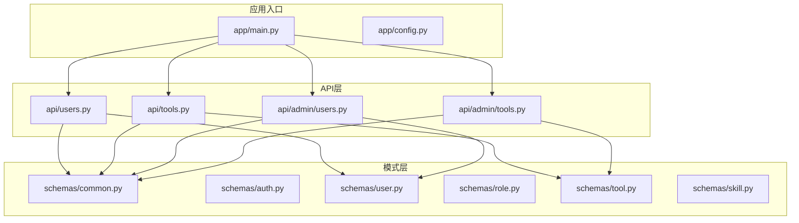
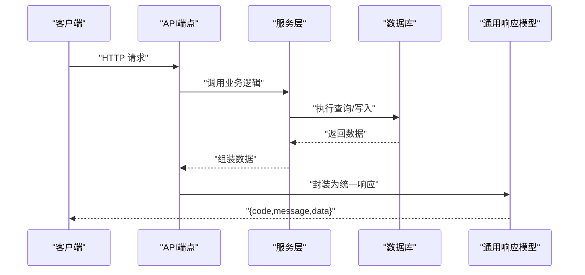
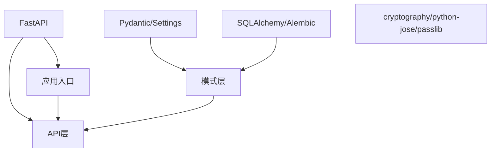

# 通用模式

<cite>
**本文引用的文件**
- [common.py](file://backend/app/schemas/common.py)
- [auth.py](file://backend/app/schemas/auth.py)
- [user.py](file://backend/app/schemas/user.py)
- [role.py](file://backend/app/schemas/role.py)
- [tool.py](file://backend/app/schemas/tool.py)
- [skill.py](file://backend/app/schemas/skill.py)
- [users.py](file://backend/app/api/users.py)
- [tools.py](file://backend/app/api/tools.py)
- [admin_users.py](file://backend/app/api/admin/users.py)
- [admin_tools.py](file://backend/app/api/admin/tools.py)
- [main.py](file://backend/app/main.py)
- [config.py](file://backend/app/config.py)
- [pyproject.toml](file://backend/pyproject.toml)
</cite>

## 目录
1. [引言](#引言)
2. [项目结构](#项目结构)
3. [核心组件](#核心组件)
4. [架构总览](#架构总览)
5. [详细组件分析](#详细组件分析)
6. [依赖分析](#依赖分析)
7. [性能考虑](#性能考虑)
8. [故障排查指南](#故障排查指南)
9. [结论](#结论)
10. [附录](#附录)

## 引言
本文件围绕ToolHub后端的“通用模式”进行系统化梳理与说明，重点覆盖以下方面：
- 通用数据结构：基础响应模型、分页模型、错误响应模型
- 字段定义、数据类型转换与序列化规则
- 分页查询参数、排序字段、过滤条件的标准化处理
- 错误处理机制、异常类型定义与国际化支持现状
- 在各API中的使用示例与最佳实践
- 通用模式如何简化其他模式的设计与维护

## 项目结构
后端采用FastAPI + SQLAlchemy架构，模式（schemas）集中于backend/app/schemas目录，API路由位于backend/app/api目录，应用入口与配置位于backend/app/main.py与backend/app/config.py。

图表来源
- [main.py:1-62](file://backend/app/main.py#L1-L62)
- [common.py:1-29](file://backend/app/schemas/common.py#L1-L29)
- [users.py:1-29](file://backend/app/api/users.py#L1-L29)
- [tools.py:1-69](file://backend/app/api/tools.py#L1-L69)
- [admin_users.py:1-97](file://backend/app/api/admin/users.py#L1-L97)
- [admin_tools.py:1-89](file://backend/app/api/admin/tools.py#L1-L89)

章节来源
- [main.py:1-62](file://backend/app/main.py#L1-L62)
- [config.py:1-42](file://backend/app/config.py#L1-L42)

## 核心组件
本节聚焦“通用模式”的三大基石：基础响应模型、分页模型、错误响应模型，并说明其在各API中的统一使用方式。

- 基础响应模型
  - 字段：code、message、data
  - 默认值：code默认0表示成功；message默认“success”；data默认None
  - 使用场景：所有API统一返回格式，便于前端一致处理
  - 参考路径：[基础响应模型定义:17-21](file://backend/app/schemas/common.py#L17-L21)

- 分页模型
  - 字段：items、total、page、page_size
  - 使用场景：列表接口统一返回分页结果
  - 参考路径：[分页模型定义:10-14](file://backend/app/schemas/common.py#L10-L14)

- 分页查询参数
  - 字段：page、page_size、keyword、skill_id、status等（按需扩展）
  - 约束：page≥1；page_size通常有最小/最大限制（如1~100）
  - 参考路径：
    - [工具列表分页参数:14-17](file://backend/app/api/tools.py#L14-L17)
    - [管理员工具列表分页参数:16-20](file://backend/app/api/admin/tools.py#L16-L20)
    - [管理员用户列表分页参数:16-18](file://backend/app/api/admin/users.py#L16-L18)

- 成功/失败响应工厂函数
  - success_response：封装成功响应
  - error_response：封装失败响应
  - 参考路径：
    - [成功响应工厂:23-24](file://backend/app/schemas/common.py#L23-L24)
    - [失败响应工厂:27-28](file://backend/app/schemas/common.py#L27-L28)

- 在API中的统一使用
  - 用户相关API：返回统一响应模型
    - [用户权限接口:12-19](file://backend/app/api/users.py#L12-L19)
    - [用户角色接口:22-28](file://backend/app/api/users.py#L22-L28)
  - 工具相关API：返回统一响应模型与分页数据
    - [工具列表接口:12-42](file://backend/app/api/tools.py#L12-L42)
    - [管理员工具列表接口:14-42](file://backend/app/api/admin/tools.py#L14-L42)
  - 管理员用户接口：统一成功/失败响应
    - [管理员用户列表接口:14-39](file://backend/app/api/admin/users.py#L14-L39)
    - [管理员用户详情接口:42-64](file://backend/app/api/admin/users.py#L42-L64)
    - [管理员用户角色分配接口:67-80](file://backend/app/api/admin/users.py#L67-L80)
    - [管理员用户状态更新接口:83-96](file://backend/app/api/admin/users.py#L83-L96)

章节来源
- [common.py:1-29](file://backend/app/schemas/common.py#L1-L29)
- [users.py:1-29](file://backend/app/api/users.py#L1-L29)
- [tools.py:1-69](file://backend/app/api/tools.py#L1-L69)
- [admin_users.py:1-97](file://backend/app/api/admin/users.py#L1-L97)
- [admin_tools.py:1-89](file://backend/app/api/admin/tools.py#L1-L89)

## 架构总览
通用模式贯穿“模式层→服务层→API层→客户端”的全链路，确保：
- 模式层：以Pydantic模型定义数据结构与校验规则
- API层：统一使用通用响应模型与分页模型
- 客户端：基于统一的响应结构进行展示与交互

图表来源
- [common.py:17-28](file://backend/app/schemas/common.py#L17-L28)
- [tools.py:12-69](file://backend/app/api/tools.py#L12-L69)
- [admin_tools.py:14-89](file://backend/app/api/admin/tools.py#L14-L89)

## 详细组件分析

### 通用响应模型与工厂函数
- 设计要点
  - 统一字段：code、message、data
  - 默认值：成功码0、默认消息“success”
  - 工厂函数：success_response与error_response用于快速构造标准响应
- 数据类型与序列化
  - code为整数；message为字符串；data可为任意类型（对象、数组、字典等）
  - Pydantic自动进行类型校验与序列化
- 使用建议
  - 成功场景优先使用success_response
  - 失败场景使用error_response并传入明确的错误码与消息
- 参考路径
  - [通用响应模型:17-21](file://backend/app/schemas/common.py#L17-L21)
  - [成功/失败工厂函数:23-28](file://backend/app/schemas/common.py#L23-L28)

章节来源
- [common.py:17-28](file://backend/app/schemas/common.py#L17-L28)

### 分页模型与分页参数
- 分页模型
  - items：列表项
  - total：总数
  - page、page_size：当前页与每页大小
- 分页参数标准化
  - page≥1
  - page_size常见范围：如1~100
  - 支持关键字搜索keyword、分类筛选skill_id/status等
- 参考路径
  - [分页模型:10-14](file://backend/app/schemas/common.py#L10-L14)
  - [工具列表分页参数:14-17](file://backend/app/api/tools.py#L14-L17)
  - [管理员工具列表分页参数:16-20](file://backend/app/api/admin/tools.py#L16-L20)
  - [管理员用户列表分页参数:16-18](file://backend/app/api/admin/users.py#L16-L18)

章节来源
- [common.py:10-14](file://backend/app/schemas/common.py#L10-L14)
- [tools.py:14-17](file://backend/app/api/tools.py#L14-L17)
- [admin_tools.py:16-20](file://backend/app/api/admin/tools.py#L16-L20)
- [admin_users.py:16-18](file://backend/app/api/admin/users.py#L16-L18)

### 错误处理机制与异常类型
- 错误响应
  - 使用error_response构造统一错误响应
  - 建议包含明确的错误码与可读消息
- 异常捕获与映射
  - 在管理员工具接口中，捕获ValueError并返回错误响应
  - 参考路径：[管理员工具更新接口异常处理:68-73](file://backend/app/api/admin/tools.py#L68-L73)
- 国际化支持现状
  - 当前未见专门的国际化实现或多语言资源文件
  - 建议后续引入i18n方案并在error_response中支持本地化消息键
- 参考路径
  - [错误响应工厂:27-28](file://backend/app/schemas/common.py#L27-L28)
  - [管理员用户状态更新异常处理:91-96](file://backend/app/api/admin/users.py#L91-L96)

章节来源
- [common.py:27-28](file://backend/app/schemas/common.py#L27-L28)
- [admin_tools.py:68-73](file://backend/app/api/admin/tools.py#L68-L73)
- [admin_users.py:91-96](file://backend/app/api/admin/users.py#L91-L96)

### 模式层数据结构与类型转换
- 用户相关模式
  - DepartmentBase/Read：部门基础与读取模型
  - UserBase/Read/Brief：用户基础、完整读取、简要读取模型
  - UserStatusUpdate/UserRoleUpdate：用户状态与角色更新模型
  - 参考路径：
    - [用户模式定义:6-67](file://backend/app/schemas/user.py#L6-L67)
- 角色相关模式
  - RoleBase/Create/Update/Read：角色基础、创建、更新、读取模型
  - RoleSkillAssign/RoleToolAssign：角色与技能/工具关联模型
  - 参考路径：
    - [角色模式定义:6-43](file://backend/app/schemas/role.py#L6-L43)
- 工具相关模式
  - ToolBase/Create/Update/Read/Brief/WithPermission：工具基础、创建、更新、读取、简要、带权限读取模型
  - 参考路径：
    - [工具模式定义:6-51](file://backend/app/schemas/tool.py#L6-L51)
- 技能相关模式
  - SkillBase/Create/Update/Read/Brief/WithPermission：技能基础、创建、更新、读取、简要、带权限读取模型
  - 参考路径：
    - [技能模式定义:6-45](file://backend/app/schemas/skill.py#L6-L45)
- 类型转换与序列化
  - 所有模式均继承自Pydantic BaseModel，具备自动类型校验与JSON序列化能力
  - model_config设置from_attributes=True以支持ORM对象直接解析
  - 参考路径：
    - [用户模式from_attributes配置:18-43](file://backend/app/schemas/user.py#L18-L43)
    - [角色模式from_attributes配置:27-42](file://backend/app/schemas/role.py#L27-L42)
    - [工具模式from_attributes配置:36-50](file://backend/app/schemas/tool.py#L36-L50)
    - [技能模式from_attributes配置:30-44](file://backend/app/schemas/skill.py#L30-L44)

章节来源
- [user.py:6-67](file://backend/app/schemas/user.py#L6-L67)
- [role.py:6-43](file://backend/app/schemas/role.py#L6-L43)
- [tool.py:6-51](file://backend/app/schemas/tool.py#L6-L51)
- [skill.py:6-45](file://backend/app/schemas/skill.py#L6-L45)

### API层中的通用模式使用示例
- 用户权限与角色接口
  - 返回统一响应模型，data为权限列表或角色数组
  - 参考路径：
    - [用户权限接口:12-19](file://backend/app/api/users.py#L12-L19)
    - [用户角色接口:22-28](file://backend/app/api/users.py#L22-L28)
- 工具列表与详情接口
  - 列表接口返回分页数据（items、total、page、page_size），并附加has_permission等业务字段
  - 详情接口返回单个工具信息，不存在时返回空数据
  - 参考路径：
    - [工具列表接口:12-42](file://backend/app/api/tools.py#L12-L42)
    - [工具详情接口:45-69](file://backend/app/api/tools.py#L45-L69)
- 管理员工具管理接口
  - 列表、创建、更新、删除均使用统一响应模型
  - 更新与删除异常捕获并返回错误响应
  - 参考路径：
    - [管理员工具列表接口:14-42](file://backend/app/api/admin/tools.py#L14-L42)
    - [管理员工具创建接口:45-57](file://backend/app/api/admin/tools.py#L45-L57)
    - [管理员工具更新接口:60-73](file://backend/app/api/admin/tools.py#L60-L73)
    - [管理员工具删除接口:76-88](file://backend/app/api/admin/tools.py#L76-L88)
- 管理员用户管理接口
  - 列表、详情、角色分配、状态更新均使用统一响应模型
  - 异常捕获并返回错误响应
  - 参考路径：
    - [管理员用户列表接口:14-39](file://backend/app/api/admin/users.py#L14-L39)
    - [管理员用户详情接口:42-64](file://backend/app/api/admin/users.py#L42-L64)
    - [管理员用户角色分配接口:67-80](file://backend/app/api/admin/users.py#L67-L80)
    - [管理员用户状态更新接口:83-96](file://backend/app/api/admin/users.py#L83-L96)

章节来源
- [users.py:12-28](file://backend/app/api/users.py#L12-L28)
- [tools.py:12-69](file://backend/app/api/tools.py#L12-L69)
- [admin_tools.py:14-88](file://backend/app/api/admin/tools.py#L14-L88)
- [admin_users.py:14-96](file://backend/app/api/admin/users.py#L14-L96)

### 最佳实践
- 统一响应
  - 所有API必须返回统一响应模型，避免混用不同格式
  - 成功场景使用success_response，失败场景使用error_response
- 分页规范
  - 列表接口必须返回items、total、page、page_size
  - 对page与page_size设置合理边界约束
- 错误处理
  - 明确错误码与消息，必要时记录审计日志
  - 对外暴露的错误信息应保持简洁且可理解
- 模式设计
  - 基于Pydantic模型定义清晰的字段与类型
  - 使用model_config(from_attributes=True)提升ORM集成效率
- 前向引用与模型重建
  - 对循环引用的模型使用前向引用并在末尾调用model_rebuild()

章节来源
- [common.py:17-28](file://backend/app/schemas/common.py#L17-L28)
- [tools.py:14-17](file://backend/app/api/tools.py#L14-L17)
- [admin_tools.py:68-73](file://backend/app/api/admin/tools.py#L68-L73)
- [user.py:18-67](file://backend/app/schemas/user.py#L18-L67)
- [role.py:27-43](file://backend/app/schemas/role.py#L27-L43)
- [tool.py:36-51](file://backend/app/schemas/tool.py#L36-L51)
- [skill.py:30-45](file://backend/app/schemas/skill.py#L30-L45)

## 依赖分析
- 框架与库
  - FastAPI：Web框架与路由
  - Pydantic/Pydantic Settings：数据校验与配置管理
  - SQLAlchemy/Alembic：ORM与迁移
  - cryptography/python-jose/passlib：安全与认证
- 项目版本与脚本
  - Python版本要求：>=3.13
  - 应用脚本：toolhub指向app.main:main
- 参考路径
  - [依赖声明与版本:7-20](file://backend/pyproject.toml#L7-L20)
  - [应用脚本定义:22-23](file://backend/pyproject.toml#L22-L23)

图表来源
- [pyproject.toml:7-20](file://backend/pyproject.toml#L7-L20)
- [main.py:1-62](file://backend/app/main.py#L1-L62)

章节来源
- [pyproject.toml:1-31](file://backend/pyproject.toml#L1-L31)
- [main.py:1-62](file://backend/app/main.py#L1-L62)

## 性能考虑
- 响应序列化
  - Pydantic自动序列化，建议避免在响应中传递大型嵌套对象
- 分页策略
  - 合理设置page_size上限，防止一次性返回过多数据
  - 对高频查询建立索引，优化keyword与skill_id/status等过滤字段
- ORM映射
  - 使用from_attributes=True可减少显式字段映射开销
- 缓存与去重
  - 对只读列表接口可考虑缓存热点数据（需结合业务场景）

## 故障排查指南
- 常见问题
  - 响应格式不一致：检查是否使用了success_response或error_response
  - 分页参数越界：确认page≥1且page_size在允许范围内
  - 422校验错误：核对Pydantic模型字段类型与必填项
- 排查步骤
  - 查看API端点是否正确调用通用响应工厂
  - 核对分页参数约束与服务层查询逻辑
  - 检查异常捕获与错误消息返回
- 参考路径
  - [通用响应工厂:23-28](file://backend/app/schemas/common.py#L23-L28)
  - [工具列表分页参数约束:14-17](file://backend/app/api/tools.py#L14-L17)
  - [管理员工具更新异常处理:68-73](file://backend/app/api/admin/tools.py#L68-L73)

章节来源
- [common.py:23-28](file://backend/app/schemas/common.py#L23-L28)
- [tools.py:14-17](file://backend/app/api/tools.py#L14-L17)
- [admin_tools.py:68-73](file://backend/app/api/admin/tools.py#L68-L73)

## 结论
通用模式通过统一的响应模型、分页模型与工厂函数，显著降低了API层的重复工作量，提升了前后端协作效率与系统一致性。配合Pydantic模式层的强类型校验与ORM集成，整体架构具备良好的可维护性与扩展性。建议后续在错误消息国际化、分页排序字段标准化、审计日志规范化等方面持续演进。

## 附录
- 配置与运行
  - 应用名称与版本：参考配置文件
  - CORS跨域：预设多个开发环境域名
  - 运行命令：通过toolhub脚本启动
- 参考路径
  - [应用配置:11-42](file://backend/app/config.py#L11-L42)
  - [应用入口与路由注册:9-49](file://backend/app/main.py#L9-L49)
  - [应用脚本:22-23](file://backend/pyproject.toml#L22-L23)

章节来源
- [config.py:11-42](file://backend/app/config.py#L11-L42)
- [main.py:9-49](file://backend/app/main.py#L9-L49)
- [pyproject.toml:22-23](file://backend/pyproject.toml#L22-L23)