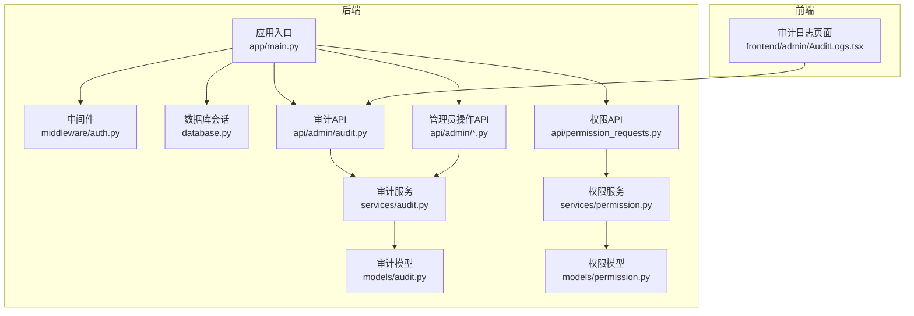
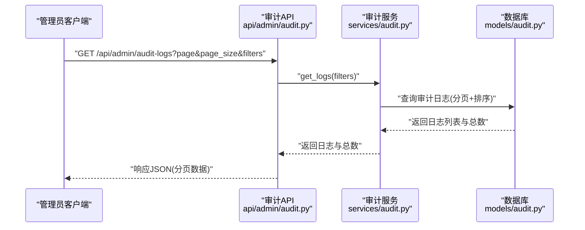
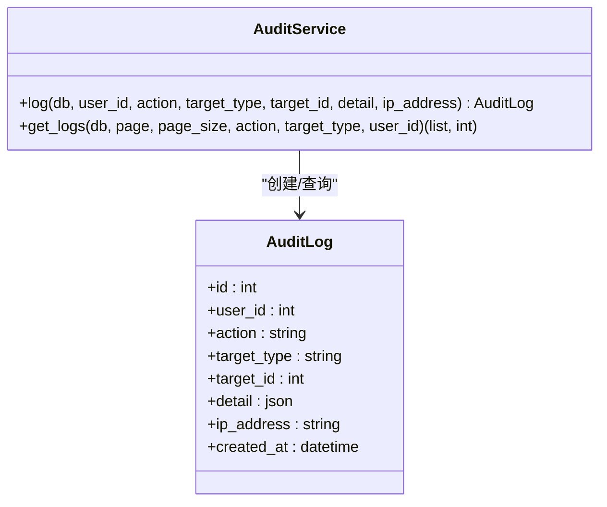
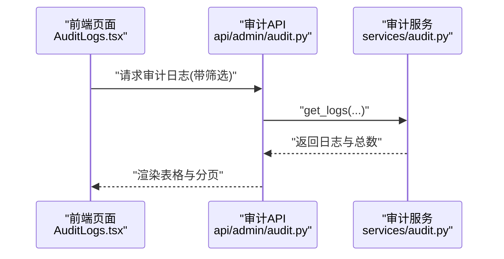
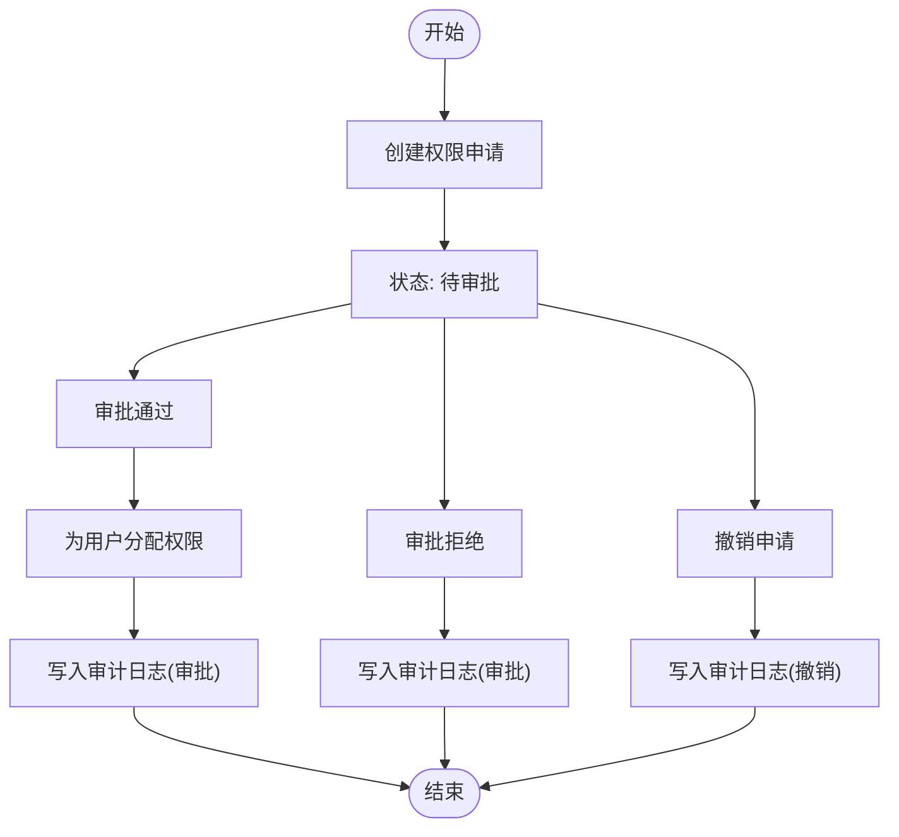
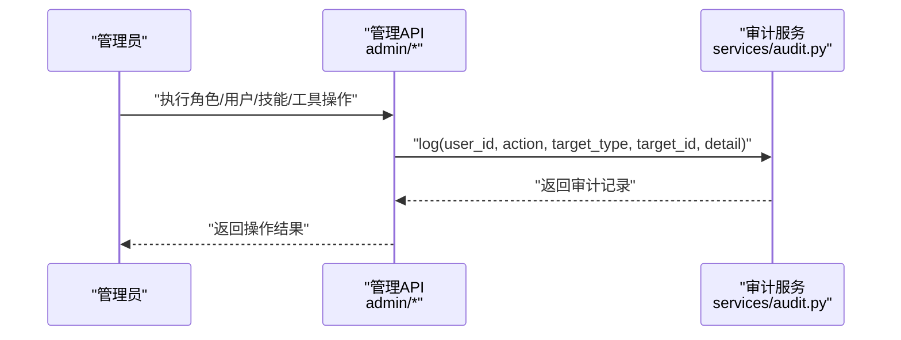
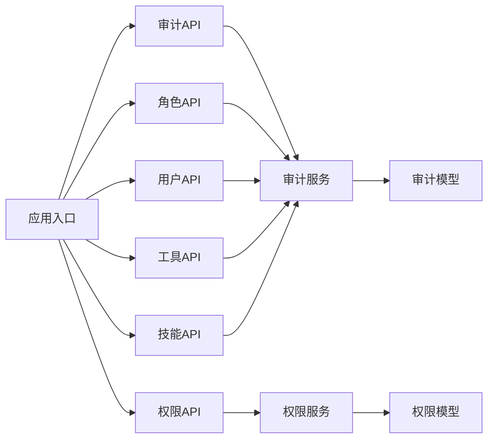

# 审计日志系统

<cite>
**本文引用的文件**
- [backend/app/models/audit.py](file://backend/app/models/audit.py)
- [backend/app/services/audit.py](file://backend/app/services/audit.py)
- [backend/app/api/admin/audit.py](file://backend/app/api/admin/audit.py)
- [backend/app/api/admin/roles.py](file://backend/app/api/admin/roles.py)
- [backend/app/api/admin/users.py](file://backend/app/api/admin/users.py)
- [backend/app/api/admin/tools.py](file://backend/app/api/admin/tools.py)
- [backend/app/api/admin/skills.py](file://backend/app/api/admin/skills.py)
- [backend/app/api/permission_requests.py](file://backend/app/api/permission_requests.py)
- [backend/app/services/permission.py](file://backend/app/services/permission.py)
- [backend/app/models/permission.py](file://backend/app/models/permission.py)
- [backend/app/middleware/auth.py](file://backend/app/middleware/auth.py)
- [backend/app/database.py](file://backend/app/database.py)
- [backend/app/main.py](file://backend/app/main.py)
- [frontend/admin/src/pages/AuditLogs.tsx](file://frontend/admin/src/pages/AuditLogs.tsx)
</cite>

## 目录
1. [简介](#简介)
2. [项目结构](#项目结构)
3. [核心组件](#核心组件)
4. [架构总览](#架构总览)
5. [详细组件分析](#详细组件分析)
6. [依赖分析](#依赖分析)
7. [性能考虑](#性能考虑)
8. [故障排查指南](#故障排查指南)
9. [结论](#结论)
10. [附录](#附录)

## 简介
本文件为ToolHub审计日志系统的专业功能文档，围绕审计日志的设计理念、实现架构与运维实践展开，重点覆盖以下方面：
- 审计日志记录策略：涵盖管理员操作、权限变更、系统事件与异常捕获
- 存储方案与查询优化：基于SQLAlchemy模型与分页查询的实现要点
- 权限变更追踪：权限申请、审批、授予/撤销、修改的审计流程
- 系统监控指标：可扩展的指标采集与分析建议
- 审计报告与查询接口：后端API与前端展示的实现指南
- 日志清理与隐私保护：容量管理与合规性要求的落地建议

## 项目结构
ToolHub采用前后端分离架构，审计日志能力主要由后端FastAPI服务提供，前端Admin页面负责展示与筛选。

图表来源
- [backend/app/main.py:1-61](file://backend/app/main.py#L1-L61)
- [backend/app/middleware/auth.py:1-45](file://backend/app/middleware/auth.py#L1-L45)
- [backend/app/database.py:1-25](file://backend/app/database.py#L1-L25)
- [backend/app/models/audit.py:1-17](file://backend/app/models/audit.py#L1-L17)
- [backend/app/services/audit.py:1-54](file://backend/app/services/audit.py#L1-L54)
- [backend/app/api/admin/audit.py:1-37](file://backend/app/api/admin/audit.py#L1-L37)
- [backend/app/models/permission.py:1-28](file://backend/app/models/permission.py#L1-L28)
- [backend/app/services/permission.py:1-182](file://backend/app/services/permission.py#L1-L182)
- [backend/app/api/permission_requests.py:1-107](file://backend/app/api/permission_requests.py#L1-L107)
- [frontend/admin/src/pages/AuditLogs.tsx:1-53](file://frontend/admin/src/pages/AuditLogs.tsx#L1-L53)

章节来源
- [backend/app/main.py:1-61](file://backend/app/main.py#L1-L61)
- [frontend/admin/src/pages/AuditLogs.tsx:1-53](file://frontend/admin/src/pages/AuditLogs.tsx#L1-L53)

## 核心组件
- 审计日志模型：定义审计记录的字段与约束，支持用户ID、操作类型、目标类型/ID、详情JSON、IP地址与时间戳。
- 审计服务：封装日志写入与分页查询，提供统一的审计入口。
- 审计API：提供管理员访问的审计日志列表查询接口，支持按操作类型、目标类型、用户ID筛选。
- 权限申请与审批：在权限申请、审批通过/拒绝、撤销等关键节点产生审计日志。
- 管理员操作API：在角色、用户、技能、工具等资源的关键操作中记录审计日志。
- 前端审计页面：提供筛选器与表格展示，支持按操作类型与目标类型过滤。

章节来源
- [backend/app/models/audit.py:1-17](file://backend/app/models/audit.py#L1-L17)
- [backend/app/services/audit.py:1-54](file://backend/app/services/audit.py#L1-L54)
- [backend/app/api/admin/audit.py:1-37](file://backend/app/api/admin/audit.py#L1-L37)
- [backend/app/api/admin/roles.py:1-111](file://backend/app/api/admin/roles.py#L1-L111)
- [backend/app/api/admin/users.py:1-97](file://backend/app/api/admin/users.py#L1-L97)
- [backend/app/api/admin/tools.py:1-89](file://backend/app/api/admin/tools.py#L1-L89)
- [backend/app/api/admin/skills.py:1-85](file://backend/app/api/admin/skills.py#L1-L85)
- [frontend/admin/src/pages/AuditLogs.tsx:1-53](file://frontend/admin/src/pages/AuditLogs.tsx#L1-L53)

## 架构总览
审计日志贯穿“API层-服务层-模型层”的数据流，管理员操作与权限变更均通过服务层调用审计服务写入数据库；前端通过审计API拉取并展示日志。

图表来源
- [backend/app/api/admin/audit.py:12-37](file://backend/app/api/admin/audit.py#L12-L37)
- [backend/app/services/audit.py:32-50](file://backend/app/services/audit.py#L32-L50)
- [backend/app/models/audit.py:6-17](file://backend/app/models/audit.py#L6-L17)

## 详细组件分析

### 审计日志模型与服务
- 数据模型字段设计：包含用户ID、操作类型、目标类型/ID、详情JSON、IP地址与时间戳，便于后续扩展与查询。
- 服务方法：
  - 写入：接收用户ID、操作类型、目标类型/ID、详情与IP，持久化后返回完整记录。
  - 查询：支持按操作类型、目标类型、用户ID过滤，按创建时间倒序分页返回，并返回总数用于前端分页控件。

图表来源
- [backend/app/models/audit.py:6-17](file://backend/app/models/audit.py#L6-L17)
- [backend/app/services/audit.py:6-54](file://backend/app/services/audit.py#L6-L54)

章节来源
- [backend/app/models/audit.py:1-17](file://backend/app/models/audit.py#L1-L17)
- [backend/app/services/audit.py:1-54](file://backend/app/services/audit.py#L1-L54)

### 审计API与前端展示
- 审计API：
  - 路径：/api/admin/audit-logs
  - 方法：GET
  - 参数：page/page_size/filters(action/target_type/user_id)，并校验管理员权限
  - 返回：分页数据与总数
- 前端页面：
  - 提供操作类型与目标类型的下拉筛选器
  - 表格列包含用户ID、操作、目标类型/ID、详情、IP、时间等
  - 支持分页切换与筛选重置

图表来源
- [backend/app/api/admin/audit.py:12-37](file://backend/app/api/admin/audit.py#L12-L37)
- [frontend/admin/src/pages/AuditLogs.tsx:9-53](file://frontend/admin/src/pages/AuditLogs.tsx#L9-L53)

章节来源
- [backend/app/api/admin/audit.py:1-37](file://backend/app/api/admin/audit.py#L1-L37)
- [frontend/admin/src/pages/AuditLogs.tsx:1-53](file://frontend/admin/src/pages/AuditLogs.tsx#L1-L53)

### 权限变更追踪
- 权限申请与审批：
  - 创建申请：提交后返回状态，不直接写入审计日志（避免重复）
  - 审批通过/拒绝：服务层在变更状态时进行权限分配或清理，并返回结果
  - 撤销申请：仅允许待审批状态撤销，成功后返回状态
- 审计触发点：
  - 管理员在角色、用户、技能、工具等资源上的增删改操作，均通过各API调用审计服务写入日志
  - 权限申请与审批流程本身不直接记录审计日志，但可通过“审批”动作在审批API中补充审计

图表来源
- [backend/app/api/permission_requests.py:13-107](file://backend/app/api/permission_requests.py#L13-L107)
- [backend/app/services/permission.py:86-144](file://backend/app/services/permission.py#L86-L144)

章节来源
- [backend/app/api/permission_requests.py:1-107](file://backend/app/api/permission_requests.py#L1-L107)
- [backend/app/services/permission.py:1-182](file://backend/app/services/permission.py#L1-L182)

### 管理员操作日志生成机制
- 角色管理：创建/更新/删除角色、分配技能/工具权限
- 用户管理：分配角色、更新状态
- 技能/工具管理：创建/更新/删除
- 审计触发：上述每个关键操作均调用审计服务记录日志，包含操作类型、目标类型/ID与必要详情

图表来源
- [backend/app/api/admin/roles.py:35-111](file://backend/app/api/admin/roles.py#L35-L111)
- [backend/app/api/admin/users.py:67-97](file://backend/app/api/admin/users.py#L67-L97)
- [backend/app/api/admin/tools.py:45-89](file://backend/app/api/admin/tools.py#L45-L89)
- [backend/app/api/admin/skills.py:41-85](file://backend/app/api/admin/skills.py#L41-L85)
- [backend/app/services/audit.py:10-30](file://backend/app/services/audit.py#L10-L30)

章节来源
- [backend/app/api/admin/roles.py:1-111](file://backend/app/api/admin/roles.py#L1-L111)
- [backend/app/api/admin/users.py:1-97](file://backend/app/api/admin/users.py#L1-L97)
- [backend/app/api/admin/tools.py:1-89](file://backend/app/api/admin/tools.py#L1-L89)
- [backend/app/api/admin/skills.py:1-85](file://backend/app/api/admin/skills.py#L1-L85)
- [backend/app/services/audit.py:1-54](file://backend/app/services/audit.py#L1-L54)

### 异常情况捕获与权限校验
- 管理员权限校验：中间件确保只有管理员可访问审计与管理API
- 操作异常：权限申请/审批/撤销过程中的业务异常通过错误响应返回，不写入审计日志（避免噪声）

章节来源
- [backend/app/middleware/auth.py:36-44](file://backend/app/middleware/auth.py#L36-L44)
- [backend/app/api/permission_requests.py:95-107](file://backend/app/api/permission_requests.py#L95-L107)
- [backend/app/services/permission.py:58-69](file://backend/app/services/permission.py#L58-L69)

## 依赖分析
- 组件耦合：
  - 审计API依赖审计服务；审计服务依赖审计模型与数据库会话
  - 管理员操作API在关键路径上依赖审计服务
  - 权限服务与权限模型相互依赖，审批逻辑影响权限分配
- 外部依赖：
  - FastAPI路由注册于应用入口
  - 数据库引擎与会话工厂集中于数据库模块

图表来源
- [backend/app/api/admin/audit.py:1-37](file://backend/app/api/admin/audit.py#L1-L37)
- [backend/app/services/audit.py:1-54](file://backend/app/services/audit.py#L1-L54)
- [backend/app/models/audit.py:1-17](file://backend/app/models/audit.py#L1-L17)
- [backend/app/api/admin/roles.py:1-111](file://backend/app/api/admin/roles.py#L1-L111)
- [backend/app/api/admin/users.py:1-97](file://backend/app/api/admin/users.py#L1-L97)
- [backend/app/api/admin/tools.py:1-89](file://backend/app/api/admin/tools.py#L1-L89)
- [backend/app/api/admin/skills.py:1-85](file://backend/app/api/admin/skills.py#L1-L85)
- [backend/app/api/permission_requests.py:1-107](file://backend/app/api/permission_requests.py#L1-L107)
- [backend/app/services/permission.py:1-182](file://backend/app/services/permission.py#L1-L182)
- [backend/app/models/permission.py:1-28](file://backend/app/models/permission.py#L1-L28)
- [backend/app/main.py:1-61](file://backend/app/main.py#L1-L61)

章节来源
- [backend/app/main.py:1-61](file://backend/app/main.py#L1-L61)
- [backend/app/database.py:1-25](file://backend/app/database.py#L1-L25)

## 性能考虑
- 分页与排序：审计查询按创建时间倒序分页，避免全表扫描；建议对常用过滤字段建立索引以提升查询效率
- 详情JSON：详情字段为JSON类型，建议控制单条详情大小，避免超大JSON影响查询与序列化性能
- 并发写入：审计写入为单条事务提交，建议结合数据库连接池参数与慢查询日志进行性能评估
- 前端渲染：表格列包含详情JSON字符串化，建议在大数据量场景下限制详情显示范围或延迟加载

## 故障排查指南
- 审计日志为空：
  - 检查管理员权限校验是否生效
  - 确认审计API参数过滤条件是否过于严格
- 查询异常：
  - 检查数据库连接与会话生命周期
  - 关注分页参数边界（page/page_size）
- 权限变更未记录：
  - 确认管理员操作API是否调用了审计服务
  - 检查权限审批流程是否正确返回状态

章节来源
- [backend/app/middleware/auth.py:36-44](file://backend/app/middleware/auth.py#L36-L44)
- [backend/app/api/admin/audit.py:12-37](file://backend/app/api/admin/audit.py#L12-L37)
- [backend/app/database.py:19-25](file://backend/app/database.py#L19-L25)

## 结论
ToolHub审计日志系统以简洁的数据模型与清晰的服务边界实现了对管理员操作与权限变更的可观测性。通过在关键业务路径注入审计服务，系统能够满足合规性与安全审计的基本需求。建议后续在索引优化、日志清理策略与监控指标扩展方面持续完善。

## 附录

### 审计报告生成与日志查询接口实现指南
- 审计报告生成：
  - 基于审计API的筛选能力，可按时间段、操作类型、目标类型导出CSV/Excel
  - 建议增加聚合统计接口（如每日操作次数、失败率等）
- 日志查询接口：
  - 当前接口已支持基础筛选与分页；可扩展更多维度（如IP段、用户组织等）
  - 前端页面提供筛选器与分页控件，便于人工审计与问题定位

章节来源
- [backend/app/api/admin/audit.py:12-37](file://backend/app/api/admin/audit.py#L12-L37)
- [frontend/admin/src/pages/AuditLogs.tsx:9-53](file://frontend/admin/src/pages/AuditLogs.tsx#L9-L53)

### 日志清理策略与存储容量管理
- 清理策略：
  - 建议按保留期限（如1年）定期归档/删除旧日志
  - 对高频操作类型（如登录）可设置更短保留周期
- 存储容量管理：
  - 监控审计表增长趋势，结合数据库压缩与分区策略
  - 控制详情JSON大小，避免冗余字段进入审计详情

### 隐私保护措施
- IP地址与详情字段：建议对敏感信息进行脱敏处理（如IP掩码、详情字段白名单）
- 访问控制：仅管理员可访问审计日志，避免越权查看
- 合规性：遵循最小化原则，仅记录必要的审计信息，满足审计要求